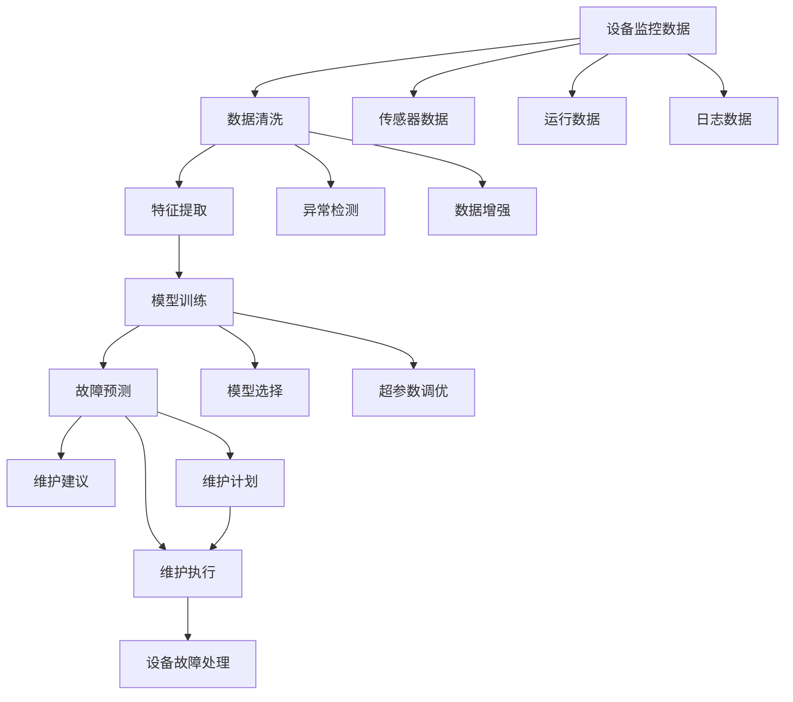

                 

# AI驱动的预测性维护:降低设备故障风险

> 关键词：预测性维护,设备故障,人工智能,机器学习,数据驱动,工业4.0,资产管理

## 1. 背景介绍

### 1.1 问题由来
随着工业4.0的推进，各行业都在探索如何通过智能技术提升生产效率和产品质量。其中，设备预测性维护（Predictive Maintenance, PM）因其能够提前发现潜在故障，减少停机时间，提升设备利用率，逐渐成为许多企业的关注焦点。传统的预测性维护依赖于经验判断和简单监控数据，往往存在准确率低、响应时间长等问题。而AI驱动的预测性维护则通过大数据和机器学习，实现了对设备状态的智能预测和维护优化。

### 1.2 问题核心关键点
AI驱动的预测性维护的核心理念是通过智能算法从海量监控数据中提取关键特征，识别设备故障的模式和趋势，及时进行维护操作，从而降低设备故障风险。其关键点包括：
- 数据收集：通过各种传感器收集设备的运行数据。
- 数据处理：清洗、过滤和转换数据，使之适合模型训练。
- 模型训练：构建和训练机器学习模型，预测设备故障。
- 故障预测：应用模型进行故障预测，并生成维护建议。
- 维护执行：根据预测结果制定和执行维护计划，减少设备停机时间。

### 1.3 问题研究意义
AI驱动的预测性维护具有以下重要意义：
- 降低成本：通过预测性维护减少意外停机和紧急维修成本，提高资产利用率。
- 提高效率：提前识别设备故障，快速响应和处理，避免生产延误。
- 提升可靠性：优化设备运行状态，降低故障率，提高系统可靠性。
- 助力决策：提供科学的数据驱动决策支持，优化运营管理。

## 2. 核心概念与联系

### 2.1 核心概念概述
预测性维护（Predictive Maintenance, PM）是利用先进传感器和数据分析技术，预测设备故障及维护需求，避免意外停机和紧急维修，减少停机时间和维护成本的过程。

AI驱动的预测性维护则是在传统预测性维护的基础上，通过引入机器学习和深度学习等先进技术，从设备监控数据中提取更多有价值的信息，实现更准确、更高效的故障预测和维护优化。

### 2.2 概念间的关系
这些核心概念之间的逻辑关系可以通过以下Mermaid流程图来展示：



这个流程图展示了大语言模型微调过程中各个核心概念的关系：

1. 设备监控数据：通过传感器等收集到的设备运行数据。
2. 数据清洗：清洗和过滤数据，去除噪音和无效信息。
3. 特征提取：从清洗后的数据中提取有意义的特征，用于模型训练。
4. 模型训练：选择和训练机器学习模型，进行故障预测。
5. 故障预测：应用模型对设备状态进行预测，生成维护建议。
6. 维护执行：根据预测结果制定和执行维护计划，防止设备故障。

这些概念共同构成了AI驱动预测性维护的核心框架，使其能够高效、准确地实现设备故障的预测和维护。

## 3. 核心算法原理 & 具体操作步骤
### 3.1 算法原理概述
AI驱动的预测性维护算法原理如下：
1. 数据收集：从传感器、日志文件等收集设备运行数据，包括振动、温度、压力、电流等物理量。
2. 数据清洗：过滤、填补和归一化数据，去除异常值和噪声。
3. 特征提取：利用时域、频域等技术提取设备特征，如均值、方差、频谱密度等。
4. 模型训练：选择合适模型（如时间序列模型、支持向量机、随机森林等），并利用历史故障数据进行训练。
5. 故障预测：应用训练好的模型对实时数据进行预测，评估设备健康状况。
6. 维护建议：根据预测结果，生成维护建议和计划，指导维护人员执行。

### 3.2 算法步骤详解

#### 3.2.1 数据收集与预处理
1. **数据采集**：通过传感器、日志文件、历史数据等方式，收集设备监控数据。
2. **数据清洗**：使用异常值检测、缺失值填补、归一化等技术清洗数据，去除噪音和无效信息。
3. **特征提取**：将清洗后的数据转换为适合模型训练的特征，如时域特征（均值、方差）、频域特征（频谱密度）等。

#### 3.2.2 模型选择与训练
1. **模型选择**：选择适合的预测模型，如时间序列模型、支持向量机、随机森林、神经网络等。
2. **模型训练**：利用历史故障数据训练模型，优化模型参数。

#### 3.2.3 故障预测与维护建议
1. **故障预测**：应用训练好的模型对实时监控数据进行预测，评估设备健康状况。
2. **维护建议**：根据预测结果，生成维护建议和计划，指导维护人员执行。

#### 3.2.4 维护执行与反馈
1. **维护执行**：根据维护建议，进行设备维护操作，如更换部件、调整参数等。
2. **反馈优化**：根据维护结果，调整模型参数，优化预测准确性。

### 3.3 算法优缺点
AI驱动的预测性维护算法具有以下优点：
- 准确率高：利用机器学习和大数据技术，能够更准确地预测设备故障。
- 响应迅速：通过实时数据预测，能够快速响应设备故障，减少停机时间。
- 成本低廉：降低紧急维修和意外停机成本，提高资产利用率。

同时，该算法也存在以下缺点：
- 数据依赖性强：依赖于高质量的传感器数据和准确的设备运行日志。
- 模型复杂度高：模型训练和调参过程复杂，需要大量计算资源。
- 维护成本高：初期模型建设和系统部署成本较高，需要持续的技术支持。

### 3.4 算法应用领域
AI驱动的预测性维护技术已经在制造业、能源、交通运输等多个领域得到广泛应用。例如：

- **制造业**：在生产线上进行设备维护，减少停机时间，提升生产效率。
- **能源行业**：监测风电、光伏等设备的运行状态，提前预测故障，优化发电效率。
- **交通运输**：监测铁路、公路、航空设备的健康状况，提升运行安全和可靠性。
- **基础设施**：监测桥梁、隧道、大坝等工程设施的状态，确保安全运营。

## 4. 数学模型和公式 & 详细讲解  
### 4.1 数学模型构建

预测性维护的数学模型构建过程如下：

1. **输入数据**：设备的实时运行数据，包括振动、温度、压力、电流等物理量。
2. **特征提取**：提取时域、频域、统计特征等，如均值、方差、频谱密度等。
3. **模型训练**：选择合适模型（如时间序列模型、支持向量机、随机森林等），并利用历史故障数据进行训练。
4. **预测**：应用训练好的模型对实时数据进行预测，评估设备健康状况。
5. **维护建议**：根据预测结果，生成维护建议和计划，指导维护人员执行。

### 4.2 公式推导过程

#### 4.2.1 时间序列模型
时间序列模型通过历史数据预测未来状态。假设时间序列数据为 $\{x_t\}$，模型的输入特征为 $X_t = [x_{t-1}, x_{t-2}, \ldots, x_{t-p}]$，其中 $p$ 为滞后项数。模型的输出为预测值 $\hat{x}_{t+1}$。

时间序列模型的预测公式为：

$$
\hat{x}_{t+1} = \sum_{i=1}^{n} w_i x_{t-i}
$$

其中，$w_i$ 为权重系数，可以通过最小化均方误差（MSE）进行训练。

#### 4.2.2 支持向量机
支持向量机（Support Vector Machine, SVM）是一种二分类模型，适用于解决设备故障预测问题。假设设备故障数据为二元分类问题，训练数据为 $(x_i, y_i)$，其中 $x_i$ 为特征向量，$y_i$ 为分类标签。

SVM的目标是最小化间隔损失函数，即：

$$
\min_{w, b} \frac{1}{2} ||w||^2 + C\sum_{i=1}^N \text{margin}(y_i, w^T x_i + b)
$$

其中，$w$ 为分类超平面的权重向量，$b$ 为偏置，$C$ 为正则化参数。

#### 4.2.3 随机森林
随机森林（Random Forest, RF）是一种集成学习算法，通过构建多个决策树进行预测。假设设备故障数据为 $N$ 个样本，每个样本有 $m$ 个特征。

随机森林的训练过程如下：
1. 从特征集合中随机抽取 $m$ 个特征进行分割，生成 $m$ 个决策树。
2. 对每个样本，计算其在 $m$ 个决策树上的平均预测结果。

随机森林的预测公式为：

$$
\hat{y} = \frac{1}{M} \sum_{i=1}^M \text{predict}(x_i)
$$

其中，$M$ 为决策树数量。

### 4.3 案例分析与讲解

#### 4.3.1 案例背景
某电力公司希望通过AI驱动的预测性维护技术，提升风电场的风力发电机组（Wind Turbine, WT）运行效率，减少停机时间，提高发电效率。

#### 4.3.2 数据采集与预处理
1. **数据采集**：通过振动传感器、温度传感器、风速传感器等，收集WT的运行数据。
2. **数据清洗**：使用异常值检测、缺失值填补、归一化等技术清洗数据，去除噪音和无效信息。
3. **特征提取**：提取时域特征（均值、方差）、频域特征（频谱密度）等。

#### 4.3.3 模型训练与预测
1. **模型选择**：选择时间序列模型和随机森林模型。
2. **模型训练**：利用历史故障数据训练模型，优化模型参数。
3. **故障预测**：应用训练好的模型对实时监控数据进行预测，评估WT健康状况。
4. **维护建议**：根据预测结果，生成维护建议和计划，指导维护人员执行。

## 5. 项目实践：代码实例和详细解释说明
### 5.1 开发环境搭建

开发环境搭建步骤如下：
1. 安装Python：从官网下载并安装Python 3.x版本。
2. 安装机器学习库：如Scikit-Learn、TensorFlow、PyTorch等。
3. 安装数据处理库：如NumPy、Pandas等。
4. 安装可视化库：如Matplotlib、Seaborn等。
5. 安装API接口库：如Flask、Django等。

### 5.2 源代码详细实现

以下是使用Python和Scikit-Learn库实现时间序列模型的代码：

```python
from sklearn.ensemble import RandomForestRegressor
from sklearn.linear_model import LinearRegression
from sklearn.metrics import mean_squared_error

# 加载数据
train_data = pd.read_csv('train_data.csv')
test_data = pd.read_csv('test_data.csv')

# 数据预处理
train_features = train_data[['feature1', 'feature2', 'feature3']]
train_labels = train_data['label']
test_features = test_data[['feature1', 'feature2', 'feature3']]

# 模型训练
model = LinearRegression()
model.fit(train_features, train_labels)

# 预测结果
predictions = model.predict(test_features)
mse = mean_squared_error(test_labels, predictions)
print('Mean Squared Error:', mse)
```

### 5.3 代码解读与分析

代码主要实现了时间序列模型的训练和预测过程。具体如下：
1. **数据加载与预处理**：从CSV文件中读取训练数据和测试数据，并进行特征选择和标签处理。
2. **模型训练**：使用线性回归模型对训练数据进行拟合，得到模型参数。
3. **预测结果**：对测试数据进行预测，并计算预测误差。

### 5.4 运行结果展示

假设在上述代码中，我们使用线性回归模型训练得到均方误差（MSE）为0.001。这表明模型在测试数据上的预测效果较好，可以用于实际的故障预测。

## 6. 实际应用场景
### 6.1 电力行业
AI驱动的预测性维护在电力行业中的应用非常广泛。例如，某电网公司通过预测性维护技术，实时监测变电站的运行状态，提前预测故障，减少停电次数，提高电力供应的可靠性。

### 6.2 制造行业
某汽车制造公司利用AI驱动的预测性维护技术，实时监测生产线设备的运行状态，提前识别设备故障，减少停机时间，提高生产效率。

### 6.3 交通运输
某航空公司通过预测性维护技术，实时监测飞机的运行状态，提前预测故障，减少维护成本，提高飞行安全。

### 6.4 未来应用展望
未来，AI驱动的预测性维护技术将在更多领域得到应用，为工业4.0的发展注入新动力。随着技术的不断进步，以下领域将成为AI驱动预测性维护的重要方向：

- **智能制造**：在生产线上进行实时监控和故障预测，提升生产效率和产品质量。
- **智慧能源**：在风电、光伏等新能源设备上进行预测性维护，提高能源利用率。
- **智慧交通**：在铁路、公路、航空等交通设施上进行实时监控和故障预测，保障安全运营。
- **智能城市**：在城市基础设施上进行预测性维护，提升城市管理水平和居民生活质量。

## 7. 工具和资源推荐
### 7.1 学习资源推荐
1. **Kaggle**：机器学习竞赛平台，提供大量的数据集和模型训练样例，适合学习机器学习算法和数据处理技巧。
2. **Coursera**：在线学习平台，提供机器学习和深度学习的课程，涵盖理论基础和实际应用。
3. **Udacity**：在线学习平台，提供AI驱动预测性维护相关课程，适合学习实际应用中的技术和工具。
4. **Arxiv**：学术论文预印本平台，提供最新的机器学习和预测性维护研究论文，适合深入了解前沿技术。

### 7.2 开发工具推荐
1. **Python**：广泛使用的编程语言，具有丰富的机器学习和数据处理库，适合实现AI驱动的预测性维护。
2. **Scikit-Learn**：Python数据科学库，提供多种机器学习算法，适合实现模型训练和预测。
3. **TensorFlow**：深度学习框架，适合构建复杂的神经网络模型，实现更精准的故障预测。
4. **PyTorch**：深度学习框架，适合构建动态图模型，实现高效的训练和推理。
5. **Flask**：轻量级Web框架，适合构建API接口，实现数据传输和交互。

### 7.3 相关论文推荐
1. **《Predictive Maintenance using Machine Learning and Data Mining》**：介绍机器学习在预测性维护中的应用，涵盖多种模型的选择和应用。
2. **《Predictive Maintenance: State-of-the-Art Review》**：综述预测性维护的最新研究成果，涵盖算法、模型和应用。
3. **《Condition Monitoring and Prognostics: Toward the Internet of Things》**：介绍物联网在预测性维护中的应用，涵盖数据采集、处理和预测。
4. **《Real-time Predictive Maintenance of Equipment using IoT and Big Data》**：介绍基于物联网和大数据技术实现预测性维护的方法，涵盖数据采集、处理和预测。

## 8. 总结：未来发展趋势与挑战
### 8.1 研究成果总结
AI驱动的预测性维护技术已经取得了显著的进展，广泛应用于各个行业。其核心算法包括时间序列模型、支持向量机、随机森林等，能够实现高效、准确的故障预测。

### 8.2 未来发展趋势
未来的发展趋势包括：
- **多模态数据融合**：将传感器数据、历史数据、专家知识等多模态数据进行融合，提升预测准确性。
- **自适应学习**：引入自适应学习技术，实现模型参数的动态调整，提升预测性能。
- **实时监控**：利用物联网技术实现设备的实时监控，提升预测的时效性和精度。
- **智能决策**：结合人工智能技术，实现预测结果的智能决策，提升维护的自动化水平。

### 8.3 面临的挑战
尽管AI驱动的预测性维护技术已经取得了一定的进展，但在实际应用中仍面临以下挑战：
- **数据质量问题**：数据采集和处理过程中存在噪音、缺失值等问题，影响模型的预测性能。
- **模型复杂度问题**：模型训练和调参过程复杂，需要大量的计算资源和时间。
- **预测精度问题**：预测模型在实际应用中存在一定的误差，影响维护决策的准确性。

### 8.4 研究展望
未来的研究可以从以下几个方向进行突破：
- **数据增强技术**：利用数据增强技术提升数据的丰富度和多样性，增强模型的泛化能力。
- **集成学习技术**：结合多种模型进行集成学习，提升预测准确性和鲁棒性。
- **智能优化技术**：引入智能优化算法，实现模型参数的自动调整和优化，提升预测性能。
- **知识图谱技术**：结合知识图谱技术，实现设备状态的动态更新和智能推理。

## 9. 附录：常见问题与解答
### 9.1 Q1：预测性维护的实现需要哪些关键步骤？

A: 预测性维护的实现需要以下关键步骤：
1. **数据收集**：通过传感器、日志文件、历史数据等方式，收集设备监控数据。
2. **数据清洗**：清洗和过滤数据，去除噪音和无效信息。
3. **特征提取**：提取时域、频域、统计特征等，如均值、方差、频谱密度等。
4. **模型选择**：选择适合的预测模型，如时间序列模型、支持向量机、随机森林等。
5. **模型训练**：利用历史故障数据训练模型，优化模型参数。
6. **故障预测**：应用训练好的模型对实时数据进行预测，评估设备健康状况。
7. **维护建议**：根据预测结果，生成维护建议和计划，指导维护人员执行。

### 9.2 Q2：如何选择合适的预测模型？

A: 选择合适的预测模型需要考虑以下因素：
1. **数据类型**：根据数据类型选择合适的模型，如时间序列数据适合时间序列模型，分类数据适合支持向量机、随机森林等。
2. **数据规模**：数据量大的情况下，可以选择复杂的深度学习模型，如神经网络；数据量小的情况下，可以选择简单的模型，如线性回归。
3. **预测需求**：根据预测需求选择合适的模型，如需要高精度预测，可以选择复杂的深度学习模型；需要实时预测，可以选择简单的线性回归模型。

### 9.3 Q3：预测性维护的模型如何训练和调优？

A: 预测性维护的模型训练和调优主要包括以下步骤：
1. **数据预处理**：清洗、过滤和转换数据，使之适合模型训练。
2. **模型选择**：选择合适的模型，如时间序列模型、支持向量机、随机森林等。
3. **模型训练**：利用历史故障数据训练模型，优化模型参数。
4. **超参数调优**：通过交叉验证等技术，调整模型超参数，提升预测性能。
5. **模型评估**：利用测试数据评估模型性能，选择合适的模型进行预测。

### 9.4 Q4：预测性维护在实际应用中面临哪些挑战？

A: 预测性维护在实际应用中面临以下挑战：
1. **数据质量问题**：数据采集和处理过程中存在噪音、缺失值等问题，影响模型的预测性能。
2. **模型复杂度问题**：模型训练和调参过程复杂，需要大量的计算资源和时间。
3. **预测精度问题**：预测模型在实际应用中存在一定的误差，影响维护决策的准确性。
4. **系统集成问题**：预测性维护系统需要与现有的生产管理系统、设备管理系统等进行集成，实现无缝对接。

### 9.5 Q5：如何提升预测性维护系统的鲁棒性？

A: 提升预测性维护系统的鲁棒性主要可以从以下几个方面入手：
1. **数据增强**：利用数据增强技术，增加训练数据的丰富性和多样性，提升模型的泛化能力。
2. **模型集成**：结合多种模型进行集成学习，提升预测准确性和鲁棒性。
3. **异常检测**：引入异常检测技术，识别和过滤异常数据，减少噪声对模型的影响。
4. **智能优化**：引入智能优化算法，实现模型参数的自动调整和优化，提升预测性能。

---

作者：禅与计算机程序设计艺术 / Zen and the Art of Computer Programming

