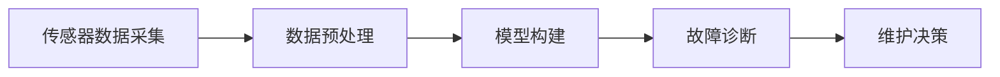
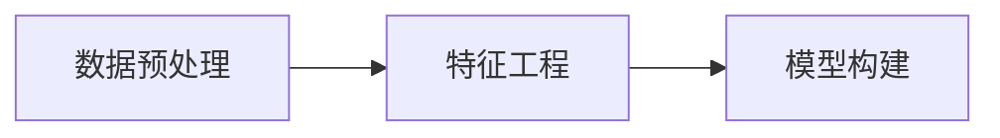
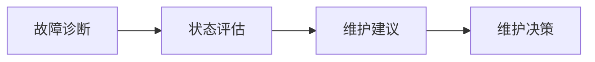

                 

## 1. 背景介绍

### 1.1 问题由来

现代工业设备的运转对企业运营至关重要。设备故障不仅导致生产停滞，还可能引发安全事故，带来巨大的经济损失。然而，设备故障预测和预防一直是一个复杂且困难的任务，传统的方法如定期维护、手动监测等不仅成本高昂，且往往无法及时发现潜在故障。

近年来，随着人工智能(AI)技术的发展，预测性维护(Proactive Maintenance)逐渐成为可能。预测性维护通过实时监测设备状态，并利用AI模型进行数据分析，提前预测设备故障，从而实现设备健康管理、减少维护成本、提升运营效率。其中，AI驱动的预测性维护成为了行业关注的焦点。

### 1.2 问题核心关键点

AI驱动的预测性维护主要包含以下几个核心关键点：

- 传感器数据采集：通过各种传感器（如振动传感器、温度传感器、压力传感器等）实时采集设备运行数据。
- 数据预处理：对采集的数据进行清洗、滤波、标准化等处理，去除噪声，提取有用特征。
- 模型构建：构建基于机器学习、深度学习等算法的预测模型，对设备状态进行预测。
- 故障诊断：通过模型分析预测结果，识别出设备异常状态，发出故障警报。
- 维护决策：根据故障诊断结果，制定维护策略，进行预防性维护，避免设备故障的发生。

这些关键点之间的逻辑关系可以通过以下Mermaid流程图来展示：



通过这个流程图，我们可以更清晰地理解AI驱动预测性维护的工作流程。接下来，我们将深入探讨其中的核心概念和算法。

## 2. 核心概念与联系

### 2.1 核心概念概述

为了更好地理解AI驱动预测性维护的技术原理，本节将介绍几个关键概念：

- **传感器数据采集**：通过振动、温度、压力等传感器实时采集设备运行数据，如振动加速度、温度变化、压力波动等。
- **数据预处理**：对采集到的原始数据进行清洗、滤波、标准化等处理，去除噪声，提取有用的特征。
- **机器学习和深度学习模型**：使用监督学习或无监督学习算法构建预测模型，对设备状态进行预测。
- **故障诊断**：通过模型分析预测结果，识别设备异常状态，发出故障警报。
- **维护决策**：根据故障诊断结果，制定维护策略，进行预防性维护，避免设备故障的发生。

这些概念之间的逻辑关系可以通过以下Mermaid流程图来展示：


### 2.2 概念间的关系

这些核心概念之间存在着紧密的联系，形成了AI驱动预测性维护的完整系统。下面我们将通过几个Mermaid流程图来展示这些概念之间的联系：

#### 2.2.1 数据预处理与模型构建的关系



这个流程图展示了数据预处理和模型构建之间的关系。数据预处理包括特征提取、数据标准化等步骤，目的是提升数据质量，为模型训练提供更好的输入。

#### 2.2.2 故障诊断与维护决策的关系



这个流程图展示了故障诊断和维护决策之间的关系。故障诊断的结果（设备异常状态）通过状态评估，形成维护建议，最终转化为具体的维护决策。

## 3. 核心算法原理 & 具体操作步骤
### 3.1 算法原理概述

AI驱动的预测性维护的核心算法原理主要包括以下几个方面：

1. **传感器数据采集**：通过传感器实时采集设备的运行状态数据，如振动、温度、压力等。
2. **数据预处理**：对采集到的原始数据进行清洗、滤波、标准化等处理，去除噪声，提取有用的特征。
3. **模型构建**：使用机器学习或深度学习算法构建预测模型，对设备状态进行预测。
4. **故障诊断**：通过模型分析预测结果，识别设备异常状态，发出故障警报。
5. **维护决策**：根据故障诊断结果，制定维护策略，进行预防性维护，避免设备故障的发生。

### 3.2 算法步骤详解

基于上述核心算法原理，AI驱动的预测性维护通常包含以下步骤：

**Step 1: 数据采集与预处理**
- 配置传感器设备，确保能够实时采集设备状态数据。
- 数据采集后，进行初步清洗，去除异常数据和噪声。
- 进行特征提取，如傅里叶变换、小波变换等，提取设备状态的频域特征。
- 对特征进行标准化和归一化处理，提升模型训练效果。

**Step 2: 模型训练与评估**
- 选择合适的模型架构，如RNN、LSTM、CNN、Transformer等。
- 利用历史数据训练模型，进行超参数调优。
- 在验证集上评估模型性能，选择最优模型。
- 利用测试集进一步验证模型效果，确保模型泛化能力。

**Step 3: 故障诊断与维护决策**
- 使用训练好的模型对实时数据进行预测，生成设备状态评估报告。
- 根据模型评估结果，识别设备异常状态，发出故障警报。
- 根据故障类型和严重程度，制定维护策略，进行预防性维护。

### 3.3 算法优缺点

AI驱动的预测性维护具有以下优点：

1. **高效性**：通过实时监测设备状态，能够及时发现潜在故障，减少停机时间和损失。
2. **准确性**：利用机器学习和深度学习算法，能够提升故障预测的准确性，降低误报率。
3. **灵活性**：可以针对不同的设备类型和应用场景，定制化的构建预测模型。
4. **可解释性**：模型通过特征提取和算法分析，可以解释设备异常的原因，提高维护的针对性。

同时，该方法也存在一些局限性：

1. **数据质量依赖**：模型性能依赖于传感器数据的质量和采集的准确性，数据采集系统需要稳定可靠。
2. **模型复杂度**：深度学习模型虽然效果显著，但训练复杂度较高，对计算资源要求高。
3. **模型维护成本**：模型训练和维护需要持续投入资源，维护成本较高。
4. **设备复杂性**：对于结构复杂、数据多样化的设备，建模和诊断难度较大。

尽管存在这些局限性，但就目前而言，AI驱动的预测性维护已经在大规模工业应用中展现出了其强大的潜力和应用前景。

### 3.4 算法应用领域

AI驱动的预测性维护已经广泛应用于制造业、能源、航空、化工等多个行业领域，具体应用包括但不限于：

1. **制造业**：通过监测生产线设备的振动、温度等数据，预测设备故障，减少停机时间和维护成本。
2. **能源行业**：监测风力发电机、燃气轮机的运行状态，提前预测故障，提高能源利用效率。
3. **航空业**：监测飞机发动机、涡轮机等关键部件的状态，确保飞行安全。
4. **化工行业**：监测反应器、压力容器等设备的状态，避免潜在的安全隐患。
5. **交通领域**：监测汽车发动机、传动系统等状态，提高车辆运行稳定性和安全性。

## 4. 数学模型和公式 & 详细讲解  
### 4.1 数学模型构建

AI驱动的预测性维护的核心数学模型包括传感器数据的预处理模型、特征提取模型和预测模型。

设传感器采集到的设备状态数据为 $X=\{x_1, x_2, ..., x_n\}$，其中 $x_i$ 表示第 $i$ 个传感器的读数。假设设备在故障前有 $m$ 种状态，分别为 $S_1, S_2, ..., S_m$。预测模型 $f$ 的输出为设备状态 $S_i$ 的概率 $p(S_i|X)$。

数学模型构建的主要任务是：

1. **数据预处理模型**：对传感器数据进行清洗、滤波和标准化处理，提升数据质量。
2. **特征提取模型**：从传感器数据中提取有用的特征，提升模型训练效果。
3. **预测模型**：基于历史数据，构建预测模型，预测设备状态。

### 4.2 公式推导过程

以基于深度学习的预测模型为例，推导其在传感器数据采集和预处理、特征提取和预测的数学公式。

**传感器数据采集和预处理**：

设传感器采集到的设备状态数据为 $X=\{x_1, x_2, ..., x_n\}$，其中 $x_i$ 表示第 $i$ 个传感器的读数。预处理过程包括清洗、滤波和标准化处理，得到预处理后的数据 $X'$。

```latex
X' = \{X \rightarrow \text{清洗} \rightarrow \text{滤波} \rightarrow \text{标准化}\}
```

**特征提取模型**：

在预处理后的数据 $X'$ 上，通过傅里叶变换、小波变换等方法，提取设备状态的频域特征 $F(X')$。

```latex
F(X') = \{x_1', x_2', ..., x_n'\} \rightarrow \text{傅里叶变换} \rightarrow \{f_1', f_2', ..., f_m'\}
```

**预测模型**：

构建深度神经网络模型 $f$，将特征 $F(X')$ 输入模型，输出设备状态 $S_i$ 的概率 $p(S_i|X')$。

```latex
p(S_i|X') = f(F(X'))
```

### 4.3 案例分析与讲解

以航空发动机故障预测为例，展示如何构建AI驱动的预测性维护系统。

**数据采集**：
- 部署振动传感器、温度传感器、压力传感器等，实时采集发动机振动、温度、压力等数据。
- 通过清洗、滤波等预处理步骤，去除噪声和异常值。

**特征提取**：
- 对预处理后的数据进行傅里叶变换，提取振动信号的频域特征。
- 对温度和压力数据进行归一化处理。

**模型构建**：
- 构建深度卷积神经网络（CNN）模型，对提取的特征进行训练。
- 在验证集上评估模型性能，选择最优模型。

**故障诊断与维护决策**：
- 使用训练好的模型对实时数据进行预测，生成设备状态评估报告。
- 根据模型评估结果，识别设备异常状态，发出故障警报。
- 根据故障类型和严重程度，制定维护策略，进行预防性维护。

## 5. 项目实践：代码实例和详细解释说明
### 5.1 开发环境搭建

在进行AI驱动预测性维护的开发实践中，需要配置好相应的开发环境。以下是使用Python进行深度学习开发的典型环境配置流程：

1. 安装Anaconda：从官网下载并安装Anaconda，用于创建独立的Python环境。

```bash
conda create -n pytorch-env python=3.8 
conda activate pytorch-env
```

2. 安装深度学习库：

```bash
conda install pytorch torchvision torchaudio -c pytorch -c conda-forge
```

3. 安装PyTorch：

```bash
pip install torch torchvision torchaudio
```

4. 安装TensorFlow：

```bash
pip install tensorflow==2.4.1
```

5. 安装其他依赖库：

```bash
pip install numpy pandas scikit-learn matplotlib seaborn
```

完成上述步骤后，即可在`pytorch-env`环境中开始深度学习项目开发。

### 5.2 源代码详细实现

以下是一个基于TensorFlow和Keras实现的深度学习模型示例，用于预测航空发动机的故障状态：

```python
import tensorflow as tf
from tensorflow.keras.models import Sequential
from tensorflow.keras.layers import Dense, LSTM, Conv1D, MaxPooling1D
from tensorflow.keras.preprocessing import timeseries_dataset_from_array
from tensorflow.keras.callbacks import EarlyStopping
import numpy as np
import matplotlib.pyplot as plt

# 数据准备
data = np.random.randn(1000, 10)
labels = np.random.randint(0, 3, size=(1000,))

# 数据预处理
def preprocessing(data, labels):
    # 对数据进行标准化处理
    data = (data - np.mean(data)) / np.std(data)
    # 将标签进行one-hot编码
    labels = tf.keras.utils.to_categorical(labels)
    return data, labels

data, labels = preprocessing(data, labels)

# 模型构建
model = Sequential()
model.add(LSTM(64, input_shape=(10, 1)))
model.add(Dense(64, activation='relu'))
model.add(Dense(3, activation='softmax'))

# 编译模型
model.compile(optimizer='adam', loss='categorical_crossentropy', metrics=['accuracy'])

# 训练模型
history = model.fit(data, labels, epochs=10, batch_size=32, validation_split=0.2, callbacks=[EarlyStopping(patience=3)])

# 模型评估
test_data = np.random.randn(100, 10)
test_labels = np.random.randint(0, 3, size=(100,))
test_data, test_labels = preprocessing(test_data, test_labels)

loss, accuracy = model.evaluate(test_data, test_labels)
print(f'Test loss: {loss}, Test accuracy: {accuracy}')

# 模型预测
prediction = model.predict(test_data)
```

### 5.3 代码解读与分析

这个代码示例展示了如何构建一个简单的LSTM模型，用于预测航空发动机的故障状态。关键步骤包括数据预处理、模型构建、模型训练和模型评估。

**数据预处理**：
- 使用`preprocessing`函数对数据进行标准化和one-hot编码处理，提升数据质量。
- 对标签进行one-hot编码，将类别变量转化为数值变量。

**模型构建**：
- 使用`Sequential`模型，添加LSTM层和两个全连接层，构建深度学习模型。
- LSTM层用于提取时序数据的特征，全连接层用于分类。

**模型训练**：
- 使用`compile`方法设置模型的优化器和损失函数。
- 使用`fit`方法训练模型，设置早停机制（EarlyStopping）以避免过拟合。
- 在每个epoch结束时，使用`evaluate`方法评估模型性能。

**模型预测**：
- 使用`predict`方法对新数据进行预测，输出设备故障的概率分布。

## 6. 实际应用场景

### 6.1 智能工厂

在智能工厂中，通过部署各种传感器实时采集生产线设备的状态数据，如振动、温度、压力等。利用AI驱动的预测性维护系统，对采集到的数据进行预处理、特征提取和预测，提前识别出设备的潜在故障，并发出警报。通过自动化维护系统的协同工作，能够减少设备停机时间，提高生产效率，降低维护成本。

### 6.2 智能电网

智能电网中，电力设备的故障预测和预防是保证电网安全、稳定运行的重要手段。通过部署振动、温度、压力等传感器，实时监测电力设备的状态，利用AI驱动的预测性维护系统，对采集到的数据进行预处理、特征提取和预测，提前识别出设备的潜在故障，并采取预防性维护措施。通过实时监测和动态调整，能够有效降低电力系统的故障率，提高电网的可靠性和安全性。

### 6.3 智能交通

智能交通系统中的车辆、道路、交通设施等设备需要实时监测和维护。通过部署各种传感器，如GPS、加速度计、温度传感器等，实时采集车辆和道路的状态数据。利用AI驱动的预测性维护系统，对采集到的数据进行预处理、特征提取和预测，提前识别出设备的潜在故障，并发出警报。通过自动化维护系统的协同工作，能够减少设备停机时间，提高交通系统的稳定性和安全性。

### 6.4 未来应用展望

未来，AI驱动的预测性维护将进一步拓展应用范围，进入更多领域。以下是几个可能的应用方向：

1. **智能医疗**：在医疗设备中，如CT机、MRI机、输液泵等，实时监测设备状态，预测设备故障，确保医疗设备的安全性和可靠性。
2. **智能农业**：在农业设备中，如拖拉机、收割机、灌溉系统等，实时监测设备状态，预测设备故障，确保农业生产的连续性和稳定性。
3. **智能家居**：在家居设备中，如空调、洗衣机、热水器等，实时监测设备状态，预测设备故障，提升家用设备的智能化和安全性。
4. **智能城市**：在城市基础设施中，如路灯、交通信号灯、监控摄像头等，实时监测设备状态，预测设备故障，确保城市管理的智能化和可靠性。

## 7. 工具和资源推荐

### 7.1 学习资源推荐

为了帮助开发者系统掌握AI驱动预测性维护的理论基础和实践技巧，这里推荐一些优质的学习资源：

1. **Coursera《机器学习》课程**：由斯坦福大学Andrew Ng教授主讲，全面介绍机器学习和深度学习的基础知识，适合初学者入门。
2. **Deep Learning Specialization by Andrew Ng**：由斯坦福大学Andrew Ng教授主讲，深入介绍深度学习算法和应用，适合深入学习。
3. **Kaggle竞赛**：参与Kaggle数据科学竞赛，实践AI驱动预测性维护技术，积累实战经验。
4. **GitHub开源项目**：如TensorFlow、PyTorch等，提供丰富的开源项目和代码示例，帮助学习实践。
5. **相关论文**：阅读最新的AI驱动预测性维护论文，了解前沿技术进展和应用案例。

### 7.2 开发工具推荐

高效的开发离不开优秀的工具支持。以下是几款用于AI驱动预测性维护开发的常用工具：

1. **TensorFlow**：由Google主导开发的深度学习框架，适合大规模工程应用，提供了丰富的预训练模型和工具。
2. **PyTorch**：由Facebook开发的深度学习框架，灵活性高，适合快速迭代研究。
3. **Jupyter Notebook**：免费的交互式编程环境，支持Python、R等语言，适合科研和开发。
4. **Scikit-learn**：Python机器学习库，提供了丰富的数据预处理和模型训练工具，适合快速搭建原型。
5. **TensorBoard**：TensorFlow配套的可视化工具，实时监测模型训练状态，适合调试和监控。

### 7.3 相关论文推荐

AI驱动的预测性维护技术的研究涉及多个领域，以下是几篇经典论文，推荐阅读：

1. **"Predictive Maintenance: a survey of Techniques and Applications"**：全面综述预测性维护技术的现状和应用，了解最新进展和趋势。
2. **"Deep Learning for Predictive Maintenance"**：介绍深度学习在预测性维护中的应用，对比不同模型的优劣。
3. **"A survey on Predictive Maintenance using AI"**：综述AI驱动的预测性维护方法，包括机器学习、深度学习、异常检测等技术。

## 8. 总结：未来发展趋势与挑战

### 8.1 研究成果总结

本文对AI驱动的预测性维护方法进行了全面系统的介绍。首先阐述了预测性维护的背景和意义，明确了AI驱动预测性维护的独特价值。其次，从原理到实践，详细讲解了预测性维护的数学模型和关键步骤，给出了实际应用的代码实现。同时，本文还广泛探讨了预测性维护在制造业、能源、航空等多个行业领域的应用前景，展示了其广泛的应用潜力。

通过本文的系统梳理，可以看到，AI驱动的预测性维护技术在提升设备健康管理、减少维护成本、提升运营效率等方面具有巨大的潜力。未来，随着算力、数据、算法等技术的不断进步，预测性维护必将更加高效、精确、可靠。

### 8.2 未来发展趋势

展望未来，AI驱动的预测性维护技术将呈现以下几个发展趋势：

1. **模型复杂度提高**：随着算力和数据量的增加，深度学习模型将更加复杂，能够处理更多的特征和模式，提升预测准确性。
2. **跨领域应用拓展**：预测性维护技术将拓展到更多领域，如智能医疗、智能农业、智能城市等，解决各行业设备故障问题。
3. **实时性增强**：通过边缘计算和物联网技术，实现设备状态的实时监测和实时预测，进一步提升预测性维护的效率和效果。
4. **融合AI技术**：结合自然语言处理、计算机视觉等AI技术，提升预测性维护系统的综合能力。
5. **多模态数据融合**：结合传感器、视频、音频等多种数据类型，提升设备状态监测的全面性和准确性。

### 8.3 面临的挑战

尽管AI驱动的预测性维护技术已经取得了显著进展，但在实际应用中仍面临诸多挑战：

1. **数据质量问题**：传感器数据的采集和处理可能存在噪声和异常值，影响模型的准确性。
2. **模型训练成本**：深度学习模型的训练需要大量计算资源和时间，训练成本较高。
3. **模型可解释性**：深度学习模型的黑盒特性，使得模型的预测结果难以解释和理解。
4. **硬件资源限制**：模型训练和推理需要高性能计算资源，对硬件环境要求较高。
5. **应用场景复杂性**：不同设备、不同应用场景的预测性维护需求差异较大，模型需要定制化设计。

### 8.4 研究展望

面对预测性维护技术所面临的挑战，未来的研究需要在以下几个方面寻求新的突破：

1. **数据增强技术**：通过数据增强和扩充，提升数据质量和模型训练效果。
2. **模型压缩技术**：通过模型压缩和优化，减少模型参数和计算资源需求，降低训练成本。
3. **可解释性研究**：开发可解释性更强的模型，提高模型透明性和可理解性。
4. **跨领域模型设计**：结合不同领域的应用场景，设计更加通用和灵活的预测性维护模型。
5. **融合AI技术**：结合自然语言处理、计算机视觉等AI技术，提升预测性维护系统的综合能力。

总之，AI驱动的预测性维护技术需要在数据、模型、应用场景等多个维度进行深入研究，不断突破技术瓶颈，才能实现其大规模应用和普及。

## 9. 附录：常见问题与解答

**Q1: 预测性维护的准确性如何保证？**

A: 预测性维护的准确性主要依赖于数据质量、模型选择和训练效果。首先，需要确保传感器数据的采集和处理质量，去除噪声和异常值。其次，选择适当的深度学习模型，并对其进行超参数调优。最后，在大量历史数据上进行训练，并在验证集上评估模型性能，选择最优模型。通过这些步骤，可以显著提升预测性维护的准确性。

**Q2: 预测性维护的部署难度大吗？**

A: 预测性维护的部署难度较大，主要体现在以下几个方面：
1. 数据采集系统需要稳定可靠，需要投入大量资源进行部署和维护。
2. 模型训练和维护需要持续投入资源，对计算资源要求较高。
3. 系统需要实现实时监测和预测，对硬件环境要求较高。

**Q3: 预测性维护的维护成本如何？**

A: 预测性维护的维护成本较高，主要体现在以下几个方面：
1. 传感器数据的采集和处理需要投入大量人力和物力资源。
2. 模型训练和维护需要持续投入资源，包括计算资源、人力和物力资源。
3. 系统实现和部署需要投入大量人力和物力资源，包括软件开发、硬件采购等。

**Q4: 预测性维护的适用范围有哪些？**

A: 预测性维护适用于各种需要实时监测和维护的设备，如生产线设备、电力设备、交通设施、医疗设备等。需要根据设备类型和应用场景，选择合适的传感器和预测模型。

**Q5: 预测性维护的局限性有哪些？**

A: 预测性维护的局限性主要体现在以下几个方面：
1. 数据质量问题：传感器数据的采集和处理可能存在噪声和异常值，影响模型的准确性。
2. 模型训练成本：深度学习模型的训练需要大量计算资源和时间，训练成本较高。
3. 模型可解释性：深度学习模型的黑盒特性，使得模型的预测结果难以解释和理解。
4. 硬件资源限制：模型训练和推理需要高性能计算资源，对硬件环境要求较高。
5. 应用场景复杂性：不同设备、不同应用场景的预测性维护需求差异较大，模型需要定制化设计。

总之，预测性维护技术具有广阔的应用前景和深远的影响，但也面临着数据质量、模型训练成本、模型可解释性、硬件资源限制等挑战。未来需要在这些方面进行深入研究，不断突破技术瓶颈，实现预测性维护技术的规模化应用。

---

作者：禅与计算机程序设计艺术 / Zen and the Art of Computer Programming

