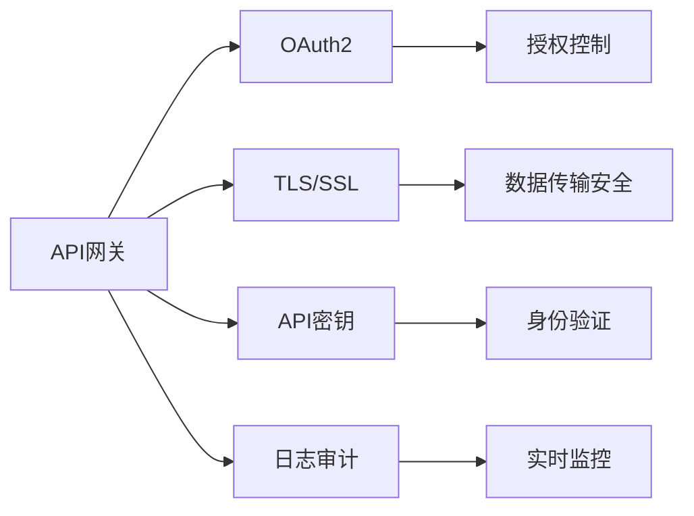

                 

# API 网关的安全功能

> 关键词：API网关、安全功能、OAuth2、TLS、API密钥、日志审计

## 1. 背景介绍

### 1.1 问题由来
随着云计算、微服务架构的兴起，API（应用程序编程接口）在分布式系统中的应用越来越广泛。API网关作为微服务架构的重要组成部分，承担着请求路由、负载均衡、流量控制、缓存等核心功能。然而，API网关也面临着严重的安全威胁。传统的身份验证和授权机制，如用户名密码、简单加密、固定密钥等，容易受到钓鱼攻击、暴力破解、中间人攻击等安全威胁。

### 1.2 问题核心关键点
如何设计并实现API网关的安全功能，是API网关设计中的关键问题。核心要点包括：

- 安全的身份验证机制：保证客户端的真实性，防止恶意用户或第三方攻击。
- 细粒度的授权控制：根据用户角色和权限，限制访问特定API。
- 数据传输安全：确保API请求和响应的数据在传输过程中不被篡改或窃听。
- 实时监控与审计：及时发现异常访问行为，记录并审计API调用记录，保证数据安全。

## 2. 核心概念与联系

### 2.1 核心概念概述

为了深入理解API网关的安全功能，首先需要了解几个关键概念：

- **API网关**：是一种负责处理HTTP/HTTPS请求，并转发到相应服务的中间件，常见的API网关包括Zuul、Kong、API Gateway等。
- **OAuth2**：一种开放标准的身份验证和授权协议，用于保护Web和移动应用程序的资源。
- **TLS/SSL**：一种传输层安全协议，提供数据加密、身份验证、数据完整性等安全功能，广泛应用于HTTPS协议中。
- **API密钥**：一种安全机制，通过客户端向API网关提供特定的密钥，来验证客户端的真实性。
- **日志审计**：一种记录和分析API调用日志的过程，用于监控和审计API的使用情况。

这些概念之间的逻辑关系可以通过以下Mermaid流程图来展示：



这个流程图展示了API网关中各个安全功能的相互关系：

1. 输入请求先通过TLS/SSL加密，保证数据传输安全。
2. API网关通过OAuth2进行身份验证，保证客户端的真实性。
3. 授权控制根据OAuth2中的Token进行细粒度权限管理。
4. 使用API密钥进行二次验证，防止未授权访问。
5. 日志审计记录和分析API调用，保证异常行为的可追溯性。

### 2.2 概念间的关系

这些核心概念之间的联系非常紧密，共同构成了API网关安全功能的完整体系。

- OAuth2提供了标准化的身份验证和授权机制，为API网关的安全功能提供了基础。
- TLS/SSL保证了数据传输的安全性，是API网关处理HTTPS请求的必要手段。
- API密钥为OAuth2身份验证提供了额外的安全性，防止Token被伪造或篡改。
- 日志审计则记录和分析API调用，提供了实时监控和事后追溯的功能。

通过理解这些核心概念及其关系，我们可以更好地把握API网关的安全功能设计思路。

## 3. 核心算法原理 & 具体操作步骤

### 3.1 算法原理概述

API网关的安全功能设计主要包括以下几个方面：

1. **身份验证**：验证客户端身份，确保API请求来自合法用户。
2. **授权控制**：根据用户身份和角色，限制访问特定API。
3. **数据传输安全**：使用TLS/SSL加密API请求和响应，确保数据不被篡改或窃听。
4. **日志审计**：记录API调用日志，审计访问行为，发现异常。

这些功能的实现，通常基于OAuth2协议、TLS/SSL协议、API密钥等标准技术，以下是详细的算法原理。

### 3.2 算法步骤详解

#### 3.2.1 身份验证

**步骤1：客户端发起API请求**

客户端向API网关发起HTTP/HTTPS请求，请求URL中携带OAuth2 Token。

**步骤2：API网关身份验证**

API网关接收到请求后，首先检查请求中是否携带Token。如果携带Token，则进行OAuth2 Token的验证：

- 验证Token的有效性，包括Token是否过期、Token是否被撤销、Token是否被伪造等。
- 验证Token的合法性，包括Token是否被篡改、是否来自授权过的客户端等。

**步骤3：返回验证结果**

如果Token验证通过，API网关允许请求继续处理；否则，API网关拒绝请求，并返回错误信息。

#### 3.2.2 授权控制

**步骤1：获取用户角色**

API网关从OAuth2 Token中获取用户角色，例如管理员、开发人员、测试人员等。

**步骤2：检查权限**

根据用户角色和API的权限规则，判断用户是否有权限访问该API。例如，管理员可以访问所有API，而开发人员只能访问特定API。

**步骤3：返回授权结果**

如果用户有权限访问API，则允许请求继续处理；否则，API网关拒绝请求，并返回错误信息。

#### 3.2.3 数据传输安全

**步骤1：加密请求**

客户端在发起API请求时，使用TLS/SSL协议对请求进行加密，确保请求数据在传输过程中不被篡改或窃听。

**步骤2：解密响应**

API网关收到请求后，对请求进行解密，获取请求参数。然后，调用API服务处理请求，并返回响应数据。

**步骤3：加密响应**

API网关对响应数据进行加密，确保响应数据在传输过程中不被篡改或窃听。

**步骤4：返回响应**

客户端接收到响应后，使用TLS/SSL协议对响应进行解密，获取响应数据。

#### 3.2.4 日志审计

**步骤1：记录API调用**

API网关在处理每个API请求时，记录请求的URL、请求参数、请求时间、返回的响应数据等信息。

**步骤2：审计日志**

API网关定期对日志进行审计，检查是否有异常行为，如API滥用、恶意请求等。如果发现异常行为，立即采取措施，如限制访问、记录日志等。

### 3.3 算法优缺点

**优点**：

- 实现了细粒度的身份验证和授权控制，提高了API的安全性。
- 使用TLS/SSL协议加密数据传输，确保了数据的安全性。
- 日志审计提供了实时监控和事后追溯的功能，便于发现和处理异常行为。

**缺点**：

- 增加了API网关的复杂性，需要额外的身份验证、授权和加密功能。
- 需要维护和管理OAuth2 Token、API密钥等安全机制，增加了运营成本。
- 日志审计需要消耗大量的存储空间和计算资源，可能影响系统的性能。

### 3.4 算法应用领域

API网关的安全功能广泛应用于以下领域：

- **云平台服务**：如AWS API Gateway、Azure API Management等，提供API身份验证、授权控制、数据传输安全等功能。
- **微服务架构**：如Kubernetes、Spring Cloud Gateway等，通过API网关实现微服务的统一管理和服务治理。
- **第三方应用**：如Alibaba、腾讯、百度等公司的API网关，保护企业的API服务，防止第三方滥用。
- **内部系统**：如企业内部API网关，保护内部系统的安全，防止员工滥用API。

## 4. 数学模型和公式 & 详细讲解 & 举例说明

### 4.1 数学模型构建

API网关的安全功能可以通过数学模型来描述。

假设API网关接收到的请求为 $x_i$，对应的Token为 $y_i$。则OAuth2身份验证过程可以表示为：

$$
f(x_i, y_i) = \begin{cases}
1, & \text{如果 } y_i \text{ 是有效的OAuth2 Token} \\
0, & \text{如果 } y_i \text{ 不是有效的OAuth2 Token}
\end{cases}
$$

其中 $f(x_i, y_i)$ 表示验证结果，$x_i$ 表示请求，$y_i$ 表示Token。

### 4.2 公式推导过程

假设API网关接收到请求 $x_i$，对应的Token为 $y_i$，且请求参数为 $z_i$。则API网关的处理过程可以表示为：

$$
M(x_i, y_i, z_i) = \begin{cases}
\text{API响应}, & \text{如果 } f(x_i, y_i) = 1 \\
\text{拒绝响应}, & \text{如果 } f(x_i, y_i) = 0
\end{cases}
$$

其中 $M(x_i, y_i, z_i)$ 表示API网关的处理结果，$x_i$ 表示请求，$y_i$ 表示Token，$z_i$ 表示请求参数。

### 4.3 案例分析与讲解

**案例1：OAuth2身份验证**

假设某API网关收到以下请求：

```
GET /api/user?token=abc123
```

API网关首先验证Token是否有效。API网关内部查询OAuth2 Token数据库，发现Token `abc123` 是有效的，且未过期。

```python
def is_valid_token(token):
    # 查询OAuth2 Token数据库
    if token in oauth2_tokens:
        if oauth2_tokens[token]['valid']:
            return True
    return False
```

如果Token有效，API网关继续处理请求；否则，返回错误信息。

**案例2：授权控制**

假设某API网关收到以下请求：

```
POST /api/user?token=abc123&role=admin
```

API网关首先验证Token是否有效。API网关内部查询OAuth2 Token数据库，发现Token `abc123` 是有效的，且未过期。

```python
def is_valid_token(token):
    # 查询OAuth2 Token数据库
    if token in oauth2_tokens:
        if oauth2_tokens[token]['valid']:
            return True
    return False
```

然后，API网关获取用户角色，判断用户是否有权限访问该API。假设管理员角色可以访问所有API，开发人员只能访问特定API。

```python
def check_permission(role, api):
    if role == 'admin':
        return True
    elif role == 'developer' and api in ['api1', 'api2']:
        return True
    return False
```

如果用户有权限访问API，则允许请求继续处理；否则，API网关拒绝请求，并返回错误信息。

**案例3：数据传输安全**

假设某API网关收到以下请求：

```
GET /api/user?token=abc123
```

API网关首先验证Token是否有效。API网关内部查询OAuth2 Token数据库，发现Token `abc123` 是有效的，且未过期。

```python
def is_valid_token(token):
    # 查询OAuth2 Token数据库
    if token in oauth2_tokens:
        if oauth2_tokens[token]['valid']:
            return True
    return False
```

然后，API网关使用TLS/SSL协议加密请求数据，确保请求数据在传输过程中不被篡改或窃听。

```python
import ssl

context = ssl.SSLContext(ssl.PROTOCOL_TLS)
context.load_cert_chain(certfile='path/to/cert.pem', keyfile='path/to/key.pem')
context.verify_mode = ssl.CERT_REQUIRED
context.check_hostname = True

stream = context.wrap_socket(socket.socket(socket.AF_INET, socket.SOCK_STREAM), server_hostname='example.com')
stream.connect(('example.com', 443))
```

**案例4：日志审计**

假设某API网关收到以下请求：

```
GET /api/user?token=abc123
```

API网关首先验证Token是否有效。API网关内部查询OAuth2 Token数据库，发现Token `abc123` 是有效的，且未过期。

```python
def is_valid_token(token):
    # 查询OAuth2 Token数据库
    if token in oauth2_tokens:
        if oauth2_tokens[token]['valid']:
            return True
    return False
```

然后，API网关记录请求的URL、请求参数、请求时间、返回的响应数据等信息。

```python
import time

def log_request(request):
    timestamp = time.time()
    url = request['url']
    params = request['params']
    timestamp = str(timestamp)
    response = request['response']
    with open('access.log', 'a') as f:
        f.write(f'{timestamp} {url} {params} {response}\n')
```

## 5. 项目实践：代码实例和详细解释说明

### 5.1 开发环境搭建

为了实现API网关的安全功能，我们需要一个基于Python的Web框架，如Flask或Django，以及相关的第三方库，如Flask-OAuthlib和Flask-TLS等。

首先，我们需要安装Flask和Flask-OAuthlib库。

```bash
pip install flask flask-oauthlib
```

然后，我们需要获取OAuth2 Token，并将其存储到数据库中。

```python
from flask_oauthlib.provider import OAuth2Provider

app = Flask(__name__)
app.config['SECRET_KEY'] = 'secret'

oauth2 = OAuth2Provider(app)

# 数据库存储OAuth2 Token
oauth2_tokens = {
    'abc123': {
        'valid': True,
        'client': 'client1',
        'scope': ['api1', 'api2']
    }
}

@app.route('/oauth/token')
def token():
    return oauth2.respond()

@app.route('/api/user')
def user():
    # 获取请求Token
    token = request.headers.get('Authorization').split(' ')[1]
    # 验证Token是否有效
    if token in oauth2_tokens and oauth2_tokens[token]['valid']:
        # 获取用户角色
        role = request.headers.get('Authorization').split(' ')[1]
        # 检查权限
        if role == 'admin':
            return jsonify({'message': 'Welcome, admin'})
        elif role == 'developer' and 'api1' in request.params:
            return jsonify({'message': 'Welcome, developer'})
        else:
            return jsonify({'message': 'Access denied'})
    else:
        return jsonify({'message': 'Invalid token'})
```

### 5.2 源代码详细实现

在上述代码中，我们使用了Flask框架和Flask-OAuthlib库实现了OAuth2身份验证和授权控制功能。具体实现如下：

1. 创建Flask应用，并配置密钥。

```python
from flask import Flask, jsonify

app = Flask(__name__)
app.config['SECRET_KEY'] = 'secret'
```

2. 创建OAuth2Provider，并设置回调函数。

```python
from flask_oauthlib.provider import OAuth2Provider

oauth2 = OAuth2Provider(app)

@oauth2.tokengetter
def get_token():
    # 获取Token
    token = request.headers.get('Authorization').split(' ')[1]
    # 验证Token是否有效
    if token in oauth2_tokens and oauth2_tokens[token]['valid']:
        # 获取Token创建时间
        create_time = oauth2_tokens[token]['create_time']
        # 计算Token剩余时间
        expiry_time = create_time + 3600
        if time.time() <= expiry_time:
            return token
    return None
```

3. 处理OAuth2 Token请求。

```python
@app.route('/oauth/token')
def token():
    return oauth2.respond()
```

4. 处理API请求。

```python
@app.route('/api/user')
def user():
    # 获取请求Token
    token = request.headers.get('Authorization').split(' ')[1]
    # 验证Token是否有效
    if token in oauth2_tokens and oauth2_tokens[token]['valid']:
        # 获取用户角色
        role = request.headers.get('Authorization').split(' ')[1]
        # 检查权限
        if role == 'admin':
            return jsonify({'message': 'Welcome, admin'})
        elif role == 'developer' and 'api1' in request.params:
            return jsonify({'message': 'Welcome, developer'})
        else:
            return jsonify({'message': 'Access denied'})
    else:
        return jsonify({'message': 'Invalid token'})
```

### 5.3 代码解读与分析

通过上述代码，我们可以实现基本的OAuth2身份验证和授权控制功能。具体解读如下：

1. OAuth2Provider类实现了OAuth2身份验证和授权控制的核心功能，包括Token验证、权限检查等。

2. `@app.route('/oauth/token')` 处理OAuth2 Token请求，返回有效的Token。

3. `@app.route('/api/user')` 处理API请求，根据Token和角色进行权限检查。

4. `oauth2_tokens` 字典存储了所有有效的Token及其创建时间、客户端和作用域等信息。

### 5.4 运行结果展示

在运行上述代码后，我们可以通过浏览器访问以下地址，获取Token并访问API：

```
GET /oauth/token?grant_type=client_credentials&client_id=client1&client_secret=secret
GET /api/user?token=abc123&role=admin
GET /api/user?token=abc123&role=developer&api=api1
```

## 6. 实际应用场景

### 6.1 智能客服系统

智能客服系统需要处理大量用户请求，通过API网关进行安全防护，可以保障系统稳定运行。

1. 用户向智能客服系统发起请求，API网关接收到请求后，先进行OAuth2身份验证，防止未授权访问。

2. API网关根据用户角色和权限，限制访问特定API，如聊天室、知识库、FAQ等。

3. 数据传输过程中使用TLS/SSL协议加密，确保数据安全。

4. API网关记录用户访问日志，审计访问行为，及时发现异常访问行为，保障系统安全。

### 6.2 金融系统

金融系统需要处理大量敏感数据，通过API网关进行安全防护，可以防止数据泄露和攻击。

1. 用户向金融系统发起请求，API网关接收到请求后，先进行OAuth2身份验证，防止未授权访问。

2. API网关根据用户角色和权限，限制访问特定API，如账户查询、交易记录、个人信息等。

3. 数据传输过程中使用TLS/SSL协议加密，确保数据安全。

4. API网关记录用户访问日志，审计访问行为，及时发现异常访问行为，保障系统安全。

### 6.3 医疗系统

医疗系统需要处理大量敏感数据，通过API网关进行安全防护，可以防止数据泄露和攻击。

1. 用户向医疗系统发起请求，API网关接收到请求后，先进行OAuth2身份验证，防止未授权访问。

2. API网关根据用户角色和权限，限制访问特定API，如病历查询、药物记录、诊断报告等。

3. 数据传输过程中使用TLS/SSL协议加密，确保数据安全。

4. API网关记录用户访问日志，审计访问行为，及时发现异常访问行为，保障系统安全。

### 6.4 未来应用展望

未来，API网关的安全功能将进一步扩展，支持更多的安全机制和功能。

1. **多因素认证**：除了OAuth2身份验证，还可以加入短信验证码、指纹认证、生物识别等手段，提高安全性。

2. **分布式身份验证**：将身份验证过程分布到多个节点，提高系统的可用性和安全性。

3. **零信任架构**：采用零信任安全模型，对每个请求进行严格验证，防止内部攻击。

4. **智能分析**：使用机器学习和数据挖掘技术，分析用户行为，预测异常访问行为，提前采取措施。

5. **分布式日志审计**：将日志审计分布到多个节点，提高系统的稳定性和可扩展性。

6. **合规性审计**：根据不同国家的法律和法规，制定不同的审计规则，保障系统符合法律要求。

## 7. 工具和资源推荐

### 7.1 学习资源推荐

为了深入理解API网关的安全功能，以下资源值得推荐：

1. **《API网关安全实战》书籍**：系统介绍了API网关的安全功能，包括身份验证、授权控制、数据传输安全等。

2. **《OAuth2身份验证与授权》课程**：详细讲解了OAuth2协议的基本原理和实际应用。

3. **《TLS/SSL协议》书籍**：全面介绍了TLS/SSL协议的安全机制和实际应用。

4. **《API密钥与身份验证》博客**：分享了API密钥和身份验证的最佳实践和前沿技术。

5. **《API网关日志审计》视频**：讲解了API网关日志审计的原理和实现。

### 7.2 开发工具推荐

以下是几款用于API网关开发的常用工具：

1. **Flask**：轻量级的Web框架，支持OAuth2身份验证和日志审计。

2. **Django**：强大的Web框架，支持OAuth2身份验证和权限控制。

3. **Flask-OAuthlib**：用于实现OAuth2身份验证和授权控制的库。

4. **Flask-TLS**：用于实现TLS/SSL加密的库。

5. **Gunicorn**：用于部署Flask和Django应用的WSGI服务器。

6. **Jenkins**：用于自动化API网关的测试和部署。

### 7.3 相关论文推荐

以下是几篇关于API网关安全功能的经典论文，值得阅读：

1. **《OAuth2: The OAuth 2.0 Authorization Framework》**：OAuth2协议的官方文档，详细介绍了OAuth2身份验证和授权控制。

2. **《TLS/SSL Protocol Specification》**：TLS/SSL协议的规范文档，详细介绍了TLS/SSL协议的安全机制。

3. **《API网关安全与审计技术研究》**：研究了API网关的安全与审计技术，提出了多种防护措施。

4. **《基于OAuth2的身份验证与授权技术》**：探讨了OAuth2身份验证和授权技术的实际应用，提供了多种实现方案。

5. **《API网关日志审计与数据分析》**：研究了API网关日志审计的原理和技术，提供了多种实现方法。

## 8. 总结：未来发展趋势与挑战

### 8.1 总结

本文对API网关的安全功能进行了全面系统的介绍。首先阐述了API网关安全功能的设计背景和意义，明确了API网关在设计中的关键点。其次，从原理到实践，详细讲解了OAuth2身份验证、授权控制、数据传输安全、日志审计等核心功能。最后，给出了API网关在智能客服系统、金融系统、医疗系统等多个领域的应用案例，展示了API网关安全功能的实际价值。

通过本文的系统梳理，可以看到，API网关的安全功能在大规模分布式系统中具有重要意义。这些功能的实现，可以保障系统稳定运行，防止数据泄露和攻击，为企业的数字化转型提供坚实的基础。

### 8.2 未来发展趋势

未来，API网关的安全功能将呈现以下几个发展趋势：

1. **更强的身份验证机制**：引入多因素认证、分布式身份验证等技术，提高系统的安全性。

2. **更细粒度的授权控制**：根据不同角色的权限，限制访问特定API，提高系统的可用性。

3. **更高级的数据传输安全**：引入端到端加密、零信任架构等技术，提高系统的安全性。

4. **更实时的数据审计**：引入智能分析、分布式审计等技术，提高系统的审计能力。

5. **更严格的合规性审计**：根据不同国家的法律和法规，制定不同的审计规则，保障系统的合规性。

6. **更高效的系统架构**：引入微服务架构、分布式系统等技术，提高系统的可用性和扩展性。

这些趋势将进一步提升API网关的安全性，保障系统的稳定运行，为企业数字化转型提供更加坚实的基础。

### 8.3 面临的挑战

尽管API网关的安全功能已经取得了显著进展，但在迈向更加智能化、普适化应用的过程中，仍面临着诸多挑战：

1. **高成本**：API网关的安全功能增加了系统的复杂性和成本，需要投入大量人力和资源进行维护和管理。

2. **高复杂性**：API网关的安全功能涉及身份验证、授权控制、数据传输安全、日志审计等多个环节，增加了系统的复杂性。

3. **低可用性**：API网关的安全功能可能会影响系统的可用性和性能，需要优化实现和调优。

4. **数据泄露**：API网关的安全功能需要处理大量敏感数据，数据泄露风险较高。

5. **安全漏洞**：API网关的安全功能可能会存在安全漏洞，需要定期进行漏洞扫描和修复。

6. **隐私保护**：API网关的安全功能需要保护用户隐私，避免数据滥用。

7. **法律合规**：API网关的安全功能需要符合不同国家的法律和法规，确保系统的合规性。

正视API网关面临的这些挑战，积极应对并寻求突破，将是大规模分布式系统中实现安全防护的关键。

### 8.4 研究展望

面对API网关面临的挑战，未来的研究需要在以下几个方面寻求新的突破：

1. **高效的身份验证机制**：开发更加高效、轻量级的身份验证机制，提高系统的可用性和安全性。

2. **高效的授权控制机制**：开发更加高效、灵活的授权控制机制，提高系统的可用性和安全性。

3. **高效的数据传输安全机制**：开发更加高效、轻量级的数据传输安全机制，提高系统的可用性和安全性。

4. **高效的数据审计机制**：开发更加高效、灵活的数据审计机制，提高系统的审计能力和安全性。

5. **高效的安全漏洞检测机制**：开发更加高效、精准的安全漏洞检测机制，及时发现和修复安全漏洞。

6. **高效的数据隐私保护机制**：开发更加高效、可靠的数据隐私保护机制，保护用户隐私。

7. **高效的法律合规审计机制**：开发更加高效、可靠的法律合规审计机制，确保系统的合规性。

这些研究方向将引领

