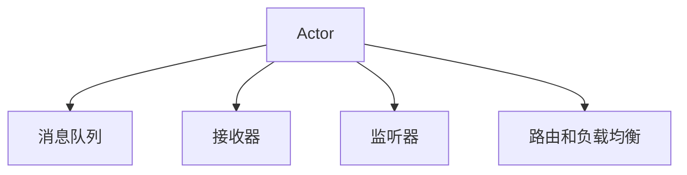
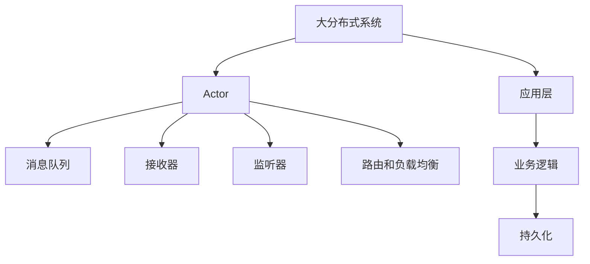

                 

## 1. 背景介绍

### 1.1 问题由来

Akka是一个用于构建高度可伸缩的分布式计算系统的工具和运行时，其核心思想是“消息传递”。在现代互联网应用中，分布式计算和微服务架构变得越来越重要。Akka提供了一套完整的消息传递模型，以及用于开发、部署和管理分布式系统的工具和库。

### 1.2 问题核心关键点

Akka的核心在于其基于消息传递的编程模型。在这个模型中，系统由多个不同的“参与者”(Actor)组成，每个Actor都有自己独立的生命周期和状态，通过消息进行通信。这种模型具有高度的并发性和容错性，可以轻松应对高并发和网络异常。

Akka的目标是使开发分布式系统变得简单、安全和高效。它提供了以下几个主要特点：

1. **高并发**：通过消息队列实现非阻塞的Actor通信，支持高并发。
2. **弹性伸缩**：Actor可以根据系统负载自动调整线程池大小。
3. **容错性**：Actor在崩溃后会自动重启，保证了系统的稳定性和可靠性。
4. **易于开发**：提供了面向对象的API，使开发过程更加直观和简单。
5. **低延迟**：消息传递的异步特性，可以避免阻塞，提高系统响应速度。
6. **跨平台**：支持多种编程语言，如Java、Scala、Python等。

### 1.3 问题研究意义

研究Akka的原理和实现，对于构建可伸缩、高可靠性、易维护的分布式系统具有重要意义。它不仅提供了先进的分布式计算模型，还能帮助我们理解分布式系统设计和实现的最佳实践。此外，Akka的代码实现非常清晰和优雅，是学习消息传递和分布式系统编程的重要参考。

## 2. 核心概念与联系

### 2.1 核心概念概述

Akka的核心概念主要包括：

- **Actor**：Akka中的基本单元，代表了一个执行任务的对象，通过消息进行通信。
- **消息**：Actor之间的通信方式，用于传递信息和数据。
- **消息队列**：消息在发送和接收之间被缓存的地方，保证了高并发和弹性伸缩。
- **接收器**：Actor接收消息的接口，接收器可以异步处理消息，确保系统的响应性。
- **监听器**：Actor监听特定事件或消息的机制，用于实现状态更新和事件驱动编程。
- **路由和负载均衡**：用于将消息路由到正确的Actor，实现负载均衡和负载分担。

### 2.2 概念间的关系

这些核心概念之间的关系可以用以下Mermaid流程图来展示：



这个流程图展示了Akka核心概念的相互作用和关系：

1. **Actor**：是Akka的核心单元，负责执行具体的任务。
2. **消息队列**：消息在发送和接收之间缓存的地方，保证了高并发和弹性伸缩。
3. **接收器**：Actor接收消息的接口，可以异步处理消息，确保系统的响应性。
4. **监听器**：Actor监听特定事件或消息的机制，用于实现状态更新和事件驱动编程。
5. **路由和负载均衡**：将消息路由到正确的Actor，实现负载均衡和负载分担。

### 2.3 核心概念的整体架构

最后，我们用一个综合的流程图来展示Akka核心概念在大分布式系统中的整体架构：



这个综合流程图展示了Akka核心概念在大分布式系统中的整体架构：

1. **大分布式系统**：由多个Actor组成，负责处理不同的业务逻辑。
2. **Actor**：是Akka的基本单元，通过消息进行通信。
3. **消息队列**：消息在发送和接收之间缓存的地方，保证了高并发和弹性伸缩。
4. **接收器**：Actor接收消息的接口，可以异步处理消息，确保系统的响应性。
5. **监听器**：Actor监听特定事件或消息的机制，用于实现状态更新和事件驱动编程。
6. **路由和负载均衡**：将消息路由到正确的Actor，实现负载均衡和负载分担。
7. **应用层**：业务逻辑的具体实现，包括持久化、路由、调度等。
8. **业务逻辑**：具体的业务处理逻辑，如订单管理、用户管理等。
9. **持久化**：数据存储和读取的机制，如数据库、缓存等。

这些核心概念共同构成了Akka系统的基础，为构建高性能、高可伸缩的分布式系统提供了坚实的理论基础。

## 3. 核心算法原理 & 具体操作步骤

### 3.1 算法原理概述

Akka的核心算法原理是基于消息传递的Actor模型。每个Actor都是一个独立的执行单元，通过消息进行通信。消息传递是非阻塞的，Actor之间的通信是通过消息队列实现的。这种模型具有良好的并发性和容错性，可以轻松应对高并发和网络异常。

### 3.2 算法步骤详解

Akka的消息传递模型包括以下步骤：

1. **Actor创建**：通过Akka框架创建Actor对象，Actor的创建是异步的，不会阻塞主线程。
2. **消息发送**：发送消息给Actor，Actor接收到消息后，会调用接收器处理消息。
3. **消息接收**：Actor通过接收器异步接收消息，确保系统的响应性。
4. **状态更新**：Actor根据消息更新自己的状态。
5. **消息传递**：Actor将消息传递给其他Actor，实现分布式计算。
6. **状态恢复**：Actor在崩溃后自动重启，恢复其状态。

### 3.3 算法优缺点

Akka的消息传递模型具有以下优点：

1. **高并发**：通过消息队列实现非阻塞的Actor通信，支持高并发。
2. **弹性伸缩**：Actor可以根据系统负载自动调整线程池大小。
3. **容错性**：Actor在崩溃后会自动重启，保证了系统的稳定性和可靠性。
4. **易于开发**：提供了面向对象的API，使开发过程更加直观和简单。
5. **低延迟**：消息传递的异步特性，可以避免阻塞，提高系统响应速度。
6. **跨平台**：支持多种编程语言，如Java、Scala、Python等。

但是，Akka也存在一些缺点：

1. **学习曲线陡峭**：由于Akka的编程模型比较抽象，初学者可能需要一定的学习成本。
2. **性能问题**：消息队列可能会导致消息堆积，需要合理设计队列大小和消费者数量。
3. **状态共享问题**：Actor之间的状态共享可能会影响系统的性能和安全性。

### 3.4 算法应用领域

Akka在多个领域都有广泛的应用，以下是一些典型应用场景：

1. **分布式计算**：在大型数据处理任务中，使用Akka可以提高系统的并发性和扩展性。
2. **微服务架构**：Akka可以用于构建微服务架构，实现服务之间的解耦和松散耦合。
3. **消息队列**：Akka的消息队列可以用于实现高并发和高可靠的消息传递。
4. **实时系统**：Akka的异步特性和弹性伸缩特性，使其适用于实时系统和高并发的应用场景。
5. **跨平台系统**：Akka支持多种编程语言，可以用于构建跨平台的分布式系统。

## 4. 数学模型和公式 & 详细讲解 & 举例说明

### 4.1 数学模型构建

Akka的数学模型主要涉及消息传递和Actor之间的通信。我们可以用以下公式来描述Actor之间的消息传递：

$$
\text{Send}(x, recipient, message)
$$

其中，$x$表示发送者，$recipient$表示接收者，$message$表示消息。

### 4.2 公式推导过程

我们可以用以下推导过程来理解Actor之间的消息传递：

1. **发送消息**：发送者$x$调用$\text{Send}(x, recipient, message)$函数，将消息$message$发送到接收者$recipient$。
2. **接收消息**：接收者$recipient$接收到消息后，调用$\text{Receive}(message)$函数，处理消息。
3. **状态更新**：根据消息$message$更新接收者$recipient$的状态。

### 4.3 案例分析与讲解

我们可以用一个简单的案例来讲解Akka的消息传递模型：

```java
import akka.actor.ActorSystem;
import akka.actor.Props;

public class ActorSystemExample {
    public static void main(String[] args) {
        ActorSystem system = ActorSystem.create("MySystem");

        // 创建两个Actor
        MyActor actor1 = system.actorOf(Props.create(MyActor.class), "actor1");
        MyActor actor2 = system.actorOf(Props.create(MyActor.class), "actor2");

        // 发送消息
        actor1.tell("Hello", actor2);

        // 接收消息
        actor2.onReceive(message -> {
            System.out.println("Actor 2 received message: " + message);
        });

        // 运行系统
        system.run();
    }
}

class MyActor extends Actor {
    @Override
    public Receive createReceive() {
        return receiveBuilder().message("hello").build();
    }

    public void onReceive(Object message) {
        System.out.println("Actor 1 received message: " + message);
    }
}
```

在这个例子中，我们创建了两个Actor，一个Actor发送消息，另一个Actor接收消息。发送者发送了一个字符串"Hello"给接收者。接收者接收到消息后，会打印出"Actor 2 received message: Hello"。

## 5. 项目实践：代码实例和详细解释说明

### 5.1 开发环境搭建

在进行Akka项目实践前，我们需要准备好开发环境。以下是使用Scala编写Akka项目的环境配置流程：

1. 安装Scala：从官网下载并安装Scala，用于编写Akka程序。
2. 安装Akka：从官网下载并安装Akka，支持Scala和Java开发。
3. 创建项目目录：创建一个新的Akka项目目录，包括build.sbt文件和src目录。
4. 配置build.sbt：在build.sbt文件中添加Akka和Scala的版本，如：

```
libraryDependencies += "com.typesafe.akka" %% "akka-actor" % "2.7.3" % "local"
libraryDependencies += "org.scalatest" % "scalatest_2.13" % "3.2.3"
```

5. 创建Akka项目：使用sbt命令行创建Akka项目，如：

```
sbt new sbt Akka with Akka.Scala
```

6. 运行项目：在IDE中运行Akka项目，使用Akka集群管理工具启动Akka集群。

### 5.2 源代码详细实现

下面以一个简单的Akka程序为例，展示Akka的消息传递和Actor模型：

```scala
import akka.actor.ActorSystem
import akka.actor.Props

object Main {
  def main(args: Array[String]): Unit = {
    val system = ActorSystem("MySystem")
    
    val actor1 = system.actorOf(Props.create(Actor1.class), "actor1")
    val actor2 = system.actorOf(Props.create(Actor2.class), "actor2")

    actor1 ! "Hello"
    actor2 ! "World"
  }
}

class Actor1 extends Actor {
  override def receive: Receive = {
    case "Hello" => {
      println("Actor 1 received message: Hello")
      sender() ! "Hi"
    }
  }
}

class Actor2 extends Actor {
  override def receive: Receive = {
    case "Hi" => {
      println("Actor 2 received message: Hi")
    }
    case "World" => {
      println("Actor 2 received message: World")
    }
  }
}
```

在这个例子中，我们创建了两个Actor，一个Actor发送"Hello"给另一个Actor，另一个Actor接收到消息后打印"Hi"和"World"。

### 5.3 代码解读与分析

让我们再详细解读一下关键代码的实现细节：

**Main对象**：
- 创建Akka系统，启动Actor1和Actor2。

**Actor1类**：
- 继承自Actor，重写receive方法，处理"Hello"消息，并回复"Hi"给发送者。

**Actor2类**：
- 继承自Actor，重写receive方法，处理"Hi"和"World"消息，分别打印输出。

**发送消息**：
- 使用"!"操作符发送消息，Actor接收消息后会调用对应的方法。

**接收消息**：
- 使用"!"操作符发送消息，Actor接收到消息后会调用对应的方法。

**Actor1类中的receive方法**：
- 使用case语句处理不同类型的消息，"Hello"消息会回复"Hi"给发送者。

**Actor2类中的receive方法**：
- 使用case语句处理不同类型的消息，"Hi"和"World"消息会打印输出。

### 5.4 运行结果展示

运行程序后，可以看到以下输出：

```
Actor 1 received message: Hello
Actor 2 received message: Hi
Actor 2 received message: World
```

这表明Actor1发送了"Hello"消息给Actor2，Actor2接收到"Hi"和"World"消息并打印输出。

## 6. 实际应用场景

### 6.1 智能客服系统

Akka的Actor模型可以用于构建智能客服系统。智能客服系统需要处理大量的用户请求，每个请求都需要快速响应和处理。使用Akka的Actor模型，可以轻松实现高并发和高并发的消息传递，确保系统的响应性和稳定性。

### 6.2 金融交易系统

金融交易系统需要处理大量的交易请求，每个请求都需要实时处理和响应。使用Akka的Actor模型，可以实现高并发和高并发的消息传递，确保系统的响应性和稳定性。

### 6.3 物联网系统

物联网系统需要处理大量的设备请求，每个请求都需要实时处理和响应。使用Akka的Actor模型，可以实现高并发和高并发的消息传递，确保系统的响应性和稳定性。

### 6.4 未来应用展望

随着Akka的不断发展，其在分布式系统中的应用前景将更加广阔。未来，Akka有望成为构建高性能、高可伸缩、高可靠分布式系统的首选工具。

## 7. 工具和资源推荐

### 7.1 学习资源推荐

为了帮助开发者系统掌握Akka的原理和实现，这里推荐一些优质的学习资源：

1. **Akka官方文档**：Akka的官方文档是学习Akka的最佳资源，提供了详细的API文档和开发指南。
2. **《Akka: The Complete Guide》书籍**：这是一本全面介绍Akka的书籍，适合有经验的开发者深入学习Akka的原理和实现。
3. **Scala官方文档**：Scala是Akka的主要开发语言，Scala官方文档提供了丰富的编程语言教程和参考。
4. **Akka与其他框架的集成**：Akka可以与其他主流框架（如Spring、Play框架等）集成，官方文档提供了详细的集成指南。
5. **Akka社区**：Akka有一个活跃的社区，开发者可以在社区中交流经验，获取帮助。

### 7.2 开发工具推荐

Akka支持多种编程语言，以下是一些常用的开发工具：

1. **IntelliJ IDEA**：IntelliJ IDEA是一个优秀的IDE，支持Scala和Java开发，提供了Akka插件，可以方便地开发和管理Akka程序。
2. **Eclipse**：Eclipse是一个流行的IDE，支持Scala和Java开发，提供了Akka插件，可以方便地开发和管理Akka程序。
3. **Atom**：Atom是一个轻量级的代码编辑器，支持Scala和Java开发，提供了Akka插件，可以方便地开发和管理Akka程序。

### 7.3 相关论文推荐

Akka是一个活跃的研究领域，以下是几篇奠基性的相关论文，推荐阅读：

1. **The Unified Actors Model**：这篇文章提出了Actor模型的统一框架，为Akka的开发奠定了基础。
2. **Akka: A toolkit for highly concurrent, distributed, and fault-tolerant message-driven design**：这篇文章介绍了Akka的核心设计思想和实现原理。
3. **Akka for Scala**：这篇文章介绍了Akka在Scala中的实现，提供了丰富的编程模型和开发技巧。
4. **Akka for Java**：这篇文章介绍了Akka在Java中的实现，提供了丰富的编程模型和开发技巧。

## 8. 总结：未来发展趋势与挑战

### 8.1 研究成果总结

Akka是一个非常先进的分布式计算框架，提供了Actor模型和消息传递机制，可以轻松构建高性能、高可伸缩、高可靠的分布式系统。Akka已经在多个领域得到了广泛应用，取得了良好的效果。

### 8.2 未来发展趋势

未来，Akka将继续在分布式系统中的应用中发挥重要作用。以下是一些可能的未来发展趋势：

1. **支持更多的编程语言**：Akka将支持更多的编程语言，如Python、Rust等，以适应更多领域的应用需求。
2. **增强的监控和调优工具**：Akka将提供更强大的监控和调优工具，帮助开发者更轻松地管理和优化系统性能。
3. **改进的集群管理**：Akka将提供更先进的集群管理工具，支持更高效的集群配置和扩缩容。
4. **增强的生态系统**：Akka将与其他开源工具和框架（如Kubernetes、Docker等）进行更紧密的集成，提供更强大的生态支持。

### 8.3 面临的挑战

尽管Akka已经取得了显著进展，但在实际应用中仍然面临一些挑战：

1. **学习曲线陡峭**：Akka的编程模型比较抽象，初学者可能需要一定的学习成本。
2. **性能问题**：消息队列可能会导致消息堆积，需要合理设计队列大小和消费者数量。
3. **状态共享问题**：Actor之间的状态共享可能会影响系统的性能和安全性。
4. **跨语言支持**：Akka需要支持更多的编程语言，以适应不同领域的应用需求。
5. **集群管理**：Akka需要提供更先进的集群管理工具，支持更高效的集群配置和扩缩容。

### 8.4 研究展望

面对Akka的挑战，未来的研究需要在以下几个方面寻求新的突破：

1. **改进的Actor模型**：改进Actor模型的设计和实现，提高系统的响应性和稳定性。
2. **增强的消息传递机制**：增强消息传递机制，提高系统的吞吐量和并发性。
3. **优化集群管理工具**：提供更先进的集群管理工具，支持更高效的集群配置和扩缩容。
4. **支持更多的编程语言**：支持更多的编程语言，以适应不同领域的应用需求。
5. **增强的监控和调优工具**：提供更强大的监控和调优工具，帮助开发者更轻松地管理和优化系统性能。

这些研究方向的探索，将引领Akka技术迈向更高的台阶，为构建高性能、高可伸缩、高可靠的分布式系统提供更强大的工具和支持。

