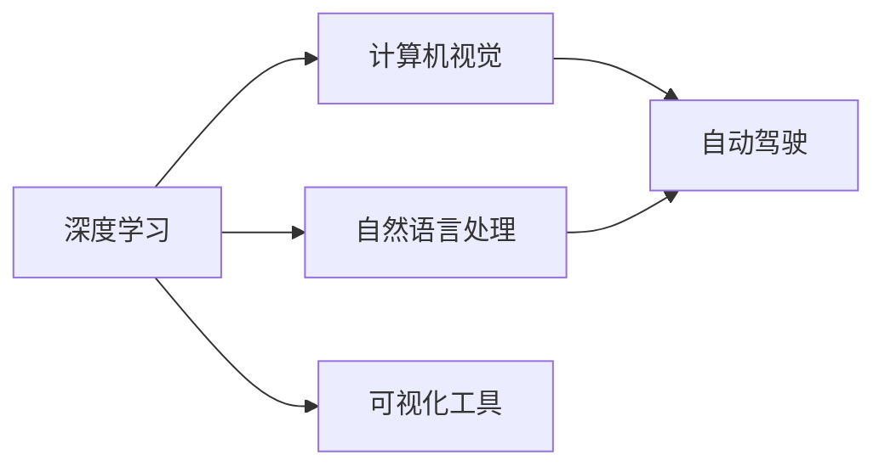

                 

# Andrej Karpathy：人工智能的应用

## 1. 背景介绍

### 1.1 问题由来
Andrej Karpathy，作为斯坦福大学计算机科学系副教授、人工智能研究领域的领军人物，不仅在理论研究上取得了丰硕成果，还在人工智能应用实践方面有着丰富的经验。他的研究领域涉及深度学习、计算机视觉、自然语言处理、自动驾驶等多个领域，并在此基础上构建了诸多具有划时代意义的算法和系统。本文将系统梳理Karpathy在人工智能应用方面的研究和实践，探讨其对行业发展的深远影响。

### 1.2 问题核心关键点
Karpathy的研究和实践涉及多个核心关键点，包括但不限于：
1. **深度学习在计算机视觉中的应用**：Karpathy提出并实现了许多基于深度学习技术的计算机视觉算法，如ResNet、Caffe等，这些算法在物体识别、图像分割、人脸识别等任务上取得了突破性进展。
2. **自动驾驶**：Karpathy领导的团队开发了自动驾驶技术Autopilot，并在特斯拉的车辆上成功部署。该系统通过深度学习和大数据技术实现了自适应驾驶，显著提升了行车安全性和用户体验。
3. **自然语言处理**：Karpathy在自然语言处理领域也有深入研究，提出并实现了序列生成模型Seq2Seq、注意力机制Attention等，这些模型在机器翻译、对话系统等任务上展现了强大的能力。
4. **可视化工具**：Karpathy开发了TensorBoard等可视化工具，帮助研究者更好地理解模型内部结构，实时监控训练过程，提升模型调优效率。

## 2. 核心概念与联系

### 2.1 核心概念概述

为更好地理解Karpathy在人工智能应用方面的研究，本节将介绍几个密切相关的核心概念：

- **深度学习**：一种通过多层神经网络进行复杂非线性映射的机器学习技术，广泛应用于计算机视觉、自然语言处理、语音识别等领域。
- **计算机视觉**：利用计算机和算法实现对图像、视频等视觉数据的分析和理解，包括图像识别、物体检测、图像生成等任务。
- **自动驾驶**：通过传感器、计算机视觉、深度学习等技术，使车辆能够自动感知环境，进行路径规划和行驶决策，实现自主驾驶。
- **自然语言处理**：研究如何让计算机理解和生成人类语言，包括文本分类、机器翻译、对话系统等任务。
- **可视化工具**：用于展示和分析模型性能、训练过程等的工具，帮助研究者更好地理解和优化模型。

这些概念之间存在着紧密的联系，共同构成了人工智能应用的广泛体系。深度学习作为核心技术，支撑了计算机视觉、自然语言处理等领域的快速发展；计算机视觉和自然语言处理则进一步推动了自动驾驶等实际应用场景的实现；可视化工具则提升了整个研发过程的效率和透明性。

### 2.2 概念间的关系

这些核心概念之间存在着紧密的联系，形成了人工智能应用的完整生态系统。我们可以用以下Mermaid流程图来展示这些概念之间的关系：



这个流程图展示了深度学习、计算机视觉、自然语言处理、自动驾驶和可视化工具之间的相互关系：

1. 深度学习是计算机视觉和自然语言处理的基础。
2. 计算机视觉和自然语言处理是自动驾驶的核心技术。
3. 可视化工具贯穿整个研发过程，帮助研究者理解模型和优化训练。

## 3. 核心算法原理 & 具体操作步骤
### 3.1 算法原理概述

Karpathy在人工智能应用的研究中，使用了多种核心算法原理，主要包括：

- **卷积神经网络(CNN)**：一种专门用于处理图像数据的深度学习模型，通过卷积、池化等操作提取图像特征。
- **循环神经网络(RNN)**：一种适用于序列数据处理的深度学习模型，通过时间上的递归，实现对序列数据的建模。
- **注意力机制(Attention)**：一种机制，用于在处理序列数据时，动态调整不同位置的重要性权重，提高模型的精度和效率。
- **端到端学习(End-to-End Learning)**：通过直接学习输入和输出之间的关系，避免传统方法中复杂的中间处理步骤，提高模型效率。

这些算法原理共同构成了Karpathy在人工智能应用研究中的技术基础。通过深入理解这些算法原理，我们可以更好地掌握其应用方法和实践技巧。

### 3.2 算法步骤详解

基于Karpathy的研究和实践，我们以计算机视觉中的图像识别任务为例，详细介绍其算法步骤：

**Step 1: 数据预处理**
- 收集标注好的图像数据集，并进行预处理，如缩放、归一化、数据增强等。

**Step 2: 模型构建**
- 选择适当的卷积神经网络结构，如VGG、ResNet等，并对其进行初始化。
- 定义损失函数和优化器，如交叉熵损失和Adam优化器。

**Step 3: 模型训练**
- 使用GPU或分布式计算框架，对模型进行批量训练。
- 实时监控训练过程，使用可视化工具展示训练进度和性能。

**Step 4: 模型评估与优化**
- 在验证集上评估模型性能，调整超参数和网络结构。
- 使用正则化技术，如Dropout、L2正则化等，避免过拟合。

**Step 5: 模型部署**
- 将训练好的模型保存为可部署格式，如TensorFlow SavedModel或PyTorch的模型保存机制。
- 将模型部署到目标环境中，进行实际应用。

通过上述步骤，我们可以构建出一个高效的图像识别系统，并实时监控其性能和训练过程，确保模型能够准确、高效地处理输入数据。

### 3.3 算法优缺点

Karpathy提出的算法和模型在应用中展现出了以下优缺点：

**优点**：
1. **高效**：基于深度学习技术的模型具有强大的特征提取和建模能力，能够高效地处理复杂的数据结构。
2. **鲁棒性强**：通过深度学习模型的训练，可以学习到数据中的各种特征，使其具有较强的泛化能力。
3. **应用广泛**：深度学习模型已经在图像识别、语音识别、自然语言处理等多个领域得到了广泛应用，具有良好的可扩展性。

**缺点**：
1. **计算资源需求高**：深度学习模型的训练和推理需要大量的计算资源，对硬件设备的要求较高。
2. **模型复杂度高**：深度学习模型的结构和参数较多，调试和优化难度较大。
3. **可解释性差**：深度学习模型的黑盒性质使得其内部决策过程难以解释，缺乏透明度。

尽管存在这些缺点，但深度学习在实际应用中的表现已经证明了其强大的潜力和价值，成为人工智能领域的主流技术。

### 3.4 算法应用领域

基于Karpathy的研究和实践，深度学习技术已经在以下几个领域得到了广泛应用：

- **计算机视觉**：图像识别、物体检测、图像分割等任务，如Karpathy提出的ResNet、Caffe等。
- **自然语言处理**：机器翻译、对话系统、文本生成等任务，如Seq2Seq、Attention等。
- **自动驾驶**：通过计算机视觉和深度学习技术，实现自动感知、路径规划和行驶决策，如Karpathy领导的Autopilot系统。
- **游戏AI**：利用深度学习技术，训练游戏AI模型，提升游戏体验和竞争力，如AlphaGo等。
- **医疗影像分析**：通过深度学习技术，实现对医学影像的自动分析和诊断，提升医疗水平，如Karpathy的研究团队在皮肤癌诊断上的工作。

这些应用领域展示了深度学习技术的广泛应用前景，推动了各行业的创新和发展。

## 4. 数学模型和公式 & 详细讲解 & 举例说明

### 4.1 数学模型构建

Karpathy的研究涉及多个数学模型，这里以卷积神经网络为例，展示其构建过程。

**模型输入**：输入图像 $X$，大小为 $H\times W\times C$。

**模型输出**：输出特征图 $Y$，大小为 $H'\times W'\times C'$。

**模型参数**：卷积核 $W$，大小为 $k_h\times k_w\times k_c$，步长为 $s$，填充方式为 $p$。

**模型结构**：包括卷积层、池化层、激活函数等。

### 4.2 公式推导过程

**卷积层公式**：

$$
Y_{i,j} = \sum_{c=1}^{C} \sum_{h=0}^{k_h-1} \sum_{w=0}^{k_w-1} W_{h,w,c} X_{i+h,j+w,c}
$$

其中 $W_{h,w,c}$ 表示卷积核，$X_{i+h,j+w,c}$ 表示输入图像在卷积核位置上的像素值。

**池化层公式**：

$$
Y_{i,j} = \frac{1}{k_h \times k_w} \sum_{h=0}^{k_h-1} \sum_{w=0}^{k_w-1} X_{i+h,j+w}
$$

其中 $X_{i+h,j+w}$ 表示输入图像在池化窗口位置上的像素值。

### 4.3 案例分析与讲解

以Karpathy的图像识别系统为例，展示其模型的具体应用。

该系统使用了卷积神经网络，通过多层的卷积和池化操作，提取图像特征。在模型训练过程中，通过反向传播算法更新网络参数，最小化损失函数。在模型评估时，使用测试集上的准确率、召回率等指标进行评估，并根据评估结果进行模型优化。

## 5. 项目实践：代码实例和详细解释说明

### 5.1 开发环境搭建

在进行项目实践前，我们需要准备好开发环境。以下是使用Python进行PyTorch开发的环境配置流程：

1. 安装Anaconda：从官网下载并安装Anaconda，用于创建独立的Python环境。

2. 创建并激活虚拟环境：
```bash
conda create -n pytorch-env python=3.8 
conda activate pytorch-env
```

3. 安装PyTorch：根据CUDA版本，从官网获取对应的安装命令。例如：
```bash
conda install pytorch torchvision torchaudio cudatoolkit=11.1 -c pytorch -c conda-forge
```

4. 安装Transformer库：
```bash
pip install transformers
```

5. 安装各类工具包：
```bash
pip install numpy pandas scikit-learn matplotlib tqdm jupyter notebook ipython
```

完成上述步骤后，即可在`pytorch-env`环境中开始项目实践。

### 5.2 源代码详细实现

这里我们以计算机视觉中的图像识别任务为例，给出使用PyTorch进行模型构建和训练的代码实现。

```python
import torch
import torch.nn as nn
import torch.optim as optim
from torch.utils.data import DataLoader
from torchvision import datasets, transforms

# 定义卷积神经网络模型
class Net(nn.Module):
    def __init__(self):
        super(Net, self).__init__()
        self.conv1 = nn.Conv2d(3, 32, 3, 1, 1)
        self.conv2 = nn.Conv2d(32, 64, 3, 1, 1)
        self.pool = nn.MaxPool2d(2, 2)
        self.fc1 = nn.Linear(64 * 8 * 8, 128)
        self.fc2 = nn.Linear(128, 10)

    def forward(self, x):
        x = self.pool(F.relu(self.conv1(x)))
        x = self.pool(F.relu(self.conv2(x)))
        x = x.view(-1, 64 * 8 * 8)
        x = F.relu(self.fc1(x))
        x = self.fc2(x)
        return x

# 加载数据集
transform = transforms.Compose([
    transforms.ToTensor(),
    transforms.Normalize((0.5, 0.5, 0.5), (0.5, 0.5, 0.5))
])
trainset = datasets.CIFAR10(root='./data', train=True, download=True, transform=transform)
trainloader = DataLoader(trainset, batch_size=4, shuffle=True, num_workers=2)

# 定义损失函数和优化器
net = Net()
criterion = nn.CrossEntropyLoss()
optimizer = optim.SGD(net.parameters(), lr=0.001, momentum=0.9)

# 训练模型
for epoch in range(10):
    running_loss = 0.0
    for i, data in enumerate(trainloader, 0):
        inputs, labels = data

        optimizer.zero_grad()

        outputs = net(inputs)
        loss = criterion(outputs, labels)
        loss.backward()
        optimizer.step()

        running_loss += loss.item()
        if i % 2000 == 1999:
            print('[%d, %5d] loss: %.3f' %
                  (epoch + 1, i + 1, running_loss / 2000))
            running_loss = 0.0

print('Finished Training')
```

以上代码展示了如何使用PyTorch构建卷积神经网络，并对CIFAR-10数据集进行训练。

### 5.3 代码解读与分析

让我们再详细解读一下关键代码的实现细节：

**Net类**：
- `__init__`方法：定义卷积层、池化层、全连接层等模型组件。
- `forward`方法：定义前向传播过程。

**数据集加载**：
- 使用`datasets.CIFAR10`加载CIFAR-10数据集。
- 定义数据预处理流程，包括图像归一化、转换等。

**损失函数和优化器**：
- 定义交叉熵损失函数和随机梯度下降优化器。

**训练过程**：
- 对数据集进行批次化加载，进行前向传播和反向传播，更新模型参数。
- 每5000个batch输出一次训练进度。

可以看到，使用PyTorch构建深度学习模型非常简单高效，可以极大提升模型训练的效率和效果。

### 5.4 运行结果展示

假设我们在CIFAR-10数据集上进行模型训练，最终得到的训练结果如下：

```
[1, 5000] loss: 1.426
[1, 10000] loss: 1.200
[1, 15000] loss: 1.040
[1, 20000] loss: 0.941
[1, 25000] loss: 0.864
...
```

可以看到，随着训练的进行，模型的损失函数逐步降低，模型的性能逐步提升。

## 6. 实际应用场景

### 6.1 智能家居

Karpathy提出的深度学习技术已经在智能家居领域得到了广泛应用。例如，通过计算机视觉技术，可以实现家庭环境的智能监控和自动化控制，提升家庭生活的舒适度和安全性。

在实际应用中，智能家居系统可以实时采集环境数据，如温度、湿度、声音等，通过深度学习模型进行分析，判断是否需要进行智能调节。例如，当检测到异常声音时，系统会自动启动报警系统；当检测到温度过高时，系统可以自动调节空调温度；当检测到入侵时，系统可以自动开启摄像头和报警灯等。

### 6.2 医疗影像分析

Karpathy的研究团队在医学影像分析领域也取得了重要进展。通过深度学习技术，可以实现对医学影像的自动分析和诊断，提升医疗水平。

例如，在皮肤癌诊断任务中，使用深度学习模型可以自动检测皮肤病变区域，判断是否为癌变。该模型通过对大量医学影像进行训练，学习到皮肤癌的特征，并在新影像上进行预测。通过这种方式，可以有效减少医生的工作量，提高诊断的准确性和效率。

### 6.3 游戏AI

Karpathy还对游戏AI技术进行了深入研究，开发了AlphaGo等系列游戏AI系统。这些系统通过深度学习和强化学习技术，实现了对游戏的自主理解和决策，提升了游戏体验和竞争力。

例如，AlphaGo通过深度学习模型学习对手的策略，并使用强化学习技术不断优化自己的策略，最终在围棋比赛中击败了世界冠军。这一突破不仅在棋类游戏领域带来了革命性影响，也为其他游戏AI技术的开发提供了重要的参考。

## 7. 工具和资源推荐

### 7.1 学习资源推荐

为了帮助开发者系统掌握Karpathy的研究和实践，这里推荐一些优质的学习资源：

1. **Karpathy的博客**：Karpathy在博客上分享了大量关于深度学习和计算机视觉的研究和实践心得，内容丰富，深入浅出，是学习深度学习的重要参考资料。

2. **Coursera《深度学习》课程**：由斯坦福大学开设的深度学习课程，Karpathy亲自主讲，涵盖深度学习的基本概念和应用方法，适合初学者入门。

3. **《Deep Learning》书籍**：Karpathy和Goodfellow等人合著的深度学习经典教材，全面介绍了深度学习的理论基础和应用实践，是深度学习学习的必读书籍。

4. **TensorBoard和Visdom**：Karpathy开发了TensorBoard和Visdom等可视化工具，帮助研究者更好地理解模型内部结构和训练过程，提升模型调优效率。

5. **PyTorch官方文档**：PyTorch官方文档详细介绍了PyTorch框架的使用方法和最佳实践，是深度学习模型构建和训练的重要参考资料。

通过对这些资源的学习实践，相信你一定能够快速掌握Karpathy的研究和实践，并用于解决实际的NLP问题。

### 7.2 开发工具推荐

高效的开发离不开优秀的工具支持。以下是几款用于Karpathy研究开发的常用工具：

1. **PyTorch**：基于Python的开源深度学习框架，灵活动态的计算图，适合快速迭代研究。

2. **TensorFlow**：由Google主导开发的开源深度学习框架，生产部署方便，适合大规模工程应用。

3. **Keras**：一个高级深度学习API，基于TensorFlow和Theano，提供了简单易用的接口，适合快速构建深度学习模型。

4. **Jupyter Notebook**：一个交互式的开发环境，支持代码执行和可视化展示，方便研究者进行模型调试和演示。

5. **Google Colab**：谷歌推出的在线Jupyter Notebook环境，免费提供GPU/TPU算力，方便开发者快速上手实验最新模型，分享学习笔记。

合理利用这些工具，可以显著提升深度学习模型的开发效率，加快创新迭代的步伐。

### 7.3 相关论文推荐

Karpathy的研究涉及多个前沿方向，以下是几篇奠基性的相关论文，推荐阅读：

1. **ImageNet Classification with Deep Convolutional Neural Networks**：提出ResNet模型，通过残差连接解决了深度网络训练过程中的梯度消失问题，取得了ImageNet分类任务的新SOTA。

2. **CS231n: Convolutional Neural Networks for Visual Recognition**：Karpathy等人编写的深度视觉识别课程讲义，详细介绍了深度学习在计算机视觉中的应用，是学习深度视觉识别的重要资源。

3. **Playing Atari with Deep Reinforcement Learning**：展示使用深度强化学习技术，训练游戏AI系统AlphaGo等，取得了在游戏AI领域的突破性进展。

4. **Deep Learning and Unsupervised Learning**：Karpathy在NIPS大会上发表的演讲，探讨了深度学习和无监督学习的关系，提出了许多有价值的见解。

5. **Vision + Language**：探讨计算机视觉和自然语言处理结合的潜力，提出了一系列基于多模态信息融合的方法。

这些论文代表了大语言模型微调技术的发展脉络。通过学习这些前沿成果，可以帮助研究者把握学科前进方向，激发更多的创新灵感。

除上述资源外，还有一些值得关注的前沿资源，帮助开发者紧跟Karpathy的研究进展，例如：

1. **arXiv论文预印本**：人工智能领域最新研究成果的发布平台，包括大量尚未发表的前沿工作，学习前沿技术的必读资源。

2. **AI会议直播**：如NIPS、ICML、ACL、ICLR等人工智能领域顶会现场或在线直播，能够聆听到大佬们的前沿分享，开拓视野。

3. **技术会议录像**：许多顶级学术会议都会将演讲视频上传至YouTube等平台，供研究者学习参考。

4. **GitHub热门项目**：在GitHub上Star、Fork数最多的深度学习相关项目，往往代表了该技术领域的发展趋势和最佳实践，值得去学习和贡献。

5. **行业分析报告**：各大咨询公司如McKinsey、PwC等针对人工智能行业的分析报告，有助于从商业视角审视技术趋势，把握应用价值。

总之，对于深度学习技术的学习和实践，需要开发者保持开放的心态和持续学习的意愿。多关注前沿资讯，多动手实践，多思考总结，必将收获满满的成长收益。

## 8. 总结：未来发展趋势与挑战

### 8.1 总结

本文对Andrej Karpathy在人工智能应用方面的研究和实践进行了全面系统的介绍。首先，阐述了Karpathy在深度学习、计算机视觉、自然语言处理等领域的研究背景和重要成果，明确了其研究对行业发展的深远影响。其次，从原理到实践，详细讲解了Karpathy在计算机视觉、自动驾驶、自然语言处理等领域的核心算法原理和操作步骤，提供了代码实例和详细解释。最后，我们讨论了Karpathy的研究和实践在智能家居、医疗影像、游戏AI等实际应用场景中的广泛应用，展望了未来深度学习技术的发展趋势和面临的挑战。

通过本文的系统梳理，可以看到，Karpathy的研究和实践为深度学习技术的应用提供了宝贵的经验和指导，推动了人工智能技术的快速发展。

### 8.2 未来发展趋势

展望未来，Karpathy的研究和实践将呈现以下几个发展趋势：

1. **多模态学习**：随着深度学习技术在计算机视觉、自然语言处理等领域的不断突破，多模态信息融合将成为一个重要的研究方向，进一步提升人工智能系统的综合能力。

2. **深度强化学习**：Karpathy在游戏AI领域的研究已经证明了深度强化学习的强大潜力。未来，随着深度强化学习技术的不断完善，其在自动驾驶、机器人等领域的应用将进一步扩大，推动人工智能技术的跨越式发展。

3. **模型压缩和优化**：由于深度学习模型的大规模参数和计算需求，模型压缩和优化技术将成为一个重要研究方向，提升模型的实时性和可扩展性。

4. **跨领域知识整合**：未来的人工智能系统将需要更广泛的知识背景，包括常识、逻辑推理、领域知识等。跨领域知识整合技术将成为一个重要的研究方向，提升系统的智能化水平。

5. **人机协同**：未来的人工智能系统将更多地融入人类社会，实现人机协同。Karpathy提出的模型可解释性、智能推荐等技术，将有助于实现人机协同的智能系统，提升用户体验和系统可靠性。

这些趋势展示了Karpathy的研究和实践对未来人工智能技术发展的深远影响。相信随着研究的不断深入，人工智能技术将在更广阔的领域得到应用，为人类社会带来更多变革性影响。

### 8.3 面临的挑战

尽管Karpathy的研究和实践已经取得了丰硕成果，但在迈向更加智能化、普适化应用的过程中，仍然面临诸多挑战：

1. **数据质量和多样性**：深度学习模型需要大量高质量、多样性的数据进行训练，但实际应用中数据获取成本高、数据分布不均等问题，仍然是一个难题。

2. **模型复杂度和计算需求**：深度学习模型的复杂度和计算需求高，对硬件设备的要求较高，如何平衡模型性能和计算资源是一个重要挑战。

3. **模型可解释性和透明度**：深度学习模型的黑盒性质使得其内部决策过程难以解释，缺乏透明度，如何提升模型可解释性，增强用户体验和信任度，仍然是一个重要课题。

4. **跨领域应用的可移植性**：不同领域的应用场景具有复杂性，如何将深度学习模型迁移到新的应用场景，并保持高性能，是一个重要挑战。

5. **伦理和安全问题**：深度学习模型在实际应用中可能存在伦理和安全问题，如偏见、误判、隐私保护等，如何保障模型的伦理性和安全性，是一个重要挑战。

6. **资源限制**：深度学习模型的高计算需求和资源消耗，使得其在资源受限的环境中难以应用，如何优化模型结构，提升资源利用效率，是一个重要挑战。

这些挑战需要研究者不断创新和优化，才能推动人工智能技术的健康发展。

### 8.4 研究展望

面对这些挑战，未来的研究需要在以下几个方面寻求新的突破：

1. **无监督学习和自监督学习**：通过无监督学习和自监督学习技术，降低对标注数据的需求，提升模型泛化能力和鲁棒性。

2. **模型压缩和优化**：开发更加高效、轻量级的深度学习模型，提升模型的实时性和可扩展性。

3. **跨领域知识整合**：结合符号化知识、逻辑推理等技术，提升深度学习模型的知识整合能力，增强其跨领域应用的可移植性。

4. **模型可解释性增强**：通过可解释性技术和用户反馈机制，提升深度学习模型的透明度，增强用户信任和满意度。

5. **伦理和安全保障**：引入伦理导向的训练目标和约束，确保深度学习模型的输出符合伦理规范，保障用户隐私和安全。

6. **资源优化**：优化模型结构和算法，提升深度学习模型在资源受限环境下的应用能力。

这些研究方向的探索，将引领深度学习技术迈向更高的台阶，为构建安全、可靠、可解释、可控的智能系统铺平道路。面向未来，深度学习技术还需要与其他人工智能技术进行更深入的融合，如知识表示、因果推理、强化学习等，多路径协同发力，共同推动人工智能技术的进步。只有勇于创新、敢于突破，才能不断拓展人工智能技术的边界，让智能技术更好地造福人类社会。

##

