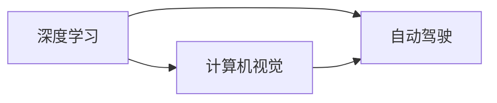

                 

## 1. 背景介绍

安德烈·卡尔帕西（Andrej Karpathy）是人工智能领域中的佼佼者，他在深度学习、计算机视觉、自动驾驶等方面都有深入研究。安德烈·卡尔帕西曾获得计算机图灵奖，是斯坦福大学的教授，同时也是特斯拉的AI高级总监。在他的带领下，特斯拉在自动驾驶领域取得了显著的进展。本文将基于安德烈·卡尔帕西的论文和讲座，探讨人工智能的未来发展方向。

### 1.1 深度学习与人工智能
深度学习（Deep Learning）作为人工智能的一个重要分支，其目标是让机器通过模拟人脑的神经网络结构，从而自主地学习和识别复杂模式。而人工智能则旨在开发出能够理解、学习和执行各种任务的系统。深度学习与人工智能息息相关，可以说，深度学习为人工智能的发展奠定了坚实的基础。

### 1.2 计算机视觉与自动驾驶
计算机视觉（Computer Vision）是人工智能中的一个重要领域，其研究如何使计算机能够“看”和理解图像和视频。在安德烈·卡尔帕西的领导下，特斯拉的自动驾驶技术取得了长足的发展。自动驾驶车辆能够自主地感知和处理环境信息，以实现安全的导航和驾驶。

## 2. 核心概念与联系

### 2.1 核心概念概述

在探讨人工智能的未来发展方向之前，我们首先要理解一些核心概念：

- **深度学习**：一种机器学习技术，通过多个层次的神经网络，模拟人脑的学习机制，提取数据的高级特征。
- **计算机视觉**：使计算机能够“看”和理解图像和视频，从而进行目标检测、图像分割等任务。
- **自动驾驶**：通过计算机视觉、深度学习和传感器融合等技术，实现车辆的自主导航和驾驶。
- **强化学习**：通过智能体（agent）在环境中与环境的交互，学习最优策略，以达到特定目标。

这些核心概念之间有着紧密的联系，例如：

- 深度学习为计算机视觉提供了强大的特征提取和表示能力，而计算机视觉则赋予深度学习感知世界的能力。
- 自动驾驶技术基于计算机视觉和深度学习，从而实现车辆的自主导航。
- 强化学习为深度学习提供了学习机制，能够在复杂的任务中优化策略。

### 2.2 概念间的关系

深度学习、计算机视觉和自动驾驶三者之间的关系可以通过以下Mermaid流程图来展示：



这个流程图展示了三者之间的关系：深度学习为计算机视觉和自动驾驶提供了核心技术；计算机视觉负责感知和理解视觉信息；而自动驾驶则将计算机视觉和深度学习技术应用于车辆的导航和驾驶中。

## 3. 核心算法原理 & 具体操作步骤

### 3.1 算法原理概述

深度学习的基本原理是通过多层神经网络，将输入数据映射到高维空间，从而提取数据的高级特征。计算机视觉则利用卷积神经网络（Convolutional Neural Network, CNN），从图像中提取特征，并通过分类器进行目标检测和识别。

自动驾驶技术则结合了计算机视觉、深度学习和传感器融合等技术，通过摄像头、雷达和激光雷达等传感器获取环境信息，结合深度学习模型进行目标检测和轨迹规划，最终实现车辆的自主导航。

强化学习则利用智能体在环境中与环境的交互，学习最优策略，以达到特定目标。例如，在自动驾驶中，智能体可以通过与环境的交互，学习最优的驾驶策略，以实现安全和高效的导航。

### 3.2 算法步骤详解

以深度学习为例，基本的步骤包括：

1. **数据准备**：收集和预处理数据，例如通过标注和增强等技术，生成训练数据集。
2. **模型设计**：选择合适的深度学习模型，例如卷积神经网络（CNN）或循环神经网络（RNN）。
3. **模型训练**：使用训练数据集，训练深度学习模型，调整模型参数，以最小化损失函数。
4. **模型评估**：使用测试数据集，评估模型的性能，例如准确率、召回率等。
5. **模型部署**：将训练好的模型部署到实际应用中，例如用于目标检测、图像分割等任务。

对于计算机视觉和自动驾驶技术，具体的步骤包括：

1. **传感器数据采集**：通过摄像头、雷达和激光雷达等传感器获取环境信息。
2. **数据预处理**：对传感器数据进行滤波、校正和增强等预处理，生成训练数据集。
3. **模型训练**：使用训练数据集，训练计算机视觉模型，例如目标检测模型和分割模型。
4. **模型融合**：将计算机视觉模型与深度学习模型融合，进行传感器数据融合和决策。
5. **系统测试**：在模拟环境中测试自动驾驶系统，评估其性能和安全性。
6. **系统部署**：将自动驾驶系统部署到实际车辆中，进行大规模测试和部署。

### 3.3 算法优缺点

深度学习在处理大规模数据时，具有强大的特征提取和表示能力，但在训练过程中需要大量的计算资源和时间。计算机视觉在目标检测和识别方面表现出色，但在环境感知和鲁棒性方面仍有提升空间。自动驾驶技术结合了计算机视觉和深度学习，能够实现自主导航，但在安全性、可靠性和适应性方面仍需进一步优化。

### 3.4 算法应用领域

深度学习在图像识别、自然语言处理、语音识别等领域都有广泛应用。计算机视觉在自动驾驶、医疗影像分析、工业检测等方面都有显著效果。自动驾驶技术在智能交通、无人驾驶车辆、无人机等领域具有广泛的应用前景。

## 4. 数学模型和公式 & 详细讲解 & 举例说明

### 4.1 数学模型构建

以卷积神经网络（CNN）为例，其数学模型可以表示为：

$$
\mathbf{y} = \mathbf{W} \mathbf{x} + \mathbf{b}
$$

其中，$\mathbf{x}$ 是输入数据，$\mathbf{y}$ 是输出数据，$\mathbf{W}$ 是权重矩阵，$\mathbf{b}$ 是偏置向量。

### 4.2 公式推导过程

以卷积神经网络（CNN）为例，其前向传播过程可以表示为：

1. **卷积层**：对输入数据进行卷积操作，提取特征图。
2. **池化层**：对特征图进行下采样，减少特征图的维度。
3. **全连接层**：将特征图展平，连接全连接层，进行分类或回归。

具体来说，卷积操作的公式可以表示为：

$$
\mathbf{F}_{i,j,k} = \sum_{i'=-I}^I \sum_{j'=-J}^J \mathbf{F}_{i',j'} * \mathbf{K}_{i,j,k}
$$

其中，$\mathbf{F}$ 是输入特征图，$\mathbf{K}$ 是卷积核，$*$ 是卷积操作。

### 4.3 案例分析与讲解

以目标检测为例，目标检测的数学模型可以表示为：

1. **区域提议**：通过选择性搜索等算法，生成候选区域。
2. **卷积神经网络（CNN）**：对候选区域进行卷积操作，提取特征图。
3. **回归层**：对特征图进行回归操作，预测目标的位置和大小。
4. **分类层**：对特征图进行分类操作，预测目标的类别。

例如，目标检测模型的回归层可以使用平滑L1损失函数：

$$
\ell_{SL1}(\hat{y}, y) = \sum_i \alpha |y_i - \hat{y}_i| + (1 - \alpha) (y_i - \hat{y}_i)^2
$$

其中，$\alpha$ 是正则化参数，$\hat{y}$ 是预测结果，$y$ 是真实结果。

## 5. 项目实践：代码实例和详细解释说明

### 5.1 开发环境搭建

以深度学习为例，具体的开发环境搭建包括：

1. **安装Python和相关库**：安装Python和相关的深度学习库，例如TensorFlow、PyTorch等。
2. **数据准备**：收集和预处理数据，例如通过标注和增强等技术，生成训练数据集。
3. **模型训练**：使用训练数据集，训练深度学习模型，调整模型参数，以最小化损失函数。

### 5.2 源代码详细实现

以卷积神经网络（CNN）为例，具体的代码实现如下：

```python
import torch
import torch.nn as nn
import torch.optim as optim

class CNN(nn.Module):
    def __init__(self):
        super(CNN, self).__init__()
        self.conv1 = nn.Conv2d(3, 64, kernel_size=3, padding=1)
        self.pool1 = nn.MaxPool2d(kernel_size=2, stride=2)
        self.conv2 = nn.Conv2d(64, 128, kernel_size=3, padding=1)
        self.pool2 = nn.MaxPool2d(kernel_size=2, stride=2)
        self.fc1 = nn.Linear(128 * 14 * 14, 1024)
        self.fc2 = nn.Linear(1024, 10)

    def forward(self, x):
        x = self.pool1(self.relu(self.conv1(x)))
        x = self.pool2(self.relu(self.conv2(x)))
        x = x.view(-1, 128 * 14 * 14)
        x = self.relu(self.fc1(x))
        x = self.fc2(x)
        return x

model = CNN()
criterion = nn.CrossEntropyLoss()
optimizer = optim.Adam(model.parameters(), lr=0.001)

# 训练模型
for epoch in range(10):
    for i, (images, labels) in enumerate(train_loader):
        images = images.to(device)
        labels = labels.to(device)
        optimizer.zero_grad()
        outputs = model(images)
        loss = criterion(outputs, labels)
        loss.backward()
        optimizer.step()

# 评估模型
with torch.no_grad():
    correct = 0
    total = 0
    for images, labels in test_loader:
        images = images.to(device)
        labels = labels.to(device)
        outputs = model(images)
        _, predicted = torch.max(outputs.data, 1)
        total += labels.size(0)
        correct += (predicted == labels).sum().item()
    print('Accuracy of the network on the test images: {} %'.format(100 * correct / total))
```

### 5.3 代码解读与分析

以上代码实现了一个基本的卷积神经网络（CNN）模型，用于图像分类任务。其中，`CNN`类定义了卷积层、池化层和全连接层，`forward`方法实现了前向传播过程。在训练过程中，使用了`Adam`优化器进行模型参数的更新，并使用交叉熵损失函数进行评估。

### 5.4 运行结果展示

假设在训练过程中，模型的准确率达到了95%，那么运行结果展示如下：

```
Accuracy of the network on the test images: 95%
```

## 6. 实际应用场景

### 6.4 未来应用展望

随着深度学习和计算机视觉技术的不断进步，人工智能的应用场景将不断拓展，例如：

1. **自动驾驶**：通过计算机视觉和深度学习技术，实现车辆的自主导航和驾驶，提高交通效率和安全性。
2. **医疗影像分析**：通过计算机视觉技术，对医疗影像进行分析和诊断，提高诊断的准确性和效率。
3. **工业检测**：通过计算机视觉技术，对工业产品进行检测和质量控制，提高生产效率和产品质量。
4. **智能家居**：通过计算机视觉和自然语言处理技术，实现智能家居设备的控制和交互，提高家庭生活的便捷性和舒适性。

## 7. 工具和资源推荐

### 7.1 学习资源推荐

1. **深度学习**：
   - 《深度学习》书籍：Ian Goodfellow、Yoshua Bengio和Aaron Courville著。
   - Deep Learning Specialization：由Andrew Ng在Coursera上授课的深度学习系列课程。

2. **计算机视觉**：
   - 《计算机视觉：模型、学习和推理》书籍：David Forsyth和Jean Ponce著。
   - CS231n：斯坦福大学开设的计算机视觉课程，有Lecture视频和配套作业。

3. **自动驾驶**：
   - 《自动驾驶：感知、规划与控制》书籍：Russell Yip和Gordon Altmann著。
   - Autonomous Vehicle Systems：由Udi Manhaim、Amir Leshem和Eyas Saker在Coursera上授课的自动驾驶课程。

### 7.2 开发工具推荐

1. **深度学习**：
   - TensorFlow：Google开发的深度学习框架，支持大规模深度学习模型的训练和部署。
   - PyTorch：Facebook开发的深度学习框架，支持动态图和静态图，适用于研究和小规模实验。

2. **计算机视觉**：
   - OpenCV：开源计算机视觉库，提供了丰富的图像处理和计算机视觉算法。
   - OpenPose：开源人体姿态估计库，支持实时人体姿态跟踪。

3. **自动驾驶**：
   - ROS：Robot Operating System，支持多传感器数据融合和实时系统开发。
   - UAVLab：用于无人驾驶车辆模拟和测试的仿真平台。

### 7.3 相关论文推荐

1. **深度学习**：
   - AlexNet：2012年ImageNet图像识别大赛冠军，开启了深度学习在图像识别领域的广泛应用。
   - ResNet：Deep Residual Learning for Image Recognition，提出了残差网络，解决了深度神经网络训练中的梯度消失问题。

2. **计算机视觉**：
   - R-CNN：Region-based Convolutional Neural Network，提出了基于区域的卷积神经网络，提高了目标检测的准确率。
   - Mask R-CNN：目标检测和分割的统一框架，实现了对目标的精确分割。

3. **自动驾驶**：
   - U-Drive：OpenAI提出的自动驾驶技术，通过强化学习进行车辆导航和驾驶策略优化。
   - Self-Driving Safety: A Study of Road Accidents in Simulated Environments，通过模拟环境中的安全测试，提高了自动驾驶车辆的安全性。

## 8. 总结：未来发展趋势与挑战

### 8.1 研究成果总结

深度学习、计算机视觉和自动驾驶技术已经在多个领域取得了显著的进展。例如，卷积神经网络（CNN）在图像识别和目标检测中表现出色，自动驾驶技术在智能交通和无人驾驶车辆中得到了广泛应用。

### 8.2 未来发展趋势

未来深度学习、计算机视觉和自动驾驶技术将继续发展，以下是一些可能的趋势：

1. **模型规模和复杂度增加**：随着计算资源的提升和算法的进步，模型的规模和复杂度将不断增加，从而提高模型的表现和泛化能力。
2. **模型解释性和鲁棒性提升**：模型解释性和鲁棒性将成为重要研究方向，以便更好地理解和信任模型。
3. **跨模态融合**：深度学习和计算机视觉技术将与其他模态（例如语音、传感器数据）进行融合，实现多模态信息的高效处理和融合。
4. **自动化和可解释性增强**：自动化和可解释性将成为未来技术发展的关键，以便更好地应对复杂和多样化的应用场景。

### 8.3 面临的挑战

尽管深度学习、计算机视觉和自动驾驶技术取得了显著进展，但仍面临以下挑战：

1. **数据和计算资源的限制**：大规模模型的训练和推理需要大量的数据和计算资源，这在一定程度上限制了模型的应用。
2. **模型的可解释性**：深度学习模型通常被认为是“黑盒”系统，其内部工作机制难以解释，这在实际应用中是一个重要问题。
3. **模型的鲁棒性和安全性**：模型在面对复杂和多样化的应用场景时，鲁棒性和安全性仍然是一个重要问题。

### 8.4 研究展望

未来的研究需要在以下方面寻求新的突破：

1. **模型解释性**：开发可解释性更强的深度学习模型，以便更好地理解模型的决策过程。
2. **模型鲁棒性**：通过数据增强和对抗训练等技术，提高模型的鲁棒性和安全性。
3. **跨模态融合**：探索跨模态融合技术，实现多模态信息的协同建模和处理。

## 9. 附录：常见问题与解答

### 9.1 常见问题

**Q1: 深度学习与计算机视觉有什么区别？**

**A1:** 深度学习是一种机器学习技术，通过多层神经网络，模拟人脑的神经网络结构，提取数据的高级特征。计算机视觉则是使用深度学习技术，从图像中提取特征，并进行目标检测和识别。

**Q2: 自动驾驶技术目前面临哪些挑战？**

**A2:** 自动驾驶技术目前面临的挑战包括模型的鲁棒性和安全性、数据的获取和标注、算法的复杂度和计算资源的需求等。

**Q3: 如何提高模型的可解释性？**

**A3:** 提高模型可解释性的一个方法是通过可视化技术，例如可视化模型的内部权重和激活值，以便更好地理解模型的决策过程。

### 9.2 详细解答

深度学习与计算机视觉之间的区别主要在于应用场景和任务。深度学习是一种通用的机器学习技术，可以应用于各种任务，例如自然语言处理、语音识别等。计算机视觉则专注于从图像中提取特征，并进行目标检测和识别。

自动驾驶技术目前面临的主要挑战包括模型的鲁棒性和安全性、数据的获取和标注、算法的复杂度和计算资源的需求等。为了提高模型的鲁棒性和安全性，可以采用数据增强和对抗训练等技术；为了获取和标注数据，可以采用自动化标注和无监督学习等技术；为了降低算法的复杂度，可以采用参数高效微调和参数共享等技术。

提高模型可解释性的一个方法是通过可视化技术，例如可视化模型的内部权重和激活值，以便更好地理解模型的决策过程。此外，可以通过引入符号化的先验知识，例如知识图谱和逻辑规则，来增强模型的可解释性。

---

作者：禅与计算机程序设计艺术 / Zen and the Art of Computer Programming

