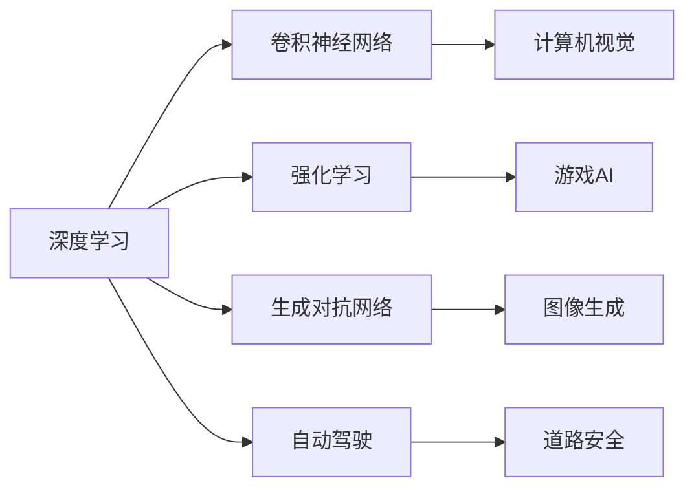

                 

# Andrej Karpathy：人工智能的未来发展方向

## 1. 背景介绍

安德烈·卡帕西（Andrej Karpathy）是深度学习领域的顶尖研究者之一，以其对计算机视觉和深度学习领域的卓越贡献闻名。他是斯坦福大学教授，特斯拉AI总监，以及创办了OpenAI的项目X。卡帕西的最新工作集中在自动驾驶技术上，他开发了卷积神经网络（CNN）等先进模型，并领导了Tesla在自动驾驶领域的探索。本文旨在深入探讨安德烈·卡帕西对人工智能未来发展方向的见解，以及他对深度学习领域的最新研究进展。

## 2. 核心概念与联系

### 2.1 核心概念概述

在探讨人工智能的未来发展方向时，卡帕西强调了以下几个关键概念：

- **深度学习（Deep Learning）**：一种基于多层神经网络的机器学习方法，能够处理非线性和复杂模式，广泛应用于计算机视觉、自然语言处理等领域。
- **卷积神经网络（CNN）**：一种特殊的深度学习模型，擅长处理具有空间结构的数据，如图像和视频。
- **自动驾驶（Autonomous Driving）**：使用AI技术实现车辆自主行驶，无需人类干预，旨在提升道路安全性和交通效率。
- **强化学习（Reinforcement Learning）**：一种通过与环境互动学习最优行为策略的机器学习技术，广泛应用于游戏AI、机器人控制等领域。
- **生成对抗网络（GAN）**：一种生成模型，通过生成器和判别器两个网络对抗学习生成逼真的样本，常用于图像生成、数据增强等领域。

### 2.2 概念间的关系

这些核心概念之间存在紧密的联系，形成了卡帕西对AI未来发展方向的整体构想。下面通过一个Mermaid流程图展示这些概念之间的关系：



该图展示了深度学习如何通过卷积神经网络等模型应用于计算机视觉，通过强化学习应用于游戏AI，并通过生成对抗网络应用于图像生成，而自动驾驶则是深度学习和强化学习在现实世界中的一个重要应用场景。

## 3. 核心算法原理 & 具体操作步骤

### 3.1 算法原理概述

卡帕西对深度学习算法原理的阐述主要集中在以下几个方面：

- **反向传播算法**：深度学习模型的核心算法，通过梯度下降优化模型参数，使得模型能够最小化预测误差。
- **卷积操作**：卷积神经网络的关键操作，能够提取图像和视频中的局部特征，是计算机视觉任务中的常用技术。
- **生成对抗网络**：由生成器和判别器两个网络组成，通过对抗训练生成逼真的样本，广泛应用于图像生成和数据增强。
- **强化学习**：通过与环境互动学习最优策略，能够处理复杂的环境和奖励结构，常用于游戏AI和自动驾驶等任务。

### 3.2 算法步骤详解

卡帕西在实际操作深度学习算法时，通常会遵循以下步骤：

1. **数据准备**：收集和预处理训练数据，确保数据的多样性和代表性。
2. **模型设计**：选择合适的深度学习模型架构，如卷积神经网络、生成对抗网络等。
3. **模型训练**：使用反向传播算法和优化器（如Adam、SGD等）训练模型，调整模型参数。
4. **模型评估**：在测试集上评估模型性能，如准确率、损失等指标。
5. **模型部署**：将训练好的模型部署到实际应用中，进行实时推理和预测。

### 3.3 算法优缺点

卡帕西指出，深度学习算法具有以下优点：

- **自动特征提取**：深度学习模型能够自动学习数据中的特征，减少手动特征工程的工作量。
- **高性能**：在许多任务上，深度学习模型已经超过了传统机器学习模型的性能。
- **可扩展性**：深度学习模型可以通过增加网络层数或节点数来提高性能，具有很强的扩展性。

同时，深度学习算法也存在一些缺点：

- **计算资源需求高**：深度学习模型通常需要大量的计算资源，如GPU和TPU等高性能设备。
- **训练时间长**：深度学习模型的训练时间较长，尤其是大规模模型和复杂任务。
- **可解释性不足**：深度学习模型通常被视为"黑盒"，其决策过程难以解释。

### 3.4 算法应用领域

卡帕西的研究涉及多个领域，包括计算机视觉、自动驾驶、自然语言处理等。他的工作在多个顶级会议和期刊上发表，并获得了多项荣誉和奖项。以下是几个主要的应用领域：

- **计算机视觉**：卡帕西开发了多个先进的计算机视觉算法，如卷积神经网络（CNN）和递归神经网络（RNN），这些算法在图像分类、目标检测、图像生成等领域得到了广泛应用。
- **自动驾驶**：卡帕西在Tesla工作期间，领导了自动驾驶技术的开发，包括感知、决策和控制等关键模块。
- **自然语言处理**：卡帕西也涉足自然语言处理领域，开发了多种深度学习模型，用于文本分类、机器翻译、问答系统等任务。

## 4. 数学模型和公式 & 详细讲解 & 举例说明

### 4.1 数学模型构建

卡帕西的深度学习研究中，数学模型构建是非常重要的环节。以卷积神经网络为例，其基本结构可以表示为：

$$
F(x) = \sigma\left(W_2 \sigma\left(W_1 x + b_1\right) + b_2\right)
$$

其中，$x$表示输入特征，$W_1$和$W_2$表示卷积核权重，$b_1$和$b_2$表示偏置项，$\sigma$表示激活函数。

### 4.2 公式推导过程

卡帕西在推导深度学习算法时，特别强调了梯度下降和反向传播算法的重要性。以下是一个简化的梯度下降公式：

$$
\theta_j = \theta_j - \alpha \frac{\partial L}{\partial \theta_j}
$$

其中，$\theta_j$表示模型参数，$\alpha$表示学习率，$L$表示损失函数。反向传播算法则通过链式法则计算每个参数的梯度，从而实现参数优化。

### 4.3 案例分析与讲解

以图像分类任务为例，卡帕西详细介绍了如何使用卷积神经网络进行图像分类。他指出，卷积操作能够提取图像的局部特征，通过池化操作进行特征压缩，最后通过全连接层进行分类。

## 5. 项目实践：代码实例和详细解释说明

### 5.1 开发环境搭建

卡帕西在开发深度学习模型时，通常使用Python和PyTorch等工具。以下是环境配置的示例：

1. 安装Python：确保Python版本为3.6或更高。
2. 安装PyTorch：`pip install torch torchvision`
3. 安装其他依赖库：`pip install numpy scipy matplotlib`

### 5.2 源代码详细实现

以下是一个简单的卷积神经网络实现示例：

```python
import torch
import torch.nn as nn
import torch.optim as optim

class ConvNet(nn.Module):
    def __init__(self):
        super(ConvNet, self).__init__()
        self.conv1 = nn.Conv2d(1, 10, kernel_size=5)
        self.conv2 = nn.Conv2d(10, 20, kernel_size=5)
        self.fc1 = nn.Linear(320, 50)
        self.fc2 = nn.Linear(50, 10)

    def forward(self, x):
        x = F.relu(F.max_pool2d(self.conv1(x), 2))
        x = F.relu(F.max_pool2d(self.conv2(x), 2))
        x = x.view(-1, 320)
        x = F.relu(self.fc1(x))
        x = self.fc2(x)
        return F.log_softmax(x, dim=1)

model = ConvNet()
criterion = nn.NLLLoss()
optimizer = optim.SGD(model.parameters(), lr=0.001, momentum=0.9)
```

### 5.3 代码解读与分析

在代码实现中，卡帕西使用了PyTorch框架，定义了一个简单的卷积神经网络模型。模型的前向传播和反向传播过程由PyTorch自动完成。

### 5.4 运行结果展示

在训练和测试模型时，可以记录模型的准确率和损失函数值，并绘制曲线图进行可视化分析。

## 6. 实际应用场景

### 6.1 计算机视觉

卡帕西在计算机视觉领域的研究主要集中在图像分类、目标检测和图像生成等方面。他的工作在ImageNet等大型数据集上取得了显著成果，推动了计算机视觉技术的发展。

### 6.2 自动驾驶

卡帕西在Tesla工作期间，领导了自动驾驶技术的开发，开发了多个关键的感知和决策模块，如车道保持、自动泊车等。这些技术使得自动驾驶汽车能够安全地在道路上行驶。

### 6.3 自然语言处理

卡帕西还涉足自然语言处理领域，开发了多种深度学习模型，用于文本分类、机器翻译和问答系统等任务。他的工作推动了自然语言处理技术在实际应用中的应用。

## 7. 工具和资源推荐

### 7.1 学习资源推荐

卡帕西推荐了以下几个学习资源，帮助读者深入理解深度学习算法：

1. **《Deep Learning》**：Ian Goodfellow等著，是一本深度学习领域的经典教材。
2. **《Deep Learning Specialization》**：由Andrew Ng教授在Coursera上开设的深度学习课程。
3. **《Neural Networks and Deep Learning》**：Michael Nielsen的在线书籍，介绍了深度学习的基础理论和算法。

### 7.2 开发工具推荐

卡帕西推荐的开发工具包括：

1. **PyTorch**：深度学习框架，支持动态图和静态图两种计算图，易于使用。
2. **TensorFlow**：另一个流行的深度学习框架，支持分布式计算和GPU加速。
3. **Keras**：一个高层次的深度学习库，易于上手。

### 7.3 相关论文推荐

卡帕西的许多研究成果已经发表在顶级会议和期刊上，以下是几篇重要的论文：

1. **Visual Geometry Group (VGG)**：卡帕西和Alex Krizhevsky等人开发的卷积神经网络模型。
2. **ImageNet Large Scale Visual Recognition Challenge (ILSVRC)**：卡帕西在图像分类任务上的工作。
3. **Caffe**：卡帕西开发的深度学习框架，用于计算机视觉和自然语言处理任务。

## 8. 总结：未来发展趋势与挑战

### 8.1 研究成果总结

卡帕西的研究推动了深度学习在多个领域的应用，取得了显著的成果。他在计算机视觉、自动驾驶和自然语言处理等领域的研究，为人工智能技术的发展做出了重要贡献。

### 8.2 未来发展趋势

卡帕西认为，未来深度学习技术将更加注重可解释性和安全性。他指出，深度学习模型的决策过程需要更强的可解释性，以帮助人类理解模型的行为和决策。同时，深度学习技术的安全性也备受关注，需要防止模型出现偏见和有害的输出。

### 8.3 面临的挑战

尽管深度学习技术取得了许多进展，但在实际应用中仍然面临一些挑战：

1. **可解释性不足**：深度学习模型通常被视为"黑盒"，其决策过程难以解释。
2. **安全性问题**：深度学习模型可能出现偏见和有害的输出，需要加强监管。
3. **计算资源需求高**：深度学习模型需要大量的计算资源，对硬件设备提出了很高的要求。

### 8.4 研究展望

未来，卡帕西认为深度学习技术需要更多跨学科的合作。他指出，深度学习技术不仅需要与计算机科学相结合，还需要与心理学、伦理学等学科相结合，才能更好地理解人类行为和决策过程。

## 9. 附录：常见问题与解答

**Q1：深度学习算法的核心是什么？**

A: 深度学习算法的核心是反向传播算法，通过梯度下降优化模型参数，使得模型能够最小化预测误差。

**Q2：卷积神经网络（CNN）在图像处理中的优势是什么？**

A: CNN能够自动提取图像的局部特征，通过池化操作进行特征压缩，具有很强的特征提取能力。

**Q3：深度学习模型的可解释性不足如何解决？**

A: 可以通过可视化技术，如梯度热图、注意力机制等，帮助理解模型的决策过程。

**Q4：如何提高深度学习模型的安全性？**

A: 可以通过数据清洗、模型训练目标等手段，避免模型出现偏见和有害的输出。

**Q5：未来深度学习技术的发展方向是什么？**

A: 未来深度学习技术将更加注重可解释性和安全性，并需要更多跨学科的合作。

---

作者：禅与计算机程序设计艺术 / Zen and the Art of Computer Programming

