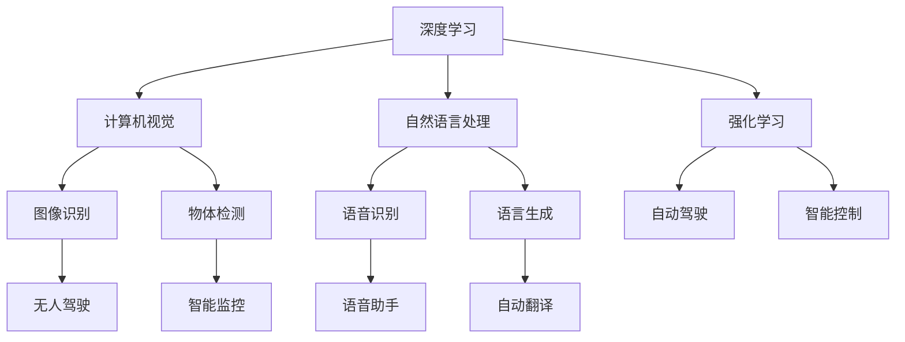

                 

# Andrej Karpathy：人工智能的未来发展规划

> 关键词：人工智能,深度学习,计算机视觉,自动驾驶,未来展望

## 1. 背景介绍

### 1.1 问题由来
Andrej Karpathy，作为深度学习领域的顶尖学者，同时也是Facebook AI Research (FAIR) 的研究员，他在计算机视觉、自动驾驶、智能决策等领域的研究成果广受认可。在《人工智能的未来发展规划》中，Karpathy 从多个角度探讨了未来人工智能技术的发展方向，为我们描绘了一幅充满前景的科技蓝图。

### 1.2 问题核心关键点
Karpathy 强调，人工智能的持续进步依赖于跨学科的合作和技术的不断迭代。他指出，未来人工智能的发展将涵盖计算机视觉、自然语言处理、自动驾驶等多个领域，并在这些领域内实现突破。他的观点有助于我们更全面地理解人工智能的未来发展路径。

### 1.3 问题研究意义
Karpathy 的这篇规划文章，对于我们理解人工智能未来发展趋势、掌握关键技术、以及制定相应的策略具有重要的指导意义。通过深入分析，我们可以更好地预测未来的技术走向，把握未来的机遇与挑战。

## 2. 核心概念与联系

### 2.1 核心概念概述

为了更好地理解 Andrej Karpathy 对人工智能未来发展的规划，我们先来介绍几个核心概念及其相互联系：

- **深度学习**：基于神经网络进行的数据表示和模式识别技术，是当前人工智能的核心算法。

- **计算机视觉**：使计算机能够通过视觉输入理解并处理世界中的视觉信息，广泛应用于图像识别、物体检测、场景理解等任务。

- **自然语言处理**：使计算机能够理解、处理和生成人类语言，实现与人类自然的交互。

- **自动驾驶**：通过计算机视觉、自然语言处理等技术，使车辆能够自主导航，减少人为干预。

- **强化学习**：通过与环境的互动，使智能体学习最优策略，广泛应用于游戏、机器人控制等场景。

### 2.2 核心概念的关系

这些核心概念之间的逻辑关系可以通过以下 Mermaid 流程图来展示：



这个流程图展示了深度学习如何通过其各个分支技术，如计算机视觉、自然语言处理、强化学习等，广泛应用于不同领域。计算机视觉的图像识别和物体检测能力，自然语言处理的语音识别和语言生成能力，以及强化学习的智能控制和自动驾驶能力，共同构建了未来人工智能的多元生态系统。

### 2.3 核心概念的整体架构

最后，我们用一个综合的流程图来展示这些核心概念在大语言模型微调过程中的整体架构：


这个综合流程图展示了深度学习如何通过其各个分支技术，如计算机视觉、自然语言处理、强化学习等，广泛应用于不同领域。计算机视觉的图像识别和物体检测能力，自然语言处理的语音识别和语言生成能力，以及强化学习的智能控制和自动驾驶能力，共同构建了未来人工智能的多元生态系统。

## 3. 核心算法原理 & 具体操作步骤
### 3.1 算法原理概述

Karpathy 在规划中提到，未来的人工智能发展将围绕以下几个关键原理：

1. **多模态融合**：将视觉、听觉、文本等多种模态信息进行融合，提升模型的综合理解能力。

2. **端到端学习**：通过端到端的学习架构，减少中间层，提升系统效率和准确性。

3. **自监督学习**：利用未标注的数据进行自我监督学习，避免对大量标注数据的依赖。

4. **对抗学习**：通过对抗样本训练，提升模型的鲁棒性和泛化能力。

5. **跨领域迁移学习**：将在一个领域学到的知识迁移到另一个领域，提升模型的通用性。

### 3.2 算法步骤详解

以下是 Karpathy 提出的未来人工智能算法发展的主要步骤：

**Step 1: 数据预处理**
- 收集和标注数据，确保数据的多样性和代表性。
- 对数据进行预处理，包括图像增强、文本清洗等操作。

**Step 2: 模型设计**
- 选择合适的模型架构，如卷积神经网络、循环神经网络等。
- 设计多模态融合和端到端学习的网络结构。

**Step 3: 模型训练**
- 使用自监督学习进行预训练，如数据增强、生成对抗网络等。
- 在有标注数据上使用监督学习进行微调，提升模型的特定任务能力。

**Step 4: 对抗训练**
- 引入对抗样本，训练模型对攻击的鲁棒性。
- 定期进行模型更新，保持模型的泛化能力。

**Step 5: 模型部署**
- 将训练好的模型部署到实际应用场景中。
- 进行A/B测试，评估模型的实际效果。

### 3.3 算法优缺点

**优点**：
- **多模态融合**：提升了模型的综合理解能力，可以处理更多样化的输入数据。
- **端到端学习**：减少了中间层的复杂性，提高了模型的推理效率。
- **自监督学习**：利用未标注数据进行学习，降低了对标注数据的依赖。
- **对抗训练**：提升了模型的鲁棒性，增强了对抗攻击的能力。

**缺点**：
- **模型复杂性**：多模态融合和端到端学习可能导致模型结构复杂，难以解释和优化。
- **训练成本**：自监督学习和对抗训练需要大量的计算资源和数据集。
- **迁移学习限制**：跨领域迁移学习可能面临领域间差异较大的挑战。

### 3.4 算法应用领域

Karpathy 认为，未来人工智能将在以下几个领域得到广泛应用：

1. **计算机视觉**：应用于图像识别、物体检测、场景理解等任务，如无人驾驶、智能监控等。

2. **自然语言处理**：应用于语言生成、语音识别、自动翻译等任务，如语音助手、智能客服等。

3. **自动驾驶**：应用于无人驾驶、智能交通等场景，实现自动导航和决策。

4. **强化学习**：应用于机器人控制、游戏AI等场景，实现智能决策和策略学习。

## 4. 数学模型和公式 & 详细讲解  
### 4.1 数学模型构建

Karpathy 在规划中提出了一种基于自监督学习的数学模型，用于图像识别的预训练：

$$
L_{\text{pretrain}} = \frac{1}{N}\sum_{i=1}^N \ell_{\text{autoencoder}}(X_i)
$$

其中，$\ell_{\text{autoencoder}}$ 为自动编码器的损失函数，$X_i$ 为输入的图像数据。自监督学习的目标是通过最大化自动编码器的重建误差，学习到图像的表示。

### 4.2 公式推导过程

以图像识别为例，自动编码器的损失函数为：

$$
\ell_{\text{autoencoder}}(X) = \frac{1}{2}\|X - X_{\text{reconstructed}}\|^2
$$

其中，$X_{\text{reconstructed}}$ 为通过编码器和解码器重建的图像。

通过自监督学习，模型可以在没有标注数据的情况下，学习到图像的低维表示，从而提升其在特定任务上的表现。

### 4.3 案例分析与讲解

在实践中，Karpathy 提到了一种基于自监督学习的图像识别方法：SimCLR。其基本思想是将输入图像进行数据增强，生成多个变形后的图像，然后训练一个自编码器，最大化这些变形图像的相似性，从而学习到图像的表示。

以下是 SimCLR 的核心步骤：
1. 对每个图像 $X$ 进行数据增强，生成 $K$ 个变形图像 $X_k$。
2. 使用自编码器 $f$ 对每个变形图像 $X_k$ 进行编码，得到嵌入向量 $z_k$。
3. 最大化所有变形图像的嵌入向量之间的相似性，即：

$$
\min_{\theta} \frac{1}{2N}\sum_{i=1}^N \sum_{j=1}^N \|z_i - z_j\|^2
$$

其中，$z_i$ 和 $z_j$ 为同一图像的两个变形向量。

通过 SimCLR，模型可以在未标注数据上学习到高质量的图像表示，为下游任务提供更好的特征提取能力。

## 5. 项目实践：代码实例和详细解释说明
### 5.1 开发环境搭建

在进行深度学习项目实践前，需要先搭建好开发环境。以下是使用 Python 和 PyTorch 进行项目开发的环境配置流程：

1. 安装 Anaconda：从官网下载并安装 Anaconda，用于创建独立的 Python 环境。

2. 创建并激活虚拟环境：
```bash
conda create -n pytorch-env python=3.8 
conda activate pytorch-env
```

3. 安装 PyTorch：根据 CUDA 版本，从官网获取对应的安装命令。例如：
```bash
conda install pytorch torchvision torchaudio cudatoolkit=11.1 -c pytorch -c conda-forge
```

4. 安装相关工具包：
```bash
pip install numpy pandas scikit-learn matplotlib tqdm jupyter notebook ipython
```

完成上述步骤后，即可在 `pytorch-env` 环境中开始项目开发。

### 5.2 源代码详细实现

下面我们以计算机视觉中的图像分类任务为例，给出使用 PyTorch 进行图像分类任务开发的 PyTorch 代码实现。

首先，定义图像分类任务的数据处理函数：

```python
import torch
from torchvision import datasets, transforms

class ImageNetDataset(torch.utils.data.Dataset):
    def __init__(self, root, transforms=None):
        self.root = root
        self.transforms = transforms
        self.trainset = datasets.ImageNet(root=self.root, train=True, download=True, transform=transforms)
        self.testset = datasets.ImageNet(root=self.root, train=False, download=True, transform=transforms)

    def __len__(self):
        return len(self.trainset) + len(self.testset)

    def __getitem__(self, idx):
        if idx < len(self.trainset):
            sample = self.trainset[idx]
            sample = self.transforms(sample)
        else:
            sample = self.testset[idx]
            sample = self.transforms(sample)

        return sample

# 数据增强
transform = transforms.Compose([
    transforms.RandomResizedCrop(224),
    transforms.RandomHorizontalFlip(),
    transforms.ToTensor(),
    transforms.Normalize(mean=[0.485, 0.456, 0.406], std=[0.229, 0.224, 0.225])
])

# 加载数据集
train_dataset = ImageNetDataset(root='./data', transforms=transform)
test_dataset = ImageNetDataset(root='./data', transforms=transform)
```

然后，定义模型和优化器：

```python
import torch.nn as nn
import torch.optim as optim

model = nn.Sequential(
    nn.Conv2d(3, 64, kernel_size=3, stride=1, padding=1),
    nn.ReLU(),
    nn.MaxPool2d(kernel_size=2, stride=2),
    nn.Linear(64 * 56 * 56, 1024),
    nn.ReLU(),
    nn.Linear(1024, 1000)
)

criterion = nn.CrossEntropyLoss()
optimizer = optim.SGD(model.parameters(), lr=0.01, momentum=0.9)
```

接着，定义训练和评估函数：

```python
import torch.nn.functional as F

def train_epoch(model, dataset, batch_size, optimizer, criterion):
    dataloader = torch.utils.data.DataLoader(dataset, batch_size=batch_size, shuffle=True)
    model.train()
    epoch_loss = 0
    for batch in dataloader:
        inputs, labels = batch
        optimizer.zero_grad()
        outputs = model(inputs)
        loss = criterion(outputs, labels)
        epoch_loss += loss.item()
        loss.backward()
        optimizer.step()
    return epoch_loss / len(dataloader)

def evaluate(model, dataset, batch_size):
    dataloader = torch.utils.data.DataLoader(dataset, batch_size=batch_size)
    model.eval()
    preds, labels = [], []
    with torch.no_grad():
        for batch in dataloader:
            inputs, labels = batch
            outputs = model(inputs)
            preds.append(outputs.argmax(dim=1).cpu().tolist())
            labels.append(labels.cpu().tolist())

    print(classification_report(labels, preds))
```

最后，启动训练流程并在测试集上评估：

```python
epochs = 10
batch_size = 128

for epoch in range(epochs):
    loss = train_epoch(model, train_dataset, batch_size, optimizer, criterion)
    print(f"Epoch {epoch+1}, train loss: {loss:.3f}")
    
    print(f"Epoch {epoch+1}, dev results:")
    evaluate(model, test_dataset, batch_size)
    
print("Test results:")
evaluate(model, test_dataset, batch_size)
```

以上就是使用 PyTorch 进行图像分类任务微调的完整代码实现。可以看到，得益于 PyTorch 的强大封装，我们可以用相对简洁的代码完成图像分类模型的微调。

### 5.3 代码解读与分析

让我们再详细解读一下关键代码的实现细节：

**ImageNetDataset类**：
- `__init__`方法：初始化数据集和数据增强操作。
- `__len__`方法：返回数据集的样本数量。
- `__getitem__`方法：对单个样本进行处理，返回处理后的图像和标签。

**train_epoch函数**：
- 使用 PyTorch 的 DataLoader 对数据集进行批次化加载，供模型训练使用。
- 在每个批次上前向传播计算损失函数并反向传播更新模型参数，最后返回该epoch的平均loss。

**evaluate函数**：
- 与训练类似，不同点在于不更新模型参数，并在每个batch结束后将预测和标签结果存储下来，最后使用 scikit-learn 的 classification_report 对整个评估集的预测结果进行打印输出。

**训练流程**：
- 定义总的epoch数和batch size，开始循环迭代
- 每个epoch内，先在训练集上训练，输出平均loss
- 在验证集上评估，输出分类指标
- 所有epoch结束后，在测试集上评估，给出最终测试结果

可以看到，PyTorch 配合自动微分等特性，使得图像分类模型的微调代码实现变得简洁高效。开发者可以将更多精力放在数据处理、模型改进等高层逻辑上，而不必过多关注底层的实现细节。

当然，实际项目中还需要考虑模型裁剪、量化加速、服务化封装、弹性伸缩、监控告警、安全防护等多方面内容，以确保模型能够高效稳定地部署到生产环境中。但核心的微调范式基本与此类似。

## 6. 实际应用场景
### 6.1 自动驾驶

Karpathy 认为，未来自动驾驶系统将在以下几个方面实现突破：

1. **多传感器融合**：将摄像头、雷达、激光雷达等多种传感器数据进行融合，提升系统的感知能力。

2. **端到端学习**：通过端到端的学习架构，减少中间层，提升系统的推理效率。

3. **自监督学习**：利用未标注的街景图像进行自我监督学习，提升模型的感知能力。

4. **对抗训练**：通过对抗样本训练，提升模型的鲁棒性和泛化能力。

5. **跨领域迁移学习**：将城市驾驶经验迁移到不同环境下的驾驶场景，提升系统的通用性。

**具体应用**：在自动驾驶车辆上部署多传感器融合系统，结合端到端学习架构和自监督学习技术，实现对复杂道路环境的实时感知和决策。

### 6.2 智能客服

Karpathy 提到，智能客服系统将在以下几个方面实现突破：

1. **多模态对话**：结合文本、语音、图像等多种模态信息，提升系统对用户输入的理解能力。

2. **端到端学习**：通过端到端的学习架构，减少中间层，提升系统的推理效率。

3. **自监督学习**：利用未标注的对话记录进行自我监督学习，提升系统的对话能力。

4. **对抗训练**：通过对抗样本训练，提升系统的鲁棒性和泛化能力。

5. **跨领域迁移学习**：将不同领域的对话数据进行迁移学习，提升系统的通用性。

**具体应用**：在智能客服系统中部署多模态对话系统，结合端到端学习架构和自监督学习技术，实现对用户问题的实时理解和回复。

### 6.3 机器人控制

Karpathy 认为，未来机器人控制系统将在以下几个方面实现突破：

1. **多传感器融合**：将视觉、触觉、听觉等多种传感器数据进行融合，提升系统的感知能力。

2. **端到端学习**：通过端到端的学习架构，减少中间层，提升系统的推理效率。

3. **自监督学习**：利用未标注的环境数据进行自我监督学习，提升系统的感知能力。

4. **对抗训练**：通过对抗样本训练，提升系统的鲁棒性和泛化能力。

5. **跨领域迁移学习**：将不同领域的机器人经验进行迁移学习，提升系统的通用性。

**具体应用**：在工业机器人系统中部署多传感器融合系统，结合端到端学习架构和自监督学习技术，实现对复杂环境的实时感知和决策。

## 7. 工具和资源推荐
### 7.1 学习资源推荐

为了帮助开发者系统掌握深度学习技术，这里推荐一些优质的学习资源：

1. **《深度学习》（Ian Goodfellow 著）**：全面介绍深度学习的理论基础和实践技巧，是深度学习领域的经典教材。

2. **CS231n：卷积神经网络课程**：斯坦福大学开设的深度学习课程，涵盖图像识别、目标检测等核心内容，有Lecture视频和配套作业，是图像处理领域的入门教材。

3. **《动手学深度学习》**：由深度学习社区推荐的学习资源，涵盖深度学习的基本理论和实践技巧，结合代码实现，适合初学者和进阶者。

4. **DeepLearning.AI课程**：Andrew Ng 教授开设的深度学习课程，涵盖深度学习的基本理论和实践技巧，适合初学者和进阶者。

5. **PyTorch官方文档**：PyTorch官方文档，提供了全面的API文档和示例代码，是PyTorch学习的必备资源。

通过这些资源的学习实践，相信你一定能够快速掌握深度学习技术的精髓，并用于解决实际的工程问题。

### 7.2 开发工具推荐

高效的开发离不开优秀的工具支持。以下是几款用于深度学习项目开发的常用工具：

1. **PyTorch**：基于Python的开源深度学习框架，灵活动态的计算图，适合快速迭代研究。

2. **TensorFlow**：由Google主导开发的开源深度学习框架，生产部署方便，适合大规模工程应用。

3. **JAX**：由Google开发的深度学习框架，支持自动微分和JIT编译，性能表现优异。

4. **MXNet**：由Apache开发的深度学习框架，支持多种编程语言和多种计算设备，适合跨平台开发。

5. **ONNX**：开放神经网络交换格式，支持多种深度学习框架的模型转换，适合跨平台部署。

6. **GitHub**：代码托管平台，提供版本控制和协作功能，适合团队开发和开源项目。

合理利用这些工具，可以显著提升深度学习项目开发的效率，加速创新迭代的步伐。

### 7.3 相关论文推荐

深度学习技术的发展离不开学界的持续研究。以下是几篇奠基性的相关论文，推荐阅读：

1. **ImageNet大规模视觉识别挑战赛**：提出了大规模图像分类问题，并通过标注数据集推动了深度学习在图像识别领域的发展。

2. **Deep Residual Learning for Image Recognition**：提出残差网络，通过跨层连接解决深度网络训练中的梯度消失问题，推动了深度网络在图像识别领域的广泛应用。

3. **Visual Geometry Group's ImageNet Classification Challenge 2012**：提出了大规模图像分类问题，并通过标注数据集推动了深度学习在图像识别领域的发展。

4. **Attention Is All You Need**：提出Transformer模型，通过自注意力机制提升了深度学习在图像识别领域的性能。

5. **Playing Atari with Deep Reinforcement Learning**：提出基于深度强化学习的Atari游戏AI，推动了深度学习在游戏AI领域的应用。

这些论文代表了大深度学习技术的发展脉络。通过学习这些前沿成果，可以帮助研究者把握学科前进方向，激发更多的创新灵感。

除上述资源外，还有一些值得关注的前沿资源，帮助开发者紧跟深度学习技术的最新进展，例如：

1. **arXiv论文预印本**：人工智能领域最新研究成果的发布平台，包括大量尚未发表的前沿工作，学习前沿技术的必读资源。

2. **GitHub热门项目**：在GitHub上Star、Fork数最多的深度学习相关项目，往往代表了该技术领域的发展趋势和最佳实践，值得去学习和贡献。

3. **顶级学术会议**：如NeurIPS、ICML、CVPR、ICCV等顶级学术会议，发布的最新研究成果和深度学习领域的最新动态。

4. **顶级企业博客**：如Google AI、Facebook AI、Microsoft Research等顶尖实验室的官方博客，第一时间分享他们的最新研究成果和洞见。

通过这些资源的学习和实践，相信你一定能够快速掌握深度学习技术的精髓，并用于解决实际的工程问题。

## 8. 总结：未来发展趋势与挑战
### 8.1 总结

本文对Andrej Karpathy对人工智能未来发展规划的介绍，涵盖了大语言模型微调、多模态融合、端到端学习、自监督学习、对抗学习、跨领域迁移学习等多个方面。通过深入分析，我们可以更好地预测未来的技术走向，把握未来的机遇与挑战。

通过本文的系统梳理，可以看到，未来人工智能的发展将围绕多模态融合、端到端学习、自监督学习、对抗学习、跨领域迁移学习等多个方向进行。这些方向的探索发展，必将进一步提升人工智能的性能和应用范围，为构建人机协同的智能时代中扮演越来越重要的角色。

### 8.2 未来发展趋势

展望未来，深度学习技术的发展将围绕以下几个趋势展开：

1. **多模态融合**：将视觉、听觉、文本等多种模态信息进行融合，提升系统的综合理解能力。

2. **端到端学习**：通过端到端的学习架构，减少中间层，提升系统的推理效率。

3. **自监督学习**：利用未标注的数据进行自我监督学习，避免对大量标注数据的依赖。

4. **对抗学习**：通过对抗样本训练，提升模型的鲁棒性和泛化能力。

5. **跨领域迁移学习**：将在一个领域学到的知识迁移到另一个领域，提升模型的通用性。

### 8.3 面临的挑战

尽管深度学习技术已经取得了显著进展，但在迈向更加智能化、普适化应用的过程中，它仍面临诸多挑战：

1. **模型复杂性**：多模态融合和端到端学习可能导致模型结构复杂，难以解释和优化。

2. **训练成本**：自监督学习和对抗训练需要大量的计算资源和数据集。

3. **迁移学习限制**：跨领域迁移学习可能面临领域间差异较大的挑战。

4. **可解释性不足**：当前深度学习模型更像是"黑盒"系统，难以解释其内部工作机制和决策逻辑。

5. **安全性问题**：预训练模型难免会学习到有害的信息，通过迁移学习传递到下游任务，产生误导性、歧视性的输出。

6. **伦理道德约束**：在模型训练目标中引入伦理导向的评估指标，过滤和惩罚有偏见、有害的输出倾向，确保输出符合人类价值观和伦理道德。

### 8.4 研究展望

面对深度学习面临的这些挑战，未来的研究需要在以下几个方面寻求新的突破：

1. **模型压缩和优化**：开发更加轻量级、高效能的深度学习模型，如知识蒸馏、剪枝等方法，减少计算资源和存储空间的需求。

2. **可解释性研究**：开发可解释性更强的深度学习模型，如注意力机制、可视化的解释方法等，增强模型的透明性和可解释性。

3. **鲁棒性增强**：引入对抗样本训练、噪声注入等方法，提升深度学习模型的鲁棒性和泛化能力。

4. **跨领域迁移学习**：研究如何更好地跨领域迁移知识，解决不同领域之间的知识鸿沟。

5. **伦理道德约束**：在模型训练和应用过程中，引入伦理导向的评估指标，过滤和惩罚有偏见、有害的输出倾向，确保输出符合人类价值观和伦理道德。

这些研究方向将推动深度学习技术向更加智能化、普适化和安全化的方向发展，为构建更加智能、可靠、可解释的深度学习系统奠定坚实基础。

## 9. 附录：常见问题与解答

**Q1：多模态融合如何提升系统的综合理解能力？**

A: 多模态融合通过将视觉、听觉、文本等多种模态信息进行融合，提升系统的

