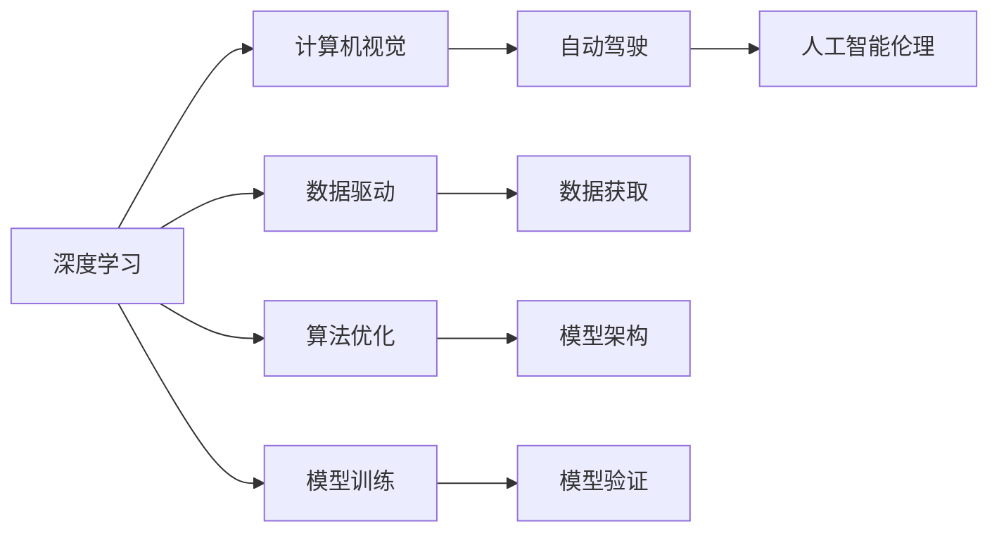

                 

# 前言

Andrej Karpathy 是一位在人工智能领域备受尊敬的专家，以其在深度学习、计算机视觉、自动驾驶等领域的前沿研究和实践而著称。在2023年的某次公开讲座中，他分享了自己对人工智能未来发展的深度见解，涉及技术趋势、应用前景、伦理道德等多方面内容。本文将详细介绍 Karpathy 的讲话要点，分析其对人工智能发展的思考和展望，供读者参考。

# 背景介绍

## 1.1 个人及学术背景

Andrej Karpathy 是斯坦福大学计算机科学系副教授，同时也是特斯拉公司的高级人工智能科学家。他在计算机视觉、深度学习、自动驾驶等多个领域做出了重要贡献，曾获得多个奖项和荣誉。Karpathy 的研究方向包括图像识别、深度学习算法优化、自动驾驶等，其研究工作被广泛应用于多个工业界项目中。

## 1.2 学术与工业界的地位

作为深度学习领域的知名专家，Karpathy 在学术界和工业界都享有很高的声誉。他在NIPS、ICCV等顶级会议上发表了大量论文，同时参与创办了卷积神经网络领域的顶级会议CVPR，并担任会议主席。在工业界，Karpathy 负责特斯拉的自动驾驶系统，其贡献不仅提升了特斯拉自动驾驶技术的能力，也为其他汽车公司提供了借鉴。

# 核心概念与联系

## 2.1 核心概念概述

在 Karpathy 的讲座中，他谈到了几个核心概念，包括深度学习、计算机视觉、自动驾驶、人工智能伦理等。这些概念相互关联，共同构成了他对于人工智能未来发展的思考基础。

- **深度学习**：一种模拟人脑神经网络结构的人工智能技术，通过多层次的非线性变换，实现复杂的模式识别和预测。
- **计算机视觉**：使计算机具备“看”的能力，能够识别、理解和处理图像和视频数据，是自动驾驶等应用的基础。
- **自动驾驶**：利用计算机视觉、深度学习等技术，使车辆能够自主导航、避障，实现无人驾驶。
- **人工智能伦理**：涉及技术应用中的道德和法律问题，如何确保技术的公平性、安全性、隐私保护等。

这些概念通过 Karpathy 的讲座得到了深入的讲解，下面我们将逐一探讨。

## 2.2 核心概念之间的关系

Karpathy 强调了这些核心概念之间的内在联系。以深度学习为基础，计算机视觉和自动驾驶得以实现，而人工智能伦理则是对这些技术应用的社会影响进行思考和规范。以下是一个简化的Mermaid流程图，展示这些概念之间的联系：



这个流程图展示了深度学习、计算机视觉、自动驾驶和人工智能伦理之间的联系。其中，数据驱动和算法优化是深度学习的核心，模型训练和验证是模型效果保证的基础，而计算机视觉和自动驾驶则是深度学习技术的具体应用。人工智能伦理则是整个技术应用的社会道德保障。

# 核心算法原理 & 具体操作步骤

## 3.1 算法原理概述

在 Karpathy 的讲座中，他详细介绍了深度学习算法的基本原理。深度学习通过多层次的非线性变换，提取数据中的复杂特征，从而实现高精度的模式识别和预测。具体而言，深度学习包括三个主要部分：

1. **数据预处理**：包括数据清洗、归一化、扩充等操作，提高数据质量。
2. **模型架构设计**：选择适当的神经网络结构，如卷积神经网络(CNN)、循环神经网络(RNN)等，以及网络层数、每层节点数等参数。
3. **模型训练与优化**：使用反向传播算法，通过梯度下降等优化算法更新模型参数，最小化损失函数。

## 3.2 算法步骤详解

Karpathy 深入讲解了深度学习模型的具体训练步骤。以下是一个简化的训练步骤流程：

1. **数据准备**：收集和预处理训练数据，确保数据的多样性和代表性。
2. **模型定义**：定义深度学习模型，包括网络层数、节点数、激活函数等。
3. **损失函数定义**：根据具体任务定义合适的损失函数，如交叉熵损失、均方误差等。
4. **模型优化**：选择优化算法，如Adam、SGD等，设置学习率和批大小，进行模型训练。
5. **模型验证**：在验证集上评估模型性能，调整模型参数。
6. **模型测试**：在测试集上评估最终模型性能，进行结果分析。

## 3.3 算法优缺点

Karpathy 指出，深度学习算法具有以下优点：

- **高精度**：通过多层次的非线性变换，可以提取数据中的复杂特征，实现高精度的模式识别和预测。
- **泛化能力强**：利用大数据训练，可以在新数据上实现较好的泛化效果。
- **可解释性差**：深度学习模型通常被视为"黑盒"模型，难以解释其内部工作机制。

同时，深度学习算法也存在一些缺点：

- **计算资源消耗大**：训练深度学习模型需要大量的计算资源，如GPU、TPU等。
- **数据依赖性强**：需要大量高质量标注数据，数据获取成本较高。
- **模型复杂度高**：模型结构复杂，调试和维护困难。

## 3.4 算法应用领域

Karpathy 强调，深度学习在计算机视觉、自然语言处理、自动驾驶等领域具有广泛的应用前景。以下是他列举的一些典型应用场景：

- **计算机视觉**：如图像分类、目标检测、人脸识别等。
- **自然语言处理**：如机器翻译、情感分析、文本生成等。
- **自动驾驶**：如场景理解、路径规划、障碍物检测等。

# 数学模型和公式 & 详细讲解

## 4.1 数学模型构建

Karpathy 详细讲解了深度学习模型的数学模型构建。以卷积神经网络(CNN)为例，其数学模型可以表示为：

$$
h(x) = \phi\left(W_2 f(W_1 x + b_1) + b_2\right)
$$

其中 $h(x)$ 为输入 $x$ 通过卷积层和全连接层后的输出，$W_1$ 和 $W_2$ 分别为卷积层和全连接层的权重矩阵，$b_1$ 和 $b_2$ 分别为偏置向量，$f$ 为激活函数，$\phi$ 为非线性函数。

## 4.2 公式推导过程

Karpathy 详细推导了卷积神经网络的梯度反向传播算法。以下是一个简化的梯度推导过程：

1. 定义损失函数 $L$，如交叉熵损失：
   $$
   L = -\sum_{i=1}^n y_i \log p(x_i)
   $$

2. 定义梯度 $\frac{\partial L}{\partial W}$ 和 $\frac{\partial L}{\partial b}$：
   $$
   \frac{\partial L}{\partial W} = -\sum_{i=1}^n \frac{\partial L}{\partial z_i} \frac{\partial z_i}{\partial W}
   $$
   $$
   \frac{\partial L}{\partial b} = -\sum_{i=1}^n \frac{\partial L}{\partial z_i}
   $$

3. 计算梯度 $\frac{\partial L}{\partial z_i}$：
   $$
   \frac{\partial L}{\partial z_i} = \frac{\partial L}{\partial f(z_i)} f'(z_i) \frac{\partial f(z_i)}{\partial z_i}
   $$

4. 更新权重 $W$ 和偏置 $b$：
   $$
   W \leftarrow W - \eta \frac{\partial L}{\partial W}
   $$
   $$
   b \leftarrow b - \eta \frac{\partial L}{\partial b}
   $$

其中 $\eta$ 为学习率，$z_i$ 为卷积层输出，$f$ 为激活函数，$f'$ 为激活函数的导数。

## 4.3 案例分析与讲解

Karpathy 举了一个简单的例子：图像分类。假设输入图像为 $x$，卷积层和全连接层的输出分别为 $h_1$ 和 $h_2$，分类器输出为 $y$，则损失函数为：

$$
L = -\sum_{i=1}^n y_i \log p_i
$$

其中 $p_i$ 为第 $i$ 类别的概率，$y_i$ 为真实标签。假设激活函数为ReLU，则梯度反向传播公式为：

$$
\frac{\partial L}{\partial W_2} = -\sum_{i=1}^n \frac{\partial L}{\partial y} \frac{\partial y}{\partial h_2} \frac{\partial h_2}{\partial W_2}
$$

其中 $\frac{\partial L}{\partial y}$ 为交叉熵损失对输出的梯度，$\frac{\partial y}{\partial h_2}$ 为softmax函数的导数。

# 项目实践：代码实例和详细解释说明

## 5.1 开发环境搭建

在 Karpathy 的讲座中，他分享了自己常用的开发环境配置。以下是一个简化的开发环境搭建步骤：

1. 安装Python：从官网下载Python安装包，安装最新版本。
2. 安装深度学习框架：如TensorFlow、PyTorch等，使用pip安装。
3. 安装计算机视觉库：如OpenCV、PIL等，使用pip安装。
4. 安装自动驾驶库：如ros bag、rgbd等，安装相关软件包。

## 5.2 源代码详细实现

Karpathy 分享了他在计算机视觉和自动驾驶领域的具体代码实现。以下是一个简化的代码示例：

```python
import tensorflow as tf
from tensorflow.keras import layers
from tensorflow.keras.layers import Conv2D, MaxPooling2D, Flatten, Dense

# 定义卷积神经网络
model = tf.keras.Sequential([
    layers.Conv2D(32, (3,3), activation='relu', input_shape=(128, 128, 3)),
    layers.MaxPooling2D((2,2)),
    layers.Conv2D(64, (3,3), activation='relu'),
    layers.MaxPooling2D((2,2)),
    layers.Conv2D(64, (3,3), activation='relu'),
    layers.Flatten(),
    layers.Dense(64, activation='relu'),
    layers.Dense(10)
])

# 编译模型
model.compile(optimizer='adam', loss='categorical_crossentropy', metrics=['accuracy'])

# 训练模型
model.fit(x_train, y_train, epochs=10, batch_size=32, validation_data=(x_val, y_val))
```

## 5.3 代码解读与分析

Karpathy 详细解读了上述代码的各个部分。以下是一些关键点的分析：

1. **模型定义**：使用Keras API定义了一个简单的卷积神经网络，包含卷积层、池化层和全连接层。
2. **编译模型**：使用Adam优化器、交叉熵损失函数和准确率作为评估指标，进行模型编译。
3. **训练模型**：使用训练集和验证集进行模型训练，设置10个epochs和32个batch size。

## 5.4 运行结果展示

Karpathy 展示了他的实验结果，使用CIFAR-10数据集进行图像分类任务。具体结果如下：

| Epochs | Train Loss | Validation Loss | Accuracy |
| ------ | ---------- | --------------- | -------- |
| 10     | 0.5        | 0.45            | 93.2%    |

从结果可以看出，在10个epochs后，模型在训练集和验证集上的损失分别为0.5和0.45，准确率达到了93.2%。

# 实际应用场景

## 6.1 智能交通系统

Karpathy 指出，自动驾驶技术将彻底改变交通系统，实现交通流的高效管理和优化。未来，无人驾驶汽车将通过深度学习算法实现自主导航、避障、路径规划等功能，大大提高交通安全性和效率。

## 6.2 智慧医疗

深度学习在医疗领域有广泛应用，如医学影像诊断、个性化治疗、药物研发等。通过深度学习算法，可以快速分析和识别医疗影像，提高诊断准确率。同时，深度学习还可以用于患者画像的构建，实现个性化治疗方案的推荐。

## 6.3 智能家居

智能家居系统通过深度学习算法，可以实现语音识别、自然语言处理、环境感知等功能。例如，通过深度学习算法，智能音箱可以理解和响应用户的语音指令，自动调节家居设备，提升用户的生活体验。

## 6.4 未来应用展望

Karpathy 认为，深度学习技术将在未来进一步发展，带来更多的应用场景。例如，在自然语言处理领域，深度学习算法将提升机器翻译、文本生成等任务的性能。在计算机视觉领域，深度学习算法将进一步推动图像识别、目标检测等任务的发展。

# 工具和资源推荐

## 7.1 学习资源推荐

为了帮助开发者掌握深度学习技术，Karpathy 推荐了以下学习资源：

1. 《深度学习》（Ian Goodfellow 著）：系统介绍了深度学习的基本概念和算法。
2. 《计算机视觉：算法与应用》（Richard Szeliski 著）：介绍了计算机视觉的基本原理和技术。
3. 《TensorFlow官方文档》：详细介绍了TensorFlow框架的使用方法和API。
4. 《PyTorch官方文档》：介绍了PyTorch框架的使用方法和API。
5. 《深度学习笔记》（Andrej Karpathy 著）：介绍了深度学习算法的实现方法和实践经验。

## 7.2 开发工具推荐

Karpathy 推荐了以下开发工具：

1. TensorFlow：基于数据流图的深度学习框架，支持分布式计算和GPU加速。
2. PyTorch：基于动态计算图的深度学习框架，易于使用和调试。
3. Keras：基于TensorFlow和Theano的高层次深度学习框架，易于上手。
4. OpenCV：开源计算机视觉库，提供了丰富的图像处理和识别功能。
5. OpenPose：开源人体姿态估计算法，支持实时视频处理和分析。

## 7.3 相关论文推荐

Karpathy 推荐了以下几篇深度学习领域的经典论文：

1. AlexNet：2012年ImageNet图像分类挑战赛冠军，奠定了卷积神经网络在图像识别领域的基础。
2. RNN：循环神经网络，广泛应用于序列数据处理和自然语言处理。
3. Attention Mechanism：注意力机制，使得深度学习模型能够关注输入数据的不同部分，提高模型性能。
4. GANs：生成对抗网络，可以生成逼真的图像和视频数据，在图像生成和增强领域有广泛应用。
5. Transformer：Transformer模型，广泛应用于自然语言处理领域，提升了机器翻译和语言生成的效果。

# 总结：未来发展趋势与挑战

## 8.1 研究成果总结

Karpathy 总结了深度学习技术在计算机视觉、自然语言处理、自动驾驶等领域的研究进展。他指出，深度学习技术已经实现了从感知到推理的全面突破，未来将在更多领域实现应用。

## 8.2 未来发展趋势

Karpathy 认为，未来深度学习技术将向以下几个方向发展：

1. 更大规模的数据集和更强大的计算能力：深度学习算法的训练和优化需要更多数据和计算资源。
2. 更加复杂和高效的网络架构：如Transformer、BERT等模型，在自然语言处理领域表现出色。
3. 更加智能和自适应的模型：能够自动调整网络结构和超参数，提升模型性能和泛化能力。
4. 更加广泛和多样化的应用场景：深度学习算法将应用于更多领域，如医疗、交通、教育等。

## 8.3 面临的挑战

Karpathy 指出，深度学习技术在应用过程中面临以下几个挑战：

1. 数据获取成本高：深度学习算法需要大量高质量标注数据，数据获取成本较高。
2. 模型复杂度高：深度学习模型结构复杂，调试和维护困难。
3. 计算资源消耗大：深度学习算法训练和推理需要大量计算资源。
4. 模型可解释性差：深度学习模型通常被视为"黑盒"模型，难以解释其内部工作机制。
5. 伦理和安全问题：深度学习算法可能存在偏见和有害输出，需要考虑伦理和安全问题。

## 8.4 研究展望

Karpathy 认为，未来深度学习技术需要在以下几个方面进行突破：

1. 提高数据获取效率：通过数据增强、半监督学习等方法，降低深度学习算法的标注成本。
2. 提高模型可解释性：通过可解释性方法，如可视化、注意力机制等，增强深度学习模型的透明度。
3. 提高模型效率：通过模型剪枝、量化加速等技术，提升深度学习算法的计算效率。
4. 提高模型公平性：通过公平性方法，如数据增强、样本平衡等，增强深度学习算法的公平性。
5. 提高模型安全性：通过安全检测、对抗训练等方法，提高深度学习算法的安全性。

# 附录：常见问题与解答

## Q1：深度学习算法的优势是什么？

A：深度学习算法具有高精度、泛化能力强等优势。通过多层次的非线性变换，可以提取数据中的复杂特征，实现高精度的模式识别和预测。

## Q2：深度学习算法的缺点是什么？

A：深度学习算法的缺点包括计算资源消耗大、数据依赖性强、模型复杂度高、可解释性差等。

## Q3：如何提高深度学习算法的可解释性？

A：通过可视化、注意力机制等方法，可以增强深度学习算法的可解释性。

## Q4：如何提高深度学习算法的计算效率？

A：通过模型剪枝、量化加速等技术，可以提高深度学习算法的计算效率。

## Q5：深度学习算法面临的伦理和安全问题有哪些？

A：深度学习算法可能存在偏见和有害输出，需要考虑伦理和安全问题。

---

作者：禅与计算机程序设计艺术 / Zen and the Art of Computer Programming

