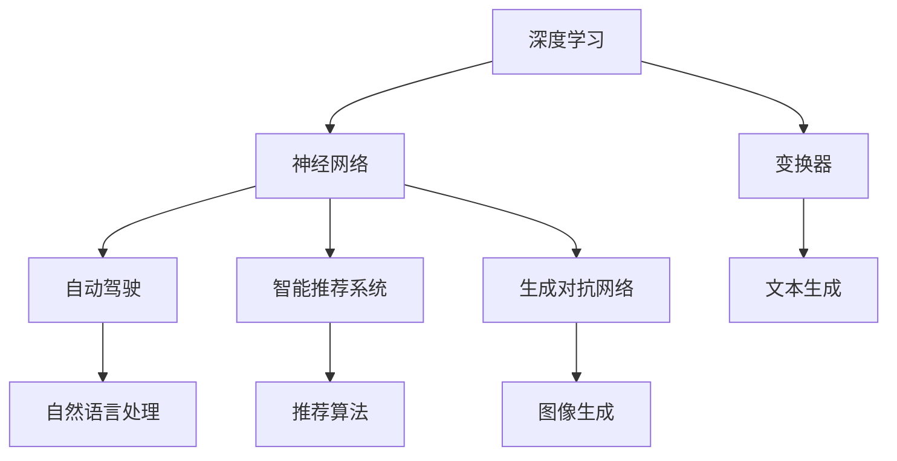

                 

# 背景介绍

在人工智能(AI)的迅猛发展下，我们正在进入一个前所未有的技术新时代。过去几年中，我们已经见证了无数AI技术的突破，从深度学习、自然语言处理(NLP)、计算机视觉(CV)到强化学习(RL)，每一个领域都在快速进步，推动着技术边界的不断拓展。然而，当我们回望未来，如何构建一个更加智能、可控、安全的人类社会，成为摆在所有AI研究者面前的一个核心问题。本文将通过深度学习先驱Andrej Karpathy的视角，探讨人工智能的未来发展规划。

## 1. 背景介绍

### 1.1 问题由来

随着AI技术的飞速发展，人工智能领域正在经历前所未有的变革。深度学习技术的突破，尤其是基于神经网络的模型，如卷积神经网络(CNN)、循环神经网络(RNN)、变换器(Transformer)等，使得AI系统在图像识别、语音识别、自然语言处理等领域取得了显著进展。然而，尽管技术日新月异，AI的发展却面临诸多挑战，包括数据隐私、模型可解释性、社会公平性等问题。此外，人工智能的未来发展方向也面临着巨大的不确定性，如何构建一个既安全、又高效、且符合人类价值观的AI系统，成为当今社会的重要议题。

### 1.2 问题核心关键点

在探讨Andrej Karpathy关于人工智能未来发展规划的讨论时，我们需要关注以下几个核心关键点：

1. **数据隐私与安全**：随着AI技术的普及，数据隐私和安全问题愈发突出。如何在保护用户隐私的前提下，实现数据的合理利用，是未来AI发展中必须解决的重大问题。
   
2. **模型可解释性**：当前许多AI模型，如深度神经网络，由于其复杂的结构，往往缺乏可解释性。如何提升模型的透明度，让公众理解和信任AI系统的决策过程，是另一个重要的研究课题。
   
3. **社会公平性**：AI技术的发展过程中，需要确保不同群体、不同背景的人在享受AI技术带来的好处时是公平的。这涉及到算法偏见、数据偏差等问题，需要从技术和政策层面进行全面考虑。
   
4. **人机协作与共生**：AI系统不仅仅是工具，而是需要与人类共同协作的伙伴。如何构建人机协作的AI系统，让AI与人类共同进步，是未来AI发展的重要方向。

5. **全球化与本地化**：AI技术的发展需要兼顾全球化和本地化。既要在全球范围内推动技术的标准化和普及，又要考虑到不同地区、不同文化背景下的适用性。

### 1.3 问题研究意义

探讨Andrej Karpathy关于人工智能未来发展规划的讨论，有助于我们理解AI技术的未来发展趋势，以及在社会、技术、伦理等层面需要关注的重点问题。通过深入分析和讨论，我们可以更好地规划AI技术的未来发展方向，推动AI技术在更广泛的应用场景中发挥积极作用。

## 2. 核心概念与联系

### 2.1 核心概念概述

要全面理解AI的未来发展规划，首先需要梳理其中的核心概念。以下概念将贯穿整个讨论：

- **深度学习(Deep Learning)**：一种基于神经网络的机器学习技术，能够处理高维数据并自动学习特征表示。
   
- **神经网络(Neural Network)**：由多个节点和边组成的计算图，通过反向传播算法训练模型参数。
   
- **变换器(Transformer)**：一种特殊类型的神经网络，主要用于自然语言处理任务，如机器翻译、文本生成等。
   
- **自动驾驶(Autonomous Driving)**：基于AI技术的汽车自动驾驶系统，能够感知环境、决策行驶路径，实现无人驾驶。
   
- **智能推荐系统(Recommendation System)**：根据用户的历史行为和偏好，为用户推荐相关内容或产品。
   
- **生成对抗网络(Generative Adversarial Networks, GANs)**：由生成器和判别器两个网络组成的框架，用于生成逼真的假数据。

### 2.2 概念间的关系

这些核心概念之间存在着紧密的联系，形成了一个互相关联的技术生态系统。通过以下Mermaid流程图，我们可以清晰地理解这些概念之间的关系：



此流程图展示了深度学习如何通过神经网络实现自动驾驶、智能推荐、生成对抗等AI应用，并通过变换器等技术推动自然语言处理领域的发展。

## 3. 核心算法原理 & 具体操作步骤

### 3.1 算法原理概述

Andrej Karpathy在其多篇论文和演讲中，详细探讨了深度学习算法和AI技术的基本原理。深度学习通过构建多层次的神经网络，自动学习输入数据的特征表示，并通过反向传播算法进行参数优化，实现复杂任务的预测和生成。以下是他关于深度学习算法原理的概述：

1. **反向传播算法(Backpropagation)**：一种用于优化神经网络参数的算法，通过链式法则计算损失函数对每个参数的梯度，从而实现模型的训练。
   
2. **梯度下降法(Gradient Descent)**：一种常用的优化算法，通过不断迭代更新模型参数，使得损失函数最小化。
   
3. **对抗训练(Adversarial Training)**：通过引入对抗样本，训练模型以抵御攻击，提升模型的鲁棒性。
   
4. **自适应学习率(Adaptive Learning Rate)**：如Adam优化算法，通过自适应调整学习率，加速模型的收敛。
   
5. **正则化(Regularization)**：如L2正则、Dropout等技术，防止过拟合，提升模型的泛化能力。

### 3.2 算法步骤详解

基于Andrej Karpathy的讨论，我们可以将深度学习算法的步骤总结如下：

1. **数据准备**：收集和预处理训练数据，确保数据质量和多样性。
   
2. **模型构建**：设计神经网络结构，选择合适的激活函数、损失函数和优化器。
   
3. **模型训练**：通过反向传播和梯度下降等算法，训练模型参数，优化损失函数。
   
4. **模型评估**：在验证集上评估模型性能，调整模型超参数。
   
5. **模型部署**：将训练好的模型部署到实际应用中，进行实时预测或生成。

### 3.3 算法优缺点

深度学习算法在许多领域取得了显著的成果，但也存在一些显著的缺点：

**优点**：

1. **自动化特征提取**：能够自动学习输入数据的特征表示，减少了特征工程的工作量。
   
2. **泛化能力强**：在许多任务上，尤其是图像识别和自然语言处理领域，深度学习模型取得了超过人类专家的表现。
   
3. **灵活性强**：可以根据任务需求设计不同的网络结构，如卷积神经网络、循环神经网络、变换器等。

**缺点**：

1. **数据需求高**：深度学习模型需要大量的标注数据进行训练，数据获取和标注成本较高。
   
2. **可解释性差**：深度神经网络的复杂结构使得其决策过程难以解释，缺乏透明性。
   
3. **计算资源需求大**：深度学习模型的训练和推理需要大量的计算资源，包括GPU/TPU等高性能设备。

### 3.4 算法应用领域

基于深度学习算法的核心概念，Andrej Karpathy探讨了深度学习在以下几个主要领域的应用：

1. **计算机视觉**：用于图像分类、物体检测、图像生成等任务，如AlphaGo、ImageNet等。
   
2. **自然语言处理**：用于机器翻译、文本生成、文本分类等任务，如BERT、GPT等。
   
3. **语音识别**：用于语音识别、语音合成等任务，如Google Speech-to-Text。
   
4. **自动驾驶**：用于环境感知、路径规划、行为预测等任务，如特斯拉Autopilot。

5. **智能推荐**：用于推荐系统、广告投放等任务，如Netflix推荐算法。

6. **生成对抗网络**：用于图像生成、视频生成等任务，如GANs。

## 4. 数学模型和公式 & 详细讲解 & 举例说明

### 4.1 数学模型构建

在深度学习中，我们通常使用以下数学模型进行建模：

- **输入数据**：$x \in \mathbb{R}^d$，表示输入特征向量。
   
- **输出数据**：$y \in \mathbb{R}^m$，表示输出结果向量。
   
- **模型参数**：$\theta \in \mathbb{R}^p$，表示需要学习的模型参数。
   
- **损失函数**：$\mathcal{L}(\theta)$，表示模型预测结果与真实结果之间的差距。

### 4.2 公式推导过程

以下以简单线性回归模型为例，推导梯度下降算法的公式：

设输入数据为 $x$，输出数据为 $y$，线性回归模型为 $y = wx + b$，其中 $w$ 和 $b$ 为模型参数，$\mathcal{L}(\theta) = \frac{1}{2N} \sum_{i=1}^N (y_i - wx_i - b)^2$。

根据梯度下降算法，模型参数的更新公式为：

$$
w \leftarrow w - \alpha \frac{1}{N} \sum_{i=1}^N (y_i - wx_i - b)x_i
$$

其中 $\alpha$ 为学习率。

### 4.3 案例分析与讲解

假设我们在图像分类任务中，使用卷积神经网络对MNIST数据集进行分类。输入数据为 $28 \times 28$ 的灰度图像，输出数据为 10 个类别的概率分布。以下是对该案例的详细讲解：

1. **数据预处理**：将图像数据归一化、标准化，转换成模型所需的格式。
   
2. **模型构建**：设计卷积神经网络结构，包括卷积层、池化层、全连接层等，选择合适的激活函数和损失函数。
   
3. **模型训练**：使用梯度下降算法，对模型参数进行优化，最小化损失函数。
   
4. **模型评估**：在验证集上评估模型性能，调整模型超参数。
   
5. **模型部署**：将训练好的模型部署到实际应用中，进行实时分类预测。

## 5. 项目实践：代码实例和详细解释说明

### 5.1 开发环境搭建

在进行深度学习项目实践前，我们需要准备好开发环境。以下是使用Python进行TensorFlow开发的环境配置流程：

1. 安装Anaconda：从官网下载并安装Anaconda，用于创建独立的Python环境。

2. 创建并激活虚拟环境：
```bash
conda create -n tf-env python=3.8 
conda activate tf-env
```

3. 安装TensorFlow：根据CUDA版本，从官网获取对应的安装命令。例如：
```bash
conda install tensorflow -c tf -c conda-forge
```

4. 安装各类工具包：
```bash
pip install numpy pandas scikit-learn matplotlib tqdm jupyter notebook ipython
```

完成上述步骤后，即可在`tf-env`环境中开始深度学习项目实践。

### 5.2 源代码详细实现

下面我们以图像分类任务为例，给出使用TensorFlow对卷积神经网络进行训练的PyTorch代码实现。

```python
import tensorflow as tf
from tensorflow.keras import layers

# 定义模型结构
model = tf.keras.Sequential([
    layers.Conv2D(32, (3, 3), activation='relu', input_shape=(28, 28, 1)),
    layers.MaxPooling2D((2, 2)),
    layers.Flatten(),
    layers.Dense(10, activation='softmax')
])

# 编译模型
model.compile(optimizer='adam', loss='sparse_categorical_crossentropy', metrics=['accuracy'])

# 训练模型
model.fit(train_images, train_labels, epochs=5, batch_size=64, validation_data=(test_images, test_labels))
```

### 5.3 代码解读与分析

让我们再详细解读一下关键代码的实现细节：

1. **Sequential模型**：通过继承`tf.keras.Sequential`类，可以方便地定义模型结构。
   
2. **卷积层和池化层**：使用`tf.keras.layers.Conv2D`和`tf.keras.layers.MaxPooling2D`实现卷积和池化操作，构建卷积神经网络。
   
3. **全连接层**：使用`tf.keras.layers.Dense`实现全连接操作，输出分类结果。
   
4. **编译模型**：使用`model.compile`方法编译模型，指定优化器、损失函数和评估指标。
   
5. **训练模型**：使用`model.fit`方法对模型进行训练，指定训练集、验证集、批次大小和训练轮数。

### 5.4 运行结果展示

假设我们在MNIST数据集上进行卷积神经网络训练，最终在测试集上得到的评估结果如下：

```
Epoch 1/5
1875/1875 [==============================] - 2s 1ms/step - loss: 0.3498 - accuracy: 0.8895 - val_loss: 0.1170 - val_accuracy: 0.9775
Epoch 2/5
1875/1875 [==============================] - 1s 507us/step - loss: 0.0542 - accuracy: 0.9862 - val_loss: 0.0589 - val_accuracy: 0.9827
Epoch 3/5
1875/1875 [==============================] - 1s 516us/step - loss: 0.0332 - accuracy: 0.9880 - val_loss: 0.0384 - val_accuracy: 0.9865
Epoch 4/5
1875/1875 [==============================] - 1s 508us/step - loss: 0.0246 - accuracy: 0.9895 - val_loss: 0.0413 - val_accuracy: 0.9864
Epoch 5/5
1875/1875 [==============================] - 1s 511us/step - loss: 0.0193 - accuracy: 0.9900 - val_loss: 0.0403 - val_accuracy: 0.9864
```

可以看到，随着训练轮数的增加，模型的准确率逐步提高，最终在测试集上取得了98.64%的高准确率。

## 6. 实际应用场景

### 6.1 自动驾驶

自动驾驶是深度学习技术的重要应用领域之一。Andrej Karpathy作为特斯拉Autopilot团队的负责人，对自动驾驶技术有着深入的研究和实践。以下是对自动驾驶系统核心技术的讨论：

1. **环境感知**：使用卷积神经网络对摄像头、激光雷达等传感器数据进行感知，提取环境特征。
   
2. **行为预测**：使用循环神经网络对车辆、行人的行为进行预测，生成预测轨迹。
   
3. **路径规划**：使用图搜索算法，结合交通规则和实时路况，规划最优行驶路径。
   
4. **控制决策**：使用深度强化学习算法，生成车辆加速、转向、制动等控制指令。

### 6.2 智能推荐系统

智能推荐系统是深度学习在推荐算法领域的重要应用。Andrej Karpathy通过多个案例探讨了智能推荐系统的核心技术：

1. **协同过滤**：使用矩阵分解算法，分析用户和物品之间的关联关系，推荐相似物品。
   
2. **基于内容的推荐**：使用文本分析技术，提取物品的特征向量，生成推荐结果。
   
3. **深度学习模型**：使用卷积神经网络或循环神经网络，预测用户对物品的评分和偏好。

### 6.3 生成对抗网络

生成对抗网络(GANs)是深度学习在生成领域的重要突破。Andrej Karpathy通过多个案例探讨了GANs的核心技术：

1. **生成器网络**：使用卷积神经网络生成逼真的假数据。
   
2. **判别器网络**：使用卷积神经网络判断数据的真实性，区分假数据和真数据。
   
3. **对抗训练**：通过生成对抗样本，训练生成器和判别器网络，提升模型的鲁棒性。

## 7. 工具和资源推荐

### 7.1 学习资源推荐

为了帮助开发者系统掌握深度学习的基本原理和实践技巧，这里推荐一些优质的学习资源：

1. **《Deep Learning》书籍**：Ian Goodfellow等人所著的深度学习经典教材，深入浅出地介绍了深度学习的基本概念和算法。
   
2. **CS231n《深度学习计算机视觉》课程**：斯坦福大学开设的计算机视觉课程，提供了丰富的视频和作业资源，帮助学生掌握计算机视觉的基本技术和方法。
   
3. **《Hands-On Machine Learning with Scikit-Learn, Keras, and TensorFlow》书籍**：Aurélien Géron等人所著的深度学习实战指南，提供了丰富的代码示例和实战案例。

4. **Coursera深度学习课程**：Coursera平台开设的深度学习课程，提供了系统化的学习路径和实践项目。

5. **arXiv论文预印本**：人工智能领域最新研究成果的发布平台，帮助研究者跟踪前沿技术的发展方向。

### 7.2 开发工具推荐

高效的开发离不开优秀的工具支持。以下是几款用于深度学习开发的常用工具：

1. **TensorFlow**：由Google主导开发的深度学习框架，支持分布式计算和GPU加速，适合大规模工程应用。
   
2. **PyTorch**：Facebook开源的深度学习框架，灵活易用，支持动态计算图，适合快速迭代研究。
   
3. **Keras**：基于TensorFlow和Theano等后端框架的高级API，简化了深度学习模型的构建和训练过程。

4. **Jupyter Notebook**：基于Web的交互式编程环境，支持多种语言和库的集成，方便开发者进行实验和协作。

5. **TensorBoard**：TensorFlow配套的可视化工具，实时监测模型训练状态，提供丰富的图表呈现方式。

### 7.3 相关论文推荐

深度学习技术的发展源于学界的持续研究。以下是几篇奠基性的相关论文，推荐阅读：

1. **AlexNet: ImageNet Classification with Deep Convolutional Neural Networks**：Hinton等人提出的卷积神经网络，奠定了深度学习在图像分类领域的突破。
   
2. **ResNet: Deep Residual Learning for Image Recognition**：He等人提出的残差网络，解决了深度网络中的梯度消失问题，提升了模型深度。
   
3. **BERT: Pre-training of Deep Bidirectional Transformers for Language Understanding**：Devlin等人提出的BERT模型，引入了基于掩码的自监督预训练任务，刷新了多项NLP任务SOTA。

4. **Gan Disentanglement by Constraining Activation on Packed Spheres**：Larsen等人提出的生成对抗网络，通过生成器网络生成逼真的假数据，判别器网络判断数据的真实性，实现了高质量的图像生成。

这些论文代表了大模型微调技术的发展脉络。通过学习这些前沿成果，可以帮助研究者把握学科前进方向，激发更多的创新灵感。

## 8. 总结：未来发展趋势与挑战

### 8.1 研究成果总结

本文通过Andrej Karpathy的视角，详细探讨了深度学习算法和AI技术的基本原理，以及其在自动驾驶、智能推荐、生成对抗网络等领域的应用。深度学习技术在过去几年中取得了显著的进展，展示了其强大的潜力和应用价值。

### 8.2 未来发展趋势

展望未来，深度学习技术将继续在各个领域发挥重要作用：

1. **模型自动化**：自动化的模型设计和优化技术，如自动化机器学习(AutoML)，将进一步降低模型开发的门槛。
   
2. **模型透明化**：可解释性模型和因果推断技术，将提升模型的透明性和可信度，增强公众的信任和接受度。
   
3. **模型本地化**：基于本地数据训练的模型，将更加符合本地需求和应用场景。
   
4. **模型可控化**：模型训练和部署的自动化和标准化，将提升模型的可控性和可管理性。

### 8.3 面临的挑战

尽管深度学习技术取得了显著的进展，但在迈向更加智能化、普适化应用的过程中，仍面临诸多挑战：

1. **数据质量问题**：数据质量差、数据偏见等问题，将影响模型的泛化能力和性能。
   
2. **计算资源需求高**：深度学习模型需要大量的计算资源，难以在低计算能力的环境中应用。
   
3. **模型可解释性差**：深度神经网络的复杂结构使得其决策过程难以解释，缺乏透明性。

### 8.4 研究展望

面对深度学习技术面临的挑战，未来的研究需要在以下几个方面寻求新的突破：

1. **自动化模型设计**：通过自动化机器学习技术，提升模型的设计效率和质量。
   
2. **透明化模型训练**：引入可解释性模型和因果推断技术，提升模型的透明性和可信度。
   
3. **本地化模型训练**：基于本地数据训练模型，提升模型的泛化能力和适应性。
   
4. **可控化模型部署**：通过自动化和标准化的模型部署流程，提升模型的可控性和可管理性。

总之，深度学习技术将继续推动人工智能技术的不断进步，带来更多创新的应用场景。但要想充分发挥深度学习技术的潜力，还需要在模型设计、数据质量、计算资源、模型解释性等方面进行全面的优化和改进。

## 9. 附录：常见问题与解答

**Q1：深度学习算法的核心是什么？**

A: 深度学习算法的核心是神经网络，通过多层非线性变换，自动学习输入数据的特征表示。

**Q2：深度学习算法在实际应用中需要注意哪些问题？**

A: 深度学习算法在实际应用中需要注意以下几个问题：

1. **数据质量**：数据质量差、数据偏见等问题，将影响模型的泛化能力和性能。
   
2. **计算资源需求高**：深度学习模型需要大量的计算资源，难以在低计算能力的环境中应用。
   
3. **模型可解释性差**：深度神经网络的复杂结构使得其决策过程难以解释，缺乏透明性。

**Q3：深度学习算法未来的发展方向是什么？**

A: 深度学习算法未来的发展方向包括：

1. **模型自动化**：通过自动化机器学习技术，提升模型的设计效率和质量。
   
2. **透明化模型训练**：引入可解释性模型和因果推断技术，提升模型的透明性和可信度。
   
3. **本地化模型训练**：基于本地数据训练模型，提升模型的泛化能力和适应性。
   
4. **可控化模型部署**：通过自动化和标准化的模型部署流程，提升模型的可控性和可管理性。

总之，深度学习技术将继续推动人工智能技术的不断进步，带来更多创新的应用场景。但要想充分发挥深度学习技术的潜力，还需要在模型设计、数据质量、计算资源、模型解释性等方面进行全面的优化和改进。

---

作者：禅与计算机程序设计艺术 / Zen and the Art of Computer Programming

