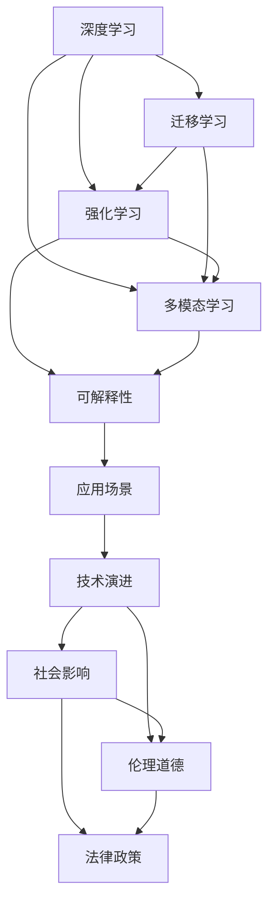

                 

# 安德烈·卡帕西：人工智能的未来发展趋势

在人工智能飞速发展的今天，全球顶尖计算机科学家Andrej Karpathy以其深邃的洞察力和前瞻性的视角，对AI的未来趋势提出了自己独特的见解。本文将通过对其核心观点的梳理，展现其对人工智能领域发展的深刻洞察，探讨未来可能的方向和机遇。

## 1. 背景介绍

### 1.1 问题由来

随着深度学习和大数据技术的迅猛发展，人工智能在过去十年间取得了显著的进展。从图像识别到自然语言处理，从自动驾驶到智能推荐，人工智能已经深入到社会生活的各个层面。然而，随着技术的不断突破，人们也开始关注其可能带来的伦理、安全、公平性等社会问题。在此背景下，安德烈·卡帕西（Andrej Karpathy）作为人工智能领域的领军人物，对AI未来的发展趋势提出了自己独到的看法。

### 1.2 问题核心关键点

卡帕西认为，人工智能的发展将会受到技术进步、社会需求、伦理道德、法律政策等多方面因素的影响。为了更好地理解其核心观点，我们需从以下几个关键点来深入探讨：

- **技术演进**：技术进步是AI发展的基础，包括计算能力的提升、数据量的积累、算法模型的创新等。
- **应用场景**：AI技术的应用场景将不断扩展，涵盖医疗、教育、金融、制造等各个领域。
- **伦理道德**：AI带来的伦理道德问题，如隐私保护、公平性、可解释性等，将受到越来越多的关注。
- **社会影响**：AI对社会结构和就业的影响，以及对经济、教育、医疗等领域的深远影响。
- **法律政策**：法律和政策对AI技术的规范和引导，包括隐私保护、数据安全、算法透明性等。

通过这些关键点的探讨，我们可以更全面地理解卡帕西对人工智能未来发展的看法，并对其提出具体见解。

## 2. 核心概念与联系

### 2.1 核心概念概述

卡帕西强调，人工智能的未来发展将依赖于以下几个核心概念的深入理解和应用：

- **深度学习**：深度学习技术通过多层神经网络，能够自动学习数据的复杂特征，是实现AI的主要手段。
- **迁移学习**：通过将一个任务中学到的知识迁移到另一个任务上，提高模型的泛化能力。
- **强化学习**：通过与环境的交互，模型能够自主学习最优策略，适用于复杂的决策问题。
- **多模态学习**：结合视觉、语音、文本等多种数据模态，提升AI系统对现实世界的理解能力。
- **可解释性**：AI模型的决策过程应具备可解释性，以便于用户理解和信任。

### 2.2 核心概念间的联系

卡帕西认为，这些核心概念相互交织，共同构成了AI技术的基石。以下是一个简化的Mermaid流程图，展示这些概念之间的联系：



这个流程图展示了深度学习作为AI的基础，通过迁移学习、强化学习和多模态学习提升模型的泛化能力和决策能力，最终通过应用场景将AI技术应用于各个领域。同时，技术演进、社会影响、伦理道德和法律政策等多方面因素共同影响AI的发展路径。

## 3. 核心算法原理 & 具体操作步骤

### 3.1 算法原理概述

卡帕西指出，未来AI的发展将依赖于以下几个方面的算法创新：

- **模型压缩与量化**：通过模型压缩和量化技术，提高AI模型的效率和可部署性。
- **自监督学习**：利用无标签数据，通过自监督学习任务训练模型，提高其泛化能力。
- **对抗样本与鲁棒性**：研究对抗样本生成技术和模型鲁棒性，提高AI系统的安全性。
- **多任务学习**：通过多任务学习，使模型能够同时优化多个任务，提高资源利用率。

### 3.2 算法步骤详解

以下是一个简化的算法步骤详解，展示了AI模型训练的一般流程：

1. **数据准备**：收集和预处理数据集，包括数据清洗、特征提取、数据增强等。
2. **模型初始化**：选择或设计合适的模型架构，如卷积神经网络、循环神经网络、Transformer等。
3. **模型训练**：使用训练数据集对模型进行训练，通过反向传播算法优化模型参数。
4. **模型验证**：在验证数据集上评估模型性能，调整超参数和模型结构。
5. **模型微调**：在特定任务上微调模型，通过迁移学习、自监督学习等方式提升模型性能。
6. **模型评估**：在测试数据集上评估模型性能，进行最终验证。
7. **模型部署**：将训练好的模型部署到实际应用场景中，进行实时推理。

### 3.3 算法优缺点

卡帕西认为，目前AI算法的主要优点包括：

- **泛化能力强**：通过大规模数据集训练，AI模型具备较强的泛化能力。
- **应用场景广泛**：AI技术可以应用于各个领域，提高效率和准确性。
- **自动化程度高**：自动化处理数据、训练模型、推理预测，减少人工干预。

但同时，也存在一些缺点：

- **数据需求高**：AI模型需要大量高质量的数据进行训练，数据获取和标注成本高。
- **计算资源消耗大**：模型训练和推理需要强大的计算资源，可能面临计算瓶颈。
- **模型解释性不足**：许多AI模型被视为"黑箱"，难以解释其内部工作机制。
- **伦理道德风险**：AI模型可能存在偏见、歧视等问题，影响公平性。

### 3.4 算法应用领域

卡帕西指出，AI技术在以下领域具有广泛的应用前景：

- **医疗健康**：通过AI模型进行疾病诊断、药物研发、个性化治疗等，提高医疗服务效率和质量。
- **金融服务**：利用AI进行风险评估、欺诈检测、智能投顾等，提升金融服务的智能化水平。
- **自动驾驶**：结合计算机视觉、自然语言处理、多传感器融合等技术，实现自动驾驶汽车。
- **教育培训**：通过AI进行个性化学习、自动评分、智能推荐等，提高教育培训效果。
- **智能制造**：利用AI进行质量控制、故障预测、生产调度等，提升制造业的智能化水平。
- **娱乐文化**：结合AI进行内容生成、推荐系统、游戏AI等，提升娱乐文化产业的体验和互动性。

## 4. 数学模型和公式 & 详细讲解 & 举例说明

### 4.1 数学模型构建

卡帕西强调，数学模型是AI研究的重要基础。以下是一个简化的数学模型构建过程：

1. **数据表示**：将数据转换为数学表示，如将图像转换为像素矩阵，将文本转换为词向量。
2. **损失函数**：定义损失函数，衡量模型预测与真实标签之间的差异。
3. **优化算法**：使用优化算法（如梯度下降、Adam等）最小化损失函数。
4. **模型评估**：通过评估指标（如准确率、召回率、F1分数等）评估模型性能。

### 4.2 公式推导过程

以下是一个简化的损失函数推导过程：

$$
L(\theta) = \frac{1}{N}\sum_{i=1}^N \ell(\theta(x_i),y_i)
$$

其中，$L(\theta)$ 表示模型在数据集上的损失函数，$\theta$ 表示模型参数，$x_i$ 表示数据样本，$y_i$ 表示标签，$\ell$ 表示损失函数。

### 4.3 案例分析与讲解

以图像分类任务为例，我们可以使用卷积神经网络（CNN）进行模型构建和训练。在训练过程中，我们可以使用交叉熵损失函数：

$$
\ell(\theta(x_i),y_i) = -\log p(y_i | \theta(x_i))
$$

其中，$p(y_i | \theta(x_i))$ 表示模型在给定输入 $x_i$ 时，预测标签为 $y_i$ 的概率。

## 5. 项目实践：代码实例和详细解释说明

### 5.1 开发环境搭建

为了进行AI模型的开发和训练，我们需要以下开发环境：

1. **Python环境**：选择Python 3.7及以上版本，安装必要的依赖库，如TensorFlow、PyTorch、Keras等。
2. **GPU资源**：利用NVIDIA GPU进行模型训练和推理，提高计算效率。
3. **分布式训练**：使用Spark、Dask等分布式计算框架，进行大规模数据处理和模型训练。
4. **数据存储**：使用Hadoop、HDFS等分布式存储系统，存储和管理大规模数据集。

### 5.2 源代码详细实现

以下是一个简化的代码实例，展示了使用TensorFlow进行图像分类的过程：

```python
import tensorflow as tf
from tensorflow.keras import layers, models

# 定义模型架构
model = models.Sequential()
model.add(layers.Conv2D(32, (3, 3), activation='relu', input_shape=(28, 28, 1)))
model.add(layers.MaxPooling2D((2, 2)))
model.add(layers.Flatten())
model.add(layers.Dense(10, activation='softmax'))

# 编译模型
model.compile(optimizer='adam', loss='categorical_crossentropy', metrics=['accuracy'])

# 加载数据集
(x_train, y_train), (x_test, y_test) = tf.keras.datasets.mnist.load_data()
x_train = x_train.reshape((60000, 28, 28, 1))
x_test = x_test.reshape((10000, 28, 28, 1))
x_train, x_test = x_train / 255.0, x_test / 255.0

# 训练模型
model.fit(x_train, y_train, epochs=5, batch_size=64, validation_data=(x_test, y_test))

# 评估模型
model.evaluate(x_test, y_test)
```

### 5.3 代码解读与分析

这段代码展示了如何使用TensorFlow进行图像分类的基本过程。首先定义了一个简单的卷积神经网络模型，包含卷积层、池化层、全连接层等组件。然后使用`compile`方法编译模型，指定优化器、损失函数和评估指标。接着加载数据集，进行模型训练和评估。

## 6. 实际应用场景

### 6.1 智能交通

卡帕西认为，AI技术在智能交通领域具有广阔的应用前景。通过AI技术实现智能交通信号控制、自动驾驶车辆、交通预测与优化等，可以有效缓解交通拥堵，提高交通安全和效率。

### 6.2 智慧城市

AI技术在智慧城市建设中也有广泛应用。通过智能监控、智能分析、智能调度等技术，可以实现对城市资源的优化管理，提升城市运行效率和服务质量。

### 6.3 环境保护

AI技术在环境保护中也具有重要作用。通过智能监测、智能预警、智能分析等技术，可以实现对环境数据的实时监测和预测，及时应对环境污染和灾害。

### 6.4 未来应用展望

卡帕西认为，未来AI技术将在以下几个方面取得突破：

1. **自主学习**：通过强化学习、深度学习等技术，使AI模型具备自主学习能力，能够在不依赖人类干预的情况下不断优化和改进。
2. **跨领域融合**：AI技术与其他学科（如心理学、伦理学、社会学等）的深度融合，能够拓展AI应用的边界，解决更加复杂的社会问题。
3. **伦理与治理**：建立健全的伦理和治理框架，确保AI技术的公正性和可解释性，避免偏见和歧视。
4. **普及与教育**：通过教育和普及，提升公众对AI技术的理解和信任，推动AI技术的广泛应用。

## 7. 工具和资源推荐

### 7.1 学习资源推荐

为了深入学习AI技术，推荐以下学习资源：

1. **Coursera**：提供大量AI相关的在线课程，涵盖深度学习、自然语言处理、计算机视觉等多个领域。
2. **edX**：提供由全球顶尖大学和研究机构提供的AI课程，内容丰富、质量高。
3. **Udacity**：提供AI和机器学习方向的纳米学位课程，课程设计紧密结合实际应用。
4. **arXiv**：AI领域的研究论文预印本平台，提供最新和最具影响力的研究成果。
5. **Kaggle**：数据科学竞赛平台，通过参与竞赛，提升实践能力。

### 7.2 开发工具推荐

以下是一些常用的AI开发工具：

1. **TensorFlow**：谷歌开源的深度学习框架，功能强大，社区活跃。
2. **PyTorch**：Facebook开源的深度学习框架，易用性强，支持动态图。
3. **MXNet**：亚马逊开源的深度学习框架，具有高效的分布式训练能力。
4. **Caffe**：由伯克利大学开发的深度学习框架，适用于图像识别等任务。
5. **Keras**：高层次的深度学习框架，易于上手，支持多种后端引擎。

### 7.3 相关论文推荐

为了深入了解AI技术的最新进展，推荐以下相关论文：

1. **《Attention is All You Need》**：谷歌的Transformer模型，开创了自注意力机制在深度学习中的应用。
2. **《ImageNet Classification with Deep Convolutional Neural Networks》**：AlexNet模型，奠定了深度卷积神经网络在图像分类任务上的基础。
3. **《On the Shoulders of Giants: Teaching Machines to Learn from Humans》**：杨立昆（Yann LeCun）的经典论文，介绍了深度学习在计算机视觉、语音识别等领域的应用。
4. **《A Survey on Multi-Task Learning》**：对多任务学习技术的全面综述，介绍了不同方法的优势和应用场景。
5. **《Generative Adversarial Nets》**：生成对抗网络（GAN）模型，开辟了生成模型的新方向。

## 8. 总结：未来发展趋势与挑战

### 8.1 研究成果总结

卡帕西指出，当前AI技术已经在多个领域取得了显著成果，包括计算机视觉、自然语言处理、自动驾驶等。未来，AI技术将继续在更广泛的应用场景中发挥重要作用，推动社会的全面进步。

### 8.2 未来发展趋势

1. **自主学习能力的提升**：通过强化学习、深度学习等技术，使AI模型具备更强的自主学习能力。
2. **跨领域融合的加强**：AI技术与心理学、伦理学、社会学等领域的深度融合，拓展应用边界，解决复杂社会问题。
3. **伦理与治理的完善**：建立健全的伦理和治理框架，确保AI技术的公正性和可解释性，避免偏见和歧视。
4. **社会普及与教育**：通过教育和普及，提升公众对AI技术的理解和信任，推动AI技术的广泛应用。

### 8.3 面临的挑战

尽管AI技术在多个领域取得了显著进展，但仍然面临诸多挑战：

1. **数据质量和标注成本**：AI模型需要大量高质量的数据进行训练，数据获取和标注成本高。
2. **计算资源消耗**：模型训练和推理需要强大的计算资源，可能面临计算瓶颈。
3. **模型解释性不足**：许多AI模型被视为"黑箱"，难以解释其内部工作机制。
4. **伦理道德风险**：AI模型可能存在偏见、歧视等问题，影响公平性。
5. **隐私保护与安全**：AI模型需要保护用户隐私，避免数据泄露和安全风险。

### 8.4 研究展望

为了应对这些挑战，未来的AI研究需要在以下几个方面取得突破：

1. **无监督和半监督学习**：摆脱对大规模标注数据的依赖，利用自监督学习、主动学习等方法，最大限度利用非结构化数据。
2. **参数高效微调**：开发更加参数高效的微调方法，减少计算资源消耗，提高模型效率。
3. **模型解释性增强**：开发可解释性更强的模型，增强用户对AI系统的信任和理解。
4. **多模态学习**：结合视觉、语音、文本等多种数据模态，提升AI系统对现实世界的理解能力。
5. **隐私保护与安全**：研究隐私保护技术，确保数据安全，避免数据泄露和安全风险。

## 9. 附录：常见问题与解答

### Q1：AI模型需要大量数据进行训练，数据获取和标注成本高，如何解决？

A：可以通过数据增强、无监督学习、主动学习等方法，最大化利用有限数据。此外，可以使用预训练模型，通过微调的方式，提高模型性能。

### Q2：AI模型计算资源消耗大，如何提高计算效率？

A：可以通过模型压缩、量化、分布式训练等方法，优化计算资源使用。同时，可以使用更高效的前向传播算法和优化器，减少计算时间。

### Q3：AI模型的解释性不足，如何增强模型可解释性？

A：可以通过引入可解释性模型架构、可视化工具、可解释性算法等方法，增强模型可解释性。

### Q4：AI模型存在伦理道德问题，如何解决？

A：可以通过建立伦理审查机制、引入伦理导向的评估指标、进行模型公平性测试等方法，确保模型公正性和公平性。

### Q5：AI模型可能存在隐私保护和安全问题，如何解决？

A：可以通过数据脱敏、隐私保护技术、安全审计等方法，确保数据安全和模型安全。

---

作者：禅与计算机程序设计艺术 / Zen and the Art of Computer Programming

