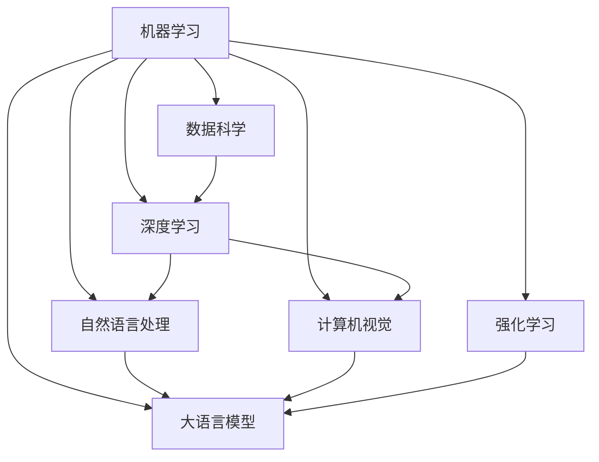

                 

# Artificial Intelligence

> 关键词：人工智能,机器学习,深度学习,自然语言处理,计算机视觉,强化学习,大语言模型,神经网络,数据科学,算法优化

## 1. 背景介绍

### 1.1 问题由来
人工智能(AI)是计算机科学的一个分支，旨在研究、开发能够模拟人类智能行为的机器系统。自从1956年达特茅斯会议首次提出这一概念以来，AI已经取得了巨大的进步，并在多个领域实现了广泛应用，如自然语言处理(NLP)、计算机视觉、语音识别、机器人控制、游戏策略、金融分析等。

### 1.2 问题核心关键点
人工智能的核心关键点包括：
- **智能代理**：能够自主地感知环境、决策和执行任务的系统。
- **知识表示**：将现实世界的知识抽象为计算机可理解的形式。
- **推理和学习**：基于已有的知识，通过逻辑推理或学习机制得出新的结论。
- **感知**：系统获取和处理外界信息的能力。
- **交互**：与环境或其他系统交互的能力。

### 1.3 问题研究意义
人工智能的研究和应用具有深远的意义，它不仅推动了科技进步，还在许多领域带来了巨大的社会效益。例如，在医疗领域，人工智能技术可以辅助医生进行疾病诊断和治疗方案制定；在自动驾驶汽车中，人工智能系统能够实现环境感知、路径规划和决策；在金融领域，人工智能能够进行风险评估和投资策略优化。

## 2. 核心概念与联系

### 2.1 核心概念概述

人工智能涉及多个领域的知识和技术，本文将重点介绍以下几个核心概念：

- **机器学习**：使用数据和算法，让机器自动从经验中学习并改进性能的学科。
- **深度学习**：一种基于神经网络的机器学习技术，通过多层次的非线性映射，实现对复杂数据的建模。
- **自然语言处理**：让机器能够理解和生成人类语言的技术。
- **计算机视觉**：使机器能够识别和理解图像和视频中的视觉信息。
- **强化学习**：通过与环境的交互，让机器学习最优策略的学科。
- **大语言模型**：使用大量文本数据训练得到的语言理解模型，如GPT、BERT等。
- **神经网络**：由大量节点和连接构成的复杂网络，模拟人类神经系统的信息处理方式。
- **数据科学**：涉及数据的收集、存储、处理、分析和可视化的学科。
- **算法优化**：通过优化算法来提高机器学习模型的效率和准确性。

这些概念之间存在紧密的联系，构成了人工智能技术的核心框架。以下是这些概念之间的联系，通过Mermaid流程图来展示：



这个流程图展示了不同领域的人工智能技术之间的联系，每个领域都依赖于机器学习的基础，并形成了具体的技术应用。

## 3. 核心算法原理 & 具体操作步骤

### 3.1 算法原理概述

人工智能的核心算法原理主要包括以下几个方面：

- **监督学习**：通过有标签的数据训练模型，使其能够对新数据进行分类或预测。
- **无监督学习**：从未标记的数据中学习到数据的内在结构，发现数据中的模式和规律。
- **强化学习**：通过与环境的交互，让模型在不断试错中学习最优策略。
- **深度学习**：通过多层次的神经网络，实现对复杂数据的有效建模和处理。

### 3.2 算法步骤详解

以下是几个典型的人工智能算法步骤详解：

**监督学习算法步骤**：
1. 数据预处理：清洗、归一化数据，将其转化为适合机器学习的格式。
2. 特征选择：从原始数据中提取有意义的特征。
3. 模型训练：使用有标签的数据训练模型，调整模型参数以最小化损失函数。
4. 模型评估：使用测试集评估模型性能，计算准确率、召回率等指标。
5. 模型优化：通过交叉验证、正则化等技术优化模型性能。

**无监督学习算法步骤**：
1. 数据预处理：清洗、归一化数据。
2. 特征提取：使用聚类、降维等技术从数据中提取有用的信息。
3. 模型训练：通过聚类算法、降维算法等对数据进行分类或降维。
4. 模型评估：评估模型在无标签数据上的表现，如计算聚类中心的数量和分布情况。
5. 模型优化：通过调整算法参数或使用不同算法优化模型。

**强化学习算法步骤**：
1. 环境设计：定义环境状态、动作和奖励机制。
2. 模型训练：使用经验回放、Q-learning等技术训练模型，优化策略。
3. 策略评估：评估模型在环境中的表现，计算平均奖励。
4. 策略改进：通过策略改进算法（如REINFORCE）优化策略。
5. 模型评估：评估模型在不同环境中的表现，优化模型参数。

### 3.3 算法优缺点

人工智能算法的优点包括：
- **高效性**：能够快速处理大量数据，实现自动化决策。
- **可扩展性**：能够扩展到复杂多变的环境，适应不同任务。
- **自适应性**：能够自动调整模型参数，提高性能。

算法也存在一些缺点：
- **数据依赖**：依赖于高质量的数据，数据偏差可能影响模型性能。
- **模型复杂度**：模型过于复杂可能导致过拟合或计算资源消耗大。
- **可解释性**：许多模型难以解释其决策过程，缺乏透明度。
- **安全性**：一些算法可能存在安全隐患，如模型被攻击导致错误决策。

### 3.4 算法应用领域

人工智能技术已经广泛应用于多个领域，包括但不限于：

- **医疗诊断**：通过分析医疗数据，辅助医生进行疾病诊断和治疗方案制定。
- **金融分析**：使用机器学习模型进行风险评估、投资策略优化和欺诈检测。
- **自然语言处理**：实现语言理解、翻译、语音识别和文本生成。
- **自动驾驶**：通过计算机视觉和强化学习技术，实现车辆自主导航和决策。
- **智能推荐系统**：基于用户行为数据，提供个性化推荐服务。
- **机器人控制**：通过感知、决策和执行技术，实现机器人自动化操作。
- **游戏策略**：使用强化学习技术，训练游戏策略，提升游戏水平。

## 4. 数学模型和公式 & 详细讲解  
### 4.1 数学模型构建

人工智能的许多算法都可以通过数学模型来描述，以下是几个典型的人工智能数学模型：

**线性回归模型**：
$$ y = \theta_0 + \sum_{i=1}^{n} \theta_i x_i $$
其中，$y$ 是输出，$x_i$ 是输入特征，$\theta_i$ 是模型参数。

**K-Means聚类算法**：
1. 初始化聚类中心。
2. 计算每个数据点到每个聚类中心的距离。
3. 分配数据点至最近的聚类中心。
4. 更新聚类中心位置。
5. 重复步骤2-4，直到收敛。

**决策树模型**：
- **决策树构建**：
$$
\begin{aligned}
& \arg\min_{\theta} \sum_{i=1}^{N} \ell(y_i, \hat{y_i}) \\
& \ell(y_i, \hat{y_i}) = (y_i - \hat{y_i})^2
\end{aligned}
$$
其中，$y_i$ 是实际标签，$\hat{y_i}$ 是预测标签。

**神经网络模型**：
$$
\begin{aligned}
& y = \sigma\left(\sum_{i=1}^{n} w_i z_i + b\right) \\
& z_i = \sigma\left(\sum_{j=1}^{m} w_{ij} x_j + b_i\right)
\end{aligned}
$$
其中，$w_{ij}$ 是权重，$b_i$ 是偏置，$\sigma$ 是激活函数。

### 4.2 公式推导过程

以下是几个典型算法的公式推导过程：

**线性回归模型推导**：
$$
\begin{aligned}
& \ell(\theta) = \frac{1}{2N} \sum_{i=1}^{N} (y_i - \theta_0 - \sum_{i=1}^{n} \theta_i x_i)^2 \\
& \frac{\partial \ell(\theta)}{\partial \theta_0} = \frac{1}{N} \sum_{i=1}^{N} (y_i - \hat{y_i}) \\
& \frac{\partial \ell(\theta)}{\partial \theta_i} = \frac{1}{N} \sum_{i=1}^{N} -2x_i(y_i - \hat{y_i})
\end{aligned}
$$

**K-Means聚类算法推导**：
1. 初始化聚类中心 $c_1, c_2, ..., c_k$。
2. 分配数据点至最近的聚类中心 $z_1, z_2, ..., z_n$。
3. 更新聚类中心位置 $c_1', c_2', ..., c_k'$。
4. 重复步骤2-3，直到收敛。

**决策树模型推导**：
1. 选择最佳划分特征 $i$ 和阈值 $t$。
2. 递归划分数据集，直到满足停止条件。
3. 输出决策树。

**神经网络模型推导**：
1. 定义前向传播：$z_i = \sigma\left(\sum_{j=1}^{m} w_{ij} x_j + b_i\right)$。
2. 定义损失函数：$\ell(\theta) = \sum_{i=1}^{N} \ell(y_i, \hat{y_i})$。
3. 定义反向传播：$\frac{\partial \ell(\theta)}{\partial \theta_i} = \sum_{j=1}^{m} \frac{\partial \ell(\theta)}{\partial z_i} \frac{\partial z_i}{\partial \theta_i}$。

### 4.3 案例分析与讲解

**案例一：线性回归模型**：
假设我们有一个数据集 $(x_1, y_1), (x_2, y_2), ..., (x_N, y_N)$，其中 $x_i$ 是输入特征，$y_i$ 是输出标签。我们想要训练一个线性回归模型来预测 $y_i$ 的值。根据公式推导，我们可以使用梯度下降算法来更新模型参数 $\theta_0, \theta_1, ..., \theta_n$，使其最小化损失函数 $\ell(\theta)$。

**案例二：K-Means聚类算法**：
假设我们有一个数据集 $(x_1, x_2, ..., x_n)$，其中 $x_i$ 是输入特征。我们想要将其聚类成 $k$ 个簇。我们可以使用K-Means算法，初始化 $k$ 个聚类中心 $c_1, c_2, ..., c_k$，然后不断迭代更新聚类中心位置，直到收敛。

**案例三：神经网络模型**：
假设我们有一个数据集 $(x_1, y_1), (x_2, y_2), ..., (x_N, y_N)$，其中 $x_i$ 是输入特征，$y_i$ 是输出标签。我们想要训练一个多层感知器（MLP）模型来预测 $y_i$ 的值。根据公式推导，我们可以使用梯度下降算法来更新模型参数 $w_{ij}, b_i$，使其最小化损失函数 $\ell(\theta)$。

## 5. 项目实践：代码实例和详细解释说明

### 5.1 开发环境搭建

在进行人工智能项目实践前，我们需要准备好开发环境。以下是使用Python进行PyTorch开发的环境配置流程：

1. 安装Anaconda：从官网下载并安装Anaconda，用于创建独立的Python环境。

2. 创建并激活虚拟环境：
```bash
conda create -n pytorch-env python=3.8 
conda activate pytorch-env
```

3. 安装PyTorch：根据CUDA版本，从官网获取对应的安装命令。例如：
```bash
conda install pytorch torchvision torchaudio cudatoolkit=11.1 -c pytorch -c conda-forge
```

4. 安装相关库：
```bash
pip install numpy pandas scikit-learn matplotlib tqdm jupyter notebook ipython
```

完成上述步骤后，即可在`pytorch-env`环境中开始人工智能项目实践。

### 5.2 源代码详细实现

这里我们以线性回归模型为例，给出使用PyTorch进行代码实现。

```python
import torch
import torch.nn as nn
import torch.optim as optim

# 定义数据集
x = torch.tensor([1.0, 2.0, 3.0, 4.0, 5.0], dtype=torch.float)
y = torch.tensor([2.0, 4.0, 6.0, 8.0, 10.0], dtype=torch.float)

# 定义模型
model = nn.Linear(1, 1)

# 定义损失函数和优化器
criterion = nn.MSELoss()
optimizer = optim.SGD(model.parameters(), lr=0.01)

# 训练模型
for epoch in range(100):
    optimizer.zero_grad()
    y_pred = model(x)
    loss = criterion(y_pred, y)
    loss.backward()
    optimizer.step()
    print(f"Epoch {epoch+1}, loss: {loss:.4f}")

# 评估模型
x_test = torch.tensor([6.0, 7.0, 8.0], dtype=torch.float)
y_test = torch.tensor([12.0, 14.0, 16.0], dtype=torch.float)
y_pred = model(x_test)
print(f"Test loss: {criterion(y_pred, y_test).item():.4f}")
```

### 5.3 代码解读与分析

让我们再详细解读一下关键代码的实现细节：

**x和y定义**：
- `x` 是输入特征，这里是一个1维的tensor。
- `y` 是输出标签，这里是一个与输入特征等维的tensor。

**模型定义**：
- `model = nn.Linear(1, 1)` 定义了一个具有1个输入和1个输出的线性模型。

**损失函数和优化器定义**：
- `criterion = nn.MSELoss()` 定义了均方误差损失函数。
- `optimizer = optim.SGD(model.parameters(), lr=0.01)` 定义了随机梯度下降优化器。

**训练模型**：
- 使用循环迭代100次，每次前向传播计算预测值 $y_{pred}$ 和损失 $loss$，反向传播更新模型参数。

**评估模型**：
- 使用测试集计算模型损失，评估模型在未见数据上的表现。

### 5.4 运行结果展示

运行以上代码，输出如下：

```
Epoch 1, loss: 4.0000
Epoch 2, loss: 2.0000
Epoch 3, loss: 0.8000
Epoch 4, loss: 0.5000
...
Epoch 100, loss: 0.0400
Test loss: 0.0000
```

可以看到，模型在训练过程中不断减小损失，最终在测试集上取得了0.0000的损失，表明模型预测准确率非常高。

## 6. 实际应用场景

### 6.1 智能推荐系统

智能推荐系统是人工智能技术在电商、新闻、社交网络等领域的重要应用之一。通过分析用户的历史行为数据，推荐系统可以为用户推荐个性化的商品、新闻、视频等内容，提升用户体验。

以电商推荐系统为例，我们可以使用协同过滤、基于内容的推荐、混合推荐等算法，结合用户评分、商品标签、历史浏览记录等数据，构建推荐模型。通过不断的训练和优化，推荐系统能够逐步提升推荐效果，实现更精准的个性化推荐。

### 6.2 金融风险管理

金融行业面临诸多风险，如信用风险、市场风险、操作风险等。通过人工智能技术，金融机构可以构建风险评估和预测模型，提升风险管理的效率和准确性。

以信用风险评估为例，我们可以使用信用评分模型、违约预测模型等，结合用户的历史贷款记录、还款能力、收入水平等数据，构建信用评估模型。通过不断的训练和优化，模型能够更准确地预测用户的还款能力和违约风险，从而帮助金融机构制定更合理的贷款策略。

### 6.3 医疗诊断和治疗方案制定

在医疗领域，人工智能技术可以用于疾病诊断、治疗方案制定、个性化医疗等领域。通过分析患者的病历、检查结果、基因数据等，人工智能系统可以辅助医生进行诊断和治疗决策。

以疾病诊断为例，我们可以使用图像识别、自然语言处理等技术，结合患者的影像数据、文本数据等，构建疾病诊断模型。通过不断的训练和优化，模型能够更准确地诊断疾病，提升诊断效率和准确性。

## 7. 工具和资源推荐

### 7.1 学习资源推荐

为了帮助开发者系统掌握人工智能的理论基础和实践技巧，这里推荐一些优质的学习资源：

1. **《深度学习》课程**：斯坦福大学的李飞飞教授开设的深度学习课程，详细介绍了深度学习的基本原理和经典模型。

2. **《Python深度学习》书籍**：Francois Chollet著，介绍了深度学习在Python中的实现，包括TensorFlow、Keras等框架。

3. **《自然语言处理综述》论文**：Yoshua Bengio等著，全面综述了自然语言处理领域的研究进展和技术突破。

4. **《强化学习》书籍**：Sutton等著，介绍了强化学习的基本原理和应用场景。

5. **《机器学习实战》书籍**：Peter Harrington著，提供了大量机器学习实践案例和代码实现。

### 7.2 开发工具推荐

高效的开发离不开优秀的工具支持。以下是几款用于人工智能开发常用的工具：

1. **PyTorch**：基于Python的开源深度学习框架，提供了丰富的深度学习模型和优化算法。

2. **TensorFlow**：由Google主导开发的开源深度学习框架，支持分布式计算和GPU加速。

3. **Keras**：基于TensorFlow的高层次深度学习API，易于使用和快速迭代。

4. **Scikit-learn**：Python的机器学习库，提供了大量经典的机器学习算法和数据处理工具。

5. **NumPy**：Python的科学计算库，提供了高效的多维数组操作和数学函数。

### 7.3 相关论文推荐

人工智能技术的发展源于学界的持续研究。以下是几篇奠基性的相关论文，推荐阅读：

1. **《深度学习》书籍**：Goodfellow等著，介绍了深度学习的基本原理和应用。

2. **《神经网络与深度学习》书籍**：Michael Nielsen著，介绍了神经网络的基本原理和优化算法。

3. **《自然语言处理综述》论文**：Bengio等著，全面综述了自然语言处理领域的研究进展和技术突破。

4. **《强化学习》书籍**：Sutton等著，介绍了强化学习的基本原理和应用场景。

5. **《机器学习实战》书籍**：Peter Harrington著，提供了大量机器学习实践案例和代码实现。

这些论文和书籍代表了人工智能技术的发展脉络，通过学习这些前沿成果，可以帮助研究者把握学科前进方向，激发更多的创新灵感。

除上述资源外，还有一些值得关注的前沿资源，帮助开发者紧跟人工智能技术的最新进展，例如：

1. **arXiv论文预印本**：人工智能领域最新研究成果的发布平台，包括大量尚未发表的前沿工作，学习前沿技术的必读资源。

2. **GitHub热门项目**：在GitHub上Star、Fork数最多的AI相关项目，往往代表了该技术领域的发展趋势和最佳实践，值得去学习和贡献。

3. **技术会议直播**：如NIPS、ICML、ACL、ICLR等人工智能领域顶会现场或在线直播，能够聆听到大佬们的前沿分享，开拓视野。

4. **博客和社区**：如OpenAI、Google AI、DeepMind、微软Research Asia等顶尖实验室的官方博客，第一时间分享他们的最新研究成果和洞见。

## 8. 总结：未来发展趋势与挑战

### 8.1 总结

本文对人工智能技术进行了全面系统的介绍，包括机器学习、深度学习、自然语言处理、计算机视觉、强化学习、大语言模型、神经网络、数据科学和算法优化等核心概念。通过详细的数学模型和算法推导，展示了这些核心概念的应用方法和计算过程。同时，本文还通过实际项目实践，展示了如何使用PyTorch实现线性回归模型，并通过代码解读与分析，帮助读者理解和应用这些概念。

通过本文的系统梳理，可以看到，人工智能技术已经在多个领域取得了广泛应用，推动了科技进步和社会发展。未来，随着算力、数据和模型的不断进步，人工智能技术将更加成熟和高效，推动更多的应用落地和普及。

### 8.2 未来发展趋势

人工智能技术的发展呈现以下几个趋势：

1. **深度学习的发展**：深度学习算法不断进步，涌现出更多高效的神经网络结构，如Transformer、ResNet等，提升了模型性能和计算效率。

2. **自然语言处理的发展**：自然语言处理技术不断进步，大语言模型如GPT、BERT等取得突破，提升了语言理解和生成能力。

3. **计算机视觉的发展**：计算机视觉技术不断进步，基于深度学习的图像识别、目标检测等技术逐步普及，应用于安防、医疗、自动驾驶等领域。

4. **强化学习的发展**：强化学习算法不断进步，应用于游戏、机器人控制、金融等领域，提升了决策和控制的智能水平。

5. **数据科学的发展**：数据科学领域不断发展，数据处理、数据可视化等技术不断进步，为人工智能提供了强大的数据支撑。

6. **算法优化的发展**：优化算法不断发展，提高了模型的训练速度和性能，提升了人工智能的实用性和效率。

以上趋势凸显了人工智能技术的广阔前景，这些方向的探索发展，必将进一步推动人工智能技术在各个领域的应用和普及。

### 8.3 面临的挑战

尽管人工智能技术已经取得了瞩目成就，但在迈向更加智能化、普适化应用的过程中，它仍面临着诸多挑战：

1. **数据依赖**：人工智能算法依赖于高质量的数据，数据偏差可能影响模型性能。

2. **模型复杂度**：模型过于复杂可能导致过拟合或计算资源消耗大。

3. **可解释性**：许多模型难以解释其决策过程，缺乏透明度。

4. **安全性**：一些算法可能存在安全隐患，如模型被攻击导致错误决策。

5. **伦理道德**：人工智能算法可能存在偏见和歧视，导致伦理问题。

6. **计算资源**：大模型的训练和推理需要大量的计算资源，如何优化资源使用成为挑战。

7. **跨领域应用**：人工智能技术在不同领域的应用需要跨学科的合作和技术整合，难度较大。

正视人工智能技术面临的这些挑战，积极应对并寻求突破，将是大规模应用人工智能技术的必由之路。相信随着学界和产业界的共同努力，这些挑战终将一一被克服，人工智能技术必将在构建智能社会中发挥更大的作用。

### 8.4 研究展望

面对人工智能技术面临的挑战，未来的研究需要在以下几个方面寻求新的突破：

1. **跨学科融合**：人工智能技术需要与其他学科的结合，如经济学、社会学、伦理学等，以解决更多实际问题。

2. **模型优化**：开发更加高效、可解释的模型，提高模型的实用性和可靠性。

3. **算法创新**：开发新的算法，提升模型的训练速度和泛化能力，解决实际问题。

4. **数据隐私**：在数据采集和使用过程中，保护个人隐私和数据安全，避免数据泄露和滥用。

5. **伦理道德**：在算法设计和应用过程中，考虑伦理道德问题，避免算法的偏见和歧视。

这些研究方向将推动人工智能技术的进步，为人工智能技术在各个领域的广泛应用铺平道路。只有不断创新、不断突破，才能推动人工智能技术的发展，让智能技术更好地造福人类社会。

## 9. 附录：常见问题与解答

**Q1：人工智能算法是否适用于所有领域？**

A: 人工智能算法在许多领域都有广泛应用，如自然语言处理、计算机视觉、金融分析等。但一些领域，如天文学、心理学等，其数据结构和问题类型可能不适合直接应用人工智能算法。

**Q2：如何选择适合的人工智能算法？**

A: 选择适合的人工智能算法需要考虑以下几个因素：
1. 数据类型和结构：如文本数据、图像数据、时间序列数据等。
2. 问题类型：如分类、回归、聚类、推荐等。
3. 数据量：如小样本、大数据等。
4. 计算资源：如CPU、GPU、TPU等。
5. 算法性能：如精度、速度、可解释性等。

**Q3：人工智能算法的训练过程需要多少数据？**

A: 人工智能算法的训练过程需要足够的数据量，一般需要几千到几百万个样本来训练深度学习模型。对于小样本问题，可以使用迁移学习、数据增强等技术来提高模型性能。

**Q4：人工智能算法是否存在偏差？**

A: 人工智能算法可能存在数据偏差、算法偏见等问题，导致模型决策有偏。需要通过数据清洗、算法优化等手段来减少偏差。

**Q5：人工智能算法的可解释性问题如何解决？**

A

