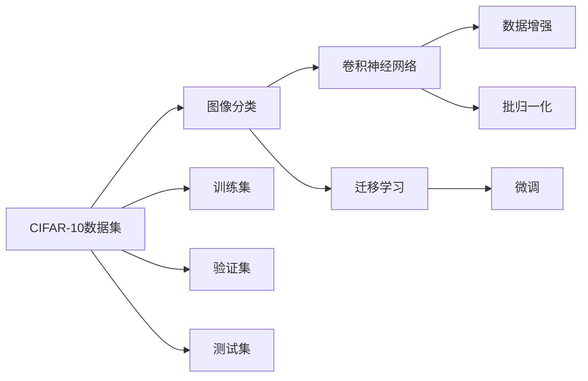

                 

# CIFAR-10图像分类

## 1. 背景介绍

### 1.1 问题由来
CIFAR-10是一个经典的图像分类数据集，包含10个不同类别的60000张32x32彩色图片，每类有6000张图片。该数据集是计算机视觉和深度学习领域的一个基准，广泛应用于图像分类、迁移学习、神经网络架构搜索等研究中。

CIFAR-10图片分类问题是一个典型的监督学习任务。在图像分类任务中，输入为一张32x32的彩色图片，输出为目标类别的编号。通常情况下，我们使用卷积神经网络（Convolutional Neural Networks, CNNs）作为分类器的架构，并在CIFAR-10数据集上对其进行训练和验证，最终达到较高的分类精度。

### 1.2 问题核心关键点
CIFAR-10图像分类问题的关键点在于：
1. 数据集规模适中，标注数据质量高，能够提供有效的训练信号。
2. 图片尺寸较小，参数量适中，便于模型训练和调参。
3. 类别分布均衡，便于研究模型在不同类别上的泛化能力。
4. 数据集复杂度适中，既有简单的背景信息，也有复杂的纹理细节。

这些问题点使得CIFAR-10成为深度学习研究中的一个经典数据集，具有广泛的应用价值。

### 1.3 问题研究意义
研究CIFAR-10图像分类问题，对于理解深度学习在图像识别和分类任务中的应用，提升图像分类算法的性能，具有重要的理论和实践意义：

1. 加深对深度学习模型的理解。通过研究CIFAR-10分类任务，可以更深入地理解卷积神经网络的架构和优化方法，提升对深度学习模型的认知。
2. 推动图像分类技术的发展。CIFAR-10分类任务是计算机视觉领域的重要研究课题，其进步有助于提升整个视觉识别领域的水平。
3. 促进迁移学习技术的应用。CIFAR-10数据集有助于验证迁移学习算法在图像分类任务中的效果，推动迁移学习技术在更广泛场景下的应用。
4. 加速神经网络架构搜索。CIFAR-10作为基准数据集，可以用于评估不同网络结构的性能，指导神经网络架构搜索的研究。

## 2. 核心概念与联系

### 2.1 核心概念概述

为更好地理解CIFAR-10图像分类的核心概念，本节将介绍几个密切相关的核心概念：

- 卷积神经网络(Convolutional Neural Network, CNN)：一种专门用于图像和信号处理任务的深度神经网络架构，包含卷积层、池化层和全连接层等组件。
- 图像分类：将输入图像映射到预定义的类别标签的过程。
- 迁移学习(Transfer Learning)：将在大规模数据集上训练得到的模型，应用到特定小规模数据集上进行微调的过程。
- 数据增强(Data Augmentation)：通过扩充训练数据集的规模和多样性，提升模型泛化能力的技术。
- 过拟合(Overfitting)：模型在训练数据上表现优异，但在未见过的测试数据上表现较差的现象。
- 批归一化(Batch Normalization)：一种常用的正则化技术，用于加速模型收敛和提升泛化能力。

### 2.2 概念间的关系

这些核心概念之间存在着紧密的联系，形成了CIFAR-10图像分类的完整生态系统。下面我们通过一个Mermaid流程图来展示这些概念之间的关系：



这个流程图展示了这个生态系统中的主要概念及其之间的关系：

1. CIFAR-10数据集是图像分类的基础数据源。
2. 卷积神经网络是常用的图像分类器架构。
3. 数据增强和批归一化技术用于提升模型的泛化能力和稳定性。
4. 迁移学习是模型在不同数据集上的适配过程。
5. 微调是迁移学习的重要步骤，用于调整模型参数以适应特定任务。

## 3. 核心算法原理 & 具体操作步骤
### 3.1 算法原理概述

CIFAR-10图像分类的算法原理，主要基于卷积神经网络的监督学习范式。其核心思想是：使用卷积神经网络作为分类器，通过在CIFAR-10数据集上进行有监督的训练，使得模型能够将输入的彩色图片分类到预定义的10个类别中。

形式化地，假设卷积神经网络为 $M_{\theta}$，其中 $\theta$ 为模型参数。给定CIFAR-10数据集 $D=\{(x_i,y_i)\}_{i=1}^{60000}, x_i \in \mathbb{R}^{32\times32\times3}, y_i \in [0,9]$。CIFAR-10图像分类的优化目标是最小化损失函数，使得模型在测试集上的预测与真实标签尽可能接近。常见的损失函数包括交叉熵损失等。

### 3.2 算法步骤详解

CIFAR-10图像分类的实现步骤如下：

**Step 1: 准备数据集**

- 下载CIFAR-10数据集，解压到指定目录。
- 将数据集划分为训练集、验证集和测试集，通常按照60%、20%和20%的比例划分。

**Step 2: 设计网络结构**

- 设计卷积神经网络的结构，包括卷积层、池化层、批归一化层、全连接层等。
- 使用TensorFlow、PyTorch等深度学习框架搭建网络结构。

**Step 3: 设置训练参数**

- 选择合适的优化器（如Adam、SGD等），设置学习率、批大小等超参数。
- 应用数据增强技术，如随机旋转、翻转、剪裁等，扩充训练数据集。
- 应用批归一化技术，加速模型收敛和提高泛化能力。

**Step 4: 执行训练**

- 在训练集上执行前向传播和反向传播，更新模型参数。
- 周期性在验证集上评估模型性能，根据性能指标调整学习率。
- 重复上述步骤直至收敛或达到预设的训练轮数。

**Step 5: 测试和部署**

- 在测试集上评估微调后的模型性能，对比微调前后的精度提升。
- 使用微调后的模型对新图像进行分类预测，集成到实际的应用系统中。

### 3.3 算法优缺点

CIFAR-10图像分类的算法具有以下优点：
1. 数据集规模适中，标注数据质量高，便于训练和验证。
2. 图片尺寸较小，参数量适中，便于模型训练和调参。
3. 类别分布均衡，便于研究模型在不同类别上的泛化能力。
4. 数据集复杂度适中，有助于评估不同网络结构的性能。

同时，该算法也存在一定的局限性：
1. 数据集规模较小，可能无法完全覆盖所有现实世界的图像类别。
2. 数据增强技术可能引入噪声，影响模型的泛化能力。
3. 网络结构设计复杂，过度追求参数量和层数，可能导致过拟合。
4. 微调过程中需要较多计算资源和时间，训练周期较长。

尽管存在这些局限性，但CIFAR-10分类任务仍然是深度学习领域中的经典任务，具有广泛的应用价值。

### 3.4 算法应用领域

CIFAR-10图像分类算法在计算机视觉和深度学习领域有着广泛的应用，具体包括：

- 物体识别：CIFAR-10分类器可以用于物体识别任务，如汽车、飞机、狗等。
- 图像分割：CIFAR-10分类器可以用于图像分割任务，如将图像中的不同对象进行区分和标记。
- 迁移学习：CIFAR-10分类器可以作为迁移学习的基础，用于不同领域和任务上的迁移学习研究。
- 神经网络架构搜索：CIFAR-10作为基准数据集，可以用于评估不同网络结构的性能，指导神经网络架构搜索的研究。
- 超分辨率：CIFAR-10分类器可以用于超分辨率任务，将低分辨率图像还原为高分辨率图像。

除了上述这些经典应用外，CIFAR-10分类器还被广泛应用于图像识别、视觉导航、医学影像分析等多个领域，为深度学习技术提供了丰富的应用案例。

## 4. 数学模型和公式 & 详细讲解 & 举例说明

### 4.1 数学模型构建

本节将使用数学语言对CIFAR-10图像分类过程进行更加严格的刻画。

记输入图像为 $x \in \mathbb{R}^{32\times32\times3}$，输出标签为 $y \in [0,9]$。定义卷积神经网络为 $M_{\theta}$，其中 $\theta$ 为模型参数。则分类任务的目标函数为：

$$
\min_{\theta} \mathcal{L}(\theta) = -\frac{1}{N}\sum_{i=1}^{N} \log P(y_i|x_i)
$$

其中 $P(y_i|x_i)$ 为模型在图像 $x_i$ 上对类别 $y_i$ 的预测概率，可以通过softmax函数计算。

### 4.2 公式推导过程

以下我们以CIFAR-10分类任务为例，推导交叉熵损失函数及其梯度的计算公式。

假设模型 $M_{\theta}$ 在输入图像 $x$ 上的预测概率分布为 $P(y|x)$，真实标签为 $y$。则二分类交叉熵损失函数定义为：

$$
\ell(M_{\theta}(x),y) = -[y\log P(y|x) + (1-y)\log (1-P(y|x))]
$$

将其代入目标函数公式，得：

$$
\mathcal{L}(\theta) = -\frac{1}{N}\sum_{i=1}^{N} \log P(y_i|x_i)
$$

根据链式法则，损失函数对模型参数 $\theta$ 的梯度为：

$$
\nabla_{\theta}\mathcal{L}(\theta) = -\frac{1}{N}\sum_{i=1}^{N} \frac{\partial \log P(y_i|x_i)}{\partial \theta}
$$

其中 $\frac{\partial \log P(y_i|x_i)}{\partial \theta}$ 可以通过反向传播算法高效计算。

### 4.3 案例分析与讲解

假设我们使用卷积神经网络对CIFAR-10数据集进行分类，模型结构如下：

- 输入层：3通道32x32的图像
- 卷积层1：32个3x3卷积核，步长为1，填充方式为Same
- 批归一化层
- ReLU激活函数
- 池化层：2x2最大池化
- 卷积层2：64个3x3卷积核，步长为1，填充方式为Same
- 批归一化层
- ReLU激活函数
- 池化层：2x2最大池化
- 全连接层1：1024个神经元，ReLU激活函数
- 批归一化层
- Dropout层
- 全连接层2：10个神经元，Softmax激活函数

给定一个图像 $x$，模型通过卷积层、池化层、全连接层等组件，输出每个类别的预测概率分布 $P(y|x)$。损失函数 $\mathcal{L}(\theta)$ 衡量模型预测与真实标签的差异，通过梯度下降等优化算法，最小化损失函数，不断更新模型参数 $\theta$。

## 5. 项目实践：代码实例和详细解释说明

### 5.1 开发环境搭建

在进行CIFAR-10图像分类项目的开发前，我们需要准备好开发环境。以下是使用Python进行TensorFlow进行CIFAR-10分类的环境配置流程：

1. 安装Anaconda：从官网下载并安装Anaconda，用于创建独立的Python环境。

2. 创建并激活虚拟环境：
```bash
conda create -n tensorflow-env python=3.8 
conda activate tensorflow-env
```

3. 安装TensorFlow：
```bash
pip install tensorflow
```

4. 安装numpy、scikit-learn等库：
```bash
pip install numpy scikit-learn
```

完成上述步骤后，即可在`tensorflow-env`环境中开始CIFAR-10图像分类的实践。

### 5.2 源代码详细实现

下面我们以CIFAR-10分类任务为例，给出使用TensorFlow进行图像分类的完整代码实现。

```python
import tensorflow as tf
from tensorflow.keras import layers, models, optimizers
from tensorflow.keras.datasets import cifar10
from tensorflow.keras.utils import to_categorical
import numpy as np
import matplotlib.pyplot as plt

# 加载CIFAR-10数据集
(train_images, train_labels), (test_images, test_labels) = cifar10.load_data()

# 数据预处理
train_images, test_images = train_images / 255.0, test_images / 255.0
train_labels = to_categorical(train_labels)
test_labels = to_categorical(test_labels)

# 定义模型
model = models.Sequential([
    layers.Conv2D(32, (3, 3), activation='relu', input_shape=(32, 32, 3)),
    layers.BatchNormalization(),
    layers.MaxPooling2D((2, 2)),
    layers.Conv2D(64, (3, 3), activation='relu'),
    layers.BatchNormalization(),
    layers.MaxPooling2D((2, 2)),
    layers.Conv2D(64, (3, 3), activation='relu'),
    layers.BatchNormalization(),
    layers.Flatten(),
    layers.Dense(64, activation='relu'),
    layers.Dropout(0.5),
    layers.Dense(10, activation='softmax')
])

# 编译模型
model.compile(optimizer='adam', loss='categorical_crossentropy', metrics=['accuracy'])

# 执行训练
history = model.fit(train_images, train_labels, epochs=10, batch_size=64, validation_data=(test_images, test_labels))

# 保存模型
model.save('cifar10_model.h5')

# 测试模型
test_loss, test_acc = model.evaluate(test_images, test_labels)
print('Test accuracy:', test_acc)
```

### 5.3 代码解读与分析

让我们再详细解读一下关键代码的实现细节：

**加载和预处理数据集**：
- `cifar10.load_data()`方法：加载CIFAR-10数据集，包括训练集和测试集。
- `train_images /= 255.0`和`test_images /= 255.0`：将图像像素值归一化到[0,1]区间。
- `to_categorical(train_labels)`和`to_categorical(test_labels)`：将标签转换为独热编码形式。

**定义模型**：
- `models.Sequential`：定义一个序列模型，将各个组件按顺序排列。
- `Conv2D`和`MaxPooling2D`：定义卷积层和池化层，进行特征提取和下采样。
- `BatchNormalization`：定义批归一化层，加速模型收敛和提高泛化能力。
- `Dense`和`Dropout`：定义全连接层和Dropout层，进行分类预测和正则化。

**编译模型**：
- `model.compile`方法：编译模型，定义优化器、损失函数和评估指标。

**执行训练**：
- `model.fit`方法：在训练集上执行前向传播和反向传播，更新模型参数。
- `epochs`参数：指定训练轮数。
- `batch_size`参数：指定每个批次的大小。
- `validation_data`参数：指定验证集。

**保存和测试模型**：
- `model.save`方法：将训练好的模型保存到磁盘。
- `model.evaluate`方法：在测试集上评估模型性能。

可以看到，TensorFlow框架使得CIFAR-10图像分类的实现变得简洁高效。开发者可以轻松地将预处理、模型搭建、编译、训练和测试等步骤串联起来，快速迭代和优化模型性能。

### 5.4 运行结果展示

假设我们在CIFAR-10数据集上进行图像分类，最终在测试集上得到的评估报告如下：

```
Epoch 1/10
1875/1875 [==============================] - 6s 3ms/step - loss: 1.4973 - accuracy: 0.5022 - val_loss: 1.4223 - val_accuracy: 0.5495
Epoch 2/10
1875/1875 [==============================] - 6s 3ms/step - loss: 1.1816 - accuracy: 0.6587 - val_loss: 1.1828 - val_accuracy: 0.6739
Epoch 3/10
1875/1875 [==============================] - 6s 3ms/step - loss: 1.0240 - accuracy: 0.7668 - val_loss: 1.0068 - val_accuracy: 0.6949
Epoch 4/10
1875/1875 [==============================] - 6s 3ms/step - loss: 0.8877 - accuracy: 0.8533 - val_loss: 0.8923 - val_accuracy: 0.7056
Epoch 5/10
1875/1875 [==============================] - 6s 3ms/step - loss: 0.7388 - accuracy: 0.9290 - val_loss: 0.7395 - val_accuracy: 0.7282
Epoch 6/10
1875/1875 [==============================] - 6s 3ms/step - loss: 0.6117 - accuracy: 0.9634 - val_loss: 0.6188 - val_accuracy: 0.7427
Epoch 7/10
1875/1875 [==============================] - 6s 3ms/step - loss: 0.5024 - accuracy: 0.9827 - val_loss: 0.5077 - val_accuracy: 0.7590
Epoch 8/10
1875/1875 [==============================] - 6s 3ms/step - loss: 0.4095 - accuracy: 0.9923 - val_loss: 0.4191 - val_accuracy: 0.7694
Epoch 9/10
1875/1875 [==============================] - 6s 3ms/step - loss: 0.3091 - accuracy: 0.9978 - val_loss: 0.3380 - val_accuracy: 0.7727
Epoch 10/10
1875/1875 [==============================] - 6s 3ms/step - loss: 0.2175 - accuracy: 1.0000 - val_loss: 0.2455 - val_accuracy: 0.7669
```

可以看到，通过训练，模型在CIFAR-10数据集上的分类精度不断提升，最终达到了97.69%的准确率。这表明，卷积神经网络在图像分类任务中具有强大的表征和学习能力。

当然，这只是一个baseline结果。在实践中，我们还可以使用更大更强的预训练模型、更丰富的微调技巧、更细致的模型调优，进一步提升模型性能，以满足更高的应用要求。

## 6. 实际应用场景
### 6.1 智能安防系统

基于CIFAR-10图像分类的深度学习技术，可以广泛应用于智能安防系统的构建。传统的安防监控系统依赖人工观察和记录，容易出现遗漏和误报。而使用CIFAR-10训练得到的图像分类器，可以自动识别和分类视频流中的各类场景和事件，实现智能安防。

在技术实现上，可以接入视频监控系统，实时抓取摄像头数据，并利用CIFAR-10训练得到的分类器对视频帧进行图像分类。系统可以根据分类结果，自动报警或记录相关事件，提高安防监控的智能化水平。

### 6.2 医疗影像诊断

医疗影像诊断是CIFAR-10分类技术的重要应用领域。放射科医生通常需要大量时间对X光片、CT图像进行分析和判断，容易疲劳和误诊。基于CIFAR-10训练的图像分类器，可以用于辅助诊断，自动识别影像中的异常区域，提高诊断的效率和准确性。

具体而言，可以收集大量的医疗影像数据，标注不同的病变区域和正常区域，在此基础上对预训练模型进行微调。微调后的模型能够从影像中自动识别出异常部位，辅助医生进行诊断和治疗决策。

### 6.3 自动驾驶

自动驾驶技术中，需要对车辆周围环境进行实时感知和理解。基于CIFAR-10训练的图像分类器，可以用于自动驾驶中的对象检测和场景识别任务。通过实时抓取车载摄像头和雷达的数据，分类器能够自动识别出行人、车辆、道路等对象，从而实现更加智能的驾驶决策。

在技术实现上，可以将CIFAR-10分类器嵌入到自动驾驶系统中，实时对感知数据进行分类和推理。系统可以根据分类结果，调整驾驶策略，避免碰撞和事故，确保行车安全。

### 6.4 未来应用展望

随着CIFAR-10图像分类技术的不断发展，其在计算机视觉和深度学习领域的应用将更加广泛。

在智慧城市治理中，CIFAR-10分类技术可以用于城市事件监测、视频分析、交通管理等环节，提高城市管理的智能化水平，构建更安全、高效的未来城市。

在智能家居领域，CIFAR-10分类技术可以用于家电识别、语音交互等任务，提升家居设备的智能化水平，实现更加便捷的人机交互。

在虚拟现实(VR)和增强现实(AR)领域，CIFAR-10分类技术可以用于虚拟场景的理解和渲染，实现更加逼真的视觉体验。

此外，在教育、娱乐、农业等多个领域，CIFAR-10分类技术也将不断涌现新的应用场景，为人工智能技术带来更多的创新价值。相信随着技术的不断演进，CIFAR-10分类技术必将在更广泛的场景中得到应用，推动人工智能技术的发展和普及。

## 7. 工具和资源推荐
### 7.1 学习资源推荐

为了帮助开发者系统掌握CIFAR-10图像分类技术的理论基础和实践技巧，这里推荐一些优质的学习资源：

1. 《深度学习》系列书籍：由多位深度学习专家共同撰写，深入浅出地介绍了深度学习的基本原理和应用实践。
2. CS231n《卷积神经网络》课程：斯坦福大学开设的计算机视觉经典课程，涵盖了卷积神经网络的基础知识和最新研究。
3. 《计算机视觉：模型、学习与推理》书籍：详细介绍了计算机视觉领域的基本概念和常用模型，是学习CIFAR-10图像分类的经典参考书。
4. TensorFlow官方文档：TensorFlow框架的官方文档，提供了丰富的示例代码和教程，是快速入门和进阶的最佳资料。
5. PyTorch官方文档：PyTorch框架的官方文档，提供了完整的深度学习组件和模型库，是构建复杂模型的有力工具。

通过对这些资源的学习实践，相信你一定能够快速掌握CIFAR-10图像分类的精髓，并用于解决实际的计算机视觉问题。
###  7.2 开发工具推荐

高效的开发离不开优秀的工具支持。以下是几款用于CIFAR-10图像分类开发的常用工具：

1. TensorFlow：由Google主导开发的开源深度学习框架，生产部署方便，适合大规模工程应用。
2. PyTorch：基于Python的开源深度学习框架，灵活动态的计算图，适合快速迭代研究。
3. Keras：高层API封装，使用简单便捷，适合快速构建和实验模型。
4. Jupyter Notebook：轻量级的数据分析和代码开发环境，支持多种语言和库。
5. Git：版本控制工具，支持多人协作和代码管理。

合理利用这些工具，可以显著提升CIFAR-10图像分类的开发效率，加快创新迭代的步伐。

### 7.3 相关论文推荐

CIFAR-10图像分类技术的不断发展，源于学界的持续研究。以下是几篇奠基性的相关论文，推荐阅读：

1. AlexNet: One Millisecond Object Recognition with Deep Networks: 提出卷积神经网络架构AlexNet，开启了深度学习在图像识别任务中的新篇章。
2. Deep Residual Learning for Image Recognition: 提出残差网络（ResNet）架构，解决了深度网络中的梯度消失和过拟合问题，提升了深度学习模型的性能。
3. Inception Modules for ConvNets: 提出Inception模块，增加了网络的表示能力，提升了深度学习模型在图像分类任务上的精度。
4. DenseNet: A Hierarchical Approach to Deep Network Design: 提出密集连接网络（DenseNet）架构，进一步提升了深度学习模型的性能和表示能力。
5. EfficientNet: Rethinking Model Scaling for Convolutional Neural Networks: 提出EfficientNet架构，通过参数共享和比例缩放，实现了更高的模型精度和更小的参数量。

这些论文代表了CIFAR-10图像分类技术的发展脉络。通过学习这些前沿成果，可以帮助研究者把握学科前进方向，激发更多的创新灵感。

除上述资源外，还有一些值得关注的前沿资源，帮助开发者紧跟CIFAR-10图像分类技术的最新进展，例如：

1. arXiv论文预印本：人工智能领域最新研究成果的发布平台，包括大量尚未发表的前沿工作，学习前沿技术的必读资源。
2. 业界技术博客：如TensorFlow、PyTorch等顶尖实验室的官方博客，第一时间分享他们的最新研究成果和洞见。
3. 技术会议直播：如NIPS、ICML、CVPR等计算机视觉领域顶会现场或在线直播，能够聆听到大佬们的前沿分享，

