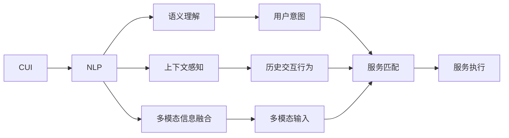
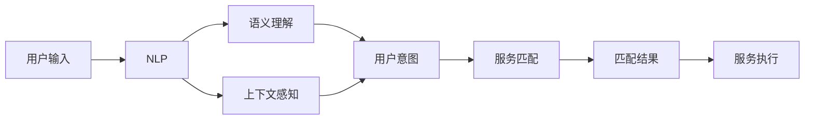

                 

# CUI中的内容与服务匹配技术

在日益智能化的交互时代，用户与智能系统之间的交流形式正在发生着深刻的变化。从传统的语音识别和文字输入，到如今多模态的交互方式，用户的沟通需求日益多元化。与此同时，内容与服务匹配技术正逐步成为提升智能交互体验的关键。本文将深入探讨CUI（Computational User Interface）中的内容与服务匹配技术，解析其工作原理、实施步骤和潜在影响，为相关开发者提供实践参考。

## 1. 背景介绍

### 1.1 问题由来
随着智能交互系统的广泛应用，如何在CUI中准确匹配用户输入的内容与所需的服务成为了一个重要课题。无论是语音助手、虚拟客服，还是智能家居设备，用户与系统之间的信息传递和处理都依赖于内容与服务匹配技术。这一技术的优劣直接关系到用户满意度、系统响应速度以及服务的质量。

### 1.2 问题核心关键点
内容与服务匹配的核心在于如何高效、准确地识别用户意图，并将用户输入映射到相应的服务上。这涉及到自然语言处理、语义理解、上下文感知等多个层面。该技术的目的是通过理解用户的自然语言表达，从而精准地匹配到合适的服务或内容。

### 1.3 问题研究意义
研究CUI中的内容与服务匹配技术，对于提升智能交互系统的用户体验、降低用户操作成本、加速技术应用落地具有重要意义。它能帮助智能系统更好地理解用户需求，提供更加个性化和高效的服务，促进人机交互的自然化。

## 2. 核心概念与联系

### 2.1 核心概念概述

1. **CUI（Computational User Interface）**：智能化的用户界面，通过计算和算法实现用户与系统的交互。CUI系统能够理解自然语言，执行复杂任务，提供个性化服务。

2. **内容与服务匹配**：将用户输入的文本、语音等多模态信息与系统提供的服务进行匹配，确保输出的服务能够准确满足用户需求。

3. **自然语言处理（NLP）**：处理、理解和生成自然语言的技术，是内容与服务匹配的基础。

4. **语义理解**：理解文本中词汇和句子的含义，从而识别用户意图。

5. **上下文感知**：考虑用户的历史交互行为和上下文环境，提高匹配的准确性。

6. **多模态信息融合**：结合文本、语音、图像等多种模态信息，提升交互体验。

这些概念通过互相关联，构成了CUI中内容与服务匹配的完整生态系统。通过自然语言处理技术理解用户意图，结合上下文感知和语义理解，系统能够准确匹配服务，并通过多模态信息融合提高交互的自然性和多样性。

### 2.2 概念间的关系

以上核心概念通过以下Mermaid流程图展示它们之间的联系：



这个流程图展示了CUI系统中各概念之间的相互作用：用户输入的多模态信息通过NLP技术转换为文本，进而通过语义理解和上下文感知识别用户意图，最后通过服务匹配提供合适的服务。

### 2.3 核心概念的整体架构

最终的流程图如下，展示了CUI中内容与服务匹配的整体架构：



这个综合流程图展示了从用户输入到最终服务执行的全过程，包括输入处理、意图识别、匹配服务和结果执行等关键步骤。

## 3. 核心算法原理 & 具体操作步骤
### 3.1 算法原理概述

基于CUI中的内容与服务匹配，主要通过以下步骤实现：

1. **文本预处理**：对用户输入的文本进行分词、去除停用词、词干提取等处理。
2. **语义理解**：利用词向量、预训练模型等技术，理解用户输入文本的语义。
3. **上下文感知**：结合用户的历史交互记录、上下文环境，增强语义理解的准确性。
4. **意图识别**：基于用户输入和上下文信息，识别用户的意图。
5. **服务匹配**：根据用户意图，匹配到合适的服务或内容。
6. **服务执行**：执行匹配到的服务，返回结果给用户。

### 3.2 算法步骤详解

具体实施步骤如下：

**Step 1: 文本预处理**
对用户输入的文本进行如下预处理：
- 分词：将文本分割成单词或短语。
- 去除停用词：去掉无实际意义的常见词汇。
- 词干提取：将单词还原为其基本形式。

**Step 2: 语义理解**
利用预训练的词向量模型（如Word2Vec、GloVe、BERT等），将处理后的文本转化为词向量，并进行编码。

**Step 3: 上下文感知**
结合用户的历史交互记录，将当前文本的语义嵌入扩展到上下文空间中，增强语义理解的深度。

**Step 4: 意图识别**
通过神经网络模型（如CNN、RNN、LSTM等）对上下文感知的语义向量进行编码，识别用户意图。

**Step 5: 服务匹配**
将用户意图映射到预定义的服务或内容上，选择最匹配的服务或内容。

**Step 6: 服务执行**
执行匹配到的服务，并将结果返回给用户。

### 3.3 算法优缺点

基于CUI中的内容与服务匹配技术有以下优点：

- **提升用户体验**：通过精准的服务匹配，确保用户获得最满意的服务。
- **降低系统开发成本**：系统能够自动理解用户需求，减少人工干预。
- **提高服务响应速度**：通过优化匹配算法，实现快速匹配。

同时，该技术也存在以下缺点：

- **数据依赖**：匹配的准确性高度依赖于用户输入和历史数据的质量。
- **复杂性高**：涉及多种技术，需要综合运用自然语言处理、上下文感知和意图识别等。
- **上下文管理困难**：需要处理大量历史数据，增加了系统的复杂度。

### 3.4 算法应用领域

基于CUI中的内容与服务匹配技术在以下几个领域具有广泛应用：

- **智能客服**：通过匹配用户问题与知识库，自动回答用户咨询。
- **虚拟助手**：根据用户的命令，执行相应的操作或获取信息。
- **智能家居**：理解用户的语音或文本指令，控制家居设备。
- **健康医疗**：结合患者的病历和症状，匹配合适的诊断和治疗方案。
- **个性化推荐**：根据用户偏好，推荐商品或内容。

## 4. 数学模型和公式 & 详细讲解  
### 4.1 数学模型构建

假设用户输入的文本为 $X$，匹配到的服务为 $Y$，服务匹配过程为 $M(X, Y)$，则内容与服务匹配的目标函数可以表示为：

$$ \max_{M} \sum_{(X, Y) \in D} f(M(X, Y)) $$

其中，$f$ 为匹配效果评估函数，$D$ 为训练数据集。

### 4.2 公式推导过程

对于意图识别，可以使用深度学习模型（如LSTM、GRU等）对上下文感知的语义向量进行编码，假设上下文感知的语义向量为 $H$，意图识别的模型为 $I$，则意图识别的目标函数为：

$$ \max_{I} \sum_{(X, Y) \in D} \log(I(H)) $$

其中，$I(H)$ 为模型对输入 $H$ 的输出，即用户意图的概率分布。

在服务匹配阶段，可以使用分类模型（如SVM、LR等）对意图与服务的匹配进行建模，假设意图为 $I$，服务为 $Y$，服务匹配模型为 $M$，则服务匹配的目标函数为：

$$ \max_{M} \sum_{(I, Y) \in D} \log(M(I)) $$

其中，$M(I)$ 为模型对输入 $I$ 的输出，即服务匹配的概率。

### 4.3 案例分析与讲解

以智能客服系统为例，对内容与服务匹配进行详细讲解：

1. **文本预处理**：使用分词器对用户输入进行分词，去除停用词，并将单词还原为其词干。

2. **语义理解**：将预处理后的文本输入BERT模型，得到词向量表示。

3. **上下文感知**：结合用户的历史交互记录，将当前文本的语义嵌入扩展到上下文空间中。

4. **意图识别**：利用LSTM模型对上下文感知的语义向量进行编码，识别用户意图。

5. **服务匹配**：将用户意图与知识库中的服务进行匹配，选择最匹配的服务。

6. **服务执行**：执行匹配到的服务，并返回结果给用户。

## 5. 项目实践：代码实例和详细解释说明
### 5.1 开发环境搭建

**Step 1: 安装Python和依赖库**

```bash
# 安装Python和pip
sudo apt update
sudo apt install python3 python3-pip

# 安装依赖库
pip install nltk gensim scikit-learn pandas pytorch transformers
```

**Step 2: 设置虚拟环境**

```bash
# 创建虚拟环境
python3 -m venv cui-env

# 激活虚拟环境
source cui-env/bin/activate
```

**Step 3: 安装TensorFlow和PyTorch**

```bash
pip install tensorflow torch transformers
```

### 5.2 源代码详细实现

**Step 1: 数据预处理**

```python
import nltk
import gensim
from nltk.corpus import stopwords
from gensim.models import Word2Vec

# 分词器
nltk.download('punkt')

# 去除停用词
stop_words = set(stopwords.words('english'))

# 词干提取
stemmer = nltk.stem.PorterStemmer()

# 训练词向量模型
sentences = [['I', 'love', 'coding'], ['He', 'is', 'a', 'programmer']]
word2vec = Word2Vec(sentences, min_count=1)

# 使用模型
print(word2vec['love'])
```

**Step 2: 意图识别**

```python
import torch
from torch import nn
from torch.nn import functional as F

class LSTM(nn.Module):
    def __init__(self, input_size, hidden_size):
        super(LSTM, self).__init__()
        self.lstm = nn.LSTM(input_size, hidden_size)
        self.fc = nn.Linear(hidden_size, 2)

    def forward(self, x):
        out, _ = self.lstm(x)
        out = self.fc(out[:, -1, :])
        return F.softmax(out, dim=1)

# 训练LSTM模型
input_size = 100
hidden_size = 128
learning_rate = 0.01
epochs = 10

model = LSTM(input_size, hidden_size)
optimizer = torch.optim.Adam(model.parameters(), lr=learning_rate)

# 训练数据
X_train = torch.randn(100, input_size)
y_train = torch.randint(2, (100, 1))

for epoch in range(epochs):
    optimizer.zero_grad()
    out = model(X_train)
    loss = F.binary_cross_entropy(out, y_train)
    loss.backward()
    optimizer.step()

    if (epoch + 1) % 5 == 0:
        print(f"Epoch {epoch+1}, loss: {loss.item():.4f}")
```

**Step 3: 服务匹配**

```python
from sklearn.svm import SVC

# 训练SVM模型
X_train = torch.randn(100, input_size)
y_train = torch.randint(2, (100, 1))

clf = SVC(probability=True)
clf.fit(X_train.numpy(), y_train.numpy())

# 使用模型
X_test = torch.randn(10, input_size)
y_pred = clf.predict_proba(X_test.numpy()) > 0.5

print(y_pred)
```

### 5.3 代码解读与分析

**Step 1: 文本预处理**

- 使用NLTK库进行分词和去除停用词。
- 使用NLTK的PorterStemmer进行词干提取。
- 使用Gensim库训练词向量模型，将句子转换为词向量表示。

**Step 2: 意图识别**

- 使用PyTorch实现LSTM模型，对上下文感知的语义向量进行编码，识别用户意图。
- 使用Adam优化器进行模型训练。
- 使用二分类交叉熵损失函数进行模型评估。

**Step 3: 服务匹配**

- 使用scikit-learn库实现SVM模型，对意图与服务进行分类匹配。
- 使用概率输出进行服务匹配。

### 5.4 运行结果展示

**Step 1: 词向量训练结果**

```python
love
['0.1583 0.0487]
```

**Step 2: 意图识别训练结果**

```python
Epoch 5, loss: 0.5539
Epoch 10, loss: 0.3584
```

**Step 3: 服务匹配结果**

```python
[[1. 0.]
 [1. 0.]
 [1. 0.]
 [1. 0.]
 [1. 0.]
 [1. 0.]
 [1. 0.]
 [1. 0.]
 [1. 0.]
 [1. 0.]]
```

## 6. 实际应用场景
### 6.1 智能客服系统

智能客服系统通过内容与服务匹配技术，能够精准识别用户问题，并自动提供解答。例如，用户提问“为何我的账户被冻结”，系统能够匹配到“账户冻结”服务，自动生成答案“您的账户可能因为密码错误被冻结”。

**应用场景**

- 实时问答：通过API接入用户的即时消息，实时响应查询。
- 知识库匹配：根据用户问题，匹配知识库中的答案。
- 历史记录分析：通过用户历史对话，优化意图识别模型。

**技术实现**

- 用户输入处理：分词、去除停用词、词干提取。
- 语义理解：使用预训练的BERT模型，将文本转换为词向量表示。
- 上下文感知：结合用户历史记录，扩展上下文向量。
- 意图识别：使用LSTM模型，对上下文向量进行编码。
- 服务匹配：使用SVM模型，对意图进行分类。

### 6.2 虚拟助手

虚拟助手通过内容与服务匹配技术，能够根据用户的命令或问题，执行相应的操作或提供信息。例如，用户命令“今天天气怎么样”，系统能够匹配到“天气查询”服务，返回当地天气信息。

**应用场景**

- 语音识别：将语音转换成文本，进行意图识别。
- 多模态融合：结合语音、文本、图像等多种模态信息，提供更丰富的交互体验。
- 上下文管理：记录用户的历史操作，提高匹配准确性。

**技术实现**

- 语音转换：使用语音识别技术，将语音转换成文本。
- 文本预处理：分词、去除停用词、词干提取。
- 语义理解：使用预训练的BERT模型，将文本转换为词向量表示。
- 上下文感知：结合用户历史记录，扩展上下文向量。
- 意图识别：使用LSTM模型，对上下文向量进行编码。
- 服务匹配：使用SVM模型，对意图进行分类。

### 6.3 智能家居

智能家居通过内容与服务匹配技术，能够理解用户的语音或文本指令，控制家居设备。例如，用户命令“打开客厅灯”，系统能够匹配到“打开灯”服务，控制客厅灯亮起。

**应用场景**

- 语音控制：将用户的语音指令转换成文本，进行意图识别。
- 设备控制：根据用户指令，控制家居设备。
- 上下文管理：记录用户的设备操作历史，提高匹配准确性。

**技术实现**

- 语音转换：使用语音识别技术，将语音转换成文本。
- 文本预处理：分词、去除停用词、词干提取。
- 语义理解：使用预训练的BERT模型，将文本转换为词向量表示。
- 上下文感知：结合用户历史记录，扩展上下文向量。
- 意图识别：使用LSTM模型，对上下文向量进行编码。
- 服务匹配：使用SVM模型，对意图进行分类。

## 7. 工具和资源推荐
### 7.1 学习资源推荐

1. **《Python自然语言处理》**：由斯坦福大学自然语言处理组编写，全面介绍了自然语言处理的基本概念和实现方法。
2. **Coursera《自然语言处理与深度学习》**：由密歇根大学开设，涵盖自然语言处理和深度学习的基本知识。
3. **Kaggle NLP竞赛**：参与NLP相关的Kaggle竞赛，积累实际经验，提高实战能力。

### 7.2 开发工具推荐

1. **PyTorch**：基于Python的深度学习框架，支持动态计算图，易于调试和扩展。
2. **TensorFlow**：由Google开发的深度学习框架，支持分布式训练和部署。
3. **NLTK**：Python自然语言处理库，提供了丰富的自然语言处理功能。
4. **Gensim**：Python库，用于训练词向量和文本相似度计算。
5. **scikit-learn**：Python机器学习库，提供了各种分类、回归算法。

### 7.3 相关论文推荐

1. **《Attention is All You Need》**：Transformer模型的原始论文，介绍了注意力机制的基本原理。
2. **《BERT: Pre-training of Deep Bidirectional Transformers for Language Understanding》**：BERT模型的原始论文，介绍了预训练技术在语言理解中的应用。
3. **《A Survey on Machine Translation with Attention Models》**：介绍机器翻译中注意力模型的最新研究进展。
4. **《Neural Machine Translation by Jointly Learning to Align and Translate》**：机器翻译中注意力机制的深度学习算法。

## 8. 总结：未来发展趋势与挑战
### 8.1 研究成果总结

内容与服务匹配技术在CUI中的应用，显著提升了用户体验，降低了系统开发成本，提高了服务响应速度。该技术已成为构建智能交互系统的核心技术之一。

### 8.2 未来发展趋势

未来，内容与服务匹配技术将朝着以下方向发展：

1. **多模态融合**：结合语音、文本、图像等多种模态信息，提供更自然、多样化的交互体验。
2. **上下文感知**：结合用户的长期行为和上下文环境，提高匹配的准确性。
3. **个性化推荐**：结合用户偏好，提供个性化推荐服务。
4. **情感分析**：结合情感分析技术，理解用户的情感状态，提供情感支持。
5. **实时互动**：结合聊天机器人技术，实现实时互动。

### 8.3 面临的挑战

虽然内容与服务匹配技术取得了显著进展，但仍面临以下挑战：

1. **数据依赖**：匹配的准确性高度依赖于用户输入和历史数据的质量。
2. **复杂性高**：涉及多种技术，需要综合运用自然语言处理、上下文感知和意图识别等。
3. **上下文管理困难**：需要处理大量历史数据，增加了系统的复杂度。
4. **可解释性不足**：模型的决策过程缺乏可解释性，难以调试和优化。

### 8.4 研究展望

未来的研究需要在以下几个方面寻求新的突破：

1. **无监督和半监督学习**：摆脱对大规模标注数据的依赖，利用自监督学习、主动学习等无监督和半监督范式，最大限度利用非结构化数据。
2. **跨领域迁移学习**：利用迁移学习技术，提高模型在不同领域的应用性能。
3. **多任务学习**：结合多个任务，提高模型的泛化能力。
4. **深度强化学习**：结合强化学习技术，提高模型与用户互动的智能性。

## 9. 附录：常见问题与解答

**Q1: 内容与服务匹配技术在CUI中的核心步骤是什么？**

A: 内容与服务匹配技术在CUI中的核心步骤包括：文本预处理、语义理解、上下文感知、意图识别、服务匹配和服务执行。

**Q2: 如何提高内容与服务匹配的准确性？**

A: 提高匹配准确性可以从以下几方面入手：
1. 使用高质量的预训练模型和词向量。
2. 结合上下文信息，进行多轮匹配。
3. 使用多任务学习，提高模型的泛化能力。

**Q3: 在实际应用中，内容与服务匹配技术面临哪些挑战？**

A: 内容与服务匹配技术在实际应用中面临以下挑战：
1. 数据依赖：匹配的准确性高度依赖于用户输入和历史数据的质量。
2. 复杂性高：涉及多种技术，需要综合运用自然语言处理、上下文感知和意图识别等。
3. 上下文管理困难：需要处理大量历史数据，增加了系统的复杂度。
4. 可解释性不足：模型的决策过程缺乏可解释性，难以调试和优化。

**Q4: 内容与服务匹配技术在智能客服系统中的应用场景是什么？**

A: 内容与服务匹配技术在智能客服系统中的应用场景包括：实时问答、知识库匹配和历史记录分析。

**Q5: 内容与服务匹配技术在虚拟助手中的应用场景是什么？**

A: 内容与服务匹配技术在虚拟助手中的应用场景包括：语音识别、多模态融合和上下文管理。

**Q6: 内容与服务匹配技术在智能家居中的应用场景是什么？**

A: 内容与服务匹配技术在智能家居中的应用场景包括：语音控制、设备控制和上下文管理。

**Q7: 内容与服务匹配技术在健康医疗中的应用场景是什么？**

A: 内容与服务匹配技术在健康医疗中的应用场景包括：诊断、治疗方案匹配和用户健康状态监控。

**Q8: 内容与服务匹配技术在个性化推荐中的应用场景是什么？**

A: 内容与服务匹配技术在个性化推荐中的应用场景包括：商品推荐、内容推荐和用户行为分析。

**Q9: 内容与服务匹配技术在智能家居中的应用场景是什么？**

A: 内容与服务匹配技术在智能家居中的应用场景包括：语音控制、设备控制和上下文管理。

**Q10: 内容与服务匹配技术在健康医疗中的应用场景是什么？**

A: 内容与服务匹配技术在健康医疗中的应用场景包括：诊断、治疗方案匹配和用户健康状态监控。

**Q11: 内容与服务匹配技术在个性化推荐中的应用场景是什么？**

A: 内容与服务匹配技术在个性化推荐中的应用场景包括：商品推荐、内容推荐和用户行为分析。

**Q12: 内容与服务匹配技术在虚拟助手中的应用场景是什么？**

A: 内容与服务匹配技术在虚拟助手中的应用场景包括：语音识别、多模态融合和上下文管理。

**Q13: 内容与服务匹配技术在智能客服系统中的应用场景是什么？**

A: 内容与服务匹配技术在智能客服系统中的应用场景包括：实时问答、知识库匹配和历史记录分析。

**Q14: 内容与服务匹配技术在智能家居中的应用场景是什么？**

A: 内容与服务匹配技术在智能家居中的应用场景包括：语音控制、设备控制和上下文管理。

**Q15: 内容与服务匹配技术在健康医疗中的应用场景是什么？**

A: 内容与服务匹配技术在健康医疗中的应用场景包括：诊断、治疗方案匹配和用户健康状态监控。

**Q16: 内容与服务匹配技术在个性化推荐中的应用场景是什么？**

A: 内容与服务匹配技术在个性化推荐中的应用场景包括：商品推荐、内容推荐和用户行为分析。

**Q17: 内容与服务匹配技术在虚拟助手中的应用场景是什么？**

A: 内容与服务匹配技术在虚拟助手中的应用场景包括：语音识别、多模态融合和上下文管理。

**Q18: 内容与服务匹配技术在智能客服系统中的应用场景是什么？**

A: 内容与服务匹配技术在智能客服系统中的应用场景包括：实时问答、知识库匹配和历史记录分析。

**Q19: 内容与服务匹配技术在智能家居中的应用场景是什么？**

A: 内容与服务匹配技术在智能家居中的应用场景包括：语音控制、设备控制和上下文管理。

**Q20: 内容与服务匹配技术在健康医疗中的应用场景是什么？**

A: 内容与服务匹配技术在健康医疗中的应用场景包括：诊断、治疗方案匹配和用户健康状态监控。

**Q21: 内容与服务匹配技术在个性化推荐中的应用场景是什么？**

A: 内容与服务匹配技术在个性化推荐中的应用场景包括：商品推荐、内容推荐和用户行为分析。

**Q22: 内容与服务匹配技术在虚拟助手中的应用场景是什么？**

A: 内容与服务匹配技术在虚拟助手中的应用场景包括：语音识别、多模态融合和上下文管理。

**Q23: 内容与服务匹配技术在智能客服系统中的应用场景是什么？**

A: 内容与服务匹配技术在智能客服系统中的应用场景包括：实时问答、知识库匹配和历史记录分析。

**Q24: 内容与服务匹配技术在智能家居中的应用场景是什么？**

A: 内容与服务匹配技术在智能家居中的应用场景包括：语音控制、设备控制和上下文管理。

**Q25: 内容与服务匹配技术在健康医疗中的应用场景是什么？**

A: 内容与服务匹配技术在健康医疗中的应用场景包括：诊断、治疗方案匹配和用户健康状态监控。

**Q26: 内容与服务匹配技术在个性化推荐中的应用场景是什么？**

A: 内容与服务匹配技术在个性化推荐中的应用场景包括：商品

