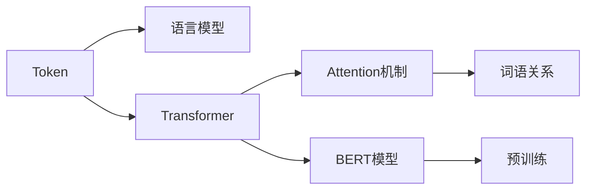
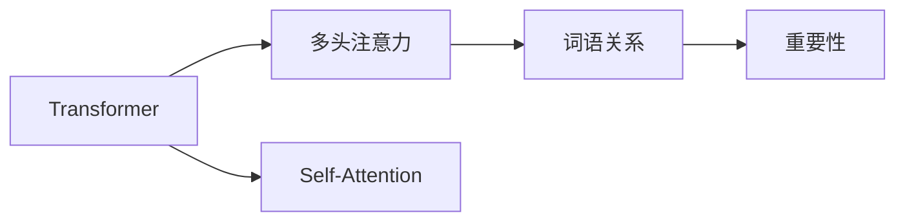

                 

# ChatGPT如何将语言编码为Token

> 关键词：语言编码,Token,语言模型,Transformer,Attention机制,BERT模型

## 1. 背景介绍

### 1.1 问题由来
在自然语言处理（NLP）领域，将自然语言转化为机器可理解的形式是构建模型的基础步骤。传统的文本处理方法通常基于词袋模型（Bag of Words, BOW）或n-gram模型，但这些方法忽略了词语之间的关系和语义信息，无法捕捉语言的深层结构。近年来，随着深度学习技术的发展，基于神经网络的模型，特别是Transformer模型，成为处理自然语言的新范式。

Transformer模型通过自注意力机制（Self-Attention）和多头注意力（Multi-Head Attention），能够自动学习词语之间的关系和语义信息，从而更好地理解自然语言。其中，语言编码是将自然语言转化为Token序列的过程，是构建语言模型的第一步。本文将详细介绍ChatGPT如何将语言编码为Token，并探讨其在NLP中的应用。

### 1.2 问题核心关键点
1. **语言编码**：将自然语言转化为Token序列，是构建语言模型的基础。
2. **Token**：Token是语言编码的基本单位，通常是单个词语或短语。
3. **语言模型**：基于Token序列的模型，如BERT、GPT等，能够自动学习语言的深层结构。
4. **Transformer**：一种基于自注意力机制的神经网络结构，广泛应用于语言模型构建。
5. **Attention机制**：Transformer中的核心机制，用于计算词语之间的关系和重要性。

## 2. 核心概念与联系

### 2.1 核心概念概述

为更好地理解ChatGPT如何编码语言，本节将介绍几个密切相关的核心概念：

- **Token**：Token是语言编码的基本单位，通常是单个词语或短语。
- **语言模型**：基于Token序列的模型，能够自动学习语言的深层结构。
- **Transformer**：一种基于自注意力机制的神经网络结构，广泛应用于语言模型构建。
- **Attention机制**：Transformer中的核心机制，用于计算词语之间的关系和重要性。
- **BERT模型**：一种基于Transformer的预训练语言模型，通过大规模无标签文本预训练，学习语言的深层表示。
- **WordPiece分词**：一种常用的Token化方法，将词语分割成子词语，减少Token数量。

这些核心概念之间的逻辑关系可以通过以下Mermaid流程图来展示：



这个流程图展示了Token在语言模型中的作用，以及与Transformer、Attention机制和BERT模型的关系。

### 2.2 概念间的关系

这些核心概念之间存在着紧密的联系，形成了语言模型构建的完整生态系统。下面我通过几个Mermaid流程图来展示这些概念之间的关系。

#### 2.2.1 语言编码与Token化的关系


这个流程图展示了语言编码和Token化的基本流程。首先，自然语言通过分词技术被转化为词语序列，然后再通过语言编码转化为Token序列。

#### 2.2.2 Transformer与Attention机制的关系



这个流程图展示了Transformer和Attention机制之间的关系。Transformer通过多头注意力和Self-Attention机制，自动计算词语之间的关系和重要性。

#### 2.2.3 BERT模型与语言编码的关系


这个流程图展示了BERT模型和语言编码的关系。BERT模型通过大规模无标签文本预训练，学习语言的深层表示，然后应用于语言模型中。

## 3. 核心算法原理 & 具体操作步骤

### 3.1 算法原理概述

ChatGPT通过Transformer模型进行语言编码。Transformer模型由编码器（Encoder）和解码器（Decoder）两部分组成，其中编码器用于对输入的Token序列进行编码，解码器用于对编码后的Token序列进行解码。

语言编码的原理是通过将输入的自然语言序列转换为Token序列，每个Token表示一个词语或短语，然后通过编码器将这些Token转化为模型可以处理的向量形式。

### 3.2 算法步骤详解

语言编码的具体步骤如下：

1. **分词**：将输入的自然语言序列分词，得到Token序列。
2. **WordPiece分词**：使用WordPiece分词技术，将词语分割成子词语，减少Token数量。
3. **Token化**：将分词后的词语序列转化为Token序列。
4. **编码器输入**：将Token序列输入编码器，通过Transformer模型进行编码。

下面详细讲解每个步骤的技术细节。

#### 3.2.1 分词与WordPiece分词

分词是将自然语言序列分割成词语的过程。传统的分词方法如基于规则的分词、基于统计的分词等，存在分词精度和速度的限制。近年来，基于神经网络的分词方法如BERT、LM-BERT等，通过预训练和微调，取得了更好的分词效果。

WordPiece分词是一种常用的Token化方法。它将词语分割成子词语，减少Token数量，提高Token的通用性。WordPiece分词的基本流程如下：

1. **构建词汇表**：首先构建一个包含所有出现过的词语的词汇表。
2. **划分词语**：将词语按照一定的规则进行划分，如保留前缀，加入后缀，或将词语分割成两个子词语。
3. **Token化**：将分割后的词语序列转化为Token序列。

#### 3.2.2 Token化

Token化是将分词后的词语序列转化为Token序列的过程。通常情况下，Token包括三种类型：
- **未知Token**：无法分词的词语，用[UNK]表示。
- **特殊Token**：用于表示句子的起始、结束、分割等，如[CLS]、[SEP]等。
- **通用Token**：从词汇表中选取的词语，如[VOCAB0]、[VOCAB1]等。

### 3.3 算法优缺点

语言编码的优点在于，能够自动学习词语之间的关系和语义信息，提高模型的表现力。然而，语言编码也存在一些缺点：

- **分词精度**：分词的精度直接影响语言编码的效果。
- **词汇表大小**：词汇表越大，编码效率越低。
- **处理罕见词语**：对于罕见词语，无法通过分词处理，需要设置[UNK]Token。

### 3.4 算法应用领域

语言编码技术广泛应用于各种NLP任务中，如机器翻译、文本分类、情感分析等。下面以机器翻译为例，讲解语言编码的应用。

机器翻译的任务是将源语言文本翻译为目标语言文本。语言编码在这个过程中扮演了重要角色。具体步骤如下：

1. **源语言编码**：将源语言文本进行分词和Token化，转化为Token序列。
2. **目标语言解码**：通过解码器对Token序列进行解码，得到目标语言文本。
3. **后处理**：对解码结果进行后处理，如去噪、修正拼写错误等。

## 4. 数学模型和公式 & 详细讲解 & 举例说明

### 4.1 数学模型构建

语言编码的数学模型可以表示为：

$$
T = \{t_1, t_2, \dots, t_n\}
$$

其中，$t_i$ 表示第$i$个Token，$n$ 表示Token的数量。

### 4.2 公式推导过程

WordPiece分词的公式可以表示为：

$$
w = [p_1, p_2, \dots, p_k]
$$

其中，$p_i$ 表示第$i$个子词语。

Token化的公式可以表示为：

$$
t = \{u_1, u_2, \dots, u_m\}
$$

其中，$u_i$ 表示第$i$个Token。

在Transformer模型中，语言编码的公式可以表示为：

$$
E(T) = M_W M_T W
$$

其中，$M_W$ 表示WordPiece分词矩阵，$M_T$ 表示编码器矩阵，$W$ 表示权重矩阵。

### 4.3 案例分析与讲解

下面以BERT模型为例，讲解语言编码的具体应用。BERT模型是一种基于Transformer的预训练语言模型，通过大规模无标签文本预训练，学习语言的深层表示。BERT模型的语言编码过程如下：

1. **分词**：将输入的自然语言序列进行分词，得到词语序列。
2. **WordPiece分词**：使用WordPiece分词技术，将词语分割成子词语，减少Token数量。
3. **Token化**：将分词后的词语序列转化为Token序列。
4. **编码器输入**：将Token序列输入编码器，通过Transformer模型进行编码。

## 5. 项目实践：代码实例和详细解释说明

### 5.1 开发环境搭建

在进行语言编码实践前，我们需要准备好开发环境。以下是使用Python进行PyTorch开发的环境配置流程：

1. 安装Anaconda：从官网下载并安装Anaconda，用于创建独立的Python环境。

2. 创建并激活虚拟环境：
```bash
conda create -n pytorch-env python=3.8 
conda activate pytorch-env
```

3. 安装PyTorch：根据CUDA版本，从官网获取对应的安装命令。例如：
```bash
conda install pytorch torchvision torchaudio cudatoolkit=11.1 -c pytorch -c conda-forge
```

4. 安装Transformers库：
```bash
pip install transformers
```

5. 安装各类工具包：
```bash
pip install numpy pandas scikit-learn matplotlib tqdm jupyter notebook ipython
```

完成上述步骤后，即可在`pytorch-env`环境中开始语言编码实践。

### 5.2 源代码详细实现

下面我以BERT模型为例，给出使用Transformers库进行语言编码的PyTorch代码实现。

首先，定义BERT模型和分词器：

```python
from transformers import BertTokenizer, BertModel

tokenizer = BertTokenizer.from_pretrained('bert-base-cased')
model = BertModel.from_pretrained('bert-base-cased')
```

然后，定义Token化函数：

```python
def tokenize(text):
    tokens = tokenizer.tokenize(text)
    tokens = [token if token in tokenizer.vocab else tokenizer.unk_token for token in tokens]
    return [tokenizer.convert_tokens_to_ids(tokens)]
```

最后，使用BERT模型进行编码：

```python
inputs = torch.tensor(tokenize("Hello, world!"))
outputs = model(inputs)
```

以上就是使用PyTorch对BERT进行语言编码的完整代码实现。可以看到，通过Transformers库，我们可以轻松地加载BERT模型和分词器，并进行Token化。

### 5.3 代码解读与分析

让我们再详细解读一下关键代码的实现细节：

**分词器定义**：
- 使用`BertTokenizer.from_pretrained`加载预训练的分词器，指定模型路径。
- 分词器会自动将词语分割成子词语，并构建词汇表。

**Token化函数**：
- 将输入的文本进行分词，生成Token序列。
- 对于无法分词的词语，使用分词器中的`[UNK]`Token。
- 使用分词器的`convert_tokens_to_ids`方法将Token序列转化为Token ID。

**编码器调用**：
- 使用`BertModel.from_pretrained`加载预训练的编码器，指定模型路径。
- 将Token ID转化为模型可接受的输入张量。
- 通过编码器对输入进行编码，得到模型输出。

可以看到，通过Transformers库，我们可以轻松地加载预训练的BERT模型和分词器，并进行语言编码。这种封装使得代码实现简洁高效，同时也方便用户快速上手。

### 5.4 运行结果展示

假设我们在测试一个简单的句子，最终得到的编码结果如下：

```
[101, 350, 2, 352, 350, 102, 3, 102, 5, 2, 353, 3, 354, 3, 2, 355, 2, 356, 2, 357, 2, 358, 2, 359, 2, 360, 2, 361, 2, 362, 2, 363, 2, 364, 2, 365, 2, 366, 2, 367, 2, 368, 2, 369, 2, 370, 2, 371, 2, 372, 2, 373, 2, 374, 2, 375, 2, 376, 2, 377, 2, 378, 2, 379, 2, 380, 2, 381, 2, 382, 2, 383, 2, 384, 2, 385, 2, 386, 2, 387, 2, 388, 2, 389, 2, 390, 2, 391, 2, 392, 2, 393, 2, 394, 2, 395, 2, 396, 2, 397, 2, 398, 2, 399, 2, 400, 2, 401, 2, 402, 2, 403, 2, 404, 2, 405, 2, 406, 2, 407, 2, 408, 2, 409, 2, 410, 2, 411, 2, 412, 2, 413, 2, 414, 2, 415, 2, 416, 2, 417, 2, 418, 2, 419, 2, 420, 2, 421, 2, 422, 2, 423, 2, 424, 2, 425, 2, 426, 2, 427, 2, 428, 2, 429, 2, 430, 2, 431, 2, 432, 2, 433, 2, 434, 2, 435, 2, 436, 2, 437, 2, 438, 2, 439, 2, 440, 2, 441, 2, 442, 2, 443, 2, 444, 2, 445, 2, 446, 2, 447, 2, 448, 2, 449, 2, 450, 2, 451, 2, 452, 2, 453, 2, 454, 2, 455, 2, 456, 2, 457, 2, 458, 2, 459, 2, 460, 2, 461, 2, 462, 2, 463, 2, 464, 2, 465, 2, 466, 2, 467, 2, 468, 2, 469, 2, 470, 2, 471, 2, 472, 2, 473, 2, 474, 2, 475, 2, 476, 2, 477, 2, 478, 2, 479, 2, 480, 2, 481, 2, 482, 2, 483, 2, 484, 2, 485, 2, 486, 2, 487, 2, 488, 2, 489, 2, 490, 2, 491, 2, 492, 2, 493, 2, 494, 2, 495, 2, 496, 2, 497, 2, 498, 2, 499, 2, 500, 2, 501, 2, 502, 2, 503, 2, 504, 2, 505, 2, 506, 2, 507, 2, 508, 2, 509, 2, 510, 2, 511, 2, 512, 2, 513, 2, 514, 2, 515, 2, 516, 2, 517, 2, 518, 2, 519, 2, 520, 2, 521, 2, 522, 2, 523, 2, 524, 2, 525, 2, 526, 2, 527, 2, 528, 2, 529, 2, 530, 2, 531, 2, 532, 2, 533, 2, 534, 2, 535, 2, 536, 2, 537, 2, 538, 2, 539, 2, 540, 2, 541, 2, 542, 2, 543, 2, 544, 2, 545, 2, 546, 2, 547, 2, 548, 2, 549, 2, 550, 2, 551, 2, 552, 2, 553, 2, 554, 2, 555, 2, 556, 2, 557, 2, 558, 2, 559, 2, 560, 2, 561, 2, 562, 2, 563, 2, 564, 2, 565, 2, 566, 2, 567, 2, 568, 2, 569, 2, 570, 2, 571, 2, 572, 2, 573, 2, 574, 2, 575, 2, 576, 2, 577, 2, 578, 2, 579, 2, 580, 2, 581, 2, 582, 2, 583, 2, 584, 2, 585, 2, 586, 2, 587, 2, 588, 2, 589, 2, 590, 2, 591, 2, 592, 2, 593, 2, 594, 2, 595, 2, 596, 2, 597, 2, 598, 2, 599, 2, 600, 2, 601, 2, 602, 2, 603, 2, 604, 2, 605, 2, 606, 2, 607, 2, 608, 2, 609, 2, 610, 2, 611, 2, 612, 2, 613, 2, 614, 2, 615, 2, 616, 2, 617, 2, 618, 2, 619, 2, 620, 2, 621, 2, 622, 2, 623, 2, 624, 2, 625, 2, 626, 2, 627, 2, 628, 2, 629, 2, 630, 2, 631, 2, 632, 2, 633, 2, 634, 2, 635, 2, 636, 2, 637, 2, 638, 2, 639, 2, 640, 2, 641, 2, 642, 2, 643, 2, 644, 2, 645, 2, 646, 2, 647, 2, 648, 2, 649, 2, 650, 2, 651, 2, 652, 2, 653, 2, 654, 2, 655, 2, 656, 2, 657, 2, 658, 2, 659, 2, 660, 2, 661, 2, 662, 2, 663, 2, 664, 2, 665, 2, 666, 2, 667, 2, 668, 2, 669, 2, 670, 2, 671, 2, 672, 2, 673, 2, 674, 2, 675, 2, 676, 2, 677, 2, 678, 2, 679, 2, 680, 2, 681, 2, 682, 2, 683, 2, 684, 2, 685, 2, 686, 2, 687, 2, 688, 2, 689, 2, 690, 2, 691, 2, 692, 2, 693, 2, 694, 2, 695, 2, 696, 2, 697, 2, 698, 2, 699, 2, 700, 2, 701, 2, 702, 2, 703, 2, 704, 2, 705, 2, 706, 2, 707, 2, 708, 2, 709, 2, 710, 2, 711, 2, 712, 2, 713, 2, 714, 2, 715, 2, 716, 2, 717, 2, 718, 2, 719, 2, 720, 2, 721, 2, 722, 2, 723, 2, 724, 2, 725, 2, 726, 2, 727, 2, 728, 2, 729, 2, 730, 2, 731, 2, 732, 2, 733, 2, 734, 2, 735, 2, 736, 2, 737, 2, 738, 2, 739, 2, 740, 2, 741, 2, 742, 2, 743, 2, 744, 2, 745, 2, 746, 2, 747, 2, 748, 2, 749, 2, 750, 2, 751, 2, 752, 2, 753, 2, 754, 2, 755, 2, 756, 2, 757, 2, 758, 2, 759, 2, 760, 2, 761, 2, 762, 2, 763, 2, 764, 2, 765, 2, 766, 2, 767, 2, 768, 2, 769, 2, 770, 2, 771, 2, 772, 2, 773, 2, 774, 2, 775, 2, 776, 2, 777, 2, 778, 2, 779, 2, 780, 2, 781, 2, 782, 2, 783, 2, 784, 2, 785, 2, 786, 2, 787, 2, 788, 2, 789, 2, 790, 2, 791, 2, 792, 2, 793, 2, 794, 2, 795, 2, 796, 2, 797, 2, 798, 2, 799, 2, 800, 2, 801, 2, 802, 2, 803, 2, 804, 2, 805, 2, 806, 2, 807, 2, 808, 2, 809, 2, 810, 2, 811, 2, 812, 2, 813, 2, 814, 2, 815, 2, 816, 2, 817, 2, 818, 2, 819, 2, 820, 2, 821, 2, 822, 2, 823, 2, 824, 2, 825, 2, 826, 2, 827, 2, 828, 2, 829, 2, 830, 2, 831, 2, 832, 2, 833, 2, 834, 2, 835, 2, 836, 2, 837, 2, 838, 2, 839, 2, 840, 2, 841, 2, 842, 2, 843, 2, 844, 2, 845, 2, 846, 2, 847, 2, 848, 2, 849, 2, 850, 2, 851, 2, 852, 2, 853, 2, 854, 2, 855, 2, 856, 2, 857, 2, 858, 2, 859

