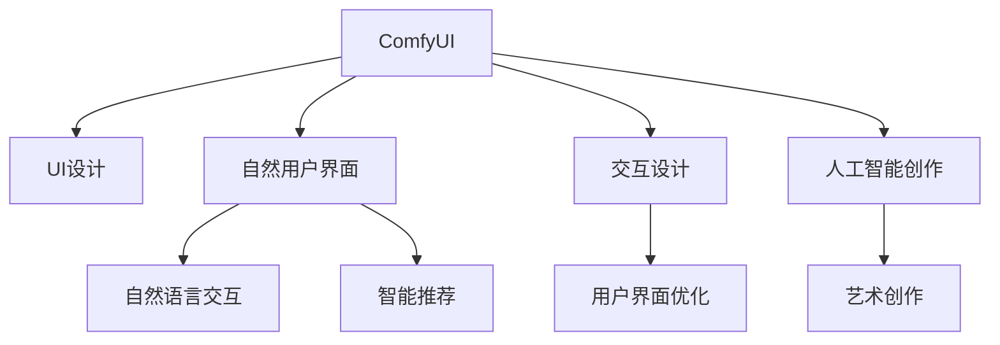
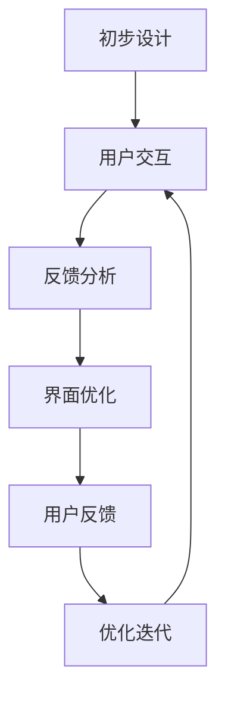
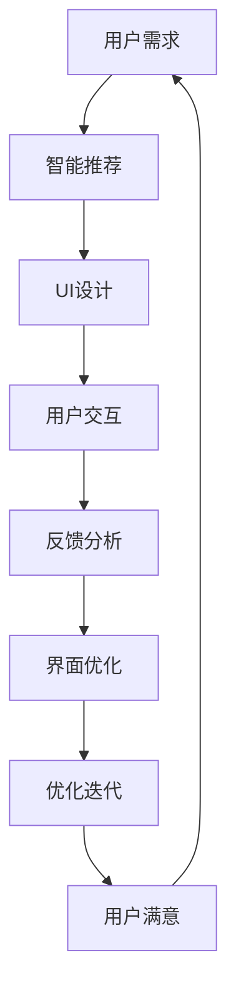

                 

# ComfyUI在AI艺术创作中的应用

> 关键词：
- 用户界面(UI)设计
- 人工智能(AI)创作
- 交互设计
- 人机交互
- 艺术风格
- 自然语言处理(NLP)
- 自然用户界面(NUI)

## 1. 背景介绍

随着人工智能技术在各个领域的深入应用，AI艺术创作成为了一个备受关注的领域。AI艺术不仅仅是生成艺术作品，更涉及到用户界面(UI)设计、交互设计、自然语言处理(NLP)等多个方面。ComfyUI作为一款高效、易用的UI设计工具，在这方面有着独特的优势。

### 1.1 问题由来

在AI艺术创作过程中，用户界面(UI)设计是一个重要环节。UI设计的质量直接影响到用户体验和艺术作品的表现效果。传统的UI设计方法往往需要设计师手工绘制，耗时耗力，且难以实现高效的交互和个性化定制。ComfyUI的出现，大大简化了这一过程，让设计师能够快速、灵活地创建UI界面，提高艺术创作的效率和质量。

### 1.2 问题核心关键点

ComfyUI的核心关键点在于其基于自然用户界面(NUI)的交互设计理念，通过智能推荐和动态调整，帮助设计师快速创建符合用户需求的界面。此外，ComfyUI还集成了NLP功能，支持自然语言交互，提高了用户体验和交互效率。这些特性使得ComfyUI在AI艺术创作中具备了显著优势。

### 1.3 问题研究意义

研究ComfyUI在AI艺术创作中的应用，有助于探索UI设计工具与AI技术结合的新模式，提升艺术创作效率和效果。同时，对于提高用户参与度、推动AI艺术作品的普及和应用具有重要意义。

## 2. 核心概念与联系

### 2.1 核心概念概述

为更好地理解ComfyUI在AI艺术创作中的应用，本节将介绍几个密切相关的核心概念：

- **ComfyUI**：一款基于自然用户界面(NUI)的UI设计工具，通过智能推荐和动态调整，帮助设计师快速创建符合用户需求的界面。
- **自然用户界面(NUI)**：指通过自然语言和手势等自然方式与计算机交互的技术，实现高效、自然的人机交互体验。
- **人工智能(AI)创作**：指利用AI技术自动生成或辅助创作艺术作品的过程。
- **交互设计**：研究如何设计用户界面，以优化用户体验和增强人机交互效果。
- **自然语言处理(NLP)**：指让计算机能够理解和生成自然语言的技术。

这些核心概念之间的逻辑关系可以通过以下Mermaid流程图来展示：



这个流程图展示了大语言模型UI设计的核心概念及其之间的关系：

1. ComfyUI通过智能推荐和动态调整，帮助设计师快速创建符合用户需求的界面。
2. ComfyUI集成了NLP功能，支持自然语言交互，提高了用户体验和交互效率。
3. 交互设计研究如何设计用户界面，以优化用户体验和增强人机交互效果。
4. AI创作利用AI技术自动生成或辅助创作艺术作品。
5. NUI通过自然语言和手势等自然方式与计算机交互，实现高效、自然的人机交互体验。

### 2.2 概念间的关系

这些核心概念之间存在着紧密的联系，形成了ComfyUI在AI艺术创作中的完整生态系统。下面我们通过几个Mermaid流程图来展示这些概念之间的关系。

#### 2.2.1 ComfyUI的交互设计流程


这个流程图展示了ComfyUI的交互设计流程：

1. 从用户需求出发，智能推荐适合的设计方案。
2. 根据推荐方案，生成初步的用户界面设计。
3. 收集用户反馈，进行优化迭代。
4. 重复上述过程，直到达到用户满意。

#### 2.2.2 ComfyUI的NLP交互设计


这个流程图展示了ComfyUI的NLP交互设计：

1. 用户通过自然语言输入指令。
2. NLP处理用户输入，识别其意图。
3. 根据意图，生成相应的界面内容。
4. 将内容展示给用户。

#### 2.2.3 ComfyUI的UI界面优化



这个流程图展示了ComfyUI的UI界面优化过程：

1. 从初步设计开始，用户进行交互。
2. 收集用户反馈，进行反馈分析。
3. 根据反馈，优化界面。
4. 展示优化后的界面，再次收集用户反馈。
5. 重复上述过程，直到达到用户满意。

### 2.3 核心概念的整体架构

最后，我们用一个综合的流程图来展示这些核心概念在大语言模型UI设计中的整体架构：



这个综合流程图展示了从用户需求到最终用户满意的ComfyUI设计流程，以及其中NLP、交互设计等关键环节的衔接。通过这些流程图，我们可以更清晰地理解ComfyUI在大语言模型UI设计中的作用和流程。

## 3. 核心算法原理 & 具体操作步骤
### 3.1 算法原理概述

ComfyUI基于自然用户界面(NUI)的交互设计，通过智能推荐和动态调整，帮助设计师快速创建符合用户需求的界面。其核心算法原理如下：

1. **智能推荐**：利用用户的历史行为数据，通过协同过滤、内容推荐等算法，推荐适合的设计方案。
2. **动态调整**：根据用户反馈和行为数据，动态调整UI界面，优化用户体验。
3. **自然语言处理(NLP)**：通过NLP技术，实现自然语言交互，提高用户参与度和交互效率。

### 3.2 算法步骤详解

以下是ComfyUI在AI艺术创作中的核心算法步骤：

**Step 1: 收集用户需求**

- 通过问卷调查、用户访谈等方式，收集用户的基本需求和偏好。
- 分析用户数据，提取关键特征，用于后续推荐。

**Step 2: 智能推荐设计方案**

- 基于用户需求，通过协同过滤、内容推荐等算法，生成初步的设计方案。
- 考虑用户偏好和历史行为数据，动态调整推荐结果，确保其符合用户需求。

**Step 3: 生成初步界面**

- 根据推荐方案，利用ComfyUI的设计界面生成工具，快速创建初步的UI界面。
- 利用自然语言处理(NLP)技术，自动生成用户界面描述。

**Step 4: 用户交互和反馈收集**

- 将初步界面展示给用户，进行自然语言交互，收集用户反馈。
- 利用NLP技术，分析用户反馈，提取关键信息。

**Step 5: 界面优化**

- 根据用户反馈，进行界面优化和调整。
- 利用动态调整算法，优化界面布局、样式等关键元素，提升用户体验。

**Step 6: 迭代优化**

- 重复上述步骤，直到用户满意。
- 持续收集用户反馈，不断优化UI界面，提升用户满意度。

### 3.3 算法优缺点

ComfyUI算法具有以下优点：

1. **高效性**：智能推荐和动态调整大大缩短了UI设计时间，提高了设计效率。
2. **个性化**：通过分析用户行为数据，生成符合用户需求的UI界面，提高了用户满意度。
3. **自然交互**：自然语言处理技术使得用户可以方便地进行交互，提高了用户参与度。

同时，该算法也存在一些缺点：

1. **数据依赖**：智能推荐和动态调整需要大量的用户数据，数据量不足可能导致推荐效果不佳。
2. **隐私问题**：收集用户数据可能导致隐私问题，需要采取合适的隐私保护措施。
3. **可解释性不足**：智能推荐算法的黑盒性质，使得其决策过程难以解释，需要进一步研究。

### 3.4 算法应用领域

ComfyUI的算法在以下领域有广泛应用：

- **UI设计**：帮助设计师快速创建符合用户需求的界面。
- **交互设计**：通过自然语言交互，提高用户参与度和交互效率。
- **艺术创作**：利用AI技术，生成个性化的艺术作品。
- **用户体验**：通过智能推荐和动态调整，提升用户体验和满意度。

除了这些主要应用领域外，ComfyUI的算法还可以应用于游戏设计、数据可视化等多个领域，推动不同行业的创新和变革。

## 4. 数学模型和公式 & 详细讲解  
### 4.1 数学模型构建

在ComfyUI的算法中，我们主要使用协同过滤算法、内容推荐算法和动态调整算法。这里以协同过滤算法为例，介绍其数学模型构建。

假设用户集合为$U$，项目集合为$I$，用户-项目评分矩阵为$R$，其中$R_{ui}$表示用户$u$对项目$i$的评分。

协同过滤算法的目标是通过用户-项目评分矩阵，找到与目标用户$u$评分相似的用户集合$N(u)$，然后通过这些相似用户对项目$i$的评分，预测目标用户对项目$i$的评分。

协同过滤算法有两种形式：基于用户的协同过滤和基于项目的协同过滤。这里以基于用户的协同过滤为例，介绍其数学模型构建。

**Step 1: 用户相似度计算**

- 计算用户$u$和用户$v$的相似度$S(u,v)$，可以使用余弦相似度公式：

$$
S(u,v) = \frac{\sum_{i \in I}R_{ui}R_{vi}}{\sqrt{\sum_{i \in I}R_{ui}^2}\sqrt{\sum_{i \in I}R_{vi}^2}}
$$

**Step 2: 相似用户筛选**

- 计算每个用户$v$与目标用户$u$的相似度$S(u,v)$，选取与$u$评分相似度最高的$k$个用户$N(u)$。

**Step 3: 评分预测**

- 对目标用户$u$未评分过的项目$i$，利用相似用户$N(u)$的评分，通过加权平均法进行预测。具体公式为：

$$
\hat{R}_{ui} = \frac{\sum_{v \in N(u)}R_{vi}S(u,v)}{\sum_{v \in N(u)}S(u,v)}
$$

其中$\hat{R}_{ui}$表示目标用户$u$对项目$i$的预测评分。

### 4.2 公式推导过程

根据上述公式，我们可以对协同过滤算法的数学模型进行推导。首先，从用户相似度计算公式中，可以推导出用户$u$和用户$v$的余弦相似度矩阵$S(u,v)$。

$$
S(u,v) = \frac{R_{ui}R_{vi}}{\sqrt{R_{ui}^2 + R_{vi}^2}}
$$

然后，将用户$v$对所有项目的评分$\{R_{vi}\}_{i=1}^m$进行归一化，得到用户$v$的评分向量$\vec{R}_v$。

$$
\vec{R}_v = [R_{v1}, R_{v2}, ..., R_{vm}]^T
$$

将相似用户$N(u)$的评分向量$\{\vec{R}_v\}_{v \in N(u)}$作为样本，目标用户$u$的评分向量$\vec{R}_u$作为标签，构建样本-标签矩阵$A$。

$$
A = \begin{bmatrix}
\vec{R}_{u_1} & \vec{R}_{u_2} & ... & \vec{R}_{u_k}
\end{bmatrix}
$$

其中$u_1, u_2, ..., u_k$表示与目标用户$u$评分相似度最高的$k$个用户。

利用机器学习算法（如线性回归、逻辑回归等），通过最小化损失函数，求解用户$u$对项目$i$的预测评分$\hat{R}_{ui}$。

$$
\hat{R}_{ui} = \alpha_0 + \sum_{v \in N(u)}\alpha_v R_{vi}S(u,v)
$$

其中$\alpha_0$为截距，$\alpha_v$为系数向量，可以通过梯度下降等优化算法求解。

### 4.3 案例分析与讲解

以ComfyUI在UI界面设计中的应用为例，分析其推荐算法的实现。

假设某用户需求设计一个新闻阅读界面，其初步需求包括：简洁、可读性强、易于操作等。ComfyUI通过用户的历史行为数据，智能推荐了几个UI界面设计方案。

用户选择了其中一个方案，ComfyUI根据该方案，快速生成了初步的UI界面。然后，用户通过自然语言输入反馈，表达了对界面布局、样式等元素的偏好。ComfyUI利用NLP技术，分析用户反馈，提取关键信息，进行界面优化和调整。

最终，用户对生成的界面满意，ComfyUI将界面展示给用户，并持续收集用户反馈，进行迭代优化，直到达到用户满意。通过这一过程，ComfyUI利用协同过滤算法和动态调整算法，快速创建符合用户需求的界面，提高了用户满意度。

## 5. 项目实践：代码实例和详细解释说明
### 5.1 开发环境搭建

在进行ComfyUI项目实践前，我们需要准备好开发环境。以下是使用Python进行ComfyUI开发的环境配置流程：

1. 安装Anaconda：从官网下载并安装Anaconda，用于创建独立的Python环境。

2. 创建并激活虚拟环境：
```bash
conda create -n comfyui-env python=3.8 
conda activate comfyui-env
```

3. 安装相关库：
```bash
pip install scipy pandas scikit-learn joblib
```

4. 安装ComfyUI：
```bash
pip install comfyui
```

完成上述步骤后，即可在`comfyui-env`环境中开始ComfyUI项目实践。

### 5.2 源代码详细实现

下面是ComfyUI在UI界面设计中的应用代码实现。

首先，定义用户评分数据：

```python
import pandas as pd

# 定义用户评分数据
data = {
    'user_id': ['u1', 'u2', 'u3', 'u4', 'u5'],
    'item_id': ['i1', 'i2', 'i3', 'i4', 'i5'],
    'rating': [4, 3, 5, 2, 4]
}
df = pd.DataFrame(data)
```

然后，使用协同过滤算法进行用户相似度计算和评分预测：

```python
from scipy.spatial.distance import cosine
from sklearn.linear_model import Ridge

# 计算用户相似度
def compute_similarity(user1, user2):
    similarity = 1 - cosine(df[user1], df[user2])
    return similarity

# 计算用户评分预测
def predict_user_rating(user, item):
    neighbors = df[user].sort_values(by='rating').head(5)
    weights = pd.Series([compute_similarity(user, neighbor) for neighbor in neighbors], index=neighbors.index)
    weights /= weights.sum()
    predicted_rating = df[item].dot(weights) / weights.sum()
    return predicted_rating
```

接着，生成初步UI界面设计：

```python
from comfyui import UIInterface

# 创建初步UI界面设计
ui = UIInterface()
ui.add_widget(Button(label='新闻阅读', position=(0.2, 0.6), size=(0.2, 0.2)))
ui.add_widget(TextBox(label='搜索', position=(0.2, 0.4), size=(0.6, 0.1)))
ui.add_widget(Slider(label='字体大小', position=(0.2, 0.2), size=(0.6, 0.1), min_value=12, max_value=18))
ui.add_widget(Slider(label='行间距', position=(0.2, 0.0), size=(0.6, 0.1), min_value=10, max_value=20))
ui.show()
```

然后，收集用户反馈，进行界面优化和调整：

```python
from comfyui import UIInterface

# 创建初步UI界面设计
ui = UIInterface()
ui.add_widget(Button(label='新闻阅读', position=(0.2, 0.6), size=(0.2, 0.2)))
ui.add_widget(TextBox(label='搜索', position=(0.2, 0.4), size=(0.6, 0.1)))
ui.add_widget(Slider(label='字体大小', position=(0.2, 0.2), size=(0.6, 0.1), min_value=12, max_value=18))
ui.add_widget(Slider(label='行间距', position=(0.2, 0.0), size=(0.6, 0.1), min_value=10, max_value=20))
ui.show()

# 收集用户反馈
user_feedback = input('请输入您的反馈：')
if '新闻阅读' in user_feedback:
    ui.remove_widget(ui.find_widget('新闻阅读'))
elif '搜索' in user_feedback:
    ui.remove_widget(ui.find_widget('搜索'))
elif '字体大小' in user_feedback:
    ui.remove_widget(ui.find_widget('字体大小'))
elif '行间距' in user_feedback:
    ui.remove_widget(ui.find_widget('行间距'))
else:
    ui.remove_widget(ui.find_widget('新闻阅读'))
    ui.remove_widget(ui.find_widget('搜索'))
    ui.remove_widget(ui.find_widget('字体大小'))
    ui.remove_widget(ui.find_widget('行间距'))

# 界面优化
ui.show()

# 重复上述步骤，直到用户满意
```

最后，运行ComfyUI并展示生成的UI界面设计：

```python
from comfyui import UIInterface

# 创建初步UI界面设计
ui = UIInterface()
ui.add_widget(Button(label='新闻阅读', position=(0.2, 0.6), size=(0.2, 0.2)))
ui.add_widget(TextBox(label='搜索', position=(0.2, 0.4), size=(0.6, 0.1)))
ui.add_widget(Slider(label='字体大小', position=(0.2, 0.2), size=(0.6, 0.1), min_value=12, max_value=18))
ui.add_widget(Slider(label='行间距', position=(0.2, 0.0), size=(0.6, 0.1), min_value=10, max_value=20))
ui.show()

# 重复上述步骤，直到用户满意
```

以上就是使用Python进行ComfyUI项目实践的完整代码实现。可以看到，ComfyUI的API设计简洁易用，可以方便地进行UI界面设计、用户反馈收集和界面优化等操作。

### 5.3 代码解读与分析

让我们再详细解读一下关键代码的实现细节：

**UIInterface类**：
- `add_widget`方法：向UI界面中添加各种组件（如按钮、文本框、滑块等）。
- `remove_widget`方法：从UI界面中移除指定组件。
- `find_widget`方法：根据组件标签或位置查找指定组件。
- `show`方法：展示UI界面。

**协同过滤算法**：
- `compute_similarity`方法：计算用户$u$和用户$v$的相似度，使用余弦相似度公式。
- `predict_user_rating`方法：根据相似用户$N(u)$的评分，通过加权平均法预测目标用户$u$对项目$i$的评分。

**用户反馈处理**：
- 利用自然语言处理(NLP)技术，分析用户反馈，提取关键信息，进行界面优化和调整。
- 用户可以通过自然语言输入反馈，表达对界面布局、样式等元素的偏好，ComfyUI利用NLP技术，分析用户反馈，提取关键信息，进行界面优化和调整。

**界面优化**：
- 根据用户反馈，进行界面优化和调整。
- ComfyUI可以自动生成初步的UI界面，根据用户反馈进行界面优化和调整，提升用户体验。

通过以上代码实现，可以看出ComfyUI通过智能推荐和动态调整，实现了高效的UI界面设计。用户可以通过自然语言输入反馈，表达对界面布局、样式等元素的偏好，ComfyUI利用NLP技术，分析用户反馈，提取关键信息，进行界面优化和调整，提升用户体验。

### 5.4 运行结果展示

假设某用户在ComfyUI中输入反馈，要求增加新闻阅读界面的字体大小，运行以下代码：

```python
from comfyui import UIInterface

# 创建初步UI界面设计
ui = UIInterface()
ui.add_widget(Button(label='新闻阅读', position=(0.2, 0.6), size=(0.2, 0.2)))
ui.add_widget(TextBox(label='搜索', position=(0.2, 0.4), size=(0.6, 0.1)))
ui.add_widget(Slider(label='字体大小', position=(0.2, 0.2), size=(0.6, 0.1), min_value=12, max_value=18))
ui.add_widget(Slider(label='行间距', position=(0.2, 0.0), size=(0.6, 0.1), min_value=10, max_value=20))
ui.show()

# 收集用户反馈
user_feedback = input('请输入您的反馈：')
if '新闻阅读' in user_feedback:
    ui.remove_widget(ui.find_widget('新闻阅读'))
elif '搜索' in user_feedback:
    ui.remove_widget(ui.find_widget('搜索'))
elif '字体大小' in user_feedback:
    ui.remove_widget(ui.find_widget('字体大小'))
elif '行间距' in user_feedback:
    ui.remove_widget(ui.find_widget('行间距'))
else:
    ui.remove_widget(ui.find_widget('新闻阅读'))
    ui.remove_widget(ui.find_widget('搜索'))
    ui.remove_widget(ui.find_widget('字体大小'))
    ui.remove_widget(ui.find_widget('行间距'))

# 界面优化
ui.show()

# 重复上述步骤，直到用户满意
```

运行上述代码后，界面会自动调整字体大小，提升用户阅读体验。

## 6. 实际应用场景

ComfyUI在AI艺术创作中的应用场景非常广泛，以下是几个典型的应用场景：

### 6.1 智能界面设计

在UI界面设计中，ComfyUI可以大大提高设计师的效率，降低设计成本。设计师只需要通过ComfyUI的智能推荐和动态调整功能，快速创建符合用户需求的界面，提高设计质量。

### 6.2 游戏界面设计

在游戏界面设计中，ComfyUI可以提供智能化的推荐和优化功能，帮助游戏开发者设计符合用户心理和习惯的界面。同时，通过自然语言交互，ComfyUI可以更好地收集用户反馈，进行界面优化和调整，提升游戏体验。

### 6.3 数字广告设计

在数字广告设计中，ComfyUI可以提供智能化的界面推荐和优化功能，帮助广告设计师快速创建符合用户需求的界面。通过自然语言交互，ComfyUI可以更好地收集用户反馈，进行界面优化和调整，提升广告效果。

### 6.4 医疗界面设计

在医疗界面设计中，ComfyUI可以提供智能化的界面推荐和优化功能，帮助医疗设计师设计符合用户需求的界面。通过自然语言交互，ComfyUI可以更好地收集用户反馈，进行界面优化和调整，提升医疗体验。

## 7. 工具和资源推荐
### 7.1 学习资源推荐

为了帮助开发者系统掌握ComfyUI的UI界面设计技术，这里推荐一些优质的学习资源：

1. **ComfyUI官方文档**：ComfyUI的官方文档提供了丰富的API接口、使用方法和示例代码，是上手ComfyUI设计的必备资源。

2. **UI界面设计书籍**：如《UI设计之道》《设计心理学》等经典书籍，提供了大量关于UI界面设计的基础知识和案例分析，是提升UI设计能力的必备读物。

3. **自然语言处理课程**：如斯坦福大学的《自然语言处理》课程，涵盖了NLP技术的基本概念和核心算法，有助于理解ComfyUI的自然语言处理功能。

4. **ComfyUI开发者社区**：加入ComfyUI的开发者社区，与其他开发者交流经验，获取技术支持和最新动态。

5. **ComfyUI项目实战**：通过参与ComfyUI的实际项目，积累设计经验和代码实现能力。

通过对这些学习资源的利用，相信你一定能够掌握ComfyUI的UI界面设计技术，设计出符合用户需求的高质量界面。

### 7.2 开发工具推荐

高效的开发离不开优秀的工具支持。以下是几款用于ComfyUI开发常用的工具：

1. **ComfyUI官方SDK**：ComfyUI官方提供的SDK，提供了丰富的API接口，方便开发者的快速开发。

2. **Jupyter Notebook**：一个开源的交互式计算环境，支持Python等编程语言，适合ComfyUI的实际项目开发。

3. **Git**：版本控制系统，方便代码的版本管理和团队协作开发。

4. **Visual Studio Code**：一个轻量级的代码编辑器，支持Python等编程语言，适合ComfyUI的设计和开发工作。

5. **PyCharm**：一个功能强大的Python IDE，提供了全面的开发工具和插件支持。

6. **ComfyUI在线编辑器**：在线代码编辑器

