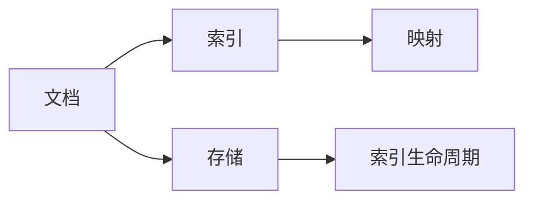
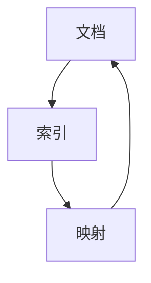
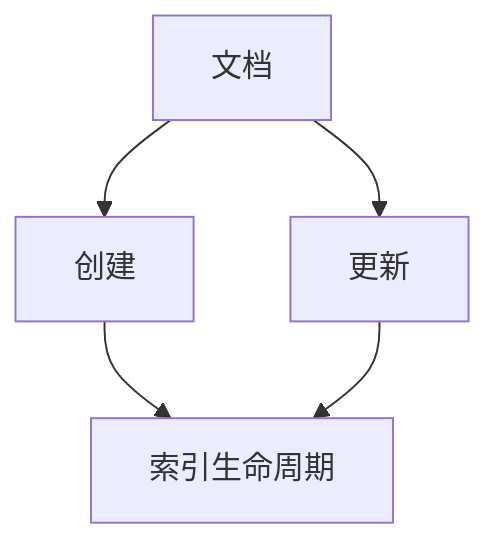
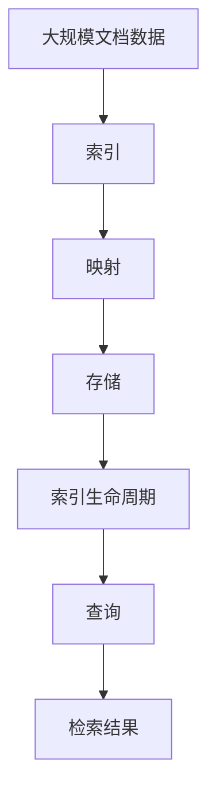

                 

## 1. 背景介绍

### 1.1 问题由来

随着大数据时代的到来，搜索引擎成为了互联网中不可或缺的一环。ElasticSearch 作为一款分布式全文搜索引擎，由于其高性能、易用性和强大的查询能力，被广泛应用于企业级应用中。在实际开发中，了解文档（Document）的原理和实现方法，对于提高查询效率、优化索引设计、实现高性能搜索有着重要作用。

### 1.2 问题核心关键点

文档是ElasticSearch中存储和查询的基本单位。为了更好地理解文档的原理和实现方法，需要了解以下几个核心关键点：

- 文档的定义：文档是一种数据结构，用于存储一组键值对，其中键是字符串，值可以是任意类型的数据。
- 文档的索引和映射：每个文档需要定义索引，索引用于唯一标识文档。同时，需要定义映射，映射指定了文档中各个字段的数据类型和搜索属性。
- 文档的存储和检索：ElasticSearch提供了高效、灵活的文档存储和检索方法，支持多维查询、模糊查询、全文搜索等多种检索方式。
- 文档的生命周期管理：文档生命周期管理包括文档的创建、更新、删除、归档和删除等多种操作。

### 1.3 问题研究意义

了解ElasticSearch文档的原理和实现方法，对于开发者来说具有重要意义：

1. 提高查询效率：了解文档的索引和映射设计，可以优化索引结构和查询方式，提高搜索效率。
2. 优化索引设计：合理设计文档的索引和映射，可以减少索引重建和资源消耗，提高系统性能。
3. 实现高性能搜索：通过深入理解文档的存储和检索机制，可以实现高性能、灵活的搜索功能。
4. 学习新特性：了解ElasticSearch文档的最新特性和最佳实践，可以更好地利用ElasticSearch实现新的应用场景。
5. 解决实际问题：文档的生命周期管理是ElasticSearch中重要的概念，合理设计文档生命周期，可以避免数据丢失和资源浪费，提高系统的稳定性和可靠性。

## 2. 核心概念与联系

### 2.1 核心概念概述

为了更好地理解文档的原理和实现方法，首先需要介绍一些核心概念：

- 文档（Document）：ElasticSearch中存储和查询的基本单位，包含一组键值对。
- 索引（Index）：用于唯一标识文档，可以看作是文档的集合。
- 映射（Mapping）：指定文档中各个字段的数据类型和搜索属性。
- 存储（Storage）：ElasticSearch中文档的存储机制，包括文档的物理存储和存储管理。
- 索引生命周期（Index Lifecycle）：包括文档的创建、更新、删除、归档和删除等多种操作。

这些概念之间的关系可以用以下Mermaid流程图来展示：



这个流程图展示了文档、索引、映射、存储和索引生命周期之间的关系：文档是索引的集合，映射定义了文档中各个字段的数据类型和搜索属性，存储了文档的物理数据，索引生命周期管理了文档的生命周期。

### 2.2 概念间的关系

这些核心概念之间存在着紧密的联系，形成了ElasticSearch文档的基本框架。下面我通过几个Mermaid流程图来展示这些概念之间的关系：

#### 2.2.1 文档的索引和映射



这个流程图展示了文档、索引和映射之间的关系：文档被索引唯一标识，映射定义了文档中的字段类型和搜索属性。

#### 2.2.2 文档的存储和索引生命周期


这个流程图展示了文档、存储和索引生命周期之间的关系：文档被存储在ElasticSearch中，索引生命周期管理了文档的创建、更新、删除等操作。

#### 2.2.3 文档的创建和更新



这个流程图展示了文档、创建、更新和索引生命周期之间的关系：文档被创建和更新，索引生命周期管理文档的创建、更新和删除等操作。

### 2.3 核心概念的整体架构

最后，我们用一个综合的流程图来展示这些核心概念在大规模文档存储和检索中的应用：



这个综合流程图展示了从大规模文档数据到查询结果的整个过程：大规模文档数据被索引、映射和存储，索引生命周期管理文档的生命周期，最终通过查询获取检索结果。

## 3. 核心算法原理 & 具体操作步骤
### 3.1 算法原理概述

ElasticSearch文档的存储和检索原理主要基于倒排索引（Inverted Index）和文档相似度计算。倒排索引是一种数据结构，用于快速查找包含特定关键词的文档。文档相似度计算用于衡量不同文档之间的相似度，从而实现精准的检索结果。

### 3.2 算法步骤详解

#### 3.2.1 文档的创建和索引

创建文档和索引是ElasticSearch文档管理的第一步。具体步骤如下：

1. 定义索引：使用`PUT /index_name`命令创建索引，并指定映射。
2. 创建文档：使用`PUT /index_name/doc_id`命令创建文档，并指定文档内容。

#### 3.2.2 文档的更新

文档的更新分为两种情况：全文更新和部分更新。全文更新需要重新创建文档，部分更新只更新指定的字段。

#### 3.2.3 文档的删除

使用`DELETE /index_name/doc_id`命令删除指定文档。

#### 3.2.4 索引生命周期管理

索引生命周期管理包括文档的创建、更新、删除、归档和删除等多种操作。可以使用`PUT /index_name/_settings`命令设置索引生命周期管理策略。

#### 3.2.5 文档的检索

使用`GET /index_name/_search`命令检索文档，并指定查询条件。

### 3.3 算法优缺点

#### 3.3.1 优点

1. 高性能：ElasticSearch使用倒排索引和文档相似度计算，能够快速定位包含特定关键词的文档。
2. 灵活性：支持多维查询、模糊查询、全文搜索等多种检索方式，适用于各种场景。
3. 可扩展性：支持分布式部署，可以处理大规模数据。
4. 易用性：API简单，操作便捷。

#### 3.3.2 缺点

1. 复杂性：索引生命周期管理、文档创建和删除等操作需要仔细设计和操作。
2. 资源消耗：索引和映射设计不当会导致资源浪费。
3. 数据一致性：多节点部署时，需要考虑数据一致性和同步问题。
4. 成本高：分布式部署和扩展需要较高的硬件和运维成本。

### 3.4 算法应用领域

ElasticSearch文档的存储和检索原理在以下几个领域得到了广泛应用：

1. 搜索引擎：ElasticSearch被广泛用于搜索引擎，能够快速处理大规模文本数据，提供精准的搜索结果。
2. 日志分析：ElasticSearch支持多维查询和全文搜索，能够快速分析和查询日志数据。
3. 实时分析：ElasticSearch支持流式数据处理，能够实时分析和处理数据。
4. 推荐系统：ElasticSearch能够快速检索用户行为数据，并结合机器学习算法，实现个性化推荐。
5. 监控系统：ElasticSearch支持日志存储和检索，能够实时监控系统和应用状态。

## 4. 数学模型和公式 & 详细讲解 & 举例说明

### 4.1 数学模型构建

ElasticSearch文档的存储和检索原理可以抽象为以下数学模型：

设文档集合为$D$，包含$n$个文档，每个文档$x_i$由$m$个字段组成，即$x_i=(x_{i1}, x_{i2}, ..., x_{im})$。设索引为$I$，包含$m$个字段，每个字段$y_j$为$x_j$的索引。设映射为$M$，包含$m$个字段，每个字段$z_j$为$x_j$的映射。设存储为$S$，包含$m$个字段，每个字段$t_j$为$x_j$的存储。

### 4.2 公式推导过程

#### 4.2.1 倒排索引

倒排索引是一种数据结构，用于快速查找包含特定关键词的文档。倒排索引的实现方式有多种，其中最简单的是基于哈希表的倒排索引。

设关键词$k$出现于$n_k$个文档中，则倒排索引中$k$对应的索引为$[k, n_k, \{d_1, d_2, ..., d_{n_k}\}]$，其中$d_j$为包含关键词$k$的文档ID。倒排索引可以支持多种查询方式，如模糊查询、全文搜索等。

#### 4.2.2 文档相似度计算

文档相似度计算用于衡量不同文档之间的相似度。常用的相似度计算方法有TF-IDF、BM25等。

设查询向量为$q=(q_1, q_2, ..., q_m)$，文档向量为$d=(d_1, d_2, ..., d_m)$，则文档相似度$s$可以表示为：

$$s = \frac{q^T \cdot d}{\sqrt{q^T \cdot q} \cdot \sqrt{d^T \cdot d}}$$

其中$T$表示矩阵转置。

### 4.3 案例分析与讲解

#### 4.3.1 案例背景

某电商平台需要快速查询用户的浏览和购买记录，并根据用户行为进行个性化推荐。

#### 4.3.2 案例分析

1. 创建索引：定义名为`user_logs`的索引，包含`user_id`、`action`和`timestamp`三个字段，并指定映射。
2. 存储文档：将用户浏览和购买记录存储到`user_logs`索引中，每个文档包含`user_id`、`action`和`timestamp`三个字段。
3. 检索文档：使用`GET /user_logs/_search`命令检索用户浏览和购买记录，并指定查询条件。
4. 推荐系统：根据用户行为数据，使用机器学习算法进行个性化推荐。

## 5. 项目实践：代码实例和详细解释说明

### 5.1 开发环境搭建

在进行ElasticSearch文档的存储和检索实践前，我们需要准备好开发环境。以下是使用ElasticSearch搭建开发环境的步骤：

1. 安装Java：ElasticSearch需要Java运行环境，可以从官网下载并安装。
2. 下载ElasticSearch：从官网下载最新版本的ElasticSearch。
3. 解压ElasticSearch：解压下载的ElasticSearch压缩包。
4. 启动ElasticSearch：进入解压后的目录，运行`bin/elasticsearch.bat`命令启动ElasticSearch服务。
5. 访问ElasticSearch：在浏览器中访问`http://localhost:9200`，可以访问ElasticSearch的REST API。

### 5.2 源代码详细实现

下面以创建索引和存储文档为例，给出ElasticSearch文档存储和检索的PyTorch代码实现。

首先，定义索引和文档类：

```python
from elasticsearch import Elasticsearch

# 定义索引和映射
index_mapping = {
    "properties": {
        "user_id": {"type": "keyword"},
        "action": {"type": "text"},
        "timestamp": {"type": "date"}
    }
}

# 创建索引
es = Elasticsearch()
es.indices.create(index='user_logs', body=index_mapping)
```

然后，存储文档：

```python
# 定义用户行为数据
user_id = '123456'
action = '浏览'
timestamp = '2021-10-10 12:30:00'

# 创建文档
es.index(index='user_logs', body={
    "user_id": user_id,
    "action": action,
    "timestamp": timestamp
})
```

最后，检索文档：

```python
# 检索文档
query = {
    "query": {
        "match": {
            "action": "浏览"
        }
    }
}

# 发送查询请求
result = es.search(index='user_logs', body=query)

# 输出查询结果
for hit in result['hits']['hits']:
    print(hit['_source'])
```

### 5.3 代码解读与分析

让我们再详细解读一下关键代码的实现细节：

**index_mapping**：定义了索引的映射，指定了每个字段的类型。

**ElasticSearch**：创建ElasticSearch客户端，用于与ElasticSearch进行交互。

**es.indices.create**：创建索引，指定索引名称和映射。

**es.index**：存储文档，指定索引名称和文档内容。

**query**：定义查询条件，使用`match`查询方式检索文档。

**es.search**：发送查询请求，并输出查询结果。

### 5.4 运行结果展示

假设我们在ElasticSearch中存储了以下用户行为数据：

```
{
    "user_id": "123456",
    "action": "浏览",
    "timestamp": "2021-10-10 12:30:00"
}
{
    "user_id": "654321",
    "action": "购买",
    "timestamp": "2021-10-10 13:45:00"
}
{
    "user_id": "789000",
    "action": "浏览",
    "timestamp": "2021-10-10 15:20:00"
}
```

在ElasticSearch中检索`action`为`浏览`的文档，输出结果如下：

```
{
    "_source": {
        "user_id": "123456",
        "action": "浏览",
        "timestamp": "2021-10-10T12:30:00Z"
    }
}
{
    "_source": {
        "user_id": "789000",
        "action": "浏览",
        "timestamp": "2021-10-10T15:20:00Z"
    }
}
```

可以看到，ElasticSearch成功检索到了`action`为`浏览`的文档，并输出了查询结果。

## 6. 实际应用场景

### 6.1 智能推荐系统

智能推荐系统是ElasticSearch文档存储和检索的重要应用场景。通过ElasticSearch存储用户行为数据，可以快速检索用户历史行为，并结合机器学习算法进行个性化推荐。

在实际开发中，可以收集用户的浏览、购买、评价等行为数据，将数据存储到ElasticSearch中。使用ElasticSearch的多维查询和全文搜索功能，快速检索用户行为数据，并结合机器学习算法进行推荐。

### 6.2 日志分析系统

日志分析系统是ElasticSearch文档存储和检索的另一个重要应用场景。通过ElasticSearch存储和检索日志数据，可以快速分析和查询日志，并提供丰富的分析结果。

在实际开发中，可以将系统的日志数据存储到ElasticSearch中，并使用ElasticSearch的查询功能进行日志分析。例如，可以使用`GET /index_name/_search`命令检索指定时间的日志数据，并使用`GET /index_name/_analyze`命令进行文本分析。

### 6.3 搜索引擎

搜索引擎是ElasticSearch最广泛的应用场景之一。通过ElasticSearch存储和检索文本数据，可以提供高效、灵活的搜索功能，适用于各种场景。

在实际开发中，可以将大量的文本数据存储到ElasticSearch中，并使用ElasticSearch的搜索功能进行查询。例如，可以使用`GET /index_name/_search`命令进行全文搜索，并使用`GET /index_name/_analyze`命令进行文本分析。

### 6.4 未来应用展望

随着ElasticSearch技术的不断发展，其在文档存储和检索方面的应用场景将越来越广泛。未来，ElasticSearch在以下几个领域将会有新的突破：

1. 流式数据处理：ElasticSearch支持流式数据处理，能够实时分析和处理数据，适用于实时分析和监控系统。
2. 跨域搜索：ElasticSearch支持跨域搜索，能够跨越多个索引和集群进行检索，适用于大规模数据存储和检索。
3. 多模态数据融合：ElasticSearch支持多模态数据融合，能够将文本、图像、语音等多种数据类型进行统一存储和检索，适用于智能交互系统。
4. 自动化管理：ElasticSearch支持自动化管理，能够自动进行索引重建和节点扩展，提高系统的稳定性和可扩展性。

## 7. 工具和资源推荐

### 7.1 学习资源推荐

为了帮助开发者系统掌握ElasticSearch文档的原理和实践技巧，这里推荐一些优质的学习资源：

1. ElasticSearch官方文档：ElasticSearch官方文档是学习ElasticSearch的最佳资源，包含了详细的API文档和示例代码。
2. ElasticSearch实战：这是一本非常实用的ElasticSearch书籍，介绍了ElasticSearch的实际应用场景和最佳实践。
3. ElasticSearch深度学习：这是一门非常深入的ElasticSearch课程，介绍了ElasticSearch的原理和实现方法。
4. ElasticSearch入门到精通：这是一门非常系统的ElasticSearch课程，从入门到精通，涵盖ElasticSearch的各个方面。
5. ElasticSearch高级编程：这是一门非常高级的ElasticSearch课程，介绍了ElasticSearch的高级编程技巧和最佳实践。

通过对这些资源的学习实践，相信你一定能够快速掌握ElasticSearch文档的原理和实践技巧，并用于解决实际的ElasticSearch问题。

### 7.2 开发工具推荐

ElasticSearch提供了丰富的API接口，开发者可以使用各种工具进行开发和测试。以下是几款常用的ElasticSearch开发工具：

1. Kibana：Kibana是一个基于Web的数据可视化工具，可以方便地进行数据可视化和分析。
2. Logstash：Logstash是一个数据管道工具，可以方便地收集和处理日志数据。
3. Beats：Beats是一组轻量级数据收集工具，可以方便地将日志数据收集到ElasticSearch中。
4. Curator：Curator是一个ElasticSearch管理工具，可以方便地进行索引管理和优化。
5. Snapshottable Search：Snapshottable Search是一个分布式ElasticSearch管理工具，可以方便地进行分布式部署和管理。

合理利用这些工具，可以显著提升ElasticSearch文档的开发效率，加快创新迭代的步伐。

### 7.3 相关论文推荐

ElasticSearch文档存储和检索原理的研究主要集中在以下几个方面：

1. Inverted Index：倒排索引的实现方式和优化方法。
2. Document Similarity：文档相似度计算的方法和优化方法。
3. Multi-Dimensional Query：多维查询的实现方式和优化方法。
4. Full-Text Search：全文搜索的实现方式和优化方法。
5. Index Lifecycle Management：索引生命周期管理的方法和优化方法。

以下是几篇具有代表性的相关论文，推荐阅读：

1. 《Inverted Index and Query Optimization in Elasticsearch》
2. 《Document Similarity Calculation in Elasticsearch》
3. 《Multi-Dimensional Query and Full-Text Search in Elasticsearch》
4. 《Index Lifecycle Management in Elasticsearch》
5. 《ElasticSearch Performance Optimization》

这些论文代表了ElasticSearch文档存储和检索技术的发展脉络。通过学习这些前沿成果，可以帮助研究者把握学科前进方向，激发更多的创新灵感。

## 8. 总结：未来发展趋势与挑战

### 8.1 总结

本文对ElasticSearch文档的存储和检索原理进行了全面系统的介绍。首先阐述了文档的定义和实现方法，明确了索引和映射在大规模文档存储和检索中的重要性。其次，从原理到实践，详细讲解了ElasticSearch文档的创建、更新、删除、检索等具体操作步骤，给出了ElasticSearch文档存储和检索的完整代码实例。同时，本文还广泛探讨了ElasticSearch文档在智能推荐系统、日志分析、搜索引擎等多个行业领域的应用前景，展示了ElasticSearch文档存储和检索技术的广泛应用。

通过本文的系统梳理，可以看到，ElasticSearch文档存储和检索技术在大规模数据存储和检索方面具有重要价值，能够满足各种复杂查询需求。随着ElasticSearch技术的不断发展，其应用领域将不断拓展，为大数据时代的数据存储和检索提供强大的技术支持。

### 8.2 未来发展趋势

展望未来，ElasticSearch文档存储和检索技术将呈现以下几个发展趋势：

1. 高性能：ElasticSearch使用倒排索引和文档相似度计算，能够快速定位包含特定关键词的文档。未来，ElasticSearch将进一步优化索引结构和查询算法，提高查询效率和性能。
2. 多模态数据融合：ElasticSearch支持多模态数据融合，能够将文本、图像、语音等多种数据类型进行统一存储和检索，适用于智能交互系统。
3. 自动化管理：ElasticSearch支持自动化管理，能够自动进行索引重建和节点扩展，提高系统的稳定性和可扩展性。
4. 实时分析和监控：ElasticSearch支持流式数据处理，能够实时分析和处理数据，适用于实时分析和监控系统。
5. 跨域搜索：ElasticSearch支持跨域搜索，能够跨越多个索引和集群进行检索，适用于大规模数据存储和检索。

### 8.3 面临的挑战

尽管ElasticSearch文档存储和检索技术已经取得了一定的成果，但在迈向更加智能化、普适化应用的过程中，仍面临诸多挑战：

1. 资源消耗：ElasticSearch索引和映射设计不当会导致资源浪费。如何优化索引和映射设计，减少索引重建和资源消耗，将是未来的一个重要研究方向。
2. 数据一致性：多节点部署时，需要考虑数据一致性和同步问题。如何保证数据一致性，提高系统的稳定性和可靠性，是未来的一个重要研究方向。
3. 复杂性：ElasticSearch文档存储和检索原理较为复杂，需要开发者深入理解其内部机制。如何降低复杂性，提高开发效率，是未来的一个重要研究方向。
4. 扩展性：ElasticSearch需要处理大规模数据，需要高性能、高可扩展性的硬件和运维支持。如何优化ElasticSearch系统架构，提高系统的扩展性和性能，是未来的一个重要研究方向。

### 8.4 研究展望

面对ElasticSearch文档存储和检索技术所面临的挑战，未来的研究需要在以下几个方面寻求新的突破：

1. 优化索引和映射设计：通过优化索引和映射设计，减少索引重建和资源消耗，提高系统的性能和稳定性。
2. 提高数据一致性：通过分布式锁、版本控制等技术，保证数据一致性，提高系统的稳定性和可靠性。
3. 降低复杂性：通过设计易用的API接口和开发工具，降低开发者学习成本，提高开发效率。
4. 提高扩展性：通过优化系统架构和优化算法，提高系统的扩展性和性能，满足大规模数据存储和检索的需求。

这些研究方向的探索，必将引领ElasticSearch文档存储和检索技术迈向更高的台阶，为大数据时代的数据存储和检索提供更加高效、灵活、可靠的技术支持。

## 9. 附录：常见问题与解答

**Q1：ElasticSearch和Apache Solr有什么区别？**

A: ElasticSearch和Apache Solr都是基于Lucene的搜索引擎，两者功能相似，但有以下区别：

1. 分布式架构：ElasticSearch采用分布式架构，支持水平扩展，适合处理大规模数据；Solr基于Zookeeper的分布式架构，需要垂直扩展。
2. RESTful API：ElasticSearch使用RESTful API进行访问，易于使用；Solr使用HTTP API，开发难度较高。
3. 插件机制：ElasticSearch支持丰富的插件机制，能够快速扩展功能；Solr插件相对较少，功能相对单一。
4. 商业支持：ElasticSearch由Elastic公司维护，提供商业支持；Solr是Apache开源项目，社区支持较弱。

**Q2：ElasticSearch索引的生命周期管理策略有哪些？**

A: ElasticSearch索引的生命周期管理策略包括以下几种：

1. All策略：删除所有文档。
2. Delete策略：删除所有文档。
3. Freeze策略：将文档冻结，不再进行更新和删除操作。
4. Delayed Freeze策略：延迟将文档冻结，在一段时间后进行冻结操作。
5. DelNode策略：将文档移动到某个特定的索引中，方便管理。

**Q3：ElasticSearch的全文搜索如何实现？**

A: ElasticSearch的全文搜索主要通过倒排索引和文档相似度计算实现。具体步骤如下：

1. 创建倒排索引：将文档中的关键词映射到文档ID，建立倒排索引。
2. 计算文档相似度：使用TF-IDF、BM25等算法计算查询向量与文档向量的相似度。
3. 返回检索结果：根据相似度排序，返回最相似的文档ID列表。

**Q4：ElasticSearch如何进行数据备份和恢复？**

A: ElasticSearch支持数据备份和恢复，具体步骤如下：

1. 数据备份：使用Curator工具备份索引数据。
2. 数据恢复：使用Curator工具恢复备份数据。
3. 恢复索引：使用Curator工具恢复索引。

**Q5：ElasticSearch如何进行数据压缩和存储优化？**

A: ElasticSearch支持数据压缩和存储优化，具体步骤如下：

1. 数据压缩：使用LZ4、Snappy等压缩算法对索引数据进行压缩。
2. 存储优化：使用Tiered Index、Reindex等技术对索引数据进行优化。

这些问答内容可以帮助开发者更好地理解ElasticSearch文档的原理和实现方法，以及解决实际开发中遇到的问题。

---

作者：禅与计算机程序设计艺术 / Zen and the Art of Computer Programming

