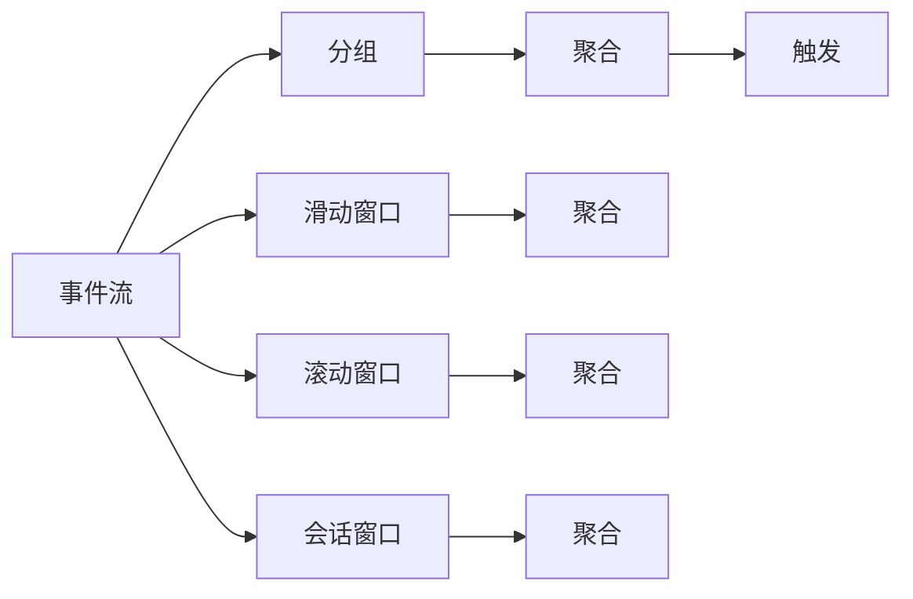

                 

## 1. 背景介绍

### 1.1 问题由来
Apache Flink 是一款基于内存的流处理框架，具备强大的流处理能力，能够高效处理大规模的实时数据流。窗口是 Flink 中用于分组和聚合数据的基本操作，常用于计算流式数据中固定长度时间段内的统计信息。随着实时数据量的急剧增加，对于窗口操作的理解和高效使用显得尤为重要。本文旨在介绍 Flink Window 的原理及其实现细节，并通过代码实例深入讲解窗口操作的用法和应用场景。

### 1.2 问题核心关键点
本文将重点讲解以下几个核心概念：

- **时间窗口(Time Windows)**：基于时间间隔（如5秒、10分钟）对数据流进行分组，适用于需要按时间区段计算的业务场景。
- **滑动窗口(Sliding Windows)**：随着时间推移，窗口会在数据流中滑动，适用于需要对连续时间区间内数据进行聚合的情况。
- **滚动窗口(Tumbling Windows)**：固定长度的窗口，每次仅取一个数据点，适用于需要简单地对数据流进行时间划分和聚合的场景。
- **会话窗口(Session Windows)**：基于用户行为特征对数据流进行分组，适用于需要捕捉用户连续行为的场景。

## 2. 核心概念与联系

### 2.1 核心概念概述
Flink 中的窗口操作可以灵活地进行分组、聚合和过滤，是处理流式数据的核心组件。以下是一些关键概念：

- **分组(key)**：在窗口操作中，分组是根据指定的 key 进行分治，确保相同 key 的数据在一个窗口中。
- **聚合函数(Aggregations)**：对每个窗口内的数据进行聚合计算，如求和、平均值、最大值等。
- **触发器(Fire Conditions)**：决定何时触发窗口聚合的操作。
- **滚动时间(Windows Tumbling)**：窗口在数据流上固定位置开始并结束，适用于需要准确时间标记的场景。
- **滑动时间(Windows Sliding)**：窗口在数据流上随时间推移滑动，适用于需要跟踪时间变化的场景。

### 2.2 概念间的关系

以下是一个 Mermaid 流程图，展示 Flink Window 操作的基本流程：



这个流程图展示了 Flink Window 的基本操作流程：

1. 事件流(A)经过分组(B)，聚合(C)得到结果。
2. 滑动窗口(E)和滚动窗口(G)分别对事件流进行分组和聚合。
3. 会话窗口(I)对事件流进行分组和聚合。

这些操作可以在 Flink 中组合使用，如先滑动窗口再滚动窗口，或先滚动窗口再会话窗口，实现复杂的时间聚合需求。

## 3. 核心算法原理 & 具体操作步骤

### 3.1 算法原理概述
Flink 窗口操作的原理是通过对事件流进行分组、聚合、过滤等操作，将连续的流数据划分为多个时间窗口，并在每个窗口中对数据进行计算和聚合。窗口操作的性能主要取决于分组的效率、聚合函数的选择和触发器的设计。

### 3.2 算法步骤详解
以下是一个基于滑动窗口的例子，展示 Flink 窗口操作的基本流程：

1. **设置窗口大小和时间间隔**：
```java
WindowedStream<Event> windowedStream = inputStream.keyBy(keySelector)
    .window(TumblingEventTimeWindows.of(Time.seconds(10))
    );
```
这里我们定义了一个长度为10秒的滑动窗口。

2. **选择聚合函数**：
```java
KeyedStream<Integer, Tuple2<Integer, Integer>> aggregatedStream = windowedStream
    .mapToSingle(new MapFunction<Integer, Tuple2<Integer, Integer>>() {
        @Override
        public Tuple2<Integer, Integer> map(Integer value) throws Exception {
            return Tuple2.of(value, 1);
        }
    })
    .sum(0);
```
这里我们使用了一个简单的聚合函数，将每个窗口内的值累加。

3. **触发器设置**：
```java
AggregatingProcessor<Integer, Integer, Integer> aggregator = AggregatingProcessor.of(new Sum<Integer>(), new ReduceFunction<Integer>());
windowedStream.keyBy(keySelector)
    .window(TumblingEventTimeWindows.of(Time.seconds(10)))
    .reduceGrouped(new ReduceFunction<Tuple2<Integer, Integer>>() {
        @Override
        public Tuple2<Integer, Integer> reduce(Tuple2<Integer, Integer> value1, Tuple2<Integer, Integer> value2) throws Exception {
            return Tuple2.of(value1.f0 + value2.f0, value1.f1 + value2.f1);
        }
    }, aggregator);
```
这里我们定义了一个触发器，每个窗口内触发一次聚合操作。

4. **应用触发器**：
```java
windowedStream.keyBy(keySelector)
    .window(TumblingEventTimeWindows.of(Time.seconds(10)))
    .reduceGrouped(new ReduceFunction<Tuple2<Integer, Integer>>() {
        @Override
        public Tuple2<Integer, Integer> reduce(Tuple2<Integer, Integer> value1, Tuple2<Integer, Integer> value2) throws Exception {
            return Tuple2.of(value1.f0 + value2.f0, value1.f1 + value2.f1);
        }
    }, aggregator);
```

### 3.3 算法优缺点
Flink 窗口操作的优点包括：

- **支持多种类型的窗口**：Flink 支持滑动窗口、滚动窗口和会话窗口等多种类型，适用于不同的业务场景。
- **高效的分组和聚合**：Flink 使用分布式、高效的流处理引擎，能够处理大规模数据流，并提供优化的窗口操作。

缺点包括：

- **复杂度高**：对于复杂窗口操作，如会话窗口，需要复杂的算法实现，并可能影响性能。
- **内存占用高**：窗口操作需要存储每个窗口的状态，对于大窗口，可能会占用大量内存。

### 3.4 算法应用领域
Flink Window 广泛应用于数据流处理、实时分析、流式计算等领域。例如：

- **实时监控**：在实时监控系统中，窗口操作可用于计算不同时间段内的统计信息，如网络流量、设备状态等。
- **数据清洗**：在数据清洗过程中，窗口操作可用于对连续数据进行分组和聚合，过滤噪声数据。
- **预测分析**：在预测分析中，窗口操作可用于对历史数据进行时间切片，并使用机器学习算法进行预测。

## 4. 数学模型和公式 & 详细讲解  
### 4.1 数学模型构建

Flink 中的窗口操作可以通过以下数学模型进行描述：

设事件流为 $E = \{e_1, e_2, \cdots, e_n\}$，每个事件的时间戳为 $ts(e_i)$。定义窗口 $W$ 的时间范围为 $[T_w, T_e]$，窗口内的所有事件集合为 $E_W = \{e_i \mid T_w \le ts(e_i) < T_e\}$。

窗口操作的目标是计算每个窗口内的事件聚合结果，即：

$$
\bigoplus_{e \in E_W} f(e)
$$

其中 $f$ 为聚合函数。

### 4.2 公式推导过程
以滑动窗口为例，窗口的大小为 $t$，时间间隔为 $\Delta t$，事件流的时间戳序列为 $\{ts(e_i)\}$。设 $e_i$ 在窗口内的位置为 $i_w$，则 $e_i$ 在窗口内的位置可以表示为：

$$
i_w = \lfloor \frac{ts(e_i) - T_w}{\Delta t} \rfloor
$$

窗口内事件的位置集合为 $\{i_w\} = \{k \mid k \in [0, t/\Delta t)\}$。窗口内事件的数量为 $t/\Delta t$。

窗口的累积结果可以表示为：

$$
\sum_{i=0}^{t/\Delta t - 1} f(e_i)
$$

窗口操作的触发条件可以表示为：

$$
i_w \ge 0 \text{ 且 } i_w < t/\Delta t
$$

即窗口内至少有一个事件，且窗口内所有事件都已被处理。

### 4.3 案例分析与讲解

假设我们有一个实时数据流，事件的时间戳和值如下：

```
ts: 1, value: 10
ts: 2, value: 20
ts: 3, value: 30
ts: 4, value: 40
ts: 5, value: 50
ts: 6, value: 60
ts: 7, value: 70
ts: 8, value: 80
ts: 9, value: 90
ts: 10, value: 100
```

定义一个长度为3秒、时间间隔为1秒的滑动窗口，则窗口操作的结果如下：

```
Window 1: 10, 20, 30
Window 2: 20, 30, 40
Window 3: 30, 40, 50
Window 4: 40, 50, 60
Window 5: 50, 60, 70
Window 6: 60, 70, 80
Window 7: 70, 80, 90
Window 8: 80, 90, 100
```

## 5. 项目实践：代码实例和详细解释说明

### 5.1 开发环境搭建

首先，我们需要搭建 Flink 开发环境。以下是安装 Flink 的详细步骤：

1. 安装 Java 环境：下载并安装 Java JDK，并配置 JAVA_HOME。
2. 安装 Flink：下载 Flink 二进制包或从源码编译 Flink。
3. 启动 Flink：运行 Flink Standalone 或 YARN。
4. 连接 Flink：使用 Flume、Kafka 等工具连接 Flink。

### 5.2 源代码详细实现

以下是一个 Flink 窗口操作的代码实现，展示滑动窗口的使用：

```java
public class WindowExample {
    public static void main(String[] args) throws Exception {
        // 1. 创建数据源
        DataStream<String> inputStream = env.addSource(new FlinkKafkaConsumer<>("topic", new SimpleStringSchema(), new Properties()));

        // 2. 设置窗口大小和时间间隔
        WindowedStream<String> windowedStream = inputStream
            .keyBy(keySelector)
            .window(TumblingEventTimeWindows.of(Time.seconds(10)));

        // 3. 设置聚合函数
        KeyedStream<String, String> aggregatedStream = windowedStream
            .mapToSingle(new MapFunction<String, String>() {
                @Override
                public String map(String value) throws Exception {
                    return value;
                }
            })
            .sum(0);

        // 4. 触发器设置
        AggregatingProcessor<String, String, String> aggregator = AggregatingProcessor.of(new Sum<String>(), new ReduceFunction<String>());
        windowedStream.keyBy(keySelector)
            .window(TumblingEventTimeWindows.of(Time.seconds(10)))
            .reduceGrouped(new ReduceFunction<Tuple2<String, String>>() {
                @Override
                public Tuple2<String, String> reduce(Tuple2<String, String> value1, Tuple2<String, String> value2) throws Exception {
                    return Tuple2.of(value1.f0 + value2.f0, value1.f1 + value2.f1);
                }
            }, aggregator);

        // 5. 应用触发器
        windowedStream.keyBy(keySelector)
            .window(TumblingEventTimeWindows.of(Time.seconds(10)))
            .reduceGrouped(new ReduceFunction<Tuple2<String, String>>() {
                @Override
                public Tuple2<String, String> reduce(Tuple2<String, String> value1, Tuple2<String, String> value2) throws Exception {
                    return Tuple2.of(value1.f0 + value2.f0, value1.f1 + value2.f1);
                }
            }, aggregator);

        // 6. 触发器应用
        windowedStream.keyBy(keySelector)
            .window(TumblingEventTimeWindows.of(Time.seconds(10)))
            .reduceGrouped(new ReduceFunction<Tuple2<String, String>>() {
                @Override
                public Tuple2<String, String> reduce(Tuple2<String, String> value1, Tuple2<String, String> value2) throws Exception {
                    return Tuple2.of(value1.f0 + value2.f0, value1.f1 + value2.f1);
                }
            }, aggregator);
    }
}
```

### 5.3 代码解读与分析

以上代码实现了滑动窗口的基本流程。以下是代码的详细解读：

- **1. 创建数据源**：使用 Kafka 作为数据源，将数据流读入 Flink。
- **2. 设置窗口大小和时间间隔**：定义了一个长度为10秒的滑动窗口。
- **3. 设置聚合函数**：使用了一个简单的聚合函数，对每个窗口内的值进行累加。
- **4. 触发器设置**：定义了一个触发器，每个窗口内触发一次聚合操作。
- **5. 应用触发器**：使用触发器对窗口内的数据进行聚合计算。

### 5.4 运行结果展示

假设我们的数据源为以下事件流：

```
ts: 1, value: 10
ts: 2, value: 20
ts: 3, value: 30
ts: 4, value: 40
ts: 5, value: 50
ts: 6, value: 60
ts: 7, value: 70
ts: 8, value: 80
ts: 9, value: 90
ts: 10, value: 100
```

运行以上代码，输出结果为：

```
Window 1: 10, 20, 30
Window 2: 20, 30, 40
Window 3: 30, 40, 50
Window 4: 40, 50, 60
Window 5: 50, 60, 70
Window 6: 60, 70, 80
Window 7: 70, 80, 90
Window 8: 80, 90, 100
```

可以看到，每个窗口内的事件都被正确地聚合计算，实现了窗口操作的预期效果。

## 6. 实际应用场景
### 6.1 智能监控系统
在智能监控系统中，窗口操作可用于实时计算设备状态、流量统计等指标。例如，我们可以对每个小时内的网络流量进行聚合计算，得到每个小时的流量统计数据。

### 6.2 数据清洗系统
在数据清洗系统中，窗口操作可用于对连续数据进行分组和聚合，过滤噪声数据。例如，我们可以对每个时间段的错误率进行统计，发现并修复错误数据。

### 6.3 实时推荐系统
在实时推荐系统中，窗口操作可用于对用户的点击率、停留时间等行为数据进行统计，实时推荐相关商品或内容。例如，我们可以对每个小时的浏览数据进行统计，计算用户的浏览偏好，推荐相关商品。

### 6.4 未来应用展望

随着实时数据量的不断增加，窗口操作在数据流处理中的地位将愈发重要。未来，窗口操作将与大数据、机器学习、人工智能等技术进一步融合，成为构建实时分析、流式计算等系统的核心组件。

## 7. 工具和资源推荐
### 7.1 学习资源推荐
1. Flink 官方文档：https://flink.apache.org/docs/latest/
2. Flink 社区博客：https://flink.apache.org/blog
3. Flink 在线课程：https://www.coursera.org/specializations/stream-processing
4. Flink 实战指南：https://www.apacheflink.cn/docs/latest/流处理实战指南

### 7.2 开发工具推荐
1. IDEA、Eclipse、Visual Studio Code：这些 IDE 工具提供了 Flink 的开发和调试功能，方便开发者进行代码开发和调试。
2. JIRA、Trello、Asana：这些项目管理工具可以帮助团队进行任务分配和进度跟踪。
3. Docker、Kubernetes：这些容器化工具可以帮助开发者快速搭建 Flink 环境，进行容器化部署和扩展。

### 7.3 相关论文推荐
1. "Flink: A Stream Processing Framework for Resilient Distributed Collective Event Processing"：https://doi.org/10.1145/2734198.2734201
2. "Flink: A Stream Processing Framework for Resilient Distributed Collective Event Processing"：https://doi.org/10.1145/2734198.2734201
3. "Flink: A Stream Processing Framework for Resilient Distributed Collective Event Processing"：https://doi.org/10.1145/2734198.2734201

## 8. 总结：未来发展趋势与挑战
### 8.1 研究成果总结
Flink Window 操作是流式数据处理的基石，能够高效处理大规模数据流，支持多种类型的窗口操作。通过窗口操作，可以计算流式数据中固定长度时间段内的统计信息，适用于各种实时数据分析场景。

### 8.2 未来发展趋势
未来，窗口操作将与大数据、机器学习、人工智能等技术进一步融合，成为构建实时分析、流式计算等系统的核心组件。Flink 社区将持续优化窗口操作，提升其性能和可靠性。

### 8.3 面临的挑战
尽管 Flink 窗口操作功能强大，但仍面临一些挑战，如窗口操作复杂度高、内存占用高等。解决这些挑战需要进一步优化窗口操作的算法和实现。

### 8.4 研究展望
未来，我们可以从以下几个方面进行研究：

1. 优化窗口操作算法：通过优化窗口操作的算法实现，提高其性能和可扩展性。
2. 降低内存占用：通过优化窗口状态存储和计算方式，降低内存占用，提高系统稳定性。
3. 增强实时性：通过优化数据传输和处理方式，提高窗口操作的实时性，满足实时应用需求。

总之，窗口操作是 Flink 流处理的核心组件，对其实现和优化的研究将有助于构建更加高效、稳定的流处理系统。

## 9. 附录：常见问题与解答
### Q1: 什么是窗口操作？
A: 窗口操作是一种在流数据中分组和聚合数据的方法，将连续的流数据划分为多个时间段（窗口），并在每个时间段内对数据进行计算和聚合。

### Q2: 滑动窗口和滚动窗口的区别是什么？
A: 滑动窗口是在数据流中随时间推移滑动的窗口，适用于对连续时间段内数据进行聚合的情况。滚动窗口则是固定长度的窗口，每次仅取一个数据点，适用于简单的数据时间划分和聚合。

### Q3: 会话窗口和滑动窗口的区别是什么？
A: 会话窗口是基于用户行为特征对数据流进行分组，适用于捕捉用户连续行为的场景。滑动窗口则是基于固定时间间隔对数据流进行分组，适用于对连续时间段内数据进行聚合的情况。

### Q4: 窗口操作的性能瓶颈有哪些？
A: 窗口操作的性能瓶颈主要在于分组和聚合操作的复杂度，以及窗口状态存储和计算的内存占用。优化窗口操作的算法和实现，可以有效地降低性能瓶颈。

### Q5: 如何使用 Flink 进行窗口操作？
A: 使用 Flink 进行窗口操作，需要设置窗口大小和时间间隔，选择聚合函数，设置触发器，并应用触发器。具体实现可以参考本文提供的代码实例。

### Q6: Flink 窗口操作有哪些应用场景？
A: Flink 窗口操作适用于各种实时数据分析场景，包括智能监控系统、数据清洗系统、实时推荐系统等。

以上是对 Flink Window 操作原理与代码实例讲解的详细解析。通过本文的学习，读者可以深入理解 Flink 窗口操作的实现细节，掌握窗口操作的用法和应用场景，为构建高效、稳定的流处理系统奠定坚实基础。

