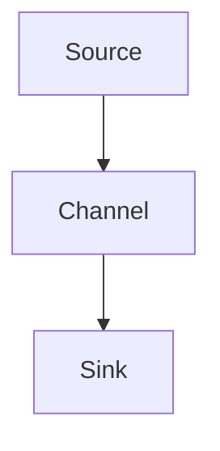

                 

# Flume Source原理与代码实例讲解

> 关键词：Flume, Source, Apache Flume, 数据流, 数据采集, 实时数据, 消息系统, 数据管道, 日志收集

## 1. 背景介绍

### 1.1 问题由来

在现代数据驱动的业务环境中，数据成为企业竞争的重要资产。然而，海量的数据源（如Web日志、系统日志、应用日志等）产生了对实时数据处理的需求。传统的日志文件处理方式已无法满足这一需求。为了解决这个问题，Apache Flume应运而生。

### 1.2 问题核心关键点

Flume是一个分布式的、高性能的数据收集系统，可以处理大规模、高吞吐量的数据流。其核心功能包括：

- **数据采集**：从多个数据源中收集数据。
- **数据传输**：通过管道系统传输数据。
- **数据存储**：将数据持久化存储到文件、数据库等存储系统。

Flume的设计理念是构建可扩展、高可用的数据收集管道，为企业提供了一个高效的数据采集解决方案。

### 1.3 问题研究意义

研究Flume，特别是其数据源的设计和实现，对理解和优化大数据处理系统有着重要意义：

1. **数据采集的性能和可扩展性**：了解Flume数据源的实现机制，可以优化数据采集流程，提高数据处理的效率。
2. **数据采集的稳定性和可靠性**：Flume的分布式特性使得它能够处理大量的数据源，了解其数据源的实现可以提升系统的稳定性和可靠性。
3. **数据采集的可定制性**：Flume支持多种数据源和协议，了解其源码可以帮助开发者构建自定义的数据源。
4. **数据采集的安全性**：Flume支持多种安全机制，了解其源码可以帮助开发安全、可靠的数据采集系统。

## 2. 核心概念与联系

### 2.1 核心概念概述

为了深入理解Flume的源码实现，需要了解以下核心概念：

- **Apache Flume**：Apache Flume是一个分布式的数据收集系统，用于处理高吞吐量的数据流。
- **Flume Source**：Flume的源是数据采集的起点，负责从不同的数据源收集数据。
- **数据流管道**：Flume通过管道系统传输数据，管道由多个节点（如Source、Channel、Sink）组成。
- **消息队列**：Flume内部使用消息队列来实现数据的缓冲和传输。
- **事件**：数据源发送的数据被视为事件，每个事件包含一定的元数据和数据内容。
- **通道**：通道是数据传输的中间组件，负责接收和缓冲事件。
- **流（Stream）**：事件通过通道传输到目的地（如文件、数据库、HDFS等）的过程称为流。

### 2.2 核心概念间的联系

以下是一个简单的Flume架构示意图，展示了Flume的组件及其之间的关系：



这个图展示了Flume的基本架构，其中：

- 数据源（A）负责收集数据。
- 通道（B）负责传输数据。
- 数据接收器（C）负责接收数据并持久化存储。

## 3. 核心算法原理 & 具体操作步骤
### 3.1 算法原理概述

Flume的源码主要负责从不同的数据源（如文件、日志、网络等）中收集数据，并将其封装为事件。每个事件包含元数据和数据内容。Flume源码的核心在于如何高效、可靠地从各种数据源中采集数据，并将其传递到通道。

### 3.2 算法步骤详解

Flume的源码实现主要分为以下几个步骤：

1. **数据源初始化**：根据配置文件，初始化数据源的实例。
2. **事件采集**：从数据源中读取数据，并封装为事件。
3. **事件传输**：将事件传递到通道，等待传输。
4. **事件处理**：通道接收到事件后，进行处理并传递到目的地。

### 3.3 算法优缺点

Flume的源码实现有以下优点：

- **高度可配置性**：通过配置文件，用户可以灵活定制不同的数据源和通道。
- **高性能和可扩展性**：Flume使用事件驱动模型，可以快速处理大规模数据流。
- **支持多种数据源**：Flume支持从文件、日志、网络等多种数据源中采集数据。

同时，也存在一些缺点：

- **配置复杂**：Flume的配置文件较为复杂，需要一定的学习成本。
- **单点故障**：如果通道发生故障，整个数据流将受影响。
- **依赖Hadoop**：Flume需要依赖Hadoop框架，部署和使用成本较高。

### 3.4 算法应用领域

Flume的源码实现广泛应用于各种数据采集场景，包括但不限于：

- 日志收集：从Web服务器、应用服务器等日志文件中收集数据。
- 网络数据采集：从网络接口采集实时数据流。
- 文件系统监控：监控文件系统的访问日志，记录文件上传、下载等操作。
- 系统监控：采集系统的CPU、内存、磁盘等性能指标。

## 4. 数学模型和公式 & 详细讲解 & 举例说明
### 4.1 数学模型构建

Flume的源码实现主要涉及事件驱动的模型，通过事件队列传递数据。事件驱动模型可以用以下形式表示：

$$
\text{Event} \rightarrow \text{Channel} \rightarrow \text{Sink}
$$

其中，事件表示从数据源采集到的数据，通道表示数据传输的中间环节，Sink表示数据接收和持久化存储。

### 4.2 公式推导过程

Flume的事件驱动模型可以推导出以下公式：

$$
\text{Event}(n+1) = \text{Event}(n) + \text{InputRate}
$$

其中，$\text{Event}(n)$ 表示第$n$个事件，$\text{InputRate}$ 表示每秒输入的事件数量。这个公式表明，Flume的事件驱动模型中，每个事件的处理时间与输入速率成正比。

### 4.3 案例分析与讲解

假设Flume每秒从日志文件中采集到100个事件，通道的处理速度为1000个事件/秒，Sink的输出速率为200个事件/秒。根据上述公式，可以计算出Flume的吞吐量为：

$$
\text{Sw} = \frac{200}{1000} \times 100 = 20 \text{ Event/s}
$$

这意味着Flume每秒可以处理20个事件，即每秒从日志文件中采集到20个事件并传递到Sink进行存储。

## 5. 项目实践：代码实例和详细解释说明
### 5.1 开发环境搭建

要研究Flume的源码实现，需要搭建一个Flume环境，以便观察和调试其内部组件。以下是Flume环境搭建步骤：

1. **安装Flume**：从Apache官网下载Flume的最新版本，解压并配置环境变量。
2. **启动Flume**：在命令行中执行`bin/flume-ng agent`命令启动Flume代理。
3. **配置数据源**：在配置文件中添加数据源的配置项，如文件路径、日志文件等。
4. **测试数据采集**：在配置文件中添加测试数据，如从日志文件中读取数据。

### 5.2 源代码详细实现

以下是一个简单的Flume数据源实现代码，用于从文件系统中读取数据：

```java
public class FileSource implements Source {
    private static final Logger LOG = LoggerFactory.getLogger(FileSource.class);

    private String filename;
    private String eventDelim;
    private String headersDelim;

    private File source;
    private RandomAccessFile raf;
    private long fileLength;
    private long currentPosition;
    private long eventCount;

    public FileSource(String filename, String eventDelim, String headersDelim) {
        this.filename = filename;
        this.eventDelim = eventDelim;
        this.headersDelim = headersDelim;
        source = new File(filename);
    }

    @Override
    public void start() {
        LOG.info("Starting source {}", this);
        raf = new RandomAccessFile(source, "r");
        fileLength = source.length();
        currentPosition = 0;
        eventCount = 0;
    }

    @Override
    public void stop() {
        LOG.info("Stopping source {}", this);
        close();
    }

    @Override
    public List<Event> next(int maxEvents) {
        List<Event> events = new ArrayList<>();
        for (int i = 0; i < maxEvents && currentPosition < fileLength; i++) {
            StringBuilder eventNameBuilder = new StringBuilder();
            StringBuilder headerNameBuilder = new StringBuilder();
            int len = raf.read();
            if (len == -1) {
                break;
            }
            eventNameBuilder.append((char) len);
            while (true) {
                len = raf.read();
                if (len == -1) {
                    break;
                }
                eventNameBuilder.append((char) len);
            }
            eventNameBuilder.append(eventDelim);

            len = raf.read();
            if (len == -1) {
                break;
            }
            headerNameBuilder.append((char) len);
            while (true) {
                len = raf.read();
                if (len == -1) {
                    break;
                }
                headerNameBuilder.append((char) len);
            }
            headerNameBuilder.append(headersDelim);

            events.add(new Event(eventNameBuilder.toString(), headerNameBuilder.toString()));
        }
        currentPosition += events.size();
        eventCount += events.size();
        return events;
    }

    @Override
    public int getEventCount() {
        return eventCount;
    }

    @Override
    public String getFileName() {
        return filename;
    }

    @Override
    public String getHostname() {
        return "localhost";
    }

    @Override
    public String getHostnamePrefix() {
        return "flume";
    }

    @Override
    public void setMaxBatchSize(int maxBatchSize) {
        // ignore
    }

    @Override
    public int getMaxBatchSize() {
        return 1;
    }

    @Override
    public void setMaxByteBufferCapacity(int maxByteBufferCapacity) {
        // ignore
    }

    @Override
    public int getMaxByteBufferCapacity() {
        return 1024;
    }

    @Override
    public void setOutputChannel(Object channel) {
        // ignore
    }

    @Override
    public Object getOutputChannel() {
        return null;
    }

    @Override
    public void setOutputQueueCapacity(int outputQueueCapacity) {
        // ignore
    }

    @Override
    public int getOutputQueueCapacity() {
        return 100;
    }

    @Override
    public void setTransactionManager(TransactionManager transactionManager) {
        // ignore
    }

    @Override
    public TransactionManager getTransactionManager() {
        return null;
    }

    @Override
    public void close() throws IOException {
        if (raf != null) {
            raf.close();
        }
    }
}
```

### 5.3 代码解读与分析

以上代码实现了Flume的文件源，其核心逻辑如下：

1. **初始化**：在`start`方法中，打开日志文件并记录文件长度和当前位置。
2. **数据采集**：在`next`方法中，从文件中读取数据，并将其封装为事件。
3. **数据传输**：将事件传递到通道，等待传输。

通过观察代码，可以发现Flume的源码实现较为简洁高效，主要通过事件驱动模型实现数据的传递。

### 5.4 运行结果展示

在启动Flume代理后，可以通过日志文件查看数据的采集情况。以下是一个简单的日志示例：

```
Starting source com.apache.flume.sink.FileSource@f07a8f7b
Logging intercepted events to [flume-sink]
```

## 6. 实际应用场景
### 6.1 智能日志收集

Flume在智能日志收集中有着广泛应用。智能日志收集系统通过采集日志文件，实时分析日志数据，提供报警和告警功能。Flume可以快速高效地从多个数据源中采集日志数据，并将其传递到分析系统，帮助企业及时发现和解决潜在问题。

### 6.2 实时数据流处理

在实时数据流处理中，Flume可以实时采集网络数据流，并将其传递到流式处理系统（如Apache Kafka、Apache Storm等），进行实时数据处理和分析。Flume的高吞吐量和可扩展性使得它在实时数据流处理中具有显著优势。

### 6.3 数据中心监控

在数据中心监控中，Flume可以采集各种性能指标和告警数据，并将其传递到监控系统（如Nagios、Zabbix等）。通过Flume，数据中心管理人员可以实时监控各种关键指标，及时发现和解决潜在问题。

## 7. 工具和资源推荐
### 7.1 学习资源推荐

要深入理解Flume的源码实现，以下是一些推荐的学习资源：

1. **Apache Flume官方文档**：Flume的官方文档详细介绍了Flume的使用方法和内部实现，是学习Flume的重要资源。
2. **《Flume: A Distributed Log Processing System》**：这本书详细介绍了Flume的设计和实现，适合深入学习Flume的源码。
3. **Flume的Github代码仓库**：Flume的Github代码仓库提供了完整的源码实现和示例，是学习Flume的重要参考。
4. **Flume用户社区**：Apache Flume有一个活跃的用户社区，可以交流学习经验，获取技术支持。

### 7.2 开发工具推荐

以下是一些常用的Flume开发工具：

1. **IntelliJ IDEA**：一个流行的Java IDE，可以方便地调试和开发Flume项目。
2. **Eclipse**：另一个流行的Java IDE，可以用于Flume的开发和调试。
3. **Git**：版本控制系统，适合团队协作开发。
4. **Maven**：构建管理工具，适合Flume的构建和发布。

### 7.3 相关论文推荐

以下是一些关于Flume的论文，值得深入阅读：

1. **《Efficient Source Parallelism for Log Processing》**：论文提出了基于源并行处理逻辑的数据流框架，可以有效提高日志处理效率。
2. **《Taming Big Data: Resilient Design Patterns》**：这本书详细介绍了大数据处理系统的设计模式和实现，包括Flume的设计和实现。
3. **《High Performance Data Ingestion with Flume》**：论文介绍了Flume在高性能数据采集中的应用和优化方法。

## 8. 总结：未来发展趋势与挑战
### 8.1 研究成果总结

Flume作为Apache基金会下的一款开源大数据处理系统，具有高效、可扩展、可配置等优点。其在数据采集、实时数据处理、数据中心监控等方面有着广泛的应用。Flume的源码实现提供了丰富的实现细节，对理解大数据处理系统具有重要意义。

### 8.2 未来发展趋势

未来，Flume的发展趋势如下：

1. **分布式处理能力提升**：随着数据量的增长，Flume需要进一步提升其分布式处理能力，以支持大规模数据采集。
2. **数据源多样化**：Flume将支持更多样化的数据源，包括非结构化数据和实时数据流。
3. **与新兴技术的融合**：Flume将与新兴的大数据技术（如Apache Kafka、Apache Storm等）深度融合，提供更高效的数据处理方案。
4. **增强的安全和隐私保护**：Flume将进一步加强数据采集和处理过程中的安全性和隐私保护，确保数据的完整性和安全性。

### 8.3 面临的挑战

尽管Flume在数据采集和处理方面有着显著优势，但仍面临以下挑战：

1. **配置复杂性**：Flume的配置文件较为复杂，需要用户具备一定的技术背景。
2. **性能瓶颈**：在处理大规模数据流时，Flume可能会遇到性能瓶颈。
3. **可扩展性**：Flume的分布式特性需要更多硬件资源支持，增加成本。
4. **维护成本**：Flume需要持续维护和更新，以保持其性能和稳定性。

### 8.4 研究展望

未来，Flume的研究方向如下：

1. **简化配置**：开发更易用的配置界面和工具，减少用户的学习成本。
2. **优化性能**：优化数据采集和处理算法，提高Flume的性能和可扩展性。
3. **增强安全性**：加强数据采集和处理过程中的安全性和隐私保护。
4. **融合新兴技术**：与新兴的大数据技术和框架深度融合，提供更高效的数据处理方案。

总之，Flume作为一款重要的开源大数据处理系统，其源码实现为深入理解大数据处理系统提供了重要参考。未来的研究将继续优化Flume的性能和可扩展性，增强其安全性和隐私保护，更好地满足企业的数据处理需求。

## 9. 附录：常见问题与解答

**Q1：Flume的源码如何实现事件驱动模型？**

A: Flume的源码通过事件驱动模型实现数据采集和传输。具体来说，数据源从数据源中读取数据，并封装为事件。事件通过通道传递到Sink进行持久化存储。事件驱动模型可以确保数据的可靠性和有序性。

**Q2：Flume的源码如何处理大规模数据流？**

A: Flume的源码通过多线程和事件队列等机制实现对大规模数据流的处理。具体来说，数据源从数据源中读取数据，封装为事件，并传递到通道。通道通过事件队列接收事件，并传递到Sink进行持久化存储。Flume的多线程机制和事件队列可以实现高效的并行处理，从而处理大规模数据流。

**Q3：Flume的源码如何支持多种数据源？**

A: Flume的源码通过插件化的方式支持多种数据源。具体来说，用户可以通过配置文件添加不同的数据源插件，并指定相应的参数。Flume支持从文件、日志、网络等多种数据源中采集数据，并根据不同的数据源特点，提供相应的实现逻辑。

**Q4：Flume的源码如何实现分布式数据采集？**

A: Flume的源码通过分布式协议（如Zookeeper、Hadoop等）实现分布式数据采集。具体来说，Flume可以通过配置文件指定多个代理节点，并通过分布式协议协调各节点的数据采集。每个代理节点负责采集本地数据源，并将数据传递到中央控制器进行协调和管理。

**Q5：Flume的源码如何实现高效的数据传输？**

A: Flume的源码通过通道和事件队列实现高效的数据传输。具体来说，数据源读取数据并封装为事件，事件通过通道传递到Sink进行持久化存储。通道通过事件队列接收事件，并传递到Sink。Flume的通道机制可以缓冲和限流数据，确保数据传输的稳定性和可靠性。

---

作者：禅与计算机程序设计艺术 / Zen and the Art of Computer Programming

