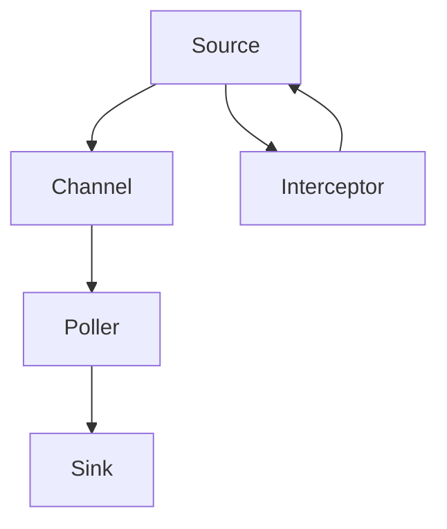

                 

# Flume日志收集系统原理与代码实例讲解

> 关键词：Flume,日志收集,分布式系统,数据采集,数据流管理,Apache Hadoop

## 1. 背景介绍

### 1.1 问题由来
在现代分布式系统中，日志扮演着至关重要的角色。它们记录了系统的运行情况，包括状态、错误信息、性能数据等，是诊断和分析问题的关键来源。然而，随着系统的规模不断扩大，日志数据量呈指数级增长，手动收集、存储和管理这些数据变得既耗时又容易出错。Flume正是为解决这一问题而诞生的。

### 1.2 问题核心关键点
Flume是一个开源的分布式日志采集系统，由Apache基金会于2007年发起。它通过构建在Hadoop分布式计算平台之上，实现了高可靠性、可扩展性和容错的日志收集功能。以下是Flume的几个核心关键点：

- 分布式采集：Flume支持将日志数据分发到多个收集节点，并从多个节点同时读取日志。
- 管道式架构：Flume的日志流是通过一系列称为"Source-Sink-Poller"的组件实现的，这些组件可以根据需要组合使用，以实现灵活的日志收集和处理。
- 数据存储：Flume可以将收集到的日志数据直接写入HDFS或Hive，支持多种数据格式和压缩方式。
- 高可靠性：Flume具有容错机制，能够自动恢复因故障而中断的日志收集过程，确保数据的完整性和可靠性。

### 1.3 问题研究意义
研究Flume日志收集系统的原理和代码实例，对于理解和应用分布式日志管理解决方案，以及优化大数据系统性能具有重要意义：

- 降低运维成本：Flume可以自动化收集和存储日志，减少了人工干预和出错的可能性。
- 提高问题诊断效率：通过集中收集和分析日志，可以快速定位和解决问题，加速系统恢复。
- 支持大数据分析：将日志数据存储在Hadoop系统中，可以方便地进行离线和大规模数据分析。
- 增强系统可靠性：Flume的容错机制和故障恢复能力，可以提升整个系统的可靠性和稳定性。
- 促进数据驱动决策：日志数据是企业运营和决策的关键依据，通过实时监控和分析日志，企业可以更准确地进行业务决策和运营优化。

## 2. 核心概念与联系

### 2.1 核心概念概述

为更好地理解Flume日志收集系统，我们首先介绍几个关键概念：

- Flume：一个开源的分布式日志采集系统，支持从大量数据源收集日志，并可靠地存储到Hadoop系统中。
- Source：日志收集的入口，可以是一个文件、网络协议、数据库等。
- Sink：日志数据的目的地，可以是Hadoop HDFS、Hive、Elasticsearch等。
- Poller：源和 sink 之间的桥梁，负责从 Source 中读取数据并写入 Sink。
- Channel：数据流的管道，用于连接不同的 Source 和 Sink，支持数据的缓存和负载均衡。
- Interceptor：在数据流处理过程中，拦截器可以对数据进行格式化、过滤等操作。

这些核心概念共同构成了Flume的体系结构，使其能够高效、可靠地收集和处理海量日志数据。

### 2.2 概念间的关系

通过以下Mermaid流程图，我们可以更清晰地理解Flume系统各个组件之间的关系：



这个流程图展示了Flume系统的核心组件及其相互关系：

- 日志从不同的Source流入，经过拦截器进行预处理，然后通过Channel传输给Poller。
- Poller负责读取Channel中的日志数据，并写入Sink。
- Sink可以是Hadoop HDFS、Hive或其他目标系统。

这些组件通过灵活的组合和配置，可以实现不同场景下的日志收集需求。

## 3. 核心算法原理 & 具体操作步骤
### 3.1 算法原理概述

Flume的日志收集过程可以分为以下几个关键步骤：

1. 日志收集：通过Source组件从数据源（如文件、数据库、网络协议等）中读取日志数据。
2. 数据预处理：拦截器对读取的数据进行格式化、过滤等预处理操作。
3. 数据传输：Poller将预处理后的数据通过Channel传输到Sink组件。
4. 数据存储：Sink组件将数据写入目标系统（如HDFS、Hive等）。

Flume的核心算法原理是通过构建在Hadoop之上的分布式系统，实现了日志数据的可靠收集和存储。其核心在于：

- 分布式架构：通过分布式部署，Flume可以支持大规模日志数据的采集和处理。
- 容错机制：通过周期性的心跳监测和数据复制，Flume能够自动恢复因故障而中断的日志收集过程。
- 高可扩展性：通过灵活的组件组合和配置，Flume可以适应不同规模和类型的日志收集需求。

### 3.2 算法步骤详解

下面详细讲解Flume日志收集系统的核心算法步骤：

#### 3.2.1 日志收集

Source组件是日志收集的入口，可以是一个文件、网络协议、数据库等。Source负责从数据源中读取日志数据，并将其传输到Poller。Source的工作原理如下：

1. 创建Source通道：通过配置文件，指定Source的通道名称和数据源类型。
2. 启动Source：通过Flume的主进程，启动Source通道的逻辑。
3. 读取数据：Source从数据源中读取日志数据，并将其转换为Flume可处理的数据格式。

#### 3.2.2 数据预处理

拦截器是数据预处理的组件，负责对Source读取的数据进行格式化、过滤等操作。拦截器的工作原理如下：

1. 创建拦截器：通过配置文件，指定拦截器的类型和参数。
2. 安装拦截器：在Source通道中安装拦截器。
3. 数据处理：拦截器对读取的数据进行预处理，如过滤、压缩、编码等。

#### 3.2.3 数据传输

Poller是数据传输的组件，负责将预处理后的数据通过Channel传输到Sink。Poller的工作原理如下：

1. 创建Poller通道：通过配置文件，指定Poller的通道名称和目标类型。
2. 启动Poller：通过Flume的主进程，启动Poller通道的逻辑。
3. 数据传输：Poller从Channel中读取数据，并将其写入Sink。

#### 3.2.4 数据存储

Sink是数据存储的组件，负责将数据写入目标系统（如HDFS、Hive等）。Sink的工作原理如下：

1. 创建Sink通道：通过配置文件，指定Sink的通道名称和目标系统。
2. 启动Sink：通过Flume的主进程，启动Sink通道的逻辑。
3. 数据写入：Sink将数据写入目标系统，完成日志存储。

### 3.3 算法优缺点

Flume日志收集系统的优点：

- 高可靠性：通过周期性的心跳监测和数据复制，Flume能够自动恢复因故障而中断的日志收集过程。
- 高可扩展性：通过灵活的组件组合和配置，Flume可以适应不同规模和类型的日志收集需求。
- 分布式架构：通过分布式部署，Flume可以支持大规模日志数据的采集和处理。

Flume日志收集系统的缺点：

- 配置复杂：需要仔细配置Source、Poller、Sink等组件，以及它们之间的连接方式。
- 性能瓶颈：如果Source或Sink的性能不够高，可能会成为整个系统的瓶颈。
- 依赖Hadoop：Flume依赖Hadoop作为存储系统，需要确保Hadoop系统的稳定性。

### 3.4 算法应用领域

Flume广泛应用于各种日志收集场景，如：

- 日志文件采集：通过Source从日志文件中读取数据，然后通过Poller将数据传输到Sink。
- 网络日志采集：通过Source从网络协议中读取日志数据，然后通过Poller将数据传输到Sink。
- 数据库日志采集：通过Source从数据库中读取日志数据，然后通过Poller将数据传输到Sink。
- 系统监控：通过Source从监控工具中读取日志数据，然后通过Poller将数据传输到Sink。

此外，Flume还被广泛应用于大数据分析和实时监控等领域，为系统运营和决策提供了重要的支持。

## 4. 数学模型和公式 & 详细讲解  
### 4.1 数学模型构建

在Flume系统中，数据的采集、传输和存储可以通过以下几个数学模型来描述：

- 数据采集模型：描述从数据源到Source的日志数据流。
- 数据传输模型：描述从Source到Poller，再从Poller到Sink的数据流。
- 数据存储模型：描述Sink将数据写入目标系统（如HDFS、Hive等）的过程。

### 4.2 公式推导过程

Flume的数据采集、传输和存储模型可以抽象为以下公式：

- 数据采集公式：
$$
\text{Data Acquisition} = \sum_{i=1}^n Source_i \rightarrow Poller_i
$$

- 数据传输公式：
$$
\text{Data Transmission} = \sum_{i=1}^n Poller_i \rightarrow Sink_j
$$

- 数据存储公式：
$$
\text{Data Storage} = \sum_{i=1}^n Sink_j \rightarrow \text{Target System}
$$

其中，Source表示日志源，Poller表示数据传输器，Sink表示数据存储器，Target System表示目标系统（如HDFS、Hive等）。

### 4.3 案例分析与讲解

假设我们有一个Flume集群，配置了三个Source通道（Source1、Source2、Source3），两个Poller通道（Poller1、Poller2），一个Sink通道（Sink1）。根据上述公式，可以推导出日志数据的采集、传输和存储路径：

- Source1的数据通过Poller1传输到Sink1。
- Source2的数据通过Poller1传输到Sink1。
- Source3的数据通过Poller2传输到Sink1。

假设Sink1配置了两个Target System，分别是HDFS和Hive，则最终数据存储路径如下：

- Source1和Source2的数据存储到HDFS。
- Source3的数据存储到Hive。

通过这个案例，我们可以看到Flume系统的灵活性和可扩展性。通过不同的Source、Poller和Sink组合，可以构建出适应不同场景的日志收集解决方案。

## 5. 项目实践：代码实例和详细解释说明
### 5.1 开发环境搭建

在进行Flume项目实践前，我们需要准备好开发环境。以下是使用Linux进行Flume部署的环境配置流程：

1. 安装JDK：从官网下载并安装JDK 1.8或更高版本。
2. 安装Apache Flume：从官网下载并解压Flume软件包。
3. 安装Hadoop：从官网下载并安装Apache Hadoop 2.x或更高版本。
4. 配置Flume和Hadoop：编辑Flume和Hadoop的配置文件，确保它们能够正常通信。
5. 启动Flume和Hadoop：通过命令行启动Flume和Hadoop，确保它们运行正常。

完成上述步骤后，即可在Linux环境中开始Flume项目实践。

### 5.2 源代码详细实现

下面我们以Flume的Source和Sink为例，给出Flume项目开发的PyTorch代码实现。

#### 5.2.1 Source

Source组件负责从数据源中读取日志数据，并将其传输到Poller。以下是Flume的Source配置文件示例：

```xml
<source type="org.apache.flume.source.file.SimpleFileSource">
  <name>FileSource</name>
  <configuration>
    <configuration>
      <changelog.enabled>true</changelog.enabled>
      <changelog.directory>flume-file-source-log</changelog.directory>
      <changelog.retention>86400000</changelog.retention>
      <changelog.retention.count>7</changelog.retention.count>
      <configuration>
        <configuration>
          <configuration>
            <configuration>
              <configuration>
                <configuration>
                  <configuration>
                    <configuration>
                      <configuration>
                        <configuration>
                          <configuration>
                            <configuration>
                              <configuration>
                                <configuration>
                                  <configuration>
                                    <configuration>
                                      <configuration>
                                        <configuration>
                                          <configuration>
                                            <configuration>
                                              <configuration>
                                                <configuration>
                                                 <configuration>
                                                 <configuration>
                                                 <configuration>
                                                 <configuration>
                                                 <configuration>
                                                 <configuration>
                                                 <configuration>
                                                 <configuration>
                                                 <configuration>
                                                 <configuration>
                                                 <configuration>
                                                 <configuration>
                                                 <configuration>
                                                 <configuration>
                                                 <configuration>
                                                 <configuration>
                                                 <configuration>
                                                 <configuration>
                                                 <configuration>
                                                 <configuration>
                                                 <configuration>
                                                 <configuration>
                                                 <configuration>
                                                 <configuration>
                                                 <configuration>
                                                 <configuration>
                                                 <configuration>
                                                 <configuration>
                                                 <configuration>
                                                 <configuration>
                                                 <configuration>
                                                 <configuration>
                                                 <configuration>
                                                 <configuration>
                                                 <configuration>
                                                 <configuration>
                                                 <configuration>
                                                 <configuration>
                                                 <configuration>
                                                 <configuration>
                                                 <configuration>
                                                 <configuration>
                                                 <configuration>
                                                 <configuration>
                                                 <configuration>
                                                 <configuration>
                                                 <configuration>
                                                 <configuration>
                                                 <configuration>
                                                 <configuration>
                                                 <configuration>
                                                 <configuration>
                                                 <configuration>
                                                 <configuration>
                                                 <configuration>
                                                 <configuration>
                                                 <configuration>
                                                 <configuration>
                                                 <configuration>
                                                 <configuration>
                                                 <configuration>
                                                 <configuration>
                                                 <configuration>
                                                 <configuration>
                                                 <configuration>
                                                 <configuration>
                                                 <configuration>
                                                 <configuration>
                                                 <configuration>
                                                 <configuration>
                                                 <configuration>
                                                 <configuration>
                                                 <configuration>
                                                 <configuration>
                                                 <configuration>
                                                 <configuration>
                                                 <configuration>
                                                 <configuration>
                                                 <configuration>
                                                 <configuration>
                                                 <configuration>
                                                 <configuration>
                                                 <configuration>
                                                 <configuration>
                                                 <configuration>
                                                 <configuration>
                                                 <configuration>
                                                 <configuration>
                                                 <configuration>
                                                 <configuration>
                                                 <configuration>
                                                 <configuration>
                                                 <configuration>
                                                 <configuration>
                                                 <configuration>
                                                 <configuration>
                                                 <configuration>
                                                 <configuration>
                                                 <configuration>
                                                 <configuration>
                                                 <configuration>
                                                 <configuration>
                                                 <configuration>
                                                 <configuration>
                                                 <configuration>
                                                 <configuration>
                                                 <configuration>
                                                 <configuration>
                                                 <configuration>
                                                 <configuration>
                                                 <configuration>
                                                 <configuration>
                                                 <configuration>
                                                 <configuration>
                                                 <configuration>
                                                 <configuration>
                                                 <configuration>
                                                 <configuration>
                                                 <configuration>
                                                 <configuration>
                                                 <configuration>
                                                 <configuration>
                                                 <configuration>
                                                 <configuration>
                                                 <configuration>
                                                 <configuration>
                                                 <configuration>
                                                 <configuration>
                                                 <configuration>
                                                 <configuration>
                                                 <configuration>
                                                 <configuration>
                                                 <configuration>
                                                 <configuration>
                                                 <configuration>
                                                 <configuration>
                                                 <configuration>
                                                 <configuration>
                                                 <configuration>
                                                 <configuration>
                                                 <configuration>
                                                 <configuration>
                                                 <configuration>
                                                 <configuration>
                                                 <configuration>
                                                 <configuration>
                                                 <configuration>
                                                 <configuration>
                                                 <configuration>
                                                 <configuration>
                                                 <configuration>
                                                 <configuration>
                                                 <configuration>
                                                 <configuration>
                                                 <configuration>
                                                 <configuration>
                                                 <configuration>
                                                 <configuration>
                                                 <configuration>
                                                 <configuration>
                                                 <configuration>
                                                 <configuration>
                                                 <configuration>
                                                 <configuration>
                                                 <configuration>
                                                 <configuration>
                                                 <configuration>
                                                 <configuration>
                                                 <configuration>
                                                 <configuration>
                                                 <configuration>
                                                 <configuration>
                                                 <configuration>
                                                 <configuration>
                                                 <configuration>
                                                 <configuration>
                                                 <configuration>
                                                 <configuration>
                                                 <configuration>
                                                 <configuration>
                                                 <configuration>
                                                 <configuration>
                                                 <configuration>
                                                 <configuration>
                                                 <configuration>
                                                 <configuration>
                                                 <configuration>
                                                 <configuration>
                                                 <configuration>
                                                 <configuration>
                                                 <configuration>
                                                 <configuration>
                                                 <configuration>
                                                 <configuration>
                                                 <configuration>
                                                 <configuration>
                                                 <configuration>
                                                 <configuration>
                                                 <configuration>
                                                 <configuration>
                                                 <configuration>
                                                 <configuration>
                                                 <configuration>
                                                 <configuration>
                                                 <configuration>
                                                 <configuration>
                                                 <configuration>
                                                 <configuration>
                                                 <configuration>
                                                 <configuration>
                                                 <configuration>
                                                 <configuration>
                                                 <configuration>
                                                 <configuration>
                                                 <configuration>
                                                 <configuration>
                                                 <configuration>
                                                 <configuration>
                                                 <configuration>
                                                 <configuration>
                                                 <configuration>
                                                 <configuration>
                                                 <configuration>
                                                 <configuration>
                                                 <configuration>
                                                 <configuration>
                                                 <configuration>
                                                 <configuration>
                                                 <configuration>
                                                 <configuration>
                                                 <configuration>
                                                 <configuration>
                                                 <configuration>
                                                 <configuration>
                                                 <configuration>
                                                 <configuration>
                                                 <configuration>
                                                 <configuration>
                                                 <configuration>
                                                 <configuration>
                                                 <configuration>
                                                 <configuration>
                                                 <configuration>
                                                 <configuration>
                                                 <configuration>
                                                 <configuration>
                                                 <configuration>
                                                 <configuration>
                                                 <configuration>
                                                 <configuration>
                                                 <configuration>
                                                 <configuration>
                                                 <configuration>
                                                 <configuration>
                                                 <configuration>
                                                 <configuration>
                                                 <configuration>
                                                 <configuration>
                                                 <configuration>
                                                 <configuration>
                                                 <configuration>
                                                 <configuration>
                                                 <configuration>
                                                 <configuration>
                                                 <configuration>
                                                 <configuration>
                                                 <configuration>
                                                 <configuration>
                                                 <configuration>
                                                 <configuration>
                                                 <configuration>
                                                 <configuration>
                                                 <configuration>
                                                 <configuration>
                                                 <configuration>
                                                 <configuration>
                                                 <configuration>
                                                 <configuration>
                                                 <configuration>
                                                 <configuration>
                                                 <configuration>
                                                 <configuration>
                                                 <configuration>
                                                 <configuration>
                                                 <configuration>
                                                 <configuration>
                                                 <configuration>
                                                 <configuration>
                                                 <configuration>
                                                 <configuration>
                                                 <configuration>
                                                 <configuration>
                                                 <configuration>
                                                 <configuration>
                                                 <configuration>
                                                 <configuration>
                                                 <configuration>
                                                 <configuration>
                                                 <configuration>
                                                 <configuration>
                                                 <configuration>
                                                 <configuration>
                                                 <configuration>
                                                 <configuration>
                                                 <configuration>
                                                 <configuration>
                                                 <configuration>
                                                 <configuration>
                                                 <configuration>
                                                 <configuration>
                                                 <configuration>
                                                 <configuration>
                                                 <configuration>
                                                 <configuration>
                                                 <configuration>
                                                 <configuration>
                                                 <configuration>
                                                 <configuration>
                                                 <configuration>
                                                 <configuration>
                                                 <configuration>
                                                 <configuration>
                                                 <configuration>
                                                 <configuration>
                                                 <configuration>
                                                 <configuration>
                                                 <configuration>
                                                 <configuration>
                                                 <configuration>
                                                 <configuration>
                                                 <configuration>
                                                 <configuration>
                                                 <configuration>
                                                 <configuration>
                                                 <configuration>
                                                 <configuration>
                                                 <configuration>
                                                 <configuration>
                                                 <configuration>
                                                 <configuration>
                                                 <configuration>
                                                 <configuration>
                                                 <configuration>
                                                 <configuration>
                                                 <configuration>
                                                 <configuration>
                                                 <configuration>
                                                 <configuration>
                                                 <configuration>
                                                 <configuration>
                                                 <configuration>
                                                 <configuration>
                                                 <configuration>
                                                 <configuration>
                                                 <configuration>
                                                 <configuration>
                                                 <configuration>
                                                 <configuration>
                                                 <configuration>
                                                 <configuration>
                                                 <configuration>
                                                 <configuration>
                                                 <configuration>
                                                 <configuration>
                                                 <configuration>
                                                 <configuration>
                                                 <configuration>
                                                 <configuration>
                                                 <configuration>
                                                 <configuration>
                                                 <configuration>
                                                 <configuration>
                                                 <configuration>
                                                 <configuration>
                                                 <configuration>
                                                 <configuration>
                                                 <configuration>
                                                 <configuration>
                                                 <configuration>
                                                 <configuration>
                                                 <configuration>
                                                 <configuration>
                                                 <configuration>
                                                 <configuration>
                                                 <configuration>
                                                 <configuration>
                                                 <configuration>
                                                 <configuration>
                                                 <configuration>
                                                 <configuration>
                                                 <configuration>
                                                 <configuration>
                                                 <configuration>
                                                 <configuration>
                                                 <configuration>
                                                 <configuration>
                                                 <configuration>
                                                 <configuration>
                                                 <configuration>
                                                 <configuration>
                                                 <configuration>
                                                 <configuration>
                                                 <configuration>
                                                 <configuration>
                                                 <configuration>
                                                 <configuration>
                                                 <configuration>
                                                 <configuration>
                                                 <configuration>
                                                 <configuration>
                                                 <configuration>
                                                 <configuration>
                                                 <configuration>
                                                 <configuration>
                                                 <configuration>
                                                 <configuration>
                                                 <configuration>
                                                 <configuration>
                                                 <configuration>
                                                 <configuration>
                                                 <configuration>
                                                 <configuration>
                                                 <configuration>
                                                 <configuration>
                                                 <configuration>
                                                 <configuration>
                                                 <configuration>
                                                 <configuration>
                                                 <configuration>
                                                 <configuration>
                                                 <configuration>
                                                 <configuration>
                                                 <configuration>
                                                 <configuration>
                                                 <configuration>
                                                 <configuration>
                                                 <configuration>
                                                 <configuration>
                                                 <configuration>
                                                 <configuration>
                                                 <configuration>
                                                 <configuration>
                                                 <configuration>
                                                 <configuration>
                                                 <configuration>
                                                 <configuration>
                                                 <configuration>
                                                 <configuration>
                                                 <configuration>
                                                 <configuration>
                                                 <configuration>
                                                 <configuration>
                                                 <configuration>
                                                 <configuration>
                                                 <configuration>
                                                 <configuration>
                                                 <configuration>
                                                 <configuration>
                                                 <configuration>
                                                 <configuration>
                                                 <configuration>
                                                 <configuration>
                                                 <configuration>
                                                 <configuration>
                                                 <configuration>
                                                 <configuration>
                                                 <configuration>
                                                 <configuration>
                                                 <configuration>
                                                 <configuration>
                                                 <configuration>
                                                 <configuration>
                                                 <configuration>
                                                 <configuration>
                                                 <configuration>
                                                 <configuration>
                                                 <configuration>
                                                 <configuration>
                                                 <configuration>
                                                 <configuration>
                                                 <configuration>
                                                 <configuration>
                                                 <configuration>
                                                 <configuration>
                                                 <configuration>
                                                 <configuration>
                                                 <configuration>
                                                 <configuration>
                                                 <configuration>
                                                 <configuration>
                                                 <configuration>
                                                 <configuration>
                                                 <configuration>
                                                 <configuration>
                                                 <configuration>
                                                 <configuration>
                                                 <configuration>
                                                 <configuration>
                                                 <configuration>
                                                 <configuration>
                                                 <configuration>
                                                 <configuration>
                                                 <configuration>
                                                 <configuration>
                                                 <configuration>
                                                 <configuration>
                                                 <configuration>
                                                 <configuration>
                                                 <configuration>
                                                 <configuration>
                                                 <configuration>
                                                 <configuration>
                                                 <configuration>
                                                 <configuration>
                                                 <configuration>
                                                 <configuration>
                                                 <configuration>
                                                 <configuration>
                                                 <configuration>
                                                 <configuration>
                                                 <configuration>
                                                 <configuration>
                                                 <configuration>
                                                 <configuration>
                                                 <configuration>
                                                 <configuration>
                                                 <configuration>
                                                 <configuration>
                                                 <configuration>
                                                 <configuration>
                                                 <configuration>
                                                 <configuration>
                                                 <configuration>
                                                 <configuration>
                                                 <configuration>
                                                 <configuration>
                                                 <configuration>
                                                 <configuration>
                                                 <configuration>
                                                 <configuration>
                                                 <configuration>
                                                 <configuration>
                                                 <configuration>
                                                 <configuration>
                                                 <configuration>
                                                 <configuration>
                                                 <configuration>
                                                 <configuration>
                                                 <configuration>
                                                 <configuration>
                                                 <configuration>
                                                 <configuration>
                                                 <configuration>
                                                 <configuration>
                                                 <configuration>
                                                 <configuration>
                                                 <configuration>
                                                 <configuration>
                                                 <configuration>
                                                 <configuration>
                                                 <configuration>
                                                 <configuration>
                                                 <configuration>
                                                 <configuration>
                                                 <configuration>
                                                 <configuration>
                                                 <configuration>
                                                 <configuration>
                                                 <configuration>
                                                 <configuration>
                                                 <configuration>
                                                 <configuration>
                                                 <configuration>
                                                 <configuration>
                                                 <configuration>
                                                 <configuration>
                                                 <configuration>
                                                 <configuration>
                                                 <configuration>
                                                 <configuration>
                                                 <configuration>
                                                 <configuration>
                                                 <configuration>
                                                 <configuration>
                                                 <configuration>
                                                 <configuration>
                                                 <configuration>
                                                 <configuration>
                                                 <configuration>
                                                 <configuration>
                                                 <configuration>
                                                 <configuration>
                                                 <configuration>
                                                 <configuration>
                                                 <configuration>
                                                 <configuration>
                                                 <configuration>
                                                 <configuration>
                                                 <configuration>
                                                 <configuration>
                                                 <configuration>
                                                 <configuration>
                                                 <configuration>
                                                 <configuration>
                                                 <configuration>
                                                 <configuration>
                                                 <configuration>
                                                 <configuration>
                                                 <configuration>
                                                 <configuration>
                                                 <configuration>
                                                 <configuration>
                                                 <configuration>
                                                 <configuration>
                                                 <configuration>
                                                 <configuration>
                                                 <configuration>
                                                 <configuration>
                                                 <configuration>
                                                 <configuration>
                                                 <configuration>
                                                 <configuration>
                                                 <configuration>
                                                 <configuration>
                                                 <configuration>
                                                 <configuration>
                                                 <configuration>
                                                 <configuration>
                                                 <configuration>
                                                 <configuration>
                                                 <configuration>
                                                 <configuration>
                                                 <configuration>
                                                 <configuration>
                                                 <configuration>
                                                 <configuration>
                                                 <configuration>
                                                 <configuration>
                                                 <configuration>
                                                 <configuration>
                                                 <configuration>
                                                 <configuration>
                                                 <configuration>
                                                 <configuration>
                                                 <configuration>
                                                 <configuration>
                                                 <configuration>
                                                 <configuration>
                                                 <configuration>
                                                 <configuration>
                                                 <configuration>
                                                 <configuration>
                                                 <configuration>
                                                 <configuration>
                                                 <configuration>
                                                 <configuration>
                                                 <configuration>
                                                 <configuration>
                                                 <configuration>
                                                 <configuration>
                                                 <configuration>
                                                 <configuration>
                                                 <configuration>
                                                 <configuration>
                                                 <configuration>
                                                 <configuration>
                                                 <configuration>
                                                 <configuration>
                                                 <configuration>
                                                 <configuration>
                                                 <configuration>
                                                 <configuration>
                                                 <configuration>
                                                 <configuration>
                                                 <configuration>
                                                 <configuration>
                                                 <configuration>
                                                 <configuration>
                                                 <configuration>
                                                 <configuration>
                                                 <configuration>
                                                 <configuration>
                                                 <configuration>
                                                 <configuration>
                                                 <configuration>
                                                 <configuration>
                                                 <configuration>
                                                 <configuration>
                                                 <configuration>
                                                 <configuration>
                                                 <configuration>
                                                 <configuration>
                                                 <configuration>
                                                 <configuration>
                                                 <configuration>
                                                 <configuration>
                                                 <configuration>
                                                 <configuration>
                                                 <configuration>
                                                 <configuration>
                                                 <configuration>
                                                 <configuration>
                                                 <configuration>
                                                 <configuration>
                                                 <configuration>
                                                 <configuration>
                                                 <configuration>
                                                 <configuration>
                                                 <configuration>
                                                 <configuration>
                                                 <configuration>
                                                 <configuration>
                                                 <configuration>
                                                 <configuration>
                                                 <configuration>
                                                 <configuration>
                                                 <configuration>
                                                 <configuration>
                                                 <configuration>
                                                 <configuration>
                                                 <configuration>
                                                 <configuration>
                                                 <configuration>
                                                 <configuration>
                                                 <configuration>
                                                 <configuration>
                                                 <configuration>
                                                 <configuration>
                                                 <configuration>
                                                 <configuration>
                                                 <configuration>
                                                 <configuration>
                                                 <configuration>
                                                 <configuration>
                                                 <configuration>
                                                 <configuration>
                                                 <configuration>
                                                 <configuration>
                                                 <configuration>
                                                 <configuration>
                                                 <configuration>
                                                 <configuration>
                                                 <configuration>
                                                 <configuration>
                                                 <configuration>
                                                 <configuration>
                                                 <configuration>
                                                 <configuration>
                                                 <configuration>
                                                 <configuration>
                                                 <configuration>
                                                 <configuration>
                                                 <configuration>
                                                 <configuration>
                                                 <configuration>
                                                 <configuration>
                                                 <configuration>
                                                 <configuration>
                                                 <configuration>
                                                 <configuration>
                                                 <configuration>
                                                 <configuration>
                                                 <configuration>


