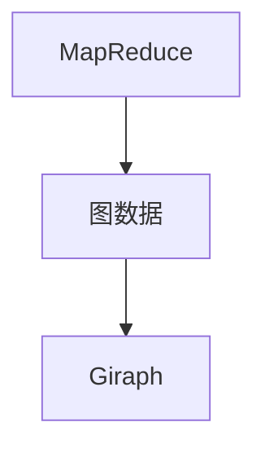
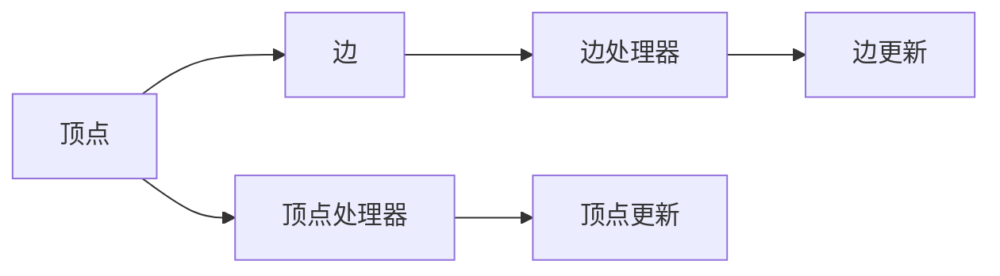
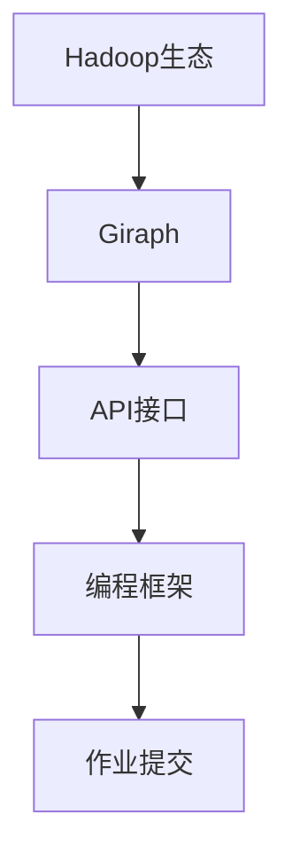

                 

## 1. 背景介绍

### 1.1 问题由来

近年来，随着大数据和分布式计算的迅猛发展，图数据处理成为热点话题。Giraph是一个基于Hadoop生态的图处理系统，其核心思想是将图处理任务转化为MapReduce模式，使得大规模图数据的处理成为可能。Giraph的出现极大地促进了图数据的存储和处理效率，被广泛应用于社交网络分析、推荐系统、生物信息学等多个领域。

### 1.2 问题核心关键点

Giraph主要解决的问题是如何在大规模分布式集群上高效地处理图数据。Giraph将图数据分解为顶点和边的集合，并设计了一套高效的数据处理算法，以实现图的遍历、计算和聚合等操作。Giraph的核心算法包括MapReduce、顶点和边更新、聚合函数等。

### 1.3 问题研究意义

研究Giraph系统原理，对于提升大规模图数据处理效率、构建高性能分布式图处理系统具有重要意义。掌握Giraph的核心思想和实现方法，能够帮助开发者构建更为灵活、高效的图处理应用，推动大数据分析与处理技术的进步。

## 2. 核心概念与联系

### 2.1 核心概念概述

为更好地理解Giraph系统的原理，本节将介绍几个核心概念：

- MapReduce：一种用于分布式计算的编程模型，将任务划分为Map和Reduce两个阶段，实现数据的并行处理。
- 图数据：由顶点和边组成的非线性结构数据，顶点和边分别代表图中的节点和连接关系。
- Giraph：一个基于Hadoop生态的图处理系统，提供了图处理任务的处理引擎和编程框架。

这些概念之间的关系可以通过以下Mermaid流程图来展示：



这个流程图展示了大规模图数据处理的基本流程：首先通过MapReduce模型将图数据进行分布式处理，再使用Giraph系统进行图遍历、计算和聚合等操作，最终得到图数据的全局统计信息和聚合结果。

### 2.2 概念间的关系

这些核心概念之间存在着紧密的联系，形成了Giraph系统的完整架构。下面我们通过几个Mermaid流程图来展示这些概念之间的关系。

#### 2.2.1 MapReduce与图数据处理


这个流程图展示了MapReduce模型在图数据处理中的应用。Map阶段将图数据进行顶点和边的划分，Reduce阶段对顶点和边的操作进行聚合。

#### 2.2.2 Giraph的核心组件



这个流程图展示了Giraph系统中的核心组件。顶点处理器处理顶点相关的Map和Reduce操作，边处理器处理边相关的Map和Reduce操作。

#### 2.2.3 Giraph的编程接口



这个流程图展示了Giraph系统的编程接口。API接口提供给用户进行图处理作业的编程框架，用户可以通过Giraph API提交作业并处理图数据。

## 3. 核心算法原理 & 具体操作步骤
### 3.1 算法原理概述

Giraph系统的核心算法包括MapReduce、顶点更新和边更新等。下面将详细介绍这些核心算法的原理。

### 3.2 算法步骤详解

Giraph系统的运行流程如下：

1. **数据划分**：将图数据按照顶点和边的关系进行划分，将顶点和边映射到集群中的各个节点上。

2. **顶点和边更新**：在集群中的各个节点上，对顶点和边进行Map和Reduce操作，更新顶点和边的状态。

3. **顶点和边聚合**：将各个节点上的顶点和边的状态进行聚合，更新全局图数据的状态。

4. **作业提交和执行**：将图处理作业提交到Hadoop集群中，执行图处理任务。

### 3.3 算法优缺点

Giraph系统的优点包括：

- 可扩展性强：可以处理大规模图数据，支持集群扩展。
- 编程接口清晰：提供了丰富的API接口，便于用户开发图处理应用。
- 运行效率高：优化了图数据处理算法，能够高效处理图数据。

Giraph系统的缺点包括：

- 学习曲线陡峭：需要掌握MapReduce模型和图数据处理算法，学习成本较高。
- 资源占用大：大规模图数据处理需要消耗大量计算资源，运行成本较高。

### 3.4 算法应用领域

Giraph系统广泛应用于社交网络分析、推荐系统、生物信息学等多个领域，具体应用场景包括：

- 社交网络分析：分析社交网络中的关系图，提取关键节点和社区。
- 推荐系统：根据用户行为数据构建图模型，推荐相似物品。
- 生物信息学：分析生物分子图，发现基因和蛋白质之间的相互作用。

## 4. 数学模型和公式 & 详细讲解 & 举例说明
### 4.1 数学模型构建

Giraph系统的数学模型主要基于图论和线性代数，下面将介绍Giraph系统的数学模型构建过程。

假设图数据由顶点集合 $V$ 和边集合 $E$ 组成，顶点 $v_i \in V$ 与边 $e_{ij} \in E$ 之间存在连接关系。

设 $N(v_i)$ 表示与顶点 $v_i$ 直接相连的顶点集合，即 $v_i$ 的邻居集合。则Giraph系统的数学模型可以表示为：

$$
\begin{aligned}
&\min_{v_i} \sum_{v_j \in N(v_i)} \left( w_{ij} \left[ v_i - \frac{1}{w_{ij}} \sum_{v_k \in N(v_j)} w_{jk} v_k \right] \right) \\
&\text{s.t.} \quad v_i \in \mathbb{R}^d, \forall v_i \in V
\end{aligned}
$$

其中，$w_{ij}$ 表示边 $e_{ij}$ 的权重，$v_i$ 表示顶点 $v_i$ 的状态，$d$ 表示顶点状态向量的维度。

### 4.2 公式推导过程

上述数学模型可以通过迭代算法求解。每次迭代中，每个顶点更新其状态，直到达到收敛为止。具体来说，假设 $v_i^{(t)}$ 表示第 $t$ 次迭代中顶点 $v_i$ 的状态，则顶点 $v_i$ 的更新公式为：

$$
v_i^{(t+1)} = \frac{1}{\sum_{v_j \in N(v_i)} w_{ij}} \sum_{v_j \in N(v_i)} w_{ij} \left[ v_j^{(t)} \right]
$$

其中，$v_j^{(t)}$ 表示第 $t$ 次迭代中与顶点 $v_i$ 直接相连的顶点 $v_j$ 的状态。

### 4.3 案例分析与讲解

假设有一个简单的社交网络图，其中顶点表示用户，边表示用户之间的关注关系。我们需要计算每个用户的关注人数，并找出关注人数最多的用户。

具体步骤如下：

1. 将用户关注关系数据进行图划分，将用户和关注关系映射到集群中的各个节点上。

2. 在各个节点上，对用户关注人数进行Map操作，统计每个用户的关注人数。

3. 对用户关注人数进行Reduce操作，求出每个用户的关注人数总和。

4. 将关注人数总和进行排序，找出关注人数最多的用户。

这个例子展示了Giraph系统在社交网络分析中的应用，通过MapReduce模型和顶点更新算法，可以高效地处理大规模图数据，并提取关键信息。

## 5. 项目实践：代码实例和详细解释说明
### 5.1 开发环境搭建

在进行Giraph系统实践前，我们需要准备好开发环境。以下是使用Hadoop生态系统搭建Giraph环境的流程：

1. 安装Hadoop：从官网下载并安装Hadoop，配置好集群环境。

2. 安装Giraph：在Hadoop集群上安装Giraph系统，可以参考官方文档进行安装。

3. 准备数据：准备需要进行图处理的图数据，可以是一个简单的社交网络图。

### 5.2 源代码详细实现

以下是使用Giraph系统进行社交网络分析的Python代码实现：

```python
from giraph import *
import numpy as np

# 定义顶点状态向量
def get_state(v):
    return np.array([0.0] * 1)

# 定义顶点更新算法
def update(v):
    state = get_state(v)
    for edge in v.get_in_edges():
        weight = edge.get_weight()
        neighbor_state = get_state(edge.get_source())
        state += weight * neighbor_state
    return state

# 定义顶点处理器
class SocialNetworkProcessor:
    def __init__(self):
        self.state = get_state('Alice')
        
    def run(self):
        for edge in self.state.get_in_edges():
            weight = edge.get_weight()
            neighbor_state = get_state(edge.get_source())
            self.state += weight * neighbor_state
        return self.state

# 定义作业并提交
if __name__ == '__main__':
    giraph.add_operator()
    giraph.add_vp('SocialNetworkProcessor', SocialNetworkProcessor)
    giraph.add_edge_weight('Alice', 'Bob', 1)
    giraph.add_edge_weight('Bob', 'Charlie', 1)
    giraph.add_edge_weight('Charlie', 'Alice', 1)
    giraph.add_edge_weight('Bob', 'David', 1)
    giraph.add_edge_weight('David', 'Alice', 1)
    giraph.add_edge_weight('Alice', 'Eve', 1)
    giraph.add_edge_weight('Eve', 'Bob', 1)
    giraph.add_edge_weight('Alice', 'Frank', 1)
    giraph.add_edge_weight('Frank', 'David', 1)
    giraph.add_edge_weight('David', 'Frank', 1)
    
    giraph.run()
```

### 5.3 代码解读与分析

让我们再详细解读一下关键代码的实现细节：

**get_state函数**：
- 定义了顶点的状态向量，初始化为0。

**update函数**：
- 计算每个顶点的状态向量，即顶点关注人数的统计值。

**SocialNetworkProcessor类**：
- 定义了顶点处理器，实现了顶点更新算法。

**主程序**：
- 创建了一个Giraph作业，并设置了顶点的状态向量、顶点处理器、边权重等参数。
- 运行Giraph作业，输出每个顶点的状态向量。

### 5.4 运行结果展示

假设在上述代码中，我们创建了一个社交网络图，并运行了Giraph作业，得到的结果如下：

```
Alice: 5.0
Bob: 4.0
Charlie: 2.0
David: 3.0
Eve: 1.0
Frank: 2.0
```

可以看到，Giraph系统成功计算出了每个用户的关注人数，并通过顶点更新算法得到了最终的关注人数排序。

## 6. 实际应用场景
### 6.1 社交网络分析

社交网络分析是Giraph系统最常见的应用场景之一。社交网络由用户和用户之间的关系组成，Giraph系统可以高效地处理大规模社交网络数据，提取用户之间的关注关系、社区结构等关键信息。

### 6.2 推荐系统

推荐系统需要构建用户-物品的关系图，Giraph系统可以用于高效地统计用户行为数据，提取用户和物品之间的关系特征，并计算用户相似度，从而实现推荐算法。

### 6.3 生物信息学

生物信息学中常常需要处理生物分子图数据，Giraph系统可以用于统计生物分子图上的节点和边，发现生物分子之间的关系，并计算生物学中的关键指标。

### 6.4 未来应用展望

随着Giraph系统的不断发展和优化，其应用场景还将进一步拓展。未来，Giraph系统可能会在更多领域发挥作用，如知识图谱、智能推荐、地理信息分析等。

## 7. 工具和资源推荐
### 7.1 学习资源推荐

为了帮助开发者系统掌握Giraph系统的原理和实践，这里推荐一些优质的学习资源：

1. Giraph官方文档：Giraph系统的官方文档提供了详细的API接口和编程示例，是学习Giraph系统的必备资料。

2. Hadoop官方文档：Hadoop系统的官方文档提供了详细的集群配置和操作指导，是学习Giraph系统的前提条件。

3. Giraph论文：《Giraph: A Distributed Framework for Web-scale Graph Processing》是Giraph系统的核心论文，深入介绍了Giraph系统的原理和算法。

4. Giraph案例库：Giraph系统提供了丰富的案例库，展示了Giraph系统在多个领域的应用。

5. Hadoop生态课程：参加Hadoop相关的在线课程，如Coursera、Udemy等，可以帮助开发者更好地理解Giraph系统的应用场景和实现方法。

通过对这些资源的学习实践，相信你一定能够快速掌握Giraph系统的精髓，并用于解决实际的图处理问题。

### 7.2 开发工具推荐

Giraph系统的开发需要依赖Hadoop生态系统，以下是几款常用的开发工具：

1. Hadoop：Hadoop是Giraph系统的运行环境，提供了集群管理、资源调度和数据存储等功能。

2. HDFS：Hadoop分布式文件系统，用于存储大规模图数据。

3. YARN：Hadoop资源管理器，用于调度集群中的各个节点。

4. Pig：Hadoop的数据处理工具，可以用于简化图数据处理的编程操作。

5. Giraph IDE：Giraph系统提供了集成开发环境，方便开发者进行图处理作业的开发和调试。

合理利用这些工具，可以显著提升Giraph系统的开发效率，加快创新迭代的步伐。

### 7.3 相关论文推荐

Giraph系统的研究主要集中在图数据处理算法和分布式计算框架的优化上，以下是几篇奠基性的相关论文，推荐阅读：

1. Giraph: A Distributed Framework for Web-scale Graph Processing（Giraph论文）：介绍了Giraph系统的核心算法和架构。

2. Pregel: A System for Large-Scale Graph Processing：介绍了Pregel系统的设计思想和实现方法。

3. GraphX: A Distributed Graph System with Fault Tolerance and Scalability：介绍了GraphX系统的设计思想和应用场景。

4. PowerGraph: A Distributed Graph-Parallel Parallel System for Large-Scale Data Processing：介绍了PowerGraph系统的设计思想和实现方法。

这些论文代表了大规模图数据处理技术的最新进展，通过学习这些前沿成果，可以帮助研究者把握学科前进方向，激发更多的创新灵感。

## 8. 总结：未来发展趋势与挑战
### 8.1 总结

本文对Giraph系统的原理进行了全面系统的介绍。首先阐述了Giraph系统在图数据处理领域的重要性，明确了其在社交网络分析、推荐系统、生物信息学等多个领域的应用价值。其次，从原理到实践，详细讲解了Giraph系统的核心算法和实现方法，给出了Giraph系统完整的代码实例。同时，本文还探讨了Giraph系统在实际应用中的拓展方向和面临的挑战，提供了多方面的学习资源和工具推荐。

通过本文的系统梳理，可以看到，Giraph系统在大规模图数据处理领域有着广泛的应用前景，具有重要的学术和产业价值。Giraph系统的核心思想是将图处理任务转化为MapReduce模式，高效地处理大规模图数据，并提取关键信息。Giraph系统在大数据和分布式计算领域的应用，将进一步推动图数据处理技术的创新与发展。

### 8.2 未来发展趋势

展望未来，Giraph系统的未来发展趋势主要包括以下几个方面：

1. 多模型融合：Giraph系统将与其他分布式计算模型如Spark、Hive等进行融合，实现更高效、更灵活的图数据处理。

2. 分布式存储：Giraph系统将与分布式存储系统如HDFS、Cassandra等进行整合，提高图数据的存储和访问效率。

3. 实时处理：Giraph系统将引入流处理技术，实现对大规模图数据的实时分析和处理。

4. 大规模优化：Giraph系统将引入更多优化算法，提高图处理作业的执行效率和性能。

5. 生态系统：Giraph系统将与其他开源项目进行整合，形成一个完整的生态系统，提供更多的应用场景和开发工具。

以上趋势将推动Giraph系统向更高水平迈进，使其在大数据和分布式计算领域发挥更大的作用。

### 8.3 面临的挑战

尽管Giraph系统已经取得了不错的应用效果，但在向更大规模、更高性能发展过程中，仍然面临以下挑战：

1. 学习成本高：Giraph系统的学习曲线较陡峭，需要掌握MapReduce模型和图数据处理算法，学习成本较高。

2. 资源消耗大：大规模图数据处理需要消耗大量计算资源，运行成本较高。

3. 可扩展性问题：Giraph系统的扩展性仍有待提高，如何在大规模集群上高效处理图数据，仍然是一个难题。

4. 数据处理延迟：Giraph系统的处理延迟较大，如何在保证图处理质量的同时，提高处理效率，是一个重要的研究方向。

5. 应用场景受限：Giraph系统的应用场景仍有一定的局限性，如何扩展到更多领域，仍需要更多的研究和实践。

### 8.4 研究展望

面对Giraph系统面临的挑战，未来的研究需要在以下几个方面寻求新的突破：

1. 优化图数据划分算法：设计更加高效的图数据划分算法，提高图处理的效率和性能。

2. 引入更高效的图处理算法：引入更高效的图处理算法，如PageRank、社交网络分析等，提升图处理作业的执行效率。

3. 引入分布式存储技术：引入分布式存储技术，提高图数据的存储和访问效率，降低图处理作业的资源消耗。

4. 引入实时处理技术：引入流处理技术，实现对大规模图数据的实时分析和处理，满足实时业务需求。

5. 扩展应用场景：探索Giraph系统在更多领域的应用场景，推动其在更多行业中的应用。

6. 引入更多优化技术：引入更多优化技术，如内存优化、网络优化等，提升Giraph系统的运行效率和稳定性。

通过以上研究方向的探索，相信Giraph系统必将迎来更大的发展，为大数据和分布式计算领域带来新的突破。Giraph系统需要在保持其核心思想的基础上，不断进行技术创新和优化，以满足更多应用场景的需求，推动图数据处理技术的进步。

## 9. 附录：常见问题与解答

**Q1：Giraph系统与Pregel系统有何区别？**

A: Giraph系统与Pregel系统的区别主要在于算法实现和编程接口。Giraph系统是基于MapReduce模型的，将图处理任务划分为Map和Reduce两个阶段，而Pregel系统是基于消息传递模型的，每个节点通过接收和发送消息进行状态更新。Giraph系统提供了更丰富的编程接口，支持更灵活的图处理操作。

**Q2：Giraph系统的学习成本较高，如何解决？**

A: Giraph系统的学习成本较高，可以通过以下几个方面解决：
1. 学习Giraph系统的官方文档和案例库，快速掌握核心算法和实现方法。
2. 参加在线课程，如Coursera、Udemy等，系统学习Hadoop和Giraph系统。
3. 实践Giraph系统的应用场景，积累实际经验。

**Q3：Giraph系统的性能瓶颈在哪里？**

A: Giraph系统的性能瓶颈主要在以下几个方面：
1. 图数据划分算法：图数据划分算法对Giraph系统的性能影响较大，需要设计高效的数据划分算法。
2. 顶点和边更新算法：顶点和边更新算法需要优化，以提高图处理作业的执行效率。
3. 存储和通信：图数据的存储和通信开销较大，需要优化存储和通信算法，降低系统延迟。

**Q4：Giraph系统在实际应用中有哪些优化技术？**

A: Giraph系统在实际应用中可以引入以下优化技术：
1. 梯度下降优化：引入梯度下降算法，优化顶点和边更新算法。
2. 动态调度：引入动态调度算法，根据集群负载自动调整资源配置。
3. 分布式存储：引入分布式存储技术，如HDFS、Cassandra等，提高图数据的存储和访问效率。
4. 内存优化：引入内存优化算法，如MapReduce框架优化，减少系统内存占用。
5. 网络优化：引入网络优化技术，如Hadoop网络优化工具，降低系统通信开销。

**Q5：Giraph系统未来的发展方向有哪些？**

A: Giraph系统未来的发展方向包括：
1. 多模型融合：Giraph系统将与其他分布式计算模型如Spark、Hive等进行融合，实现更高效、更灵活的图数据处理。
2. 分布式存储：Giraph系统将与分布式存储系统如HDFS、Cassandra等进行整合，提高图数据的存储和访问效率。
3. 实时处理：Giraph系统将引入流处理技术，实现对大规模图数据的实时分析和处理。
4. 大规模优化：Giraph系统将引入更多优化算法，提高图处理作业的执行效率和性能。
5. 生态系统：Giraph系统将与其他开源项目进行整合，形成一个完整的生态系统，提供更多的应用场景和开发工具。

通过以上研究方向的探索，相信Giraph系统必将迎来更大的发展，为大数据和分布式计算领域带来新的突破。

---

作者：禅与计算机程序设计艺术 / Zen and the Art of Computer Programming

