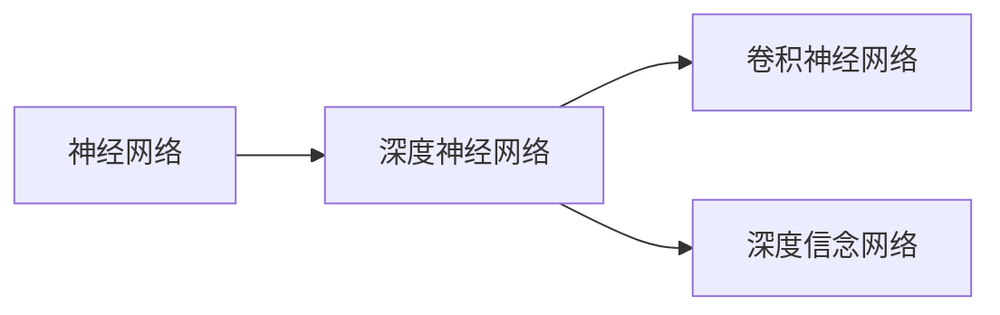

                 

# Hinton、LeCun、Bengio：AI算法的先驱

在这篇技术博客文章中，我们将深入探讨深度学习领域的巨擘Hinton、LeCun和Bengio三位科学家的贡献和影响，他们被普遍认为开创了深度学习时代，推动了人工智能算法的发展，并对现代技术产生了深远的影响。

## 1. 背景介绍

深度学习，作为人工智能研究中的一个重要分支，通过使用多层次的非线性处理单元来模拟人脑的神经网络，进而实现对复杂数据的处理和识别。而深度学习算法的发展，离不开三位关键人物——Geoffrey Hinton, Yann LeCun和Yoshua Bengio的推动。

### 1.1 三位先驱简介

- **Geoffrey Hinton**：加拿大科学家，被称为深度学习之父，他对深度学习领域的研究和推广起到了关键作用。Hinton的主要研究方向包括深度神经网络、神经计算理论、非线性信息处理系统等。
- **Yann LeCun**：法国计算机科学家，他的研究涵盖了卷积神经网络、深度学习等诸多领域，被誉为计算机视觉领域的先驱。
- **Yoshua Bengio**：加拿大科学家，他的工作在自然语言处理和深度学习领域影响深远，致力于构建能够理解人类语言的智能系统。

### 1.2 深度学习的发展历程

深度学习的发展可以分为几个关键阶段：

1. **早期研究（1950s - 1980s）**：这一时期的深度学习研究主要以规则化符号模型为主，例如感知器和前馈神经网络。
2. **卷积神经网络（1990s）**：LeCun和Bengio提出卷积神经网络，在图像识别和语音识别等任务中取得了显著进展。
3. **深度信念网络（1990s - 2000s）**：Hinton等人提出深度信念网络（DBN），为深度学习提供了重要的理论基础。
4. **深度学习普及（2010s - 现在）**：Hinton、LeCun和Bengio等人推动深度学习在各领域的广泛应用，包括计算机视觉、自然语言处理、语音识别等。

## 2. 核心概念与联系

### 2.1 核心概念概述

为了更好地理解Hinton、LeCun和Bengio在深度学习中的贡献，我们首先需要了解几个关键概念：

- **神经网络（Neural Networks）**：一种受生物神经网络启发，由大量处理单元（神经元）组成的计算模型。
- **深度神经网络（Deep Neural Networks, DNNs）**：神经网络层数较多，能够处理非常复杂的数据，尤其是图像和语音数据。
- **卷积神经网络（Convolutional Neural Networks, CNNs）**：一种特殊类型的神经网络，广泛应用于图像识别、视频处理等领域。
- **深度信念网络（Deep Belief Networks, DBNs）**：一种多层非线性概率模型，能够自发学习数据的分布特性。

这些概念之间有着密切的联系，神经网络是深度学习的基础，深度神经网络通过多层非线性变换处理复杂数据，卷积神经网络在图像识别中特别有效，深度信念网络则提供了一种自发学习分布特性的方法。

### 2.2 核心概念之间的关系

下面我们用一个Mermaid流程图来展示这些核心概念之间的联系：



神经网络是深度神经网络的基础，深度神经网络进一步发展出了卷积神经网络用于处理图像数据，而深度信念网络提供了一种有效的多层非线性模型。Hinton、LeCun和Bengio在这三个领域都有重要的贡献。

## 3. 核心算法原理 & 具体操作步骤

### 3.1 算法原理概述

深度学习算法的基本原理是通过神经网络的多层非线性变换，对输入数据进行特征提取和分类。下面简要介绍深度学习的几个基本原理：

- **前向传播（Forward Propagation）**：数据从输入层开始，经过各个隐藏层和输出层，最终得到模型的预测结果。
- **反向传播（Backpropagation）**：根据预测结果与真实标签的误差，反向调整各层神经元的权重和偏置，以最小化损失函数。
- **梯度下降（Gradient Descent）**：一种优化算法，通过计算损失函数的梯度，逐步调整模型参数，直至收敛。
- **卷积神经网络（CNNs）**：利用卷积和池化操作，对图像数据进行特征提取和降维。
- **深度信念网络（DBNs）**：通过逐层逐次训练，构建一个多层非线性模型，用于分布特性学习。

### 3.2 算法步骤详解

深度学习的训练过程一般包括以下步骤：

1. **数据准备**：收集和标注数据，准备训练集、验证集和测试集。
2. **模型构建**：选择或设计合适的神经网络架构，如卷积神经网络、深度信念网络等。
3. **模型训练**：使用梯度下降等优化算法，通过反向传播调整模型参数，最小化损失函数。
4. **模型评估**：在验证集上评估模型性能，防止过拟合。
5. **模型微调**：根据测试集表现，调整模型超参数，优化模型性能。
6. **模型应用**：将训练好的模型应用于实际任务，进行推理预测。

### 3.3 算法优缺点

深度学习的优点包括：

- **强大的特征提取能力**：通过多层非线性变换，能够自动学习复杂数据的特征表示。
- **高泛化能力**：在大量数据训练下，深度学习模型具有较好的泛化能力，能够适应新数据的分布。
- **端到端学习**：深度学习可以处理从数据到输出的全过程，无需手动设计中间特征。

深度学习的缺点包括：

- **计算资源消耗大**：神经网络参数量大，计算复杂度高，需要大量计算资源。
- **模型解释困难**：深度学习模型较为复杂，难以解释其内部机制和决策过程。
- **过拟合风险**：由于参数多，容易发生过拟合，需要更多的正则化手段。

### 3.4 算法应用领域

深度学习在多个领域取得了显著成果：

- **计算机视觉**：如图像分类、目标检测、人脸识别等。
- **自然语言处理**：如机器翻译、情感分析、语言模型等。
- **语音识别**：如语音合成、自动语音识别等。
- **推荐系统**：如商品推荐、新闻推荐等。
- **游戏AI**：如围棋AI、电子游戏AI等。

## 4. 数学模型和公式 & 详细讲解 & 举例说明

### 4.1 数学模型构建

以卷积神经网络（CNNs）为例，其数学模型可以表示为：

$$
\mathcal{L} = \frac{1}{N}\sum_{i=1}^N L(f_{\theta}(x_i),y_i)
$$

其中，$f_{\theta}$ 表示卷积神经网络的前向传播过程，$x_i$ 表示输入样本，$y_i$ 表示标签，$L$ 表示损失函数，$N$ 表示样本数量。

### 4.2 公式推导过程

以卷积层为例，其公式推导过程如下：

- **输入特征图**：设输入特征图大小为 $H \times W \times C$，卷积核大小为 $K \times K$，步幅为 $S$，输出特征图大小为 $O$，则卷积操作可以表示为：
  $$
  X_{ij} = \sum_{m=0}^{K-1} \sum_{n=0}^{K-1} W_{mn} X_{i'j'} + b
  $$
  其中 $i', j'$ 为卷积核在输入特征图中的位置，$X_{ij}$ 为输出特征图对应位置。

- **池化操作**：常用的池化操作包括最大池化和平均池化，可以表示为：
  $$
  \text{max pooling: } X_{ij} = \max(X_{i'S'} + X_{i'S'} + \dots + X_{i'S'} + b)
  $$
  $$
  \text{average pooling: } X_{ij} = \frac{1}{S} \sum_{k=0}^{S-1} X_{i'S'}
  $$

### 4.3 案例分析与讲解

以手写数字识别为例，通过卷积神经网络可以处理28x28的灰度图像，将其转化为10维的类别表示。具体过程如下：

1. **输入层**：将28x28的图像展开为784维向量。
2. **卷积层**：使用多个卷积核进行特征提取，得到多个特征图。
3. **池化层**：对特征图进行池化，减小特征维度。
4. **全连接层**：将特征图展平后输入全连接层，进行分类。

## 5. 项目实践：代码实例和详细解释说明

### 5.1 开发环境搭建

搭建深度学习开发环境需要以下步骤：

1. **安装Python**：选择Python 3.6或以上版本，可以使用Anaconda或Miniconda进行安装。
2. **安装深度学习库**：使用pip或conda安装TensorFlow、PyTorch等深度学习库。
3. **安装数据集**：下载和准备用于训练和测试的数据集，如MNIST、CIFAR等。

### 5.2 源代码详细实现

以使用TensorFlow实现手写数字识别为例，代码如下：

```python
import tensorflow as tf
from tensorflow.keras import layers, models

# 加载数据集
(x_train, y_train), (x_test, y_test) = tf.keras.datasets.mnist.load_data()

# 预处理数据
x_train = x_train.reshape(x_train.shape[0], 28, 28, 1).astype('float32') / 255.0
x_test = x_test.reshape(x_test.shape[0], 28, 28, 1).astype('float32') / 255.0
y_train = tf.keras.utils.to_categorical(y_train, 10)
y_test = tf.keras.utils.to_categorical(y_test, 10)

# 定义模型
model = models.Sequential([
    layers.Conv2D(32, (3, 3), activation='relu', input_shape=(28, 28, 1)),
    layers.MaxPooling2D((2, 2)),
    layers.Conv2D(64, (3, 3), activation='relu'),
    layers.MaxPooling2D((2, 2)),
    layers.Flatten(),
    layers.Dense(64, activation='relu'),
    layers.Dense(10, activation='softmax')
])

# 编译模型
model.compile(optimizer='adam', loss='categorical_crossentropy', metrics=['accuracy'])

# 训练模型
model.fit(x_train, y_train, epochs=10, batch_size=128, validation_data=(x_test, y_test))
```

### 5.3 代码解读与分析

上述代码中，我们首先加载了MNIST数据集，并对图像数据进行了预处理。然后定义了一个卷积神经网络模型，包含两个卷积层、两个池化层和两个全连接层。最后，使用Adam优化器和交叉熵损失函数进行模型编译和训练。

## 6. 实际应用场景

### 6.1 智能监控

深度学习在智能监控系统中应用广泛，可以用于行人检测、车辆识别、行为分析等。通过在监控视频中提取特征，深度学习模型可以实时分析视频内容，自动标记异常行为，从而提高监控系统的效率和安全性。

### 6.2 医疗诊断

深度学习在医疗领域可以用于图像识别、自然语言处理等任务，如辅助医生进行疾病诊断、病理分析等。通过训练深度学习模型，能够提高诊断的准确性和效率，减轻医生的工作负担。

### 6.3 自动驾驶

深度学习在自动驾驶领域可以用于环境感知、行为预测、路径规划等任务。通过在车辆传感器上安装深度学习模型，能够实时处理交通信号、行人、车辆等信息，从而实现自动驾驶。

### 6.4 未来应用展望

未来，深度学习将在更多领域得到应用，例如：

- **人机交互**：通过自然语言处理技术，实现更智能、自然的对话系统。
- **智慧城市**：通过深度学习技术，实现智能交通管理、智能安防、智慧环保等。
- **个性化推荐**：通过深度学习技术，实现更精准、高效的个性化推荐系统。
- **工业互联网**：通过深度学习技术，实现智能制造、智能物流等。

## 7. 工具和资源推荐

### 7.1 学习资源推荐

- **《深度学习》书籍**：Ian Goodfellow、Yoshua Bengio和Aaron Courville合著的《深度学习》（Deep Learning）一书，是深度学习领域的经典教材，详细介绍了深度学习的原理和应用。
- **Coursera深度学习课程**：由Andrew Ng主讲的深度学习课程，涵盖深度学习的基础理论和实践技巧，适合初学者入门。
- **GitHub深度学习项目**：GitHub上众多开源的深度学习项目，包括卷积神经网络、深度信念网络等，可以作为学习和实践的参考。

### 7.2 开发工具推荐

- **TensorFlow**：由Google开发的深度学习框架，支持GPU加速，适合大规模训练和部署。
- **PyTorch**：由Facebook开发的深度学习框架，灵活性高，易于使用。
- **Keras**：基于TensorFlow和Theano的高级深度学习库，易于上手，适合快速开发原型。
- **Jupyter Notebook**：一个交互式的编程环境，适合进行深度学习实验和论文写作。

### 7.3 相关论文推荐

- **ImageNet Classification with Deep Convolutional Neural Networks**：Hinton等人提出的卷积神经网络在ImageNet图像分类任务中取得了优异成绩。
- **Ladder Network**：Hinton等人提出的深度信念网络，能够自发学习数据分布特性。
- **LSTM: A Search Space Optimization Method**：Hochreiter和Schmidhuber提出的长短时记忆网络（LSTM），在序列建模任务中表现优异。

## 8. 总结：未来发展趋势与挑战

### 8.1 研究成果总结

Hinton、LeCun和Bengio在深度学习领域的研究成果，奠定了深度学习技术的基础，推动了人工智能技术的发展。他们在神经网络、卷积神经网络、深度信念网络等方面的突破，极大地提升了深度学习模型的性能和应用范围。

### 8.2 未来发展趋势

深度学习技术的未来发展趋势包括：

- **模型更加高效**：未来的深度学习模型将更加轻量级、高效，能够实时处理大规模数据。
- **模型更加普适**：未来的深度学习模型将具备更强的通用性，能够适应各种应用场景。
- **跨领域应用**：深度学习将在更多领域得到应用，如医疗、交通、金融等。
- **可解释性增强**：未来的深度学习模型将具备更好的可解释性，能够被人类理解和信任。
- **伦理和安全**：深度学习模型需要考虑伦理和安全性问题，避免对社会产生负面影响。

### 8.3 面临的挑战

深度学习技术在发展过程中仍面临以下挑战：

- **计算资源消耗大**：深度学习模型参数量大，计算复杂度高，需要大量计算资源。
- **模型解释困难**：深度学习模型较为复杂，难以解释其内部机制和决策过程。
- **过拟合风险**：由于参数多，容易发生过拟合，需要更多的正则化手段。
- **数据隐私问题**：深度学习模型需要大量数据进行训练，数据隐私问题需要引起重视。
- **伦理和安全**：深度学习模型需要考虑伦理和安全性问题，避免对社会产生负面影响。

### 8.4 研究展望

未来，深度学习技术的研究方向包括：

- **模型压缩**：通过模型压缩和剪枝等技术，减少模型的参数量，降低计算资源消耗。
- **可解释性增强**：通过引入可解释性技术，提高深度学习模型的可解释性和透明性。
- **跨领域应用**：将深度学习技术应用到更多领域，如医疗、交通、金融等。
- **伦理和安全**：在深度学习模型设计中引入伦理和安全约束，确保其对社会产生积极影响。

总之，Hinton、LeCun和Bengio的研究成果为深度学习技术的发展奠定了坚实基础。未来，我们需要在模型效率、可解释性、应用范围等方面继续努力，推动深度学习技术的进一步发展。

## 9. 附录：常见问题与解答

### Q1: 深度学习算法如何克服过拟合问题？

A: 过拟合是深度学习中常见的问题，解决方法包括：

- **正则化**：在损失函数中引入正则项，如L2正则化、Dropout等。
- **数据增强**：通过对训练数据进行旋转、翻转、裁剪等操作，增加数据样本数量。
- **早停法**：在验证集上监控模型性能，当性能不再提升时，停止训练。

### Q2: 深度学习算法如何提高模型的可解释性？

A: 提高模型可解释性的方法包括：

- **模型可视化**：通过可视化技术，展示模型内部结构和工作机制。
- **可解释模型**：使用决策树、线性回归等可解释模型，替代深度学习模型。
- **特征重要性**：使用特征重要性分析技术，评估模型中各个特征的作用。

### Q3: 深度学习算法在实际应用中需要注意哪些问题？

A: 深度学习算法在实际应用中需要注意的问题包括：

- **数据隐私保护**：在使用深度学习模型时，需要保护用户数据隐私。
- **伦理和社会影响**：深度学习模型需要考虑伦理和社会影响，避免对社会产生负面影响。
- **模型性能评估**：需要评估模型在不同数据集上的性能，确保模型具有良好的泛化能力。

---

作者：禅与计算机程序设计艺术 / Zen and the Art of Computer Programming

