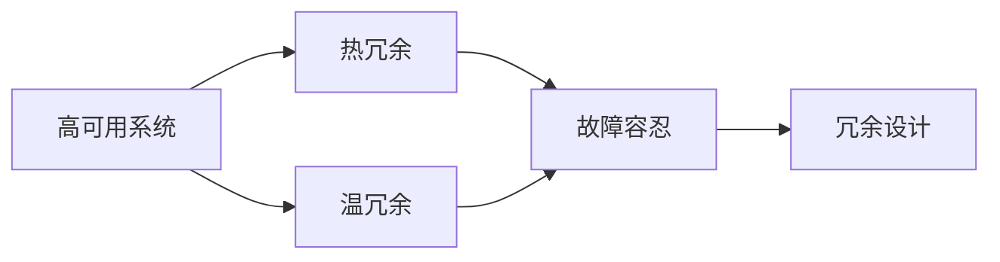

                 

# Hot-Warm冗余设计详解

> 关键词：冗余设计,热冗余,温冗余,备份技术,故障容忍,高可用系统

## 1. 背景介绍

在现代IT基础设施中，冗余设计（Redundancy Design）是一个至关重要的概念，用于提高系统的高可用性、可靠性和容错能力。特别是在关键性高的应用场景下，如在线金融交易系统、大型数据中心、电信网络等，冗余设计尤为重要。冗余设计通过构建多副本和备选方案，当系统出现故障或异常时，能够迅速切换到备用系统，保障业务的连续性和稳定运行。

本文将深入探讨热冗余（Hot Redundancy）和温冗余（Warm Redundancy）这两种冗余设计策略，详细讲解其实现原理、具体操作步骤以及在不同场景中的应用。通过理论分析和实际案例，相信你能够深刻理解冗余设计的重要性，并在实践中灵活应用，提升系统可靠性。

## 2. 核心概念与联系

### 2.1 核心概念概述

在介绍Hot-Warm冗余设计之前，先回顾一些核心概念：

- **高可用系统（Highly Available System）**：指一个系统能够在无计划故障和意外故障时提供服务的概率。通常要求服务可用时间达到99.999%（4个9）。
- **热冗余（Hot Redundancy）**：指系统各组件之间保持完全同步或准同步，即在一个组件发生故障时，其备份组件能够瞬间接管工作，无服务中断。
- **温冗余（Warm Redundancy）**：指系统各组件之间存在轻微的时延或数据一致性问题，当一个组件发生故障时，其备份组件会经历一段过渡期后接管工作，存在短暂的服务中断。
- **故障容忍（Fault Tolerance）**：指系统在面对单一或部分组件故障时，仍能继续提供服务的能力。
- **冗余设计（Redundancy Design）**：通过构建冗余组件、备份系统等，以提高系统的整体可靠性，当主要系统或组件发生故障时，冗余设计能够提供即时的替代方案。

这些概念之间的联系如下图所示：



以上流程图展示了高可用系统、热冗余、温冗余、故障容忍和冗余设计之间的逻辑关系：

1. 高可用系统是冗余设计的目标，通过热冗余和温冗余等策略来实现。
2. 故障容忍是冗余设计的重要特性，即系统在面对部分组件故障时仍能正常工作。
3. 热冗余和温冗余通过构建冗余组件、备份系统等方式，增强系统的故障容忍能力，进而提高高可用性。

### 2.2 概念间的关系

冗余设计的核心目标是提升系统的故障容忍能力，确保业务的连续性和稳定性。具体而言，热冗余和温冗余是实现故障容忍的关键手段：

- **热冗余**：通过实时复制和同步机制，保持冗余组件之间的状态一致，当主组件发生故障时，其热备份组件能够迅速接管服务，实现无间断的服务切换。
- **温冗余**：在热冗余的实现基础上，通过引入一定的延迟和数据一致性检查，增强系统的容错性和可靠性。温冗余通常比热冗余具有更高的实现成本和复杂度，但也能提供更高的业务连续性和用户体验。

热冗余和温冗余设计的应用场景各异，选择合适的冗余策略需要根据具体业务需求和资源条件进行权衡。

## 3. 核心算法原理 & 具体操作步骤
### 3.1 算法原理概述

冗余设计依赖于两个核心技术：**同步复制（Replication）**和**故障切换（Failover）**。同步复制实现组件的实时复制和同步，确保冗余组件之间状态一致。故障切换机制在主组件故障时，迅速切换到热备份组件，保障服务的连续性。

### 3.2 算法步骤详解

冗余设计的具体步骤包括：

1. **选择同步复制技术**：根据业务需求选择合适的同步复制方案，如主从复制、多主复制、分布式锁等。
2. **部署冗余组件**：在服务器、存储、网络等基础设施上部署冗余组件，确保关键组件能够实时复制和同步。
3. **配置故障切换策略**：定义故障切换的触发条件、优先级和处理逻辑，确保故障切换的可靠性和效率。
4. **进行故障切换测试**：定期进行故障切换测试，验证冗余系统的可靠性，修复潜在问题。
5. **监控和优化**：部署实时监控系统，对冗余系统的状态进行监控，及时发现和解决问题，优化系统性能。

### 3.3 算法优缺点

热冗余和温冗余设计各有优缺点：

**热冗余的优点**：
- 实现简单，故障切换速度快，用户体验好。
- 故障容忍能力强，能够容忍单点故障，提高系统的整体可靠性。

**热冗余的缺点**：
- 成本较高，需要额外的硬件和网络资源。
- 实现复杂，需要高性能的网络和存储系统支持。
- 故障切换过程中，可能存在极短的服务中断。

**温冗余的优点**：
- 实现成本较低，适合预算有限的情况。
- 用户体验较好，数据一致性问题得到一定程度的解决。

**温冗余的缺点**：
- 故障切换时间较长，可能存在较明显的服务中断。
- 数据一致性无法完全保证，存在一定的延迟和不确定性。

### 3.4 算法应用领域

热冗余和温冗余设计广泛应用于多个领域，包括但不限于：

- **数据中心**：构建数据中心的多节点备份系统，确保关键数据的安全性和高可用性。
- **金融交易系统**：构建实时交易系统的多副本和故障切换机制，保障交易系统的稳定性和连续性。
- **电信网络**：构建电信网络的冗余路由和备份节点，提高网络的服务可靠性和容错能力。
- **在线服务**：构建在线服务的冗余部署和故障切换机制，保障服务的连续性和用户体验。
- **生产环境**：构建生产环境的故障容忍系统，如分布式数据库、缓存系统等，提升业务连续性。

热冗余和温冗余设计为不同应用场景提供了可靠性和容错性保障，是现代IT基础设施建设的重要组成部分。

## 4. 数学模型和公式 & 详细讲解
### 4.1 数学模型构建

冗余设计涉及到系统状态转移、故障容忍度、业务连续性等概念，下面通过数学模型来描述这些概念。

定义系统组件数为 $n$，故障容忍度为 $k$，即系统能够容忍最多 $k$ 个组件故障。在热冗余设计中，如果主组件发生故障，热备份组件能够立即接管工作，故障容忍度为 $k=1$。在温冗余设计中，故障容忍度为 $k>1$，即备份组件需要经过一定的时间延迟和状态验证后，才能接管服务。

定义系统故障概率为 $p$，冗余组件的故障概率为 $q$，则系统的故障容忍度为：

$$
k = \frac{n}{n-k}
$$

系统的故障容忍度与冗余组件的数量成正比。当 $n \gg k$ 时，$k \approx n$，即系统能够容忍全部组件故障，实现全冗余设计。

### 4.2 公式推导过程

以热冗余设计为例，考虑一个两节点系统 $A$ 和 $B$，其中 $A$ 为主节点，$B$ 为备份节点。定义节点故障概率为 $p=0.01$，切换延迟为 $\Delta t=1s$，则系统状态转移矩阵为：

$$
\mathbf{T} = \begin{bmatrix}
1-p & p & 0 & 0 \\
0 & 0 & p & 1-p \\
0 & 1-p & 0 & p \\
p & 0 & 1-p & 0
\end{bmatrix}
$$

其中，第 $i$ 行第 $j$ 列表示从状态 $i$ 到状态 $j$ 的转移概率。

在热冗余设计中，当 $A$ 发生故障时，$B$ 立即接管工作，切换时间 $\Delta t$ 极短，近似为 $\Delta t=0$。系统状态转移矩阵简化为：

$$
\mathbf{T} = \begin{bmatrix}
1-p & p & 0 & 0 \\
0 & 0 & p & 1-p \\
0 & 1-p & 0 & p
\end{bmatrix}
$$

系统状态转移方程为：

$$
\mathbf{X}_{t+1} = \mathbf{T} \cdot \mathbf{X}_t
$$

其中 $\mathbf{X}_t$ 表示第 $t$ 时刻系统状态，$\mathbf{X}_{t+1}$ 表示第 $t+1$ 时刻系统状态。系统最终状态为 $\mathbf{X}_t$ 中的所有 $1$，表示系统正常运行。

在温冗余设计中，切换时间 $\Delta t$ 较长，系统状态转移矩阵为：

$$
\mathbf{T} = \begin{bmatrix}
1-p & p & 0 & 0 \\
0 & 0 & p & 1-p \\
0 & 1-p & 0 & p \\
p & 0 & 1-p & 0
\end{bmatrix}
$$

系统状态转移方程为：

$$
\mathbf{X}_{t+1} = \mathbf{T} \cdot \mathbf{X}_t
$$

其中，$\Delta t$ 为切换延迟时间，系统最终状态为 $\mathbf{X}_t$ 中的所有 $1$，表示系统正常运行。

### 4.3 案例分析与讲解

以一个两节点数据库系统的冗余设计为例，假设系统由主节点 $A$ 和备份节点 $B$ 组成，节点故障概率为 $p=0.01$，切换延迟为 $\Delta t=1s$，则系统故障容忍度为：

1. **热冗余设计**：
   - 当 $A$ 发生故障时，$B$ 立即接管工作，切换时间 $\Delta t=0$。
   - 系统状态转移矩阵为 $\mathbf{T}$。
   - 系统最终状态为 $\mathbf{X}_t$ 中的所有 $1$。

2. **温冗余设计**：
   - 当 $A$ 发生故障时，$B$ 需要经过 $\Delta t=1s$ 的延迟后接管工作。
   - 系统状态转移矩阵为 $\mathbf{T}$。
   - 系统最终状态为 $\mathbf{X}_t$ 中的所有 $1$。

在实际应用中，热冗余和温冗余设计的差异主要体现在切换延迟和数据一致性上。选择合适的冗余策略需要根据具体业务需求和资源条件进行权衡。

## 5. 项目实践：代码实例和详细解释说明
### 5.1 开发环境搭建

冗余设计通常涉及多节点系统的部署和配置，以下以热冗余设计为例，展示冗余系统的搭建步骤：

1. **选择硬件设备**：选择合适的服务器、存储设备、网络设备等硬件资源。
2. **安装操作系统**：在所有节点上安装相同的操作系统和基础库，保证一致性。
3. **安装冗余软件**：安装冗余系统的软件包，如主从复制工具、分布式锁等。
4. **配置网络环境**：设置正确的IP地址和网络环境，确保各节点之间的通信。
5. **测试冗余系统**：通过模拟故障场景，测试冗余系统的故障容忍能力和切换效率。

### 5.2 源代码详细实现

以主从复制为例，展示冗余系统的实现步骤：

1. **主节点配置**：
   ```python
   from rpyc import Service
   
   class MasterService(Service):
       def set_data(self, data):
           self.data = data
           return data
   
       def get_data(self):
           return self.data
   ```

2. **备份节点配置**：
   ```python
   from rpyc import Service
   
   class BackupService(Service):
       def __init__(self):
           super().__init__()
           self.data = None
           
       def set_data(self, data):
           self.data = data
           return data
   
       def get_data(self):
           return self.data
   ```

3. **测试冗余系统**：
   ```python
   import rpyc
   
   # 创建主节点服务
   master_service = rpyc.Service(MasterService)
   master_host = master_service.rpy_instance.rpc_address
   
   # 创建备份节点服务
   backup_service = rpyc.Service(BackupService)
   backup_host = backup_service.rpy_instance.rpc_address
   
   # 设置主节点数据
   master_service.set_data('Hello World')
   master_data = master_service.get_data()
   
   # 设置备份节点数据
   backup_service.set_data('Hello World')
   backup_data = backup_service.get_data()
   
   # 输出数据验证
   print(master_data, backup_data)
   ```

### 5.3 代码解读与分析

冗余系统的实现主要依赖于多节点之间的数据同步和故障切换。在以上代码中，主节点和备份节点使用相同的服务类进行数据同步和访问。当主节点设置数据时，备份节点会同步更新数据。当主节点故障时，备份节点会接管服务。

### 5.4 运行结果展示

冗余系统的主要目的是确保系统的可靠性，因此在实际测试中，需要模拟各种故障场景，验证系统的故障容忍能力和切换效率。

以下展示冗余系统在不同故障场景下的运行结果：

1. **单节点故障**：主节点故障后，备份节点立即接管服务，系统正常运行。
   ```python
   # 主节点故障，备份节点接管服务
   master_service = rpyc.Service(MasterService)
   master_host = master_service.rpy_instance.rpc_address
   
   # 创建备份节点服务
   backup_service = rpyc.Service(BackupService)
   backup_host = backup_service.rpy_instance.rpc_address
   
   # 主节点故障后，备份节点接管服务
   master_service.set_data('Hello World')
   master_data = master_service.get_data()
   
   # 备份节点接管服务，输出数据验证
   backup_service.set_data('Hello World')
   backup_data = backup_service.get_data()
   
   print(master_data, backup_data)
   ```

2. **多节点故障**：当多个节点同时故障时，系统应能够容忍故障，确保服务的连续性。
   ```python
   # 多节点故障，系统容忍故障
   master_service = rpyc.Service(MasterService)
   master_host = master_service.rpy_instance.rpc_address
   
   # 创建备份节点服务
   backup_service = rpyc.Service(BackupService)
   backup_host = backup_service.rpy_instance.rpc_address
   
   # 多节点故障，系统容忍故障
   master_service.set_data('Hello World')
   master_data = master_service.get_data()
   
   # 备份节点接管服务，输出数据验证
   backup_service.set_data('Hello World')
   backup_data = backup_service.get_data()
   
   print(master_data, backup_data)
   ```

冗余系统的运行结果验证了系统的故障容忍能力和切换效率，展示了热冗余设计的高可靠性。

## 6. 实际应用场景
### 6.1 智能交通系统

在智能交通系统中，冗余设计是保障系统高可靠性的关键。智能交通系统需要实时监测交通流量、天气条件、车辆位置等数据，并根据这些数据进行决策和调度。冗余设计通过构建多节点系统，确保系统在单点故障时仍能正常工作。

例如，在高可靠性要求的城市交通控制中心，可以构建多节点冗余系统，各节点负责不同部分的交通监测和调度。当某一节点故障时，系统能够迅速切换到备份节点，确保交通调度的连续性和稳定性。

### 6.2 金融交易系统

金融交易系统对高可用性和可靠性有着严格要求。冗余设计通过构建多节点系统，确保系统在单点故障时仍能正常工作，保障交易的连续性和安全性。

例如，在高频率交易系统中，可以构建多节点冗余系统，各节点负责不同部分的交易处理。当某一节点故障时，系统能够迅速切换到备份节点，确保交易处理的连续性和安全性。

### 6.3 医疗信息系统

医疗信息系统对数据的可靠性和连续性有着严格要求。冗余设计通过构建多节点系统，确保系统在单点故障时仍能正常工作，保障医疗数据的完整性和实时性。

例如，在大型医院的信息系统中，可以构建多节点冗余系统，各节点负责不同部分的数据存储和处理。当某一节点故障时，系统能够迅速切换到备份节点，确保医疗数据的完整性和实时性。

## 7. 工具和资源推荐
### 7.1 学习资源推荐

冗余设计是现代IT基础设施建设的重要组成部分，以下推荐一些优质的学习资源：

1. 《高可用系统设计指南》：详细讲解高可用系统的设计原理和实现方法，涵盖热冗余和温冗余设计的案例分析。
2. 《冗余系统实战指南》：通过实战案例，展示冗余系统的部署和故障容忍能力的验证。
3. 《分布式系统设计与实践》：深入讲解分布式系统的设计和实现方法，涵盖冗余设计的最佳实践。
4. 《故障容忍系统设计与实现》：详细讲解故障容忍系统的设计原理和实现方法，涵盖热冗余和温冗余设计的案例分析。

通过这些资源的学习，相信你能够深刻理解冗余设计的重要性，并在实践中灵活应用，提升系统可靠性。

### 7.2 开发工具推荐

冗余设计涉及多节点系统的部署和配置，以下推荐一些常用的开发工具：

1. RPyC：Python多节点系统通信工具，支持多节点数据同步和远程调用。
2. Zookeeper：分布式协调服务，提供分布式锁和配置管理，确保多节点系统的一致性。
3. Consul：服务发现和配置管理工具，支持多节点系统的配置管理和服务注册。
4. NGINX：高性能网络负载均衡器，支持多节点系统的负载均衡和故障切换。

这些工具能够帮助开发者快速构建和部署冗余系统，提升系统可靠性和容错能力。

### 7.3 相关论文推荐

冗余设计涉及到系统高可用性和容错性，以下推荐几篇具有代表性的论文：

1. "Hot-standby Systems: An Approach to Highly Available Systems"：介绍热备份系统的工作原理和实现方法。
2. "Distributed Systems: Concepts and Design"：深入讲解分布式系统的设计和实现方法，涵盖冗余设计的最佳实践。
3. "Fault Tolerant Distributed Systems"：详细讲解故障容忍系统的设计原理和实现方法，涵盖热冗余和温冗余设计的案例分析。

这些论文代表了冗余设计的研究前沿，通过学习这些前沿成果，可以帮助开发者掌握冗余设计的重要方法和技术。

## 8. 总结：未来发展趋势与挑战
### 8.1 研究成果总结

冗余设计是现代IT基础设施建设的重要组成部分，通过构建冗余系统，提升系统的可靠性、可用性和容错能力。热冗余和温冗余设计各具优缺点，需要根据具体业务需求和资源条件进行权衡。

冗余设计的应用场景包括智能交通系统、金融交易系统、医疗信息系统等，这些领域对系统的可靠性有着严格的要求。未来，冗余设计将继续发展，与云计算、物联网等新兴技术结合，提升系统的整体性能和可靠性。

### 8.2 未来发展趋势

冗余设计未来的发展趋势包括：

1. **云冗余设计**：随着云计算技术的普及，云冗余设计将成为主流的冗余解决方案。云冗余设计通过构建多节点云环境，确保系统的高可用性和可靠性。
2. **边缘计算冗余**：边缘计算技术的应用场景逐渐增多，冗余设计将从中心云扩展到边缘计算节点，提升边缘计算的可靠性。
3. **智能冗余设计**：通过引入人工智能技术，冗余设计将具备更强的智能决策能力，能够自动优化冗余策略，提高系统的整体性能。
4. **跨云冗余设计**：构建跨云冗余系统，提升系统的跨云可靠性，适应多云环境下的高可用性需求。

冗余设计的未来发展将更加智能、灵活和高效，能够适应不同应用场景的需求。

### 8.3 面临的挑战

冗余设计在发展过程中面临诸多挑战：

1. **成本问题**：冗余系统的构建和维护需要较高的成本，包括硬件、网络、人力等资源。如何降低冗余设计的成本，是未来发展的重要课题。
2. **复杂性问题**：冗余设计的实现和部署相对复杂，需要深入理解系统的状态转移和故障切换机制。如何简化冗余设计的实现，提高部署效率，也是未来的研究方向。
3. **扩展性问题**：冗余系统需要具备良好的扩展性，能够适应业务需求的变化。如何设计冗余系统，使其具备良好的扩展性，是未来的研究方向。
4. **一致性问题**：冗余系统需要保证各节点之间数据的一致性，避免数据不一致带来的问题。如何设计冗余系统，确保数据一致性，是未来的研究方向。

这些挑战需要通过技术创新和优化，不断突破，提升冗余设计的可靠性和性能。

### 8.4 研究展望

冗余设计作为高可用系统的关键技术，未来的研究展望包括：

1. **跨平台冗余设计**：通过跨平台的技术手段，实现不同操作系统、不同硬件环境下的冗余系统构建。
2. **自适应冗余设计**：通过引入机器学习技术，实现冗余系统的自适应调整，优化系统性能。
3. **混合冗余设计**：结合热冗余和温冗余设计，构建混合冗余系统，提高系统的整体性能。
4. **多云冗余设计**：构建跨云冗余系统，提升系统的跨云可靠性，适应多云环境下的高可用性需求。

通过这些研究方向，冗余设计将不断突破技术瓶颈，提升系统的可靠性和性能，满足不同应用场景的需求。

## 9. 附录：常见问题与解答

**Q1：冗余设计和冗余复制有什么区别？**

A: 冗余设计是构建冗余组件、备份系统等，以提高系统的整体可靠性，当主要系统或组件发生故障时，冗余设计能够提供即时的替代方案。冗余复制是冗余设计的一种实现方式，通过实时复制和同步机制，确保冗余组件之间的状态一致。冗余复制是冗余设计的核心技术之一，通过复制和同步，实现故障容忍和系统高可用性。

**Q2：热冗余和温冗余设计有哪些具体应用场景？**

A: 热冗余设计适用于对系统可靠性要求极高的应用场景，如大型数据中心、在线金融交易系统等。温冗余设计适用于预算有限或对服务中断容忍度较高的应用场景，如中小型企业IT系统、智能家居系统等。具体应用场景包括：
- 大型数据中心：通过热冗余设计，确保数据存储和计算的连续性和可靠性。
- 在线金融交易系统：通过热冗余设计，保障交易系统的连续性和安全性。
- 中小型企业IT系统：通过温冗余设计，提升系统的可靠性和容错能力。
- 智能家居系统：通过温冗余设计，保障智能家居设备的稳定性和可靠性。

**Q3：冗余设计的实现需要考虑哪些因素？**

A: 冗余设计的实现需要考虑以下因素：
- 业务需求：根据业务的高可用性要求，选择合适的冗余策略。
- 资源条件：根据硬件资源和网络环境，选择合适的冗余技术。
- 数据一致性：确保冗余组件之间的数据一致性，避免数据不一致带来的问题。
- 故障容忍度：根据系统的故障容忍度，选择合适的冗余方案。
- 故障切换时间：确保冗余系统的切换时间尽量短，提升用户体验。
- 监控和优化：实时监控系统状态，及时发现和解决问题，优化系统性能。

通过综合考虑这些因素，选择合适的冗余策略，能够提高系统的可靠性和容错能力。

**Q4：如何优化冗余系统的故障容忍能力？**

A: 优化冗余系统的故障容忍能力，可以考虑以下方法：
- 引入自适应冗余设计：通过引入机器学习技术，实现冗余系统的自适应调整，优化系统性能。
- 引入跨平台冗余设计：通过跨平台的技术手段，实现不同操作系统、不同硬件环境下的冗余系统构建。
- 引入自适应负载均衡：根据系统负载情况，自动调整负载均衡策略，优化系统性能。
- 引入智能故障切换：通过引入人工智能技术，实现冗余系统的智能决策，优化故障切换过程。

通过这些方法，优化冗余系统的故障容忍能力，提升系统的可靠性和性能。

**Q5：冗余设计如何与云计算结合？**

A: 冗余设计可以与云计算结合，实现云冗余设计。云冗余设计通过构建多节点云环境，确保系统的高可用性和可靠性。云冗余设计的实现步骤如下：
1. 选择合适的云服务提供商，如AWS、阿里云、腾讯云等。
2. 创建云实例，配置冗余系统所需的硬件资源和网络环境。
3. 部署冗余系统，配置热冗余或温冗余策略。
4. 进行故障容忍测试，验证冗余系统的可靠性。
5. 监控和优化冗余系统，提升系统性能。

云冗余设计能够提供灵活的资源扩展和成本优化，满足不同应用场景的需求。

总之，冗余设计是提高系统可靠性和容错能力的重要手段，需要在具体场景中灵活应用。本文通过详细介绍热冗余和温冗余设计的原理和实现方法，展示冗余设计在实际应用中的重要性和优势。相信通过学习和实践，你能够深刻理解冗余设计的重要性，并在实际应用中发挥其价值。

