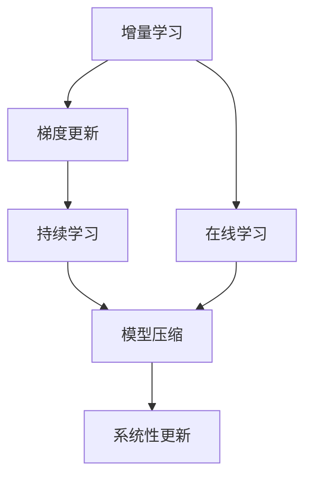
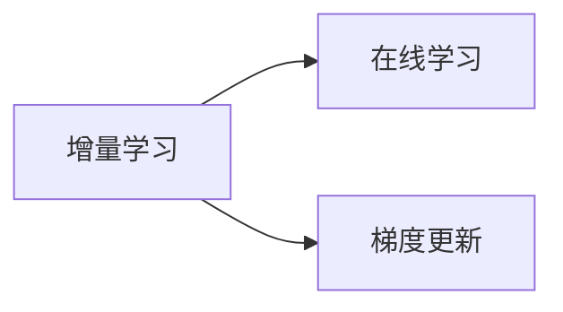
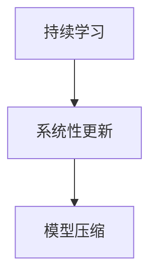
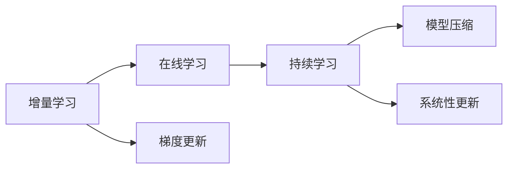
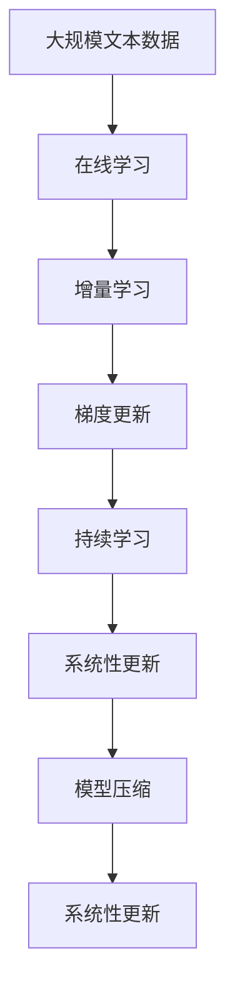

                 

# Incremental Learning原理与代码实例讲解

> 关键词：Incremental Learning, 增量学习, 在线学习, 持续学习, 梯度更新, 模型压缩, 系统性更新

## 1. 背景介绍

在人工智能领域，持续学习和增量学习是两个极为重要且相关联的概念。随着模型应用的深入，尤其是在实际生产环境中，模型需要不断地面对新数据和变化的环境，才能保持其有效性和性能。增量学习（Incremental Learning）和持续学习（Continual Learning）是实现这一目标的重要手段。增量学习旨在利用新数据，对已有模型进行在线更新，以适应变化的环境；持续学习则着眼于在整个学习过程中，不断更新模型，以保持其长期性能和稳定性。

### 1.1 问题由来

当前，深度学习模型（如卷积神经网络、递归神经网络、变分自编码器等）在诸多领域取得了巨大成功，但也面临着一些挑战。这些问题包括模型过拟合、对新数据的适应能力差、模型更新成本高昂等。传统的深度学习模型在面对新数据时，往往需要重新训练整个模型，这不仅耗费时间和计算资源，还可能导致模型在新数据上表现不佳。因此，增量学习和持续学习成为了解决这些问题的有效手段，尤其在资源有限或需要频繁更新模型的应用场景中，具有重要意义。

### 1.2 问题核心关键点

增量学习和持续学习是应对数据流变动的有效方法，其核心在于利用新数据对模型进行在线更新，同时保留模型的旧知识，避免因新数据带来的模型性能下降。具体来说，增量学习需要在每次获得新数据时，通过梯度下降等优化算法对模型参数进行更新，以适应新数据。持续学习则通过在不同任务间进行切换，逐渐更新模型的知识库，确保模型在长期学习过程中保持稳定和高效。

增量学习与持续学习的区别在于：增量学习侧重于每次获得新数据时对模型进行小幅度更新，持续学习则强调在整个学习过程中，不断进行模型知识库的更新和优化。但两者往往在实际应用中结合使用，以实现更好的模型性能和适应性。

## 2. 核心概念与联系

### 2.1 核心概念概述

为更好地理解增量学习与持续学习，本节将介绍几个密切相关的核心概念：

- 增量学习（Incremental Learning）：指利用新数据，对已有模型进行在线更新，以适应环境变化。增量学习可以避免重头训练整个模型，从而节省时间和计算资源。

- 持续学习（Continual Learning）：指在整个学习过程中，不断更新模型，以保持其长期性能和稳定性。持续学习旨在避免模型在不断学习新知识时，遗忘已有的旧知识。

- 在线学习（Online Learning）：指模型在数据流到达时，逐个数据点进行学习，更新模型参数。在线学习强调模型对新数据的即时响应和更新。

- 梯度更新（Gradient Update）：指通过反向传播计算模型参数的梯度，并利用梯度下降等优化算法更新参数。梯度更新是增量学习和持续学习中常用的更新策略。

- 模型压缩（Model Compression）：指通过参数剪枝、量化、稀疏化等技术，减少模型的参数量，从而加速模型更新和推理。模型压缩有助于解决增量学习中的内存和计算资源问题。

- 系统性更新（Systematic Update）：指按预设规则对模型进行周期性更新，以避免因新数据带来的模型过拟合和性能下降。系统性更新可以帮助增量学习和持续学习更好地平衡新旧知识的学习和应用。

这些核心概念之间的逻辑关系可以通过以下Mermaid流程图来展示：



这个流程图展示了增量学习和持续学习的核心概念及其之间的关系：

1. 增量学习通过在线学习的方式，逐个数据点更新模型。
2. 在线学习利用梯度更新策略，不断调整模型参数。
3. 持续学习在整个学习过程中，不断更新模型知识库。
4. 模型压缩通过剪枝、量化等技术，减少模型参数量。
5. 系统性更新按预设规则进行周期性模型更新，保持模型稳定性。

这些概念共同构成了增量学习与持续学习的完整框架，使其能够在变化的环境中保持高效和稳定。通过理解这些核心概念，我们可以更好地把握增量学习与持续学习的原理和应用方向。

### 2.2 概念间的关系

这些核心概念之间存在着紧密的联系，形成了增量学习与持续学习的完整生态系统。下面我通过几个Mermaid流程图来展示这些概念之间的关系。

#### 2.2.1 增量学习与在线学习的联系



这个流程图展示了增量学习和在线学习的联系。增量学习通过在线学习的方式，逐个数据点更新模型参数。

#### 2.2.2 持续学习与模型压缩的关系



这个流程图展示了持续学习与模型压缩的关系。持续学习通过系统性更新，不断优化模型知识库。模型压缩则通过剪枝、量化等技术，减少模型参数量，避免因新数据带来的模型过拟合和性能下降。

#### 2.2.3 增量学习与持续学习的综合



这个综合流程图展示了增量学习、在线学习、持续学习、模型压缩和系统性更新之间的整体架构。增量学习通过在线学习和梯度更新策略，逐个数据点更新模型参数；持续学习在整个学习过程中，不断更新模型知识库；模型压缩通过剪枝、量化等技术，减少模型参数量；系统性更新按预设规则进行周期性模型更新，保持模型稳定性。

### 2.3 核心概念的整体架构

最后，我们用一个综合的流程图来展示增量学习与持续学习的核心概念在大模型微调过程中的整体架构：



这个综合流程图展示了从在线学习到持续学习，再到系统性更新和模型压缩的完整过程。增量学习通过在线学习的方式，逐个数据点更新模型参数；持续学习在整个学习过程中，不断更新模型知识库；系统性更新按预设规则进行周期性模型更新，保持模型稳定性；模型压缩通过剪枝、量化等技术，减少模型参数量，提高模型更新和推理效率。通过这些概念的结合使用，可以使模型在不断变化的环境中保持高效和稳定。

## 3. 核心算法原理 & 具体操作步骤

### 3.1 算法原理概述

增量学习和持续学习的核心算法原理在于利用新数据对模型进行在线更新，同时保留模型的旧知识。其基本思想是通过梯度下降等优化算法，对模型参数进行小幅度更新，以适应新数据。具体来说，增量学习和持续学习通常通过以下步骤实现：

1. **在线学习（Online Learning）**：模型在数据流到达时，逐个数据点进行学习，更新模型参数。

2. **增量学习（Incremental Learning）**：利用新数据对已有模型进行在线更新，以适应环境变化。

3. **持续学习（Continual Learning）**：在整个学习过程中，不断更新模型，以保持其长期性能和稳定性。

4. **梯度更新（Gradient Update）**：通过反向传播计算模型参数的梯度，并利用梯度下降等优化算法更新参数。

5. **模型压缩（Model Compression）**：通过参数剪枝、量化、稀疏化等技术，减少模型的参数量，从而加速模型更新和推理。

6. **系统性更新（Systematic Update）**：按预设规则对模型进行周期性更新，以避免因新数据带来的模型过拟合和性能下降。

### 3.2 算法步骤详解

#### 3.2.1 在线学习

在线学习的基本步骤如下：

1. **模型初始化**：初始化模型参数 $\theta_0$。
2. **数据迭代**：对每个新数据点 $x_t$，计算预测输出 $y_t$。
3. **计算梯度**：计算模型参数的梯度 $\Delta\theta_t = \nabla_{\theta}L(y_t, \hat{y}_t)$。
4. **更新参数**：利用梯度下降等优化算法更新模型参数 $\theta_{t+1} = \theta_t - \eta \Delta\theta_t$，其中 $\eta$ 为学习率。

例如，对于线性回归模型 $y = \theta^Tx$，其梯度更新公式为：

$$
\Delta\theta = \nabla_{\theta}L(y, \hat{y}) = (X^TX)^{-1}X^T(y - \hat{y})
$$

在线学习通过逐个数据点更新模型参数，适用于数据流持续到达的场景。

#### 3.2.2 增量学习

增量学习的基本步骤如下：

1. **模型初始化**：初始化模型参数 $\theta_0$。
2. **数据迭代**：对每个新数据点 $x_t$，计算预测输出 $y_t$。
3. **计算梯度**：计算模型参数的梯度 $\Delta\theta_t = \nabla_{\theta}L(y_t, \hat{y}_t)$。
4. **更新参数**：利用梯度下降等优化算法更新模型参数 $\theta_{t+1} = \theta_t - \eta \Delta\theta_t$，其中 $\eta$ 为学习率。

例如，对于线性回归模型 $y = \theta^Tx$，其梯度更新公式为：

$$
\Delta\theta = \nabla_{\theta}L(y, \hat{y}) = (X^TX)^{-1}X^T(y - \hat{y})
$$

增量学习通过逐个数据点更新模型参数，适用于数据流持续到达的场景。

#### 3.2.3 持续学习

持续学习的基本步骤如下：

1. **模型初始化**：初始化模型参数 $\theta_0$。
2. **数据迭代**：对每个新数据点 $x_t$，计算预测输出 $y_t$。
3. **计算梯度**：计算模型参数的梯度 $\Delta\theta_t = \nabla_{\theta}L(y_t, \hat{y}_t)$。
4. **更新参数**：利用梯度下降等优化算法更新模型参数 $\theta_{t+1} = \theta_t - \eta \Delta\theta_t$，其中 $\eta$ 为学习率。
5. **周期性更新**：按预设规则对模型进行周期性更新，以避免因新数据带来的模型过拟合和性能下降。

例如，对于线性回归模型 $y = \theta^Tx$，其梯度更新公式为：

$$
\Delta\theta = \nabla_{\theta}L(y, \hat{y}) = (X^TX)^{-1}X^T(y - \hat{y})
$$

持续学习通过在整个学习过程中，不断更新模型，以保持其长期性能和稳定性。

#### 3.2.4 梯度更新

梯度更新是增量学习和持续学习中常用的更新策略。通过反向传播计算模型参数的梯度，并利用梯度下降等优化算法更新参数。例如，对于线性回归模型 $y = \theta^Tx$，其梯度更新公式为：

$$
\Delta\theta = \nabla_{\theta}L(y, \hat{y}) = (X^TX)^{-1}X^T(y - \hat{y})
$$

梯度更新通过反向传播计算模型参数的梯度，并利用梯度下降等优化算法更新参数，适用于增量学习和持续学习中。

#### 3.2.5 模型压缩

模型压缩是增量学习和持续学习中常用的技术手段，通过参数剪枝、量化、稀疏化等技术，减少模型的参数量，从而加速模型更新和推理。例如，对于线性回归模型 $y = \theta^Tx$，其参数量可以通过剪枝、量化、稀疏化等技术减少，从而加速模型更新和推理。

例如，对于线性回归模型 $y = \theta^Tx$，其参数量可以通过剪枝、量化、稀疏化等技术减少，从而加速模型更新和推理。

### 3.3 算法优缺点

增量学习和持续学习具有以下优点：

1. **节省时间和计算资源**：增量学习和持续学习通过逐个数据点更新模型参数，避免了重头训练整个模型的需求，从而节省了时间和计算资源。

2. **适应性强**：增量学习和持续学习可以实时适应新数据，提高了模型对环境变化的适应能力。

3. **模型更新效率高**：增量学习和持续学习通过梯度更新策略，避免了因重头训练模型带来的性能下降，提高了模型更新效率。

但这些方法也存在一些缺点：

1. **模型参数更新难度高**：增量学习和持续学习对模型参数进行小幅度更新，容易导致模型过拟合或欠拟合。

2. **模型性能不稳定**：增量学习和持续学习对新数据的适应性依赖于数据分布的稳定性，数据分布发生变化时，模型性能可能下降。

3. **模型更新复杂度高**：增量学习和持续学习需要在每次数据更新时进行参数更新，增加了模型更新的复杂度。

### 3.4 算法应用领域

增量学习和持续学习在诸多领域中得到了广泛应用，包括但不限于：

1. **金融预测**：增量学习和持续学习可以实时更新金融市场模型，预测股票价格、市场趋势等。

2. **医疗诊断**：增量学习和持续学习可以实时更新医疗模型，诊断疾病、预测病情发展等。

3. **推荐系统**：增量学习和持续学习可以实时更新推荐模型，推荐个性化内容、广告等。

4. **智能交通**：增量学习和持续学习可以实时更新交通模型，优化交通流量、预测事故等。

5. **自然语言处理**：增量学习和持续学习可以实时更新自然语言模型，提高语音识别、翻译等任务的性能。

6. **智能制造**：增量学习和持续学习可以实时更新工业控制模型，优化生产流程、预测设备故障等。

这些应用领域展示了增量学习和持续学习的重要价值，说明了其在实际生产环境中的广泛适用性。

## 4. 数学模型和公式 & 详细讲解 & 举例说明

### 4.1 数学模型构建

增量学习和持续学习的数学模型通常基于最小化损失函数 $L$ 的目标，通过梯度更新策略对模型参数进行优化。以下是增量学习和持续学习的基本数学模型构建：

1. **线性回归模型**：
   - 假设模型为 $y = \theta^Tx + b$，其中 $x \in \mathbb{R}^n$，$y \in \mathbb{R}$。
   - 定义损失函数 $L(y, \hat{y}) = \frac{1}{2}(y - \hat{y})^2$。
   - 定义梯度更新公式 $\Delta\theta = \nabla_{\theta}L(y, \hat{y}) = (X^TX)^{-1}X^T(y - \hat{y})$。

2. **增量学习模型**：
   - 假设模型参数为 $\theta_0$，定义损失函数 $L(y_t, \hat{y}_t)$。
   - 定义梯度更新公式 $\Delta\theta_t = \nabla_{\theta}L(y_t, \hat{y}_t)$。
   - 定义模型参数更新公式 $\theta_{t+1} = \theta_t - \eta \Delta\theta_t$。

3. **持续学习模型**：
   - 假设模型参数为 $\theta_0$，定义损失函数 $L(y_t, \hat{y}_t)$。
   - 定义梯度更新公式 $\Delta\theta_t = \nabla_{\theta}L(y_t, \hat{y}_t)$。
   - 定义模型参数更新公式 $\theta_{t+1} = \theta_t - \eta \Delta\theta_t$。
   - 定义周期性更新规则 $U(\theta)$。

4. **系统性更新模型**：
   - 假设模型参数为 $\theta_0$，定义损失函数 $L(y_t, \hat{y}_t)$。
   - 定义梯度更新公式 $\Delta\theta_t = \nabla_{\theta}L(y_t, \hat{y}_t)$。
   - 定义模型参数更新公式 $\theta_{t+1} = \theta_t - \eta \Delta\theta_t$。
   - 定义周期性更新规则 $U(\theta)$。

### 4.2 公式推导过程

以线性回归模型为例，推导增量学习、持续学习和系统性更新的基本公式。

1. **线性回归模型增量学习**：
   - 假设模型为 $y = \theta^Tx + b$，其中 $x \in \mathbb{R}^n$，$y \in \mathbb{R}$。
   - 定义损失函数 $L(y, \hat{y}) = \frac{1}{2}(y - \hat{y})^2$。
   - 定义梯度更新公式 $\Delta\theta = \nabla_{\theta}L(y, \hat{y}) = (X^TX)^{-1}X^T(y - \hat{y})$。
   - 定义模型参数更新公式 $\theta_{t+1} = \theta_t - \eta \Delta\theta_t$。

2. **线性回归模型持续学习**：
   - 假设模型为 $y = \theta^Tx + b$，其中 $x \in \mathbb{R}^n$，$y \in \mathbb{R}$。
   - 定义损失函数 $L(y, \hat{y}) = \frac{1}{2}(y - \hat{y})^2$。
   - 定义梯度更新公式 $\Delta\theta = \nabla_{\theta}L(y, \hat{y}) = (X^TX)^{-1}X^T(y - \hat{y})$。
   - 定义模型参数更新公式 $\theta_{t+1} = \theta_t - \eta \Delta\theta_t$。
   - 定义周期性更新规则 $U(\theta)$。

3. **线性回归模型系统性更新**：
   - 假设模型为 $y = \theta^Tx + b$，其中 $x \in \mathbb{R}^n$，$y \in \mathbb{R}$。
   - 定义损失函数 $L(y, \hat{y}) = \frac{1}{2}(y - \hat{y})^2$。
   - 定义梯度更新公式 $\Delta\theta = \nabla_{\theta}L(y, \hat{y}) = (X^TX)^{-1}X^T(y - \hat{y})$。
   - 定义模型参数更新公式 $\theta_{t+1} = \theta_t - \eta \Delta\theta_t$。
   - 定义周期性更新规则 $U(\theta)$。

### 4.3 案例分析与讲解

以线性回归模型为例，分析增量学习和持续学习的基本流程和应用场景。

1. **线性回归模型增量学习**：
   - 假设模型为 $y = \theta^Tx + b$，其中 $x \in \mathbb{R}^n$，$y \in \mathbb{R}$。
   - 定义损失函数 $L(y, \hat{y}) = \frac{1}{2}(y - \hat{y})^2$。
   - 定义梯度更新公式 $\Delta\theta = \nabla_{\theta}L(y, \hat{y}) = (X^TX)^{-1}X^T(y - \hat{y})$。
   - 定义模型参数更新公式 $\theta_{t+1} = \theta_t - \eta \Delta\theta_t$。
   - 假设数据流持续到达，模型参数 $\theta$ 在每次数据到达时进行更新。

2. **线性回归模型持续学习**：
   - 假设模型为 $y = \theta^Tx + b$，其中 $x \in \mathbb{R}^n$，$y \in \mathbb{R}$。
   - 定义损失函数 $L(y, \hat{y}) = \frac{1}{2}(y - \hat{y})^2$。
   - 定义梯度更新公式 $\Delta\theta = \nabla_{\theta}L(y, \hat{y}) = (X^TX)^{-1}X^T(y - \hat{y})$。
   - 定义模型参数更新公式 $\theta_{t+1} = \theta_t - \eta \Delta\theta_t$。
   - 定义周期性更新规则 $U(\theta)$。
   - 假设数据流持续到达，模型参数 $\theta$ 在每次数据到达时进行更新。

3. **线性回归模型系统性更新**：
   - 假设模型为 $y = \theta^Tx + b$，其中 $x \in \mathbb{R}^n$，$y \in \mathbb{R}$。
   - 定义损失函数 $L(y, \hat{y}) = \frac{1}{2}(y - \hat{y})^2$。
   - 定义梯度更新公式 $\Delta\theta = \nabla_{\theta}L(y, \hat{y}) = (X^TX)^{-1}X^T(y - \hat{y})$。
   - 定义模型参数更新公式 $\theta_{t+1} = \theta_t - \eta \Delta\theta_t$。
   - 定义周期性更新规则 $U(\theta)$。
   - 假设数据流持续到达，模型参数 $\theta$ 在每次数据到达时进行更新。

## 5. 项目实践：代码实例和详细解释说明

### 5.1 开发环境搭建

在进行增量学习和持续学习的实践前，我们需要准备好开发环境。以下是使用Python进行PyTorch开发的环境配置流程：

1. 安装Anaconda：从官网下载并安装Anaconda，用于创建独立的Python环境。

2. 创建并激活虚拟环境：
```bash
conda create -n pytorch-env python=3.8 
conda activate pytorch-env
```

3. 安装PyTorch：根据CUDA版本，从官网获取对应的安装命令。例如：
```bash
conda install pytorch torchvision torchaudio cudatoolkit=11.1 -c pytorch -c conda-forge
```

4. 安装Transformers库：
```bash
pip install transformers
```

5. 安装各类工具包：
```bash
pip install numpy pandas scikit-learn matplotlib tqdm jupyter notebook ipython
```

完成上述步骤后，即可在`pytorch-env`环境中开始增量学习和持续学习的实践。

### 5.2 源代码详细实现

下面我们以线性回归模型为例，给出使用PyTorch对模型进行增量学习和持续学习的PyTorch代码实现。

```python
import torch
import torch.nn as nn
import torch.optim as optim
import numpy as np

# 定义线性回归模型
class LinearRegression(nn.Module):
    def __init__(self, input_dim, output_dim):
        super(LinearRegression, self).__init__()
        self.linear = nn.Linear(input_dim, output_dim)

    def forward(self, x):
        y_pred = self.linear(x)
        return y_pred

# 定义损失函数
def loss_function(y_true, y_pred):
    return torch.mean((y_true - y_pred) ** 2)

# 定义梯度更新函数
def update_model(model, data, learning_rate):
    optimizer = optim.SGD(model.parameters(), lr=learning_rate)
    for data in data:
        inputs, targets = data
        optimizer.zero_grad()
        y_pred = model(inputs)
        loss = loss_function(targets, y_pred)
        loss.backward()
        optimizer.step()

# 定义增量学习函数
def incremental_learning(model, data, learning_rate, n_epochs):
    for epoch in range(n_epochs):
        update_model(model, data, learning_rate)
        print(f'Epoch {epoch+1}, loss: {loss.item()}')

# 定义持续学习函数
def continual_learning(model, data, learning_rate, n_epochs):
    for epoch in range(n_epochs):
        update_model(model, data, learning_rate)
        print(f'Epoch {epoch+1}, loss: {loss.item()}')

# 生成随机数据
data = np.random.randn(100, 2)
labels = 0.5 * data[:, 0] + 0.5 * data[:, 1] + np.random.randn(100)

# 将数据转换为Tensor格式
inputs = torch.from_numpy(data)
targets = torch.from_numpy(labels)

# 定义模型
model

