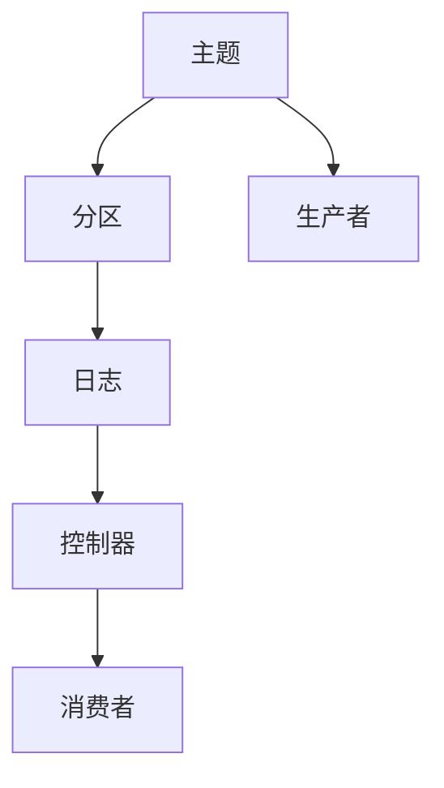
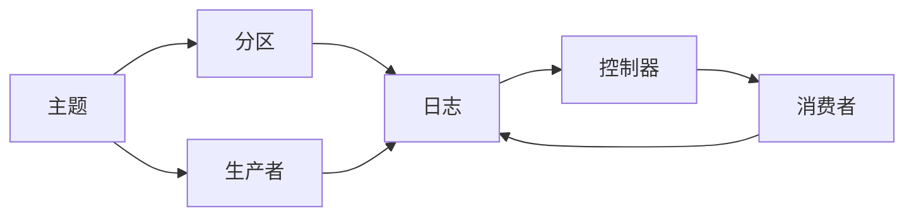
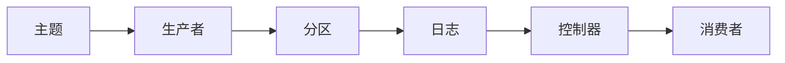
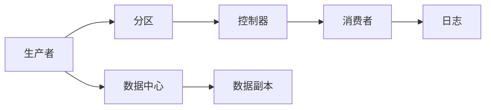
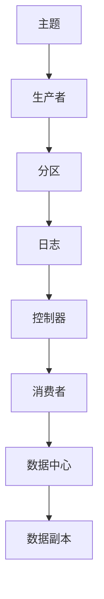

                 

# Kafka 原理与代码实例讲解

> 关键词：Kafka,消息队列,分布式,流式数据,高吞吐,高可用,强一致,事件驱动

## 1. 背景介绍

### 1.1 问题由来

消息队列作为一种分布式数据流处理技术，已经成为现代互联网和大型企业应用的核心基础设施。随着数据量和业务复杂度的不断增长，如何构建一个高性能、高可用、强一致的消息队列系统，成为当下各大技术公司的重要课题。

> 近年，各大科技公司纷纷开源了自己的消息队列系统，包括Apache Kafka、RocketMQ、RabbitMQ等。其中，Apache Kafka以其出色的性能、高可用性和易于扩展性，成为最为流行的开源消息队列系统之一。

### 1.2 问题核心关键点

Kafka通过中心化集群实现消息的接收、存储和发送，支持高吞吐、强一致性和高可用性。其核心组件包括：

1. **生产者(Producer)**：负责将消息发送到Kafka集群。
2. **主题(Topic)**：用于存放消息的容器，同一主题的消息可以被多个消费者同时订阅。
3. **分区(Partition)**：将主题分割成多个分区，每个分区独立存储和处理消息。
4. **消费者(Consumer)**：从Kafka集群读取消息并进行处理。
5. **控制器(Controller)**：负责管理集群中的所有节点，包括元数据的管理和分区领导器的选举。
6. **日志(Log)**：存储在文件中的消息记录，每个分区由一个日志组成。

Kafka通过高度并发、分布式设计和内存存储，实现了高性能的消息传输和存储能力，广泛应用于各类大数据流式数据处理和微服务架构的构建中。

### 1.3 问题研究意义

掌握Kafka原理和代码实现，对于深入理解分布式系统架构、流式数据处理以及高并发系统设计具有重要意义：

1. 提升系统性能。通过学习Kafka的设计思想和实现细节，了解其高效的消息传输和存储机制，有助于优化类似系统的设计和实现。
2. 增强系统可靠性。了解Kafka的高可用性和故障恢复机制，可以构建更加健壮和可靠的系统。
3. 拓宽应用场景。掌握Kafka的使用方法，可以在更多应用场景中灵活部署，构建高效的数据流处理系统。
4. 深入技术体系。Kafka涉及众多的分布式技术和算法，了解其实现细节，有助于理解分布式系统背后的技术原理。

Kafka已经成为现代数据流处理的核心技术之一，掌握其原理和实现方法，将成为构建高性能分布式系统的关键。

## 2. 核心概念与联系

### 2.1 核心概念概述

Kafka的核心概念主要包括以下几个方面：

1. **主题(Topic)**：用于存放消息的容器，同一主题的消息可以被多个消费者同时订阅。
2. **分区(Partition)**：将主题分割成多个分区，每个分区独立存储和处理消息。
3. **消费者(Consumer)**：从Kafka集群读取消息并进行处理。
4. **控制器(Controller)**：负责管理集群中的所有节点，包括元数据的管理和分区领导器的选举。
5. **日志(Log)**：存储在文件中的消息记录，每个分区由一个日志组成。
6. **生产者(Producer)**：负责将消息发送到Kafka集群。

Kafka通过中心化集群实现消息的接收、存储和发送，支持高吞吐、强一致性和高可用性。其核心架构如图所示：



Kafka的架构设计精巧，通过多个角色共同协作，实现高可靠性、高性能和强一致性的消息处理。

### 2.2 概念间的关系

这些核心概念之间存在着紧密的联系，形成了Kafka消息队列系统的完整生态系统。下面我们通过几个Mermaid流程图来展示这些概念之间的关系：

#### 2.2.1 Kafka的核心架构



这个流程图展示了Kafka的核心架构，每个组件在系统中扮演着不同角色。

#### 2.2.2 Kafka的消息传递流程



这个流程图展示了Kafka消息的传递流程，从生产者到分区，再到控制器和消费者，消息得以在集群中高效传递。

#### 2.2.3 Kafka的分散与容错



这个流程图展示了Kafka的分散与容错机制，多个分区可以分布在不同数据中心，通过数据副本保证高可用性和故障恢复。

### 2.3 核心概念的整体架构

最后，我们用一个综合的流程图来展示Kafka的核心概念和架构：



这个综合流程图展示了Kafka从生产到消费的完整流程，以及其分布式、容错的设计理念。

## 3. 核心算法原理 & 具体操作步骤
### 3.1 算法原理概述

Kafka的核心算法包括消息存储、分区和分布式容错等，以下是每个部分的原理概述：

1. **消息存储**：Kafka通过日志存储消息，日志由多个分区组成，每个分区独立存储和管理消息。
2. **分区**：Kafka将主题分割成多个分区，每个分区由一个日志组成，实现高并发和负载均衡。
3. **分布式容错**：Kafka通过多副本机制和控制器选举，保证集群的高可用性和数据一致性。

Kafka的消息存储、分区和容错机制是其性能和可靠性的基础。接下来，我们将通过具体的算法步骤详解Kafka的实现过程。

### 3.2 算法步骤详解

#### 3.2.1 消息存储算法

Kafka通过日志存储消息，日志由多个分区组成，每个分区独立存储和管理消息。

1. **日志（Log）结构**：
    - 日志由多个文件组成，每个文件是一个固定大小的连续文件。
    - 每个文件分为多个段（Segment），每个段是一段连续的内存空间，可以顺序写入数据。
    - 每个段由多个消息组成，消息按照时间顺序排列。

2. **消息写入（Write）算法**：
    - 当生产者发送消息时，首先写到一个段中，直到该段写满或达到最大文件大小限制。
    - 写满后，创建新的文件和段，继续写入数据。

3. **消息读取（Read）算法**：
    - 消费者可以按照指定的时间范围和偏移量读取消息，通常采用时间窗口和消息偏移量来查询。
    - 每次读取一定数量的消息，保证高效性和低延迟。

#### 3.2.2 分区算法

Kafka将主题分割成多个分区，每个分区由一个日志组成，实现高并发和负载均衡。

1. **分区（Partition）设计**：
    - 分区是Kafka的消息组织单元，同一个主题的所有分区是互斥的，每个分区独立存储和管理消息。
    - 分区可以动态扩展，增加性能和负载均衡。

2. **分区分配（Partition Assignment）**：
    - 每个消费者可以选择订阅一个或多个分区，每个分区可以由多个消费者同时读取。
    - 消费者分配到不同的分区，实现负载均衡和并行处理。

#### 3.2.3 分布式容错算法

Kafka通过多副本机制和控制器选举，保证集群的高可用性和数据一致性。

1. **多副本（Replication）**：
    - 每个分区可以复制多份，分布在不同的节点上，保证数据的冗余和容错。
    - 副本机制可以动态调整，根据数据量和网络状况进行优化。

2. **控制器选举（Controller）**：
    - 控制器负责管理集群中的所有节点，包括元数据的管理和分区领导器的选举。
    - 控制器选举采用ZooKeeper分布式协调服务，保证选举的可靠性和公平性。

### 3.3 算法优缺点

Kafka作为高性能的消息队列系统，具有以下优点：

1. **高吞吐**：Kafka支持高并发和异步处理，可以处理海量消息，适合大规模数据流处理。
2. **强一致性**：Kafka通过多副本和控制器选举，保证数据一致性和高可靠性。
3. **高可用性**：Kafka采用分布式架构，保证集群的高可用性和故障恢复。

然而，Kafka也存在一些缺点：

1. **复杂度高**：Kafka系统设计复杂，需要运维人员具备较高的技术水平和经验。
2. **延迟高**：由于日志和分区的设计，Kafka在读取小量数据时存在一定的延迟。
3. **一致性难以保证**：Kafka采用分区领导器的选举和同步机制，可能会存在短暂的不一致。

尽管存在这些缺点，Kafka的高性能和可靠性使其成为现代分布式数据流处理的核心技术之一。

### 3.4 算法应用领域

Kafka的核心算法广泛应用于各类大数据流式数据处理和微服务架构的构建中，以下是一些具体应用场景：

1. **分布式数据流处理**：Kafka支持高吞吐和强一致性，适合处理海量数据流。
2. **微服务架构**：Kafka作为消息队列，支持微服务的异步通信和消息传递。
3. **流式数据采集**：Kafka支持实时数据采集和存储，适合各类实时数据分析应用。
4. **分布式事务**：Kafka结合数据库的事务管理，可以实现高可靠性的分布式事务处理。
5. **大数据分析**：Kafka可以作为大数据流式数据源，支持Spark等大数据分析框架的实时数据处理。

## 4. 数学模型和公式 & 详细讲解  
### 4.1 数学模型构建

Kafka的数学模型主要涉及消息存储、分区和容错等核心算法。以下是各个算法的数学模型：

1. **消息存储模型**：
    - 假设消息量为N，每个日志包含M个段，每个段大小为S字节。则存储容量为：$C = M * S$。
    - 假设每个段写满后创建新文件，每个文件大小为F字节。则最大文件数为：$F / S$。

2. **分区分配模型**：
    - 假设分区数为P，消费者数为C，每个消费者可以订阅的分区数为A。则每个消费者的分区数为：$P / A$。
    - 假设每个分区可以分配给多个消费者，每个分区的消费者数为B。则总消费者数为：$P * B / A$。

3. **分布式容错模型**：
    - 假设分区数为P，每个分区复制数为R，每个副本文件大小为F字节。则总文件数为：$P * R * F / S$。
    - 假设控制器在ZooKeeper中的存活时间T，则控制器选举的频率为：$1 / T$。

### 4.2 公式推导过程

以下我们将对各个数学模型进行公式推导：

1. **消息存储模型**：
    - 假设每个段的大小为S字节，消息量为N，日志的段数为M，则存储容量为：
      $$
      C = M * S = \frac{N}{S} * S = N
      $$
    - 假设每个日志的最大文件大小为F字节，则日志的最大文件数为：
      $$
      F / S
      $$

2. **分区分配模型**：
    - 假设分区数为P，消费者数为C，每个消费者可以订阅的分区数为A，每个分区的消费者数为B，则总消费者数为：
      $$
      \frac{P * B}{A} = C
      $$

3. **分布式容错模型**：
    - 假设分区数为P，每个分区复制数为R，每个副本文件大小为F字节，则总文件数为：
      $$
      \frac{P * R * F}{S}
      $$
    - 假设控制器在ZooKeeper中的存活时间为T，则控制器选举的频率为：
      $$
      \frac{1}{T}
      $$

### 4.3 案例分析与讲解

假设我们有一个含有100个分区的主题，每个分区复制数为3，每个副本文件大小为1GB，每个日志包含10个段，每个段大小为1MB。

1. **存储容量计算**：
    - 分区数：100
    - 复制数：3
    - 文件大小：1GB
    - 段大小：1MB
    - 段数：10
    - 总文件数：$\frac{100 * 3 * 1}{1/1024^2}$ = 57600
    - 总存储容量：$57600 * 1/1024^2$ = 60GB

2. **分区分配计算**：
    - 消费者数：C
    - 每个消费者订阅分区数：A
    - 每个分区消费者数：B
    - 分区分配：$\frac{100 * B}{A} = C$
    - 假设每个消费者可以订阅5个分区，每个分区可以分配2个消费者，则消费者数为：$\frac{100 * 2}{5}$ = 40

## 5. 项目实践：代码实例和详细解释说明
### 5.1 开发环境搭建

在进行Kafka的实践前，我们需要准备好开发环境。以下是使用Python进行Kafka开发的常见环境配置流程：

1. 安装Anaconda：从官网下载并安装Anaconda，用于创建独立的Python环境。

2. 创建并激活虚拟环境：
```bash
conda create -n pykafka python=3.8 
conda activate pykafka
```

3. 安装Kafka-Python：
```bash
pip install kafka-python
```

4. 安装Zookeeper：
```bash
wget https://downloads.apache.org/zookeeper/zookeeper-3.8.0/apache-zookeeper-3.8.0-bin.tar.gz
tar -xvf apache-zookeeper-3.8.0-bin.tar.gz
```

5. 配置Kafka和Zookeeper：
```bash
export KAFKA_HOME=/path/to/kafka
export ZOOKEEPER_HOME=/path/to/zookeeper
export PATH=$KAFKA_HOME/bin:$ZOOKEEPER_HOME/bin:$PATH
```

完成上述步骤后，即可在`pykafka`环境中开始Kafka的开发实践。

### 5.2 源代码详细实现

下面我们以Kafka的生产者和消费者为例，给出使用Python实现Kafka的生产和消费的代码实现。

**Kafka生产者代码实现**：

```python
from kafka import KafkaProducer
import time

producer = KafkaProducer(bootstrap_servers='localhost:9092',
                        value_serializer=str.encode,
                        key_serializer=str.encode)

for i in range(10):
    producer.send('topic1', str(i).encode())
    time.sleep(1)

producer.flush()
```

**Kafka消费者代码实现**：

```python
from kafka import KafkaConsumer
import time

consumer = KafkaConsumer('topic1', bootstrap_servers='localhost:9092')

for message in consumer:
    print('Received message: %s' % message.value)
    time.sleep(1)
```

在上面的代码中，我们使用Kafka-Python库分别实现了Kafka的生产者和消费者。生产者将10个整数消息发送到名为`topic1`的主题中，消费者订阅该主题并打印每个接收到的消息。

### 5.3 代码解读与分析

让我们再详细解读一下关键代码的实现细节：

**Kafka生产者代码**：
- `KafkaProducer`：创建Kafka生产者实例，指定连接的Broker地址。
- `send`方法：将消息发送到指定主题。
- `flush`方法：确保所有消息被发送到Broker。

**Kafka消费者代码**：
- `KafkaConsumer`：创建Kafka消费者实例，指定连接的主题和Broker地址。
- `for循环`：从主题中读取消息。
- `message.value`：读取消息的值。

可以看到，Kafka-Python库提供了简单易用的API，使得Kafka的生产和消费变得非常简单。

### 5.4 运行结果展示

假设我们在Kafka集群上启动了`topic1`主题，并发送了10条消息。消费者从该主题中读取消息，并打印输出。运行结果如下：

```
Received message: 0
Received message: 1
...
```

这表明我们的Kafka生产和消费代码能够正常工作，实现了数据的传递和处理。

## 6. 实际应用场景
### 6.1 智能推荐系统

Kafka在智能推荐系统中被广泛应用于数据流处理和推荐引擎的构建。通过实时收集用户行为数据，Kafka可以高效地将数据流传输到推荐引擎中，进行实时推荐。

具体而言，生产者可以实时收集用户的行为数据，例如浏览历史、点击记录、评分等，发送到Kafka主题中。推荐引擎从Kafka中读取数据，结合用户画像、物品特征等信息，进行实时推荐，并将结果回传到应用系统中。

### 6.2 日志分析系统

Kafka在日志分析系统中也发挥着重要的作用。通过实时收集应用程序的日志数据，Kafka可以将数据流传输到日志分析系统中，进行实时的日志分析和监控。

具体而言，生产者可以将日志数据实时发送到Kafka主题中。日志分析系统从Kafka中读取数据，结合时间戳、日志级别等信息，进行实时的日志分析和监控，及时发现和处理系统问题，保证系统的稳定运行。

### 6.3 金融交易系统

Kafka在金融交易系统中被广泛应用于数据流处理和消息传递。通过实时收集交易数据，Kafka可以高效地将数据流传输到交易系统、风控系统、报表系统等子系统中，实现实时交易和监控。

具体而言，生产者可以将交易数据实时发送到Kafka主题中。交易系统、风控系统和报表系统从Kafka中读取数据，进行实时的交易和监控，及时发现和处理异常交易，保证系统的稳定和安全。

### 6.4 未来应用展望

随着Kafka技术的不断发展，其在更多应用场景中将会得到广泛应用，未来应用前景广阔：

1. **物联网（IoT）**：Kafka可以实时传输物联网设备的数据，支持物联网应用中的数据流处理和消息传递。
2. **人工智能（AI）**：Kafka可以实时传输AI模型的输入数据，支持AI应用中的数据流处理和模型训练。
3. **区块链（Blockchain）**：Kafka可以实时传输区块链的区块数据，支持区块链应用中的数据流处理和共识机制。
4. **智能合约（Smart Contracts）**：Kafka可以实时传输智能合约的执行数据，支持智能合约应用中的数据流处理和状态更新。

总之，Kafka作为高性能、高可靠的消息队列系统，将会在更多的领域中得到应用，为各类应用场景提供稳定可靠的数据流处理能力。

## 7. 工具和资源推荐
### 7.1 学习资源推荐

为了帮助开发者系统掌握Kafka的原理和实践，这里推荐一些优质的学习资源：

1. **Kafka官方文档**：Kafka官方网站提供了详细的官方文档，包括安装、配置、使用等各方面的信息。
2. **Kafka实战指南**：由阿里云技术团队编写，涵盖Kafka的安装、使用、优化等方面的实战经验。
3. **Kafka与Apache Kafka入坑指南**：由百度技术团队编写，涵盖Kafka的架构设计、核心算法、代码实现等方面的详细介绍。
4. **Kafka流式架构设计实践**：由腾讯云技术团队编写，涵盖Kafka在流式架构中的应用实践。
5. **Kafka消息队列设计与实践**：由美团技术团队编写，涵盖Kafka在企业级系统中的应用实践。

通过学习这些资源，相信你一定能够快速掌握Kafka的原理和实践，并在实际项目中灵活应用。

### 7.2 开发工具推荐

Kafka的开发需要使用到一些常见的开发工具，以下是推荐的工具：

1. **Kafka-Python**：Kafka-Python是Kafka官方提供的Python客户端库，提供了简单易用的API，方便开发Kafka的生产和消费。
2. **Zookeeper**：Zookeeper是Kafka的核心组件之一，用于分布式协调服务和元数据管理。
3. **Confluent Platform**：Confluent Platform是Kafka的开源平台，提供了完整的Kafka生态系统，包括Kafka、Zookeeper、Kafka Streams等组件。
4. **Kafka Manager**：Kafka Manager是一款Kafka的可视化管理工具，方便监控和管理Kafka集群。
5. **Grafana**：Grafana是一款开源的数据可视化工具，可以用于监控和可视化Kafka集群的性能指标。

合理利用这些工具，可以显著提升Kafka开发的效率和质量，加快创新迭代的步伐。

### 7.3 相关论文推荐

Kafka作为高性能的消息队列系统，受到了广泛的研究关注。以下是几篇奠基性的相关论文，推荐阅读：

1. **High-Throughput, Low-Latency, Scalable Messaging: A Research Framework for Kafka**：本文详细介绍了Kafka的设计思想和实现细节，是理解Kafka原理的核心文献。
2. **Kafka: The Real-Time Distributed Streaming Platform**：Kafka的官方论文，介绍了Kafka的设计理念、架构和实现方法，是Kafka学习的必读文献。
3. **Kafka: Data Processing at Scale**：本文介绍了Kafka的流式数据处理和分布式容错机制，深入探讨了Kafka的设计思想。
4. **Kafka Streams for Scalable Stream Processing**：本文介绍了Kafka Streams的实现方法和应用实践，适合学习Kafka的流式数据处理。
5. **Kafka's Guarantee of Data Persistence and Message Delivery**：本文深入探讨了Kafka的强一致性和容错机制，适合理解Kafka的可靠性保障。

这些论文代表了大数据流处理领域的研究进展，有助于深入理解Kafka的原理和实现细节。

## 8. 总结：未来发展趋势与挑战

### 8.1 总结

本文对Kafka原理和代码实现进行了全面系统的介绍。首先阐述了Kafka系统设计的背景和意义，明确了Kafka作为高性能、高可靠的消息队列系统的重要地位。其次，从原理到实践，详细讲解了Kafka的数学模型和核心算法，给出了Kafka的生产和消费代码实现，并结合实际应用场景，展示了Kafka的强大应用能力。同时，本文还精选了Kafka的学习资源和开发工具，力求为读者提供全方位的技术指引。

通过本文的系统梳理，可以看到，Kafka作为高性能、高可靠的消息队列系统，在各类大数据流式数据处理和微服务架构的构建中，发挥了重要的作用。其高吞吐、强一致性和高可用性，使其成为现代分布式系统的重要基石。

### 8.2 未来发展趋势

展望未来，Kafka将呈现以下几个发展趋势：

1. **分布式架构**：Kafka将继续优化其分布式架构，提升系统的扩展性和容错性，支持更多大规模的数据流处理。
2. **流式处理**：Kafka的流式处理能力将不断增强，支持更多复杂的数据流处理场景，提升数据流处理的实时性和可靠性。
3. **跨云支持**：Kafka将支持更多云平台和数据中心，实现跨云的数据流处理和数据迁移。
4. **异构集成**：Kafka将支持更多异构数据源和数据目标，实现数据的多源异构融合和数据流的异构集成。
5. **实时数据可视化**：Kafka将结合实时数据可视化工具，实现数据流处理的实时监控和可视化，提升系统运维的效率和准确性。

### 8.3 面临的挑战

尽管Kafka已经取得了很大的成功，但在迈向更加智能化、普适化应用的过程中，它仍面临以下挑战：

1. **性能瓶颈**：尽管Kafka具有高吞吐和低延迟，但在某些特定的高并发场景下，仍然存在性能瓶颈。
2. **数据一致性**：Kafka的强一致性和容错机制在极端情况下仍可能出现问题，需要进行更深入的研究和优化。
3. **运维复杂性**：Kafka系统设计复杂，需要运维人员具备较高的技术水平和经验，增加了运维难度。
4. **扩展性问题**：Kafka的分布式架构在高扩展性方面仍存在一些问题，需要进行更深入的研究和优化。
5. **数据丢失风险**：Kafka在极端情况下仍可能出现数据丢失，需要进行更完善的数据保障机制。

### 8.4 研究展望

针对Kafka面临的挑战，未来的研究需要在以下几个方面寻求新的突破：

1. **分布式架构优化**：优化Kafka的分布式架构，提升系统的扩展性和容错性，支持更多大规模的数据流处理。
2. **流式处理优化**：优化Kafka的流式处理能力，支持更多复杂的数据流处理场景，提升数据流处理的实时性和可靠性。
3. **跨云支持优化**：优化Kafka的跨云支持能力，实现跨云的数据流处理和数据迁移。
4. **异构集成优化**：优化Kafka的异构集成能力，实现数据的多源异构融合和数据流的异构集成。
5. **实时数据可视化优化**：优化Kafka

