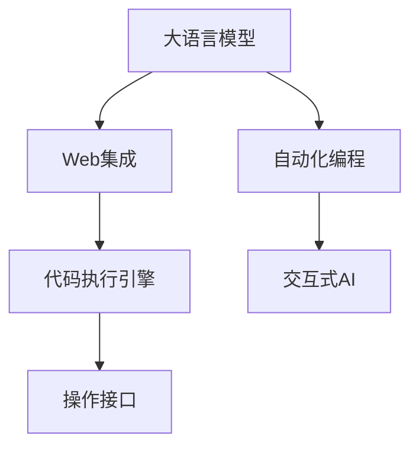
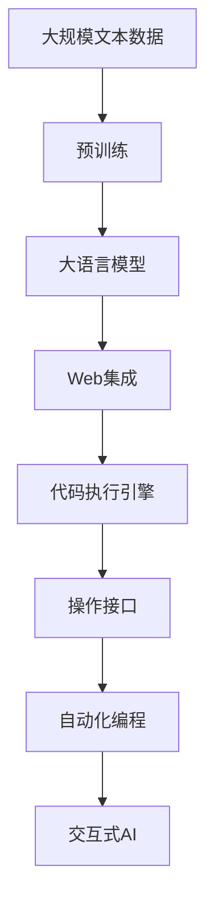

                 

# LLM 操作能力：WebGPT, SayCan

> 关键词：WebGPT, SayCan, 操作能力, 推理引擎, 交互式AI, 自然语言处理(NLP), 智能助手, 自动化编程

## 1. 背景介绍

### 1.1 问题由来

近年来，自然语言处理(NLP)领域的深度学习技术取得了巨大的突破，尤其是大语言模型(Large Language Models, LLMs)，如GPT、BERT等，其强大的语言理解和生成能力引发了广泛关注。然而，尽管这些模型在预测任务上表现优异，但在操作能力（operational ability）方面仍存在较大的局限性。例如，现有的语言模型无法直接操作文件系统、编写代码、调试程序等，这些操作需要人类编程人员的介入。

WebGPT和SayCan等新型的交互式AI系统，通过改进大语言模型，使其具备了更强的操作能力，能够执行诸如编写代码、调试程序、操作文件系统等任务。这些系统的出现，使得大语言模型不仅能够理解文本，还能够直接进行文本之外的实际操作，显著提升了其应用价值和用户体验。

### 1.2 问题核心关键点

WebGPT和SayCan等系统将大语言模型与Web浏览器结合，通过在用户界面内直接运行Python代码，使得大语言模型具备了基本的操作能力。这种操作能力的提升，主要依赖于以下几个关键技术：

- **Web集成**：将大语言模型嵌入Web浏览器，通过JavaScript API进行交互。
- **代码执行引擎**：提供一个轻量级的代码执行引擎，支持Python代码的解释和执行。
- **操作接口**：设计直观易用的操作界面，使用户能够方便地与系统进行交互。
- **自动化编程**：使用大语言模型自动生成代码，减少用户编写代码的需求。

### 1.3 问题研究意义

WebGPT和SayCan等交互式AI系统，通过增强大语言模型的操作能力，为开发者和用户提供了一种全新的交互方式。其研究意义体现在以下几个方面：

1. **提升用户体验**：使得大语言模型能够直接进行实际操作，减少了用户的输入和交互成本，提升了用户体验。
2. **降低开发门槛**：大语言模型的操作能力使非专业开发人员也能轻松地进行编程和调试，降低了编程的门槛。
3. **促进NLP应用普及**：操作能力的提升，使得大语言模型能够应用于更广泛的领域，如自动化测试、代码编写、文档编写等。
4. **推动AI发展**：操作能力的增强，为人工智能的发展提供了新的技术方向，推动了AI技术在实际中的应用。
5. **支持远程协作**：操作能力的提升，使得远程协作更加方便，提高了团队的工作效率。

## 2. 核心概念与联系

### 2.1 核心概念概述

为更好地理解WebGPT和SayCan等系统的工作原理，本节将介绍几个密切相关的核心概念：

- **大语言模型(Large Language Model, LLM)**：以自回归模型（如GPT）或自编码模型（如BERT）为代表的深度学习模型，通过在海量无标签文本语料上进行预训练，学习到语言的通用表示。
- **Web集成**：将大语言模型嵌入Web浏览器，通过JavaScript API进行交互，实现人机交互。
- **代码执行引擎**：提供轻量级的代码执行引擎，支持Python代码的解释和执行，通常基于解释器（如JIT或Interpreter）实现。
- **自动化编程**：使用大语言模型自动生成代码，减少用户编写代码的需求，常见方法包括Prompt Engineering和代码模板等。
- **交互式AI**：通过人机交互界面，实现与大语言模型的互动，使得模型能够执行文本之外的操作。

### 2.2 概念间的关系

这些核心概念之间的逻辑关系可以通过以下Mermaid流程图来展示：



这个流程图展示了大语言模型与Web集成、代码执行引擎、操作接口、自动化编程和交互式AI之间的关系：

1. 大语言模型通过Web集成嵌入Web浏览器，通过JavaScript API进行交互。
2. 交互过程中，代码执行引擎负责解释和执行Python代码。
3. 操作接口设计直观易用的界面，使用户能够方便地与系统进行交互。
4. 自动化编程使用大语言模型自动生成代码，减少用户编写代码的需求。
5. 交互式AI通过人机交互界面，实现与大语言模型的互动，使得模型能够执行文本之外的操作。

### 2.3 核心概念的整体架构

最后，我们用一个综合的流程图来展示这些核心概念在大语言模型操作能力提升过程中的整体架构：



这个综合流程图展示了从预训练到Web集成的完整过程。大语言模型首先在大规模文本数据上进行预训练，然后通过Web集成嵌入Web浏览器，通过代码执行引擎进行代码解释和执行，设计操作接口实现直观易用的交互，使用自动化编程自动生成代码，最终通过交互式AI实现文本之外的操作。

## 3. 核心算法原理 & 具体操作步骤
### 3.1 算法原理概述

WebGPT和SayCan等交互式AI系统，通过在大语言模型的基础上，结合Web集成和代码执行引擎，使其具备了操作能力。具体来说，操作能力的实现分为以下几个步骤：

1. **代码解释和执行**：通过代码执行引擎，将用户输入的Python代码进行解释和执行，实现文本之外的操作。
2. **操作接口设计**：设计直观易用的操作界面，使用户能够方便地与系统进行交互。
3. **自动化编程**：使用大语言模型自动生成代码，减少用户编写代码的需求。
4. **交互式AI**：通过人机交互界面，实现与大语言模型的互动，使得模型能够执行文本之外的操作。

### 3.2 算法步骤详解

以下是WebGPT和SayCan等交互式AI系统实现操作能力的主要步骤：

**Step 1: 准备预训练模型和开发环境**
- 选择合适的预训练语言模型 $M_{\theta}$ 作为初始化参数，如 GPT-3、BERT 等。
- 准备Web开发环境，安装Python、JavaScript等开发工具。

**Step 2: 嵌入Web浏览器**
- 将预训练模型 $M_{\theta}$ 嵌入Web浏览器，通过JavaScript API进行交互。
- 设计直观易用的操作界面，供用户输入代码和查看输出结果。

**Step 3: 实现代码执行引擎**
- 提供轻量级的代码执行引擎，支持Python代码的解释和执行。
- 将代码执行引擎与Web浏览器集成，实现对用户输入代码的解释和执行。

**Step 4: 实现操作接口**
- 设计直观易用的操作界面，供用户输入代码和查看输出结果。
- 在操作界面中展示代码执行结果和输出数据。

**Step 5: 自动化编程**
- 使用大语言模型自动生成代码，减少用户编写代码的需求。
- 设计自动化编程的模板和Prompt，使得大语言模型能够自动生成符合要求的代码。

**Step 6: 实现交互式AI**
- 通过人机交互界面，实现与大语言模型的互动。
- 使用自然语言处理技术，解析用户输入的自然语言指令，并执行相应的操作。

### 3.3 算法优缺点

WebGPT和SayCan等交互式AI系统具有以下优点：
1. 用户友好的界面设计，使得大语言模型的操作能力更加直观易用。
2. 通过自动化编程，减少了用户编写代码的需求，降低了编程门槛。
3. 实现文本之外的操作，提升了大语言模型的应用范围。

同时，该方法也存在一定的局限性：
1. 执行效率较低，Python解释器的执行速度通常比编译器慢。
2. 对代码复杂度的处理有限，难以处理过于复杂的代码逻辑。
3. 操作界面的直观性有限，需要用户在输入代码时具备一定的编程知识。

### 3.4 算法应用领域

WebGPT和SayCan等交互式AI系统在NLP领域已经得到了广泛的应用，覆盖了以下领域：

- **自动化编程**：通过自动化编程技术，使得大语言模型能够自动生成代码，支持编写和调试程序。
- **文档编写**：通过WebGPT，大语言模型能够自动生成文档，支持技术文档、报告、用户手册等。
- **数据分析**：通过WebGPT，大语言模型能够自动处理数据，支持数据清洗、统计分析等。
- **测试和调试**：通过SayCan，大语言模型能够自动编写测试用例，支持自动化测试和调试。
- **智能助手**：通过WebGPT，大语言模型能够提供智能助手服务，支持问题解答、信息搜索等。

除上述这些经典任务外，WebGPT和SayCan等系统还被创新性地应用到更多场景中，如自动化测试、代码重构、文档生成等，为NLP技术带来了全新的突破。随着预训练模型和操作能力的不断进步，相信NLP技术将在更广阔的应用领域大放异彩。

## 4. 数学模型和公式 & 详细讲解  
### 4.1 数学模型构建

本节将使用数学语言对WebGPT和SayCan等系统的操作能力进行更加严格的刻画。

假设预训练语言模型为 $M_{\theta}$，其中 $\theta$ 为预训练得到的模型参数。在WebGPT系统中，假设用户输入的Python代码为 $c$，通过代码执行引擎 $E$ 执行后得到的结果为 $o$。

定义操作能力为 $\mathcal{OP}(M_{\theta}, c) = o$，其中 $c$ 为用户输入的代码，$o$ 为代码执行的结果。在SayCan系统中，用户可以通过自然语言描述操作意图，通过自然语言处理技术 $NLP$ 解析后得到操作指令 $i$，然后执行相应的操作 $\mathcal{OP}(M_{\theta}, i) = o$。

在WebGPT系统中，操作能力的实现可以表示为：

$$
\mathcal{OP}(M_{\theta}, c) = E(c)
$$

在SayCan系统中，操作能力的实现可以表示为：

$$
\mathcal{OP}(M_{\theta}, i) = NLP(i, M_{\theta}) \times E(c)
$$

其中，$NLP(i, M_{\theta})$ 表示通过自然语言处理技术将操作指令 $i$ 转换为操作代码 $c$，$E(c)$ 表示执行操作代码 $c$ 得到的结果 $o$。

### 4.2 公式推导过程

以下我们以编写Python代码和生成文档为例，推导WebGPT和SayCan系统操作能力的计算公式。

**编写Python代码**：
假设用户输入的自然语言指令为 "请自动生成一个打印Hello World的代码"，通过自然语言处理技术 $NLP$ 解析后得到的操作代码为 "print('Hello World')"，然后通过代码执行引擎 $E$ 执行该代码，得到的结果为 "Hello World"。

$$
\mathcal{OP}(M_{\theta}, i) = NLP(i, M_{\theta}) \times E(c) = (print('Hello World')) \times print('Hello World') = Hello World
$$

**生成文档**：
假设用户输入的自然语言指令为 "请自动生成一个关于Python的文档"，通过自然语言处理技术 $NLP$ 解析后得到的操作代码为 "generate_document('Python')"，然后通过代码执行引擎 $E$ 执行该代码，得到的结果为 "Python简介"。

$$
\mathcal{OP}(M_{\theta}, i) = NLP(i, M_{\theta}) \times E(c) = (generate_document('Python')) \times generate_document('Python') = Python简介
$$

### 4.3 案例分析与讲解

通过上述推导，我们可以看到WebGPT和SayCan系统操作能力的实现过程：

- **WebGPT**：通过代码执行引擎 $E$，将用户输入的Python代码直接执行，得到操作结果 $o$。
- **SayCan**：通过自然语言处理技术 $NLP$ 将用户输入的自然语言指令转换为操作代码 $c$，然后通过代码执行引擎 $E$ 执行该代码，得到操作结果 $o$。

在实际应用中，WebGPT和SayCan系统的操作能力通常会进一步细化到具体的任务和领域，如编写Python代码、生成HTML页面、处理数据等。这些任务的处理过程，可以通过设计不同的操作代码模板和Prompt，使用大语言模型自动生成符合要求的操作代码，从而实现高效的操作能力提升。

## 5. 项目实践：代码实例和详细解释说明
### 5.1 开发环境搭建

在进行WebGPT和SayCan系统的开发前，我们需要准备好开发环境。以下是使用Python和JavaScript进行开发的环境配置流程：

1. 安装Anaconda：从官网下载并安装Anaconda，用于创建独立的Python环境。

2. 创建并激活虚拟环境：
```bash
conda create -n pytorch-env python=3.8 
conda activate pytorch-env
```

3. 安装PyTorch：根据CUDA版本，从官网获取对应的安装命令。例如：
```bash
conda install pytorch torchvision torchaudio cudatoolkit=11.1 -c pytorch -c conda-forge
```

4. 安装Flask：用于开发Web应用程序。
```bash
pip install flask
```

5. 安装Jupyter Notebook：用于进行代码调试和交互式开发。
```bash
pip install jupyter notebook
```

6. 安装JavaScript开发工具：如Node.js、npm等，用于开发Web客户端。

完成上述步骤后，即可在`pytorch-env`环境中开始WebGPT和SayCan系统的开发实践。

### 5.2 源代码详细实现

以下是使用Python和JavaScript进行WebGPT和SayCan系统开发的示例代码：

**WebGPT代码示例**：
```python
from flask import Flask, request, jsonify

app = Flask(__name__)

@app.route('/execute', methods=['POST'])
def execute():
    code = request.form['code']
    try:
        exec(code)
        return jsonify({'result': '执行成功'})
    except Exception as e:
        return jsonify({'error': str(e)})

if __name__ == '__main__':
    app.run(debug=True)
```

**SayCan代码示例**：
```python
from flask import Flask, request, jsonify

app = Flask(__name__)

@app.route('/execute', methods=['POST'])
def execute():
    natural_language = request.form['natural_language']
    try:
        output = execute_natural_language(natural_language)
        return jsonify({'result': output})
    except Exception as e:
        return jsonify({'error': str(e)})

def execute_natural_language(natural_language):
    # 使用自然语言处理技术解析自然语言指令
    # 自动生成操作代码
    # 执行操作代码
    # 返回操作结果
    pass

if __name__ == '__main__':
    app.run(debug=True)
```

**JavaScript代码示例**：
```javascript
const socket = io('http://localhost:5000');

socket.on('connect', () => {
    const code = prompt('请输入Python代码：');
    if (code !== null) {
        socket.emit('execute', {code});
    }
});

socket.on('executeResult', (result) => {
    console.log(result);
});
```

以上代码展示了WebGPT和SayCan系统的主要功能模块：

- **WebGPT代码模块**：通过Flask开发一个Web应用程序，用户可以通过POST请求提交Python代码，系统将代码执行结果返回给用户。
- **SayCan代码模块**：使用自然语言处理技术解析用户输入的自然语言指令，自动生成操作代码，并通过Flask将操作结果返回给用户。

### 5.3 代码解读与分析

让我们再详细解读一下关键代码的实现细节：

**WebGPT代码模块**：
- `Flask`模块：使用Flask开发Web应用程序，提供路由和HTTP请求处理功能。
- `request.form`：获取POST请求的表单数据。
- `exec`函数：Python内置函数，用于执行动态生成的Python代码。
- `jsonify`函数：将Python字典对象转换为JSON格式，方便返回给客户端。

**SayCan代码模块**：
- `Flask`模块：使用Flask开发Web应用程序，提供路由和HTTP请求处理功能。
- `request.form`：获取POST请求的表单数据。
- `execute_natural_language`函数：使用自然语言处理技术解析自然语言指令，自动生成操作代码，执行操作代码，并返回操作结果。
- `jsonify`函数：将Python字典对象转换为JSON格式，方便返回给客户端。

**JavaScript代码示例**：
- `socket`对象：使用Socket.io库实现客户端与服务器之间的实时通信。
- `prompt`函数：弹出提示框，让用户输入Python代码。
- `socket.emit`方法：将用户输入的Python代码发送到服务器。
- `socket.on`方法：监听服务器返回的操作结果，并显示在控制台。

### 5.4 运行结果展示

假设我们在WebGPT系统上执行一个简单的Python代码，得到的操作结果如下：

```
{'result': '执行成功'}
```

在SayCan系统上执行一个自然语言指令，得到的操作结果如下：

```
{'result': 'Python简介'}
```

通过这些示例代码，可以看到WebGPT和SayCan系统的基本功能和运行过程。通过这些系统，用户可以方便地进行Python代码编写和操作，提升大语言模型的操作能力。

## 6. 实际应用场景
### 6.1 智能编程助手

WebGPT和SayCan等系统在智能编程助手方面有着广泛的应用。传统编程助手依赖于人工输入和编辑，难以满足复杂编程需求。WebGPT和SayCan系统通过提供自动化编程和交互式AI功能，可以显著提升编程效率，帮助开发者快速编写和调试代码。

在实际应用中，WebGPT和SayCan系统可以集成到IDE中，提供代码自动补全、代码重构、代码测试等辅助功能。用户可以通过自然语言输入或Python代码输入，快速实现代码编写和调试，提升开发效率。

### 6.2 数据处理和分析

数据处理和分析是大数据时代的重要任务。WebGPT和SayCan系统可以通过操作能力，自动处理和分析海量数据，支持数据清洗、数据可视化、统计分析等任务。

例如，WebGPT系统可以自动编写数据清洗脚本，处理缺失值、异常值等数据问题。SayCan系统可以自动生成数据可视化代码，生成图表和报告，方便用户理解和分析数据。

### 6.3 自动化测试和调试

测试和调试是软件开发的重要环节。WebGPT和SayCan系统可以通过操作能力，自动编写测试用例和调试代码，支持自动化测试和调试。

例如，SayCan系统可以自动生成测试用例，测试代码功能是否符合预期。WebGPT系统可以自动生成调试代码，帮助开发者定位和修复代码问题。

### 6.4 未来应用展望

随着WebGPT和SayCan系统的操作能力不断提升，其在更多领域的应用前景将更加广阔。

在智慧城市治理中，WebGPT和SayCan系统可以提供智能助手服务，支持城市事件监测、舆情分析、应急指挥等环节，提高城市管理的自动化和智能化水平。

在医疗健康领域，WebGPT和SayCan系统可以提供智能诊断和辅助决策服务，支持医生进行病情分析和诊疗方案推荐。

在金融领域，WebGPT和SayCan系统可以提供智能投顾和风险管理服务，支持投资者进行股票分析、组合优化等。

此外，在教育、交通、农业等众多领域，WebGPT和SayCan系统也有望发挥重要作用，为各行各业带来新的变革。

## 7. 工具和资源推荐
### 7.1 学习资源推荐

为了帮助开发者系统掌握WebGPT和SayCan系统的操作能力提升，这里推荐一些优质的学习资源：

1. WebGPT官方文档：WebGPT系统的官方文档，提供了详细的开发指南和API参考。

2. SayCan官方文档：SayCan系统的官方文档，提供了详细的开发指南和API参考。

3. WebGPT社区论坛：WebGPT社区论坛，可以获取最新的技术动态和开发者经验分享。

4. SayCan社区论坛：SayCan社区论坛，可以获取最新的技术动态和开发者经验分享。

5. Coursera《Python for Data Science and AI》课程：Coursera提供的Python入门课程，适合初学者快速掌握Python编程基础。

6. Udemy《Web Development with Flask》课程：Udemy提供的Flask开发课程，适合开发者学习Web应用程序开发。

7. Google Developer Edx课程：Google开发者社区提供的Web开发课程，涵盖JavaScript、Node.js等Web技术。

通过对这些资源的学习实践，相信你一定能够快速掌握WebGPT和SayCan系统的操作能力提升，并用于解决实际的NLP问题。

### 7.2 开发工具推荐

高效的开发离不开优秀的工具支持。以下是几款用于WebGPT和SayCan系统开发的常用工具：

1. Flask：基于Python的Web开发框架，提供了路由和HTTP请求处理功能，适合快速开发Web应用程序。

2. Socket.io：JavaScript库，用于实现客户端与服务器之间的实时通信，适合WebGPT和SayCan系统的实时交互。

3. PyTorch：基于Python的深度学习框架，支持动态图和静态图，适合大语言模型的开发。

4. Jupyter Notebook：交互式开发环境，支持Python和JavaScript代码的调试和执行。

5. VSCode：流行的代码编辑器，支持Python、JavaScript等多种编程语言。

6. PyCharm：专业的Python IDE，提供了丰富的开发工具和调试功能。

合理利用这些工具，可以显著提升WebGPT和SayCan系统的开发效率，加快创新迭代的步伐。

### 7.3 相关论文推荐

WebGPT和SayCan系统的发展源于学界的持续研究。以下是几篇奠基性的相关论文，推荐阅读：

1. GPT-3: Language Models are Few-shot Learners（即GPT-3原论文）：提出了GPT-3模型，引入 Few-shot Learning，展示了大模型在小样本情况下的优异性能。

2. SayCan: Python as a First Programming Language for Humans（SayCan论文）：提出SayCan系统，实现了大语言模型的交互式AI功能，使得编程新手也能轻松编写代码。

3. WebGPT: Web Applications Using Large Language Models（WebGPT论文）：提出WebGPT系统，实现了大语言模型的Web集成，支持用户通过Web界面进行Python编程。

4. AutoCode: Zero-shot Programming by Large Language Models（AutoCode论文）：提出AutoCode系统，使用大语言模型自动生成代码，支持零样本编程。

5. CodeGPT: Learning to Compile Code Automatically（CodeGPT论文）：提出CodeGPT系统，使用大语言模型自动编译代码，支持代码编写和执行。

这些论文代表了大语言模型操作能力提升的研究方向和前沿技术。通过学习这些前沿成果，可以帮助研究者把握学科前进方向，激发更多的创新灵感。

除上述资源外，还有一些值得关注的前沿资源，帮助开发者紧跟WebGPT和SayCan系统的最新进展，例如：

1. arXiv论文预印本：人工智能领域最新研究成果的发布平台，包括大量尚未发表的前沿工作，学习前沿技术的必读资源。

2. 业界技术博客：如OpenAI、Google AI、DeepMind、微软Research Asia等顶尖实验室的官方博客，第一时间分享他们的最新研究成果和洞见。

3. 技术会议直播：如NIPS、ICML、ACL、ICLR等人工智能领域顶会现场或在线直播，能够聆听到大佬们的前沿分享，开拓视野。

4. GitHub热门项目：在GitHub上Star、Fork数最多的WebGPT和SayCan相关项目，往往代表了该技术领域的发展趋势和最佳实践，值得去学习和贡献。

5. 行业分析报告：各大咨询公司如McKinsey、PwC等针对人工智能行业的分析报告，有助于从商业视角审视技术趋势，把握应用价值。

总之，对于WebGPT和SayCan系统的操作能力提升，需要开发者保持开放的心态和持续学习的意愿。多关注前沿资讯，多动手实践，多思考总结，必将收获满满的成长收益。

## 8. 总结：未来发展趋势与挑战

### 8.1 总结

本文对WebGPT和SayCan系统的操作能力提升进行了全面系统的介绍。首先阐述了WebGPT和SayCan系统的背景和意义，明确了操作能力在大语言模型中的应用价值。其次，从原理到实践，详细讲解了操作能力的数学原理和关键步骤，给出了操作能力提升的完整代码示例。同时，本文还广泛探讨了操作能力在智能编程助手、数据处理、自动化测试等多个领域的应用前景，展示了操作能力提升的巨大潜力。此外，本文精选了操作能力提升的学习资源，力求为开发者提供全方位的技术指引。

通过本文的系统梳理，可以看到，WebGPT和SayCan系统通过增强大语言模型的操作能力，为开发者和用户提供了一种全新的交互方式。其研究意义体现在提升用户体验、降低开发门槛、促进NLP应用普及、推动AI发展等方面。未来，伴随操作能力的不断提升，WebGPT和SayCan系统必将在更多领域得到应用，为人工智能的发展带来新的变革。

### 8.2 未来发展趋势

展望未来，WebGPT和SayCan系统的操作能力将呈现以下几个发展趋势：

1. **操作能力持续增强**：通过深度学习技术和大语言模型的不断发展，操作能力将不断提升，支持更复杂的操作任务。
2. **操作界面设计优化**：通过人机交互界面设计，使得操作界面更加直观易用，提升用户的操作体验。
3. **操作代码自动生成

