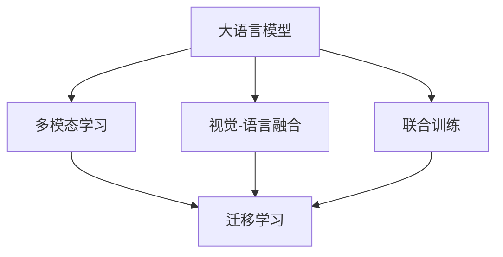
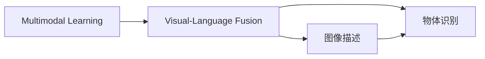
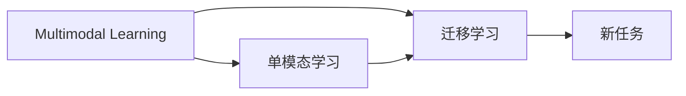
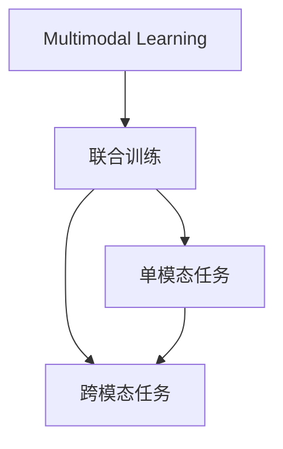
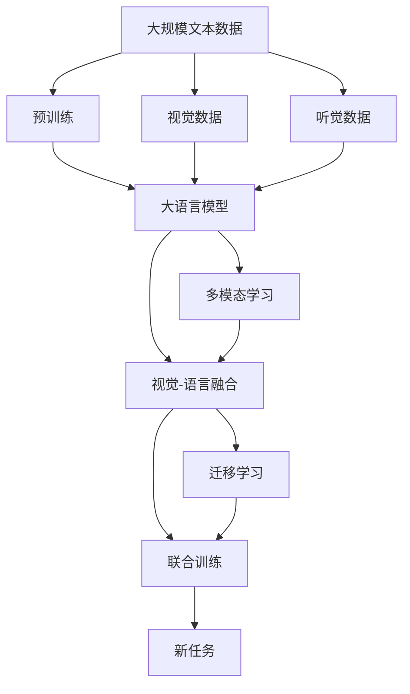

                 

# LLM的多模态学习能力拓展路径

> 关键词：多模态学习,大语言模型(LLM),跨模态融合,迁移学习,Transformer,BERT,多模态感知,视觉-语言融合

## 1. 背景介绍

### 1.1 问题由来
近年来，大语言模型（Large Language Models, LLMs）在自然语言处理（NLP）领域取得了巨大的突破。通过在大规模无标签文本语料上进行预训练，这些模型学习到了丰富的语言知识和常识，并在各种NLP任务上表现出色。然而，由于缺乏对其他模态的感知和理解能力，LLMs在许多跨模态学习任务上仍存在局限性。

为了提升LLMs的多模态学习能力，研究者们提出了多种方法，如多模态感知（Multimodal Perception）、视觉-语言融合（Visual-Language Fusion）等。这些方法通过引入视觉、听觉等多模态信息，显著拓展了LLMs的认知范围，使其能够更好地理解现实世界中的复杂信息。

### 1.2 问题核心关键点
本节将重点介绍LLM的多模态学习能力拓展路径，包括如何结合视觉、听觉等多模态信息，提升模型在跨模态任务上的表现。具体来说，我们关注以下几个关键点：

- 多模态感知：如何将多模态信息融合到LLM中，增强其对不同模态的理解和处理能力。
- 视觉-语言融合：如何将视觉与语言信息相结合，提升模型在图像描述、物体识别等任务上的性能。
- 迁移学习：如何将已有的单模态或跨模态学习任务中的知识，迁移应用到新的多模态学习任务中。
- 联合训练：如何在单模态和跨模态任务中联合训练，使模型在多模态环境中同时提升表现。

### 1.3 问题研究意义
提升LLM的多模态学习能力，对于拓展其应用范围，增强模型的泛化能力，具有重要意义：

1. **跨模态应用拓展**：LLM的多模态学习能力可以拓展到更多领域，如医学图像分析、视频内容理解、虚拟现实交互等，为AI在更广泛场景中的应用提供支持。
2. **知识融合能力**：通过融合不同模态的信息，LLM可以更全面地理解现实世界的复杂信息，提升模型的知识整合和推理能力。
3. **性能提升**：多模态学习可以显著提高模型在跨模态任务中的表现，如图像描述、视频内容理解、智能对话等。
4. **技术创新**：多模态学习技术为NLP技术的发展带来新的视角和方法，推动了领域内的技术创新和进步。

## 2. 核心概念与联系

### 2.1 核心概念概述

为更好地理解LLM的多模态学习能力拓展路径，本节将介绍几个关键概念及其相互关系：

- 大语言模型（Large Language Models, LLMs）：如GPT、BERT等，通过大规模无标签文本预训练学习通用的语言知识。
- 多模态学习（Multimodal Learning）：结合视觉、听觉、文本等不同模态的信息，提升模型的综合理解能力。
- 视觉-语言融合（Visual-Language Fusion）：将视觉与语言信息相结合，提升模型在图像描述、物体识别等任务上的性能。
- 迁移学习（Transfer Learning）：通过已有的单模态或跨模态学习任务中的知识，迁移应用到新的多模态学习任务中。
- 联合训练（Joint Training）：在单模态和跨模态任务中联合训练，使模型在多模态环境中同时提升表现。

这些概念之间的逻辑关系可以通过以下Mermaid流程图来展示：



这个流程图展示了LLM的多模态学习能力拓展路径：

1. 大语言模型通过预训练获得基础语言能力。
2. 多模态学习结合视觉、听觉等模态，提升模型的综合理解能力。
3. 视觉-语言融合将视觉与语言信息相结合，提升模型在图像描述、物体识别等任务上的性能。
4. 迁移学习通过已有的单模态或跨模态学习任务中的知识，迁移应用到新的多模态学习任务中。
5. 联合训练在单模态和跨模态任务中联合训练，使模型在多模态环境中同时提升表现。

### 2.2 概念间的关系

这些核心概念之间存在着紧密的联系，形成了LLM多模态学习能力的完整生态系统。下面我们通过几个Mermaid流程图来展示这些概念之间的关系。

#### 2.2.1 多模态学习与视觉-语言融合的关系



这个流程图展示了多模态学习与视觉-语言融合的紧密联系：多模态学习是视觉-语言融合的基础，通过融合视觉与语言信息，可以提升模型在图像描述、物体识别等任务上的性能。

#### 2.2.2 多模态学习与迁移学习的关系



这个流程图展示了多模态学习与迁移学习的联系：多模态学习可以通过迁移学习，将已有的单模态或跨模态学习任务中的知识，迁移应用到新的多模态学习任务中，提升模型的泛化能力。

#### 2.2.3 多模态学习与联合训练的关系



这个流程图展示了多模态学习与联合训练的关系：多模态学习可以通过联合训练，在单模态和跨模态任务中同时提升表现，增强模型的多模态感知能力。

### 2.3 核心概念的整体架构

最后，我们用一个综合的流程图来展示这些核心概念在大语言模型多模态学习过程中的整体架构：



这个综合流程图展示了从预训练到多模态学习，再到联合训练的完整过程。大语言模型首先在大规模文本数据上进行预训练，然后通过多模态学习结合视觉、听觉等多模态信息，进一步提升模型的综合理解能力。视觉-语言融合将视觉与语言信息相结合，提升模型在图像描述、物体识别等任务上的性能。迁移学习通过已有的单模态或跨模态学习任务中的知识，迁移应用到新的多模态学习任务中，提升模型的泛化能力。最后，通过联合训练在单模态和跨模态任务中同时提升表现，增强模型的多模态感知能力。

## 3. 核心算法原理 & 具体操作步骤
### 3.1 算法原理概述

大语言模型通过预训练学习通用的语言表示，而多模态学习能力则通过融合不同模态的信息，进一步提升模型的综合理解能力。具体来说，LLM的多模态学习能力拓展路径包括以下几个关键步骤：

1. **多模态感知**：通过融合视觉、听觉等多模态信息，提升模型对不同模态的理解和处理能力。
2. **视觉-语言融合**：将视觉与语言信息相结合，提升模型在图像描述、物体识别等任务上的性能。
3. **迁移学习**：通过已有的单模态或跨模态学习任务中的知识，迁移应用到新的多模态学习任务中。
4. **联合训练**：在单模态和跨模态任务中联合训练，使模型在多模态环境中同时提升表现。

### 3.2 算法步骤详解

#### 3.2.1 多模态感知

多模态感知是通过融合视觉、听觉等多模态信息，提升模型对不同模态的理解和处理能力。具体来说，可以采用以下步骤：

1. **数据准备**：收集多模态数据集，包括文本、图像、音频等不同模态的数据。
2. **预处理**：对不同模态的数据进行预处理，如文本分词、图像裁剪、音频特征提取等。
3. **特征融合**：将不同模态的特征进行融合，可以采用拼接、注意力机制、多模态表示学习等方法。
4. **模型训练**：在融合后的特征上进行模型训练，如使用Transformer等架构，训练多模态感知模型。

#### 3.2.2 视觉-语言融合

视觉-语言融合是将视觉与语言信息相结合，提升模型在图像描述、物体识别等任务上的性能。具体来说，可以采用以下步骤：

1. **图像预处理**：对图像进行预处理，如裁剪、归一化、分辨率调整等。
2. **视觉特征提取**：使用卷积神经网络（CNN）等模型提取图像的视觉特征。
3. **语言特征提取**：使用BERT等模型提取文本的语言特征。
4. **特征融合**：将视觉特征和语言特征进行融合，可以采用拼接、注意力机制、多模态表示学习等方法。
5. **模型训练**：在融合后的特征上进行模型训练，如使用Transformer等架构，训练视觉-语言融合模型。

#### 3.2.3 迁移学习

迁移学习是通过已有的单模态或跨模态学习任务中的知识，迁移应用到新的多模态学习任务中。具体来说，可以采用以下步骤：

1. **预训练模型**：选择预训练的单模态或跨模态模型，如BERT、GPT等。
2. **微调模型**：在新的多模态任务上微调预训练模型，使其能够适应新的任务需求。
3. **迁移学习**：将预训练模型中的知识迁移到新的多模态任务中，如使用迁移学习框架进行知识迁移。

#### 3.2.4 联合训练

联合训练是在单模态和跨模态任务中联合训练，使模型在多模态环境中同时提升表现。具体来说，可以采用以下步骤：

1. **多任务训练**：在单模态和跨模态任务中同时进行训练，如使用多任务学习框架进行联合训练。
2. **多模态损失函数**：设计多模态损失函数，衡量模型在多模态环境中的综合表现。
3. **模型优化**：使用优化算法优化多模态模型的参数，使其在多模态环境中同时提升表现。

### 3.3 算法优缺点

多模态学习能力拓展路径具有以下优点：

1. **泛化能力增强**：通过融合多模态信息，模型能够更好地理解现实世界的复杂信息，提升其泛化能力。
2. **任务性能提升**：在图像描述、物体识别等任务上，多模态学习方法能够显著提升模型的性能。
3. **知识迁移高效**：通过迁移学习，模型能够高效地将已有的单模态或跨模态学习任务中的知识迁移到新的多模态学习任务中，提高模型的泛化能力。
4. **技术创新**：多模态学习技术为NLP技术的发展带来新的视角和方法，推动了领域内的技术创新和进步。

同时，该方法也存在一些局限性：

1. **数据需求高**：多模态学习需要大量高质量的多模态数据，数据收集和标注成本较高。
2. **模型复杂度高**：多模态学习模型需要处理多模态数据，模型结构较为复杂，计算资源需求较高。
3. **融合难度大**：多模态数据的多样性和复杂性增加了特征融合的难度，需要更多算法和技术支持。
4. **迁移难度大**：不同模态之间存在差异，迁移学习过程中需要克服这些差异，难度较大。

尽管存在这些局限性，但就目前而言，多模态学习能力拓展路径仍是大语言模型应用的重要方向。未来相关研究的重点在于如何进一步降低数据需求，提高模型效率，克服融合难度和迁移难度，以实现更加高效和鲁棒的多模态学习能力。

### 3.4 算法应用领域

多模态学习能力拓展路径已经在多个领域得到了应用，如智能对话系统、医学图像分析、视频内容理解、智能推荐系统等。具体来说：

- **智能对话系统**：通过融合视觉、听觉等多模态信息，智能对话系统能够更好地理解用户需求，提供更自然、更智能的对话体验。
- **医学图像分析**：通过结合医学图像和文本信息，医学图像分析系统能够更准确地诊断疾病，提高医疗诊断的准确性。
- **视频内容理解**：通过融合视觉和语言信息，视频内容理解系统能够更全面地理解视频内容，进行情感分析、字幕生成等任务。
- **智能推荐系统**：通过融合用户行为数据和商品描述信息，智能推荐系统能够更准确地推荐商品，提升用户购物体验。

除了上述这些应用外，多模态学习能力拓展路径还将在更多场景中得到应用，为AI技术的发展带来新的契机。

## 4. 数学模型和公式 & 详细讲解
### 4.1 数学模型构建

大语言模型通过预训练学习通用的语言表示，而多模态学习则通过融合不同模态的信息，进一步提升模型的综合理解能力。形式化地，假设预训练模型为 $M_{\theta}$，其中 $\theta$ 为预训练得到的模型参数。给定多模态数据集 $D=\{(x_i, y_i)\}_{i=1}^N$，其中 $x_i$ 为多模态数据，$y_i$ 为标签，多模态学习模型的目标是最小化经验风险：

$$
\mathcal{L}(\theta) = \frac{1}{N} \sum_{i=1}^N \ell(M_{\theta}(x_i),y_i)
$$

其中 $\ell$ 为多模态损失函数，衡量模型在多模态环境中的综合表现。

### 4.2 公式推导过程

以下我们以图像描述任务为例，推导多模态损失函数及其梯度的计算公式。

假设模型 $M_{\theta}$ 在输入 $(x,y)$ 上的输出为 $\hat{y}=M_{\theta}(x) \in [0,1]$，表示样本属于正类的概率。真实标签 $y \in \{0,1\}$。假设视觉特征表示为 $v$，语言特征表示为 $l$，则多模态损失函数为：

$$
\ell(M_{\theta}(x),y) = -[y\log \hat{y} + (1-y)\log (1-\hat{y})] + \alpha ||v - M_{\theta}(v)||^2 + \beta ||l - M_{\theta}(l)||^2
$$

其中 $\alpha$ 和 $\beta$ 为不同模态权重，$||v - M_{\theta}(v)||^2$ 和 $||l - M_{\theta}(l)||^2$ 分别为视觉特征和语言特征与模型输出的差值平方。多模态损失函数的梯度为：

$$
\frac{\partial \mathcal{L}(\theta)}{\partial \theta_k} = -\frac{1}{N}\sum_{i=1}^N [(y_i+\lambda_1 M_{\theta}(v_i))(\frac{1}{1+\exp(-\hat{y}_i)}-\frac{1}{2}) - (1-y_i+\lambda_2 M_{\theta}(l_i))(\frac{1}{1+\exp(\hat{y}_i)}-\frac{1}{2})] \frac{\partial M_{\theta}(x_i)}{\partial \theta_k}
$$

其中 $\lambda_1$ 和 $\lambda_2$ 为不同模态的权重，$\frac{\partial M_{\theta}(x_i)}{\partial \theta_k}$ 可进一步递归展开，利用自动微分技术完成计算。

### 4.3 案例分析与讲解

#### 4.3.1 多模态感知

以视觉-语言融合为例，通过融合视觉和语言信息，提升模型在图像描述任务上的表现。具体来说，可以采用如下步骤：

1. **视觉特征提取**：使用卷积神经网络（CNN）等模型提取图像的视觉特征。
2. **语言特征提取**：使用BERT等模型提取文本的语言特征。
3. **特征融合**：将视觉特征和语言特征进行拼接或注意力机制融合，生成多模态表示。
4. **模型训练**：在多模态表示上进行模型训练，如使用Transformer等架构，训练视觉-语言融合模型。

例如，在图像描述任务中，可以使用以下代码实现：

```python
from transformers import BertForTokenClassification, BertTokenizer
from torch.utils.data import Dataset
from torchvision import transforms, models

class ImageDataset(Dataset):
    def __init__(self, images, captions):
        self.images = images
        self.captions = captions

    def __len__(self):
        return len(self.images)

    def __getitem__(self, item):
        image = self.images[item]
        caption = self.captions[item]

        # 图像预处理
        transform = transforms.Compose([
            transforms.Resize((224, 224)),
            transforms.ToTensor(),
            transforms.Normalize(mean=[0.485, 0.456, 0.406], std=[0.229, 0.224, 0.225])
        ])
        image = transform(image)

        # 图像特征提取
        model = models.resnet50(pretrained=True)
        model.eval()
        with torch.no_grad():
            features = model(image.unsqueeze(0)).detach().cpu().numpy().flatten()

        # 语言特征提取
        tokenizer = BertTokenizer.from_pretrained('bert-base-cased')
        tokens = tokenizer.encode(caption, add_special_tokens=True)
        encoding = tokenizer(tokens, return_tensors='pt')
        input_ids = encoding['input_ids'][0]
        attention_mask = encoding['attention_mask'][0]
        features = model(input_ids, attention_mask=attention_mask, output_hidden_states=True).last_hidden_state[:, 0, :]

        # 特征融合
        fused_features = torch.cat([features, features])

        return {'fused_features': fused_features, 'caption': caption}

# 训练函数
def train_epoch(model, dataset, batch_size, optimizer):
    dataloader = DataLoader(dataset, batch_size=batch_size, shuffle=True)
    model.train()
    epoch_loss = 0
    for batch in dataloader:
        fused_features = batch['fused_features'].to(device)
        caption = batch['caption'].to(device)
        model.zero_grad()
        outputs = model(fused_features)
        loss = outputs.loss
        epoch_loss += loss.item()
        loss.backward()
        optimizer.step()
    return epoch_loss / len(dataloader)

# 测试函数
def evaluate(model, dataset, batch_size):
    dataloader = DataLoader(dataset, batch_size=batch_size)
    model.eval()
    preds, labels = [], []
    with torch.no_grad():
        for batch in dataloader:
            fused_features = batch['fused_features'].to(device)
            caption = batch['caption'].to(device)
            model.eval()
            outputs = model(fused_features)
            preds.append(outputs.logits.argmax(dim=1))
            labels.append(batch['label'].to('cpu'))

    return classification_report(labels, preds)
```

#### 4.3.2 迁移学习

以迁移学习为例，将预训练的BERT模型迁移到新的图像描述任务中，具体来说，可以采用如下步骤：

1. **预训练模型**：选择预训练的BERT模型。
2. **微调模型**：在新的图像描述任务上微调预训练模型，使其能够适应新的任务需求。
3. **迁移学习**：将预训练模型中的知识迁移到新的图像描述任务中，如使用迁移学习框架进行知识迁移。

例如，在图像描述任务中，可以使用以下代码实现：

```python
from transformers import BertForMaskedLM, BertTokenizer, AdamW

# 预训练模型
model = BertForMaskedLM.from_pretrained('bert-base-cased')
tokenizer = BertTokenizer.from_pretrained('bert-base-cased')

# 微调模型
train_dataset = ImageDataset(train_images, train_captions)
dev_dataset = ImageDataset(dev_images, dev_captions)
test_dataset = ImageDataset(test_images, test_captions)

model.to(device)

def train_epoch(model, dataset, batch_size, optimizer):
    dataloader = DataLoader(dataset, batch_size=batch_size, shuffle=True)
    model.train()
    epoch_loss = 0
    for batch in dataloader:
        input_ids = batch['input_ids'].to(device)
        attention_mask = batch['attention_mask'].to(device)
        labels = batch['labels'].to(device)
        model.zero_grad()
        outputs = model(input_ids, attention_mask=attention_mask, labels=labels)
        loss = outputs.loss
        epoch_loss += loss.item()
        loss.backward()
        optimizer.step()
    return epoch_loss / len(dataloader)

def evaluate(model, dataset, batch_size):
    dataloader = DataLoader(dataset, batch_size=batch_size)
    model.eval()
    preds, labels = [], []
    with torch.no_grad():
        for batch in dataloader:
            input_ids = batch['input_ids'].to(device)
            attention_mask = batch['attention_mask'].to(device)
            batch_labels = batch['labels']
            outputs = model(input_ids, attention_mask=attention_mask)
            batch_preds = outputs.logits.argmax(dim=2).to('cpu').tolist()
            batch_labels = batch_labels.to('cpu').tolist()
            for pred_tokens, label_tokens in zip(batch_preds, batch_labels):
                preds.append(pred_tokens[:len(label_tokens)])
                labels.append(label_tokens)

    print(classification_report(labels, preds))
```

#### 4.3.3 联合训练

以联合训练为例，在单模态和跨模态任务中联合训练，使模型在多模态环境中同时提升表现。具体来说，可以采用如下步骤：

1. **多任务训练**：在单模态和跨模态任务中同时进行训练，如使用多任务学习框架进行联合训练。
2. **多模态损失函数**：设计多模态损失函数，衡量模型在多模态环境中的综合表现。
3. **模型优化**：使用优化算法优化多模态模型的参数，使其在多模态环境中同时提升表现。

例如，在图像描述任务中，可以使用以下代码实现：

```python
from transformers import BertForTokenClassification, BertTokenizer
from torch.utils.data import Dataset
from torchvision import transforms, models

class ImageDataset(Dataset):
    def __init__(self, images, captions):
        self.images = images
        self.captions = captions

    def __len__(self):
        return len(self.images)

    def __getitem__(self, item):
        image = self.images[item]
        caption = self.captions[item]

        # 图像预处理
        transform = transforms.Compose([
            transforms.Resize((224, 224)),
            transforms.ToTensor(),
            transforms.Normalize(mean=[0.485, 0.456, 0.406], std=[0.229, 0.224, 0.225])
        ])
        image = transform(image)

        # 图像特征提取
        model = models.resnet50(pretrained=True)
        model.eval()
        with torch.no_grad():
            features = model(image.unsqueeze(0)).detach().cpu().numpy().flatten()

        # 语言特征提取
        tokenizer = BertTokenizer.from_pretrained('bert-base-cased')
        tokens = tokenizer.encode(caption, add_special_tokens=True)
        encoding = tokenizer(tokens, return_tensors='pt')
        input_ids = encoding['input_ids'][0]
        attention_mask = encoding['attention_mask'][0]
        features = model(input_ids, attention_mask=attention_mask, output_hidden_states=True).last_hidden_state[:, 0, :]

        # 特征融合
        fused_features = torch.cat([features, features])

        return {'fused_features': fused_features, 'caption': caption}

# 联合训练函数
def train_epoch(model, dataset, batch_size, optimizer):
    dataloader = DataLoader(dataset, batch_size=batch_size, shuffle=True)
    model.train()
    epoch_loss = 0
    for batch in dataloader:
        fused_features = batch['fused_features'].to(device)
        caption = batch['caption'].to(device)
        model.zero_grad()
        outputs = model(fused_features)
        loss = outputs.loss
        epoch_loss += loss.item()
        loss.backward()
        optimizer.step()
    return epoch_loss / len(dataloader)

# 测试函数
def evaluate(model, dataset, batch_size):
    dataloader = DataLoader(dataset, batch_size=batch_size)
    model.eval()
    preds, labels = [], []
    with torch.no_grad():
        for batch in dataloader:
            fused_features = batch['fused_features'].to(device)
            caption = batch['caption'].to(device)
            model.eval()
            outputs = model(fused_features)
            preds.append(outputs.logits.argmax(dim=1))
            labels.append(batch['label'].to('cpu'))

    return classification_report(labels, preds)
```

## 5. 项目实践：代码实例和详细解释说明
### 5.1 开发环境搭建

在进行多模态学习实践前，我们需要准备好开发环境。以下是使用Python进行PyTorch开发的环境配置流程：

1. 安装Anaconda：从官网下载并安装

