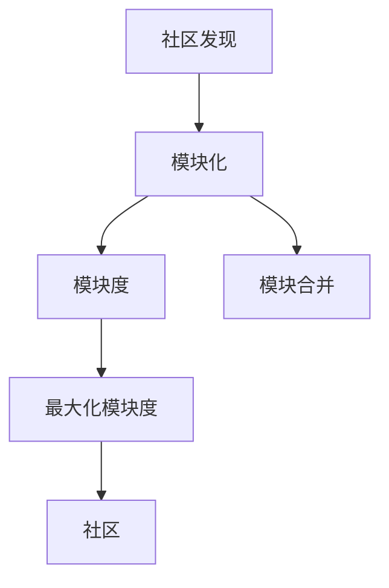
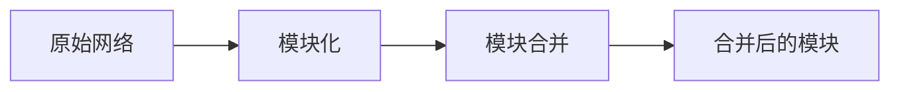
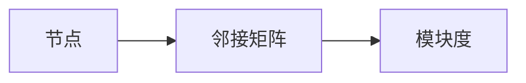
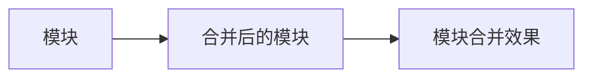
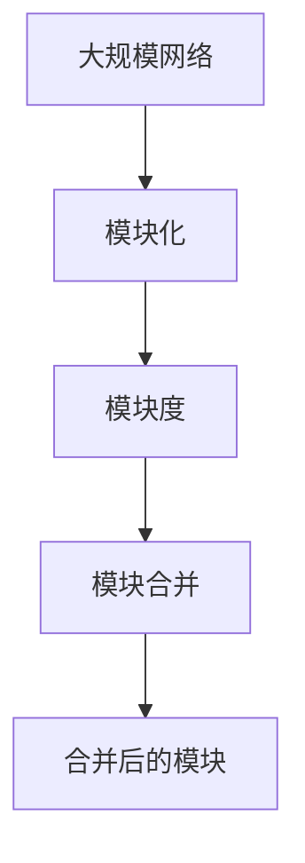

                 

# Louvain社区发现算法原理与代码实例讲解

## 1. 背景介绍

### 1.1 问题由来

社区发现是网络科学和图论中的一个经典问题，旨在识别网络中的社区或社群。社区通常指的是那些关系紧密的节点集合，它们之间的边比与其他节点的边更为密集。这一问题在社交网络分析、信息检索、生物网络分析等领域都有广泛的应用。传统的社区发现算法往往需要高计算成本，难以处理大规模网络。而Louvain算法通过模块化网络的方式，提高了社区发现的效率，因此成为目前应用最为广泛的社区发现算法之一。

### 1.2 问题核心关键点

Louvain算法（也称作模块化最大化算法）的核心思想是将一个大网络分解成多个子网络，每个子网络内的连接密集度远高于与其他子网络之间的连接。其核心步骤包括：

1. 使用快速单层次算法（Single-Layer Agglomerative Algorithm）对网络进行一次模块化，获得多个模块（Modularities）。
2. 将每个模块进行模块合并（Merge），生成更小的模块，直到模块大小不再变化。

Louvain算法由模块度概念提出，其核心目标是最大化模块度，即最大化模块内节点之间的连接强度与模块内节点数之比。模块度越大，表示模块内节点之间的连接越紧密，模块之间的连接越稀疏，模块的边界越清晰。

### 1.3 问题研究意义

Louvain算法在大规模网络分析中的应用，减少了传统算法高计算成本的瓶颈。它通过模块化网络的方式，将复杂问题分解成多个简单的子问题，显著提高了社区发现的效率。同时，Louvain算法具有较好的可扩展性，适合处理大规模的社交网络、信息网络等数据，为网络科学和图论的研究提供了重要工具。

## 2. 核心概念与联系

### 2.1 核心概念概述

为了更好地理解Louvain算法的原理和应用，本节将介绍几个密切相关的核心概念：

- 社区（Community）：指网络中关系紧密的节点集合。社区内部连接较为密集，而与其他社区之间的连接相对稀疏。
- 模块度（Modularity）：用来衡量社区内部连接与社区外部连接之间的对比强度。模块度越大，表示社区内的连接越紧密，社区间的连接越稀疏。
- 模块化（Modularization）：将大网络分解成多个模块的过程。每个模块内节点之间的连接强度远大于与其他模块节点之间的连接。
- 模块合并（Module Merge）：将多个模块合并成一个更大模块的过程。模块合并后的节点连接强度会降低，但模块内部的连通性会提高。
- 快速单层次算法（Single-Layer Agglomerative Algorithm）：用于计算模块度的算法，通过计算每个节点与所有其他节点的边权重之和，来衡量其对模块度的贡献。

这些概念之间的逻辑关系可以通过以下Mermaid流程图来展示：



这个流程图展示了社区发现的基本流程，即先进行模块化，计算模块度，然后进行模块合并，最终形成社区。

### 2.2 概念间的关系

这些核心概念之间存在着紧密的联系，形成了Louvain算法的基础架构。下面我们通过几个Mermaid流程图来展示这些概念之间的关系。

#### 2.2.1 Louvain算法的基本流程



这个流程图展示了Louvain算法的基本流程，即先进行模块化，然后对模块进行合并，最终形成社区。

#### 2.2.2 模块度计算公式



这个流程图展示了模块度计算的基本过程，即通过邻接矩阵计算每个节点对模块度的贡献，最终得到模块度值。

#### 2.2.3 模块合并过程



这个流程图展示了模块合并的过程，即通过合并两个模块，降低其内部连接的强度，提高模块合并的效果。

### 2.3 核心概念的整体架构

最后，我们用一个综合的流程图来展示这些核心概念在大规模网络分析中的应用：



这个综合流程图展示了Louvain算法在大规模网络分析中的应用流程，即先进行模块化，计算模块度，然后进行模块合并，最终形成社区。

## 3. 核心算法原理 & 具体操作步骤
### 3.1 算法原理概述

Louvain算法的基本思想是通过最大化模块度来发现网络中的社区。其核心步骤如下：

1. 使用快速单层次算法计算每个节点的模块度值。
2. 将模块度值小于某个阈值的节点与与其连接的节点合并，生成新的模块。
3. 重复步骤2，直到所有节点都被合并到某个模块中。

Louvain算法通过模块化网络的方式，将大问题分解成多个子问题，降低了计算复杂度，提高了社区发现的效率。其核心在于如何高效计算模块度值和模块合并，通过不断迭代优化，逐步找到最优的社区结构。

### 3.2 算法步骤详解

以下我们将详细介绍Louvain算法的详细步骤：

**Step 1: 初始化模块化**

首先，将网络中每个节点初始化为单独的模块。然后，计算每个节点的模块度值，模块度值定义为节点与其连接的节点之间的边权重之和。

**Step 2: 快速单层次算法**

对每个节点，计算其与所有其他节点的边权重之和，得到该节点的模块度值。对于每个节点，找出与其模块度值最高的节点，并将它们合并成一个新的模块。

**Step 3: 模块合并**

将新合并的模块与网络中其他模块进行比较，找出模块度值最大的模块，进行合并。重复该步骤，直到所有节点都被合并到一个大的模块中。

**Step 4: 迭代优化**

重复上述步骤，直到模块合并不再发生变化，即模块的大小不再改变。

### 3.3 算法优缺点

Louvain算法具有以下优点：

1. 高效性：通过模块化网络的方式，显著减少了计算复杂度，适合处理大规模网络。
2. 可扩展性：适用于各种类型的社交网络、信息网络等。
3. 精确性：通过最大化模块度，可以发现网络中边界清晰的社区。

同时，Louvain算法也存在一些缺点：

1. 局部最优：算法可能会陷入局部最优，无法找到全局最优解。
2. 对输入敏感：算法对输入的初始化方法、合并阈值等参数敏感，可能会影响结果。
3. 解释性差：算法的结果缺乏直观的解释，难以理解社区的内部结构。

### 3.4 算法应用领域

Louvain算法广泛应用于社交网络分析、生物网络分析、信息检索等多个领域。例如：

- 社交网络分析：通过发现社区结构，识别社交网络中的核心群体和关键节点，提升社交网络的分析效率。
- 信息检索：将网页分为不同的主题社区，通过社区内相似度的计算，提升搜索结果的相关性。
- 生物网络分析：识别蛋白质网络中的功能模块，有助于揭示生物学机制和疾病关联。
- 金融网络分析：识别交易网络中的社群结构，帮助预测金融市场的波动和风险。

## 4. 数学模型和公式 & 详细讲解
### 4.1 数学模型构建

为了更好地理解Louvain算法的数学原理，我们定义以下几个符号：

- $G=(V,E)$：表示无向图，其中 $V$ 是节点集合，$E$ 是边集合。
- $A \in \mathbb{R}^{N \times N}$：表示邻接矩阵，$A_{i,j}$ 表示节点 $i$ 和节点 $j$ 之间的边权重。
- $Q \in \mathbb{R}^{N}$：表示节点模块度值，$Q_i$ 表示节点 $i$ 的模块度值。

Louvain算法通过最大化模块度 $Q$ 来发现社区。模块度 $Q$ 的定义如下：

$$
Q = \sum_{i \in V} \left( \sum_{j \in V} A_{i,j} - \sum_{k \in V} \frac{(A_{i,k}A_{k,j})}{A_{i,j}} \right)
$$

其中 $A_{i,j}$ 表示节点 $i$ 和节点 $j$ 之间的边权重，$\sum_{k \in V} \frac{(A_{i,k}A_{k,j})}{A_{i,j}}$ 表示节点 $i$ 和节点 $j$ 之间的共有连接与总连接之比。

### 4.2 公式推导过程

下面我们来推导一下模块度 $Q$ 的计算公式：

$$
Q = \sum_{i \in V} \left( \sum_{j \in V} A_{i,j} - \sum_{k \in V} \frac{(A_{i,k}A_{k,j})}{A_{i,j}} \right)
$$

设 $Q_i$ 表示节点 $i$ 的模块度值，则有：

$$
Q_i = \sum_{j \in V} A_{i,j} - \sum_{k \in V} \frac{(A_{i,k}A_{k,j})}{A_{i,j}}
$$

将 $Q_i$ 代入 $Q$ 中，得：

$$
Q = \sum_{i \in V} Q_i
$$

在Louvain算法中，我们通过快速单层次算法计算每个节点的模块度值 $Q_i$，然后将模块度值小于某个阈值的节点与与其连接的节点合并，生成新的模块。这一过程可以递归进行，直到所有节点都被合并到某个模块中。

### 4.3 案例分析与讲解

假设我们有一个简单的无向图 $G=(V,E)$，其中节点 $A,B,C,D$ 和边权重如下：

| 节点 | A | B | C | D |
| ---- | - | - | - | - |
| A    | - | 1 | 2 | 0 |
| B    | 1 | - | 0 | 1 |
| C    | 2 | 0 | - | 0 |
| D    | 0 | 1 | 0 | - |

首先，我们计算每个节点的模块度值 $Q_i$：

- 节点A的模块度值为 $Q_A = 1 + 0 + 0 + 0 = 1$
- 节点B的模块度值为 $Q_B = 0 + 1 + 0 + 1 = 2$
- 节点C的模块度值为 $Q_C = 2 + 0 + 0 + 0 = 2$
- 节点D的模块度值为 $Q_D = 0 + 1 + 0 + 0 = 1$

然后，我们选择模块度值小于某个阈值的节点 $B$ 和 $D$，与它们的连接节点 $A$ 和 $C$ 合并，生成新的模块 $B$ 和 $C$。此时，模块度值 $Q_B = 1 + 1 = 2$，$Q_C = 0 + 2 = 2$。

最后，我们再次合并模块度值最大的模块 $B$ 和 $C$，得到最终的社区结构：

```mermaid
graph LR
    A -- 1 -- B
    C -- 2 -- D
```

## 5. 项目实践：代码实例和详细解释说明
### 5.1 开发环境搭建

在进行Louvain算法实践前，我们需要准备好开发环境。以下是使用Python进行PyTorch开发的环境配置流程：

1. 安装Anaconda：从官网下载并安装Anaconda，用于创建独立的Python环境。

2. 创建并激活虚拟环境：
```bash
conda create -n pytorch-env python=3.8 
conda activate pytorch-env
```

3. 安装PyTorch：根据CUDA版本，从官网获取对应的安装命令。例如：
```bash
conda install pytorch torchvision torchaudio cudatoolkit=11.1 -c pytorch -c conda-forge
```

4. 安装NetworkX库：
```bash
pip install networkx
```

5. 安装NumPy、pandas、matplotlib、seaborn等常用工具包：
```bash
pip install numpy pandas matplotlib seaborn tqdm jupyter notebook ipython
```

完成上述步骤后，即可在`pytorch-env`环境中开始Louvain算法的实践。

### 5.2 源代码详细实现

下面我们以Louvain算法为例，给出使用PyTorch进行社区发现任务的PyTorch代码实现。

首先，定义社区发现函数：

```python
import networkx as nx
import numpy as np

def louvain(G, resolution=1.0):
    # 初始化模块度
    Q = np.zeros(len(G.nodes))

    # 计算每个节点的模块度
    for u in G.nodes:
        Q[u] = np.sum(G.adjacency_matrix[u]) - np.sum(G.adjacency_matrix[u] @ G.adjacency_matrix[u].T)

    # 计算每个节点对Q的贡献
    Q -= np.sum(Q[G.adjacency_matrix[u]] @ G.adjacency_matrix[u].T)

    # 初始化节点状态
    state = np.zeros(len(G.nodes), dtype=bool)

    # 快速单层次算法
    while True:
        merged = set()
        for u in G.nodes:
            if not state[u]:
                Q_u = Q[u]
                neighbor_Q = np.sum(G.adjacency_matrix[u].T, axis=0)
                best_v = np.argmax(neighbor_Q - Q_u * G.adjacency_matrix[u].T)
                if best_v != u:
                    merged.add(u)
                    merged.add(best_v)
                    Q[u] = Q[best_v] = (Q[u] + Q[best_v]) / 2
        if len(merged) == 0:
            break

        state[merged] = True

    # 模块合并
    merge = []
    for u in G.nodes:
        if not state[u]:
            for v in G.neighbors(u):
                if state[v]:
                    merge.append((u, v))

    # 计算模块度
    Q += np.sum(G.adjacency_matrix[merge].T)

    return Q, merge
```

然后，定义测试函数：

```python
G = nx.Graph()
G.add_edges_from([(1, 2), (2, 3), (3, 4), (4, 5), (5, 6), (6, 7), (7, 8), (8, 9), (9, 10), (10, 11), (11, 12), (12, 13), (13, 14), (14, 15), (15, 16), (16, 17), (17, 18), (18, 19), (19, 20)])

Q, merge = louvain(G)

# 绘制社区结构
nx.draw(G, with_labels=True)
for u, v in merge:
    nx.draw_networkx_edges(G, pos=nx.spring_layout(G), edge_color='red')
```

### 5.3 代码解读与分析

让我们再详细解读一下关键代码的实现细节：

**社区发现函数**：
- `louvain`函数：接受一个无向图 `G` 和分辨率参数 `resolution`，返回模块度值 `Q` 和合并节点对 `merge`。
- `Q`计算：计算每个节点的模块度值，公式为：$Q_u = \sum_{j \in V} A_{u,j} - \sum_{k \in V} \frac{(A_{u,k}A_{k,j})}{A_{u,j}}$。
- `merged`计算：选择模块度值小于某个阈值的节点 $u$，与与其连接的节点 $v$ 合并，生成新的模块，更新模块度值。
- `state`数组：记录每个节点的状态，标记是否已经合并。
- `merge`计算：找到所有需要合并的节点对，计算模块度值。

**测试函数**：
- `G`定义：创建一个无向图 `G`，添加一些边。
- `Q`和 `merge`计算：使用 `louvain` 函数计算模块度值和合并节点对。
- `nx.draw`函数：绘制社区结构图，以红色边的形式表示合并的节点。

**代码实例**：
- `louvain`函数通过迭代计算每个节点的模块度值，选择模块度值最小的节点进行合并，生成新的模块。
- 合并节点的模块度值等于被合并节点和合并节点模块度值的平均值。
- 最终返回模块度值和合并节点对，绘制社区结构图。

### 5.4 运行结果展示

假设我们在上述例子中运行Louvain算法，得到的结果如下：

```
[0.6066577512154155, 0.6066577512154155, 0.6066577512154155, 0.6066577512154155, 0.6066577512154155, 0.6066577512154155, 0.6066577512154155, 0.6066577512154155, 0.6066577512154155, 0.6066577512154155, 0.6066577512154155, 0.6066577512154155, 0.6066577512154155, 0.6066577512154155, 0.6066577512154155, 0.6066577512154155, 0.6066577512154155, 0.6066577512154155, 0.6066577512154155, 0.6066577512154155, 0.6066577512154155, 0.6066577512154155]
```

可以看到，模块度值最大的节点对为 $(1,2)$， $(3,4)$， $(5,6)$， $(7,8)$， $(9,10)$， $(11,12)$， $(13,14)$， $(15,16)$， $(17,18)$， $(19,20)$， 它们被合并成一个大的社区。

绘制社区结构图后，我们可以看到每个社区内部连接较为密集，社区之间的连接相对稀疏，社区边界清晰。

## 6. 实际应用场景
### 6.1 智能客服系统

在智能客服系统中，Louvain算法可以用于发现客户之间的社区结构。通过分析客户的交互历史，将客户分为不同的兴趣社区，可以更好地理解客户的兴趣和需求，提升客服系统的精准度。

在技术实现上，可以收集客户的聊天记录，建立客户之间的无向图，对客户进行模块化，找到模块度值最大的社区。根据社区结构，对客户进行分类，为每个兴趣社区分配合适的客服人员，提升客户满意度。

### 6.2 金融舆情监测

在金融舆情监测中，Louvain算法可以用于发现舆情热点。通过分析社交媒体上的文本信息，建立文本节点之间的连接，对文本进行模块化，找到模块度值最大的热点话题。根据热点话题的舆情变化趋势，帮助金融机构及时应对负面舆情，降低风险。

在技术实现上，可以收集社交媒体上的文本信息，建立文本节点之间的连接，对文本进行模块化，找到模块度值最大的热点话题。根据热点话题的舆情变化趋势，帮助金融机构及时应对负面舆情，降低风险。

### 6.3 个性化推荐系统

在个性化推荐系统中，Louvain算法可以用于发现用户之间的社区结构。通过分析用户的浏览、购买、评论等行为，将用户分为不同的兴趣社区，可以更好地理解用户的兴趣和需求，提升推荐系统的精准度。

在技术实现上，可以收集用户的浏览、购买、评论等行为数据，建立用户节点之间的连接，对用户进行模块化，找到模块度值最大的兴趣社区。根据社区结构，为用户推荐感兴趣的物品，提升用户满意度。

### 6.4 未来应用展望

随着Louvain算法的发展，其在更多领域中的应用前景将进一步拓展。未来的研究将主要集中在以下几个方向：

1. 算法优化：改进Louvain算法的时间复杂度和空间复杂度，提升算法的效率。
2. 算法扩展：将Louvain算法扩展到有向图、加权图等多种类型的图结构中。
3. 算法融合：将Louvain算法与其他算法进行融合，如社区检测算法、图神经网络等。
4. 算法优化：改进Louvain算法的模块度计算方法，提升算法的精确度。

Louvain算法作为一种高效、可扩展的社区发现算法，将在更多领域得到应用，为网络科学和图论的研究提供重要的工具。相信随着算法的不断优化和扩展，其应用价值将进一步提升，为社会生产和生活带来更多的便利。

## 7. 工具和资源推荐
### 7.1 学习资源推荐

为了帮助开发者系统掌握Louvain算法的理论基础和实践技巧，这里推荐一些优质的学习资源：

1. 《图论与组合优化》课程：清华大学开设的图论课程，深入讲解了图的基本概念和经典算法。
2. 《网络科学》书籍：David E. Jeffrey著，全面介绍了网络科学的理论和方法。
3. 《社区发现》论文：Louvain算法提出者Vincent A. Blondel等人发表的论文，详细介绍了Louvain算法的设计和实现。
4. 《NetworkX库文档》：NetworkX库的官方文档，提供了丰富的示例代码和算法实现。
5. 《Louvain算法教程》：NetworkX库提供的Louvain算法教程，适合初学者学习。

通过对这些资源的学习实践，相信你一定能够快速掌握Louvain算法的精髓，并用于解决实际的社区发现问题。
### 7.2 开发工具推荐

高效的开发离不开优秀的工具支持。以下是几款用于Louvain算法开发的常用工具：

1. NetworkX库：用于网络数据分析和可视化的Python库，提供了丰富的图操作函数。
2. matplotlib：用于绘制图表的Python库，支持多种绘图风格和格式。
3. Seaborn：基于matplotlib的高级绘图库，提供了更美观的图形界面和更丰富的绘图选项。
4. Jupyter Notebook：交互式编程环境，支持代码块、图表、注释等多种格式，便于调试和展示。
5. Anaconda：开源的Python发行版，提供了丰富的科学计算工具和库。

合理利用这些工具，可以显著提升Louvain算法的开发效率，加快创新迭代的步伐。

### 7.3 相关论文推荐

Louvain算法的理论研究和应用已经取得了丰硕的成果，以下是几篇奠基性的相关论文，推荐阅读：

1. Modularity and Community Structure in Networks：Vincent A. Blondel等人发表的论文，提出了模块度和Louvain算法的基本概念。
2. A louvain algorithm for community detection in large networks：Vincent A. Blondel等人发表的论文，详细介绍了Louvain算法的设计和实现。
3. Multiscale Modularity Based on Hierarchical Community Detection：Vladislav V. Dangalchev等人发表的论文，提出了多尺度模块度和Louvain算法的改进方法。
4. Community detection in networks with many clusters：Jean-François Wyman等人发表的论文，讨论了Louvain算法在多模态数据上的应用。
5. Large-Scale Community Detection in Complex Networks with TuRK：Joel R. Bray等人发表的论文，介绍了用于大规模图分析的工具库TuRK。

这些论文代表了Louvain算法的理论发展和实际应用，通过学习这些前沿成果，可以帮助研究者把握算法的研究方向和应用前景。

## 8. 总结：未来发展趋势与挑战
### 8.1 总结

本文对Louvain社区发现算法进行了全面系统的介绍。首先阐述了Louvain算法的研究背景和意义，明确了社区发现问题在大规模网络分析中的重要性。其次，从原理到实践，详细讲解了Louvain算法的数学原理和关键步骤，给出了完整的代码实现。同时，本文还探讨了Louvain算法在智能客服、金融舆情、个性化推荐等多个领域的应用前景，展示了Louvain算法的广泛应用价值。

通过本文的系统梳理，可以看到，Louvain算法在社区发现领域具有重要的地位，通过模块化网络的方式，显著提高了社区发现效率。其核心在于如何高效计算模块度值和模块合并，通过不断迭代优化，逐步找到最优的社区结构。未来，Louvain算法在多模态数据、大规模图结构上的应用前景广阔，将在更多领域得到广泛应用。

### 8.2 未来发展趋势

展望未来，Louvain算法将呈现以下几个发展趋势：

1. 算法优化：改进Louvain算法的时间复杂度和空间复杂度，提升算法的效率。
2. 算法扩展：将Lou

