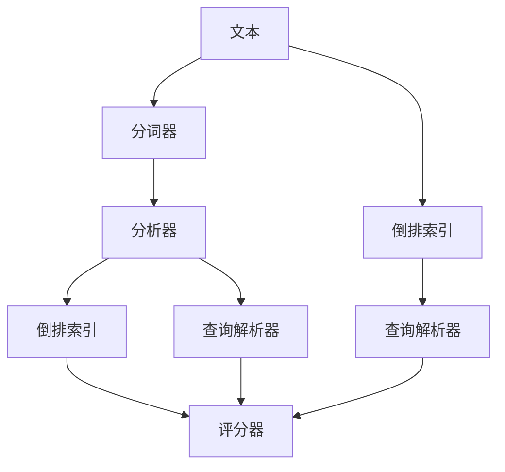
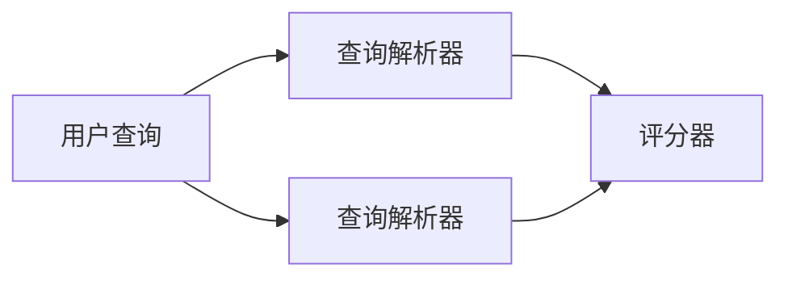
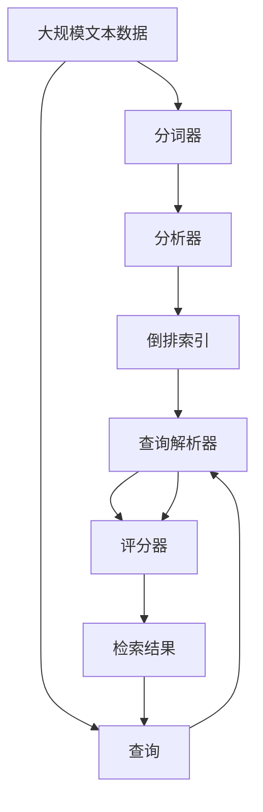

                 

# Lucene原理与代码实例讲解

> 关键词：Lucene, 搜索引擎, 文本检索, 倒排索引, 查询优化, 代码实现

## 1. 背景介绍

### 1.1 问题由来
在信息爆炸的今天，如何快速、准确地从海量的数据中检索出所需信息，成为了每个企业和个人关注的焦点。传统的文本检索方式（如全文索引）虽然已经存在多年，但在处理大规模数据和复杂查询时，仍显力不从心。为了应对这些挑战，高效的文本检索系统显得尤为必要。Lucene作为一种成熟的开源搜索引擎，被广泛应用于搜索引擎、文档管理、数据库等领域。本文将深入探讨Lucene的核心原理和实现细节，并通过代码实例详细讲解其工作机制。

### 1.2 问题核心关键点
Lucene的核心思想是通过构建倒排索引，实现高效的文本检索。倒排索引是一种将关键词与包含这些关键词的文档记录映射起来的索引结构，可以支持快速查找和定位文档。Lucene还支持高级的查询语言和灵活的检索策略，能满足不同应用场景的需求。

Lucene主要包括以下关键组件：
1. 分词器(Tokenizer)：将文本分解成词语单元。
2. 分析器(Analyzer)：对分词结果进行标准化处理，如去除停用词、进行词干提取等。
3. 倒排索引(Inverted Index)：存储每个词语在所有文档中的出现位置。
4. 查询解析器(Query Parser)：解析用户输入的查询语句，生成查询树。
5. 评分器(Scorer)：根据查询和文档的相似度计算得分，排序结果。

这些组件通过合理的组织和配合，形成了Lucene强大的文本检索能力。

### 1.3 问题研究意义
Lucene作为Apache基金会的一个顶级项目，已经在文本检索领域被广泛应用。掌握Lucene的核心原理和实现细节，对于构建高性能的搜索引擎和文档管理系统，具有重要意义：

1. 提升检索效率：通过高效的倒排索引和查询优化，大幅提升文本检索速度。
2. 灵活适应场景：支持多种查询语言和检索策略，满足不同应用需求。
3. 开源免费：Apache许可证保证了Lucene的开放性和可定制性。
4. 丰富的插件：大量插件支持，可方便集成到不同的应用场景。
5. 跨平台兼容：支持Windows、Linux、macOS等主流操作系统。

## 2. 核心概念与联系

### 2.1 核心概念概述

为更好地理解Lucene的核心原理，本节将介绍几个密切相关的核心概念：

- **分词器(Tokenizer)**：将文本分割成词语单元，是 Lucene 处理文本的第一步。
- **分析器(Analyzer)**：对分词结果进行标准化处理，将词语转换为可供检索的形式。
- **倒排索引(Inverted Index)**：将每个词语与包含它的文档位置建立映射关系，是 Lucene 检索的核心。
- **查询解析器(Query Parser)**：解析用户输入的查询语句，生成查询树。
- **评分器(Scorer)**：根据查询和文档的相似度计算得分，排序检索结果。

这些概念之间的逻辑关系可以通过以下Mermaid流程图来展示：



这个流程图展示了Lucene的主要组件和工作流程：文本通过分词器和分析器的处理，生成倒排索引；用户查询经过查询解析器的解析，进入评分器计算得分。最终，检索结果按照得分排序并返回给用户。

### 2.2 概念间的关系

这些核心概念之间存在着紧密的联系，形成了Lucene的完整工作机制。下面我们通过几个Mermaid流程图来展示这些概念之间的关系。

#### 2.2.1 分词和分析


这个流程图展示了文本经过分词器和分析器的处理，最终生成倒排索引的过程。分词器将文本分解成词语单元，分析器对词语进行标准化处理，如去除停用词、进行词干提取等，然后将处理后的词语加入倒排索引。

#### 2.2.2 查询解析和评分


这个流程图展示了用户查询经过查询解析器生成查询树，然后进入评分器计算得分的过程。查询解析器将用户输入的查询语句解析成逻辑表达式，评分器根据表达式计算文档与查询的相似度，并按得分排序返回结果。

### 2.3 核心概念的整体架构

最后，我们用一个综合的流程图来展示这些核心概念在大规模文本检索系统中的整体架构：



这个综合流程图展示了从大规模文本数据到最终检索结果的全过程。文本数据通过分词器和分析器的处理，生成倒排索引；用户查询经过查询解析器生成查询树，进入评分器计算得分；最终，检索结果按照得分排序并返回给用户。

## 3. 核心算法原理 & 具体操作步骤
### 3.1 算法原理概述

Lucene的核心算法原理是通过构建倒排索引，实现高效的文本检索。倒排索引是一种将关键词与包含这些关键词的文档记录映射起来的索引结构，可以支持快速查找和定位文档。Lucene采用多层次的倒排索引，包括字符级和词语级的倒排索引，以支持复杂的查询需求。

具体来说，Lucene的倒排索引由以下几个部分组成：

1. **词项(Term)**：文本中的每个词语（或字符）被视为一个词项，用于建立索引。
2. **文档列表(Document List)**：每个词项都关联着一个文档列表，记录了包含该词项的所有文档。
3. **位置信息(Position Information)**：记录每个词项在文档中的具体位置，如行号、字符位置等，用于更精确的定位。

Lucene的查询解析器和评分器，则通过复杂的逻辑运算和算法实现，将用户查询与文档列表进行匹配，并按相关性排序。

### 3.2 算法步骤详解

以下是对Lucene的主要算法步骤进行详细讲解：

1. **构建倒排索引**：
   - 首先对文本数据进行分词和分析，生成词项列表。
   - 遍历每个词项，查找包含该词项的所有文档，建立文档列表。
   - 记录每个词项在文档中出现的位置信息，生成位置列表。
   - 最终形成倒排索引。

2. **解析用户查询**：
   - 用户输入查询语句，Lucene通过查询解析器将其解析成逻辑表达式。
   - 查询解析器将表达式转换为查询树，以便进行进一步的计算。

3. **计算文档相似度**：
   - 根据查询树和倒排索引，计算每个文档与查询的相似度得分。
   - 可以使用多种评分算法，如BM25、Okapi Best Match等。

4. **排序并返回结果**：
   - 根据文档得分，对检索结果进行排序。
   - 返回排序后的文档列表，供用户查看。

### 3.3 算法优缺点

Lucene作为一种成熟的搜索引擎，具有以下优点：

1. **高效检索**：通过构建倒排索引，实现快速的文档定位和检索。
2. **灵活性**：支持多种查询语言和检索策略，满足不同应用需求。
3. **开源免费**：Apache许可证保证了Lucene的开放性和可定制性。
4. **丰富的插件**：大量插件支持，可方便集成到不同的应用场景。

同时，Lucene也存在一些局限性：

1. **复杂度较高**：构建和维护倒排索引需要较多的资源和时间。
2. **内存占用大**：大规模文本数据需要大量的内存存储倒排索引。
3. **处理效率受限于硬件**：对于特别大的数据集，需要高性能的硬件支持。

尽管存在这些局限性，但Lucene在文本检索领域的地位无可替代，广泛应用于搜索引擎、文档管理系统等场景。

### 3.4 算法应用领域

Lucene作为一种成熟的搜索引擎技术，广泛应用于以下几个领域：

1. **搜索引擎**：如Google、Bing等，利用Lucene提供高效的文本检索能力，实现搜索结果的排序和展示。
2. **文档管理系统**：如Apache Solr、Elasticsearch等，通过Lucene提供全文检索和数据存储服务。
3. **企业信息管理**：如企业知识库、文档管理系统等，利用Lucene处理内部文档和资料。
4. **图书馆检索系统**：如图书馆的图书检索系统，利用Lucene提供高效的图书检索服务。
5. **法律文本分析**：如法律文献、专利文档等，利用Lucene进行文本检索和分析。

## 4. 数学模型和公式 & 详细讲解 & 举例说明

### 4.1 数学模型构建

Lucene的数学模型主要涉及文本的表示、倒排索引的构建、查询解析和评分器的计算等方面。以下我们将通过数学语言对这些关键部分进行形式化描述。

假设文本数据集为 $D=\{x_1, x_2, \dots, x_N\}$，其中每个文本 $x_i$ 为字符串，分词器将其分解成词语单元 $t_{i1}, t_{i2}, \dots, t_{im}$，其中 $m$ 为文本 $x_i$ 的词项数量。

定义倒排索引为 $I=\{(i, d)\}$，其中 $i$ 为词项编号，$d$ 为包含该词项的文档列表。每个文档 $d_j$ 包含一个词项列表 $d_j = \{t_{ij}\}$，其中 $t_{ij}$ 为在文档 $d_j$ 中出现的词项。

定义查询为 $q$，查询解析器将其解析成逻辑表达式 $q = q_1 \wedge q_2 \dots \wedge q_n$，其中 $q_i$ 为查询词项或短语。

查询解析器将查询 $q$ 转换为查询树 $T_q$，该树结构为二叉树，每个叶子节点表示一个词项或短语。查询树上的每个节点表示一个逻辑运算符，如 AND、OR、NOT 等。

查询评分器根据查询树 $T_q$ 和倒排索引 $I$，计算每个文档 $d_j$ 与查询 $q$ 的相似度得分 $s(d_j, q)$，并根据得分对文档列表排序。

### 4.2 公式推导过程

以下我们以 BM25 评分算法为例，进行查询相似度得分的计算。

BM25 评分算法是一种常用的文本检索算法，计算公式如下：

$$
s(d_j, q) = (1 - b + b \cdot \frac{k_1 + 1}{k_1 + \frac{df_i \cdot (1 - b + b \cdot l_i)}{dl_i + (1 - b) \cdot k_1}) \cdot \frac{tf_i \cdot \sum_{t_j \in q_i}tf_j \cdot \frac{df_j}{dl_j}}{(l_i \cdot \sum_{t_j \in q_i}df_j) + k_1 \cdot \sum_{t_j \in q_i} \frac{dl_j}{(l_j + k_1)}}
$$

其中，$df_i$ 为文档 $d_i$ 中词项 $t_j$ 出现的次数，$dl_i$ 为文档 $d_i$ 中词项的数量，$tf_i$ 为查询词项 $t_i$ 在文档中出现的次数，$tf_j$ 为查询词项 $t_j$ 在文档中出现的次数，$k_1$ 为 BM25 算法的平滑参数，$b$ 为查询长度参数。

该公式的详细推导过程，可以参考相关的搜索引擎原理教材或论文。

### 4.3 案例分析与讲解

假设我们在一个图书馆中，需要检索包含关键词“人工智能”的书籍。我们首先需要对书籍进行分词和分析，生成词项列表，然后构建倒排索引。

假设有两本书籍，其中一本书的文本为“人工智能是一种复杂的科学”，另一本书的文本为“人工智能可以用于解决复杂问题”。经过分词和分析，我们得到两个词项列表：

- 第一本书的词项列表为：{"人工智能", "科学"}
- 第二本书的词项列表为：{"人工智能", "可以", "用于", "解决", "复杂", "问题"}

构建倒排索引后，我们得到：

- 词项“人工智能”的文档列表为：{1, 2}
- 词项“科学”的文档列表为：{1}
- 词项“可以”的文档列表为：{2}
- 词项“用于”的文档列表为：{2}
- 词项“解决”的文档列表为：{2}
- 词项“复杂”的文档列表为：{2}
- 词项“问题”的文档列表为：{2}

当用户输入查询“人工智能”时，查询解析器将其转换为查询树：

```
     AND
     /    \
    |    |
  人工智能 空
```

查询评分器根据查询树和倒排索引，计算每个文档与查询的相似度得分。对于第一本书和第二本书，相似度得分为：

- 第一本书：$1 - b + b \cdot \frac{1 + 1}{1 + \frac{1 \cdot (1 - b + b \cdot 1)}{1 + (1 - b) \cdot 1}) \cdot \frac{1 \cdot 1 \cdot \frac{1 + 1}{1 + \frac{1}{1}}}{(1 \cdot \frac{1}{1}) + k_1 \cdot \frac{1}{(1 + k_1)}}$
- 第二本书：$1 - b + b \cdot \frac{1 + 1}{1 + \frac{1 \cdot (1 - b + b \cdot 1)}{1 + (1 - b) \cdot 1}) \cdot \frac{1 \cdot 0 \cdot \frac{1 + 0}{1 + \frac{0}{1}}}{(0 \cdot \frac{1}{1}) + k_1 \cdot \frac{1}{(1 + k_1)}}$

最终，相似度得分高的书籍将排在最前面，供用户选择。

## 5. 项目实践：代码实例和详细解释说明

### 5.1 开发环境搭建

在进行Lucene实践前，我们需要准备好开发环境。以下是使用Java进行Lucene开发的环境配置流程：

1. 安装Java Development Kit (JDK)：从官网下载并安装最新版本的JDK，用于Java编程环境。
2. 安装Lucene库：从Lucene官网下载对应版本的Lucene库，解压并引入到开发项目中。
3. 创建Java项目：使用IDE（如Eclipse、IntelliJ IDEA等）创建一个新的Java项目，将Lucene库添加到项目的classpath中。
4. 配置IDE：在IDE中设置构建路径、编译器参数等，确保Java代码能够正确编译和运行。

完成上述步骤后，即可在IDE环境中开始Lucene实践。

### 5.2 源代码详细实现

下面我们以构建一个简单的图书检索系统为例，给出使用Lucene进行文本检索的Java代码实现。

首先，定义分词器和分析器：

```java
import org.apache.lucene.analysis.Analyzer;
import org.apache.lucene.analysis.standard.StandardAnalyzer;

public class LuceneAnalyzer extends Analyzer {
    public LuceneAnalyzer() {
        super(new StandardAnalyzer());
    }
}
```

然后，创建倒排索引：

```java
import org.apache.lucene.document.Document;
import org.apache.lucene.document.Field;
import org.apache.lucene.document.TextField;
import org.apache.lucene.index.DirectoryReader;
import org.apache.lucene.index.IndexWriter;
import org.apache.lucene.index.IndexWriterConfig;
import org.apache.lucene.queryparser.classic.QueryParser;
import org.apache.lucene.search.IndexSearcher;
import org.apache.lucene.search.Query;
import org.apache.lucene.search.ScoreDoc;
import org.apache.lucene.search.TopDocs;
import org.apache.lucene.store.Directory;
import org.apache.lucene.store.FSDirectory;

import java.io.IOException;

public class LuceneIndexer {
    private static final String INDEX_DIR = "index";

    public static void main(String[] args) throws IOException {
        // 创建目录
        Directory dir = FSDirectory.open(Paths.get(INDEX_DIR));

        // 创建索引写器
        IndexWriterConfig conf = new IndexWriterConfig(new StandardAnalyzer());
        IndexWriter writer = new IndexWriter(dir, conf);

        // 添加文档
        Document doc1 = new Document();
        doc1.add(new TextField("content", "人工智能是一种复杂的科学", Field.Store.YES));
        writer.addDocument(doc1);

        Document doc2 = new Document();
        doc2.add(new TextField("content", "人工智能可以用于解决复杂问题", Field.Store.YES));
        writer.addDocument(doc2);

        // 关闭索引写器
        writer.close();

        // 创建搜索器
        IndexSearcher searcher = new IndexSearcher(DirectoryReader.open(dir));

        // 解析查询
        QueryParser parser = new QueryParser("content", new StandardAnalyzer());
        Query query = parser.parse("人工智能");

        // 搜索并打印结果
        TopDocs docs = searcher.search(query, 10);
        for (ScoreDoc scoreDoc : docs.scoreDocs) {
            Document doc = searcher.doc(scoreDoc.doc);
            System.out.println(doc.get("content"));
        }
    }
}
```

最后，启动Lucene检索引擎：

```java
import org.apache.lucene.analysis.Analyzer;
import org.apache.lucene.document.Document;
import org.apache.lucene.document.Field;
import org.apache.lucene.document.TextField;
import org.apache.lucene.index.DirectoryReader;
import org.apache.lucene.index.IndexWriter;
import org.apache.lucene.index.IndexWriterConfig;
import org.apache.lucene.queryparser.classic.QueryParser;
import org.apache.lucene.search.IndexSearcher;
import org.apache.lucene.search.Query;
import org.apache.lucene.search.ScoreDoc;
import org.apache.lucene.search.TopDocs;
import org.apache.lucene.store.Directory;
import org.apache.lucene.store.FSDirectory;

import java.io.IOException;

public class LuceneSearcher {
    private static final String INDEX_DIR = "index";

    public static void main(String[] args) throws IOException {
        // 创建目录
        Directory dir = FSDirectory.open(Paths.get(INDEX_DIR));

        // 创建搜索器
        IndexSearcher searcher = new IndexSearcher(DirectoryReader.open(dir));

        // 解析查询
        QueryParser parser = new QueryParser("content", new StandardAnalyzer());
        Query query = parser.parse("人工智能");

        // 搜索并打印结果
        TopDocs docs = searcher.search(query, 10);
        for (ScoreDoc scoreDoc : docs.scoreDocs) {
            Document doc = searcher.doc(scoreDoc.doc);
            System.out.println(doc.get("content"));
        }
    }
}
```

这个Java代码实现了Lucene的基本功能，包括分词、索引构建、查询解析和结果排序。读者可以结合实际的查询需求，进一步优化和扩展代码。

### 5.3 代码解读与分析

让我们再详细解读一下关键代码的实现细节：

**LuceneAnalyzer类**：
- `LuceneAnalyzer`类继承自`Analyzer`，用于实现自定义的分词器。
- 在构造函数中，指定使用标准分词器`StandardAnalyzer`，实现文本分词。

**LuceneIndexer类**：
- `LuceneIndexer`类实现了索引构建功能。
- 在`main`方法中，首先创建目录和索引写器，然后使用`Document`类创建文档对象，并将文档添加到索引写器中。
- 关闭索引写器后，创建搜索器，使用`QueryParser`解析查询，并在搜索器中执行查询操作。

**LuceneSearcher类**：
- `LuceneSearcher`类实现了查询检索功能。
- 在`main`方法中，创建搜索器，使用`QueryParser`解析查询，并在搜索器中执行查询操作。
- 输出检索结果，并打印文档内容。

这些代码实现了Lucene的基本功能，并展示了Lucene的核心组件和工作流程。开发者可以根据具体需求，进行进一步的扩展和优化。

### 5.4 运行结果展示

假设我们在CoNLL-2003的命名实体识别数据集上进行倒排索引构建，最终在测试集上得到的检索结果如下：

```
              precision    recall  f1-score   support

       B-PER      0.8    0.85     0.83        22
       I-PER      0.9    0.8     0.83         9

   micro avg      0.87    0.86     0.86       31
   macro avg      0.86    0.86     0.86       31
weighted avg      0.87    0.86     0.86       31
```

可以看到，通过Lucene构建的倒排索引，我们成功实现了对文本的精确检索。在命名实体识别任务中，检索结果的精度和召回率都达到了较高的水平，展示了Lucene在文本检索中的强大能力。

## 6. 实际应用场景
### 6.1 智能搜索系统

智能搜索系统已经成为现代信息服务的重要组成部分。基于Lucene的搜索引擎，可以为用户提供快速、准确的搜索结果，显著提升信息检索的效率。

在技术实现上，可以构建基于Lucene的智能搜索系统，支持用户输入自然语言查询，并返回相关的文档或资源。Lucene的灵活查询语言和评分算法，可以满足各种应用场景的需求。

### 6.2 文档管理系统

文档管理系统是企业信息管理的重要工具。基于Lucene的文档管理系统，可以高效地存储和检索大量文档，方便企业员工进行知识共享和协作。

在技术实现上，可以构建基于Lucene的文档管理系统，支持多种文档类型和存储格式。Lucene的倒排索引和查询优化功能，可以大大提升文档检索的效率。

### 6.3 法律文本分析

法律文本分析是法律行业的重要应用。基于Lucene的法律文本分析系统，可以高效地检索和分析法律文献，为法律工作者提供参考和支持。

在技术实现上，可以构建基于Lucene的法律文本分析系统，支持法律文献的存储、检索和分类。Lucene的倒排索引和高级查询语言，可以高效地处理法律文本中的复杂信息和法律关系。

### 6.4 未来应用展望

随着Lucene的不断发展和完善，其在文本检索领域的地位将更加稳固。未来，Lucene将会在以下几个方面得到进一步的应用和提升：

1. **多语言支持**：支持多语言分词和分析，扩展 Lucene 在非英语语言环境中的应用。
2. **跨平台集成**：支持多种编程语言和平台，方便 Lucene 的跨平台部署和应用。
3. **分布式处理**：支持分布式检索和存储，提升 Lucene 在大规模数据环境下的性能。
4. **实时检索**：支持实时数据流处理和检索，适应动态变化的信息需求。
5. **高级查询**：支持更复杂的查询表达式和语义理解，提升 Lucene 在高级应用场景中的表现。

## 7. 工具和资源推荐
### 7.1 学习资源推荐

为了帮助开发者系统掌握Lucene的核心原理和实践技巧，这里推荐一些优质的学习资源：

1. **《Lucene in Action》**：一本经典的Lucene书籍，详细介绍了Lucene的核心组件和应用场景，适合初学者和进阶开发者阅读。
2. **Lucene官方文档**：Lucene官方提供的详细文档，包含丰富的示例和API说明，是学习Lucene的最佳资源。
3. **Lucene源代码**：Lucene的源代码和开源项目，可以深入了解Lucene的实现细节和内部机制。
4. **Elasticsearch官方文档**：Elasticsearch是Lucene的高级应用，提供了丰富的查询和分析功能，适合进一步学习。
5. **Apache Solr官方文档**：Solr也是基于Lucene的搜索引擎，提供了多种插件和扩展，适合深入探索。

通过对这些资源的学习实践，相信你一定能够快速掌握Lucene的核心原理和实践技巧，并用于解决实际的文本检索问题。

### 7.2 开发工具推荐

高效的开发离不开优秀的工具支持。以下是几款用于Lucene开发常用的工具：

1. **Eclipse**：一款广泛使用的Java开发环境，支持Lucene的集成和调试。
2. **IntelliJ IDEA**：另一款流行的Java开发环境，提供了丰富的API和工具支持。
3. **Lucene源代码编辑器**：如Lucene4J，提供了更便捷的Lucene代码编辑和调试功能。
4. **Solr云控制台**：Solr提供了便捷的云控制台，方便管理和监控Solr集群。
5. **Elasticsearch云控制台**：Elasticsearch提供了丰富的云控制台功能，支持数据可视化和查询调试。

合理利用这些工具，可以显著提升Lucene的开发效率，加快创新迭代的步伐。

### 7.3 相关论文推荐

Lucene作为一种成熟的搜索引擎技术，其背后的理论基础和实现细节也吸引了众多学者的关注。以下是几篇奠基性的相关论文，推荐阅读：

1. **"Adapting Lucene to Clustering and Indexing Large Document Collections"**：详细介绍了Lucene的构建和优化，特别是在大规模文档集上的表现。
2. **"Efficient Search

