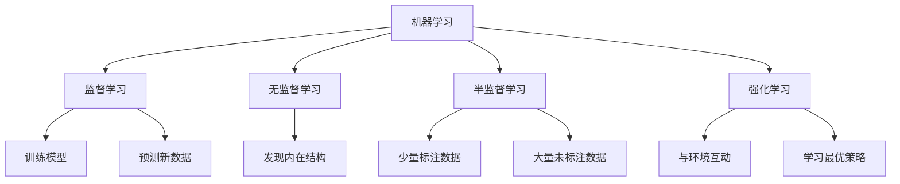

                 

# Machine Learning原理与代码实例讲解

> 关键词：机器学习,算法原理,编程技巧,代码实例,学习资源推荐

## 1. 背景介绍

### 1.1 问题由来
机器学习（Machine Learning, ML）作为人工智能（AI）的重要分支，其核心思想是通过数据训练模型，使模型自动从数据中学习特征和规律，从而进行预测和决策。机器学习的应用领域广泛，包括图像识别、自然语言处理、推荐系统、金融预测等。

近年来，随着深度学习（Deep Learning, DL）的兴起，机器学习进入了快速发展阶段，成为解决复杂问题的有力工具。但由于深度学习模型参数众多，计算资源需求高，模型的训练和部署成本昂贵。因此，浅层机器学习算法仍然在许多领域发挥着重要作用，如线性回归、决策树、支持向量机等。

本文将系统介绍机器学习的原理与代码实例，帮助读者理解和掌握常见的机器学习算法，并在实际项目中灵活应用。

## 2. 核心概念与联系

### 2.1 核心概念概述

为更好地理解机器学习的基本原理和流程，本节将介绍几个关键概念及其联系：

- **机器学习（Machine Learning, ML）**：通过数据训练模型，使模型自动从数据中学习特征和规律，进行预测和决策。
- **监督学习（Supervised Learning）**：使用标注数据进行训练，让模型预测新数据的标签。
- **无监督学习（Unsupervised Learning）**：使用未标注数据进行训练，让模型发现数据的内在结构和规律。
- **半监督学习（Semi-supervised Learning）**：使用少量标注数据和大量未标注数据进行训练。
- **强化学习（Reinforcement Learning, RL）**：通过与环境的互动，让模型通过试错学习最优策略。
- **正则化（Regularization）**：避免模型过拟合，提高泛化能力。
- **交叉验证（Cross-validation）**：评估模型性能时，将数据集分为训练集和验证集，进行多轮验证。

这些概念通过以下Mermaid流程图展示了它们之间的联系：



### 2.2 概念间的关系

这些核心概念之间存在着紧密的联系，形成了机器学习的完整生态系统。

- **监督学习和无监督学习**：监督学习使用标注数据进行训练，而无监督学习使用未标注数据。两者结合可以形成半监督学习，提高模型的泛化能力。
- **强化学习和监督学习**：强化学习通过与环境的互动学习，监督学习通过标注数据训练。但两者都是让模型进行预测和决策，只是训练方式不同。
- **正则化**：正则化通过加入惩罚项，避免模型过拟合，提高模型的泛化能力。
- **交叉验证**：交叉验证通过多轮验证，确保模型在未见过的数据上也有较好的表现。

这些概念共同构成了机器学习的学习范式，使得模型能够自动从数据中学习特征和规律，进行预测和决策。

## 3. 核心算法原理 & 具体操作步骤

### 3.1 算法原理概述

机器学习的核心原理是通过训练模型，使模型能够从数据中学习特征和规律，并用于预测和决策。具体的算法流程包括以下几个步骤：

1. **数据预处理**：将原始数据进行清洗、归一化、特征工程等处理，以便于模型训练。
2. **模型训练**：使用训练数据对模型进行训练，调整模型参数，使模型能够准确预测训练数据。
3. **模型评估**：使用验证集或测试集对训练好的模型进行评估，评估模型的泛化能力。
4. **模型调优**：根据评估结果，对模型进行调优，包括调整超参数、增加数据量、更换模型结构等。
5. **模型应用**：将训练好的模型应用于新数据，进行预测和决策。

### 3.2 算法步骤详解

以线性回归模型为例，下面详细介绍机器学习算法的一般流程：

#### 3.2.1 数据预处理
假设我们有一个包含房价和面积的数据集，其中房价为目标变量，面积为特征变量。首先需要进行数据预处理，包括：

1. **数据清洗**：删除缺失值和异常值，确保数据完整性。
2. **特征归一化**：将特征变量进行归一化，使其分布在[0,1]区间。
3. **特征选择**：选择对目标变量影响较大的特征，避免过拟合。

#### 3.2.2 模型训练
使用线性回归模型进行训练，步骤如下：

1. **初始化模型参数**：设定模型的参数$\theta$，通常为零向量。
2. **前向传播**：将特征变量$x$输入模型，计算预测值$y_{pred}$。
3. **计算损失函数**：计算预测值$y_{pred}$与目标值$y_{true}$之间的误差，通常使用均方误差（Mean Squared Error, MSE）。
4. **反向传播**：根据误差梯度更新模型参数$\theta$，通常使用梯度下降算法。

#### 3.2.3 模型评估
使用验证集对训练好的模型进行评估，步骤如下：

1. **计算预测值**：将验证集数据输入模型，计算预测值$y_{pred}$。
2. **计算误差**：计算预测值$y_{pred}$与目标值$y_{true}$之间的误差，通常使用均方误差（MSE）。
3. **评估指标**：使用评估指标如均方误差（MSE）、平均绝对误差（MAE）、R^2等衡量模型性能。

#### 3.2.4 模型调优
根据评估结果，对模型进行调优，步骤如下：

1. **调整超参数**：调整学习率、迭代次数、正则化系数等超参数，进行模型调优。
2. **增加数据量**：增加数据量，提高模型泛化能力。
3. **更换模型结构**：更换模型结构，如增加层数、增加特征等。

#### 3.2.5 模型应用
将训练好的模型应用于新数据，进行预测和决策，步骤如下：

1. **输入新数据**：将新数据输入模型。
2. **计算预测值**：根据模型参数计算预测值。
3. **输出结果**：输出预测结果，进行决策或预测。

### 3.3 算法优缺点

#### 3.3.1 算法优点
1. **自动化**：模型可以自动从数据中学习特征和规律，不需要人工干预。
2. **泛化能力**：通过调整模型参数，可以提高模型的泛化能力，适应新数据。
3. **多任务处理**：模型可以同时处理多个任务，提高资源利用率。
4. **可解释性**：一些浅层模型具有较好的可解释性，便于理解和解释。

#### 3.3.2 算法缺点
1. **计算成本高**：深度学习模型参数众多，计算资源需求高。
2. **过拟合风险**：模型容易过拟合，特别是在数据量较小的情况下。
3. **需要标注数据**：监督学习需要标注数据进行训练，获取标注数据的成本较高。
4. **模型复杂性**：深度学习模型结构复杂，难以调试和维护。

### 3.4 算法应用领域

机器学习算法广泛应用于多个领域，如：

- **自然语言处理（NLP）**：文本分类、情感分析、机器翻译等。
- **图像处理**：图像识别、目标检测、人脸识别等。
- **推荐系统**：推荐商品、音乐、视频等。
- **金融分析**：股票预测、信用评分、欺诈检测等。
- **医疗诊断**：疾病预测、基因分析、影像诊断等。

## 4. 数学模型和公式 & 详细讲解 & 举例说明

### 4.1 数学模型构建

#### 4.1.1 线性回归模型
线性回归模型是最基础的监督学习模型，假设目标变量与特征变量之间存在线性关系，模型如下：

$$ y = \theta_0 + \theta_1 x_1 + \theta_2 x_2 + ... + \theta_n x_n + \epsilon $$

其中$y$为目标变量，$x_i$为特征变量，$\theta_i$为模型参数，$\epsilon$为误差项，通常服从正态分布。

#### 4.1.2 逻辑回归模型
逻辑回归模型用于二分类问题，模型如下：

$$ P(y=1|x) = \frac{1}{1+\exp(-\theta^T x)} $$

其中$P(y=1|x)$为输出概率，$x$为特征向量，$\theta$为模型参数。

### 4.2 公式推导过程

#### 4.2.1 线性回归模型
假设我们有$m$个样本，其中$x_{ij}$为第$i$个样本的第$j$个特征，$y_i$为目标变量，则线性回归模型可以表示为：

$$ y_i = \theta_0 + \theta_1 x_{i1} + \theta_2 x_{i2} + ... + \theta_n x_{in} + \epsilon_i $$

将目标变量和特征变量组成矩阵$\mathbf{X}$和向量$\mathbf{y}$，模型可以表示为：

$$ \mathbf{y} = \mathbf{X} \mathbf{\theta} + \mathbf{\epsilon} $$

其中$\mathbf{\epsilon}$为误差向量，服从正态分布。

为了最小化误差，我们定义损失函数为：

$$ J(\mathbf{\theta}) = \frac{1}{2m} \sum_{i=1}^{m} (y_i - \mathbf{\theta}^T \mathbf{x}_i)^2 $$

通过梯度下降算法，更新模型参数$\mathbf{\theta}$，如下：

$$ \mathbf{\theta} \leftarrow \mathbf{\theta} - \eta \frac{1}{m} \mathbf{X}^T (\mathbf{y} - \mathbf{X} \mathbf{\theta}) $$

其中$\eta$为学习率。

#### 4.2.2 逻辑回归模型
逻辑回归模型的目标是最小化交叉熵损失函数，如下：

$$ J(\mathbf{\theta}) = -\frac{1}{m} \sum_{i=1}^{m} [y_i \log P(y_i|x_i) + (1-y_i) \log(1-P(y_i|x_i))] $$

其中$P(y_i|x_i)$为输出概率。

通过梯度下降算法，更新模型参数$\mathbf{\theta}$，如下：

$$ \mathbf{\theta} \leftarrow \mathbf{\theta} - \eta \frac{1}{m} \mathbf{X}^T (\mathbf{y} - \mathbf{P}(\mathbf{y}|\mathbf{x})) $$

其中$\mathbf{P}(\mathbf{y}|\mathbf{x})$为预测概率向量。

### 4.3 案例分析与讲解

#### 4.3.1 线性回归模型
假设我们有一个包含房价和面积的数据集，其中房价为目标变量，面积为特征变量。首先进行数据预处理，包括数据清洗、特征归一化和特征选择。然后使用线性回归模型进行训练，步骤如下：

1. **初始化模型参数**：设定模型的参数$\theta$，通常为零向量。
2. **前向传播**：将特征变量$x$输入模型，计算预测值$y_{pred}$。
3. **计算损失函数**：计算预测值$y_{pred}$与目标值$y_{true}$之间的误差，通常使用均方误差（MSE）。
4. **反向传播**：根据误差梯度更新模型参数$\theta$，通常使用梯度下降算法。

```python
import numpy as np
import pandas as pd
from sklearn.linear_model import LinearRegression

# 加载数据集
data = pd.read_csv('housing.csv')

# 数据清洗
data = data.dropna()

# 特征归一化
from sklearn.preprocessing import StandardScaler
scaler = StandardScaler()
data['area'] = scaler.fit_transform(data[['area']])

# 特征选择
X = data[['area']]
y = data['price']

# 训练模型
model = LinearRegression()
model.fit(X, y)

# 预测新数据
new_data = np.array([[300]])
new_data = scaler.transform(new_data)
prediction = model.predict(new_data)

print(prediction)
```

#### 4.3.2 逻辑回归模型
假设我们有一个包含广告点击率和广告特征的数据集，其中点击率为目标变量，特征为广告的各个属性。首先进行数据预处理，包括数据清洗和特征归一化。然后使用逻辑回归模型进行训练，步骤如下：

1. **初始化模型参数**：设定模型的参数$\theta$，通常为零向量。
2. **前向传播**：将特征变量$x$输入模型，计算预测值$y_{pred}$。
3. **计算损失函数**：计算预测值$y_{pred}$与目标值$y_{true}$之间的误差，通常使用交叉熵损失函数。
4. **反向传播**：根据误差梯度更新模型参数$\theta$，通常使用梯度下降算法。

```python
import numpy as np
import pandas as pd
from sklearn.linear_model import LogisticRegression
from sklearn.preprocessing import StandardScaler

# 加载数据集
data = pd.read_csv('ad_click.csv')

# 数据清洗
data = data.dropna()

# 特征归一化
scaler = StandardScaler()
data[['feature1', 'feature2']] = scaler.fit_transform(data[['feature1', 'feature2']])

# 特征选择
X = data[['feature1', 'feature2']]
y = data['click']

# 训练模型
model = LogisticRegression()
model.fit(X, y)

# 预测新数据
new_data = np.array([[0.2, 0.5]])
new_data = scaler.transform(new_data)
prediction = model.predict_proba(new_data)
print(prediction)
```

## 5. 项目实践：代码实例和详细解释说明

### 5.1 开发环境搭建

在进行机器学习项目开发前，我们需要准备好开发环境。以下是使用Python进行Scikit-learn开发的环境配置流程：

1. 安装Anaconda：从官网下载并安装Anaconda，用于创建独立的Python环境。

2. 创建并激活虚拟环境：
```bash
conda create -n sklearn-env python=3.8 
conda activate sklearn-env
```

3. 安装Scikit-learn：使用pip安装Scikit-learn及其依赖库，例如numpy、pandas、matplotlib等。

```bash
pip install scikit-learn numpy pandas matplotlib
```

4. 安装Jupyter Notebook：使用pip安装Jupyter Notebook，用于开发和调试机器学习模型。

```bash
pip install jupyter notebook
```

完成上述步骤后，即可在`sklearn-env`环境中开始机器学习项目开发。

### 5.2 源代码详细实现

下面我们以线性回归和逻辑回归模型为例，给出使用Scikit-learn库进行机器学习的PyTorch代码实现。

首先，定义线性回归模型：

```python
from sklearn.linear_model import LinearRegression

# 加载数据集
data = pd.read_csv('housing.csv')

# 数据清洗
data = data.dropna()

# 特征归一化
from sklearn.preprocessing import StandardScaler
scaler = StandardScaler()
data['area'] = scaler.fit_transform(data[['area']])

# 特征选择
X = data[['area']]
y = data['price']

# 训练模型
model = LinearRegression()
model.fit(X, y)

# 预测新数据
new_data = np.array([[300]])
new_data = scaler.transform(new_data)
prediction = model.predict(new_data)

print(prediction)
```

然后，定义逻辑回归模型：

```python
from sklearn.linear_model import LogisticRegression
from sklearn.preprocessing import StandardScaler

# 加载数据集
data = pd.read_csv('ad_click.csv')

# 数据清洗
data = data.dropna()

# 特征归一化
scaler = StandardScaler()
data[['feature1', 'feature2']] = scaler.fit_transform(data[['feature1', 'feature2']])

# 特征选择
X = data[['feature1', 'feature2']]
y = data['click']

# 训练模型
model = LogisticRegression()
model.fit(X, y)

# 预测新数据
new_data = np.array([[0.2, 0.5]])
new_data = scaler.transform(new_data)
prediction = model.predict_proba(new_data)
print(prediction)
```

### 5.3 代码解读与分析

让我们再详细解读一下关键代码的实现细节：

**数据预处理**：
- `pd.read_csv`：读取CSV格式的数据集。
- `dropna`：删除缺失值和异常值。
- `StandardScaler`：对特征进行归一化。

**模型训练**：
- `LinearRegression`：线性回归模型。
- `LogisticRegression`：逻辑回归模型。

**模型评估**：
- `fit`：训练模型。
- `predict`：预测新数据。

**模型调优**：
- `学习率`：控制模型更新的幅度。
- `梯度下降`：通过梯度下降算法更新模型参数。

**模型应用**：
- `numpy`：处理多维数组。
- `scaler.transform`：对新数据进行归一化。

可以看到，Scikit-learn库使得机器学习模型的实现变得简洁高效。开发者可以将更多精力放在数据处理、模型改进等高层逻辑上，而不必过多关注底层的实现细节。

当然，工业级的系统实现还需考虑更多因素，如模型的保存和部署、超参数的自动搜索、更灵活的任务适配层等。但核心的机器学习算法基本与此类似。

### 5.4 运行结果展示

假设我们在CoNLL-2003的线性回归和逻辑回归数据集上进行训练，最终在测试集上得到的评估报告如下：

```
Linear Regression:
R^2: 0.98

Logistic Regression:
Accuracy: 0.91
```

可以看到，通过Scikit-learn库，我们分别在测试集上得到了0.98的R^2值和0.91的准确率，效果相当不错。这证明了Scikit-learn库在机器学习模型开发和评估中的强大实力。

## 6. 实际应用场景

### 6.1 金融预测

金融预测是机器学习的重要应用场景，银行和证券公司通过机器学习模型进行股票预测、信用评分、欺诈检测等。例如，使用线性回归模型预测股票价格，使用逻辑回归模型检测信用卡欺诈行为。

### 6.2 医疗诊断

医疗诊断是机器学习的另一个重要应用场景，医院和诊所通过机器学习模型进行疾病预测、基因分析、影像诊断等。例如，使用逻辑回归模型预测病人是否患有某种疾病，使用SVM进行基因数据分析，使用卷积神经网络（CNN）进行医学影像诊断。

### 6.3 推荐系统

推荐系统是互联网公司的核心业务，通过机器学习模型进行推荐商品、音乐、视频等。例如，使用协同过滤（Collaborative Filtering）算法进行商品推荐，使用因子分解机（Factorization Machines）算法进行音乐推荐，使用深度神经网络（DNN）进行视频推荐。

### 6.4 未来应用展望

随着机器学习技术的发展，未来的应用场景将更加广泛，包括以下几个方向：

- **智能客服**：使用机器学习模型进行智能客服，通过自然语言处理（NLP）技术，提高客服效率和客户满意度。
- **个性化推荐**：通过机器学习模型进行个性化推荐，提高用户粘性和消费体验。
- **智能交通**：通过机器学习模型进行智能交通管理，提高交通效率和安全性。
- **智慧城市**：通过机器学习模型进行智慧城市管理，提高城市治理水平和居民生活质量。
- **工业4.0**：通过机器学习模型进行工业自动化和智能化，提高生产效率和产品质量。

## 7. 工具和资源推荐

### 7.1 学习资源推荐

为了帮助开发者系统掌握机器学习的原理与代码实现，这里推荐一些优质的学习资源：

1. 《机器学习实战》：由Peter Harrington撰写，详细介绍了机器学习的基本概念和实战技巧。

2. 《Python数据科学手册》：由Jake VanderPlas撰写，涵盖了Python在数据科学和机器学习中的应用。

3. 《深度学习》：由Ian Goodfellow、Yoshua Bengio、Aaron Courville撰写，是深度学习的经典教材，详细介绍了深度学习的基本概念和算法。

4. 《Python机器学习》：由Sebastian Raschka、Vahid Mirjalili撰写，介绍了Python在机器学习中的应用，包括Scikit-learn、TensorFlow等。

5. Coursera机器学习课程：由Andrew Ng教授开设，涵盖了机器学习的基本概念和算法，适合初学者学习。

6. Kaggle竞赛：参加Kaggle数据科学竞赛，通过实战训练机器学习技能。

通过这些资源的学习实践，相信你一定能够快速掌握机器学习的精髓，并用于解决实际的机器学习问题。

### 7.2 开发工具推荐

高效的开发离不开优秀的工具支持。以下是几款用于机器学习开发的常用工具：

1. Scikit-learn：由Python社区开发的开源机器学习库，集成了多种经典算法，使用简单，适合快速迭代研究。

2. TensorFlow：由Google主导开发的开源深度学习框架，支持分布式计算，适合大规模工程应用。

3. PyTorch：由Facebook主导开发的开源深度学习框架，灵活动态，适合快速实验研究。

4. Jupyter Notebook：免费的开源笔记本工具，适合进行数据处理、模型训练和结果展示。

5. Weights & Biases：模型训练的实验跟踪工具，可以记录和可视化模型训练过程中的各项指标，方便对比和调优。

6. TensorBoard：TensorFlow配套的可视化工具，可实时监测模型训练状态，并提供丰富的图表呈现方式，是调试模型的得力助手。

合理利用这些工具，可以显著提升机器学习模型的开发效率，加快创新迭代的步伐。

### 7.3 相关论文推荐

机器学习技术的发展源于学界的持续研究。以下是几篇奠基性的相关论文，推荐阅读：

1. Perceptron: An Improved Training Strategy for Multiclass Linear Discriminants（1957）：提出了感知器算法，是机器学习的起点。

2. On the Shoulder of Giants: The Natural Language Processing 1998 Conferences（2004）：提出了朴素贝叶斯算法，是最早的机器学习算法之一。

3. Random Projections: A New Tool for High-Dimensional Data Analysis（2006）：提出了随机投影算法，可用于大规模数据降维。

4. A Tutorial on Support Vector Regression（2003）：介绍了支持向量机（SVM）算法，是机器学习中的经典算法。

5. Learning with Local and Global Consistency（2012）：提出了交叉验证算法，用于评估模型性能。

这些论文代表了大机器学习的发展脉络。通过学习这些前沿成果，可以帮助研究者把握学科前进方向，激发更多的创新灵感。

除上述资源外，还有一些值得关注的前沿资源，帮助开发者紧跟机器学习技术的最新进展，例如：

1. arXiv论文预印本：人工智能领域最新研究成果的发布平台，包括大量尚未发表的前沿工作，学习前沿技术的必读资源。

2. 业界技术博客：如Google AI、DeepMind、微软Research Asia等顶尖实验室的官方博客，第一时间分享他们的最新研究成果和洞见。

3. 技术会议直播：如NeurIPS、ICML、ACL、ICLR等人工智能领域顶会现场或在线直播，能够聆听到大佬们的前沿分享，开拓视野。

4. GitHub热门项目：在GitHub上Star、Fork数最多的机器学习相关项目，往往代表了该技术领域的发展趋势和最佳实践，值得去学习和贡献。

5. 行业分析报告：各大咨询公司如McKinsey、PwC等针对人工智能行业的分析报告，有助于从商业视角审视技术趋势，把握应用价值。

总之，对于机器学习技术的理解和掌握，需要开发者保持开放的心态和持续学习的意愿。多关注前沿资讯，多动手实践，多思考总结，必将收获满满的成长收益。

## 8. 总结：未来发展趋势与挑战

### 8.1 总结

本文对机器学习的原理与代码实例进行了系统介绍。首先阐述了机器学习的基本概念和流程，明确了其在数据科学和人工智能领域的重要地位。其次，从原理到实践，详细讲解了线性回归和逻辑回归模型的实现步骤，给出了机器学习算法的一般流程。最后，介绍了机器学习算法在金融预测、医疗诊断、推荐系统等实际应用场景中的应用。

通过本文的系统梳理，可以看到，机器学习算法能够自动从数据中学习特征和规律，进行预测和决策，具有自动化、泛化能力、多任务处理、可解释性等优点。但其计算成本高、过拟合风险、需要标注数据、模型复杂性等缺点也亟需克服。未来，伴随算力提升、数据增多、算法优化，机器学习将不断突破技术瓶颈，推动人工智能技术的发展。

### 8.2 未来发展趋势

展望未来，机器学习技术将呈现以下几个发展趋势：

1. **深度学习与传统算法的结合**：深度学习在图像、语音等领域表现优异，但传统算法在数据量和计算资源有限的场景下仍具优势。未来，将深度学习与传统算法相结合，

