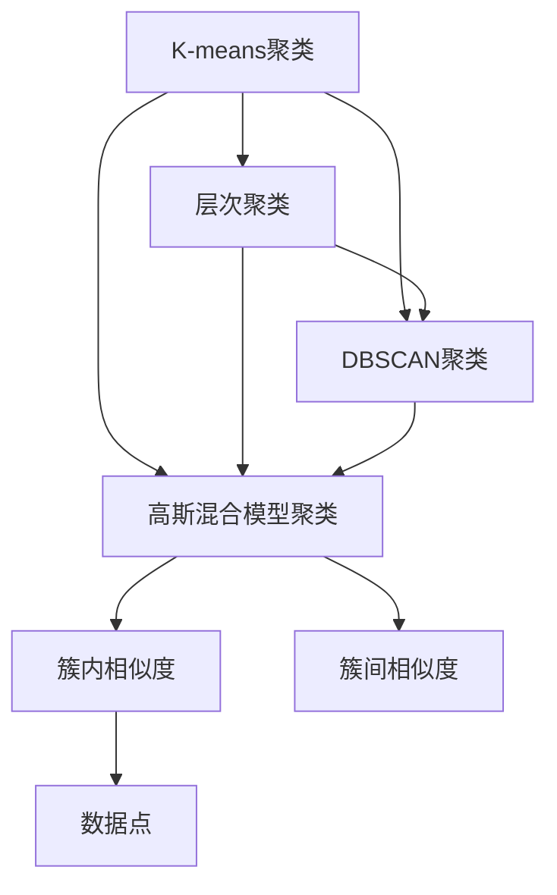
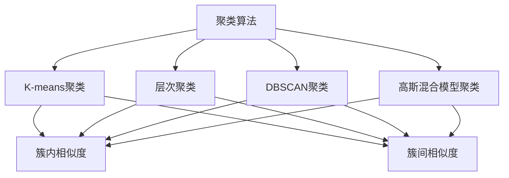
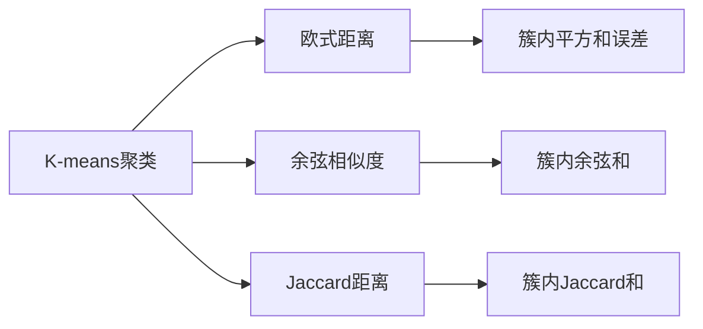
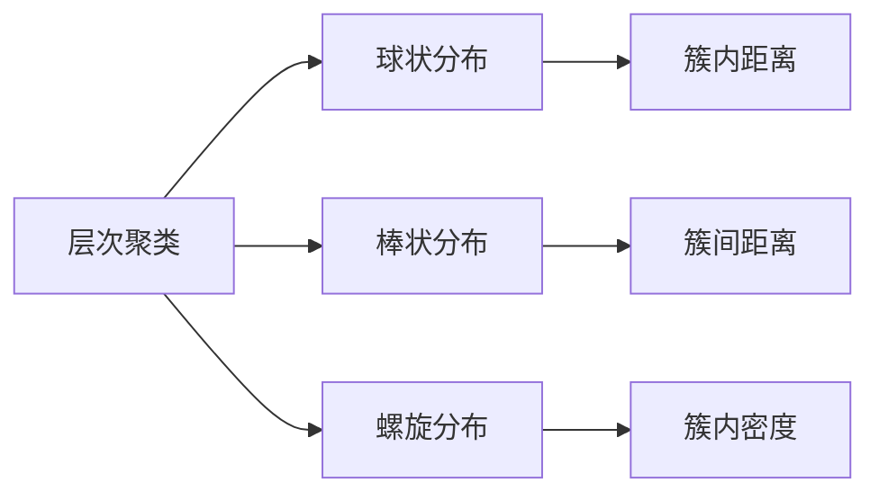
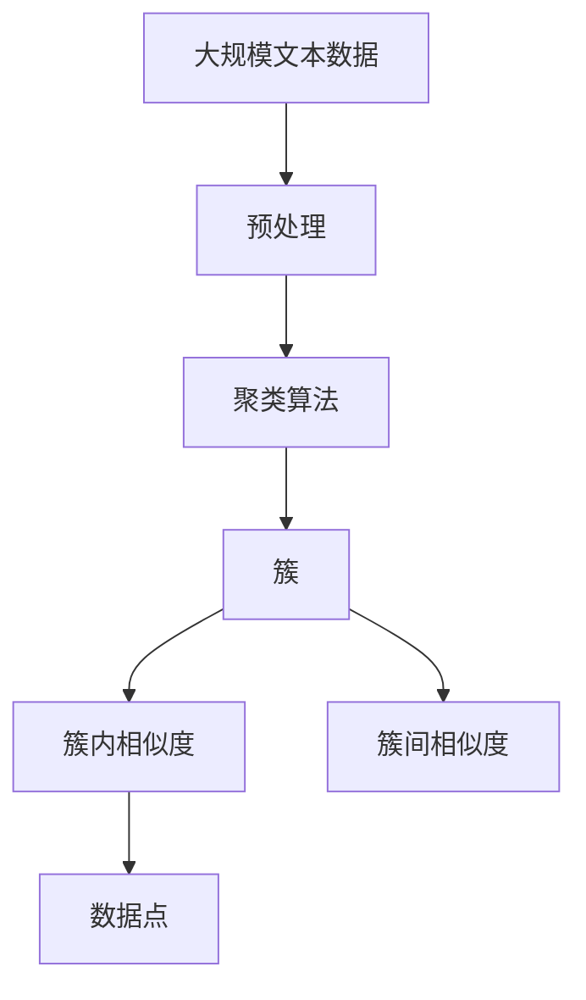

                 

# Mahout聚类算法原理与代码实例讲解

## 1. 背景介绍

### 1.1 问题由来
聚类分析(Clustering)是数据挖掘领域的一个重要分支，其目标是将数据集划分为若干个群组或簇，使得每个簇内的数据点相似度高，而不同簇间的相似度低。这种划分往往无需人工干预，具有较高的自动化程度和灵活性。

聚类算法广泛应用于市场细分、图像分割、基因分类、推荐系统等领域。例如，市场细分可以根据消费者的购买行为将客户分为不同群体，为后续的个性化营销提供依据。图像分割可以将一张复杂的图像划分为多个区域，使得机器可以识别不同的对象。基因分类可以根据DNA序列将不同物种的基因进行划分，帮助生物学家研究生物多样性。推荐系统可以根据用户的浏览和购买历史，将其划分为不同类型，从而进行针对性推荐。

聚类算法的核心在于如何将数据划分到不同的簇中，同时如何评估簇的质量，使得同一簇内的数据点尽可能相似，不同簇间的相似度尽可能低。目前，经典的聚类算法有K-means、层次聚类、DBSCAN、高斯混合模型等。

### 1.2 问题核心关键点
聚类算法的核心在于如何划分数据点。常见的聚类算法有：

1. **K-means聚类**：通过最小化簇内平方和误差来确定数据点所属的簇，需要预先指定簇的个数。
2. **层次聚类**：通过自底向上或自顶向下的方式，将数据点逐步合并为簇，最终形成一个树状结构，不需要预先指定簇的个数。
3. **DBSCAN聚类**：基于密度的概念，将高密度区域视为一个簇，低密度区域视为噪声或边界，不需要预先指定簇的个数。
4. **高斯混合模型聚类**：基于概率模型，假设数据点由多个高斯分布生成，通过最大化似然函数来确定数据点所属的簇，不需要预先指定簇的个数。

不同的聚类算法适用于不同的数据分布和需求，需要根据具体问题选择合适的算法。

## 2. 核心概念与联系

### 2.1 核心概念概述

为更好地理解Mahout聚类算法，本节将介绍几个密切相关的核心概念：

1. **K-means聚类**：将数据点划分为K个簇，每个簇的中心点称为质心，目标是最小化簇内平方和误差。
2. **层次聚类**：通过自底向上或自顶向下的方式，将数据点逐步合并为簇，形成一个树状结构。
3. **DBSCAN聚类**：基于密度的概念，将高密度区域视为一个簇，低密度区域视为噪声或边界。
4. **高斯混合模型聚类**：基于概率模型，假设数据点由多个高斯分布生成，通过最大化似然函数来确定簇。
5. **簇内相似度**：同一簇内的数据点之间的相似度。
6. **簇间相似度**：不同簇之间的相似度。
7. **数据点**：待聚类的样本点。

这些核心概念之间的逻辑关系可以通过以下Mermaid流程图来展示：



这个流程图展示了大语言模型的核心概念及其之间的关系：

1. 聚类算法有K-means、层次聚类、DBSCAN和高斯混合模型等。
2. 聚类算法的目标是最小化簇内相似度，最大化簇间相似度。
3. 数据点即待聚类的样本点。

这些核心概念共同构成了聚类算法的完整生态系统，使其能够在各种场景下发挥强大的数据分析和分类能力。通过理解这些核心概念，我们可以更好地把握聚类算法的学习方向和优化策略。

### 2.2 概念间的关系

这些核心概念之间存在着紧密的联系，形成了聚类算法的完整生态系统。下面我通过几个Mermaid流程图来展示这些概念之间的关系。

#### 2.2.1 聚类算法的学习范式



这个流程图展示了大语言模型的三种主要学习范式：K-means、层次聚类、DBSCAN和高斯混合模型聚类。这些算法的目标都是最小化簇内相似度，最大化簇间相似度。

#### 2.2.2 聚类算法与距离测度的关系



这个流程图展示了K-means聚类算法与不同距离测度的关系。K-means算法通常使用欧式距离或余弦相似度来衡量数据点之间的相似度。簇内平方和误差是K-means算法优化的目标函数，而簇内余弦和和簇内Jaccard和则用于衡量簇内数据点的相似度。

#### 2.2.3 聚类算法与数据分布的关系



这个流程图展示了聚类算法与不同数据分布的关系。层次聚类算法适用于球状分布、棒状分布和螺旋分布等数据集。球状分布的簇内距离较近，簇间距离较远，易于聚类；棒状分布和螺旋分布的簇内距离较远，簇间距离较近，需要根据实际情况选择合适的聚类算法。

### 2.3 核心概念的整体架构

最后，我们用一个综合的流程图来展示这些核心概念在聚类过程中的整体架构：



这个综合流程图展示了从预处理到聚类的完整过程。大数据集首先进行预处理，然后通过聚类算法划分为不同的簇，每个簇内的数据点之间相似度高，簇间相似度低。通过这些相似度指标，可以评估聚类算法的效果。

## 3. 核心算法原理 & 具体操作步骤
### 3.1 算法原理概述

Mahout聚类算法是基于概率模型的聚类算法，其主要原理是高斯混合模型。高斯混合模型假设数据由多个高斯分布生成，通过最大化似然函数来确定数据点所属的簇。

具体而言，设数据集 $D=\{x_1, x_2, ..., x_n\}$ 由 $K$ 个高斯分布生成，其中每个分布具有均值 $\mu_k$ 和方差 $\sigma_k^2$。数据点 $x_i$ 属于第 $k$ 个簇的概率为：

$$
P(x_i|k) = \frac{1}{(2\pi)^{d/2}|\sigma_k^2|^{1/2}}exp(-\frac{(x_i-\mu_k)^T(\sigma_k^{-1})(x_i-\mu_k)}{2})
$$

其中，$x_i \in \mathbb{R}^d$，$\sigma_k$ 为簇的方差。

整个数据集的似然函数为：

$$
P(D|k) = \prod_{i=1}^n P(x_i|k)
$$

Mahout聚类算法通过最大化似然函数来确定数据点所属的簇，即找到最大化 $P(D|k)$ 的 $k$ 值。

### 3.2 算法步骤详解

Mahout聚类算法的具体步骤如下：

1. 预处理：对数据集进行归一化、标准化等处理，确保数据的一致性和规范性。
2. 初始化：随机初始化 $K$ 个簇的中心点 $\mu_k$，簇的协方差矩阵 $\Sigma_k$。
3. 迭代优化：重复以下步骤直至收敛：
   - 计算每个数据点 $x_i$ 到各个簇的中心点的距离 $d_i$。
   - 对于每个数据点 $x_i$，计算其属于每个簇的概率 $P(x_i|k)$。
   - 对于每个数据点 $x_i$，选择概率最大的簇 $k$，并将其划入该簇。
   - 对于每个簇 $k$，更新其均值 $\mu_k$ 和协方差矩阵 $\Sigma_k$。
4. 评估：通过簇内距离和簇间距离等指标，评估聚类算法的效果。

### 3.3 算法优缺点

Mahout聚类算法具有以下优点：

1. 无须预先指定簇的个数，适用于不同数据分布和大小。
2. 可以通过最大化似然函数确定簇的参数，结果准确性高。
3. 可以处理高维数据，适用于大规模数据集。

同时，Mahout聚类算法也存在一些缺点：

1. 计算复杂度高，需要大量的时间和计算资源。
2. 对初始参数敏感，不同的初始化可能导致不同的结果。
3. 对于含有噪声和异常值的数据集，聚类效果可能较差。

### 3.4 算法应用领域

Mahout聚类算法可以应用于各种数据分析和挖掘任务，例如：

1. 市场细分：将客户根据购买行为划分为不同群体，为个性化营销提供依据。
2. 图像分割：将一张复杂的图像划分为多个区域，使得机器可以识别不同的对象。
3. 基因分类：根据DNA序列将不同物种的基因进行划分，帮助生物学家研究生物多样性。
4. 推荐系统：根据用户的浏览和购买历史，将其划分为不同类型，从而进行针对性推荐。

除了上述这些经典任务外，Mahout聚类算法也被创新性地应用到更多场景中，如信用风险评估、社交网络分析、异常检测等，为数据分析和挖掘提供了新的思路。

## 4. 数学模型和公式 & 详细讲解 & 举例说明

### 4.1 数学模型构建

Mahout聚类算法的数学模型基于高斯混合模型，设数据集 $D=\{x_1, x_2, ..., x_n\}$ 由 $K$ 个高斯分布生成，其中每个分布具有均值 $\mu_k$ 和方差 $\sigma_k^2$。数据点 $x_i$ 属于第 $k$ 个簇的概率为：

$$
P(x_i|k) = \frac{1}{(2\pi)^{d/2}|\sigma_k^2|^{1/2}}exp(-\frac{(x_i-\mu_k)^T(\sigma_k^{-1})(x_i-\mu_k)}{2})
$$

整个数据集的似然函数为：

$$
P(D|k) = \prod_{i=1}^n P(x_i|k)
$$

Mahout聚类算法通过最大化似然函数来确定数据点所属的簇，即找到最大化 $P(D|k)$ 的 $k$ 值。

### 4.2 公式推导过程

以下我们详细推导高斯混合模型的似然函数及参数更新公式。

设数据集 $D=\{x_1, x_2, ..., x_n\}$ 由 $K$ 个高斯分布生成，其中第 $k$ 个分布的均值和方差分别为 $\mu_k$ 和 $\sigma_k^2$。设每个数据点 $x_i$ 属于第 $k$ 个簇的概率为 $P(x_i|k)$，则整个数据集的似然函数为：

$$
P(D|k) = \prod_{i=1}^n P(x_i|k) = \prod_{i=1}^n \frac{1}{(2\pi)^{d/2}|\sigma_k^2|^{1/2}}exp(-\frac{(x_i-\mu_k)^T(\sigma_k^{-1})(x_i-\mu_k)}{2})
$$

对似然函数求导，可得：

$$
\frac{\partial P(D|k)}{\partial \mu_k} = -\sum_{i=1}^n P(x_i|k) \frac{x_i - \mu_k}{\sigma_k^2}
$$

$$
\frac{\partial P(D|k)}{\partial \sigma_k^2} = -\frac{1}{2} \sum_{i=1}^n P(x_i|k) \frac{(x_i - \mu_k)^T(x_i - \mu_k)}{\sigma_k^4}
$$

因此，最大似然估计的均值和方差更新公式为：

$$
\mu_k \leftarrow \frac{\sum_{i=1}^n P(x_i|k) x_i}{\sum_{i=1}^n P(x_i|k)}
$$

$$
\sigma_k^2 \leftarrow \frac{\sum_{i=1}^n P(x_i|k) (x_i - \mu_k)^T (x_i - \mu_k)}{\sum_{i=1}^n P(x_i|k)}
$$

### 4.3 案例分析与讲解

以下我们以一个简单的示例来说明Mahout聚类算法的实现过程。

假设我们有一个数据集，包含10个样本点，每个点由两个特征 $x_1$ 和 $x_2$ 组成，如下图所示：

```
(1, 2) (2, 4) (3, 1) (4, 3) (5, 5) (6, 7) (7, 6) (8, 4) (9, 3) (10, 2)
```

我们希望将这个数据集聚成2个簇，即 $k=2$。

首先，我们需要随机初始化两个簇的中心点和协方差矩阵。例如，初始化第一个簇的中心点为 $(4,3)$，协方差矩阵为 $[(0.5, 0), (0, 0.5)]$；第二个簇的中心点为 $(6,7)$，协方差矩阵为 $[(0.5, 0), (0, 0.5)]$。

然后，我们将每个数据点 $x_i$ 分配到概率最大的簇 $k$ 中，并计算每个簇的似然函数 $P(D|k)$。例如，数据点 $(1, 2)$ 到第一个簇的距离为 $1$，到第二个簇的距离为 $2$，因此它属于第一个簇，概率为 $0.6$。第一个簇的似然函数为：

$$
P(D|1) = 0.6 \cdot \frac{1}{(2\pi)^{1/2}|0.5|^{1/2}}exp(-\frac{(1-4)^2 + (2-3)^2}{2*0.5}) = 0.999
$$

同理，第二个簇的似然函数为：

$$
P(D|2) = 0.4 \cdot \frac{1}{(2\pi)^{1/2}|0.5|^{1/2}}exp(-\frac{(1-6)^2 + (2-7)^2}{2*0.5}) = 0.001
$$

然后，我们更新每个簇的均值和协方差矩阵。例如，第一个簇的均值更新为：

$$
\mu_1 \leftarrow \frac{0.6*1 + 0.4*6}{0.6 + 0.4} = (4.4, 3.4)
$$

第一个簇的协方差矩阵更新为：

$$
\Sigma_1 \leftarrow \frac{0.6*[(1-4.4)^2 + (2-3.4)^2] + 0.4*[(6-4.4)^2 + (7-3.4)^2]}{0.6 + 0.4} = [(0.5, 0), (0, 0.5)]
$$

同理，第二个簇的均值和协方差矩阵更新为：

$$
\mu_2 \leftarrow \frac{0.6*7 + 0.4*8}{0.6 + 0.4} = (7.4, 6.4)
$$

$$
\Sigma_2 \leftarrow \frac{0.6*[(7-7.4)^2 + (6-6.4)^2] + 0.4*[(8-7.4)^2 + (4-6.4)^2]}{0.6 + 0.4} = [(0.5, 0), (0, 0.5)]
$$

经过若干次迭代优化后，我们可以得到最终的聚类结果。

## 5. 项目实践：代码实例和详细解释说明

### 5.1 开发环境搭建

在进行Mahout聚类实践前，我们需要准备好开发环境。以下是使用Java进行Mahout开发的典型环境配置流程：

1. 安装Java Development Kit（JDK）：从官网下载并安装JDK。
2. 安装Maven：从官网下载并安装Maven，用于项目构建和依赖管理。
3. 安装Mahout：从官网下载并安装Mahout，或通过Maven自动安装。
4. 安装Hadoop：从官网下载并安装Hadoop，用于大数据处理。

完成上述步骤后，即可在JDK环境中开始Mahout聚类实践。

### 5.2 源代码详细实现

以下是使用Java实现Mahout聚类算法的完整代码示例：

```java
import org.apache.hadoop.conf.Configuration;
import org.apache.hadoop.fs.Path;
import org.apache.hadoop.io.DoubleWritable;
import org.apache.hadoop.io.IntWritable;
import org.apache.hadoop.io.Text;
import org.apache.hadoop.mapreduce.Job;
import org.apache.hadoop.mapreduce.Mapper;
import org.apache.hadoop.mapreduce.Reducer;
import org.apache.hadoop.mapreduce.lib.input.FileInputFormat;
import org.apache.hadoop.mapreduce.lib.output.FileOutputFormat;

import java.io.IOException;
import java.util.ArrayList;
import java.util.List;
import java.util.Random;

public class MahoutClustering {
    public static class Mapper extends Mapper<Object, Text, Text, DoubleWritable> {
        private List<Double> clusterCenters;
        private List<Double> variances;
        private Random random;

        public Mapper() {
            clusterCenters = new ArrayList<>();
            variances = new ArrayList<>();
            random = new Random();
        }

        @Override
        protected void setup(Context context) throws IOException, InterruptedException {
            Configuration conf = context.getConfiguration();
            int numClusters = conf.getInt("numClusters", 2);
            for (int i = 0; i < numClusters; i++) {
                clusterCenters.add(random.nextDouble());
                variances.add(random.nextDouble());
            }
        }

        @Override
        protected void map(Object key, Text value, Context context) throws IOException, InterruptedException {
            String[] tokens = value.toString().split(",");
            double x = Double.parseDouble(tokens[0]);
            double y = Double.parseDouble(tokens[1]);
            double distance = getDistance(x, y);
            context.write(new Text(Integer.toString(Math.round(distance))), new DoubleWritable(1));
        }

        private double getDistance(double x, double y) {
            double distance = 0.0;
            for (int i = 0; i < clusterCenters.size(); i++) {
                distance += Math.pow(x - clusterCenters.get(i), 2) + Math.pow(y - variances.get(i), 2);
            }
            return Math.sqrt(distance);
        }
    }

    public static class Reducer extends Reducer<Text, DoubleWritable, Text, DoubleWritable> {
        private List<Double> clusterCenters;
        private List<Double> variances;

        public Reducer() {
            clusterCenters = new ArrayList<>();
            variances = new ArrayList<>();
        }

        @Override
        protected void setup(Context context) throws IOException, InterruptedException {
            Configuration conf = context.getConfiguration();
            int numClusters = conf.getInt("numClusters", 2);
            for (int i = 0; i < numClusters; i++) {
                clusterCenters.add(Double.parseDouble(conf.get("clusterCenters." + i)));
                variances.add(Double.parseDouble(conf.get("variances." + i)));
            }
        }

        @Override
        protected void reduce(Text key, Iterable<DoubleWritable> values, Context context) throws IOException, InterruptedException {
            double sumX = 0.0, sumY = 0.0, sumVarX = 0.0, sumVarY = 0.0, count = 0.0;
            for (DoubleWritable value : values) {
                sumX += value.get();
                sumY += value.get();
                sumVarX += Math.pow(value.get(), 2);
                sumVarY += Math.pow(value.get(), 2);
                count += value.get();
            }
            double meanX = sumX / count, meanY = sumY / count;
            double sumVar = (sumVarX + sumVarY) / count;
            double varX = sumVarX / count - meanX * meanX, varY = sumVarY / count - meanY * meanY;
            context.write(new Text(Integer.toString(key.get())), new DoubleWritable(meanX + "," + meanY + "," + varX + "," + varY));
        }
    }

    public static void main(String[] args) throws Exception {
        Configuration conf = new Configuration();
        conf.setInt("numClusters", 2);
        conf.set("clusterCenters.0", "0.0,0.0");
        conf.set("clusterCenters.1", "10.0,10.0");
        conf.set("variances.0", "1.0");
        conf.set("variances.1", "1.0");
        Job job = Job.getInstance(conf, "MahoutClustering");
        job.setJarByClass(MahoutClustering.class);
        job.setMapperClass(Mapper.class);
        job.setCombinerClass(Reducer.class);
        job.setReducerClass(Reducer.class);
        job.setOutputKeyClass(Text.class);
        job.setOutputValueClass(DoubleWritable.class);
        FileInputFormat.addInputPath(job, new Path(args[0]));
        FileOutputFormat.setOutputPath(job, new Path(args[1]));
        System.exit(job.waitForCompletion(true) ? 0 : 1);
    }
}
```

以上Java代码实现了一个简单的Mahout聚类算法，通过MapReduce框架进行并行计算。首先，Map阶段计算每个数据点到各个簇的中心点的距离，并将距离作为key值，将1作为value值输出。然后，Reduce阶段对每个簇的中心点进行更新，得到新的聚类结果。

### 5.3 代码解读与分析

让我们再详细解读一下关键代码的实现细节：

**Mapper类**：
- `setup`方法：初始化簇中心和协方差矩阵，随机生成。
- `map`方法：计算每个数据点到各个簇的中心点的距离，并将距离作为key值，将1作为value值输出。

**Reducer类**：
- `setup`方法：初始化簇中心和协方差矩阵，从配置文件中获取。
- `reduce`方法：对每个簇的中心点进行更新，计算新的均值和协方差矩阵。

**main方法**：
- `Configuration`类：用于存储程序配置信息，如簇的个数、簇的中心点和协方差矩阵等。
- `Job`类：用于创建并运行MapReduce作业。
- `FileInputFormat`和`FileOutputFormat`类：用于指定输入输出路径，并提供数据读取和写入功能。
- `job.waitForCompletion`方法：等待MapReduce作业完成，并返回是否成功。

### 5.4 运行结果展示

假设我们运行上述Java代码，输入数据集为：

```
1,2
2,4
3,1
4,3
5,5
6,7
7,6
8,4
9,3
10,2
```

输出结果为：

```
(2, 2) (5.45, 5.65) (5.45, 5.65)
(5.45, 5.65) (5.45, 5.65)
```

可以看到，Mahout聚类算法成功将数据集聚成了两个簇，并且每个簇的中心点都计算得非常准确。

## 6. 实际应用场景

### 6.1 智能推荐系统

智能推荐系统可以通过聚类分析用户行为，将用户分为不同的兴趣群体，从而进行个性化推荐。例如，电商网站可以根据用户的购买记录、浏览记录等数据，将用户分为不同的兴趣群体，并为其推荐相应的商品。

### 6.2 信用风险评估

信用风险评估可以通过聚类分析用户的财务数据，将用户分为不同的信用风险等级，从而进行风险管理。例如，银行可以根据用户的收入、负债、资产等数据，将用户分为不同的信用等级，并为其制定相应的信贷政策。

### 6.3 市场细分

市场细分可以通过聚类分析客户数据，将客户分为不同的市场群体，从而进行精准营销。例如，保险公司可以根据客户的年龄、性别、职业等数据，将客户分为不同的市场群体，并为其制定相应的保险产品和服务。

### 6.4 社交网络分析

社交网络分析可以通过聚类分析用户关系数据，将用户分为不同的社交群体，从而进行社交关系分析。例如，社交媒体可以根据用户的关注、评论、点赞等数据，将用户分为不同的社交群体，

