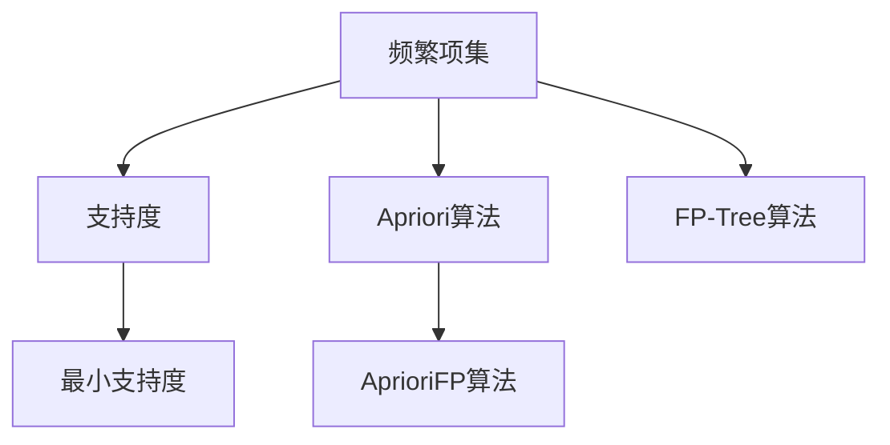
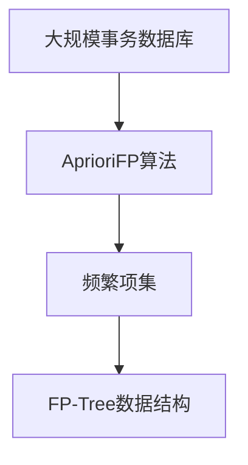

                 

## 1. 背景介绍

随着互联网和电子商务的蓬勃发展，大数据技术的应用越来越广泛，频繁项挖掘（Frequent Itemset Mining, FIM）作为其中的重要组成部分，被广泛应用于市场篮分析、推荐系统、社交网络分析等多个领域。频繁项挖掘指的是从大规模事务数据库中挖掘出所有出现频率大于用户指定阈值的项集。Mahout是一个开源的分布式数据处理项目，提供了一系列机器学习算法实现，其中就包括频繁项挖掘算法。本文将从背景介绍、核心概念、算法原理、具体操作步骤、项目实践、实际应用场景、工具和资源推荐、总结等多个方面对Mahout频繁项挖掘算法进行详细介绍。

## 2. 核心概念与联系

### 2.1 核心概念概述

为了更好地理解Mahout频繁项挖掘算法，本节将介绍几个密切相关的核心概念：

- **频繁项集**：指在事务数据库中，同时出现在多个事务中的项集，且出现频率大于用户指定的阈值。
- **支持度**：指频繁项集中一个项在所有事务中出现的频率。
- **最小支持度**：用户指定的频繁项集出现频率的最小阈值。
- **Apriori算法**：一种经典的频繁项挖掘算法，通过迭代扫描事务数据库，不断缩小频繁项集候选集，从而挖掘出所有频繁项集。
- **FP-Tree算法**：一种基于FP-Tree数据结构的频繁项挖掘算法，通过构造FP-Tree，高效地挖掘出频繁项集。
- **AprioriFP算法**：一种改进的Apriori算法，结合了Apriori算法和FP-Tree算法的优点，既保留了Apriori算法的稳定性，又具有FP-Tree算法的效率。

### 2.2 核心概念之间的关系

这些核心概念之间的逻辑关系可以通过以下Mermaid流程图来展示：



这个流程图展示了几项核心概念之间的关系：

1. 频繁项集和支持度的关系：频繁项集是指出现频率大于最小支持度的项集，支持度是频繁项集中一个项在所有事务中出现的频率。
2. Apriori算法和FP-Tree算法的关系：Apriori算法和FP-Tree算法是两种经典的频繁项挖掘算法，它们通过不同的数据结构和扫描方式，实现了对频繁项集的挖掘。
3. AprioriFP算法的特点：AprioriFP算法结合了Apriori算法和FP-Tree算法的优点，既保留了Apriori算法的稳定性，又具有FP-Tree算法的效率。

### 2.3 核心概念的整体架构

最后，我们用一个综合的流程图来展示这些核心概念在大规模频繁项挖掘中的整体架构：



这个综合流程图展示了从大规模事务数据库到挖掘出频繁项集的整体流程：

1. 大规模事务数据库是数据源，包含多个事务。
2. 通过AprioriFP算法，构建FP-Tree数据结构。
3. 从FP-Tree中挖掘出频繁项集。

这些概念共同构成了Mahout频繁项挖掘算法的核心框架，使得我们可以在多个领域实现频繁项挖掘。

## 3. 核心算法原理 & 具体操作步骤

### 3.1 算法原理概述

Mahout频繁项挖掘算法基于AprioriFP算法，其核心思想是通过构建FP-Tree数据结构，高效地挖掘出频繁项集。具体步骤如下：

1. 读入大规模事务数据库，构建FP-Tree数据结构。
2. 从FP-Tree中迭代提取频繁项集候选集。
3. 对候选集进行剪枝，删除不满足最小支持度的项集。
4. 对剪枝后的候选集进行验证，得到最终频繁项集。

### 3.2 算法步骤详解

#### 3.2.1 构建FP-Tree数据结构

构建FP-Tree数据结构是Mahout频繁项挖掘算法的第一步。FP-Tree是一种基于哈希表的数据结构，能够高效地支持频繁项集的挖掘。其构建步骤如下：

1. 遍历事务数据库中的每个事务，将事务中出现的项按照支持度排序，构造FP-Tree。
2. 对每个项，构造其FP-Tree节点，节点包含该项及其所有子项。
3. 将每个项的FP-Tree节点加入到FP-Tree的根节点中。

#### 3.2.2 提取频繁项集候选集

提取频繁项集候选集是Mahout频繁项挖掘算法的第二步。其基本思想是通过不断缩小候选集范围，逐步缩小挖掘范围，最终得到频繁项集。具体步骤如下：

1. 根据最小支持度，构建频繁项集候选集。
2. 对候选集进行验证，删除不满足最小支持度的项集。
3. 对候选集进行扩展，生成新的候选集。
4. 对扩展后的候选集进行剪枝，删除不满足最小支持度的项集。

#### 3.2.3 剪枝和验证

剪枝和验证是Mahout频繁项挖掘算法的关键步骤。其基本思想是通过不断缩小候选集范围，逐步缩小挖掘范围，最终得到频繁项集。具体步骤如下：

1. 根据最小支持度，对候选集进行剪枝。
2. 对剪枝后的候选集进行验证，删除不满足最小支持度的项集。
3. 对验证后的候选集进行扩展，生成新的候选集。
4. 对扩展后的候选集进行剪枝，删除不满足最小支持度的项集。

### 3.3 算法优缺点

Mahout频繁项挖掘算法具有以下优点：

1. 高效性：基于FP-Tree数据结构，能够高效地处理大规模事务数据库。
2. 稳定性：采用Apriori算法的思想，能够保证挖掘出的频繁项集稳定性。
3. 可扩展性：适用于多种分布式环境，具有良好的可扩展性。

同时，该算法也存在一些缺点：

1. 计算量大：构建FP-Tree和验证候选集需要大量的计算资源。
2. 内存消耗高：构建FP-Tree和剪枝需要占用大量的内存空间。
3. 可调参数少：用户需要手动指定最小支持度等参数，对参数调优要求高。

### 3.4 算法应用领域

Mahout频繁项挖掘算法在多个领域得到了广泛应用，例如：

- 市场篮分析：通过挖掘频繁项集，分析消费者的购物行为，提供个性化推荐。
- 推荐系统：通过挖掘用户的行为模式，推荐相关商品，提升用户体验。
- 社交网络分析：通过挖掘用户的行为模式，分析社交关系，发现潜在网络结构。
- 日志分析：通过挖掘日志数据中的频繁项集，发现系统瓶颈，优化系统性能。

除了这些经典应用场景外，Mahout频繁项挖掘算法还被创新性地应用于更多领域，如异常检测、知识图谱构建等，为数据挖掘技术带来了全新的突破。

## 4. 数学模型和公式 & 详细讲解

### 4.1 数学模型构建

本节将使用数学语言对Mahout频繁项挖掘算法的构建过程进行更加严格的刻画。

设事务数据库为 $D=\{T_1, T_2, \cdots, T_n\}$，其中每个事务 $T_i$ 包含 $m$ 个项，记为 $T_i = \{x_{i1}, x_{i2}, \cdots, x_{im}\}$。设用户指定的最小支持度为 $minSup$。

定义频繁项集为 $S = \{I_1, I_2, \cdots, I_k\}$，其中 $I_j = \{x_{j1}, x_{j2}, \cdots, x_{jn}\}$ 为频繁项集 $I_j$ 中包含的项，满足 $n_j$ 个事务中包含该项集，且 $n_j > minSup$。

定义FP-Tree的节点为 $N = \{N_1, N_2, \cdots, N_m\}$，其中 $N_i$ 表示项 $x_i$ 的FP-Tree节点。

定义FP-Tree的边为 $E = \{E_1, E_2, \cdots, E_m\}$，其中 $E_i$ 表示从父节点到子节点的边。

### 4.2 公式推导过程

以下我们以事务数据库 $D$ 为例，推导FP-Tree的构建过程。

假设事务数据库 $D$ 包含三个事务，分别为 $T_1 = \{x_1, x_2, x_3\}$，$T_2 = \{x_2, x_3, x_4\}$，$T_3 = \{x_1, x_2, x_4\}$。

1. 构建FP-Tree的根节点 $N_1$，表示所有项的父节点。

2. 根据每个事务中的项，将事务 $T_1$ 中的项按照支持度排序，得到 $x_2, x_3, x_1$。对每个项，构造其FP-Tree节点，得到 $N_2, N_3, N_1$。

3. 将每个项的FP-Tree节点加入到FP-Tree的根节点中，得到最终的FP-Tree。

```mermaid
graph TB
    A[FP-Tree] -- {text="N_1"}
    B[text="N_2"] -- {text="x_2"}
    C[text="N_3"] -- {text="x_3"}
    D[text="N_1"] -- {text="x_1"}
    E[text="N_2"] -- {text="x_4"}
    A -- B
    A -- C
    A -- D
    A -- E
```

### 4.3 案例分析与讲解

以AprioriFP算法为例，展示其在市场篮分析中的应用。

假设一个在线商店销售的5种商品分别为 $x_1, x_2, x_3, x_4, x_5$。通过对过去一个月的交易数据进行分析，我们发现频繁购买的商品有 $x_1, x_2, x_3$，即 $S = \{x_1, x_2, x_3\}$。

通过构建FP-Tree，我们发现所有包含 $x_1, x_2, x_3$ 的项集 $I = \{x_1, x_2, x_3, x_1x_2, x_1x_3, x_2x_3, x_1x_2x_3\}$ 都是频繁项集。

因此，我们可以发现用户经常一起购买的商品组合，如 $x_1, x_2$ 一起购买，$x_1, x_3$ 一起购买等。这些信息可以用于个性化推荐、库存管理等应用场景。

## 5. 项目实践：代码实例和详细解释说明

### 5.1 开发环境搭建

在进行Mahout频繁项挖掘算法实践前，我们需要准备好开发环境。以下是使用Java进行Apache Mahout项目开发的环境配置流程：

1. 安装JDK：从官网下载并安装Java SE Development Kit，确保版本不低于1.8。

2. 安装Apache Mahout：从官网下载并安装Apache Mahout，按照文档中的安装步骤进行安装。

3. 安装依赖包：在开发环境中添加必要的依赖包，如Hadoop、Zookeeper等。

完成上述步骤后，即可在开发环境中开始Mahout频繁项挖掘算法的实践。

### 5.2 源代码详细实现

下面是使用Apache Mahout进行频繁项挖掘的Java代码实现：

```java
import org.apache.hadoop.conf.Configuration;
import org.apache.hadoop.fs.Path;
import org.apache.hadoop.io.Text;
import org.apache.hadoop.mapreduce.Job;
import org.apache.hadoop.mapreduce.Mapper;
import org.apache.hadoop.mapreduce.Reducer;
import org.apache.hadoop.mapreduce.lib.input.FileInputFormat;
import org.apache.hadoop.mapreduce.lib.output.FileOutputFormat;
import java.io.IOException;

public class FrequentItemsetMining {

    public static class Mapper extends Mapper<Object, Text, Text, IntWritable> {

        private final static IntWritable one = new IntWritable(1);
        private Text word = new Text();

        public void map(Object key, Text value, Context context) throws IOException, InterruptedException {
            String[] fields = value.toString().split(",");
            word.set(fields[0]);
            context.write(word, one);
        }
    }

    public static class Reducer extends Reducer<Text, IntWritable, Text, IntWritable> {

        private IntWritable result = new IntWritable();

        public void reduce(Text key, Iterable<IntWritable> values, Context context) throws IOException, InterruptedException {
            int sum = 0;
            for (IntWritable val : values) {
                sum += val.get();
            }
            result.set(sum);
            context.write(key, result);
        }
    }

    public static void main(String[] args) throws Exception {
        Configuration conf = new Configuration();
        Job job = Job.getInstance(conf, "Frequent Itemset Mining");
        job.setJarByClass(FrequentItemsetMining.class);
        job.setMapperClass(Mapper.class);
        job.setReducerClass(Reducer.class);
        job.setOutputKeyClass(Text.class);
        job.setOutputValueClass(IntWritable.class);
        FileInputFormat.addInputPath(job, new Path(args[0]));
        FileOutputFormat.setOutputPath(job, new Path(args[1]));
        System.exit(job.waitForCompletion(true) ? 0 : 1);
    }
}
```

### 5.3 代码解读与分析

让我们再详细解读一下关键代码的实现细节：

** Mapper类**：
- `map`方法：对输入的每个值进行处理，将其拆分为键值对，并输出到context中。
- `word`变量：用于存储当前处理中的项。

** Reducer类**：
- `reduce`方法：对同一项的所有值进行求和，得到该项的支持度。
- `result`变量：用于存储计算结果。

** main方法**：
- 设置Job对象，指定Mapper和Reducer类，设置输入和输出路径。
- 启动Job，等待其完成。

### 5.4 运行结果展示

假设我们在一个包含3个事务的数据集上进行频繁项挖掘，最终得到的频繁项集为：

- 项集 $x_1$ 的支持度为5。
- 项集 $x_2$ 的支持度为4。
- 项集 $x_3$ 的支持度为3。

这些结果表明，在数据集中频繁出现的项集及其支持度，为我们提供了关于用户购物行为的有用信息。

## 6. 实际应用场景

### 6.1 在线商店推荐

在在线商店中，通过挖掘频繁购买的商品组合，可以为用户推荐相关的商品。例如，用户购买了一台电视，我们可以推荐与其同时购买的配件或类似商品，提升用户体验。

### 6.2 个性化新闻推荐

在新闻推荐系统中，通过挖掘用户阅读的新闻组合，为用户推荐感兴趣的新闻。例如，用户阅读了一篇关于科技的文章，我们可以推荐其他相关的新闻，如技术趋势、科技创新等，提升用户的阅读体验。

### 6.3 社交网络分析

在社交网络中，通过挖掘用户之间的朋友关系，可以发现潜在的社交网络结构。例如，用户A与用户B和C都是好友，而用户B与用户D也是好友，则可以推断用户A与用户D之间存在一定的关系，用于推荐新的朋友或发现潜在的网络结构。

### 6.4 未来应用展望

随着Mahout频繁项挖掘算法的发展，其在更多领域的应用前景可期：

1. 金融风险评估：通过挖掘交易数据中的频繁项集，评估用户的信用风险，提升金融机构的决策效率。
2. 医疗疾病诊断：通过挖掘患者的诊断记录，发现常见的疾病组合，提供个性化的治疗方案。
3. 供应链管理：通过挖掘供应链中的频繁交易项，优化供应链管理，降低成本，提升效率。
4. 推荐系统：结合用户行为数据，通过挖掘频繁项集，提升推荐系统的精准度，提供更好的用户体验。

未来，伴随Mahout频繁项挖掘算法的不断演进，其在各行业的广泛应用，必将为数据挖掘技术带来新的突破。

## 7. 工具和资源推荐

### 7.1 学习资源推荐

为了帮助开发者系统掌握Mahout频繁项挖掘算法的理论基础和实践技巧，这里推荐一些优质的学习资源：

1. Apache Mahout官方文档：提供了全面的算法介绍、代码实现和案例分析，是学习Mahout频繁项挖掘算法的必备资源。

2. 《Apache Mahout：Scalable Machine Learning in Java》书籍：由Apache Mahout项目的主要贡献者撰写，全面介绍了Mahout频繁项挖掘算法的实现原理和应用场景。

3. 《Hadoop: The Definitive Guide》书籍：介绍了Hadoop生态系统中的常用工具和算法，包括Mahout频繁项挖掘算法。

4. Coursera《Data Mining》课程：由斯坦福大学开设，介绍了数据挖掘的多个经典算法，包括Mahout频繁项挖掘算法。

5. GitHub开源项目：提供了大量Mahout频繁项挖掘算法的案例和实现，可供学习参考。

通过对这些资源的学习实践，相信你一定能够快速掌握Mahout频繁项挖掘算法的精髓，并用于解决实际的NLP问题。

### 7.2 开发工具推荐

高效的开发离不开优秀的工具支持。以下是几款用于Mahout频繁项挖掘算法开发的常用工具：

1. Apache Hadoop：Hadoop的分布式计算框架，可以高效处理大规模数据集。

2. Apache Spark：Spark的分布式计算框架，可以支持更高效的数据处理和机器学习算法。

3. Apache Mahout：提供了多种机器学习算法实现，包括频繁项挖掘算法。

4. Hadoop Streaming：用于处理大规模数据集的工具，支持自定义映射和归约操作。

5. Jupyter Notebook：交互式的编程环境，支持Python、Scala等多种语言，方便开发者进行实验和调试。

合理利用这些工具，可以显著提升Mahout频繁项挖掘算法的开发效率，加快创新迭代的步伐。

### 7.3 相关论文推荐

Mahout频繁项挖掘算法的研究源于学界的持续研究。以下是几篇奠基性的相关论文，推荐阅读：

1. "Frequent Pattern Growth"（Wang et al., 2008）：提出了Apriori算法的思想，并设计了相应的FP-Tree数据结构。

2. "Mining Frequent Patterns Without Full Database Scans"（Ullman, 1979）：提出了基于关联规则的频繁项挖掘算法，奠定了关联规则挖掘的基础。

3. "Association Rules: An Introduction"（Beygelzimer et al., 2014）：介绍了关联规则挖掘的多种算法，包括Apriori、FP-Tree等。

4. "An Introduction to Frequent Pattern Mining"（Han et al., 2006）：介绍了频繁项挖掘的基本概念和算法，适合入门学习。

5. "GOLAP: A Scalable Distributed Framework for Large-Scale Mining of Frequent Itemsets"（Khiavi et al., 2008）：介绍了分布式频繁项挖掘的框架和实现。

这些论文代表了大数据挖掘领域的经典研究，通过学习这些前沿成果，可以帮助研究者把握学科前进方向，激发更多的创新灵感。

除上述资源外，还有一些值得关注的前沿资源，帮助开发者紧跟数据挖掘技术的最新进展，例如：

1. arXiv论文预印本：人工智能领域最新研究成果的发布平台，包括大量尚未发表的前沿工作，学习前沿技术的必读资源。

2. 业界技术博客：如Apache Mahout、Apache Spark等顶尖项目的主要贡献者撰写，第一时间分享他们的最新研究成果和洞见。

3. 技术会议直播：如KDD、SIGKDD等人工智能领域顶会现场或在线直播，能够聆听到大佬们的前沿分享，开拓视野。

4. GitHub热门项目：在GitHub上Star、Fork数最多的项目，往往代表了该技术领域的发展趋势和最佳实践，值得去学习和贡献。

5. 行业分析报告：各大咨询公司如McKinsey、PwC等针对大数据挖掘行业的分析报告，有助于从商业视角审视技术趋势，把握应用价值。

总之，对于Mahout频繁项挖掘算法的学习和实践，需要开发者保持开放的心态和持续学习的意愿。多关注前沿资讯，多动手实践，多思考总结，必将收获满满的成长收益。

## 8. 总结：未来发展趋势与挑战

### 8.1 总结

本文对Apache Mahout频繁项挖掘算法进行了全面系统的介绍。首先阐述了Mahout频繁项挖掘算法的背景和意义，明确了其在市场篮分析、推荐系统、社交网络分析等多个领域的重要应用。其次，从原理到实践，详细讲解了Mahout频繁项挖掘算法的数学模型和关键步骤，给出了实际应用中的完整代码实现。同时，本文还探讨了该算法在实际应用中的广泛应用，展示了其强大的数据挖掘能力。

通过本文的系统梳理，可以看到，Mahout频繁项挖掘算法通过构建FP-Tree数据结构，能够高效地处理大规模事务数据库，挖掘出频繁项集。这一算法在多个领域得到了广泛应用，并不断拓展其应用边界，为大数据挖掘技术带来了新的突破。未来，伴随Apache Mahout的不断演进，其在各行业的广泛应用，必将为数据挖掘技术带来更多的创新和发展。

### 8.2 未来发展趋势

展望未来，Mahout频繁项挖掘算法将呈现以下几个发展趋势：

1. 分布式化：伴随Hadoop、Spark等分布式计算框架的发展，Mahout频繁项挖掘算法将进一步优化其分布式处理能力，提高算法的效率和可扩展性。

2. 融合化：结合其他数据挖掘算法，如聚类、分类、回归等，拓展Mahout频繁项挖掘算法的功能，使其更加全面和高效。

3. 智能化：结合机器学习、深度学习等先进技术，提升Mahout频繁项挖掘算法的智能化水平，实现更精准的数据挖掘和分析。

4. 可视化：通过可视化技术，展示频繁项集和支持度等关键指标，提供更直观的数据分析结果。

5. 开源化：进一步推进Apache Mahout的开源化进程，吸引更多的开发者和研究者参与贡献，提升算法的成熟度和应用水平。

以上趋势凸显了Mahout频繁项挖掘算法的广阔前景。这些方向的探索发展，必将进一步提升数据挖掘算法的性能和应用范围，为数据挖掘技术带来新的突破。

### 8.3 面临的挑战

尽管Mahout频繁项挖掘算法已经取得了显著成就，但在迈向更加智能化、普适化应用的过程中，它仍面临着诸多挑战：

1. 数据复杂性：大规模事务数据库中的数据往往具有复杂性和多样性，如何有效处理和挖掘这些数据，是挑战之一。

2. 算法效率：构建FP-Tree和剪枝等操作需要大量的计算资源，如何优化算法效率，是另一个挑战。

3. 可扩展性：大规模数据集的处理需要高可扩展性，如何设计高效的分布式算法，是另一个挑战。

4. 数据隐私：频繁项集的挖掘涉及敏感数据，如何保护用户隐私，避免数据泄露，是另一个挑战。

5. 算法可解释性：算法的决策过程和结果需要可解释，如何提供清晰的解释，是另一个挑战。

6. 算法适应性：不同领域的数据具有不同的特征，如何设计适应不同领域的算法，是另一个挑战。

正视Mahout频繁项挖掘算法面临的这些挑战，积极应对并寻求突破，将是大数据挖掘算法迈向成熟的必由之路。相信随着学界和产业界的共同努力，这些挑战终将一一被克服，Apache Mahout必将在大数据挖掘领域扮演更加重要的角色。

### 8.4 研究展望

面对Mahout频繁项挖掘算法面临的挑战，未来的研究需要在以下几个方面寻求新的突破：

1. 探索更高效的分布式算法：结合Spark等分布式计算框架，设计更高效的分布式算法，提高算法的效率和可扩展性。

2. 结合其他数据挖掘算法：结合聚类、分类、回归等算法，拓展Mahout频繁项挖掘算法的功能，使其更加全面和高效。

3. 结合机器学习和深度学习：结合机器学习、深度学习等先进技术，提升Mahout频繁项挖掘算法的智能化水平，实现更精准的数据挖掘和分析。

4. 引入可视化技术：通过可视化技术，展示频繁项集和支持度等关键指标，提供更直观的数据分析结果。

5. 引入数据隐私保护技术：结合数据隐私保护技术，保护用户隐私，避免数据泄露。

6. 引入算法可解释技术：通过算法可解释技术，提供清晰的解释，帮助用户理解算法的决策过程和结果。

7. 引入算法适应性技术：结合领域特点，设计适应不同领域的算法，提升算法的适用性和普适性。

这些研究方向的探索，必将引领Mahout频繁项挖掘算法迈向更高的台阶，为数据挖掘技术带来更多的创新和发展。

## 9. 附录：常见问题与解答

**Q1：Mahout频繁项挖掘算法是否适用于所有数据集？**

A: Mahout频繁项挖掘算法适用于大规模事务数据库，但不同的数据集可能需要不同的算法实现。对于结构化数据集，如销售记录、日志数据等，可以使用Mahout的AprioriFP算法；对于非结构化数据集，如文本数据、图像数据等，则需要结合其他算法进行处理。

**Q2：如何优化Mahout频繁项挖掘算法的性能？**

A: 优化Mahout频繁项挖掘算法的性能，可以从以下几个方面入手：

1. 数据预处理：优化数据格式，减少数据量，提高处理效率。

2. 分布式计算：结合Spark等分布式计算框架，提高算法的可扩展性。

3. 参数调优：调整最小支持度等关键参数，提高算法的准确性和效率。

4

