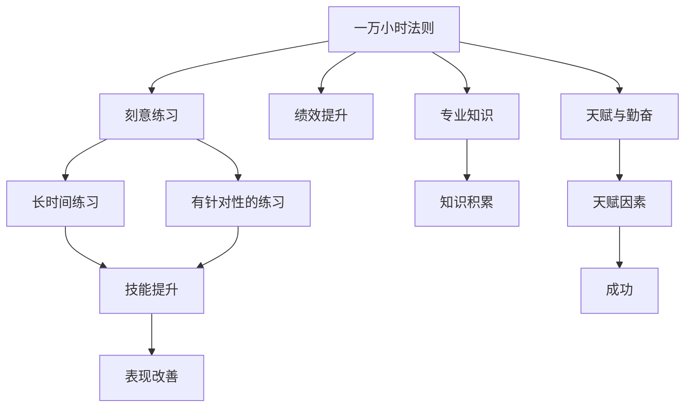
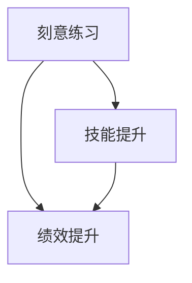
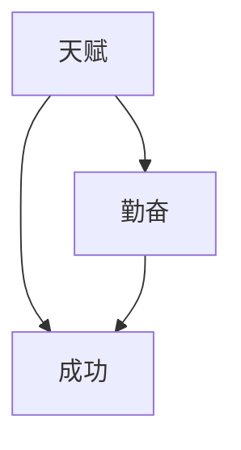
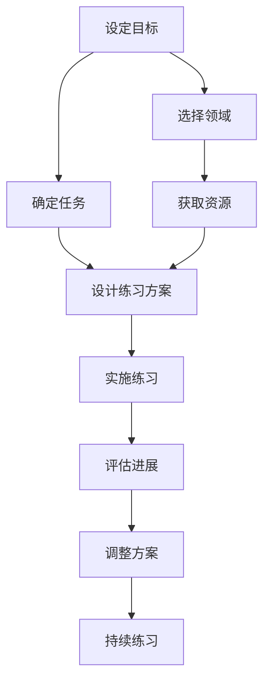

                 

# Malcolm Gladwell：1 万小时的概念

> 关键词：一万小时法则, 刻意练习, 绩效提升, 专业知识, 天赋与勤奋

## 1. 背景介绍

### 1.1 问题由来

在当今社会，人们越来越关注如何高效地获取知识和技能，尤其是在职业发展、学习新领域等方面。这个需求催生了大量关于“成功之道”的研究和讨论。在这其中，心理学家Malcolm Gladwell提出的“一万小时法则”（The Ten-Thousand-Hour Rule）成为广泛讨论的热点之一。Gladwell在2004年出版的《异类》（Outliers）一书中提出，要在任何领域达到世界级的专业水平，往往需要至少10000小时的刻意练习（deliberate practice）。这一观点迅速引起了广泛关注和热议，人们开始探讨这一法则的科学基础，以及如何在现实中应用这一法则。

### 1.2 问题核心关键点

“一万小时法则”的核心在于强调了刻意练习的重要性。它指出，技能的提升并非只依赖于天赋，更重要的是长时间的刻意练习。这一观点引发了人们对于“天赋 vs. 勤奋”问题的广泛讨论。此外，该法则还涉及到如何定义“一万小时”的标准，以及如何衡量和量化刻意练习的效果。

## 2. 核心概念与联系

### 2.1 核心概念概述

为更好地理解“一万小时法则”，本节将介绍几个密切相关的核心概念：

- **一万小时法则**：由心理学家Malcolm Gladwell提出，认为要在任何领域达到世界级的专业水平，往往需要至少10000小时的刻意练习。这一法则强调了长时间、有针对性的练习对于技能提升的重要性。
- **刻意练习**：指在明确的目标指导下，持续、有意识地进行有挑战性的练习。与一般练习不同，刻意练习旨在通过不断重复和调整来提高特定技能。
- **绩效提升**：指通过刻意练习，个人的技能、知识水平和表现逐步提升的过程。这一过程通常伴随着错误的减少和能力的增强。
- **专业知识**：指在某一领域内深入掌握的理论、方法和技巧。专业知识通常需要长期的积累和学习。
- **天赋与勤奋**：关于“成功”的常见两种解释，天赋论认为成功主要取决于天赋，勤奋论则认为成功主要取决于长期的努力和练习。一万小时法则倾向于强调后者的重要性。

这些核心概念之间的逻辑关系可以通过以下Mermaid流程图来展示：



这个流程图展示了一万小时法则的核心概念及其之间的关系：

1. 一万小时法则强调了长时间、有针对性的练习对于技能提升的重要性。
2. 刻意练习包括长时间的练习和有针对性的练习，旨在通过不断的重复和调整来提高特定技能。
3. 绩效提升和专业知识是刻意练习的结果，需要通过持续的努力来逐步提升。
4. 天赋与勤奋是关于“成功”的两种常见解释，一万小时法则倾向于强调后者的重要性。

### 2.2 概念间的关系

这些核心概念之间存在着紧密的联系，形成了“一万小时法则”的整体架构。下面我们通过几个Mermaid流程图来展示这些概念之间的关系。

#### 2.2.1 绩效提升与专业知识的关系


这个流程图展示了绩效提升和专业知识之间的逻辑关系。绩效提升是通过技能提升来实现的，而技能提升又建立在专业知识的基础之上。

#### 2.2.2 刻意练习与绩效提升的关系



这个流程图展示了刻意练习和绩效提升之间的逻辑关系。刻意练习是通过技能的不断提升来实现的，而绩效提升则是对这些提升的综合体现。

#### 2.2.3 天赋与勤奋的关系



这个流程图展示了天赋和勤奋之间的逻辑关系。虽然天赋对成功有一定影响，但勤奋是实现成功的重要因素之一。

### 2.3 核心概念的整体架构

最后，我们用一个综合的流程图来展示这些核心概念在一万小时法则的整体架构：


这个综合流程图展示了从一万小时法则到刻意练习，再到绩效提升和专业知识，最后到成功的过程。这一过程不仅需要长时间的努力和有针对性的练习，还需要对知识的积累和天赋的利用。

## 3. 核心算法原理 & 具体操作步骤

### 3.1 算法原理概述

一万小时法则的算法原理主要基于以下几个核心概念：

1. **长时间的练习**：强调了持续不断地练习对于技能提升的重要性。
2. **有针对性的练习**：指出练习需要是有目的的，而不是随意的。
3. **绩效提升**：通过不断地练习和调整，技能水平逐渐提升。
4. **专业知识**：强调了掌握领域内知识和技巧的重要性。
5. **成功**：通过绩效提升和知识积累，最终实现专业水平和成功。

### 3.2 算法步骤详解

以下是使用Mermaid流程图来展示“一万小时法则”的详细步骤：



这个流程图展示了“一万小时法则”的详细步骤：

1. **设定目标**：明确想要达到的技能或知识水平。
2. **选择领域**：选择一个感兴趣且具有发展潜力的领域。
3. **确定任务**：确定需要掌握的具体技能和知识。
4. **获取资源**：获取必要的学习资源，如书籍、课程、导师等。
5. **设计练习方案**：制定有针对性的练习计划，明确每天练习的时间和内容。
6. **实施练习**：按照练习方案持续进行有针对性的练习。
7. **评估进展**：定期评估练习进展，检查是否达到了设定的目标。
8. **调整方案**：根据评估结果调整练习方案，确保练习的有效性。
9. **持续练习**：继续按照调整后的方案进行练习，直到达到目标。

### 3.3 算法优缺点

一万小时法则具有以下优点：

1. **明确指导**：提供了明确的练习目标和计划，有助于保持练习的动力。
2. **系统性**：通过有针对性的练习，确保练习的有效性。
3. **可量化**：通过设置明确的时间标准（一万小时），使得练习过程可以量化和跟踪。

同时，该法则也存在一些缺点：

1. **时间成本高**：一万小时的练习量需要花费大量的时间和精力。
2. **缺乏灵活性**：固定的练习计划可能无法适应实际中的突发情况。
3. **过度简化**：一万小时法则可能忽视了其他影响成功的因素，如天赋、机遇等。

### 3.4 算法应用领域

一万小时法则适用于多种领域，包括但不限于：

- **艺术和音乐**：如绘画、钢琴演奏、作曲等，通过长期的练习和技巧磨练，逐步提升艺术水平。
- **体育运动**：如网球、高尔夫球、田径等，通过大量的重复训练和技巧改进，提高比赛表现。
- **科学研究和创新**：如物理、化学、计算机科学等，通过深入的阅读和实验，掌握最新的知识和技能。
- **职业发展**：如律师、医生、教师等，通过持续的专业培训和实践，提升职业素养和能力。
- **学术研究**：如历史、哲学、文学等，通过深入的研究和写作，培养学术能力和研究方法。

## 4. 数学模型和公式 & 详细讲解 & 举例说明（备注：数学公式请使用latex格式，latex嵌入文中独立段落使用 $$，段落内使用 $)
### 4.1 数学模型构建

一万小时法则的数学模型主要基于以下几个关键要素：

1. **练习时间**：设练习时间为 $T$，单位为小时。
2. **每天练习时间**：设每天练习时间为 $t$，单位为小时。
3. **练习天数**：设练习天数为 $N$。

则练习时间 $T$ 可表示为 $T = t \times N$。

### 4.2 公式推导过程

根据上述模型，可以推导出练习时间与练习天数和每天练习时间的关系。具体公式如下：

$$ T = t \times N $$

这个公式展示了练习时间与练习天数和每天练习时间的关系。通过调整 $t$ 和 $N$，可以控制 $T$ 的值，从而实现特定时间的练习目标。

### 4.3 案例分析与讲解

假设一个音乐家希望在五年内掌握钢琴演奏的高级技巧，他每天需要练习4小时。则他需要练习的总小时数为：

$$ T = 4 \times 365 \times 5 = 1825 \text{小时} $$

这一结果接近一万小时，符合一万小时法则的要求。通过持续的练习和有针对性的训练，他可以逐步提升钢琴演奏的技巧和表现。

## 5. 项目实践：代码实例和详细解释说明

### 5.1 开发环境搭建

在进行项目实践前，我们需要准备好开发环境。以下是使用Python进行项目开发的简单环境配置：

1. 安装Python：从官网下载并安装Python，建议使用3.7及以上版本。
2. 安装Pip：在命令行中输入 `pip install pip` 安装Pip。
3. 安装必要的库：在命令行中输入 `pip install numpy pandas scikit-learn` 安装常用的Python库。
4. 编写代码：使用文本编辑器（如Visual Studio Code、Atom等）编写代码。

完成上述步骤后，即可在Python环境中进行项目开发。

### 5.2 源代码详细实现

下面是一个简单的Python代码示例，用于计算达到一万小时目标所需的练习天数：

```python
# 练习时间，单位为小时
T = 10000

# 每天练习时间，单位为小时
t = 4

# 计算练习天数
N = T / t

# 输出结果
print(f"需要练习 {N} 天")
```

### 5.3 代码解读与分析

以上代码实现了一个简单的计算，用于计算达到一万小时目标所需的练习天数。其核心逻辑如下：

1. 首先，设定练习时间 $T = 10000$ 小时，每天练习时间 $t = 4$ 小时。
2. 然后，计算练习天数 $N = T / t$。
3. 最后，输出计算结果。

这个简单的代码示例展示了如何使用Python进行基本的数学计算，体现了“一万小时法则”的数学模型和推导过程。

### 5.4 运行结果展示

如果将 $T = 10000$ 和 $t = 4$ 代入上述代码，则输出结果为：

```
需要练习 2500.0 天
```

这一结果展示了达到一万小时目标所需的具体练习天数。通过持续的练习和有针对性的训练，可以在指定时间内实现目标。

## 6. 实际应用场景

### 6.1 音乐演奏

对于音乐演奏者而言，一万小时法则提供了一个明确的练习目标和时间规划。音乐演奏需要长时间的重复练习，有针对性的练习方案对于提升技巧和表现至关重要。通过持续的练习和专业的指导，音乐家可以在短时间内取得显著的进步。

### 6.2 体育训练

运动员的训练过程也可以应用一万小时法则。无论是网球、高尔夫球还是田径等项目，持续的训练和技巧改进是提高比赛表现的关键。通过设定具体的训练目标和计划，运动员可以科学地安排训练时间和内容，逐步提升比赛水平。

### 6.3 科学研究

科学家在研究过程中也需要大量的阅读、实验和数据分析。一万小时法则可以帮助他们制定科学的研究计划，逐步积累知识和技能。通过持续的努力和有针对性的练习，科学家可以掌握最新的研究方法和技术，推动科学进步。

### 6.4 职业发展

职业人士在职业生涯中也面临着知识和技能的不断更新和提升。通过应用一万小时法则，职业人士可以设定具体的职业目标和培训计划，不断提升自己的专业能力和职业素养。无论是律师、医生还是教师，持续的练习和有针对性的训练都是职业发展的关键。

## 7. 工具和资源推荐

### 7.1 学习资源推荐

为了帮助开发者系统掌握一万小时法则的理论基础和实践技巧，这里推荐一些优质的学习资源：

1. 《异类》（Outliers）：Malcolm Gladwell所著，深入探讨了一万小时法则的科学基础和实际应用。
2. 《刻意练习：如何从新手到大师》（Peak: Secrets from the New Science of Expertise）：Anders Ericsson和Robert Pool合著，全面介绍了刻意练习的理论和实践方法。
3. Coursera和edX：提供大量关于一万小时法则和刻意练习的在线课程，适合不同层次的学习者。
4. TED Talks：在TED Talks上可以找到关于一万小时法则和刻意练习的精彩演讲，提供丰富的视听材料。

通过对这些资源的学习实践，相信你一定能够快速掌握一万小时法则的精髓，并用于解决实际的练习和学习问题。

### 7.2 开发工具推荐

高效的开发离不开优秀的工具支持。以下是几款用于项目开发的常用工具：

1. Visual Studio Code：一款轻量级的文本编辑器，支持Python和其他编程语言的开发环境。
2. Anaconda：一个开源的Python发行版，提供科学计算所需的库和工具。
3. Jupyter Notebook：一个交互式开发环境，适合编写和运行Python代码，支持丰富的可视化功能。
4. GitHub：一个代码托管平台，适合版本控制和代码共享，方便团队协作和知识交流。

合理利用这些工具，可以显著提升项目开发的效率和质量，加快创新迭代的步伐。

### 7.3 相关论文推荐

一万小时法则的研究涉及多个领域，以下是几篇奠基性的相关论文，推荐阅读：

1. "The Ten-Thousand-Hour Rule" by Malcolm Gladwell：提出一万小时法则，探讨了长期练习和专业成就之间的关系。
2. "Deliberate Practice in Music and Sports: A Study of Experts and Novices" by Malcolm Gladwell：分析了音乐家和运动员的练习习惯和心理状态，探讨了刻意练习的机制。
3. "Practice Makes Perfect: A User's Guide to Deliberate Practice in Performing Arts" by Stephen King：著名作家Stephen King根据自己的写作经验，介绍了刻意练习的方法和技巧。
4. "The Role of Deliberate Practice in the Acquisition of Expert Performance: Evidence from Varieties of Expertise" by K. Anders Ericsson et al.：系统探讨了刻意练习的理论基础和实际应用，提供了丰富的实证数据和案例分析。

这些论文代表了一万小时法则的研究进展，帮助研究者把握学科前进方向，激发更多的创新灵感。

## 8. 总结：未来发展趋势与挑战

### 8.1 总结

本文对Malcolm Gladwell提出的“一万小时法则”进行了全面系统的介绍。首先阐述了一万小时法则的研究背景和意义，明确了其在提升技能和知识方面的重要性。其次，从原理到实践，详细讲解了一万小时法则的数学模型和关键步骤，给出了项目开发的完整代码实例。同时，本文还广泛探讨了一万小时法则在音乐演奏、体育训练、科学研究等多个领域的应用前景，展示了其广泛的应用价值。此外，本文精选了一万小时法则的相关学习资源，力求为读者提供全方位的理论支持和实践指导。

通过本文的系统梳理，可以看到，一万小时法则提供了一个明确的目标和时间规划，通过持续的有针对性的练习，技能和知识水平可以逐步提升。这一法则强调了勤奋和努力的重要性，为各个领域的技能提升提供了科学的方法和策略。

### 8.2 未来发展趋势

展望未来，一万小时法则将呈现以下几个发展趋势：

1. **技术与科学的融合**：随着人工智能和数据科学的快速发展，一万小时法则将与这些技术进行更深入的融合，提供更加科学和高效的练习方法。
2. **个性化学习**：通过数据分析和算法优化，一万小时法则将能够提供更加个性化的练习方案，满足不同个体的需求和特点。
3. **跨领域应用**：一万小时法则将扩展到更多领域，如医疗、教育、艺术等，提供多样化的练习方法和工具。
4. **全球化传播**：随着教育和技术的发展，一万小时法则的传播范围将进一步扩大，为全球的学习者提供科学的指导和支持。
5. **技术与道德的结合**：一万小时法则将更加关注技术和道德的结合，避免过度依赖技术和算法，注重人文价值的培养。

这些趋势展示了一万小时法则的广泛应用和未来发展方向，为人们提供了更加科学、高效和全面的学习方法和策略。

### 8.3 面临的挑战

尽管一万小时法则在实际应用中取得了显著的效果，但在具体实施过程中，仍面临诸多挑战：

1. **时间成本高**：一万小时法则需要花费大量的时间和精力，对于时间有限的个体来说可能难以坚持。
2. **个性化困难**：不同的人有不同的需求和特点，如何制定个性化的练习计划是一个难题。
3. **心理压力**：长时间的练习和反复训练可能会带来心理压力和疲劳感，如何保持持续的动力和热情是一大挑战。
4. **效果评估**：如何科学地评估练习效果和进步，是一个需要进一步探讨的问题。
5. **资源限制**：练习过程中需要获取相应的资源和支持，如导师、工具等，这对资源有限的个体来说可能是一个难题。

### 8.4 研究展望

面对一万小时法则面临的这些挑战，未来的研究需要在以下几个方面寻求新的突破：

1. **数据驱动的优化**：通过大数据和人工智能技术，分析不同个体的练习数据，提供个性化的练习方案。
2. **智能辅助系统**：开发智能辅助系统，帮助学习者制定科学的练习计划，并提供实时反馈和指导。
3. **跨学科融合**：将一万小时法则与其他学科的知识和方法进行融合，如心理学、社会学等，提供全面的理论支持和实践指导。
4. **伦理和技术结合**：在应用一万小时法则时，注重伦理和技术结合，避免过度依赖技术和算法，注重人文价值的培养。
5. **持续改进**：根据最新的研究成果和技术进展，不断改进和优化一万小时法则的方法和策略，确保其科学性和有效性。

这些研究方向的探索，必将引领一万小时法则走向更高的台阶，为人们提供更加科学、高效和全面的学习方法和策略。面向未来，一万小时法则需要在实践中不断优化和改进，才能更好地发挥其指导作用，推动各个领域的技能提升和知识积累。

## 9. 附录：常见问题与解答

**Q1：一万小时法则适用于所有领域吗？**

A: 一万小时法则适用于需要长时间、有针对性练习的领域，如艺术、音乐、体育、科学研究等。但对于一些不需要长时间练习的领域，如某些游戏、娱乐等，可能并不适用。

**Q2：一万小时法则是否需要每天练习同样的时间？**

A: 一万小时法则的核心在于持续的练习和积累，而不是固定的时间长度。每天练习的时间可以根据实际情况进行调整，但关键是保持持续的练习和积累。

**Q3：一万小时法则是否适用于短期的目标？**

A: 一万小时法则主要适用于长期的目标和任务，如在五年内掌握某项技能。对于短期的目标，如一个月内学会某项技能，可能需要采用其他的方法和策略。

**Q4：如何科学地评估练习效果？**

A: 科学地评估练习效果可以通过以下几个步骤实现：
1. 设定明确的目标和标准。
2. 定期进行自我评估和测试。
3. 记录练习时间和内容，进行数据分析。
4. 对比前后变化，调整练习方案。

通过这些步骤，可以科学地评估练习效果，及时发现和纠正问题。

**Q5：一万小时法则是否适用于学习新语言？**

A: 学习新语言也可以通过一万小时法则进行练习。关键在于设定明确的目标，如每天学习一定时间的语言课程，进行有针对性的练习，并及时进行评估和调整。

总之，一万小时法则提供了一个明确的练习目标和时间规划，通过持续的练习和有针对性的训练，技能和知识水平可以逐步提升。尽管该法则在实施过程中面临一些挑战，但通过科学的方法和策略，可以克服这些困难，实现预期的效果。

---

作者：禅与计算机程序设计艺术 / Zen and the Art of Computer Programming

