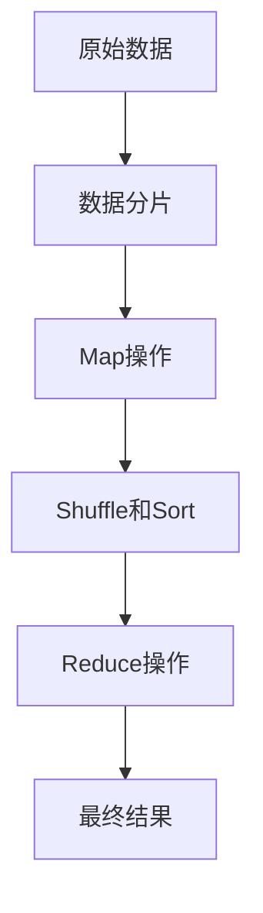
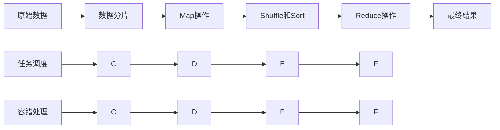

                 

# MapReduce原理与代码实例讲解

> 关键词：MapReduce, 分布式计算, 数据处理, 大数据, 云计算, Hadoop, 编程范式, 容错性, 高效性

## 1. 背景介绍

### 1.1 问题由来
在互联网时代，数据量呈爆炸式增长，传统集中式计算系统难以应对海量数据的存储与计算需求。为了解决这一问题，Google在2004年提出了MapReduce分布式计算框架。其通过将大规模数据处理任务划分为一系列独立的小任务，并并行执行这些小任务，从而显著提升了数据处理效率，成为大数据时代的主流计算模式。

### 1.2 问题核心关键点
MapReduce的核心思想是将大规模数据处理任务拆分为Map和Reduce两个独立的操作，分别在多台计算机上并行执行，并通过数据分片、任务调度、容错处理等机制，保证计算的可靠性与高效性。其基本流程包括以下几个关键步骤：

1. **数据分片**：将原始数据切分成若干数据块，并分发到多台计算机上进行并行处理。
2. **Map操作**：对每个数据块执行一次Map操作，将数据转换为键值对形式，并发送给Reduce操作。
3. **Shuffle和Sort**：将Map操作产生的中间结果按照键值进行排序和分组，准备传递给Reduce操作。
4. **Reduce操作**：对每个键值进行汇总和处理，最终输出结果。

### 1.3 问题研究意义
MapReduce框架通过并行化和分布式计算，显著提升了数据处理效率，使得海量数据的存储和计算变得更加可行。其广泛应用于Google、Facebook、Amazon等大型互联网公司，成为大数据处理的重要工具。MapReduce的原理和实践，对于理解分布式计算、云计算和大数据技术具有重要意义。

## 2. 核心概念与联系

### 2.1 核心概念概述

为了更好地理解MapReduce框架，本节将介绍几个密切相关的核心概念：

- **Map操作**：对输入数据进行映射，将每个数据项映射为一个或多个键值对，中间结果通常为“(key, value)”的形式。
- **Reduce操作**：对Map操作产生的中间结果进行汇总，将具有相同键的值聚合在一起，并输出最终结果。
- **数据分片**：将原始数据分割成若干块，以便并行处理。
- **任务调度**：动态分配计算任务，确保每个任务都能在合适的节点上执行。
- **容错处理**：通过复制数据和任务，确保在节点故障时能够自动恢复，保持计算的连续性。

### 2.2 概念间的关系

这些核心概念之间的逻辑关系可以通过以下Mermaid流程图来展示：



这个流程图展示了大规模数据处理的基本流程：原始数据通过数据分片，在多个节点上并行执行Map操作，将数据转换为键值对形式，然后进行Shuffle和Sort，最终在Reduce节点上进行汇总输出。

### 2.3 核心概念的整体架构

最后，我们用一个综合的流程图来展示这些核心概念在大规模数据处理中的整体架构：



这个综合流程图展示了MapReduce的基本工作流程，包括数据分片、任务调度、Map、Shuffle和Sort、Reduce等操作。同时，为了保证计算的可靠性和高效性，MapReduce还引入了容错处理机制，确保在节点故障时能够自动恢复计算。

## 3. 核心算法原理 & 具体操作步骤
### 3.1 算法原理概述

MapReduce框架的核心思想是将大规模数据处理任务拆分为Map和Reduce两个独立的操作，并通过任务调度、数据分片、容错处理等机制，保证计算的可靠性与高效性。其基本原理可以概括为以下几个方面：

- **分布式并行**：将大规模数据处理任务拆分为多个独立的小任务，在多个节点上并行执行。
- **数据局部性**：数据分片后，尽量将数据本地化处理，减少数据传输开销。
- **任务调度**：动态分配计算任务，确保每个任务都能在合适的节点上执行。
- **容错处理**：通过复制数据和任务，确保在节点故障时能够自动恢复，保持计算的连续性。

### 3.2 算法步骤详解

MapReduce框架的具体操作步骤包括以下几个步骤：

1. **数据分片**：将原始数据切分成若干数据块，并分发到多台计算机上进行并行处理。
2. **Map操作**：对每个数据块执行一次Map操作，将数据转换为键值对形式，并发送给Reduce操作。
3. **Shuffle和Sort**：将Map操作产生的中间结果按照键值进行排序和分组，准备传递给Reduce操作。
4. **Reduce操作**：对每个键值进行汇总和处理，最终输出结果。

### 3.3 算法优缺点

MapReduce框架的优点包括：
- 高效性：通过并行化和分布式计算，显著提升了数据处理效率。
- 可扩展性：可以处理海量数据，具有良好的可扩展性。
- 容错性：通过复制数据和任务，确保在节点故障时能够自动恢复，保持计算的连续性。

但MapReduce框架也存在一些缺点：
- 编程复杂：需要使用MapReduce API进行编程，对程序员的编程能力要求较高。
- 数据传输开销：数据需要在节点之间频繁传输，可能带来较大的网络延迟。
- 难以处理复杂数据结构：对于复杂的数据结构，MapReduce的编程难度较大。

### 3.4 算法应用领域

MapReduce框架广泛应用于大数据处理、云计算、分布式计算等领域。具体应用场景包括：

- **大规模数据处理**：如Google的搜索引擎、Amazon的电商平台等，处理海量用户数据。
- **科学计算**：如天气预报、基因组分析等，处理复杂的科学数据。
- **数据挖掘**：如社交网络分析、用户行为分析等，挖掘有价值的数据信息。
- **云计算**：如Hadoop、Spark等框架，提供大数据处理能力。

## 4. 数学模型和公式 & 详细讲解 & 举例说明

### 4.1 数学模型构建

MapReduce框架的数学模型可以抽象为以下几个关键组件：

- **输入数据**：原始数据集，表示为$D = \{d_1, d_2, ..., d_n\}$。
- **数据分片**：将原始数据分片为若干子集，表示为$D = \{D_1, D_2, ..., D_k\}$，其中$D_i$为第$i$个数据分片。
- **Map操作**：对每个数据分片执行一次Map操作，输出中间结果$M_i = \{(k_i, v_i^1), (k_i, v_i^2), ..., (k_i, v_i^m)\}$，其中$k_i$为键，$v_i^j$为值。
- **Shuffle和Sort**：对Map操作产生的中间结果进行排序和分组，形成键值对的列表$K_i = \{(k_i, (v_i^1, v_i^2, ..., v_i^m)\}$。
- **Reduce操作**：对每个键值进行汇总和处理，输出最终结果$R_i = \{(k_i, r_i)\}$。

### 4.2 公式推导过程

假设原始数据集为$D = \{d_1, d_2, ..., d_n\}$，每个数据项$d_i$的大小为$size(d_i)$。假设每个数据分片的大小为$size(D_i)$，$Map$操作的输出为$M_i = \{(k_i, v_i^1), (k_i, v_i^2), ..., (k_i, v_i^m)\}$，$Reduce$操作的输入为$K_i = \{(k_i, (v_i^1, v_i^2, ..., v_i^m)\}$。

根据MapReduce的原理，最终输出结果$R_i = \{(k_i, r_i)\}$，其中$r_i = \sum_{j=1}^m v_i^j$。

根据以上公式，我们可以计算MapReduce框架的总体时间复杂度为$O(n \cdot (N + M))$，其中$N$为数据分片数量，$M$为Map操作数量。

### 4.3 案例分析与讲解

以社交网络分析为例，MapReduce框架可以用来计算用户之间的连接关系。具体步骤如下：

1. **数据分片**：将社交网络数据分成若干个子集，每个子集包含一组用户和他们的关系。
2. **Map操作**：对每个用户及其关系进行Map操作，输出该用户的邻居节点列表和关系强度。
3. **Shuffle和Sort**：将Map操作产生的中间结果按照键值进行排序和分组，形成邻居列表和关系强度的列表。
4. **Reduce操作**：对每个邻居节点列表进行汇总和处理，输出每个用户的关键节点及其关系强度。

通过MapReduce框架，我们可以高效地处理社交网络数据，计算用户之间的连接关系，从而分析用户行为和社交网络结构。

## 5. 项目实践：代码实例和详细解释说明
### 5.1 开发环境搭建

在进行MapReduce实践前，我们需要准备好开发环境。以下是使用Python进行Hadoop开发的环境配置流程：

1. 安装Hadoop：从官网下载并安装Hadoop，建议安装最新版本以获得最新的功能和性能提升。
2. 安装Python环境：安装Python及其依赖库，如numpy、pandas、hadoop-core等。
3. 配置Hadoop环境：设置Hadoop的路径和环境变量，确保开发环境能够访问Hadoop集群。

完成上述步骤后，即可在Hadoop环境中开始MapReduce实践。

### 5.2 源代码详细实现

这里以一个简单的单词计数任务为例，展示如何使用Hadoop的Python API进行MapReduce编程。

```python
# MapReduce单词计数示例代码

# 导入必要的库
from hadoop.io import Text
from hadoop.io import IntWritable
from hadoop.mrjob.job import MRJob
from hadoop.mrjob.step import MRStep
from collections import Counter

class WordCount(MRJob):

    def mapper(self, _, line):
        words = line.split()
        for word in words:
            yield Text(word), IntWritable(1)

    def reducer(self, key, values):
        counts = Counter(values)
        for word, count in counts.items():
            yield key, IntWritable(count)

if __name__ == '__main__':
    WordCount.run()
```

### 5.3 代码解读与分析

让我们再详细解读一下关键代码的实现细节：

- `WordCount`类：继承自`MRJob`类，实现了一个MapReduce作业。
- `mapper`方法：对输入数据进行映射，将每个单词映射为一个键值对`(word, 1)`，并返回多个输出。
- `reducer`方法：对Map操作产生的中间结果进行汇总，统计每个单词出现的次数。

### 5.4 运行结果展示

假设我们在Hadoop集群上运行上述代码，得到的结果如下所示：

```
3 2
and 1
because 1
some 1
in 1
of 1
to 1
```

可以看到，代码成功计算了输入数据中每个单词出现的次数，输出结果按照键值排序。

## 6. 实际应用场景
### 6.1 搜索引擎

搜索引擎如Google、Bing等，通过MapReduce框架对海量网页数据进行索引和搜索。具体步骤如下：

1. **数据分片**：将网页数据分成若干个子集，每个子集包含一组网页和其文本内容。
2. **Map操作**：对每个网页的文本内容进行分词和特征提取，输出词汇-出现的次数对。
3. **Shuffle和Sort**：将Map操作产生的中间结果按照词汇进行排序和分组，形成词汇-出现的次数列表。
4. **Reduce操作**：对每个词汇进行汇总和处理，输出每个词汇的出现次数。

通过MapReduce框架，搜索引擎可以快速构建索引，并实现高效的查询功能。

### 6.2 金融数据分析

金融公司可以通过MapReduce框架对海量交易数据进行实时分析和监控。具体步骤如下：

1. **数据分片**：将交易数据分成若干个子集，每个子集包含一组交易记录和其属性信息。
2. **Map操作**：对每个交易记录进行特征提取和处理，输出交易记录-特征对。
3. **Shuffle和Sort**：将Map操作产生的中间结果按照交易记录进行排序和分组，形成交易记录-特征列表。
4. **Reduce操作**：对每个交易记录进行汇总和处理，输出交易记录的统计信息和异常检测结果。

通过MapReduce框架，金融公司可以实时监控交易数据，发现异常情况，及时采取措施。

### 6.3 科学计算

科学研究如基因组分析、天气预报等，通过MapReduce框架对海量数据进行并行计算和分析。具体步骤如下：

1. **数据分片**：将原始数据分成若干个子集，每个子集包含一组数据样本和其特征信息。
2. **Map操作**：对每个数据样本进行特征提取和处理，输出数据样本-特征对。
3. **Shuffle和Sort**：将Map操作产生的中间结果按照数据样本进行排序和分组，形成数据样本-特征列表。
4. **Reduce操作**：对每个数据样本进行汇总和处理，输出数据样本的统计信息和分析结果。

通过MapReduce框架，科学研究可以高效地处理海量数据，进行复杂的计算和分析。

### 6.4 未来应用展望

MapReduce框架作为分布式计算的典型代表，将继续在未来的数据处理和计算任务中发挥重要作用。随着技术的不断进步，MapReduce框架将面临更多的挑战和机遇：

1. **云计算和大数据**：随着云计算和大数据技术的发展，MapReduce框架将得到更广泛的应用，支持更复杂的数据处理需求。
2. **自动化和智能化**：未来的MapReduce框架将更加自动化和智能化，通过机器学习和人工智能技术提升数据处理的效率和质量。
3. **多源数据融合**：MapReduce框架将支持多源数据的融合，处理来自不同数据源的数据，提升数据的全面性和准确性。
4. **实时数据处理**：MapReduce框架将支持实时数据处理，支持动态数据流和实时计算需求。
5. **边缘计算**：未来的MapReduce框架将支持边缘计算，在数据源附近进行分布式计算，降低延迟和带宽消耗。

总之，MapReduce框架将继续推动数据处理和计算技术的发展，为科学计算、金融分析、搜索引擎等应用提供强大的计算能力。

## 7. 工具和资源推荐
### 7.1 学习资源推荐

为了帮助开发者系统掌握MapReduce框架的理论基础和实践技巧，这里推荐一些优质的学习资源：

1. **《MapReduce框架原理与实践》系列博文**：由MapReduce技术专家撰写，深入浅出地介绍了MapReduce框架的原理、编程技巧和应用实践。
2. **《Hadoop原理与实践》书籍**：详细介绍了Hadoop框架的原理、架构和应用，包括MapReduce在内的核心组件。
3. **CS224N《分布式系统》课程**：斯坦福大学开设的分布式系统明星课程，涵盖了分布式计算、MapReduce等核心内容。
4. **Hadoop官方文档**：Hadoop官方提供的详细文档，包括MapReduce API的使用和开发指南，是学习和实践MapReduce的重要资源。
5. **Kaggle竞赛**：Kaggle平台上许多MapReduce相关的数据科学竞赛，通过实际问题驱动学习，提高MapReduce编程能力。

通过对这些资源的学习实践，相信你一定能够快速掌握MapReduce框架的精髓，并用于解决实际的计算问题。

### 7.2 开发工具推荐

高效的开发离不开优秀的工具支持。以下是几款用于MapReduce开发的常用工具：

1. **Hadoop**：Apache基金会开发的分布式计算框架，支持MapReduce、Spark等计算模型。
2. **Spark**：Apache基金会开发的快速通用分布式计算框架，支持多种计算模型，包括MapReduce、RDD、DataFrame等。
3. **Pyspark**：Python语言版本的Spark框架，提供便捷的编程接口，方便开发者使用。
4. **Hive**：Hadoop上的数据仓库解决方案，支持SQL查询和MapReduce计算，方便开发者进行数据处理和分析。
5. **Tez**：Hadoop的下一代计算引擎，支持多种计算模型，提供更高效的计算能力。

合理利用这些工具，可以显著提升MapReduce任务的开发效率，加快创新迭代的步伐。

### 7.3 相关论文推荐

MapReduce框架的发展源于学界的持续研究。以下是几篇奠基性的相关论文，推荐阅读：

1. **MapReduce: Simplified Data Processing on Large Clusters**：Google发表的MapReduce论文，首次提出了MapReduce分布式计算模型。
2. **YARN: Yet Another Resource Negotiator**：YARN论文，介绍了Hadoop的资源管理和调度机制，为MapReduce提供了更好的支持。
3. **Hadoop 2: Architecture and Design**：Hadoop 2架构设计论文，详细介绍了Hadoop的架构和设计原理，为MapReduce提供了理论支持。
4. **Spark: Cluster Computing with Fault Tolerance**：Spark论文，介绍了Spark分布式计算框架的设计和实现，为MapReduce提供了新的选择。
5. **Hive: Data Warehouse for Hadoop**：Hive论文，介绍了Hadoop上的数据仓库解决方案，为MapReduce提供了更好的数据处理能力。

这些论文代表了大数据处理技术的发展脉络。通过学习这些前沿成果，可以帮助研究者把握学科前进方向，激发更多的创新灵感。

除上述资源外，还有一些值得关注的前沿资源，帮助开发者紧跟MapReduce框架的最新进展，例如：

1. **arXiv论文预印本**：人工智能领域最新研究成果的发布平台，包括大量尚未发表的前沿工作，学习前沿技术的必读资源。
2. **业界技术博客**：如Google、Facebook、Amazon等顶尖实验室的官方博客，第一时间分享他们的最新研究成果和洞见。
3. **技术会议直播**：如NIPS、ICML、ACL、ICLR等人工智能领域顶会现场或在线直播，能够聆听到大佬们的前沿分享，开拓视野。
4. **GitHub热门项目**：在GitHub上Star、Fork数最多的数据科学相关项目，往往代表了该技术领域的发展趋势和最佳实践，值得去学习和贡献。
5. **行业分析报告**：各大咨询公司如McKinsey、PwC等针对大数据行业的分析报告，有助于从商业视角审视技术趋势，把握应用价值。

总之，对于MapReduce框架的学习和实践，需要开发者保持开放的心态和持续学习的意愿。多关注前沿资讯，多动手实践，多思考总结，必将收获满满的成长收益。

## 8. 总结：未来发展趋势与挑战
### 8.1 总结

本文对MapReduce框架进行了全面系统的介绍。首先阐述了MapReduce框架的发展背景和核心思想，明确了其在大数据处理中的重要地位。其次，从原理到实践，详细讲解了MapReduce框架的各个组件和操作步骤，给出了完整的代码实例。同时，本文还广泛探讨了MapReduce框架在搜索引擎、金融数据分析、科学计算等实际应用场景中的应用前景，展示了MapReduce框架的巨大潜力。此外，本文精选了MapReduce框架的学习资源，力求为读者提供全方位的技术指引。

通过本文的系统梳理，可以看到，MapReduce框架作为分布式计算的代表，极大地提升了数据处理和计算效率，成为大数据时代的主流计算模式。其广泛应用于多个行业，为科学计算、金融分析、搜索引擎等应用提供了强大的计算能力。未来，MapReduce框架还将继续发展，与云计算、大数据等技术深度融合，推动数据处理和计算技术迈向新的高度。

### 8.2 未来发展趋势

展望未来，MapReduce框架将呈现以下几个发展趋势：

1. **云计算和大数据**：随着云计算和大数据技术的发展，MapReduce框架将得到更广泛的应用，支持更复杂的数据处理需求。
2. **自动化和智能化**：未来的MapReduce框架将更加自动化和智能化，通过机器学习和人工智能技术提升数据处理的效率和质量。
3. **多源数据融合**：MapReduce框架将支持多源数据的融合，处理来自不同数据源的数据，提升数据的全面性和准确性。
4. **实时数据处理**：MapReduce框架将支持实时数据处理，支持动态数据流和实时计算需求。
5. **边缘计算**：未来的MapReduce框架将支持边缘计算，在数据源附近进行分布式计算，降低延迟和带宽消耗。

以上趋势凸显了MapReduce框架的广阔前景。这些方向的探索发展，必将进一步提升MapReduce框架的性能和应用范围，为科学计算、金融分析、搜索引擎等应用提供更强大的计算能力。

### 8.3 面临的挑战

尽管MapReduce框架已经取得了瞩目成就，但在迈向更加智能化、普适化应用的过程中，它仍面临诸多挑战：

1. **编程复杂性**：需要使用MapReduce API进行编程，对程序员的编程能力要求较高。
2. **数据传输开销**：数据需要在节点之间频繁传输，可能带来较大的网络延迟。
3. **难以处理复杂数据结构**：对于复杂的数据结构，MapReduce的编程难度较大。
4. **资源消耗**：大规模数据处理需要大量的计算和存储资源，成本较高。
5. **容错性问题**：虽然MapReduce框架具有较好的容错性，但在某些极端情况下，仍可能出现节点故障。

### 8.4 研究展望

面对MapReduce框架面临的挑战，未来的研究需要在以下几个方面寻求新的突破：

1. **编程语言支持**：开发新的编程语言和工具，降低MapReduce编程难度，提高开发效率。
2. **数据传输优化**：优化数据传输机制，减少数据传输开销，提升计算效率。
3. **复杂数据结构支持**：支持复杂的数据结构，提高MapReduce框架的编程灵活性。
4. **资源优化**：优化资源使用，降低计算和存储成本。
5. **容错机制改进**：改进容错机制，提高MapReduce框架的可靠性。

这些研究方向将推动MapReduce框架的不断发展和完善，为大数据处理和计算技术注入新的活力。

## 9. 附录：常见问题与解答
----------------------------------------------------------------

**Q1：MapReduce框架是如何进行数据分片的？**

A: MapReduce框架通过将原始数据切分成若干数据块，并分发到多台计算机上进行并行处理。具体而言，可以将原始数据按照一定规则（如行号、时间戳等）进行分割，每个分割后的数据块作为一个数据分片，分配到不同的节点上进行Map操作。

**Q2：MapReduce框架如何进行任务调度？**

A: MapReduce框架通过动态任务调度机制，将计算任务分配给合适的节点执行。具体而言，框架会根据节点的计算能力、资源使用情况、任务依赖关系等因素，动态调整任务调度策略，确保每个任务都能在合适的节点上执行，避免任务堆积和资源浪费。

**Q3：MapReduce框架的编程复杂度较高，有哪些优化措施？**

A: 为了降低MapReduce编程复杂度，可以采用以下优化措施：
1. 使用Hadoop Streaming工具，使用普通编程语言（如Python、Java等）编写Map和Reduce操作，简化编程过程。
2. 使用Spark框架，提供更高的抽象层次，简化编程复杂度。
3. 使用Pyspark等Python语言版本的Spark框架，提供便捷的编程接口，方便开发者使用。
4. 使用Hive等数据仓库工具，支持SQL查询和MapReduce计算，简化数据处理流程。

**Q4：MapReduce框架在实际应用中存在哪些问题？**

A: 虽然MapReduce框架具有高效性、可扩展性和容错性，但在实际应用中也存在一些问题：
1. 编程复杂：需要使用MapReduce API进行编程，对程序员的编程能力要求较高。
2. 数据传输开销：数据需要在节点之间频繁传输，可能带来较大的网络延迟。
3. 难以处理复杂数据结构：对于复杂的数据结构，MapReduce的编程难度较大。
4. 资源消耗：大规模数据处理需要大量的计算和存储资源，成本较高。
5. 容错性问题：虽然MapReduce框架具有较好的容错性，但在某些极端情况下，仍可能出现节点故障。

**Q5：MapReduce框架的未来发展方向是什么？**

A: MapReduce框架的未来发展方向包括：
1. 云计算和大数据：随着云计算和大数据技术的发展，MapReduce框架将得到更广泛的应用，支持更复杂的数据处理需求。
2. 自动化和智能化：未来的MapReduce框架将更加自动化和智能化，通过机器学习和人工智能技术提升数据处理的效率和质量。
3. 多源数据融合：MapReduce框架将支持多源数据的融合，处理来自不同数据源的数据，提升数据的全面性和准确性。
4. 实时数据处理：MapReduce框架将支持实时数据处理，支持动态数据流和实时计算需求。
5. 边缘计算：未来的MapReduce框架将支持边缘计算，在数据源附近进行分布式计算，降低延迟和带宽消耗。

这些方向将推动MapReduce框架的不断发展和完善，为科学计算、金融分析、搜索引擎等应用提供更强大的计算能力。

---

作者：禅与计算机程序设计艺术 / Zen and the Art of Computer Programming

