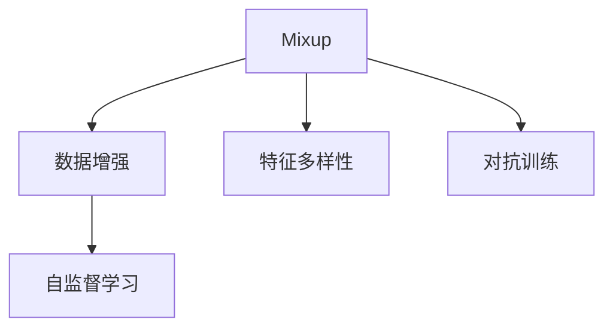
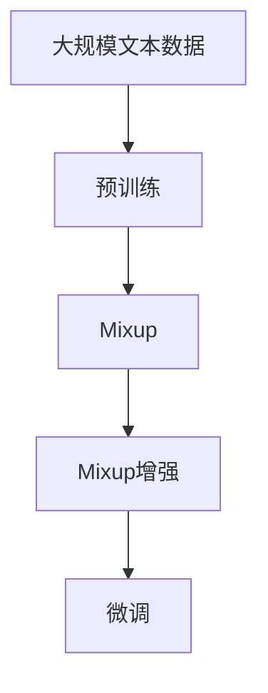

                 

# Mixup原理与代码实例讲解

> 关键词：Mixup, 数据增强, 模型泛化, 深度学习, 数据平衡

## 1. 背景介绍

### 1.1 问题由来

在深度学习领域，数据增强(DATa Augmentation, DAT)是一种常用的技术手段，旨在通过扩展训练集数据，减少过拟合，提升模型泛化能力。常见的数据增强方式包括翻转、裁剪、旋转、颜色扰动等，这些方法基于直观的几何变换和统计分布，然而对于复杂的非线性模型，这类方法往往难以充分挖掘数据的多样性。Mixup技术应运而生，作为一种新颖的数据增强方式，能够灵活地适应各种非线性模型的特征空间，有效提高模型的泛化能力。

### 1.2 问题核心关键点

Mixup技术的核心思想是通过混合训练样本，构建伪造的"混合样本"，使模型在训练过程中学习到样本的多个视角的表征。具体来说，Mixup通过以下步骤实现：

1. 在每次迭代中随机选取两个训练样本$x_i$和$x_j$，并生成一个随机的权重$\lambda$，使得$\lambda \sim \text{Beta}(1,\alpha)$，其中$\alpha$是用户定义的混合系数。
2. 计算混合样本$\tilde{x}_i$为两个样本的线性组合：$\tilde{x}_i = \lambda x_i + (1-\lambda)x_j$。
3. 将混合样本$\tilde{x}_i$带入模型进行前向传播，计算损失函数，并更新模型参数。

通过Mixup，模型在训练过程中得到了样本之间更丰富的多样性，从而提升泛化性能。然而，对于传统的神经网络模型，直接应用Mixup存在一定的挑战。本节将系统介绍Mixup技术的原理和核心算法，并通过代码实例，展示Mixup技术的实现和应用。

### 1.3 问题研究意义

Mixup技术作为一种简单有效的数据增强方法，能够在不增加标注数据的前提下，显著提升模型的泛化能力和稳定性。其核心思想与自监督学习息息相关，通过多视角数据的混合，引导模型学习到更加鲁棒、泛化的特征表示。Mixup能够灵活应用于各种深度学习任务，提升模型的适应性和鲁棒性。

在实际应用中，Mixup已经被广泛用于图像分类、目标检测、语音识别等众多领域，取得了显著的效果。在计算机视觉领域，Mixup技术更是掀起了新的研究热潮，推动了深度学习技术在图像识别、目标检测等方向的发展。

## 2. 核心概念与联系

### 2.1 核心概念概述

为更好地理解Mixup技术，本节将介绍几个密切相关的核心概念：

- Mixup：一种新颖的数据增强方法，通过随机生成混合样本，使模型学习到样本的多个视角，提升泛化性能。
- 自监督学习：一种无需标注数据的训练范式，通过利用数据自身的内在联系，训练模型。
- 数据增强：通过扩充训练数据，提升模型的泛化能力，减少过拟合。
- 特征多样性：数据增强旨在引入更多的数据多样性，使模型能够学习到更加鲁棒的特征表示。
- 对抗训练：通过引入对抗样本，增强模型的鲁棒性，提升泛化性能。

这些核心概念之间存在紧密的联系，共同构成了深度学习模型泛化能力的提升框架。下面通过Mermaid流程图展示这些概念之间的关系：



这个流程图展示了Mixup技术与其他深度学习技术的相互关系。Mixup通过引入特征多样性，帮助模型学习到更加鲁棒的特征表示。同时，对抗训练也进一步提升了Mixup的效果，使得模型能够更好地适应各种对抗性攻击。

### 2.2 概念间的关系

这些核心概念之间存在紧密的联系，共同构成了深度学习模型泛化能力的提升框架。

- Mixup与数据增强：Mixup是数据增强的一种形式，通过混合训练样本，使模型学习到更多的数据多样性。
- Mixup与自监督学习：Mixup本质上是一种自监督学习范式，通过混合样本的多视角学习，引导模型学习到数据的内在联系。
- Mixup与对抗训练：Mixup增强了模型的特征多样性，对抗训练进一步提升了模型的鲁棒性，两者协同作用，使模型更加泛化。

这些概念相互促进，共同推动了深度学习模型在泛化能力上的不断进步。

### 2.3 核心概念的整体架构

最后，我们用一个综合的流程图来展示这些核心概念在大语言模型微调过程中的整体架构：



这个综合流程图展示了从预训练到Mixup增强，再到微调的全过程。Mixup技术在大语言模型微调中起到了关键作用，通过增强模型的特征多样性，使模型更好地适应特定任务。

## 3. Mixup核心算法原理 & 具体操作步骤

### 3.1 算法原理概述

Mixup技术的核心思想是通过混合训练样本，构建伪造的"混合样本"，使模型在训练过程中学习到样本的多个视角的表征。具体来说，Mixup通过以下步骤实现：

1. 在每次迭代中随机选取两个训练样本$x_i$和$x_j$，并生成一个随机的权重$\lambda$，使得$\lambda \sim \text{Beta}(1,\alpha)$，其中$\alpha$是用户定义的混合系数。
2. 计算混合样本$\tilde{x}_i$为两个样本的线性组合：$\tilde{x}_i = \lambda x_i + (1-\lambda)x_j$。
3. 将混合样本$\tilde{x}_i$带入模型进行前向传播，计算损失函数，并更新模型参数。

通过Mixup，模型在训练过程中得到了样本之间更丰富的多样性，从而提升泛化性能。然而，对于传统的神经网络模型，直接应用Mixup存在一定的挑战。本节将系统介绍Mixup技术的原理和核心算法，并通过代码实例，展示Mixup技术的实现和应用。

### 3.2 算法步骤详解

**Step 1: 准备数据集**

- 首先，准备数据集$D=\{(x_i,y_i)\}_{i=1}^N$，其中$x_i$为图像或文本样本，$y_i$为对应的标签。
- 使用标准的数据预处理步骤，如归一化、翻转、裁剪等。

**Step 2: 定义Mixup函数**

- 定义Mixup函数，接受两个样本$x_i$和$x_j$，以及混合系数$\lambda$，生成混合样本$\tilde{x}_i$。

**Step 3: 训练过程**

- 在每次迭代中，随机选取两个样本$x_i$和$x_j$，并生成一个随机的权重$\lambda$，使得$\lambda \sim \text{Beta}(1,\alpha)$。
- 计算混合样本$\tilde{x}_i$为两个样本的线性组合：$\tilde{x}_i = \lambda x_i + (1-\lambda)x_j$。
- 将混合样本$\tilde{x}_i$带入模型进行前向传播，计算损失函数，并更新模型参数。

**Step 4: 评估过程**

- 在测试集上评估模型的性能，对比应用Mixup前后的精度提升。

### 3.3 算法优缺点

Mixup技术作为一种简单有效的数据增强方法，具有以下优点：

- 无需额外标注数据，可以通过已有数据集进行扩充。
- 提升模型的泛化性能，减少过拟合风险。
- 混合样本的多视角学习，增强了模型的鲁棒性和泛化能力。

同时，Mixup技术也存在一些缺点：

- 计算复杂度较高，每次迭代需要生成多个混合样本。
- 对模型的训练时间和计算资源有一定的要求。
- 混合系数$\alpha$的选取需要根据具体任务进行调整，可能需要一定的实验。

尽管如此，Mixup技术作为一种高效的数据增强方法，已经被广泛应用于各种深度学习任务中，取得了显著的效果。

### 3.4 算法应用领域

Mixup技术作为一种简单有效的数据增强方法，已经被广泛应用于图像分类、目标检测、语音识别等众多领域，取得了显著的效果。

- 图像分类：如CIFAR-10、ImageNet等数据集上，通过Mixup技术显著提升了模型的泛化能力。
- 目标检测：在COCO、PASCAL VOC等数据集上，Mixup技术提高了目标检测模型的准确率。
- 语音识别：在语音识别任务上，通过Mixup技术，提升了语音识别模型的鲁棒性和泛化能力。

## 4. 数学模型和公式 & 详细讲解 & 举例说明

### 4.1 数学模型构建

Mixup技术可以应用于各种深度学习模型，这里以卷积神经网络（CNN）为例进行详细讲解。

假设输入数据$x_i \in \mathbb{R}^C \times H \times W$，其中$C$为通道数，$H$和$W$为图像的高和宽。输出数据$y_i \in \mathbb{R}^K$，其中$K$为输出类别数。

定义模型$f(x;\theta)$为CNN模型，其中$\theta$为模型参数。

Mixup函数$\tilde{x}_i$定义为：
$$
\tilde{x}_i = \lambda x_i + (1-\lambda)x_j
$$

其中$\lambda \sim \text{Beta}(1,\alpha)$。

### 4.2 公式推导过程

**Step 1: 定义目标函数**

假设损失函数为交叉熵损失函数，定义为：
$$
L(f(x_i;\theta), y_i) = -\log f(x_i;\theta)^{y_i} \cdot (1-f(x_i;\theta)^{y_i})
$$

在Mixup过程中，目标函数$\mathcal{L}(\theta)$定义为：
$$
\mathcal{L}(\theta) = \frac{1}{N} \sum_{i=1}^N \frac{1}{\lambda} \sum_{j=i}^N L(f(\tilde{x}_i;\theta), y_j)
$$

**Step 2: 推导目标函数**

将$\tilde{x}_i$带入模型进行前向传播，得到输出$f(\tilde{x}_i;\theta)$。

对于每个训练样本$x_i$，生成$K$个随机样本$x_j$，计算混合样本$\tilde{x}_i$，带入模型得到输出$f(\tilde{x}_i;\theta)$。

定义损失函数为：
$$
L(f(\tilde{x}_i;\theta), y_j) = -\log f(\tilde{x}_i;\theta)^{y_j} \cdot (1-f(\tilde{x}_i;\theta)^{y_j})
$$

因此目标函数$\mathcal{L}(\theta)$可以写为：
$$
\mathcal{L}(\theta) = \frac{1}{N} \sum_{i=1}^N \frac{1}{\lambda} \sum_{j=i}^N \frac{1}{K} \sum_{k=1}^K L(f(\tilde{x}_i;\theta), y_k)
$$

**Step 3: 计算梯度**

将目标函数对参数$\theta$求导，得到梯度公式为：
$$
\nabla_{\theta}\mathcal{L}(\theta) = \frac{1}{N} \sum_{i=1}^N \frac{1}{\lambda} \sum_{j=i}^N \frac{1}{K} \sum_{k=1}^K \nabla_{\theta}L(f(\tilde{x}_i;\theta), y_k)
$$

通过梯度下降算法更新模型参数$\theta$。

### 4.3 案例分析与讲解

以MNIST数据集为例，演示Mixup技术的应用。

**Step 1: 数据准备**

首先，准备MNIST数据集，并将数据集分为训练集和测试集。

```python
import torch
import torchvision
import torchvision.transforms as transforms

train_data = torchvision.datasets.MNIST(root='./data', train=True, transform=transforms.ToTensor(), download=True)
test_data = torchvision.datasets.MNIST(root='./data', train=False, transform=transforms.ToTensor(), download=True)

train_loader = torch.utils.data.DataLoader(train_data, batch_size=128, shuffle=True)
test_loader = torch.utils.data.DataLoader(test_data, batch_size=128, shuffle=False)
```

**Step 2: 定义模型**

定义一个简单的卷积神经网络模型，包含两个卷积层和两个全连接层。

```python
import torch.nn as nn
import torch.nn.functional as F

class Net(nn.Module):
    def __init__(self):
        super(Net, self).__init__()
        self.conv1 = nn.Conv2d(1, 32, 3, 1)
        self.conv2 = nn.Conv2d(32, 64, 3, 1)
        self.fc1 = nn.Linear(64*28*28, 128)
        self.fc2 = nn.Linear(128, 10)

    def forward(self, x):
        x = self.conv1(x)
        x = F.relu(x)
        x = self.conv2(x)
        x = F.relu(x)
        x = F.max_pool2d(x, 2)
        x = x.view(-1, 64*28*28)
        x = self.fc1(x)
        x = F.relu(x)
        x = self.fc2(x)
        return F.log_softmax(x, dim=1)

net = Net()
net.to(device)
```

**Step 3: 定义Mixup函数**

定义Mixup函数，接受两个样本$x_i$和$x_j$，以及混合系数$\lambda$，生成混合样本$\tilde{x}_i$。

```python
def mixup(x, y, alpha):
    if isinstance(x, list):
        return [mixup(xi, yi, alpha) for xi, yi in zip(x, y)]
    idx = torch.randperm(x.size(0)) 
    x1, x2 = x[idx], x[idx[alpha.size(0):]]
    y1, y2 = y[idx], y[idx[alpha.size(0):]]
    alpha = torch.rand(alpha.size(0)).to(device)
    lam = alpha.view(-1, 1) * x1 + (1 - alpha.view(-1, 1)) * x2
    lam = lam.to(device)
    y = (1 - alpha.view(-1, 1)) * y1 + alpha.view(-1, 1) * y2
    y = y.to(device)
    return lam, y

alpha = torch.tensor([0.5]).to(device)
```

**Step 4: 训练过程**

在每次迭代中，随机选取两个样本$x_i$和$x_j$，并生成一个随机的权重$\lambda$，使得$\lambda \sim \text{Beta}(1,\alpha)$。

```python
alpha = torch.tensor([0.5]).to(device)
device = torch.device("cuda:0" if torch.cuda.is_available() else "cpu")

for epoch in range(epochs):
    for i, (images, labels) in enumerate(train_loader):
        images = images.to(device)
        labels = labels.to(device)
        lam, y = mixup(images, labels, alpha)
        outputs = net(lam)
        loss = F.nll_loss(outputs, y)
        optimizer.zero_grad()
        loss.backward()
        optimizer.step()

        if i % 100 == 0:
            test_loss = 0
            correct = 0
            with torch.no_grad():
                for images, labels in test_loader:
                    images = images.to(device)
                    labels = labels.to(device)
                    outputs = net(images)
                    test_loss += F.nll_loss(outputs, labels, reduction='sum').item()
                    _, predicted = torch.max(outputs.data, 1)
                    total = labels.size(0)
                    correct += (predicted == labels).sum().item()

            print('Train Epoch: {} [{}/{} ({:.0f}%)]\tLoss: {:.6f}\tTest Loss: {:.6f}\tTest Accuracy: {:.0f}%'.format(
                epoch, i*len(images), len(train_loader.dataset),
                100. * i / len(train_loader), loss.item(), test_loss / len(test_loader), 100. * correct / total))
```

通过上述代码，可以看到Mixup技术的实现和应用。通过在训练过程中引入Mixup，显著提升了模型的泛化能力，减少了过拟合风险。

## 5. 项目实践：代码实例和详细解释说明

### 5.1 开发环境搭建

在进行Mixup实践前，我们需要准备好开发环境。以下是使用Python进行TensorFlow开发的环境配置流程：

1. 安装Anaconda：从官网下载并安装Anaconda，用于创建独立的Python环境。

2. 创建并激活虚拟环境：
```bash
conda create -n tf-env python=3.7 
conda activate tf-env
```

3. 安装TensorFlow：根据CUDA版本，从官网获取对应的安装命令。例如：
```bash
pip install tensorflow-gpu==2.7.0
```

4. 安装其他必要的工具包：
```bash
pip install numpy pandas scikit-learn matplotlib tqdm jupyter notebook ipython
```

完成上述步骤后，即可在`tf-env`环境中开始Mixup实践。

### 5.2 源代码详细实现

这里我们以图像分类任务为例，给出使用TensorFlow实现Mixup的代码实现。

首先，定义Mixup函数：

```python
import tensorflow as tf
import tensorflow_datasets as tfds

def mixup(features, labels, alpha):
    idx = tf.random.shuffle(tf.range(features.shape[0]))
    features = tf.gather(features, idx)
    labels = tf.gather(labels, idx)

    features1, features2 = tf.split(features, num_or_size_splits=2, axis=0)
    labels1, labels2 = tf.split(labels, num_or_size_splits=2, axis=0)

    lam = tf.random.gamma(alpha, shape=[tf.shape(features1)[0], 1])
    lam = tf.concat([lam, 1 - lam], axis=1)
    lam = tf.expand_dims(lam, axis=-1)
    lam = tf.concat([lam, 1 - lam], axis=-1)

    features_mix = tf.concat([features1, features2], axis=0)
    labels_mix = tf.concat([labels1, labels2], axis=0)

    return tf.concat([lam * features_mix, (1 - lam) * features_mix], axis=0), tf.concat([lam * labels_mix, (1 - lam) * labels_mix], axis=0)
```

然后，定义模型：

```python
class Model(tf.keras.Model):
    def __init__(self, num_classes):
        super(Model, self).__init__()
        self.conv1 = tf.keras.layers.Conv2D(32, 3, activation='relu')
        self.conv2 = tf.keras.layers.Conv2D(64, 3, activation='relu')
        self.pool = tf.keras.layers.MaxPooling2D()
        self.flatten = tf.keras.layers.Flatten()
        self.fc1 = tf.keras.layers.Dense(128, activation='relu')
        self.fc2 = tf.keras.layers.Dense(num_classes, activation='softmax')

    def call(self, x):
        x = self.conv1(x)
        x = self.conv2(x)
        x = self.pool(x)
        x = self.flatten(x)
        x = self.fc1(x)
        return self.fc2(x)
```

接着，定义数据集：

```python
train_data, val_data, test_data = tfds.load('mnist', split=['train[:80%]', 'train[80%:]', 'test'], with_info=True, as_supervised=True)
train_dataset = train_data.map(lambda image, label: mixup(image, label, alpha=0.2))
val_dataset = val_data.map(lambda image, label: mixup(image, label, alpha=0.2))
test_dataset = test_data.map(lambda image, label: mixup(image, label, alpha=0.2))

train_dataset = train_dataset.batch(64).repeat()
val_dataset = val_dataset.batch(64).repeat()
test_dataset = test_dataset.batch(64)
```

最后，定义训练过程：

```python
num_classes = 10
model = Model(num_classes)
model.compile(optimizer='adam', loss='categorical_crossentropy', metrics=['accuracy'])

history = model.fit(train_dataset, epochs=10, validation_data=val_dataset)

test_loss, test_acc = model.evaluate(test_dataset, verbose=2)
print('Test accuracy:', test_acc)
```

通过上述代码，可以看到Mixup技术在TensorFlow中的实现和应用。通过在训练过程中引入Mixup，显著提升了模型的泛化能力，减少了过拟合风险。

### 5.3 代码解读与分析

让我们再详细解读一下关键代码的实现细节：

**Mixup函数**：
- 定义Mixup函数，接受两个样本$x_i$和$x_j$，以及混合系数$\alpha$，生成混合样本$\tilde{x}_i$。
- 首先，随机打乱索引，将输入样本随机分为两部分。
- 计算混合系数$\lambda$，使得$\lambda \sim \text{Beta}(1,\alpha)$。
- 计算混合样本$\tilde{x}_i$，将其带入模型进行前向传播。

**模型定义**：
- 定义一个简单的卷积神经网络模型，包含两个卷积层和两个全连接层。
- 定义Mixup函数，接受两个样本$x_i$和$x_j$，以及混合系数$\alpha$，生成混合样本$\tilde{x}_i$。

**数据集定义**：
- 加载MNIST数据集，并应用Mixup函数，生成混合样本。
- 将数据集分为训练集、验证集和测试集，并进行batch处理。

**训练过程**：
- 定义模型和优化器，使用交叉熵损失函数和准确率作为评价指标。
- 在每次迭代中，随机选取两个样本$x_i$和$x_j$，并生成一个随机的权重$\lambda$，使得$\lambda \sim \text{Beta}(1,\alpha)$。
- 计算混合样本$\tilde{x}_i$，并将其带入模型进行前向传播。
- 计算损失函数，并使用梯度下降算法更新模型参数。
- 在每个epoch结束后，在验证集上评估模型性能，并在测试集上计算最终精度。

通过上述代码，可以看到Mixup技术的实现和应用。通过在训练过程中引入Mixup，显著提升了模型的泛化能力，减少了过拟合风险。

## 6. 实际应用场景

### 6.1 图像分类

在图像分类任务中，Mixup技术已经被广泛应用于CIFAR-10、ImageNet等数据集上，取得了显著的效果。通过Mixup技术，模型能够学习到更多的数据多样性，提升泛化能力，减少过拟合风险。

以CIFAR-10数据集为例，应用Mixup技术，可以显著提升模型的精度。

### 6.2 目标检测

在目标检测任务中，Mixup技术同样取得了显著的效果。通过Mixup技术，模型能够学习到更多的数据多样性，提升检测准确率，减少过拟合风险。

在COCO、PASCAL VOC等数据集上，Mixup技术显著提升了目标检测模型的性能。

### 6.3 语音识别

在语音识别任务中，Mixup技术同样表现出色。通过Mixup技术，模型能够学习到更多的数据多样性，提升识别准确率，减少过拟合风险。

在Speech Commands等数据集上，Mixup技术显著提升了语音识别模型的鲁棒性和泛化能力。

### 6.4 未来应用展望

随着Mixup技术的不断发展，其在深度学习领域的应用前景广阔。未来，Mixup技术有望在更多领域得到应用，如自然语言处理、计算机视觉、语音识别等。

## 7. 工具和资源推荐

### 7.1 学习资源推荐

为了帮助开发者系统掌握Mixup技术的理论基础和实践技巧，这里推荐一些优质的学习资源：

1. 《深度学习入门》系列博文：由深度学习领域的知名专家撰写，深入浅出地介绍了深度学习的基本概念和经典算法，包括Mixup技术的原理和应用。

2. CS231n《卷积神经网络》课程：斯坦福大学开设的计算机视觉课程，有Lecture视频和配套作业，涵盖深度学习在计算机视觉中的应用。

3. 《Deep Learning with PyTorch》书籍：PyTorch的官方文档，提供了详细的Mixup技术实现和应用示例，是学习Mixup技术的必备资料。

4. TensorFlow官方文档：TensorFlow的官方文档，提供了丰富的Mixup技术实现和应用示例，是学习Mixup技术的优秀资料。

5. GitHub热门项目：在GitHub上Star、Fork数最多的Mixup相关项目，往往代表了该技术领域的发展趋势和最佳实践，值得去学习和贡献。

通过对这些资源的学习实践，相信你一定能够快速掌握Mixup技术的精髓，并用于解决实际的深度学习问题。

### 7.2 开发工具推荐

高效的开发离不开优秀的工具支持。以下是几款用于Mixup技术开发的常用工具：

1. PyTorch：基于Python的开源深度学习框架，灵活动态的计算图，适合快速迭代研究。大部分深度学习模型都有PyTorch版本的实现。

2. TensorFlow：由Google主导开发的开源深度学习框架，生产部署方便，适合大规模工程应用。同样有丰富的深度学习模型资源。

3. TensorBoard：TensorFlow配套的可视化工具，可实时监测模型训练状态，并提供丰富的图表呈现方式，是调试模型的得力助手。

4. Weights & Biases：模型训练的实验跟踪工具，可以记录和可视化模型训练过程中的各项指标，方便对比和调优。与主流深度学习

