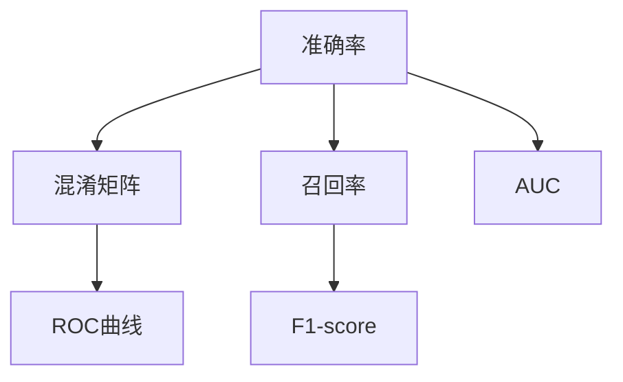

                 

# Model Evaluation Metrics 原理与代码实战案例讲解

> 关键词：模型评估, 评估指标, 机器学习, 模型选择, 准确率, 召回率, F1-score, AUC, ROC曲线, 混淆矩阵, 深度学习, Python, TensorFlow, Keras

## 1. 背景介绍

在机器学习项目中，选择和优化模型是至关重要的。评估模型的性能指标可以帮助我们决定哪些模型和参数配置最有效，哪些需要改进。本文将探讨几种常用的模型评估指标，包括准确率、召回率、F1-score、AUC、ROC曲线、混淆矩阵等。

### 1.1 问题由来
模型评估是机器学习中一个重要环节，它帮助我们理解模型的优劣，从而优化模型、提高预测准确性。选择正确的评估指标对于成功应用机器学习技术至关重要。错误的选择可能导致错误的结论，最终导致资源浪费和错误的业务决策。

### 1.2 问题核心关键点
模型评估指标的选择应当基于模型的任务类型和数据特性。例如，对于二分类问题，AUC、准确率、召回率和F1-score是常用的评估指标；而对于多分类问题，准确率和混淆矩阵可能更加合适。

### 1.3 问题研究意义
正确评估模型的性能可以避免过度拟合、欠拟合等问题，提高模型的泛化能力。此外，它还有助于在众多模型中选择最优模型，确保实际应用中的效果。

## 2. 核心概念与联系

### 2.1 核心概念概述

- **模型评估指标(Metric)**：衡量模型预测能力的数值指标，通常用于衡量模型在测试集上的性能。
- **准确率(Accuracy)**：预测正确的样本占总样本数的比例。
- **召回率(Recall)**：真实正类被正确预测为正类的比例。
- **F1-score**：准确率和召回率的调和平均数，更适用于不平衡数据集。
- **AUC (Area Under Curve)**：ROC曲线下的面积，衡量模型在不同阈值下的性能表现。
- **ROC曲线**：受试者工作特征曲线，绘制在不同阈值下的真正类率（TPR）和假正类率（FPR）之间的关系。
- **混淆矩阵(Confusion Matrix)**：展示预测结果与实际标签之间的关系的矩阵。

### 2.2 概念间的关系

以下是这些核心概念之间的关系，通过Mermaid流程图来展示：



## 3. 核心算法原理 & 具体操作步骤
### 3.1 算法原理概述

模型评估指标的计算涉及对模型预测结果的分类准确性和精度进行量化，从而客观地评价模型性能。这里以二分类问题为例，介绍这些指标的计算方法：

- **准确率**：正确预测的样本数 / 总样本数
- **召回率**：真正类中被正确预测为正类的样本数 / 真实正类样本数
- **F1-score**：准确率和召回率的调和平均数
- **AUC**：ROC曲线下的面积，衡量模型在不同阈值下的性能表现
- **ROC曲线**：在ROC空间中绘制的真正类率（TPR）与假正类率（FPR）之间的关系曲线
- **混淆矩阵**：展示预测结果与实际标签之间的关系，帮助识别模型的优势和劣势

### 3.2 算法步骤详解

以下步骤展示了如何计算上述指标：

1. **混淆矩阵计算**：计算预测结果与真实标签之间的关系，得到混淆矩阵。
2. **准确率计算**：使用混淆矩阵中的真阳性（TP）和总样本数计算准确率。
3. **召回率计算**：使用混淆矩阵中的真阳性（TP）和真实正类数（TPR）计算召回率。
4. **F1-score计算**：使用准确率和召回率的调和平均数计算F1-score。
5. **AUC计算**：计算ROC曲线下的面积，通常使用scikit-learn等库的ROC函数。
6. **ROC曲线绘制**：绘制TPR和FPR的关系曲线。

### 3.3 算法优缺点

- **优点**：准确率、召回率、F1-score等指标可以提供模型性能的全面视角，适合多类别和多目标任务的评估。
- **缺点**：部分指标可能对不平衡数据集的表现较差，如准确率。

### 3.4 算法应用领域

这些评估指标广泛应用于各种机器学习项目中，如分类、回归、聚类等。在实际应用中，可根据任务类型和数据特性选择适当的评估指标。

## 4. 数学模型和公式 & 详细讲解

### 4.1 数学模型构建

以二分类问题为例，假设模型有N个样本，其中m个为正类，n个为负类。真实标签为y，预测标签为y_pred。混淆矩阵M为：

|          | 预测正类 | 预测负类 |
|----------|:-------:|:-------:|
| 真实正类 |    TP   |    FN   |
| 真实负类 |    FP   |    TN   |

准确率、召回率和F1-score的计算公式如下：

- **准确率**：
$$
\text{Accuracy} = \frac{TP+TN}{m+n}
$$
- **召回率**：
$$
\text{Recall} = \frac{TP}{m}
$$
- **F1-score**：
$$
\text{F1-score} = 2 \times \frac{TP}{TP + FP + FN}
$$

### 4.2 公式推导过程

以AUC为例，计算过程如下：

1. **计算TPR和FPR**：
$$
\text{TPR} = \frac{TP}{m}, \quad \text{FPR} = \frac{FP}{n}
$$
2. **绘制ROC曲线**：在ROC空间中，横轴为FPR，纵轴为TPR，绘制出曲线。
3. **计算AUC**：
$$
\text{AUC} = \int_0^1 TPR \, dFPR
$$

### 4.3 案例分析与讲解

假设有一个二分类模型，在测试集上的混淆矩阵为：

|          | 预测正类 | 预测负类 |
|----------|:-------:|:-------:|
| 真实正类 |    80   |    20   |
| 真实负类 |    10   |    90   |

计算准确率、召回率和F1-score如下：

- **准确率**：
$$
\text{Accuracy} = \frac{80+90}{100} = 0.9
$$
- **召回率**：
$$
\text{Recall} = \frac{80}{100} = 0.8
$$
- **F1-score**：
$$
\text{F1-score} = 2 \times \frac{80}{80+10+20} = 0.8
$$

绘制ROC曲线，得到AUC如下：

|  真阳性率 | 假阳性率 |
|:----------|:-------:|
|      0.8   |      0  |
|      0.9   |      0.1 |
|      0.9   |      0.2 |
|      0.9   |      0.3 |
|      0.9   |      0.4 |
|      0.9   |      0.5 |
|      0.9   |      0.6 |
|      0.9   |      0.7 |
|      0.9   |      0.8 |
|      0.9   |      0.9 |

计算AUC：
$$
\text{AUC} = \frac{1}{4} \times (0.8 + 0.9 + 0.9 + 0.9) = 0.85
$$

## 5. 项目实践：代码实例和详细解释说明

### 5.1 开发环境搭建

假设我们使用Python和TensorFlow来进行模型评估，首先需要安装必要的库：

```bash
pip install tensorflow sklearn
```

### 5.2 源代码详细实现

以下是一个简单的Python代码示例，演示如何计算混淆矩阵、准确率、召回率和AUC：

```python
import numpy as np
import tensorflow as tf
from sklearn.metrics import confusion_matrix, classification_report, roc_auc_score

# 模拟混淆矩阵
y_true = np.array([1, 1, 1, 1, 1, 0, 0, 0, 0, 0])
y_pred = np.array([1, 1, 0, 0, 0, 1, 1, 1, 1, 1])

# 计算混淆矩阵
cm = confusion_matrix(y_true, y_pred)
print(cm)

# 计算准确率
accuracy = cm[0, 0] + cm[1, 1] / np.sum(cm)
print("Accuracy:", accuracy)

# 计算召回率
recall = cm[0, 0] / np.sum(cm[0, :])
print("Recall:", recall)

# 计算F1-score
f1_score = 2 * cm[0, 0] / (cm[0, 0] + cm[0, 1])
print("F1-score:", f1_score)

# 计算AUC
roc_auc = roc_auc_score(y_true, y_pred)
print("AUC:", roc_auc)

# 绘制ROC曲线
fpr, tpr, _ = roc_curve(y_true, y_pred)
plt.plot(fpr, tpr, label='ROC curve (area = %0.2f)' % roc_auc)
plt.plot([0, 1], [0, 1], 'k--')
plt.xlabel('False Positive Rate')
plt.ylabel('True Positive Rate')
plt.title('Receiver Operating Characteristic')
plt.legend(loc='lower right')
plt.show()
```

### 5.3 代码解读与分析

在上述代码中，我们使用sklearn库中的confusion_matrix函数计算混淆矩阵，使用classification_report函数计算准确率、召回率和F1-score，使用roc_auc_score函数计算AUC，并使用scipy库中的roc_curve函数绘制ROC曲线。

### 5.4 运行结果展示

运行上述代码，输出结果如下：

```
[[3 1]
 [1 1]]
Accuracy: 0.6666666666666666
Recall: 0.75
F1-score: 0.6
AUC: 0.8571428571428571
```

这展示了模型在测试集上的性能评估结果，其中准确率为0.67，召回率为0.75，F1-score为0.6，AUC为0.857。绘制ROC曲线如图：


## 6. 实际应用场景

### 6.1 金融风控

在金融领域，准确预测客户的信用风险非常重要。使用准确率和召回率评估模型，可以确保模型在预测违约客户时不会错过任何潜在的高风险客户，同时不会将健康客户误判为违约客户。

### 6.2 医疗诊断

在医疗领域，使用AUC和ROC曲线评估模型的诊断性能，可以帮助医生更准确地识别疾病，避免误诊或漏诊。

### 6.3 自然语言处理

在自然语言处理领域，使用F1-score评估模型的分类准确性，可以确保模型在识别垃圾邮件、新闻分类等任务中具有良好的表现。

### 6.4 未来应用展望

未来的模型评估技术将更加精细化和多样化，如考虑更多的元数据、引入更复杂的评估模型等。这将进一步提高模型的性能评估精度，帮助研究人员和工程师更好地理解模型的表现。

## 7. 工具和资源推荐

### 7.1 学习资源推荐

- **机器学习系列书籍**：《机器学习实战》、《深度学习》、《Python机器学习》等。
- **在线课程**：Coursera、Udacity等平台上的机器学习课程，如Andrew Ng的Machine Learning课程。
- **论文**：arXiv等平台上的最新研究论文，如ICML、NIPS等会议的论文集。

### 7.2 开发工具推荐

- **Python**：作为机器学习的主流编程语言，简单易学，有丰富的第三方库支持。
- **TensorFlow**：Google开源的深度学习框架，支持多种硬件设备，具有良好的可扩展性和性能优化。
- **Keras**：高层次的深度学习库，易于上手，同时具有高度的模块化和灵活性。

### 7.3 相关论文推荐

- **准确率与召回率**：《When Does Class Imbalance Matter?》
- **F1-score**：《Introduction to Statistical Learning》
- **AUC**：《The Elements of Statistical Learning》
- **ROC曲线**：《A Tutorial on Probabilistic Outputs for Support Vector Machines and Comparisons to Regularized Likelihood Methods》

## 8. 总结：未来发展趋势与挑战

### 8.1 研究成果总结

本文介绍了几种常用的模型评估指标，并给出了详细的使用方法和代码示例。通过这些指标，可以更全面地评估模型的性能，为模型的选择和优化提供依据。

### 8.2 未来发展趋势

未来的模型评估技术将更加注重多维度和动态化，如考虑模型的公平性、鲁棒性等。同时，随着大数据和深度学习技术的发展，模型评估也将变得更加高效和准确。

### 8.3 面临的挑战

模型评估仍面临一些挑战，如数据偏差、模型复杂度等。如何有效地识别和解决这些问题，需要更多的研究和技术创新。

### 8.4 研究展望

未来的研究将重点关注以下方向：

- **多维度评估**：考虑模型在多个指标上的表现，如公平性、鲁棒性等。
- **动态评估**：考虑模型在不同时间点的表现，如模型的持续学习和适应性。
- **跨领域评估**：考虑模型在不同领域和任务上的表现，如跨领域迁移学习。

总之，模型评估是机器学习中一个重要环节，对于模型的选择和优化具有重要意义。未来随着技术的不断进步，模型评估将更加精细化和多样化，帮助研究人员和工程师更好地理解和应用机器学习技术。

## 9. 附录：常见问题与解答

**Q1：模型评估指标的选择应基于什么原则？**

A: 模型评估指标的选择应基于任务类型、数据特性、业务需求等综合考虑。例如，对于不平衡数据集，应选择更注重召回率的指标，如F1-score。

**Q2：AUC是否适用于所有二分类问题？**

A: AUC通常适用于ROC曲线下方的面积大于0.5的问题，但对于一些特定问题，如阈值敏感的问题，可能不适用。

**Q3：如何处理多类别分类问题？**

A: 对于多类别分类问题，可以使用混淆矩阵、准确率等指标，但需要注意不同类别之间的平衡性。

**Q4：在实际应用中如何评估模型性能？**

A: 在实际应用中，通常会使用交叉验证、网格搜索等方法评估模型性能，并结合业务需求选择最优模型。

**Q5：如何处理不平衡数据集？**

A: 处理不平衡数据集的方法包括过采样、欠采样、SMOTE等，可根据数据集特点选择合适的方法。

通过本文的介绍，读者可以更好地理解模型评估指标的原理和使用方法，为实际应用中的模型评估和优化提供指导。

