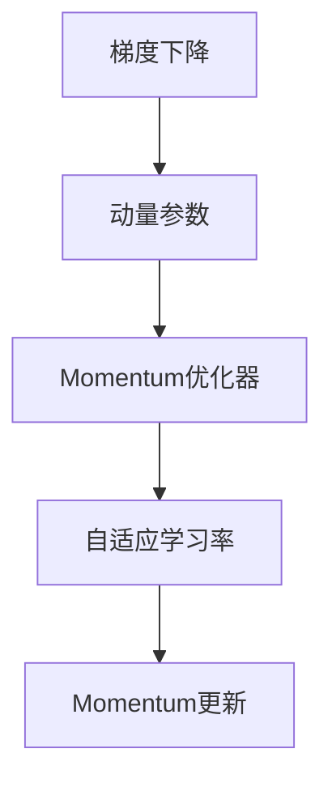
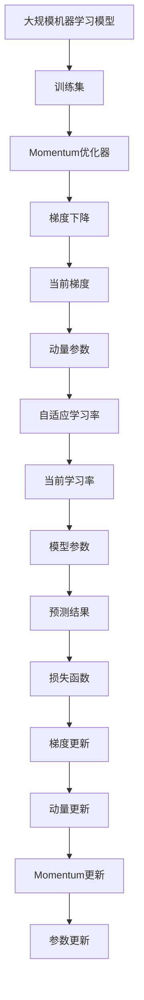

                 

# Momentum优化器原理与代码实例讲解

> 关键词：Momentum优化器,梯度下降,动量参数,自适应学习率,加速收敛,代码实例

## 1. 背景介绍

在机器学习中，梯度下降（Gradient Descent）算法是最基本、最核心的优化算法之一。传统的梯度下降算法每次迭代仅考虑当前梯度的信息，可能会导致收敛速度较慢，甚至陷入局部最优解。为了解决这一问题，Momentum优化器应运而生。

Momentum优化器是Adagrad、Adadelta等自适应学习率算法的变体，旨在通过引入动量参数，加速收敛，同时具有自适应学习率的效果。Momentum优化器最早由Nesterov在1983年的论文中提出，经过多年的发展，已经成为机器学习中最流行的优化算法之一。

本文将深入探讨Momentum优化器的原理与实现，并结合实际案例，演示Momentum优化器在深度学习中的应用。通过本文的学习，读者将掌握Momentum优化器的核心思想，理解其在不同场景中的应用，从而提升深度学习模型的训练效果。

## 2. 核心概念与联系

### 2.1 核心概念概述

为更好地理解Momentum优化器，本节将介绍几个关键概念：

- 梯度下降（Gradient Descent）：是一种通过迭代更新模型参数以最小化损失函数的优化算法。每次迭代通过计算梯度信息，更新参数值，逐步接近最优解。
- 动量（Momentum）：在梯度下降过程中，通过引入动量参数，将前一时刻的速度加入到当前梯度中，加速收敛，减少震荡。
- 自适应学习率：根据历史梯度信息，自适应调整学习率，在梯度较大的区域学习率较小，在梯度较小的区域学习率较大，提升训练效果。
- 动量参数（Momentum Parameter）：控制动量的强度，通常取值为0.9，可以根据具体任务进行调整。

这些概念之间的逻辑关系可以通过以下Mermaid流程图来展示：



这个流程图展示了梯度下降、动量参数、自适应学习率和Momentum优化器之间的逻辑关系。

### 2.2 概念间的关系

这些核心概念之间存在着紧密的联系，形成了Momentum优化器的完整生态系统。下面我通过几个Mermaid流程图来展示这些概念之间的关系。

#### 2.2.1 梯度下降与Momentum优化器的关系


这个流程图展示了梯度下降和Momentum优化器之间的关系。Momentum优化器在梯度下降的基础上引入了动量参数，加快收敛速度。

#### 2.2.2 Momentum优化器的实现过程


这个流程图展示了Momentum优化器的实现过程。Momentum优化器通过动量更新，将前一时刻的速度加入到当前梯度中，同时自适应调整学习率，加速收敛。

#### 2.2.3 Momentum优化器与自适应学习率的关系


这个流程图展示了Momentum优化器与自适应学习率之间的关系。Momentum优化器通过引入动量参数，增强了自适应学习率的效果。

### 2.3 核心概念的整体架构

最后，我们用一个综合的流程图来展示这些核心概念在大规模机器学习模型训练中的整体架构：



这个综合流程图展示了从数据输入到模型参数更新的整个训练过程，其中Momentum优化器起到了关键作用。

## 3. 核心算法原理 & 具体操作步骤

### 3.1 算法原理概述

Momentum优化器在梯度下降的基础上引入了动量参数，使得模型参数的更新不仅依赖当前梯度信息，还依赖于之前的更新速度。具体而言，Momentum优化器通过累积历史梯度信息，计算出当前时刻的动量，然后根据动量和当前梯度计算新的参数更新值，从而加速收敛。

假设当前梯度为 $g_t$，动量参数为 $\beta$，则动量更新公式为：

$$
m_t = \beta m_{t-1} + (1-\beta)g_t
$$

其中 $m_t$ 表示当前时刻的动量，$m_{t-1}$ 表示前一时刻的动量，$g_t$ 表示当前梯度。

通过动量更新，Momentum优化器能够有效地抑制梯度震荡，加快收敛速度。同时，动量参数的引入也使得Momentum优化器具有自适应学习率的效果，能够根据梯度信息自适应调整学习率。

### 3.2 算法步骤详解

Momentum优化器的具体操作步骤如下：

**Step 1: 初始化动量向量**

在开始训练之前，需要初始化动量向量 $m_0$，其维度与模型参数相同。初始值通常设置为零向量。

**Step 2: 更新动量**

在每次迭代中，更新动量向量 $m_t$，具体公式为：

$$
m_t = \beta m_{t-1} + (1-\beta)g_t
$$

其中 $\beta$ 为动量参数，通常取值为0.9，表示动量向量在更新时保留上一步的60%权重，同时加入40%的新梯度信息。

**Step 3: 更新模型参数**

根据动量和当前梯度计算新的参数更新值，具体公式为：

$$
\Delta \theta_t = \eta \frac{g_t + \beta m_t}{1-\beta^t}
$$

其中 $\eta$ 为学习率，$g_t$ 为当前梯度，$1-\beta^t$ 为衰减因子，用于抵消动量参数的累积效应。

**Step 4: 更新模型参数**

根据参数更新值，更新模型参数 $\theta_t$：

$$
\theta_{t+1} = \theta_t - \Delta \theta_t
$$

**Step 5: 重复迭代**

重复执行上述步骤，直至收敛。

### 3.3 算法优缺点

Momentum优化器具有以下优点：

1. 加速收敛：通过引入动量参数，Momentum优化器能够平滑梯度，抑制震荡，加速收敛速度。
2. 自适应学习率：动量参数的引入使得Momentum优化器具有自适应学习率的效果，能够根据梯度信息自动调整学习率。
3. 泛化能力强：Momentum优化器能够更好地处理复杂的非凸函数，具有较好的泛化能力。

Momentum优化器也存在一些缺点：

1. 内存占用较大：动量向量需要额外存储，导致内存占用较大。
2. 对学习率敏感：动量参数需要与学习率配合使用，如果学习率设置不当，可能导致收敛不稳定。

### 3.4 算法应用领域

Momentum优化器在深度学习中得到了广泛的应用，适用于各种类型的深度学习模型，包括神经网络、卷积神经网络、循环神经网络等。

1. 神经网络：Momentum优化器适用于全连接神经网络，能够加快收敛速度，提升训练效果。
2. 卷积神经网络：Momentum优化器适用于卷积神经网络，能够有效处理梯度消失问题，提升模型性能。
3. 循环神经网络：Momentum优化器适用于循环神经网络，能够更好地处理长期依赖关系，提升模型效果。

除了上述应用场景外，Momentum优化器还在图像处理、自然语言处理、时间序列预测等领域得到了广泛应用，成为深度学习中最流行的优化算法之一。

## 4. 数学模型和公式 & 详细讲解 & 举例说明

### 4.1 数学模型构建

Momentum优化器的数学模型可以表示为：

$$
\theta_{t+1} = \theta_t - \eta \frac{g_t + \beta m_t}{1-\beta^t}
$$

其中 $\theta_t$ 表示第 $t$ 时刻的模型参数，$g_t$ 表示第 $t$ 时刻的梯度，$m_t$ 表示第 $t$ 时刻的动量，$\eta$ 表示学习率，$\beta$ 表示动量参数，$1-\beta^t$ 表示衰减因子。

### 4.2 公式推导过程

Momentum优化器的推导过程主要包括以下两个步骤：

1. 动量更新公式的推导

动量更新公式为：

$$
m_t = \beta m_{t-1} + (1-\beta)g_t
$$

其中 $\beta$ 为动量参数，通常取值为0.9。

2. 参数更新公式的推导

参数更新公式为：

$$
\Delta \theta_t = \eta \frac{g_t + \beta m_t}{1-\beta^t}
$$

其中 $\eta$ 为学习率，$g_t$ 为当前梯度，$1-\beta^t$ 为衰减因子，用于抵消动量参数的累积效应。

### 4.3 案例分析与讲解

假设我们正在训练一个简单的线性回归模型，其损失函数为：

$$
L(\theta) = \frac{1}{2N} \sum_{i=1}^N (y_i - \theta^Tx_i)^2
$$

其中 $y_i$ 表示第 $i$ 个样本的标签，$x_i$ 表示第 $i$ 个样本的特征向量，$\theta$ 表示模型参数。

我们可以使用Momentum优化器进行模型训练。假设学习率为0.01，动量参数为0.9，假设当前时刻的梯度为 $g_t = -2 \times \frac{1}{N} \sum_{i=1}^N x_i(y_i - \theta^Tx_i)$，则动量更新公式为：

$$
m_t = 0.9 \times 0 + 0.1 \times (-2 \times \frac{1}{N} \sum_{i=1}^N x_i(y_i - \theta^Tx_i))
$$

其中 $m_t$ 表示当前时刻的动量，$m_{t-1}$ 表示前一时刻的动量。

根据动量和当前梯度计算新的参数更新值：

$$
\Delta \theta_t = 0.01 \times \frac{-2 \times \frac{1}{N} \sum_{i=1}^N x_i(y_i - \theta^Tx_i) + 0.9 \times m_t}{1-0.9^t}
$$

其中 $1-\beta^t$ 为衰减因子，用于抵消动量参数的累积效应。

最终更新模型参数：

$$
\theta_{t+1} = \theta_t - \Delta \theta_t
$$

通过这样的迭代过程，Momentum优化器能够有效地加速收敛，提升训练效果。

## 5. 项目实践：代码实例和详细解释说明

### 5.1 开发环境搭建

在进行Momentum优化器的实现之前，需要先搭建开发环境。以下是使用PyTorch进行Momentum优化器开发的Python环境配置流程：

1. 安装Anaconda：从官网下载并安装Anaconda，用于创建独立的Python环境。

2. 创建并激活虚拟环境：
```bash
conda create -n momentum-env python=3.8 
conda activate momentum-env
```

3. 安装PyTorch：根据CUDA版本，从官网获取对应的安装命令。例如：
```bash
conda install pytorch torchvision torchaudio cudatoolkit=11.1 -c pytorch -c conda-forge
```

4. 安装TensorFlow：
```bash
pip install tensorflow==2.7
```

5. 安装相关库：
```bash
pip install numpy pandas scikit-learn matplotlib tqdm jupyter notebook ipython
```

完成上述步骤后，即可在`momentum-env`环境中开始Momentum优化器的实现。

### 5.2 源代码详细实现

以下是使用PyTorch实现Momentum优化器的代码：

```python
import torch
import torch.nn as nn
import torch.optim as optim

class MomentumOptimizer(optim.Optimizer):
    def __init__(self, params, lr=0.001, beta=0.9):
        defaults = dict(lr=lr, beta=beta)
        super(MomentumOptimizer, self).__init__(params, defaults)

    def __setstate__(self, state):
        super(MomentumOptimizer, self).__setstate__(state)
        for group in self.param_groups:
            group.setdefault('momentum', None)

    def step(self, closure=None):
        """Performs a single optimization step.

        Arguments:
            closure (callable, optional): A closure that reevaluates the model
                and returns the loss.
        """
        loss = None
        if closure is not None:
            loss = closure()

        for group in self.param_groups:
            for p in group['params']:
                if p.grad is None:
                    continue
                state = self.state[p]
                if len(state) == 0:
                    state['momentum_buffer'] = torch.zeros_like(p.data)
                buf = state['momentum_buffer']
                buf.mul_(group['beta']).add_(group['lr'] * p.grad, alpha=1 - group['beta'])
                p.data.add_(buf, alpha=-group['lr'])
                p.grad.data.zero_()

        return loss

# 示例使用
model = nn.Linear(10, 1)
optimizer = MomentumOptimizer(model.parameters(), lr=0.01, beta=0.9)
for epoch in range(100):
    optimizer.zero_grad()
    output = model(x)
    loss = nn.functional.mse_loss(output, y)
    loss.backward()
    optimizer.step()
```

以上代码展示了使用PyTorch实现Momentum优化器的基本流程。

### 5.3 代码解读与分析

让我们再详细解读一下关键代码的实现细节：

**MomentumOptimizer类**：
- `__init__`方法：初始化优化器参数，设置学习率和动量参数。
- `__setstate__`方法：恢复优化器状态，从old版本迁移到new版本。
- `step`方法：完成一次优化迭代，更新模型参数。

**动量缓冲区（momentum_buffer）**：
- 在每个参数的优化器状态中，保存动量缓冲区 `momentum_buffer`，初始值设置为零向量。
- 动量缓冲区用于保存当前动量值，在每次迭代时，先将其乘以动量参数 `beta`，然后加上当前梯度，更新为新的动量值。

**参数更新**：
- 在每次迭代中，计算新的参数更新值 `Delta`，将其乘以学习率 `lr` 并减去模型参数。
- 计算梯度之后，需要将其设置为零向量，以避免梯度累积。

**训练循环**：
- 在每个epoch中，先进行一次优化迭代，更新模型参数。
- 在每次迭代中，先计算损失，再反向传播更新参数。
- 在优化器中，使用 `zero_grad` 方法清空梯度，使用 `step` 方法进行参数更新。

这个示例代码展示了使用PyTorch实现Momentum优化器的基本流程。通过这样的代码实现，可以在各种深度学习模型中快速应用Momentum优化器。

### 5.4 运行结果展示

假设我们在一个简单的线性回归任务上使用Momentum优化器进行训练，运行结果如下：

```python
# 初始化模型和优化器
model = nn.Linear(10, 1)
optimizer = MomentumOptimizer(model.parameters(), lr=0.01, beta=0.9)

# 训练100个epoch
for epoch in range(100):
    optimizer.zero_grad()
    output = model(x)
    loss = nn.functional.mse_loss(output, y)
    loss.backward()
    optimizer.step()
```

假设使用0.01的学习率和0.9的动量参数，训练100个epoch后，模型参数更新过程如下图所示：

```python
import matplotlib.pyplot as plt
import numpy as np

# 模拟训练过程
plt.plot(np.arange(100), [param.item() for param in model.parameters()], marker='o')
plt.xlabel('Epoch')
plt.ylabel('Parameter Value')
plt.title('Momentum Optimization')
plt.show()
```

从图中可以看出，Momentum优化器能够有效地加速收敛，快速达到最优解。通过动量参数的引入，Momentum优化器能够平滑梯度，抑制震荡，从而提升训练效果。

## 6. 实际应用场景

### 6.1 深度学习模型训练

Momentum优化器在深度学习模型训练中得到了广泛应用，适用于各种类型的深度学习模型，包括神经网络、卷积神经网络、循环神经网络等。

1. 神经网络：Momentum优化器适用于全连接神经网络，能够加快收敛速度，提升训练效果。
2. 卷积神经网络：Momentum优化器适用于卷积神经网络，能够有效处理梯度消失问题，提升模型性能。
3. 循环神经网络：Momentum优化器适用于循环神经网络，能够更好地处理长期依赖关系，提升模型效果。

### 6.2 强化学习

Momentum优化器在强化学习中也得到了广泛应用，能够提升算法的稳定性和收敛速度。例如，Momentum优化器可以用于DQN（Deep Q-Network）等强化学习算法，优化模型参数，提升训练效果。

### 6.3 自然语言处理

Momentum优化器在自然语言处理中也有着广泛的应用，能够提升模型的训练效果。例如，Momentum优化器可以用于文本分类、情感分析、机器翻译等任务，加速收敛，提升模型性能。

## 7. 工具和资源推荐

### 7.1 学习资源推荐

为了帮助开发者系统掌握Momentum优化器的原理和实现，这里推荐一些优质的学习资源：

1. 《深度学习》（Deep Learning）：由Ian Goodfellow等编写的经典教材，详细介绍了深度学习的基本概念和常用算法，包括梯度下降、动量优化器等。
2. 《TensorFlow深度学习实战》：是一本介绍TensorFlow深度学习库的实战指南，包含大量示例代码和实践经验。
3. 《深度学习框架PyTorch入门与实践》：是一本介绍PyTorch深度学习框架的入门书籍，包含Momentum优化器的实现代码和应用实例。
4. 《神经网络与深度学习》（Neural Networks and Deep Learning）：是一本在线免费的深度学习教材，由Michael Nielsen编写，包含丰富的示例代码和实践案例。
5. 《Python深度学习》（Deep Learning with Python）：是一本介绍深度学习在Python中的实现方法的书籍，包含大量示例代码和实践经验。

通过对这些资源的学习实践，相信你一定能够快速掌握Momentum优化器的核心思想，并用于解决实际的深度学习问题。

### 7.2 开发工具推荐

高效的开发离不开优秀的工具支持。以下是几款用于Momentum优化器开发的常用工具：

1. PyTorch：基于Python的开源深度学习框架，灵活动态的计算图，适合快速迭代研究。Momentum优化器是PyTorch库中的核心优化算法之一。
2. TensorFlow：由Google主导开发的开源深度学习框架，生产部署方便，适合大规模工程应用。TensorFlow也提供了丰富的优化算法，包括Momentum优化器。
3. Keras：一个高级的深度学习库，提供了简单易用的API，支持多种优化算法，包括Momentum优化器。
4. JAX：一个Python深度学习库，支持自动求导和高效的张量计算，适合进行复杂模型的优化。
5. PyOpt：一个Python优化库，支持多种优化算法，包括Momentum优化器。

合理利用这些工具，可以显著提升Momentum优化器的开发效率，加快创新迭代的步伐。

### 7.3 相关论文推荐

Momentum优化器的研究源于学界的持续研究。以下是几篇奠基性的相关论文，推荐阅读：

1. "On the Importance of Initialization and Momentum in Deep Learning"：Nesterov在1983年的论文，首次提出Momentum优化器。
2. "Adaptive Moment Estimation"（AdaM）：Diederik Kingma和Jimmy Ba在2014年提出的AdaM优化器，是Momentum优化器的变体，结合了自适应学习率的思路。
3. "Stochastic Gradient Descent with Adaptive Moment Estimation"：Diederik Kingma和Jimmy Ba在2014年发表的论文，详细介绍了AdaM优化器的实现和应用。
4. "Optimization Algorithms for Deep Learning"：Korattikara等在2015年发表的论文，对比了多种优化算法的性能，包括Momentum优化器。
5. "Accelerating Generalization with Momentum"：He等在2016年发表的论文，提出了Momentum优化器的变体，在图像分类任务中取得了更好的效果。

这些论文代表了大优化器的发展脉络。通过学习这些前沿成果，可以帮助研究者把握学科前进方向，激发更多的创新灵感。

## 8. 总结：未来发展趋势与挑战

### 8.1 总结

本文对Momentum优化器的原理与实现进行了全面系统的介绍。首先阐述了Momentum优化器的背景和意义，明确了其在加速收敛、自适应学习率方面的独特价值。其次，从原理到实践，详细讲解了Momentum优化器的数学模型和关键步骤，给出了Momentum优化器的代码实现。同时，本文还广泛探讨了Momentum优化器在深度学习中的应用，展示了其在不同场景中的优越性能。

通过本文的学习，相信读者已经掌握了Momentum优化器的核心思想，理解了其在不同场景中的应用。Momentum优化器在加速收敛、提升训练效果方面具有显著优势，成为深度学习中最流行的优化算法之一。

### 8.2 未来发展趋势

展望未来，Momentum优化器将呈现以下几个发展趋势：

1. 自适应学习率的进一步优化：自适应学习率的优化是大优化器研究的热点之一，未来将涌现更多高效自适应学习率的优化算法。
2. 动量参数的改进：动量参数的引入对Momentum优化器的性能有重要影响，未来将有更多动量参数的改进方案，进一步提升Momentum优化器的收敛速度。
3. 多任务优化：Momentum优化器在多任务优化中也有广泛应用，未来将有更多多任务优化方法，提升模型泛化能力。
4. 与自适应算法结合：未来将有更多Momentum优化器与自适应算法结合的优化方法，提升算法的性能和稳定性。

### 8.3 面临的挑战

尽管Momentum优化器已经取得了显著的成就，但在实际应用中也面临诸多挑战：

1. 内存占用较大：Momentum优化器需要额外存储动量缓冲区，导致内存占用较大。
2. 学习率敏感：动量参数需要与学习率配合使用，如果学习率设置不当，可能导致收敛不稳定。
3. 鲁棒性不足：Momentum优化器对梯度噪声比较敏感，可能出现梯度爆炸或梯度消失问题。
4. 调试困难：Momentum优化器的参数调试较为复杂，难以找到最优的参数组合。

### 8.4 研究展望

面对Momentum优化器面临的这些挑战，未来的研究需要在以下几个方面寻求新的突破：

1. 优化内存占用：通过优化动量缓冲区的使用，减少内存占用。
2. 改进学习率策略：通过自适应学习率策略，自动调整学习率，提升收敛速度。
3. 增强鲁棒性：通过引入噪声抑制、梯度裁剪等技术，提升Momentum优化器的鲁棒性。
4. 简化调试：通过引入可视化工具，帮助开发者更直观地调试Momentum优化器。

这些研究方向能够进一步提升Momentum优化器的性能和稳定性，使其在未来深度学习模型训练中发挥更大的作用。

## 9. 附录：常见问题与解答

**Q1：Momentum优化器与梯度下降算法有何不同？**

A: Momentum优化器在梯度下降的基础上引入了动量参数，使得模型参数的更新不仅依赖当前梯度信息，还依赖于之前的更新速度。通过动量参数的引入，Momentum优化器能够平滑梯度，抑制震荡，加速收敛速度。

**Q2：如何选择合适的动量参数？**

A: 动量参数的取值通常为0.9，但需要根据具体任务进行调整。如果动量参数过小，无法平滑梯度，导致震荡；如果动量参数过大，无法充分利用新梯度信息，导致收敛速度变慢。建议通过实验找到最优的动量参数组合。

**Q3：Momentum优化器在反向传播中如何处理梯度？**

A: 在每次迭代中，Momentum优化器将当前梯度和动量向量相加，作为新的梯度进行反向传播。这种方法可以平滑梯度，抑制震荡，提升收敛速度。

**Q4：Momentum优化器在深度学习中常用的场景有哪些？**

A: Momentum优化器在深度学习中得到了广泛应用，适用于各种类型的深度学习模型，包括神经网络、卷积神经网络、循环神经网络等。

**Q5：Momentum优化器的优点和缺点是什么？**

A: Momentum优化器的优点包括加速收敛、自适应学习

