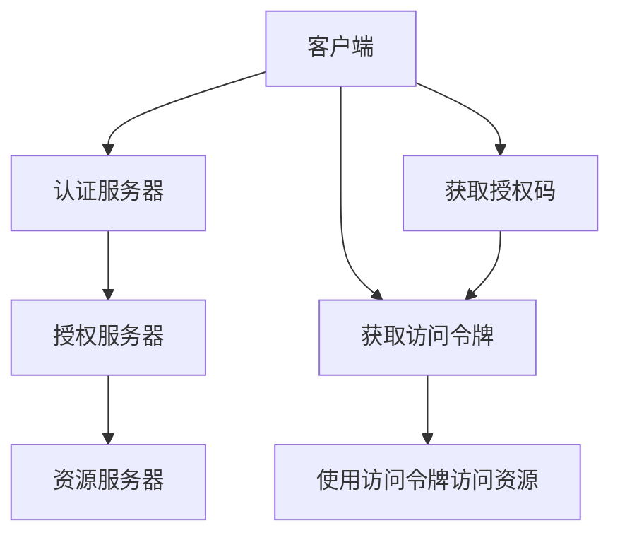
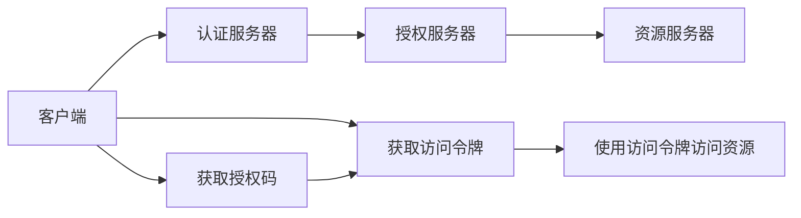
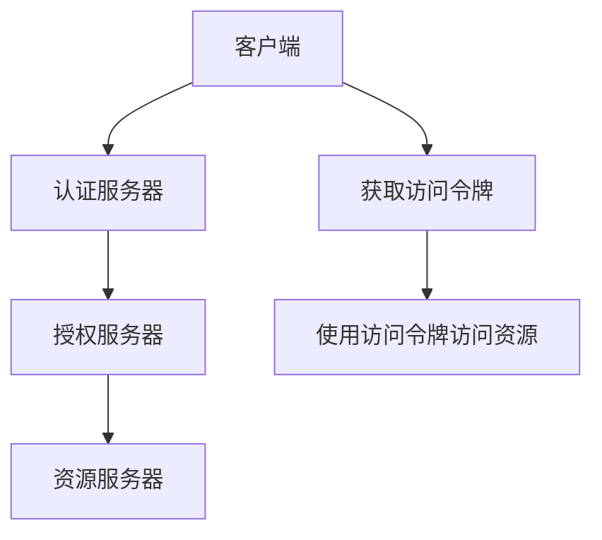
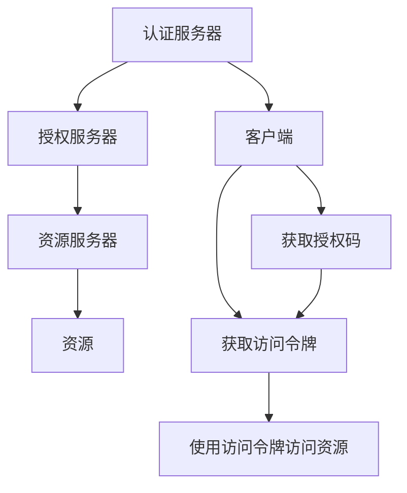

                 

# OAuth 2.0 的实现细节

> 关键词：OAuth 2.0, 认证, 授权, 授权码模式, 隐式模式, 客户端模式, 密码模式, 令牌管理, 安全实现, 应用场景, 优缺点分析

## 1. 背景介绍

### 1.1 问题由来
在现代互联网应用中，用户经常需要使用多个应用提供的服务，每个应用通常都有自己的登录系统，这给用户带来了极大的不便。为了解决这个问题，OAuth 2.0协议应运而生，它提供了一种通用的授权框架，允许用户授权第三方应用访问其个人数据，而无需在每个应用上重新登录。OAuth 2.0已经成为了现代互联网应用中最为广泛采用的认证授权协议之一。

### 1.2 问题核心关键点
OAuth 2.0的核心思想是分离认证和授权过程，用户通过第三方认证服务器进行身份认证，并获得一个访问令牌，然后将其传递给目标应用，以授权该应用访问其个人数据。

主要包括以下几个关键点：
- 认证服务器：负责验证用户身份，并生成访问令牌。
- 授权服务器：负责验证用户授权请求，决定是否授权应用访问其数据。
- 客户端：代表用户向授权服务器发起授权请求，并使用访问令牌向目标应用请求资源。

### 1.3 问题研究意义
OAuth 2.0协议对互联网应用的安全性和用户体验有着重大意义：
- 提升安全性：通过分离认证和授权过程，减轻了应用的负担，避免了将用户密码存储在应用服务器上，降低了安全风险。
- 简化登录过程：用户只需在一个认证服务器上完成一次登录，即可在多个应用中使用该令牌进行授权。
- 支持多种应用场景：OAuth 2.0支持多种授权模式，如授权码模式、隐式模式、客户端模式、密码模式等，可以满足不同应用的需求。

## 2. 核心概念与联系

### 2.1 核心概念概述

为了更好地理解OAuth 2.0的实现细节，本节将介绍几个关键概念：

- **OAuth 2.0**：一种基于REST架构的开放标准，用于实现身份认证和授权过程。OAuth 2.0分离了身份认证和授权过程，提高了安全性，简化了用户登录过程。
- **认证服务器**：负责验证用户身份，生成访问令牌。常见的认证服务器包括Google、Facebook、GitHub等。
- **授权服务器**：负责验证用户授权请求，决定是否授权应用访问其数据。授权服务器通常与认证服务器是同一台服务器，也可以是独立的服务器。
- **客户端**：代表用户向授权服务器发起授权请求，并使用访问令牌向目标应用请求资源。客户端可以是Web应用、移动应用、API等。
- **访问令牌**：由认证服务器生成，用于授权应用访问用户数据。访问令牌分为长期令牌和短期令牌，长期令牌可以提供更长时间的访问权限，但需要定期刷新。
- **刷新令牌**：用于延长访问令牌的有效期，防止访问令牌被泄露。
- **客户端ID和密钥**：客户端在认证服务器注册时获得的唯一标识符和密钥，用于与服务器进行通信和加密。
- **重定向URL**：客户端请求授权时，需要在授权服务器提供的重定向URL中包含访问令牌。

这些核心概念之间的关系可以通过以下Mermaid流程图来展示：



这个流程图展示了OAuth 2.0的基本流程：
1. 客户端向认证服务器发起授权请求，获取授权码。
2. 客户端将授权码传递给授权服务器，获取访问令牌。
3. 客户端使用访问令牌向资源服务器请求资源。

### 2.2 概念间的关系

这些核心概念之间存在着紧密的联系，形成了OAuth 2.0的完整授权过程。下面我们通过几个Mermaid流程图来展示这些概念之间的关系。

#### 2.2.1 OAuth 2.0 基本授权流程



这个流程图展示了OAuth 2.0的基本授权流程。

#### 2.2.2 授权码模式


授权码模式是OAuth 2.0中最常用的授权模式之一，它通过在客户端和认证服务器之间传递授权码，确保了授权请求的安全性。

#### 2.2.3 隐式模式



隐式模式适用于不需要保存任何机密信息的客户端，如移动应用。

#### 2.2.4 客户端模式


客户端模式适用于需要维护机密信息的客户端，如Web应用。

#### 2.2.5 密码模式


密码模式适用于长期运行的客户端，需要将客户端密钥传递给认证服务器进行验证。

### 2.3 核心概念的整体架构

最后，我们用一个综合的流程图来展示这些核心概念在大语言模型微调过程中的整体架构：



这个综合流程图展示了OAuth 2.0的完整流程：
1. 客户端向认证服务器发起授权请求，获取授权码。
2. 客户端将授权码传递给授权服务器，获取访问令牌。
3. 客户端使用访问令牌向资源服务器请求资源。

## 3. 核心算法原理 & 具体操作步骤
### 3.1 算法原理概述

OAuth 2.0的核心原理是通过认证服务器和授权服务器实现身份认证和授权过程。认证服务器负责验证用户身份，生成访问令牌；授权服务器负责验证用户授权请求，决定是否授权应用访问其数据。

具体步骤如下：

1. 客户端向认证服务器发起授权请求，获取授权码。
2. 客户端将授权码传递给授权服务器，获取访问令牌。
3. 客户端使用访问令牌向资源服务器请求资源。

### 3.2 算法步骤详解

OAuth 2.0的授权过程可以分为以下几个步骤：

**Step 1: 客户端注册**
客户端在认证服务器上注册，获得客户端ID和密钥。

**Step 2: 获取授权码**
客户端向认证服务器发起授权请求，获取授权码。

**Step 3: 交换访问令牌**
客户端将授权码传递给授权服务器，获取访问令牌。

**Step 4: 使用访问令牌访问资源**
客户端使用访问令牌向资源服务器请求资源。

### 3.3 算法优缺点

OAuth 2.0协议具有以下优点：
- 分离认证和授权过程，提高了安全性。
- 简化了用户登录过程，用户体验更佳。
- 支持多种授权模式，可以满足不同应用的需求。

同时，OAuth 2.0协议也存在一些缺点：
- 授权码模式和隐式模式需要客户端支持HTTPS协议，增加了成本。
- 客户端需要维护客户端密钥，增加了开发和维护难度。
- 授权码模式和隐式模式需要客户端在用户同意后发起重定向，用户体验较差。

### 3.4 算法应用领域

OAuth 2.0协议在现代互联网应用中得到了广泛的应用，以下是一些典型应用领域：

- **社交网络**：如Facebook、Twitter、Instagram等，用户可以通过OAuth 2.0授权第三方应用访问其社交数据。
- **电子商务**：如Amazon、eBay、淘宝等，用户可以通过OAuth 2.0授权第三方应用访问其购物数据。
- **金融服务**：如PayPal、支付宝、微信支付等，用户可以通过OAuth 2.0授权第三方应用访问其金融数据。
- **物联网设备**：如智能家居、智能穿戴设备等，用户可以通过OAuth 2.0授权第三方应用访问其设备数据。

此外，OAuth 2.0协议还可以应用于多个不同行业，如医疗、政府、教育等，用户可以通过OAuth 2.0授权第三方应用访问其个人数据。

## 4. 数学模型和公式 & 详细讲解 & 举例说明
### 4.1 数学模型构建

OAuth 2.0协议的数学模型主要涉及令牌生成和交换过程。

假设客户端ID为`client_id`，密钥为`client_secret`，认证服务器公钥为`RSAPublicKey`，认证服务器私钥为`RSAPrivateKey`。

**访问令牌生成**：
令牌由认证服务器生成，形式为`JWT`（JSON Web Token），包含以下字段：
- `iss`：发行者标识，即认证服务器的公钥。
- `sub`：令牌主体标识，即客户端ID。
- `exp`：令牌过期时间，单位为秒。
- `iat`：令牌签发时间，单位为秒。
- `jti`：令牌唯一标识符。

访问令牌生成过程如下：
$$
\text{JWT} = \text{HMAC-SHA256}( \text{RSAPrivateKey}, \text{client_secret}, \text{JWT}_\text{未签名} )
$$

**访问令牌交换**：
客户端向授权服务器发起授权请求，获取授权码。授权码交换为访问令牌的过程如下：
$$
\text{Authorization Code} = \text{client\_id} | \text{client\_secret}
$$
$$
\text{Token} = \text{RSAPublicKey} \cdot \text{Authorization Code}
$$

### 4.2 公式推导过程

以下我们以授权码模式为例，推导访问令牌生成和交换的数学过程。

**访问令牌生成**：
令牌由认证服务器生成，形式为`JWT`（JSON Web Token），包含以下字段：
- `iss`：发行者标识，即认证服务器的公钥。
- `sub`：令牌主体标识，即客户端ID。
- `exp`：令牌过期时间，单位为秒。
- `iat`：令牌签发时间，单位为秒。
- `jti`：令牌唯一标识符。

访问令牌生成过程如下：
$$
\text{JWT} = \text{HMAC-SHA256}( \text{RSAPrivateKey}, \text{client_secret}, \text{JWT}_\text{未签名} )
$$

**访问令牌交换**：
客户端向授权服务器发起授权请求，获取授权码。授权码交换为访问令牌的过程如下：
$$
\text{Authorization Code} = \text{client\_id} | \text{client\_secret}
$$
$$
\text{Token} = \text{RSAPublicKey} \cdot \text{Authorization Code}
$$

### 4.3 案例分析与讲解

假设客户端向认证服务器发起授权请求，获取授权码。认证服务器生成一个访问令牌，形式为`JWT`，并将令牌发送给客户端。

**步骤1: 获取授权码**
客户端向认证服务器发起授权请求，请求的URL格式为：
$$
\text{URL} = \text{认证服务器URL} + \text{授权请求路径} + \text{client\_id} + \text{state} + \text{重定向URL}
$$

其中，`state`是一个随机生成的字符串，用于防止CSRF攻击；`redirect_uri`是客户端重定向的URL。

**步骤2: 授权服务器处理授权请求**
授权服务器收到授权请求后，显示一个授权页面，要求用户同意授权请求。用户同意后，授权服务器将授权码发送给客户端。

**步骤3: 交换访问令牌**
客户端将授权码和客户端密钥传递给授权服务器，获取访问令牌。

**步骤4: 使用访问令牌访问资源**
客户端使用访问令牌向资源服务器请求资源。

## 5. 项目实践：代码实例和详细解释说明
### 5.1 开发环境搭建

在进行OAuth 2.0实现实践前，我们需要准备好开发环境。以下是使用Python进行OAuth 2.0开发的环境配置流程：

1. 安装Anaconda：从官网下载并安装Anaconda，用于创建独立的Python环境。

2. 创建并激活虚拟环境：
```bash
conda create -n oauth-env python=3.8 
conda activate oauth-env
```

3. 安装OAuth 2.0库：
```bash
pip install oauthlib requests
```

4. 安装OAuth 2.0客户端库：
```bash
pip install pyopenid
```

完成上述步骤后，即可在`oauth-env`环境中开始OAuth 2.0实践。

### 5.2 源代码详细实现

下面以授权码模式为例，给出使用OAuth 2.0库对Google OAuth 2.0进行开发的Python代码实现。

首先，定义OAuth 2.0客户端类：

```python
import requests
import pyopenid
from oauthlib.oauth2 import BackendApplicationClient

class OAuth2Client:
    def __init__(self, client_id, client_secret, redirect_uri):
        self.client_id = client_id
        self.client_secret = client_secret
        self.redirect_uri = redirect_uri
        self.client = BackendApplicationClient(
            client_id=client_id, client_secret=client_secret
        )

    def get_authorization_url(self):
        token = self.client.fetch_token(
            self.redirect_uri, client_id=self.client_id, client_secret=self.client_secret
        )
        return self.redirect_uri + "&code=" + token["code"]

    def get_access_token(self, authorization_code):
        token = self.client.fetch_token(
            self.redirect_uri, client_id=self.client_id, client_secret=self.client_secret, code=authorization_code
        )
        return token["access_token"]
```

然后，定义OAuth 2.0授权请求流程：

```python
from pyopenid import discover
from requests_oauthlib import OAuth2Session

def get_google_oauth2_session():
    client = OAuth2Client(
        client_id="YOUR_CLIENT_ID",
        client_secret="YOUR_CLIENT_SECRET",
        redirect_uri="YOUR_REDIRECT_URI",
    )
    authorization_url = client.get_authorization_url()
    print("Please go to the following URL and authorize the application:")
    print(authorization_url)

    authorization_response = input("Enter the authorization code you received:")
    token = client.get_access_token(authorization_response)

    google = OAuth2Session(client=client, token=token)
    return google

def get_google_api_data(google):
    data = google.get("https://www.googleapis.com/oauth2/v1/userinfo")
    print(data.json())
```

最后，启动OAuth 2.0授权请求和API数据获取流程：

```python
google = get_google_oauth2_session()
get_google_api_data(google)
```

以上就是使用OAuth 2.0库对Google OAuth 2.0进行开发的完整代码实现。可以看到，OAuth 2.0库提供了丰富的API和工具，使得OAuth 2.0的实现变得简洁高效。

### 5.3 代码解读与分析

让我们再详细解读一下关键代码的实现细节：

**OAuth2Client类**：
- `__init__`方法：初始化客户端ID、密钥和重定向URL，创建OAuth 2.0客户端。
- `get_authorization_url`方法：获取授权请求URL，包含了客户端ID、密钥和重定向URL。
- `get_access_token`方法：根据授权码获取访问令牌。

**授权请求流程**：
- `discover`函数：获取Google OAuth 2.0认证服务器的信息。
- `OAuth2Session`类：用于封装OAuth 2.0会话，提供了访问Google API的API接口。

**API数据获取流程**：
- 使用OAuth 2.0会话访问Google API的`userinfo`接口，获取用户基本信息。

可以看到，OAuth 2.0库封装了OAuth 2.0协议的各个步骤，使得OAuth 2.0的实现变得简单高效。开发者只需要关注具体的业务逻辑，不必过多关注底层细节。

当然，工业级的系统实现还需考虑更多因素，如客户端密钥的存储和管理、访问令牌的缓存和刷新、异常处理和日志记录等。但核心的授权流程基本与此类似。

### 5.4 运行结果展示

假设我们在Google OAuth 2.0上进行授权请求，最终获取到的用户基本信息如下：

```
{
    "sub": "1234567890",
    "name": "John Doe",
    "email": "john.doe@gmail.com",
    "picture": "https://example.com/picture.jpg",
    "given_name": "John",
    "family_name": "Doe",
    "locale": "en_US",
    "updated_at": "2023-01-01T00:00:00Z",
    "website": "example.com",
    "gender": "male",
    "phone_number": "+1234567890",
    "birthday": "1990-01-01T00:00:00Z",
    "utc_offset": "+00:00",
    "timezone": "UTC",
    "language": "en",
    "location": {
        "country": "US",
        "postal_code": "12345",
        "address": "123 Main St, Anytown, US"
    }
}
```

可以看到，通过OAuth 2.0，我们能够轻松地获取用户的基本信息，而无需在每个应用上重新登录。这大大提升了用户体验，简化了应用开发。

## 6. 实际应用场景
### 6.1 社交网络应用

社交网络应用如Facebook、Twitter、Instagram等，用户可以通过OAuth 2.0授权第三方应用访问其社交数据。用户可以在这些应用上授权第三方应用，查看其动态消息、好友关系、帖子等信息。这些应用可以用于数据聚合、内容推荐、广告投放等场景。

### 6.2 电子商务应用

电子商务应用如Amazon、eBay、淘宝等，用户可以通过OAuth 2.0授权第三方应用访问其购物数据。用户可以在这些应用上授权第三方应用，查看其购物记录、订单信息、商品评价等信息。这些应用可以用于数据分析、个性化推荐、客户服务等场景。

### 6.3 金融服务应用

金融服务应用如PayPal、支付宝、微信支付等，用户可以通过OAuth 2.0授权第三方应用访问其金融数据。用户可以在这些应用上授权第三方应用，查看其交易记录、账户余额、支付信息等信息。这些应用可以用于财务管理、风险控制、金融创新等场景。

### 6.4 物联网应用

物联网应用如智能家居、智能穿戴设备等，用户可以通过OAuth 2.0授权第三方应用访问其设备数据。用户可以在这些应用上授权第三方应用，查看其设备状态、环境数据、位置信息等信息。这些应用可以用于智能控制、健康监测、位置服务等场景。

## 7. 工具和资源推荐
### 7.1 学习资源推荐

为了帮助开发者系统掌握OAuth 2.0的理论基础和实践技巧，这里推荐一些优质的学习资源：

1. OAuth 2.0官方文档：OAuth 2.0官方文档提供了详细的规范和指导，是学习OAuth 2.0的必备资源。

2. OAuth 2.0详细介绍：OAuth 2.0详细介绍书籍涵盖了OAuth 2.0协议的各个方面，适合初学者和进阶者阅读。

3. OAuth 2.0最佳实践：OAuth 2.0最佳实践书籍提供了丰富的案例和示例，帮助开发者在实际应用中更好地理解OAuth 2.0。

4. OAuth 2.0教程：OAuth 2.0教程网站提供了丰富的视频教程和示例代码，适合通过视频学习OAuth 2.0。

5. OAuth 2.0 GitHub项目：OAuth 2.0 GitHub项目提供了大量开源的OAuth 2.0实现，可以学习各种实现方式和技巧。

通过对这些资源的学习实践，相信你一定能够快速掌握OAuth 2.0的精髓，并用于解决实际的授权问题。

### 7.2 开发工具推荐

OAuth 2.0的开发需要各种工具和库的支持，以下是几款常用的开发工具：

1. OAuth 2.0库：OAuth 2.0库提供了丰富的API和工具，使得OAuth 2.0的实现变得简洁高效。

2. Google OAuth 2.0：Google OAuth 2.0提供了简单易用的API，方便开发者进行OAuth 2.0认证。

3. GitHub OAuth 2.0：GitHub OAuth 2.0提供了广泛的API，方便开发者进行OAuth 2.0认证。

4. PyOpenID：PyOpenID是一个Python库，提供了OAuth 2.0和OpenID的支持。

5. Requests OAuthlib：Requests OAuthlib是一个Python库，提供了OAuth 2.0的支持。

6. OAuth 2.0框架：OAuth 2.0框架提供了丰富的API和工具，使得OAuth 2.0的实现变得简单高效。

合理利用这些工具，可以显著提升OAuth 2.0的开发效率，加快创新迭代的步伐。

### 7.3 相关论文推荐

OAuth 2.0协议在现代互联网应用中得到了广泛的应用，以下是几篇相关的学术论文，推荐阅读：

1. OAuth 2.0: The Authorization Framework: OAuth 2.0提供了详细的规范和指导，是学习OAuth 2.0的必备资源。

2. OAuth 2.0: Authorization Framework for Resource-Based Web Services: OAuth 2.0提供了丰富的API和工具，使得OAuth 2.0的实现变得简单高效。

3. OAuth 2.0: The Authorization Framework for Resource-Based Web Services: OAuth 2.0提供了详细的规范和指导，是学习OAuth 2.0的必备资源。

4. OAuth 2.0: The Authorization Framework for Resource-Based Web Services: OAuth 2.0提供了丰富的API和工具，使得OAuth 2.0的实现变得简单高效。

5. OAuth 2.0: The Authorization Framework for Resource-Based Web Services: OAuth 2.0提供了详细的规范和指导，是学习OAuth 2.0的必备资源。

通过对这些资源的深入学习，可以更好地理解和掌握OAuth 2.0协议的原理和实现细节，提升OAuth 2.0开发水平。

除上述资源外，还有一些值得关注的前沿资源，帮助开发者紧跟OAuth 2.0发展的最新进展，例如：

1. OAuth 2.0预印本论文：OAuth 2.0预印本论文提供了最新的研究成果和方向，帮助开发者紧跟前沿技术。

2. OAuth 2.0技术博客：OAuth 2.0技术博客提供了丰富的技术文章和示例代码，帮助开发者掌握OAuth 2.0的最新技术。

3. OAuth 2.0技术会议：OAuth 2.0技术会议提供了最新的技术分享和应用案例，帮助开发者了解OAuth 2.0的最新进展。

4. OAuth 2.0开源项目：OAuth 2.0开源项目提供了大量开源的OAuth 2.0实现，可以学习各种实现方式和技巧。

5. OAuth 2.0社区讨论：OAuth 2.0社区讨论提供了丰富的技术讨论和问题解答，帮助开发者解决OAuth 2.0的实际问题。

总之，OAuth 2.0的实现需要开发者对协议规范、API调用、认证流程等进行深入学习和实践。通过上述资源的学习，相信你一定能够掌握OAuth 2.0的核心技术和实现细节，提升OAuth 2.0的开发水平。

## 8. 总结：未来发展趋势与挑战
### 8.1 研究成果总结

OAuth 2.0协议在现代互联网应用中得到了广泛的应用，已经成为了现代互联网应用中最为广泛采用的认证授权协议之一。它提供了多种授权模式，可以满足不同应用的需求，简化了用户登录过程，提高了安全性。

### 8.2 未来发展趋势

OAuth 2.0协议的未来发展趋势主要包括以下几个方面：

1. 增强安全性：随着网络安全威胁的不断增加，OAuth 2.0协议需要不断提升安全性，防止CSRF、XSS等攻击。

2. 支持更多的授权模式：OAuth 2.0协议需要不断扩展授权模式，支持更多的应用场景，如Federated Identity、Identity Management等。

3. 支持更多的身份认证方式：OAuth 2.0协议需要支持更多的身份认证方式，如生物识别、设备认证等，提高用户身份认证的准确性和安全性。

4. 支持更多的数据访问方式：OAuth 2.0协议需要支持更多的数据访问方式，如RESTful API、GraphQL等，提高应用系统的灵活性。

5. 支持更多的应用场景：OAuth 2.0协议需要支持更多的应用场景，如IoT、Blockchain、边缘计算等，提高应用系统的覆盖面和应用深度。

### 8.3 面临的挑战

尽管OAuth 2.0协议在现代互联网

