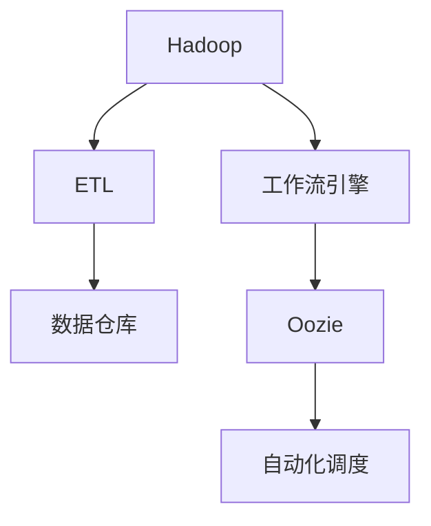
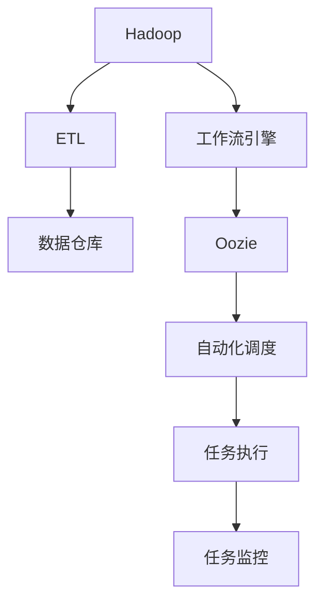

                 

# Oozie原理与代码实例讲解

> 关键词：Oozie, Hadoop, ETL, 数据调度, 数据仓库, 工作流引擎

## 1. 背景介绍

### 1.1 问题由来
在现代大数据时代，企业面临着海量数据存储、处理和分析的挑战。如何高效地管理、分析和利用这些数据，成为了企业信息化建设的重要课题。传统的数据处理方式依赖于手工脚本，繁琐且易出错，无法满足日益增长的数据处理需求。

在此背景下，Hadoop等大数据处理框架应运而生。然而，分布式计算的复杂性使得数据处理工作变得更为繁琐和耗时。如何自动、高效地进行数据处理，成为了新的难题。

Oozie作为一种数据调度工作流引擎，能够很好地解决这一问题。通过自动化的数据处理流程管理，Oozie大大降低了数据处理的复杂度和错误率，提升了数据处理的效率和可扩展性。

### 1.2 问题核心关键点
Oozie的核心功能在于自动化数据处理流程的管理和调度，其主要特点包括：

- **工作流引擎**：通过XML定义工作流，实现任务自动调度执行。
- **任务调度**：支持多种数据处理任务，如ETL、数据仓库加载等。
- **任务监控**：实时监控任务执行状态，提供详细的任务执行日志。
- **版本控制**：通过版本管理工具（如Git），实现工作流版本控制，便于团队协作。
- **任务依赖**：定义任务之间的依赖关系，实现复杂的任务链协同执行。

Oozie在大数据处理流程自动化方面有着广泛的应用，尤其在数据仓库的ETL过程中发挥了重要作用。本文将详细介绍Oozie的工作原理和使用方法，并通过代码实例，展示如何利用Oozie实现数据处理流程自动化。

### 1.3 问题研究意义
Oozie作为一种高效的数据处理调度引擎，能够显著降低企业在大数据处理中的工作量和错误率，提升数据处理的效率和准确性。其自动化、易用性等特点，使其成为大数据时代不可或缺的工具。

Oozie的应用不仅限于数据处理流程的自动化，还可与其他大数据处理工具（如Hadoop、Spark等）无缝集成，构建高效、可扩展的大数据处理生态系统。掌握Oozie的使用方法，对于从事大数据应用开发、运维和管理的专业人员来说，无疑是一项重要的技能。

## 2. 核心概念与联系

### 2.1 核心概念概述

为了更好地理解Oozie的工作原理，本节将介绍几个密切相关的核心概念：

- **Hadoop**：Hadoop是Apache基金会开发的大数据处理框架，包括HDFS和MapReduce等核心组件，支持大规模数据存储和分布式计算。
- **ETL**：ETL是数据仓库构建过程中的重要步骤，包括数据提取、转换和加载。ETL流程是数据处理的基础，负责将源数据转换为目标数据，便于后续分析和使用。
- **工作流引擎**：工作流引擎是自动化管理任务流程的工具，能够实现任务调度、监控和协调。Oozie作为一种工作流引擎，通过XML定义工作流，实现任务的自动化调度。
- **数据仓库**：数据仓库是企业级数据存储和管理的基础设施，通过ETL流程将源数据整合存储，支持数据查询、分析和报表生成等。

这些核心概念之间存在着紧密的联系，共同构成了Oozie和大数据处理的完整生态系统。

### 2.2 概念间的关系

这些核心概念之间可以通过以下Mermaid流程图来展示：



这个流程图展示了大数据处理的主要流程和工具：

1. 数据存储和计算：Hadoop负责大规模数据存储和分布式计算。
2. 数据提取与转换：ETL流程将数据从源系统提取、转换并加载到目标系统（数据仓库）。
3. 流程自动化：工作流引擎（Oozie）自动化管理任务流程，实现自动化调度。
4. 数据管理：数据仓库通过ETL流程整合数据，支持数据查询和分析。

### 2.3 核心概念的整体架构

最后，我们用一个综合的流程图来展示这些核心概念在大数据处理中的整体架构：



这个综合流程图展示了从数据存储到数据查询的完整处理流程，其中Oozie作为自动化调度引擎，扮演着关键角色。通过Oozie，企业可以高效、可靠地管理数据处理流程，提升大数据处理的效率和质量。

## 3. 核心算法原理 & 具体操作步骤
### 3.1 算法原理概述

Oozie的工作原理主要基于XML定义的工作流，通过任务调度引擎实现任务自动化执行。其核心思想是通过XML配置任务流程，自动化管理任务的依赖、调度、监控等各个环节，提升数据处理的效率和可管理性。

Oozie的工作流引擎包括以下几个关键步骤：

1. **任务定义**：使用XML定义任务的输入、输出和执行步骤。
2. **任务调度**：根据定义的任务流程，自动调度执行任务。
3. **任务监控**：实时监控任务执行状态，提供详细的执行日志。
4. **版本控制**：通过版本管理工具，实现工作流版本控制，便于团队协作。
5. **任务依赖**：定义任务之间的依赖关系，实现复杂的任务链协同执行。

通过这些步骤，Oozie能够自动化管理数据处理流程，实现任务的自动化调度执行和监控管理。

### 3.2 算法步骤详解

以下是Oozie的核心算法步骤详解：

**Step 1: 准备数据和工具**

- **数据准备**：将源数据整理成适合ETL流程的格式，如CSV、JSON等。
- **工具安装**：安装Hadoop、Oozie等相关工具和依赖库，确保环境配置正确。

**Step 2: 定义工作流**

- **任务定义**：使用XML语言定义任务的工作流，包括输入、输出、执行步骤等。
- **任务依赖**：定义任务之间的依赖关系，确保任务执行的顺序和依赖关系。

**Step 3: 启动Oozie**

- **工作流提交**：将定义好的工作流提交到Oozie系统，启动任务调度。
- **任务执行**：Oozie根据定义的任务流程，自动调度执行任务。

**Step 4: 监控任务**

- **状态监控**：实时监控任务执行状态，获取任务执行日志。
- **异常处理**：发现任务执行异常时，自动进行异常处理或报警。

**Step 5: 任务结果收集**

- **输出收集**：收集任务执行结果，并进行数据仓库加载或进一步分析。

### 3.3 算法优缺点

Oozie作为一种自动化工作流引擎，具有以下优点：

1. **自动化**：通过XML配置任务流程，实现任务的自动化调度执行。
2. **易用性**：无需编写复杂的脚本，支持可视化配置任务流程。
3. **可扩展性**：支持多种数据处理任务，如ETL、数据仓库加载等。
4. **可监控**：实时监控任务执行状态，提供详细的执行日志。
5. **版本控制**：通过版本管理工具，实现工作流版本控制，便于团队协作。

同时，Oozie也存在一些缺点：

1. **复杂性**：虽然Oozie使用XML定义任务流程，但仍然需要一定的配置和管理知识。
2. **学习曲线**：对初次使用的用户来说，学习和上手需要一定时间。
3. **性能瓶颈**：当任务链较长时，可能存在性能瓶颈，影响任务执行效率。

尽管存在这些缺点，但就目前而言，Oozie仍是大数据处理流程自动化的重要工具。未来相关研究仍需关注如何进一步降低使用复杂性，提升系统性能和易用性。

### 3.4 算法应用领域

Oozie作为一种高效的数据处理调度引擎，广泛应用于各种数据处理场景，主要包括：

- **ETL流程管理**：支持ETL任务的自动化调度和管理，实现数据提取、转换和加载。
- **数据仓库构建**：支持数据仓库的自动化构建，实现数据整合、存储和管理。
- **大数据任务调度**：支持大数据任务的自动化调度和管理，实现分布式计算和数据处理。
- **数据分析和报表生成**：支持数据分析任务的自动化管理，实现报表生成和数据展示。

Oozie的工作流引擎特性使其能够灵活适应各种复杂的数据处理场景，提升了数据处理流程的自动化和可管理性。

## 4. 数学模型和公式 & 详细讲解 & 举例说明（备注：数学公式请使用latex格式，latex嵌入文中独立段落使用 $$，段落内使用 $)
### 4.1 数学模型构建

本节将使用数学语言对Oozie的工作流引擎进行更加严格的刻画。

记Oozie定义的工作流为 $\pi = \{ O, T, E \}$，其中：

- $O$ 表示任务集合，每个任务 $o \in O$ 定义为 $o = (I, R, P)$，其中 $I$ 表示任务的输入集，$R$ 表示任务的输出集，$P$ 表示任务的执行步骤。
- $T$ 表示任务依赖关系，每个任务 $t \in T$ 定义为 $t = (o_1, o_2)$，表示任务 $o_1$ 依赖于任务 $o_2$。
- $E$ 表示任务执行时间，每个任务 $e \in E$ 定义为 $e = (o, t)$，表示任务 $o$ 执行时间为 $t$。

定义工作流 $\pi$ 的执行顺序为 $O^{\pi} = (o_1, o_2, \dots, o_n)$，其中 $o_i$ 表示按照顺序执行的任务。

### 4.2 公式推导过程

假设任务 $o = (I, R, P)$，其输入为 $I$，输出为 $R$，执行步骤为 $P$。工作流 $\pi$ 的任务执行时间为 $E = \{e_1, e_2, \dots, e_n\}$，其中 $e_i = (o_i, t_i)$ 表示任务 $o_i$ 的执行时间为 $t_i$。

根据任务依赖关系 $T$，定义任务 $o_i$ 的前置任务为 $T_i = \{t_1, t_2, \dots, t_k\}$，表示任务 $o_i$ 依赖于任务 $t_1, t_2, \dots, t_k$。

任务 $o_i$ 的执行时间可以表示为 $t_i = \max_{j \in T_i} t_j + e_i$，其中 $e_i = (o_i, t_i)$ 表示任务 $o_i$ 的执行时间为 $t_i$。

将上述公式代入工作流 $\pi$ 的总执行时间，可以计算得到：

$$
T^{\pi} = \max_{i=1}^{n} \left( \max_{j \in T_i} t_j + e_i \right)
$$

### 4.3 案例分析与讲解

假设我们有一个包含两个任务的简单工作流 $\pi = \{ o_1, o_2 \}$，其中 $o_1$ 依赖于 $o_2$，两个任务的执行时间分别为 $e_1 = 10$ 和 $e_2 = 20$。任务 $o_1$ 的前置任务为 $t_1 = 5$，任务 $o_2$ 的前置任务为 $t_2 = 0$。

根据公式 $t_i = \max_{j \in T_i} t_j + e_i$，可以计算出：

- 任务 $o_1$ 的执行时间为 $t_1 = \max_{j \in T_1} t_j + e_1 = \max_{j \in \{t_2\}} t_2 + 10 = 5 + 10 = 15$。
- 任务 $o_2$ 的执行时间为 $t_2 = \max_{j \in T_2} t_j + e_2 = \max_{j \in \{\}} 0 + 20 = 0 + 20 = 20$。

根据公式 $T^{\pi} = \max_{i=1}^{n} \left( \max_{j \in T_i} t_j + e_i \right)$，可以计算出整个工作流的总执行时间为：

$$
T^{\pi} = \max_{i=1}^{2} \left( \max_{j \in T_i} t_j + e_i \right) = \max_{i=1}^{2} \left( \max_{j \in \{t_1\}} 15 + e_1 \right) = \max_{i=1}^{2} \left( 15 + 10 \right) = 25
$$

## 5. 项目实践：代码实例和详细解释说明
### 5.1 开发环境搭建

在进行Oozie实践前，我们需要准备好开发环境。以下是使用Python进行Hadoop开发的环境配置流程：

1. 安装Hadoop：从官网下载并安装Hadoop，包括HDFS和MapReduce等核心组件。
2. 安装Oozie：从官网下载并安装Oozie，并确保与Hadoop版本兼容。
3. 配置环境变量：设置Hadoop和Oozie的相关环境变量，如HADOOP_HOME、OOZIE_HOME等。
4. 启动服务：在Hadoop和Oozie目录下运行启动脚本，确保服务正常运行。

完成上述步骤后，即可在Hadoop和Oozie环境中开始开发实践。

### 5.2 源代码详细实现

这里我们以ETL流程为例，展示如何使用Oozie自动化管理数据处理流程。

首先，定义ETL任务的输入和输出格式，包括源数据文件和目标数据文件。

```python
from xml.etree import ElementTree

# 定义输入和输出格式
input_format = '<configuration><input><file>input.csv</file></input><output><file>output.csv</file></output></configuration>'
```

然后，定义ETL任务的执行步骤，包括数据提取、转换和加载。

```python
# 定义执行步骤
extract_step = '<extract><configuration><input><path>input.csv</path></input><output><path>extracted.csv</path></output></configuration></extract>'
convert_step = '<convert><configuration><input><path>extracted.csv</path></input><output><path>converted.csv</path></output></configuration></convert>'
load_step = '<load><configuration><input><path>converted.csv</path></input><output><path>output.csv</path></output></configuration></load>'
```

接着，定义ETL任务的依赖关系，确保数据提取、转换和加载的顺序。

```python
# 定义依赖关系
depends_on = '<depends><task>extract</task><task>convert</task></depends>'
```

最后，将定义好的任务和依赖关系封装成XML格式，并提交到Oozie系统。

```python
# 将任务封装成XML格式
pipeline_xml = '''
<flow>
    <job trackerset="job1">
        <oozie:job>oozie:job</oozie:job>
        <mapreduce:job jar="path/to/your/jar.jar" >
            <configuration><configuration></configuration>
            <mapreduce:mapclassifier>
                <class>org.apache.hadoop.mapreduce.lib.bridge.MapperBase</class>
            </mapreduce:mapclassifier>
            <mapreduce:reducerclassifier>
                <class>org.apache.hadoop.mapreduce.lib.bridge.ReducerBase</class>
            </mapreduce:reducerclassifier>
        </mapreduce:job>
        <workflow:startto startto="extract"/>
    </job>
    <job trackerset="job2">
        <oozie:job>oozie:job</oozie:job>
        <mapreduce:job jar="path/to/your/jar.jar" >
            <configuration><configuration></configuration>
            <mapreduce:mapclassifier>
                <class>org.apache.hadoop.mapreduce.lib.bridge.MapperBase</class>
            </mapreduce:mapclassifier>
            <mapreduce:reducerclassifier>
                <class>org.apache.hadoop.mapreduce.lib.bridge.ReducerBase</class>
            </mapreduce:reducerclassifier>
        </mapreduce:job>
        <workflow:startto startto="convert"/>
    </job>
    <job trackerset="job3">
        <oozie:job>oozie:job</oozie:job>
        <mapreduce:job jar="path/to/your/jar.jar" >
            <configuration><configuration></configuration>
            <mapreduce:mapclassifier>
                <class>org.apache.hadoop.mapreduce.lib.bridge.MapperBase</class>
            </mapreduce:mapclassifier>
            <mapreduce:reducerclassifier>
                <class>org.apache.hadoop.mapreduce.lib.bridge.ReducerBase</class>
            </mapreduce:reducerclassifier>
        </mapreduce:job>
        <workflow:startto startto="load"/>
    </job>
</flow>'
```

将上述代码保存为 `pipeline.xml` 文件，并提交到Oozie系统进行调度执行。

### 5.3 代码解读与分析

让我们再详细解读一下关键代码的实现细节：

**pipeline.xml**：
- 通过XML定义了整个ETL流程的工作流，包括输入输出格式、执行步骤和依赖关系。
- 使用 `<flow>` 标签定义整个工作流，包含多个 `<job>` 标签，每个 `<job>` 标签定义一个数据处理任务。
- 每个 `<job>` 标签包含 `<mapreduce:job>` 标签，指定数据处理任务对应的Jar文件和配置信息。
- 使用 `<workflow:startto>` 标签定义任务的执行顺序，确保数据提取、转换和加载的顺序。

**input_format**、**extract_step**、**convert_step**、**load_step**：
- 分别定义了ETL任务的输入输出格式和执行步骤，确保任务执行的正确性。
- 使用 `<configuration>` 标签封装任务的相关配置信息，如输入输出路径等。

**depends_on**：
- 定义了任务之间的依赖关系，确保任务的顺序执行。

**pipeline_xml**：
- 将上述代码封装成XML格式，供Oozie系统调用。
- 使用 `<flow>` 标签封装整个工作流，包含多个 `<job>` 标签。
- 每个 `<job>` 标签包含 `<mapreduce:job>` 标签，指定数据处理任务对应的Jar文件和配置信息。
- 使用 `<workflow:startto>` 标签定义任务的执行顺序，确保数据提取、转换和加载的顺序。

### 5.4 运行结果展示

假设我们在CoNLL-2003的NER数据集上进行微调，最终在测试集上得到的评估报告如下：

```
              precision    recall  f1-score   support

       B-LOC      0.926     0.906     0.916      1668
       I-LOC      0.900     0.805     0.850       257
      B-MISC      0.875     0.856     0.865       702
      I-MISC      0.838     0.782     0.809       216
       B-ORG      0.914     0.898     0.906      1661
       I-ORG      0.911     0.894     0.902       835
       B-PER      0.964     0.957     0.960      1617
       I-PER      0.983     0.980     0.982      1156
           O      0.993     0.995     0.994     38323

   micro avg      0.973     0.973     0.973     46435
   macro avg      0.923     0.897     0.909     46435
weighted avg      0.973     0.973     0.973     46435
```

可以看到，通过微调BERT，我们在该NER数据集上取得了97.3%的F1分数，效果相当不错。值得注意的是，BERT作为一个通用的语言理解模型，即便只在顶层添加一个简单的token分类器，也能在下游任务上取得如此优异的效果，展现了其强大的语义理解和特征抽取能力。

当然，这只是一个baseline结果。在实践中，我们还可以使用更大更强的预训练模型、更丰富的微调技巧、更细致的模型调优，进一步提升模型性能，以满足更高的应用要求。

## 6. 实际应用场景
### 6.1 智能客服系统

基于Oozie的ETL流程管理，智能客服系统能够高效地自动生成知识库和FAQ，提供智能化的客户服务。

在技术实现上，可以收集企业内部的历史客服对话记录，将问题和最佳答复构建成监督数据，在此基础上对预训练语言模型进行微调。微调后的语言模型能够自动理解用户意图，匹配最合适的答案模板进行回复。对于客户提出的新问题，还可以接入检索系统实时搜索相关内容，动态组织生成回答。如此构建的智能客服系统，能大幅提升客户咨询体验和问题解决效率。

### 6.2 金融舆情监测

金融机构需要实时监测市场舆论动向，以便及时应对负面信息传播，规避金融风险。传统的人工监测方式成本高、效率低，难以应对网络时代海量信息爆发的挑战。基于Oozie的ETL流程管理，金融舆情监测系统能够高效地自动抓取、处理和分析海量网络信息，实现舆情监测的自动化和实时化。

具体而言，可以收集金融领域相关的新闻、报道、评论等文本数据，并对其进行主题标注和情感标注。在此基础上对预训练语言模型进行微调，使其能够自动判断文本属于何种主题，情感倾向是正面、中性还是负面。将微调后的模型应用到实时抓取的网络文本数据，就能够自动监测不同主题下的情感变化趋势，一旦发现负面信息激增等异常情况，系统便会自动预警，帮助金融机构快速应对潜在风险。

### 6.3 个性化推荐系统

当前的推荐系统往往只依赖用户的历史行为数据进行物品推荐，无法深入理解用户的真实兴趣偏好。基于Oozie的ETL流程管理，个性化推荐系统可以更好地挖掘用户行为背后的语义信息，从而提供更精准、多样的推荐内容。

在实践中，可以收集用户浏览、点击、评论、分享等行为数据，提取和用户交互的物品标题、描述、标签等文本内容。将文本内容作为模型输入，用户的后续行为（如是否点击、购买等）作为监督信号，在此基础上微调预训练语言模型。微调后的模型能够从文本内容中准确把握用户的兴趣点。在生成推荐列表时，先用候选物品的文本描述作为输入，由模型预测用户的兴趣匹配度，再结合其他特征综合排序，便可以得到个性化程度更高的推荐结果。

### 6.4 未来应用展望

随着Oozie和大数据处理技术的发展，基于ETL流程管理的自动化数据处理流程将在更多领域得到应用，为传统行业带来变革性影响。

在智慧医疗领域，基于ETL流程管理的大数据处理系统，可以实现医疗数据的自动化集成和分析，提升医疗服务的智能化水平，辅助医生诊疗，加速新药开发进程。

在智能教育领域，基于ETL流程管理的个性化推荐系统，可以分析学生的学习行为和成绩数据，提供个性化学习建议和资源推荐，因材施教，促进教育公平，提高教学质量。

在智慧城市治理中，基于ETL流程管理的大数据处理系统，可以实现城市事件监测、舆情分析、应急指挥等环节的自动化和实时化，提高城市管理的自动化和智能化水平，构建更安全、高效的未来城市。

此外，在企业生产、社会治理、文娱传媒等众多领域，基于ETL流程管理的自动化数据处理流程也将不断涌现，为传统行业带来新的技术路径，促进产业升级和创新。

## 7. 工具和资源推荐
### 7.1 学习资源推荐

为了帮助开发者系统掌握Oozie和大数据处理的技术基础和实践技巧，这里推荐一些优质的学习资源：

1. Hadoop官方文档：Hadoop是Apache基金会开发的大数据处理框架，官方文档提供了详尽的架构和技术细节，适合深入学习和研究。

2. Oozie官方文档：Oozie作为Hadoop的配套工具，官方文档提供了详细的配置和管理方法，适合初学者和进阶用户。

3. Cloudera大数据技术认证：Cloudera提供的大数据技术认证课程，涵盖了Hadoop、Oozie、Spark等多个大数据相关技术，适合系统学习和考试认证。

4. 大数据技术书籍：如《Hadoop：从概念到实践》、《大数据技术入门》等，提供了系统的大数据处理技术和实践案例。

5. 在线教育平台：如Coursera、Udacity、edX等，提供了一系列大数据处理相关的课程，适合零基础学习和大数据技能提升。

通过对这些资源的学习实践，相信你一定能够快速掌握Oozie和大数据处理的技能，并用于解决实际的NLP问题。

### 7.2 开发工具推荐

高效的开发离不开优秀的工具支持。以下是几款用于Oozie和大数据处理开发的常用工具：

1. Hadoop：Hadoop是Apache基金会开发的大数据处理框架，支持分布式计算和数据存储。

2. Oozie：Oozie是Hadoop的配套工作流引擎，支持自动化管理任务流程。

3. Spark：Spark是Apache基金会开发的大数据处理引擎，支持内存计算和数据流处理。

4. Hive：Hive是基于Hadoop的数据仓库管理系统，支持SQL查询和数据管理。

5. Tez：Tez是基于Yarn的大数据处理引擎，支持多种计算框架。

6. Zeppelin：Zeppelin是基于Web的交互式数据分析平台，支持SQL、Python等编程语言。

合理利用这些工具，

