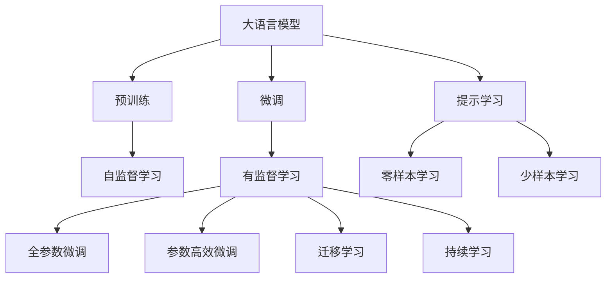
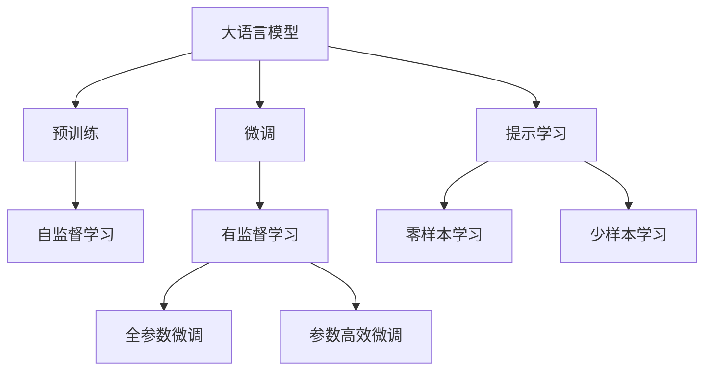
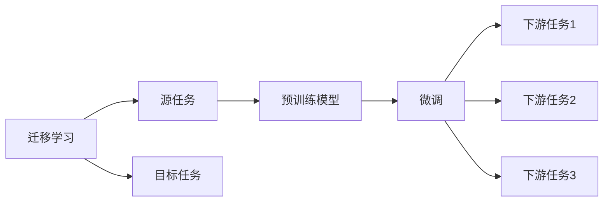
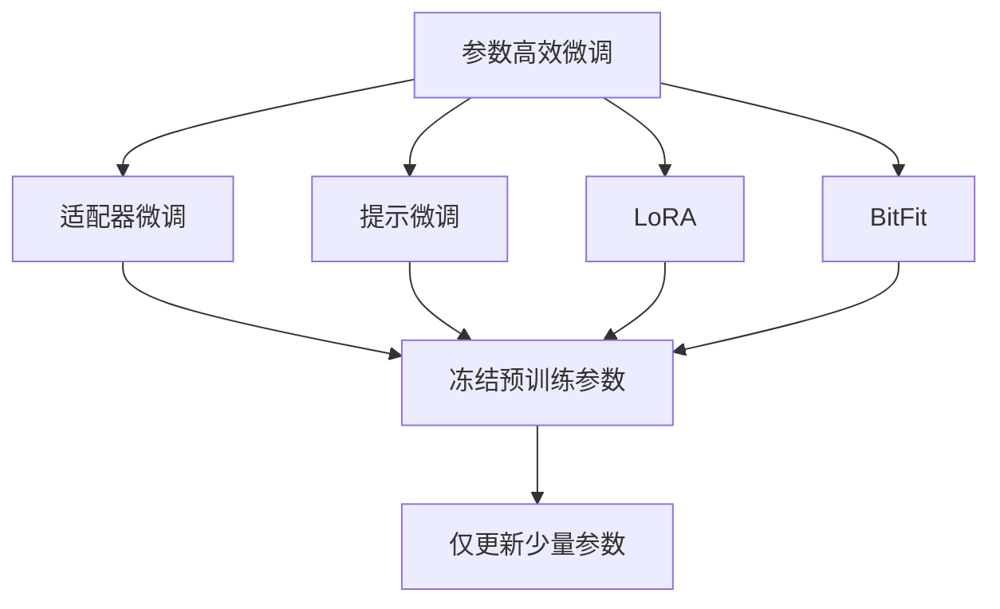
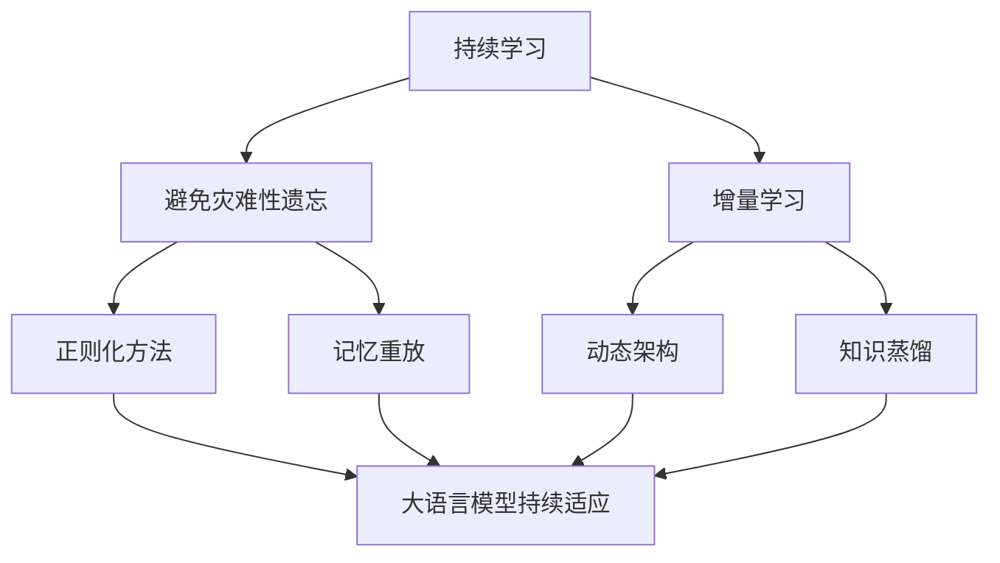
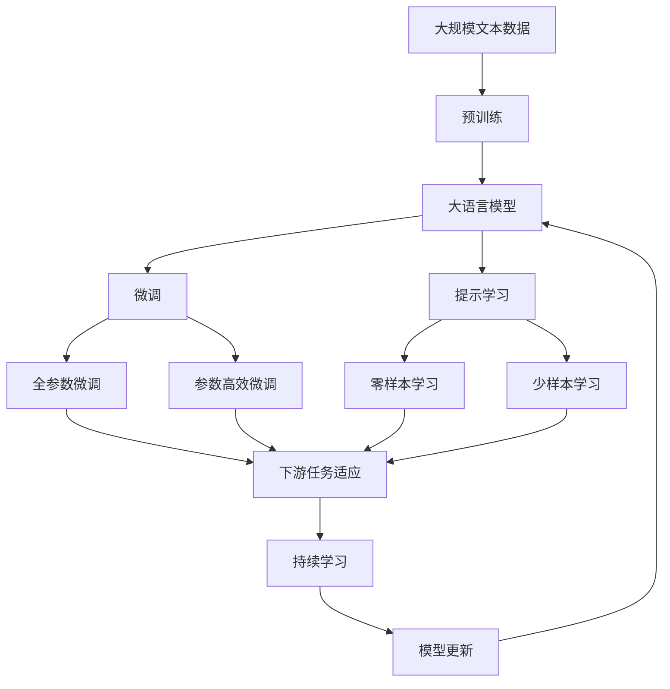

                 

# Open LLM Leaderboard(大模型天梯榜)

## 1. 背景介绍

随着深度学习技术的快速演进，大规模预训练语言模型（Large Language Models，简称LLMs）已成为自然语言处理（Natural Language Processing，简称NLP）领域的关键技术。这些模型通过在大量无标注文本数据上进行自监督预训练，获得了强大的语言理解能力和生成能力，广泛应用于问答、翻译、摘要、生成等众多NLP任务。

然而，如何评估和比较不同大模型的性能，成为了学术界和工业界共同关注的问题。OpenAI在2022年推出了Open LLM Leaderboard（简称Open LLM天梯榜），用于公开不同大模型在NLP任务上的表现，为学术研究和工业应用提供参考。Open LLM天梯榜展示了目前性能最优越的几种大模型，包括GPT-3、GPT-4、ChatGPT、PaLM等，这些模型在多个经典NLP任务上取得了令人瞩目的成绩。

## 2. 核心概念与联系

### 2.1 核心概念概述

为了更好地理解Open LLM天梯榜及其背后的核心概念，本节将介绍几个密切相关的核心概念：

- **大语言模型 (Large Language Model, LLM)**：以自回归模型（如GPT系列）或自编码模型（如BERT、T5）为代表的大规模预训练语言模型。通过在大规模无标签文本数据上进行预训练，学习通用的语言表示，具备强大的语言理解和生成能力。

- **预训练 (Pre-training)**：指在大规模无标签文本语料上，通过自监督学习任务训练通用语言模型的过程。常见的预训练任务包括掩码语言模型、下位语言模型等。预训练使得模型学习到语言的通用表示。

- **微调 (Fine-tuning)**：指在预训练模型的基础上，使用下游任务的少量标注数据，通过有监督学习优化模型在特定任务上的性能。通常只需要调整顶层分类器或解码器，并以较小的学习率更新全部或部分的模型参数。

- **迁移学习 (Transfer Learning)**：指将一个领域学习到的知识，迁移应用到另一个不同但相关的领域的学习范式。大模型的预训练-微调过程即是一种典型的迁移学习方式。

- **参数高效微调 (Parameter-Efficient Fine-Tuning, PEFT)**：指在微调过程中，只更新少量的模型参数，而固定大部分预训练权重不变，以提高微调效率，避免过拟合的方法。

- **提示学习 (Prompt Learning)**：通过在输入文本中添加提示模板，引导大语言模型进行特定任务的推理和生成。可以在不更新模型参数的情况下，实现零样本或少样本学习。

- **少样本学习 (Few-shot Learning)**：指在只有少量标注样本的情况下，模型能够快速适应新任务的学习方法。在大语言模型中，通常通过在输入中提供少量示例来实现，无需更新模型参数。

- **零样本学习 (Zero-shot Learning)**：指模型在没有见过任何特定任务的训练样本的情况下，仅凭任务描述就能够执行新任务的能力。大语言模型通过预训练获得的广泛知识，使其能够理解任务指令并生成相应输出。

- **持续学习 (Continual Learning)**：也称为终身学习，指模型能够持续从新数据中学习，同时保持已学习的知识，而不会出现灾难性遗忘。这对于保持大语言模型的时效性和适应性至关重要。

这些核心概念之间的逻辑关系可以通过以下Mermaid流程图来展示：



这个流程图展示了大语言模型的核心概念及其之间的关系：

1. 大语言模型通过预训练获得基础能力。
2. 微调是对预训练模型进行任务特定的优化，可以分为全参数微调和参数高效微调（PEFT）。
3. 提示学习是一种不更新模型参数的方法，可以实现少样本学习和零样本学习。
4. 迁移学习是连接预训练模型与下游任务的桥梁，可以通过微调或提示学习来实现。
5. 持续学习旨在使模型能够不断学习新知识，同时避免遗忘旧知识。

这些概念共同构成了大语言模型的学习和应用框架，使其能够在各种场景下发挥强大的语言理解和生成能力。通过理解这些核心概念，我们可以更好地把握大语言模型的工作原理和优化方向。

### 2.2 概念间的关系

这些核心概念之间存在着紧密的联系，形成了大语言模型微调的完整生态系统。下面我通过几个Mermaid流程图来展示这些概念之间的关系。

#### 2.2.1 大语言模型的学习范式



这个流程图展示了大语言模型的三种主要学习范式：预训练、微调和提示学习。预训练主要采用自监督学习方法，而微调则是有监督学习的过程。提示学习可以实现零样本和少样本学习。微调又可以分为全参数微调和参数高效微调两种方式。

#### 2.2.2 迁移学习与微调的关系



这个流程图展示了迁移学习的基本原理，以及它与微调的关系。迁移学习涉及源任务和目标任务，预训练模型在源任务上学习，然后通过微调适应各种下游任务（目标任务）。

#### 2.2.3 参数高效微调方法



这个流程图展示了几种常见的参数高效微调方法，包括适配器微调、提示微调、LoRA和BitFit。这些方法的共同特点是冻结大部分预训练参数，只更新少量参数，从而提高微调效率。

#### 2.2.4 持续学习在大语言模型中的应用



这个流程图展示了持续学习在大语言模型中的应用。持续学习的主要目标是避免灾难性遗忘和实现增量学习。通过正则化方法、记忆重放、动态架构和知识蒸馏等技术，可以使大语言模型持续适应新的任务和数据。

### 2.3 核心概念的整体架构

最后，我们用一个综合的流程图来展示这些核心概念在大语言模型微调过程中的整体架构：



这个综合流程图展示了从预训练到微调，再到持续学习的完整过程。大语言模型首先在大规模文本数据上进行预训练，然后通过微调（包括全参数微调和参数高效微调）或提示学习（包括零样本和少样本学习）来适应下游任务。最后，通过持续学习技术，模型可以不断更新和适应新的任务和数据。 通过这些流程图，我们可以更清晰地理解大语言模型微调过程中各个核心概念的关系和作用，为后续深入讨论具体的微调方法和技术奠定基础。

## 3. 核心算法原理 & 具体操作步骤
### 3.1 算法原理概述

Open LLM天梯榜展示了当前性能最优越的几种大语言模型在多项NLP任务上的表现。这些模型在微调过程中采用了不同的策略和方法，但共同的核心思想是：

1. **选择合适的预训练模型**：以自回归模型（如GPT-3、GPT-4）或自编码模型（如BERT、T5）为代表的大规模预训练语言模型，通过在大规模无标签文本数据上进行预训练，学习到丰富的语言知识和常识。

2. **添加任务适配层**：根据任务类型，在预训练模型顶层设计合适的输出层和损失函数。例如，对于分类任务，通常在顶层添加线性分类器和交叉熵损失函数。

3. **微调模型**：在预训练模型的基础上，使用下游任务的少量标注数据，通过有监督学习优化模型在特定任务上的性能。通常只需要调整顶层分类器或解码器，并以较小的学习率更新全部或部分的模型参数。

4. **参数高效微调**：在微调过程中，只更新少量的模型参数，而固定大部分预训练权重不变，以提高微调效率，避免过拟合。

5. **提示学习**：通过在输入文本中添加提示模板，引导大语言模型进行特定任务的推理和生成。可以在不更新模型参数的情况下，实现零样本或少样本学习。

6. **少样本学习**：在只有少量标注样本的情况下，模型能够快速适应新任务的学习方法。在大语言模型中，通常通过在输入中提供少量示例来实现，无需更新模型参数。

7. **零样本学习**：模型在没有见过任何特定任务的训练样本的情况下，仅凭任务描述就能够执行新任务的能力。大语言模型通过预训练获得的广泛知识，使其能够理解任务指令并生成相应输出。

8. **持续学习**：使模型能够持续从新数据中学习，同时保持已学习的知识，而不会出现灾难性遗忘。这对于保持大语言模型的时效性和适应性至关重要。

这些算法和技巧相互结合，构成了大语言模型微调的核心算法原理。通过不断迭代和优化，这些模型在多项NLP任务上取得了优异的表现。

### 3.2 算法步骤详解

Open LLM天梯榜展示了几种大语言模型在多项NLP任务上的微调过程。以下是这些过程的详细步骤：

#### 3.2.1 GPT-3的微调过程

1. **数据准备**：收集目标任务的数据集，进行预处理和标注。例如，对于问答任务，需要准备问题和对应的答案。

2. **模型加载和适配**：加载GPT-3模型，并根据任务类型添加适配层。例如，对于分类任务，添加线性分类器；对于生成任务，添加解码器。

3. **超参数设置**：选择合适的学习率、批大小、迭代轮数等超参数，设置正则化技术和冻结预训练参数的策略。

4. **微调训练**：将数据集分为训练集和验证集，在训练集上进行有监督的微调训练。在每个epoch结束时，在验证集上评估模型性能。

5. **保存模型**：在微调完成后，保存训练好的模型参数。

6. **测试和部署**：在测试集上评估微调后的模型，集成到实际的应用系统中，部署到服务器上供用户使用。

#### 3.2.2 GPT-4的微调过程

1. **数据准备**：与GPT-3类似，收集目标任务的数据集，进行预处理和标注。

2. **模型加载和适配**：加载GPT-4模型，并根据任务类型添加适配层。例如，对于分类任务，添加线性分类器；对于生成任务，添加解码器。

3. **超参数设置**：与GPT-3类似，选择合适的学习率、批大小、迭代轮数等超参数，设置正则化技术和冻结预训练参数的策略。

4. **微调训练**：与GPT-3类似，将数据集分为训练集和验证集，在训练集上进行有监督的微调训练。在每个epoch结束时，在验证集上评估模型性能。

5. **参数高效微调**：与GPT-3不同，GPT-4采用了参数高效微调的方法，仅更新少量的模型参数，而固定大部分预训练权重不变。

6. **提示学习**：与GPT-3不同，GPT-4采用提示学习的方法，通过精心设计输入文本的格式，引导模型按期望方式输出，减少微调参数。

7. **少样本学习**：与GPT-3类似，GPT-4在输入中提供少量示例，实现少样本学习。

8. **持续学习**：与GPT-3类似，GPT-4使模型能够持续从新数据中学习，同时保持已学习的知识。

9. **测试和部署**：与GPT-3类似，GPT-4在测试集上评估微调后的模型，集成到实际的应用系统中，部署到服务器上供用户使用。

#### 3.2.3 ChatGPT的微调过程

1. **数据准备**：与GPT-3类似，收集目标任务的数据集，进行预处理和标注。

2. **模型加载和适配**：加载ChatGPT模型，并根据任务类型添加适配层。例如，对于对话任务，添加对话生成器。

3. **超参数设置**：与GPT-3类似，选择合适的学习率、批大小、迭代轮数等超参数，设置正则化技术和冻结预训练参数的策略。

4. **微调训练**：与GPT-3类似，将数据集分为训练集和验证集，在训练集上进行有监督的微调训练。在每个epoch结束时，在验证集上评估模型性能。

5. **提示学习**：与GPT-3类似，ChatGPT采用提示学习的方法，通过精心设计输入文本的格式，引导模型按期望方式输出，减少微调参数。

6. **少样本学习**：与GPT-3类似，ChatGPT在输入中提供少量示例，实现少样本学习。

7. **持续学习**：与GPT-3类似，ChatGPT使模型能够持续从新数据中学习，同时保持已学习的知识。

8. **测试和部署**：与GPT-3类似，ChatGPT在测试集上评估微调后的模型，集成到实际的应用系统中，部署到服务器上供用户使用。

#### 3.2.4 PaLM的微调过程

1. **数据准备**：与GPT-3类似，收集目标任务的数据集，进行预处理和标注。

2. **模型加载和适配**：加载PaLM模型，并根据任务类型添加适配层。例如，对于分类任务，添加线性分类器；对于生成任务，添加解码器。

3. **超参数设置**：与GPT-3类似，选择合适的学习率、批大小、迭代轮数等超参数，设置正则化技术和冻结预训练参数的策略。

4. **微调训练**：与GPT-3类似，将数据集分为训练集和验证集，在训练集上进行有监督的微调训练。在每个epoch结束时，在验证集上评估模型性能。

5. **参数高效微调**：与GPT-3类似，PaLM采用了参数高效微调的方法，仅更新少量的模型参数，而固定大部分预训练权重不变。

6. **少样本学习**：与GPT-3类似，PaLM在输入中提供少量示例，实现少样本学习。

7. **持续学习**：与GPT-3类似，PaLM使模型能够持续从新数据中学习，同时保持已学习的知识。

8. **测试和部署**：与GPT-3类似，PaLM在测试集上评估微调后的模型，集成到实际的应用系统中，部署到服务器上供用户使用。

### 3.3 算法优缺点

Open LLM天梯榜展示了当前性能最优越的几种大语言模型在多项NLP任务上的表现，这些模型在微调过程中采用了不同的策略和方法，但共同的核心思想是：

**优点**：
1. **简单高效**：相比从头训练，微调方法使用少量标注数据，即可对预训练模型进行快速适配，获得较大的性能提升。
2. **通用适用**：适用于各种NLP下游任务，包括分类、匹配、生成等，设计简单的任务适配层即可实现微调。
3. **参数高效**：利用参数高效微调技术，在固定大部分预训练参数的情况下，仍可取得不错的提升。
4. **效果显著**：在学术界和工业界的诸多任务上，基于微调的方法已经刷新了最先进的性能指标。

**缺点**：
1. **依赖标注数据**：微调的效果很大程度上取决于标注数据的质量和数量，获取高质量标注数据的成本较高。
2. **迁移能力有限**：当目标任务与预训练数据的分布差异较大时，微调的性能提升有限。
3. **负面效果传递**：预训练模型的固有偏见、有害信息等，可能通过微调传递到下游任务，造成负面影响。
4. **可解释性不足**：微调模型的决策过程通常缺乏可解释性，难以对其推理逻辑进行分析和调试。

尽管存在这些局限性，但就目前而言，基于监督学习的微调方法仍是大语言模型应用的最主流范式。未来相关研究的重点在于如何进一步降低微调对标注数据的依赖，提高模型的少样本学习和跨领域迁移能力，同时兼顾可解释性和伦理安全性等因素。

### 3.4 算法应用领域

Open LLM天梯榜展示了当前性能最优越的几种大语言模型在多项NLP任务上的表现。这些模型已经在多个行业领域得到了广泛应用，例如：

- **问答系统**：对自然语言问题给出答案。将问题-答案对作为微调数据，训练模型学习匹配答案。
- **命名实体识别**：识别文本中的人名、地名、机构名等特定实体。通过微调使模型掌握实体边界和类型。
- **关系抽取**：从文本中抽取实体之间的语义关系。通过微调使模型学习实体-关系三元组。
- **机器翻译**：将源语言文本翻译成目标语言。通过微调使模型学习语言-语言映射。
- **文本摘要**：将长文本压缩成简短摘要。将文章-摘要对作为微调数据，使模型学习抓取要点。
- **对话系统**：使机器能够与人自然对话。将多轮对话历史作为上下文，微调模型进行回复生成。

除了上述这些经典任务外，大语言模型微调还被创新性地应用到更多场景中，如可控文本生成、常识推理、代码生成、数据增强等，为NLP技术带来了全新的突破。随着预训练模型和微调方法的不断进步，相信NLP技术将在更广阔的应用领域大放异彩。

## 4. 数学模型和公式 & 详细讲解 & 举例说明

### 4.1 数学模型构建

本节将使用数学语言对大语言模型的微调过程进行更加严格的刻画。

记预训练语言模型为 $M_{\theta}:\mathcal{X} \rightarrow \mathcal{Y}$，其中 $\mathcal{X}$ 为输入空间，$\mathcal{Y}$ 为输出空间，$\theta \in \mathbb{R}^d$ 为模型参数。假设微调任务的训练集为 $D=\{(x_i,y_i)\}_{i=1}^N, x_i \in \mathcal{X}, y_i \in \mathcal{Y}$。

定义模型 $M_{\theta}$ 在数据样本 $(x,y)$ 上的损失函数为 $\ell(M_{\theta}(x),y)$，则在数据集 $D$ 上的经验风险为：

$$
\mathcal{L}(\theta) = \frac{1}{N} \sum_{i=1}^N \ell(M_{\theta}(x_i),y_i)
$$

微调的优化目标是最小化经验风险，即找到最优参数：

$$
\theta^* = \mathop{\arg\min}_{\theta} \mathcal{L}(\theta)
$$

在实践中，我们通常使用基于梯度的优化算法（如SGD、Adam等）来近似求解上述最优化问题。设 $\eta$ 为学习率，$\lambda$ 为正则化系数，则参数的更新公式为：

$$
\theta \leftarrow \theta - \eta \nabla_{\theta}\mathcal{L}(\theta) - \eta\lambda\theta
$$

其中 $\nabla_{\theta}\mathcal{L}(\theta)$ 为损失函数对参数 $\theta$ 的梯度，可通过反向传播算法高效计算。

### 4.2 公式推导过程

以下我们以二分类任务为例，推导交叉熵损失函数及其梯度的计算公式。

假设模型 $M_{\theta}$ 在输入 $x$ 上的输出为 $\hat{y}=M_{\theta}(x) \in [0,1]$，表示样本属于正类的概率。真实标签 $y \in \{0,1\}$。则二分类交叉熵损失函数定义为：

$$
\ell(M_{\theta}(x),y) = -[y\log \hat{y} + (1-y)\log (1-\hat{y})]
$$

将其代入经验风险公式，得：

$$
\mathcal{L}(\theta) = -\frac{1}{N}\sum_{i=1}^N [y_i\log M_{\theta}(x_i)+(1-y_i)\log(1-M_{\theta}(x_i))]
$$

根据链式法则，损失函数对参数 $\theta_k$ 的梯度为：

$$
\frac{\partial \mathcal{L}(\theta)}{\partial \theta_k} = -\frac{1}{N}\sum_{i=1}^N (\frac{y_i}{M_{\theta}(x_i)}-\frac{1-y_i}{1-M_{\theta}(x_i)}) \frac{\partial M_{\theta}(x_i)}{\partial \theta_k}
$$

其中 $\frac{\partial M_{\theta}(x_i)}{\partial \theta_k}$ 可进一步递归展开，利用自动微分技术完成计算。

在得到损失函数的梯度后，即可带入参数更新公式，完成模型的迭代优化。重复上述过程直至收敛，最终得到适应下游任务的最优模型参数 $\theta^*$。

## 5. 项目实践：代码实例和详细解释说明

### 5.1 开发环境搭建

在进行微调实践前，我们需要准备好开发环境。以下是使用Python进行PyTorch开发的环境配置流程：

1. 安装Anaconda：从官网下载并安装Anaconda，用于创建独立的Python环境。

2. 创建并激活虚拟环境：
```bash
conda create -n pytorch-env python=3.8 
conda activate pytorch-env
```

3. 安装PyTorch：根据CUDA版本，从官网获取对应的安装命令。例如：
```bash
conda install pytorch torchvision torchaudio cudatoolkit=11.1 -c pytorch -c conda-forge
```

4. 安装Transformers库：
```bash
pip install transformers
```

5. 安装各类工具包：
```bash
pip install numpy pandas scikit-learn matplotlib tqdm jupyter notebook ipython
```

完成上述步骤后，即可在`pytorch-env`环境中开始微调实践。

### 5.2 源代码详细实现

这里我们以微调GPT-3进行情感分析任务为例，给出使用Transformers库对GPT-3模型进行微调的PyTorch代码实现。

首先，定义情感分析任务的数据处理函数：

```python
from transformers import TFAutoModelForSequenceClassification, TFAutoTokenizer
from torch.utils.data import Dataset
import torch

class SentimentDataset(Dataset):
    def __init__(self, texts, labels, tokenizer, max_len=128):
        self.texts = texts
        self.labels = labels
        self.tokenizer = tokenizer
        self.max_len = max_len
        
    def __len__(self):
        return len(self.texts)
    
    def __getitem__(self, item):
        text = self.texts[item]
        label = self.labels[item]
        
        encoding = self.tokenizer(text, return_tensors='pt', max_length=self.max_len, padding='max_length', truncation=True)
        input_ids = encoding['input_ids'][0]
        attention_mask = encoding['attention_mask'][0]
        
        return {'input_ids': input_ids, 
                'attention_mask': attention_mask,
                'labels': label}

# 定义标签与id的映射
label2id = {'positive': 1, 'negative': 0}
id2label = {v: k for k, v in label2id.items()}

# 创建dataset
tokenizer = TFAutoTokenizer.from_pretrained('gpt3')
model = TFAutoModelForSequenceClassification.from_pretrained('gpt3', num_labels=2)

train_dataset = SentimentDataset(train_texts, train_labels, tokenizer, max_len=128)
dev_dataset = SentimentDataset(dev_texts, dev_labels, tokenizer,

