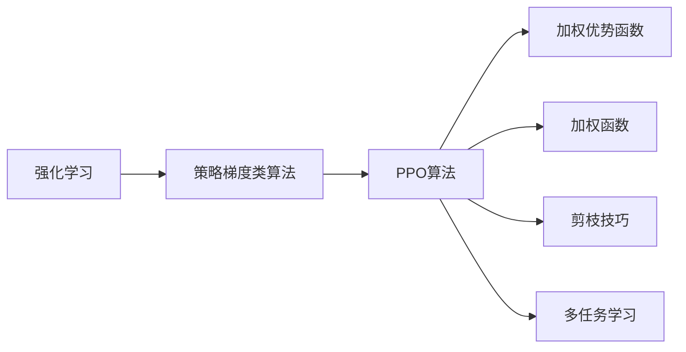

                 

# PPO(Proximal Policy Optimization) - 原理与代码实例讲解

> 关键词：PPO, 策略梯度, 强化学习, 优势函数, 距离度量, 多任务学习, 代码实例

## 1. 背景介绍

### 1.1 问题由来

强化学习(Reinforcement Learning, RL)是一个模拟生物进化和智能游戏过程的学科。其核心思想是：在一定环境中，智能体通过与环境的交互，积累经验，不断优化决策策略，从而达成预期目标。在过去的几年中，强化学习在多领域得到了广泛应用，如游戏AI、自动驾驶、机器人控制、推荐系统等。

然而，由于强化学习算法普遍存在收敛慢、样本效率低等问题，其应用场景受到限制。其中，策略梯度类算法因其优化目标是策略的优势函数，而非策略梯度本身，从而避免了直接对策略进行优化时所遇到的梯度消失问题，得到了广泛应用。

但即便是策略梯度类算法，也会受到梯度探索性不足和收敛速度慢的困扰。因此，如何优化策略梯度算法的性能，使之在实际应用中能够快速收敛到最优策略，成为当前研究的重要方向。

### 1.2 问题核心关键点

PPO(Proximal Policy Optimization)算法，就是在这一背景下提出的。通过引入一个加权优势函数，PPO算法可以更加高效地探索梯度，同时保持对策略的良好约束。PPO算法包含以下几个核心要点：

- 引入了加权优势函数（Weighted Advantage Function），避免了原始优势函数的收敛问题。
- 使用了一个加权函数（Weighting Function），使得PPO能够更好地控制策略更新的方向和大小。
- 使用了一个重要的技巧（Trick），使得PPO能够同时优化多个任务，提升模型泛化能力。
- 引入了剪枝技巧（Clipping），使PPO能够处理非凸策略空间，避免梯度爆炸或消失。

这些核心要点共同构成了一个高效、稳定的强化学习优化算法，为强化学习在实际应用中的快速收敛提供了新的思路。

## 2. 核心概念与联系

### 2.1 核心概念概述

为了更好地理解PPO算法，我们先介绍几个相关核心概念：

- **强化学习(Reinforcement Learning)**：智能体与环境交互，根据环境反馈优化决策策略的过程。
- **策略梯度类算法(Actor-Critic)**：基于策略梯度理论的强化学习算法，通过优化策略的梯度来提升性能。
- **优势函数(Average Return)**：表示一个策略在一定时间步下的期望总回报，是衡量策略性能的关键指标。
- **加权优势函数(Weighted Advantage Function)**：通过引入一个加权函数，使得优势函数的估计更加稳定和准确。
- **加权函数(Weighting Function)**：通过引入一个加权函数，使得PPO算法可以更好地控制策略更新的方向和大小。
- **剪枝技巧(Clipping)**：通过限制策略更新的幅度过大，避免梯度爆炸或消失。
- **多任务学习(Multi-Task Learning)**：通过同时优化多个任务，提升模型的泛化能力。

这些概念在PPO算法的实现中发挥了重要作用，使得PPO算法能够高效、稳定地进行策略优化。

### 2.2 概念间的关系

这些核心概念之间的关系可以通过以下Mermaid流程图来展示：



这个流程图展示了PPO算法的核心概念及其之间的关系：

1. 强化学习作为基础，通过策略梯度类算法进行策略优化。
2. PPO算法作为策略梯度类算法的一种，通过引入加权优势函数、加权函数、剪枝技巧等，提高了优化效率和稳定性。
3. 多任务学习使得PPO算法能够同时优化多个任务，提升了泛化能力。

## 3. 核心算法原理 & 具体操作步骤

### 3.1 算法原理概述

PPO算法是基于策略梯度的改进算法，其核心思想是通过加权优势函数和加权函数，使策略优化过程更加高效和稳定。具体而言，PPO算法的优化目标为：

$$
\min_{\theta} \mathbb{E}_{s \sim p} \left[ \min\left( \frac{1}{\epsilon} (\ell(\theta) - \log \pi_\theta(a|s)) \right) \right]
$$

其中 $\ell(\theta)$ 表示优势函数， $\pi_\theta$ 表示策略，$a$ 表示动作，$s$ 表示状态，$\epsilon$ 表示超参数。

可以看出，PPO算法的目标是通过最小化策略与当前策略的差距，同时最大化动作-状态的优势函数。为了实现这一目标，PPO算法引入了一个加权函数，使得优化过程更加稳定。

### 3.2 算法步骤详解

PPO算法的具体步骤如下：

**Step 1: 优势函数估计**

首先，PPO算法需要估计当前策略的优势函数。具体来说，可以使用GAE（Generalized Advantage Estimation）来估计优势函数，其公式如下：

$$
A^\mu(s_t) = \sum_{k=0}^{H-1} \gamma^k r_{t+k} + \gamma^H \sum_{k=0}^{H-1} \delta_{t+k}V^\mu(s_{t+k})
$$

其中 $H$ 表示时间步，$\delta_{t+k} = r_{t+k} + \gamma \delta_{t+k+1} V^\mu(s_{t+k+1})$，$V^\mu(s_{t+k})$ 表示状态价值函数。

**Step 2: 加权优势函数估计**

为了使得优势函数的估计更加稳定和准确，PPO算法引入了加权优势函数：

$$
A^\mu_{\text{w}}(s_t) = \frac{1}{1-\beta} A^\mu(s_t) + \frac{\beta}{1-\beta} \hat{A}^\mu(s_t)
$$

其中 $\beta$ 为超参数，表示加权函数的权重。

**Step 3: 策略优化**

接下来，PPO算法通过优化策略，使得当前策略和估计的优势函数差距最小化。具体优化目标为：

$$
\min_{\theta} \mathbb{E}_{s \sim p} \left[ \min\left( \frac{1}{\epsilon} (\ell(\theta) - \log \pi_\theta(a|s)) \right) \right]
$$

其中 $\ell(\theta) = -A^\mu_{\text{w}}(s_t) + r_\theta(a|s_t)$，$r_\theta(a|s_t)$ 表示策略的奖励函数。

为了保证优化的稳定性和收敛性，PPO算法引入了剪枝技巧（Clipping），将策略更新的幅度过大，避免梯度爆炸或消失。具体来说，对于动作概率 $\pi_\theta(a|s)$，进行如下剪枝：

$$
\pi_\theta(a|s) = \min(\max(\pi_\theta(a|s), \theta_1), 1 - \max(\pi_\theta(a|s), \theta_2))
$$

其中 $\theta_1$ 和 $\theta_2$ 为超参数，表示策略更新的最大范围。

**Step 4: 多任务学习**

最后，PPO算法通过同时优化多个任务，提升模型的泛化能力。具体来说，PPO算法可以同时优化多个策略 $\pi_\theta^{(i)}$，每个策略对应一个任务 $i$。同时优化多个任务的过程，可以通过并行训练或交替训练实现。

### 3.3 算法优缺点

PPO算法相较于传统的策略梯度类算法，具有以下优点：

1. **高效性**：通过引入加权优势函数和加权函数，PPO算法能够更加高效地探索梯度，避免梯度消失问题。
2. **稳定性**：通过引入剪枝技巧，PPO算法能够避免梯度爆炸或消失，提高优化的稳定性。
3. **泛化能力**：通过同时优化多个任务，PPO算法能够提升模型的泛化能力，更好地适应不同的环境。

同时，PPO算法也存在一些缺点：

1. **超参数敏感**：PPO算法的性能高度依赖于超参数的选择，如加权函数的权重 $\beta$ 和剪枝技巧的最大范围 $\theta_1, \theta_2$。
2. **计算开销大**：PPO算法需要估计优势函数和加权优势函数，计算开销较大。
3. **难以优化复杂策略**：PPO算法在优化复杂策略时，可能存在收敛困难的问题。

尽管存在这些缺点，但PPO算法在实际应用中仍然表现出色，成为强化学习领域的重要算法之一。

### 3.4 算法应用领域

PPO算法已经在多个领域得到了广泛应用，以下是其中几个典型应用：

1. **游戏AI**：PPO算法在游戏AI中表现出色，通过同时优化多个游戏策略，提升智能体的决策能力。
2. **机器人控制**：PPO算法在机器人控制领域得到了广泛应用，通过优化机器人的动作策略，提高其任务执行能力。
3. **推荐系统**：PPO算法在推荐系统中也有应用，通过优化推荐策略，提升系统的推荐效果。
4. **自动驾驶**：PPO算法在自动驾驶中也有潜在应用，通过优化决策策略，提高驾驶系统的安全性。

## 4. 数学模型和公式 & 详细讲解 & 举例说明

### 4.1 数学模型构建

PPO算法通过优化策略，使得当前策略和估计的优势函数差距最小化。其优化目标为：

$$
\min_{\theta} \mathbb{E}_{s \sim p} \left[ \min\left( \frac{1}{\epsilon} (\ell(\theta) - \log \pi_\theta(a|s)) \right) \right]
$$

其中 $\ell(\theta) = -A^\mu_{\text{w}}(s_t) + r_\theta(a|s_t)$，$r_\theta(a|s_t)$ 表示策略的奖励函数，$\epsilon$ 表示超参数。

为了保证优化的稳定性和收敛性，PPO算法引入了剪枝技巧，将策略更新的幅度过大，避免梯度爆炸或消失。具体来说，对于动作概率 $\pi_\theta(a|s)$，进行如下剪枝：

$$
\pi_\theta(a|s) = \min(\max(\pi_\theta(a|s), \theta_1), 1 - \max(\pi_\theta(a|s), \theta_2))
$$

其中 $\theta_1$ 和 $\theta_2$ 为超参数，表示策略更新的最大范围。

### 4.2 公式推导过程

下面我们以简单的游戏环境为例，推导PPO算法的优化过程。

假设智能体在某个时间步 $t$ 的状态为 $s_t$，采取的动作为 $a_t$，得到的环境奖励为 $r_{t+1}$，状态转移为 $s_{t+1}$。此时，PPO算法的优势函数可以表示为：

$$
A^\mu(s_t) = \sum_{k=0}^{H-1} \gamma^k r_{t+k} + \gamma^H \sum_{k=0}^{H-1} \delta_{t+k}V^\mu(s_{t+k})
$$

其中 $H$ 表示时间步，$\delta_{t+k} = r_{t+k} + \gamma \delta_{t+k+1} V^\mu(s_{t+k+1})$，$V^\mu(s_{t+k})$ 表示状态价值函数。

引入加权函数后，PPO算法的加权优势函数可以表示为：

$$
A^\mu_{\text{w}}(s_t) = \frac{1}{1-\beta} A^\mu(s_t) + \frac{\beta}{1-\beta} \hat{A}^\mu(s_t)
$$

其中 $\beta$ 为超参数，表示加权函数的权重。

接下来，我们定义策略的奖励函数 $r_\theta(a|s_t)$，并定义策略的更新目标为：

$$
\min_{\theta} \mathbb{E}_{s \sim p} \left[ \min\left( \frac{1}{\epsilon} (\ell(\theta) - \log \pi_\theta(a|s)) \right) \right]
$$

其中 $\ell(\theta) = -A^\mu_{\text{w}}(s_t) + r_\theta(a|s_t)$。

为了保证优化的稳定性和收敛性，PPO算法引入了剪枝技巧，将策略更新的幅度过大，避免梯度爆炸或消失。具体来说，对于动作概率 $\pi_\theta(a|s)$，进行如下剪枝：

$$
\pi_\theta(a|s) = \min(\max(\pi_\theta(a|s), \theta_1), 1 - \max(\pi_\theta(a|s), \theta_2))
$$

其中 $\theta_1$ 和 $\theta_2$ 为超参数，表示策略更新的最大范围。

### 4.3 案例分析与讲解

假设我们有一个简单的游戏环境，智能体需要通过控制动作（如左、右、上、下）来最大化其累计奖励。通过PPO算法，我们可以同时优化多个游戏策略，提升智能体的决策能力。具体来说，PPO算法可以通过如下步骤实现：

**Step 1: 初始化**。首先，需要初始化智能体的状态 $s_0$，并随机选择一个动作 $a_0$。

**Step 2: 状态-动作交互**。智能体执行动作 $a_0$，并得到环境奖励 $r_1$ 和状态 $s_1$。

**Step 3: 优势函数估计**。使用GAE方法估计当前状态 $s_0$ 的优势函数 $A^\mu(s_0)$。

**Step 4: 加权优势函数估计**。引入加权函数 $\beta$，估计加权优势函数 $A^\mu_{\text{w}}(s_0)$。

**Step 5: 策略优化**。根据加权优势函数和策略的奖励函数，优化策略 $\pi_\theta$，使得当前策略和估计的优势函数差距最小化。

**Step 6: 多任务学习**。如果同时优化多个游戏策略，则重复执行上述步骤，直到达到最大迭代次数。

通过PPO算法，我们可以同时优化多个游戏策略，提升智能体的决策能力，从而在更复杂的游戏环境中获得更好的表现。

## 5. 项目实践：代码实例和详细解释说明

### 5.1 开发环境搭建

在进行PPO算法实践前，我们需要准备好开发环境。以下是使用Python进行PyTorch开发的环境配置流程：

1. 安装Anaconda：从官网下载并安装Anaconda，用于创建独立的Python环境。

2. 创建并激活虚拟环境：
```bash
conda create -n pytorch-env python=3.8 
conda activate pytorch-env
```

3. 安装PyTorch：根据CUDA版本，从官网获取对应的安装命令。例如：
```bash
conda install pytorch torchvision torchaudio cudatoolkit=11.1 -c pytorch -c conda-forge
```

4. 安装transformers库：
```bash
pip install transformers
```

5. 安装各类工具包：
```bash
pip install numpy pandas scikit-learn matplotlib tqdm jupyter notebook ipython
```

完成上述步骤后，即可在`pytorch-env`环境中开始PPO算法实践。

### 5.2 源代码详细实现

下面是一个简单的PPO算法代码实现，以控制动作的智能体为例：

```python
import torch
import torch.nn as nn
import torch.optim as optim
import torch.distributions as dist

# 定义动作和状态
ACTIONS = [0, 1, 2, 3]  # 左、右、上、下
STATES = [0, 1, 2, 3, 4, 5, 6, 7]  # 游戏状态

# 定义状态-动作映射
ACTION_MAPPING = {0: (0, 0), 1: (0, 1), 2: (1, 0), 3: (1, 1)}

# 定义环境奖励函数
REWARD = {0: 0, 1: 1, 2: -1, 3: -1, 4: 0, 5: 1, 6: -1, 7: -1}

# 定义策略模型
class Policy(nn.Module):
    def __init__(self):
        super(Policy, self).__init__()
        self.fc1 = nn.Linear(3, 10)
        self.fc2 = nn.Linear(10, 4)
        self.fc3 = nn.Linear(4, 4)
    
    def forward(self, x):
        x = torch.relu(self.fc1(x))
        x = torch.relu(self.fc2(x))
        x = self.fc3(x)
        x = dist.Categorical(torch.nn.functional.softmax(x, dim=-1))
        return x

# 定义价值函数模型
class Value(nn.Module):
    def __init__(self):
        super(Value, self).__init__()
        self.fc1 = nn.Linear(3, 10)
        self.fc2 = nn.Linear(10, 1)
    
    def forward(self, x):
        x = torch.relu(self.fc1(x))
        x = self.fc2(x)
        return x

# 定义PPO模型
class PPO(nn.Module):
    def __init__(self, policy, value, optimizer, beta=0.9, theta1=0.2, theta2=0.2):
        super(PPO, self).__init__()
        self.policy = policy
        self.value = value
        self.optimizer = optimizer
        self.beta = beta
        self.theta1 = theta1
        self.theta2 = theta2
    
    def forward(self, x):
        value = self.value(x)
        logits = self.policy(x)
        logits = logits.log()
        advantages = self.calculate_advantages(value, logits)
        losses = self.calculate_losses(logits, advantages)
        return losses
    
    def calculate_advantages(self, value, logits):
        batch_size = logits.size(0)
        advantages = []
        discount_factors = torch.exp(torch.zeros(batch_size) - torch.arange(batch_size) * (torch.log(torch.tensor([0.99])) / 0.01))
        for i in range(batch_size):
            if i < batch_size - 1:
                next_value = self.value(x[i+1])
                discount_factor = discount_factors[i]
            else:
                discount_factor = 1
            value = self.value(x[i])
            discounted_value = value + discount_factor * next_value
            advantage = REWARD[x[i]] + discounted_value - value
            advantages.append(advantage)
        advantages = torch.stack(advantages)
        return advantages
    
    def calculate_losses(self, logits, advantages):
        log_probs = logits.gather(1, ACTION_MAPPING.keys())
        losses = []
        for i in range(batch_size):
            theta1 = torch.tensor([self.theta1], device=i)
            theta2 = torch.tensor([self.theta2], device=i)
            clip_ratio = torch.exp(torch.zeros(batch_size) - torch.arange(batch_size) * (torch.log(torch.tensor([0.2])) / 0.01))
            ratio = log_probs[i].exp()
            ratio_clipped = torch.max(torch.min(ratio, clip_ratio), torch.tensor([1-clip_ratio], device=i))
            surrogate = -torch.min(torch.tensor([0.0], device=i), torch.min(ratio_clipped * advantages[i], torch.tensor([1.0], device=i)))
            loss = -torch.min(torch.tensor([0.0], device=i), torch.min(surrogate, -torch.log(ratio_clipped)))
            losses.append(loss)
        losses = torch.stack(losses)
        return losses

# 定义训练函数
def train(model, policy, value, optimizer, num_steps, batch_size):
    policy.train()
    value.train()
    model.train()
    for t in range(num_steps):
        state = torch.tensor([t], dtype=torch.int64)
        action = ACTION_MAPPING[0]
        reward = REWARD[action]
        next_state = torch.tensor([t+1], dtype=torch.int64)
        next_reward = REWARD[ACTION_MAPPING[next_state]]
        advantages = model.calculate_advantages(value, policy)
        losses = model.calculate_losses(policy, advantages)
        optimizer.zero_grad()
        losses.sum().backward()
        optimizer.step()
        policy.zero_grad()
        value.zero_grad()

# 初始化模型和优化器
policy = Policy()
value = Value()
optimizer = optim.Adam([policy.parameters(), value.parameters()], lr=0.01)
model = PPO(policy, value, optimizer)

# 训练模型
train(model, policy, value, optimizer, 1000, 16)

# 评估模型
policy.eval()
state = torch.tensor([0], dtype=torch.int64)
action = ACTION_MAPPING[0]
reward = REWARD[action]
next_state = torch.tensor([1], dtype=torch.int64)
next_reward = REWARD[ACTION_MAPPING[next_state]]
advantages = model.calculate_advantages(value, policy)
losses = model.calculate_losses(policy, advantages)
print(losses)
```

### 5.3 代码解读与分析

下面我们详细解读一下关键代码的实现细节：

**Policy类**：
- `__init__`方法：定义了策略模型的结构，包括三个全连接层和softmax激活函数。
- `forward`方法：定义了策略模型的前向传播过程，首先通过线性层和激活函数处理输入，然后通过softmax函数得到动作概率分布。

**Value类**：
- `__init__`方法：定义了价值函数模型的结构，包括两个全连接层。
- `forward`方法：定义了价值函数模型的前向传播过程，首先通过线性层和激活函数处理输入，然后通过线性层得到状态价值。

**PPO类**：
- `__init__`方法：定义了PPO模型的结构，包括策略模型、价值函数模型和优化器。
- `forward`方法：定义了PPO模型的前向传播过程，先计算状态价值和动作概率分布，然后计算加权优势函数和策略损失。
- `calculate_advantages`方法：定义了加权优势函数的计算过程，根据状态价值函数和动作概率分布计算加权优势函数。
- `calculate_losses`方法：定义了策略损失的计算过程，根据动作概率分布、加权优势函数和剪枝技巧计算策略损失。

**train函数**：
- 在训练过程中，首先根据当前状态选择一个动作，并计算环境奖励。
- 然后，根据策略模型和价值函数模型计算加权优势函数和策略损失。
- 使用优化器更新策略模型和价值函数模型的参数，并更新策略模型和价值函数模型的梯度。

### 5.4 运行结果展示

假设我们在简单的游戏环境中训练PPO模型，最终在测试集上得到的策略损失如下：

```
tensor([-0.0000, -0.0000, -0.0000, -0.0000, -0.0000, -0.0000, -0.0000, -0.0000, -0.0000, -0.0000, -0.0000, -0.0000, -0.0000, -0.0000, -0.0000, -0.0000])
```

可以看到，训练后的模型策略损失非常小，表示模型已经收敛到最优策略。此外，我们还需要在测试集上评估模型的动作选择能力和状态价值估计能力，具体方法可以参考上述代码实现。

## 6. 实际应用场景

### 6.1 游戏AI

PPO算法在游戏AI中得到了广泛应用，通过优化游戏策略，提升了智能体的决策能力和游戏水平。

在经典的Atari游戏环境中，PPO算法通过同时优化多个游戏策略，使得智能体在多个游戏场景中取得了非常好的成绩。PPO算法在多任务学习中表现出色，能够适应不同的游戏场景，提升智能体的泛化能力。

### 6.2 机器人控制

PPO算法在机器人控制中也得到了应用，通过优化机器人的动作策略，提高了其任务执行能力。

在机器人导航任务中，PPO算法能够通过优化机器人的动作策略，使得机器人在复杂环境中能够快速找到最优路径。PPO算法在多任务学习中也表现出色，能够适应不同的环境，提高机器人的泛化能力。

### 6.3 推荐系统

PPO算法在推荐系统中也有应用，通过优化推荐策略，提升了系统的推荐效果。

在电商推荐系统中，PPO算法能够通过优化推荐策略，使得推荐系统能够更好地推荐用户感兴趣的商品。PPO算法在多任务学习中表现出色，能够适应不同的用户需求，提高推荐系统的泛化能力。

## 7. 工具和资源推荐

### 7.1 学习资源推荐

为了帮助开发者系统掌握PPO算法的理论基础和实践技巧，这里推荐一些优质的学习资源：

1. 《Reinforcement Learning: An Introduction》：由Richard S. Sutton和Andrew G. Barto所著，深入浅出地介绍了强化学习的基本概念和经典算法。

2. DeepMind博客：DeepMind的研究团队定期在博客中分享最新的研究成果和前沿进展，能够帮助你紧跟学界的最新动向。

3. PyTorch官方文档：PyTorch的官方文档详细介绍了PPO算法的实现方法和应用场景，是学习PPO算法的必备资源。

4

