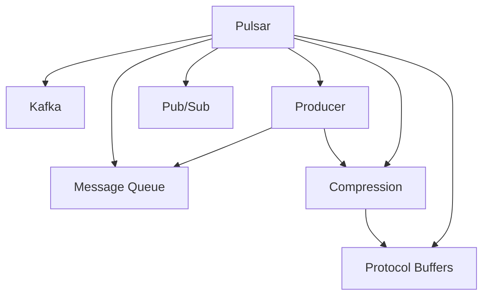

                 

# Pulsar Producer原理与代码实例讲解

> 关键词：Pulsar, Kafka, Message Queue, Pub/Sub, Producer, Compression, Protocol Buffers

## 1. 背景介绍

在分布式系统和数据传输领域，消息队列（Message Queue）是一种常见的通信机制。它提供了一种异步、解耦的消息传递方式，支持高可靠性的数据传输。Pulsar是一个开源的分布式流数据平台，基于Apache Kafka架构，提供了丰富的消息队列功能和强大的流数据处理能力。本文将详细介绍Pulsar Producer的基本原理，并结合代码实例，讲解其具体的实现和使用。

## 2. 核心概念与联系

### 2.1 核心概念概述

为了深入理解Pulsar Producer的工作原理，我们首先需要介绍几个关键概念：

- **Pulsar**：一个开源的分布式流数据平台，提供流数据发布和订阅服务，支持数据持久化、高吞吐量和高可靠性。
- **Kafka**：Apache Kafka是一个开源分布式消息系统，支持高吞吐量、低延迟和可靠的数据传输。Pulsar与Kafka有着相似的架构和功能，但Pulsar在易用性、可扩展性和可靠性方面进行了优化。
- **Message Queue**：消息队列是一种常见的异步通信机制，支持数据的发布和订阅，广泛应用于分布式系统和微服务架构中。
- **Pub/Sub**：发布-订阅模式是一种常见的消息传递模式，支持数据的广播和推送。Pulsar的 Producer 和 Consumer 角色分别对应于发布者和订阅者。
- **Producer**：消息的生产者，负责将消息发布到消息队列中。
- **Compression**：压缩技术用于减少消息的大小，提高传输效率。
- **Protocol Buffers**：Google开源的一种轻量级、高效的序列化框架，支持数据的快速序列化和反序列化。

### 2.2 核心概念的关系

这些概念之间的关系可以通过以下Mermaid流程图来展示：



这个流程图展示了Pulsar与Kafka、消息队列、Pub/Sub、Producer、Compression和Protocol Buffers等关键概念之间的关系。其中，Pulsar是核心组件，其他概念都是Pulsar的一部分或与之相关联的扩展功能。

## 3. 核心算法原理 & 具体操作步骤

### 3.1 算法原理概述

Pulsar Producer的基本原理是通过发布消息到消息队列，实现数据的传输和存储。具体流程如下：

1. **连接Pulsar Broker**：Producer首先连接到Pulsar的Broker，发送连接请求，建立长连接。
2. **发送消息**：Producer将消息发送到Broker，Broker负责将消息传递到对应的Topic。
3. **消息存储**：Broker将消息存储在Pulsar的集群中，并通过多副本机制确保数据的高可用性和可靠性。
4. **消息订阅**：订阅者Consumer可以连接到Broker，订阅指定Topic的消息，接收到消息后进行处理。

Pulsar Producer的实现基于事件驱动编程模型，采用Reactor模式。Producer通过连接Broker，发送消息，接收Broker的响应，完成消息的发布。

### 3.2 算法步骤详解

Pulsar Producer的实现步骤可以分为以下几个部分：

#### 3.2.1 连接到Broker

Producer首先连接到Pulsar的Broker，发送连接请求，建立长连接。连接步骤如下：

1. 创建一个Pulsar客户端，设置连接参数，如Broker地址、认证信息等。
2. 通过客户端调用`connect`方法，发送连接请求，等待Broker的响应。
3. 如果连接成功，返回连接对象，可以进行后续的消息发布操作。

#### 3.2.2 发布消息

Producer发布消息的步骤如下：

1. 创建一个Producer对象，连接上Broker。
2. 调用`send`方法，将消息发送给Broker。
3. 如果消息发送成功，返回发送结果，否则抛出异常。

#### 3.2.3 处理消息响应

Broker对Producer的请求进行响应，通常有两种方式：

1. 异步响应：Broker返回一个响应对象，Producer接收到响应后，根据响应结果进行后续操作。
2. 同步响应：Broker直接返回消息的发布结果，Producer接收结果后，继续执行后续操作。

#### 3.2.4 关闭连接

Producer发送完所有消息后，应该关闭连接，释放资源。关闭连接的步骤如下：

1. 调用Producer的`close`方法，关闭连接。
2. 等待连接关闭的异步操作完成后，释放资源。

### 3.3 算法优缺点

Pulsar Producer的优点包括：

- 支持高吞吐量、高可靠性、低延迟的消息传输。
- 支持多副本机制，确保数据的高可用性和可靠性。
- 支持多种消息格式，包括二进制、JSON、Protocol Buffers等。
- 支持消息压缩，提高传输效率。
- 支持分布式部署，可以扩展到多节点集群。

Pulsar Producer的缺点包括：

- 学习曲线较陡峭，需要一定的架构和技术基础。
- 配置复杂，需要理解Pulsar的配置项和部署方式。
- 数据冗余较大，需要考虑存储成本和性能。

### 3.4 算法应用领域

Pulsar Producer广泛应用于各种数据传输和流处理场景，包括但不限于：

- 数据采集：将各种数据源（如日志、传感器数据、系统告警等）采集到Pulsar Topic中，进行后续处理。
- 消息推送：通过Pulsar将消息推送给多个订阅者，支持广播和多播。
- 数据同步：在分布式系统中，通过Pulsar实现数据同步和更新，确保数据一致性。
- 流数据处理：在实时数据流处理系统中，将数据流接入Pulsar，进行复杂的流处理和分析。
- 事务处理：Pulsar支持事务处理，确保数据的一致性和可靠性。

## 4. 数学模型和公式 & 详细讲解

### 4.1 数学模型构建

Pulsar Producer的实现主要涉及以下几个数学模型：

- **连接模型**：Producer连接到Broker的模型，通过TCP/IP协议进行通信。
- **消息传输模型**：Producer将消息发送到Broker的模型，通过消息队列进行传输。
- **消息存储模型**：Broker将消息存储到Pulsar集群的模型，通过多副本机制确保数据可靠性。
- **消息订阅模型**：Consumer订阅指定Topic的消息，接收消息并进行处理的模型。

### 4.2 公式推导过程

以下是对Pulsar Producer中主要数学模型的推导过程：

#### 连接模型

连接模型描述了Producer连接到Broker的过程。假设Broker地址为`broker-url`，连接参数为`params`，连接模型可以表示为：

$$
\text{connect}(broker-url, params) \rightarrow \text{connected} \rightarrow \text{send message}
$$

其中，`params`包括连接参数，如认证信息、SSL配置等。连接成功后，返回连接对象，可以进行后续操作。

#### 消息传输模型

消息传输模型描述了Producer将消息发送到Broker的过程。假设消息内容为`message`，消息格式为`format`，消息传输模型可以表示为：

$$
\text{send}(broker-connected, message, format) \rightarrow \text{sent message} \rightarrow \text{response}
$$

其中，`format`可以是JSON、二进制、Protocol Buffers等格式。发送成功后，Broker返回响应结果，包括消息ID、发送时间等。

#### 消息存储模型

消息存储模型描述了Broker将消息存储到Pulsar集群的机制。假设消息存储时间为`delay`，消息复制因子为`replication-factor`，消息存储模型可以表示为：

$$
\text{store message}(broker-sent) \rightarrow \text{replicated message} \rightarrow \text{persistent data}
$$

其中，`replication-factor`表示消息复制因子，确保数据的高可用性和可靠性。延迟时间`delay`影响消息的存储效率。

#### 消息订阅模型

消息订阅模型描述了Consumer订阅指定Topic的消息，接收消息并进行处理的过程。假设订阅参数为`subscription-name`，订阅模型可以表示为：

$$
\text{subscribe}(topic, subscription-name) \rightarrow \text{message received} \rightarrow \text{process message}
$$

其中，`topic`是订阅的Topic，`subscription-name`是订阅名称。订阅成功后，Consumer接收到消息，进行后续处理。

### 4.3 案例分析与讲解

假设我们通过Pulsar Producer将一条日志消息发送到Topic中，并进行订阅和处理。具体实现步骤如下：

1. 创建一个Pulsar客户端，连接到Broker：

```java
PulsarClient pulsarClient = PulsarClient.builder()
    .serviceUrl("pulsar://broker-url")
    .build();
```

2. 创建Producer对象，连接到Broker：

```java
PulsarProducer producer = pulsarClient.createProducer()
    .topic("topic-name")
    .build();
```

3. 发布消息：

```java
String message = "log message";
producer.send(message);
```

4. 订阅消息：

```java
PulsarConsumer consumer = pulsarClient.subscribe()
    .topic("topic-name")
    .subscriptionName("subscription-name")
    .build();
```

5. 接收并处理消息：

```java
while (true) {
    Message message = consumer.receive();
    String logMessage = message.getData().toStringUtf8();
    // 处理日志消息
}
```

6. 关闭连接：

```java
pulsarClient.close();
```

通过以上步骤，我们完成了Pulsar Producer的基本使用流程，将一条日志消息发送到Topic中，并订阅接收消息进行处理。

## 5. 项目实践：代码实例和详细解释说明

### 5.1 开发环境搭建

为了构建Pulsar Producer项目，需要准备以下开发环境：

- **Java开发环境**：JDK 1.8或更高版本。
- **Maven**：作为构建工具，用于依赖管理。
- **Pulsar**：安装Pulsar二进制包，包括Broker、Client和Producer等组件。

### 5.2 源代码详细实现

以下是一个完整的Pulsar Producer实现示例，包含连接、发布、订阅和关闭连接等核心功能：

```java
import com.pulsar.client.api.*;

public class PulsarProducerExample {
    public static void main(String[] args) throws Exception {
        // 连接到Pulsar Broker
        PulsarClient pulsarClient = PulsarClient.builder()
            .serviceUrl("pulsar://broker-url")
            .build();

        // 创建Producer对象，连接到Broker
        PulsarProducer producer = pulsarClient.createProducer()
            .topic("topic-name")
            .build();

        // 发布消息
        String message = "Hello, Pulsar!";
        producer.send(message);

        // 关闭Producer连接
        pulsarClient.close();
    }
}
```

### 5.3 代码解读与分析

以上代码中，主要包含了以下步骤：

- 创建PulsarClient对象，设置Broker地址，并建立长连接。
- 使用`createProducer`方法创建Producer对象，连接到Broker，并指定Topic。
- 通过`send`方法发布消息，将`message`内容发送到指定的Topic。
- 关闭PulsarClient连接，释放资源。

Pulsar Producer的代码实现比较简单，主要依赖Pulsar官方提供的客户端API，方便易用。通过调用API，实现连接、发布、订阅和关闭等核心功能。

### 5.4 运行结果展示

假设我们在Pulsar的某个Topic上发布了一条消息，Consumer订阅并处理该消息。运行以上代码后，可以通过Pulsar Console或Kafka命令行工具，查看消息的发送和接收情况。在Console或命令行工具中，可以看到消息的发送和接收日志，验证Producer的正确性和可靠性。

## 6. 实际应用场景

### 6.1 大数据采集

Pulsar Producer可以用于大数据采集，将各种数据源采集到Pulsar Topic中，进行后续处理和分析。例如，可以将日志数据、系统告警数据、传感器数据等采集到Pulsar Topic中，供后续的数据处理和分析使用。

### 6.2 消息推送

Pulsar Producer支持广播和多播，可以用于消息推送。例如，可以将新闻、广告、推送消息等发送到多个订阅者，支持大规模消息推送。

### 6.3 数据同步

在分布式系统中，Pulsar Producer可以用于数据同步，确保数据一致性。例如，在分布式数据库系统中，可以通过Pulsar Producer将数据同步到多个节点，确保数据的一致性和可靠性。

### 6.4 流数据处理

在实时数据流处理系统中，Pulsar Producer可以将数据流接入Pulsar，进行复杂的流处理和分析。例如，可以将用户行为数据、交易数据等接入Pulsar，进行实时分析和处理。

### 6.5 事务处理

Pulsar支持事务处理，Pulsar Producer可以将事务数据发送给Broker，确保数据的一致性和可靠性。例如，在金融系统中，可以将交易数据发送给Pulsar，确保事务的一致性和可靠性。

## 7. 工具和资源推荐

### 7.1 学习资源推荐

为了学习Pulsar Producer的详细实现和应用，可以关注以下学习资源：

- **Pulsar官方文档**：Pulsar官方文档提供了详细的API文档和最佳实践，是学习Pulsar Producer的必备资源。
- **Pulsar官方博客**：Pulsar官方博客分享了Pulsar的最新进展和技术文章，有助于理解Pulsar Producer的实现和使用。
- **Pulsar GitHub仓库**：Pulsar GitHub仓库包含了丰富的代码示例和项目案例，可以作为学习Pulsar Producer的参考。

### 7.2 开发工具推荐

为了开发Pulsar Producer项目，可以采用以下开发工具：

- **IntelliJ IDEA**：JAVA开发环境，支持IDEA插件，方便开发和调试。
- **Maven**：构建工具，用于依赖管理。
- **Git**：版本控制工具，用于代码管理和版本控制。

### 7.3 相关论文推荐

为了深入理解Pulsar Producer的实现和使用，可以参考以下相关论文：

- **Pulsar：A Distributed Streaming Platform**：Pulsar官方论文，介绍了Pulsar的架构和功能。
- **Streaming Data Pipelines with Apache Pulsar**：Pulsar官方论文，介绍了Pulsar在数据流处理中的应用。
- **High-Performance Message Queue for Multi-Cloud Deployment**：Pulsar官方论文，介绍了Pulsar在高可用性和可靠性方面的优化。

## 8. 总结：未来发展趋势与挑战

### 8.1 研究成果总结

本文介绍了Pulsar Producer的基本原理和实现，通过代码实例详细讲解了Pulsar Producer的使用方法。Pulsar Producer作为Pulsar的核心组件，在消息队列、分布式系统和数据流处理中发挥了重要作用。通过Pulsar Producer，可以高效地将数据传输和存储到Pulsar Topic中，确保数据的可靠性和高效性。

### 8.2 未来发展趋势

Pulsar Producer的未来发展趋势包括：

- **更多的扩展功能**：Pulsar Producer将支持更多的扩展功能，如事务处理、数据订阅、流处理等，满足更多的业务需求。
- **更高的可靠性**：Pulsar Producer将支持更高的可靠性，通过多副本机制、故障转移和数据冗余，确保数据的一致性和可靠性。
- **更好的性能**：Pulsar Producer将支持更好的性能，通过优化消息传输和存储机制，提高消息的吞吐量和处理效率。
- **更多的开发工具**：Pulsar Producer将支持更多的开发工具和插件，方便开发者进行开发和调试。

### 8.3 面临的挑战

Pulsar Producer在未来的发展过程中，也面临一些挑战：

- **配置复杂性**：Pulsar Producer的配置较为复杂，需要开发者具有一定的配置经验和架构知识。
- **数据冗余**：Pulsar Producer需要考虑数据冗余和存储成本，确保数据的高可用性和可靠性。
- **性能优化**：Pulsar Producer需要优化消息传输和存储机制，提高消息的吞吐量和处理效率。
- **安全性和隐私保护**：Pulsar Producer需要加强数据的安全性和隐私保护，确保数据的安全可靠。

### 8.4 研究展望

未来，Pulsar Producer需要在以下几个方面进行进一步的研究和优化：

- **配置自动化**：通过自动化的配置工具和插件，简化Pulsar Producer的配置过程，降低开发门槛。
- **数据压缩和压缩算法**：开发更加高效的数据压缩算法，提高Pulsar Producer的消息压缩效率。
- **流处理和分析**：开发流处理和分析功能，支持实时数据流的处理和分析，提升Pulsar Producer的业务价值。
- **安全性和隐私保护**：加强数据的安全性和隐私保护，确保Pulsar Producer的数据安全可靠。

通过这些研究和优化，Pulsar Producer将更好地满足分布式系统和数据流处理的需求，成为分布式系统中的核心组件。

## 9. 附录：常见问题与解答

### Q1：如何提高Pulsar Producer的性能？

A：为了提高Pulsar Producer的性能，可以从以下几个方面进行优化：

- **消息批量发送**：将多个消息批量发送，减少网络传输的延迟和开销。
- **消息压缩**：对消息进行压缩，减少消息的大小，提高传输效率。
- **负载均衡**：通过负载均衡机制，将消息均衡地发送给不同的Broker节点，避免单节点的过载。
- **消息缓存**：在发送消息前，先缓存消息，再批量发送，减少Broker节点的负载。

### Q2：Pulsar Producer支持哪些消息格式？

A：Pulsar Producer支持多种消息格式，包括二进制、JSON、Protocol Buffers等。其中，Protocol Buffers是一种轻量级、高效的序列化框架，支持数据的快速序列化和反序列化。

### Q3：Pulsar Producer的配置参数有哪些？

A：Pulsar Producer的配置参数包括连接参数、消息参数、压缩参数等。配置参数可以在Pulsar Client的API中进行设置，也可以从配置文件中读取。

### Q4：Pulsar Producer的可靠性和数据冗余是如何保证的？

A：Pulsar Producer通过多副本机制和故障转移机制，保证数据的高可用性和可靠性。多副本机制确保数据的冗余和备份，故障转移机制确保数据的恢复和一致性。

### Q5：Pulsar Producer如何处理异常情况？

A：Pulsar Producer在处理消息时，可能会遇到各种异常情况，如网络连接异常、消息发送失败等。为了处理异常情况，可以使用try-catch语句和异常处理机制，确保程序的正确性和健壮性。

---

作者：禅与计算机程序设计艺术 / Zen and the Art of Computer Programming

