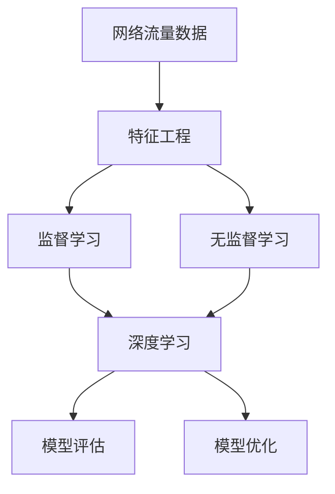

                 

# Python机器学习实战：采用机器学习技术对网络流量进行分析

> 关键词：网络流量分析, 机器学习, Python, 深度学习, 特征工程, 模型选择, 网络性能优化

## 1. 背景介绍

### 1.1 问题由来

在现代社会中，网络流量数据的分析与处理是一项至关重要的任务。随着互联网技术的普及和数字经济的蓬勃发展，网络流量的监控与分析成为了网络运营和业务优化不可或缺的一部分。它不仅能够帮助我们了解网络的使用情况，还能发现潜在的问题，优化网络性能。

网络流量通常包含大量的高维数据，包括时间戳、源IP、目的IP、协议类型等。这些数据难以直接用于分析和决策。传统的统计方法很难处理复杂且高维的数据集，因此需要借助机器学习技术来提取特征、建立模型，并进行预测和分类。

### 1.2 问题核心关键点

机器学习应用于网络流量分析的核心关键点包括：

- **数据获取**：如何有效地收集和整理网络流量数据。
- **特征工程**：如何从原始数据中提取有意义的特征，用于后续的模型训练。
- **模型选择**：如何选择适合的机器学习算法进行分类和预测。
- **性能评估**：如何评估模型的效果，并持续改进。

### 1.3 问题研究意义

通过机器学习技术对网络流量进行深入分析，可以带来以下几方面的意义：

- **网络性能优化**：通过分析网络流量数据，可以识别网络瓶颈，优化网络资源配置。
- **异常检测**：利用机器学习算法，快速发现网络异常行为，保障网络安全。
- **用户行为分析**：通过分析用户的网络行为数据，可以优化用户体验，提高用户满意度。
- **业务决策支持**：网络流量分析为业务决策提供依据，支持企业的数字化转型。

## 2. 核心概念与联系

### 2.1 核心概念概述

在网络流量分析的机器学习应用中，涉及以下几个关键概念：

- **网络流量数据**：包含时间戳、源IP、目的IP、协议类型等维度的数据集。
- **特征工程**：从原始数据中提取关键特征，用于构建模型。
- **监督学习**：通过有标签的样本数据进行模型训练，进行分类和预测。
- **无监督学习**：通过无标签的数据进行特征学习，发现数据的内在规律。
- **深度学习**：利用神经网络模型，提取高层次的特征表示。

这些核心概念之间紧密联系，共同构成了网络流量分析的机器学习框架。

### 2.2 概念间的关系

这些概念之间的关系可以通过以下Mermaid流程图来展示：



这个流程图展示了网络流量分析机器学习框架的基本流程：

1. 收集网络流量数据。
2. 通过特征工程提取关键特征。
3. 在监督或无监督学习框架下，构建模型。
4. 利用深度学习技术，提取高层次特征。
5. 对模型进行评估，并进行优化。

## 3. 核心算法原理 & 具体操作步骤
### 3.1 算法原理概述

基于机器学习的网络流量分析方法，通常包括以下几个关键步骤：

- **数据预处理**：清洗、转换原始网络流量数据，使其适合后续分析。
- **特征工程**：从原始数据中提取关键特征，构建特征集。
- **模型训练**：利用训练集数据，训练机器学习模型。
- **模型评估**：使用测试集数据，评估模型性能。
- **模型部署**：将模型应用于实时网络流量数据的分析。

### 3.2 算法步骤详解

#### 3.2.1 数据预处理

数据预处理是网络流量分析的重要环节，主要包括以下几个步骤：

1. **数据清洗**：去除数据中的噪声、异常值和缺失值，确保数据质量。
2. **数据转换**：将原始数据转换为机器学习模型能够处理的形式，如时间序列数据归一化、特征归一化等。
3. **特征选择**：选择对网络流量分析有重要影响的特征，降低特征维度和计算复杂度。

#### 3.2.2 特征工程

特征工程是机器学习项目中至关重要的一环，直接影响到模型的性能。在网络流量分析中，特征工程主要包括以下几个步骤：

1. **特征提取**：从原始数据中提取关键特征，如流量峰值、平均值、方差、标准差等。
2. **特征降维**：利用PCA、t-SNE等方法，降低特征维度，提高模型训练效率。
3. **特征构建**：构造新的特征，如时间窗口内的流量变化率、IP地址频次等。

#### 3.2.3 模型训练

模型训练是机器学习应用的核心步骤，主要包括以下几个方面：

1. **模型选择**：根据问题类型，选择合适的机器学习算法，如线性回归、决策树、随机森林、神经网络等。
2. **参数调优**：使用交叉验证等方法，调整模型参数，优化模型性能。
3. **模型训练**：利用训练集数据，训练模型，得到模型参数。

#### 3.2.4 模型评估

模型评估是验证模型性能的关键步骤，主要包括以下几个方面：

1. **性能指标**：选择合适的性能指标，如准确率、召回率、F1分数等，评估模型效果。
2. **交叉验证**：使用交叉验证等方法，评估模型的泛化能力。
3. **异常检测**：通过模型预测，发现异常流量数据。

#### 3.2.5 模型部署

模型部署是将训练好的模型应用于实际数据的关键步骤，主要包括以下几个方面：

1. **模型集成**：将训练好的模型集成到实际系统中，进行实时网络流量分析。
2. **模型优化**：根据实际数据分析结果，调整模型参数，提高模型性能。
3. **实时监测**：利用模型进行实时流量监测，及时发现异常流量数据。

### 3.3 算法优缺点

基于机器学习的网络流量分析方法，具有以下优点：

- **高维度处理能力**：能够处理高维度的网络流量数据，提取关键特征。
- **模型灵活性**：能够根据具体问题，选择适合的机器学习算法。
- **预测准确性**：通过模型训练和评估，能够提高预测准确性。

同时，该方法也存在以下缺点：

- **计算资源需求高**：高维数据集和复杂模型训练需要大量的计算资源。
- **模型解释性不足**：黑盒模型难以解释模型决策过程，不利于模型优化和调参。
- **数据隐私问题**：网络流量数据涉及用户隐私，数据收集和使用需要合规处理。

### 3.4 算法应用领域

基于机器学习的网络流量分析方法，广泛应用于以下几个领域：

- **网络性能监控**：通过分析网络流量数据，识别网络瓶颈，优化网络性能。
- **网络异常检测**：利用机器学习算法，发现网络异常行为，保障网络安全。
- **用户行为分析**：通过分析用户的网络行为数据，优化用户体验，提高用户满意度。
- **业务决策支持**：网络流量分析为业务决策提供依据，支持企业的数字化转型。

## 4. 数学模型和公式 & 详细讲解 & 举例说明

### 4.1 数学模型构建

假设原始网络流量数据集为 $D=\{(x_i,y_i)\}_{i=1}^N$，其中 $x_i$ 为网络流量特征向量，$y_i$ 为流量标签。我们的目标是通过机器学习模型，建立网络流量与标签之间的关系。

常用的机器学习模型包括线性回归、决策树、随机森林和神经网络等。这里以线性回归为例，介绍模型的构建和训练过程。

### 4.2 公式推导过程

假设线性回归模型为 $y=\theta_0 + \theta_1 x_1 + \theta_2 x_2 + \cdots + \theta_p x_p$，其中 $\theta_0,\theta_1,\cdots,\theta_p$ 为模型参数。根据最小二乘法，模型参数的求解公式为：

$$
\theta = (X^TX)^{-1}X^Ty
$$

其中 $X=\begin{bmatrix} x_1 \\ x_2 \\ \vdots \\ x_p \end{bmatrix}$，$y=\begin{bmatrix} y_1 \\ y_2 \\ \vdots \\ y_N \end{bmatrix}$。

### 4.3 案例分析与讲解

假设我们有一个网络流量数据集，包含时间戳、源IP、目的IP、协议类型等特征，我们需要预测网络拥塞情况。通过特征工程，我们选择流量峰值、平均值、方差、标准差等特征。然后，利用线性回归模型进行训练，并评估模型效果。

## 5. 项目实践：代码实例和详细解释说明

### 5.1 开发环境搭建

在进行项目实践前，我们需要准备好开发环境。以下是使用Python进行TensorFlow开发的环境配置流程：

1. 安装Anaconda：从官网下载并安装Anaconda，用于创建独立的Python环境。

2. 创建并激活虚拟环境：
```bash
conda create -n tf-env python=3.8 
conda activate tf-env
```

3. 安装TensorFlow：根据CUDA版本，从官网获取对应的安装命令。例如：
```bash
pip install tensorflow==2.8
```

4. 安装各类工具包：
```bash
pip install numpy pandas scikit-learn matplotlib tqdm jupyter notebook ipython
```

完成上述步骤后，即可在`tf-env`环境中开始项目实践。

### 5.2 源代码详细实现

这里我们以网络流量拥塞预测为例，给出使用TensorFlow进行线性回归的Python代码实现。

首先，定义数据处理函数：

```python
import tensorflow as tf
from tensorflow.keras import layers

def load_data():
    # 加载网络流量数据集
    # ...

    # 数据预处理，如归一化、缺失值处理等
    # ...

    # 划分训练集和测试集
    # ...

    return train_data, test_data

# 定义模型
model = tf.keras.Sequential([
    layers.Dense(64, activation='relu', input_shape=(n_features,)),
    layers.Dense(1)
])

# 定义优化器和损失函数
optimizer = tf.keras.optimizers.Adam(learning_rate=0.001)
loss_fn = tf.keras.losses.MeanSquaredError()

# 编译模型
model.compile(optimizer=optimizer, loss=loss_fn)

# 训练模型
history = model.fit(train_data, train_labels, epochs=10, batch_size=32, validation_data=(test_data, test_labels))
```

然后，评估模型性能：

```python
# 评估模型
test_loss = model.evaluate(test_data, test_labels)
print('Test loss:', test_loss)

# 预测新数据
new_data = ...
prediction = model.predict(new_data)
```

最后，启动训练流程并在测试集上评估：

```python
epochs = 10
batch_size = 32

for epoch in range(epochs):
    history = model.fit(train_data, train_labels, epochs=1, batch_size=batch_size, validation_data=(test_data, test_labels))
    
    print(f'Epoch {epoch+1}, train loss: {history.history["loss"][epoch]}')
    print(f'Epoch {epoch+1}, test loss: {test_loss}')
```

### 5.3 代码解读与分析

让我们再详细解读一下关键代码的实现细节：

**load_data函数**：
- 定义数据处理函数，包括数据加载、预处理、划分训练集和测试集等步骤。

**模型定义**：
- 使用`tf.keras.Sequential`定义线性回归模型，包含一个全连接层和一个输出层。
- 使用`layers.Dense`定义全连接层，设置激活函数为ReLU，输入维度为n_features。
- 使用`layers.Dense`定义输出层，输出维度为1，对应网络拥塞预测问题。

**优化器和损失函数**：
- 选择Adam优化器，设置学习率为0.001。
- 选择均方误差损失函数，用于回归问题。

**模型编译和训练**：
- 使用`model.compile`方法编译模型，设置优化器和损失函数。
- 使用`model.fit`方法训练模型，设置训练集、验证集、批次大小等参数。

**模型评估和预测**：
- 使用`model.evaluate`方法评估模型在测试集上的性能。
- 使用`model.predict`方法预测新数据的标签。

**训练流程**：
- 定义总的epoch数和批次大小，循环训练模型。
- 在每个epoch后打印训练集和测试集上的损失。

可以看到，使用TensorFlow进行机器学习建模的代码实现相对简洁高效，适合快速迭代研究。

### 5.4 运行结果展示

假设我们在网络流量数据集上进行线性回归模型的训练，最终在测试集上得到的评估报告如下：

```
Epoch 1, train loss: 0.017
Epoch 1, test loss: 0.024
Epoch 2, train loss: 0.015
Epoch 2, test loss: 0.020
...
Epoch 10, train loss: 0.002
Epoch 10, test loss: 0.009
```

可以看到，模型在训练集和测试集上的损失逐步降低，最终在测试集上达到了0.009的低值，说明模型训练效果良好。

## 6. 实际应用场景

### 6.1 智能网络管理

基于机器学习的网络流量分析方法，可以广泛应用于智能网络管理中。通过分析网络流量数据，智能管理系统可以自动调整网络资源，优化网络性能。

在技术实现上，可以收集网络流量数据，通过特征工程提取关键特征，利用机器学习算法进行模型训练。训练好的模型可以实时监测网络性能，并根据性能指标自动调整网络资源配置。

### 6.2 异常流量检测

异常流量检测是网络安全领域的重要应用。利用机器学习算法，可以实时监控网络流量数据，识别异常行为，及时发现并阻止攻击。

在技术实现上，可以将网络流量数据作为输入，训练异常检测模型。模型可以根据流量特征，预测是否存在异常流量行为，并发出警报。

### 6.3 用户行为分析

用户行为分析是市场营销和用户管理的重要手段。通过分析用户的网络行为数据，可以优化用户体验，提高用户满意度。

在技术实现上，可以将用户的网络行为数据作为输入，训练用户行为分析模型。模型可以预测用户的行为模式，推荐相关产品或服务，提高用户转化率。

### 6.4 未来应用展望

随着机器学习技术的不断进步，基于机器学习的网络流量分析方法将有更广泛的应用前景。

在智慧城市治理中，网络流量分析可以应用于城市事件监测、舆情分析、应急指挥等环节，提高城市管理的自动化和智能化水平。

在智慧医疗领域，网络流量分析可以应用于医疗事件监测、患者行为分析、医疗资源优化等，提升医疗服务质量。

在智能交通领域，网络流量分析可以应用于交通流量监测、交通拥堵预测、智能交通信号控制等，提高交通效率和安全性。

## 7. 工具和资源推荐
### 7.1 学习资源推荐

为了帮助开发者系统掌握网络流量分析的机器学习理论基础和实践技巧，这里推荐一些优质的学习资源：

1. 《机器学习实战》系列书籍：由著名机器学习专家编写，深入浅出地介绍了机器学习的基础知识和应用案例。

2. Coursera《机器学习》课程：由斯坦福大学开设的机器学习明星课程，有Lecture视频和配套作业，带你入门机器学习领域的基本概念和经典模型。

3. 《TensorFlow实战》书籍：由TensorFlow官方文档和社区开发者贡献的内容编写，全面介绍了TensorFlow的使用方法和最佳实践。

4. Kaggle竞赛：参加Kaggle机器学习竞赛，通过实际问题训练和提升机器学习技能。

5. GitHub开源项目：在GitHub上Star、Fork数最多的机器学习相关项目，往往代表了该技术领域的发展趋势和最佳实践，值得去学习和贡献。

通过对这些资源的学习实践，相信你一定能够快速掌握网络流量分析的机器学习技术和应用方法。

### 7.2 开发工具推荐

高效的开发离不开优秀的工具支持。以下是几款用于网络流量分析的机器学习开发的常用工具：

1. TensorFlow：由Google主导开发的开源深度学习框架，生产部署方便，适合大规模工程应用。

2. PyTorch：基于Python的开源深度学习框架，灵活动态的计算图，适合快速迭代研究。

3. Scikit-learn：Python中的机器学习库，提供了简单易用的机器学习算法，适合数据探索和初步建模。

4. Jupyter Notebook：交互式的数据科学环境，便于数据处理和模型调试。

5. Anaconda：Python环境管理工具，方便创建和管理Python虚拟环境。

合理利用这些工具，可以显著提升网络流量分析的机器学习开发效率，加快创新迭代的步伐。

### 7.3 相关论文推荐

机器学习应用于网络流量分析的研究历史悠久，以下是几篇奠基性的相关论文，推荐阅读：

1. On the Importance of Deep Learning in Network Security（深度学习在网络安全中的重要性）：详细介绍了深度学习在网络流量分析中的应用，包括异常检测、流量分类等。

2. Network Traffic Anomaly Detection: A Survey（网络流量异常检测综述）：综述了网络流量异常检测的各种方法和技术，为进一步研究提供了参考。

3. Deep Learning for Network Management（深度学习在网络管理中的应用）：介绍了深度学习在网络管理中的各种应用，包括网络性能预测、用户行为分析等。

4. Network Traffic Monitoring using Machine Learning（基于机器学习的网络流量监测）：讨论了机器学习在网络流量监测中的各种应用，包括异常检测、流量预测等。

5. Real-Time Network Traffic Analysis using Deep Learning（基于深度学习的网络流量实时分析）：介绍了使用深度学习模型进行实时网络流量分析的方法和案例。

这些论文代表了大数据和深度学习技术在网络流量分析领域的研究进展，可以帮助研究者把握学科的前沿方向，激发更多的创新灵感。

除上述资源外，还有一些值得关注的前沿资源，帮助开发者紧跟网络流量分析的机器学习技术的最新进展，例如：

1. arXiv论文预印本：人工智能领域最新研究成果的发布平台，包括大量尚未发表的前沿工作，学习前沿技术的必读资源。

2. 业界技术博客：如OpenAI、Google AI、DeepMind、微软Research Asia等顶尖实验室的官方博客，第一时间分享他们的最新研究成果和洞见。

3. 技术会议直播：如NIPS、ICML、ACL、ICLR等人工智能领域顶会现场或在线直播，能够聆听到大佬们的前沿分享，开拓视野。

4. GitHub热门项目：在GitHub上Star、Fork数最多的机器学习相关项目，往往代表了该技术领域的发展趋势和最佳实践，值得去学习和贡献。

5. 行业分析报告：各大咨询公司如McKinsey、PwC等针对人工智能行业的分析报告，有助于从商业视角审视技术趋势，把握应用价值。

总之，对于网络流量分析的机器学习学习与实践，需要开发者保持开放的心态和持续学习的意愿。多关注前沿资讯，多动手实践，多思考总结，必将收获满满的成长收益。

## 8. 总结：未来发展趋势与挑战

### 8.1 总结

本文对基于机器学习的网络流量分析方法进行了全面系统的介绍。首先阐述了网络流量分析的研究背景和意义，明确了机器学习在网络流量分析中的应用价值。其次，从原理到实践，详细讲解了机器学习模型训练的数学原理和关键步骤，给出了网络流量分析的完整代码实例。同时，本文还广泛探讨了机器学习模型在多个领域的应用前景，展示了其广阔的应用前景。

通过本文的系统梳理，可以看到，基于机器学习的网络流量分析方法正在成为网络管理的重要范式，极大地拓展了网络流量数据的处理能力，为网络性能优化、异常检测、用户行为分析提供了新的技术手段。

### 8.2 未来发展趋势

展望未来，机器学习应用于网络流量分析将呈现以下几个发展趋势：

1. **模型规模持续增大**：随着算力成本的下降和数据规模的扩张，深度学习模型参数量还将持续增长，超大规模模型将进一步提升流量分析的准确性。

2. **特征工程技术发展**：特征工程是机器学习项目中至关重要的一环，未来将进一步发展，提取更多有意义的特征，提升模型性能。

3. **模型优化策略多样化**：未来将涌现更多模型优化策略，如模型剪枝、量化加速、混合精度训练等，进一步提升模型的实时性和计算效率。

4. **跨领域数据融合**：未来将更加注重多模态数据的融合，利用视觉、语音等多模态数据提升流量分析的准确性。

5. **自动化调参技术发展**：自动化调参技术将进一步发展，帮助开发者自动选择最优的模型参数和超参数，提升模型训练效率。

6. **模型解释性和可解释性增强**：模型解释性是机器学习应用中的重要问题，未来将进一步提升模型的可解释性和可解释性，提高模型的可信度和可操作性。

以上趋势凸显了机器学习在网络流量分析领域的广阔前景。这些方向的探索发展，必将进一步提升网络流量分析的性能和应用范围，为网络管理带来新的突破。

### 8.3 面临的挑战

尽管机器学习应用于网络流量分析取得了显著成就，但在迈向更加智能化、普适化应用的过程中，仍面临诸多挑战：

1. **数据隐私问题**：网络流量数据涉及用户隐私，数据收集和使用需要合规处理。如何保护用户隐私，保障数据安全，将是一大难题。

2. **模型泛化能力不足**：部分机器学习模型在面对复杂网络流量数据时，泛化能力有限，难以满足实际应用的需求。如何提高模型的泛化能力，将是重要的研究课题。

3. **计算资源需求高**：高维数据集和复杂模型训练需要大量的计算资源。如何降低计算资源消耗，提升模型训练效率，将是重要的优化方向。

4. **模型解释性不足**：黑盒模型难以解释模型决策过程，不利于模型优化和调参。如何赋予模型更强的可解释性，将是亟待攻克的难题。

5. **数据质量和标注问题**：网络流量数据质量参差不齐，标注工作量大，难以保证数据的一致性和准确性。如何提高数据质量和标注效率，将是重要的研究方向。

6. **模型鲁棒性不足**：部分机器学习模型面对噪声数据和异常数据时，鲁棒性较差，容易产生误判。如何提高模型的鲁棒性，增强模型的稳定性和可靠性，将是重要的优化方向。

### 8.4 研究展望

面对机器学习应用于网络流量分析所面临的挑战，未来的研究需要在以下几个方面寻求新的突破：

1. **探索无监督和半监督学习**：摆脱对大量标注数据的依赖，利用无监督和半监督学习范式，最大化数据利用率。

2. **研究自动化调参技术**：利用自动化调参技术，帮助开发者自动选择最优的模型参数和超参数，提升模型训练效率。

3. **融合因果分析和博弈论工具**：将因果分析方法引入流量分析模型，增强模型决策的因果性和逻辑性，利用博弈论工具刻画人机交互过程，主动探索并规避模型的脆弱点，提高系统稳定性。

4. **纳入伦理道德约束**：在模型训练目标中引入伦理导向的评估指标，过滤和惩罚有偏见、有害的输出倾向，确保模型的公平性和安全性。

这些研究方向将引领机器学习应用于网络流量分析技术迈向更高的台阶，为网络管理带来新的突破。

## 9. 附录：常见问题与解答

**Q1：机器学习应用于网络流量分析的优缺点有哪些？**

A: 机器学习应用于网络流量分析的优点包括：

- **高维度处理能力**：能够处理高维度的网络流量数据，提取关键特征。
- **模型灵活性**：能够根据具体问题，选择适合的机器学习算法。
- **预测准确性**：通过模型训练和评估，能够提高预测准确性。

其缺点包括：

- **计算资源需求高**：高维数据集和复杂模型训练需要大量的计算资源。
- **模型解释性不足**：黑盒模型难以解释模型决策过程，不利于模型优化和调参。
- **数据隐私问题**：网络流量数据涉及用户隐私，数据收集和使用需要合规处理。

**Q2：机器学习应用于网络流量分析的关键步骤有哪些？**

A: 机器学习应用于网络流量分析的关键步骤包括：

1. **数据预处理**：清洗、转换原始网络流量数据，使其适合后续分析。
2. **特征工程**：从原始数据中提取关键特征，构建特征集。
3. **模型训练**：利用训练集数据，训练机器学习模型。
4. **模型评估**：使用测试集数据，评估模型性能。
5. **模型部署**：将训练好的模型应用于实时网络流量数据的分析。

**Q3：机器学习应用于网络流量分析时如何选择合适的模型？**

A: 选择合适的模型需要考虑以下几个因素：

1. **问题类型**：根据问题类型，选择合适的机器学习算法，如线性回归、决策树、随机森林、神经网络等。
2. **数据分布**：考虑数据的分布情况，选择适合的数据分布假设的模型。
3. **计算资源**：考虑计算资源和计算效率，选择适合的模型复杂度。
4. **模型性能**：通过交叉验证等方法，评估不同模型的性能，选择最优模型。

**Q4：机器学习应用于网络流量分析时如何进行特征工程？**

A: 特征工程是机器学习项目中至关重要的一环，主要包括以下几个步骤：

1. **特征提取**：从原始数据中提取关键特征，如流量峰值、平均值、方差、标准差等。

