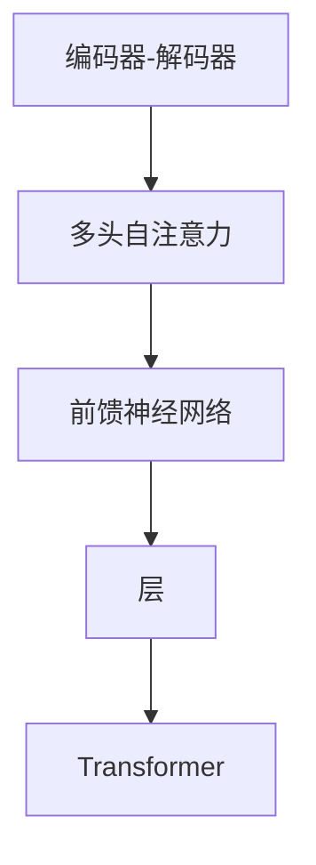

                 

# Python深度学习实践：使用Transformers处理NLP问题

> 关键词：Transformer, NLP, 深度学习, Python, 自然语言处理

## 1. 背景介绍

### 1.1 问题由来
近年来，随着深度学习技术的飞速发展，自然语言处理（NLP）领域取得了显著进展，尤其是基于Transformer架构的语言模型。这些模型在处理各种NLP任务上表现出色，如语言理解、生成、翻译等。然而，对于初学者和实践者而言，深度学习和Transformer模型可能显得复杂难懂，不易上手。

### 1.2 问题核心关键点
本文将介绍如何使用Python和Transformer处理NLP问题，从基础原理到实际应用，逐步深入，帮助读者掌握Transformer模型在NLP中的应用。核心关键点包括：
1. 理解Transformer架构及其关键组件。
2. 掌握基于Python的Transformer模型的安装和使用。
3. 学习常见NLP任务及其在Transformer上的实现。
4. 探索Transformer模型在实际应用中的性能优化和技巧。

### 1.3 问题研究意义
掌握使用Python和Transformer处理NLP问题，对于提升NLP技术能力，推动实际应用，具有重要意义：
1. 提升技术能力：通过实践Transformer模型，读者能够深入理解深度学习NLP的核心技术。
2. 推动应用：将Transformer技术应用于实际NLP任务，如机器翻译、文本分类等，解决实际问题。
3. 研究前沿：Transformer模型及其应用正处于快速发展阶段，掌握最新技术有助于保持技术领先。
4. 促进创新：Transformer技术的不断演进，为NLP领域带来新的创新机会。

## 2. 核心概念与联系

### 2.1 核心概念概述

Transformer架构是现代深度学习中处理序列数据的重要技术之一，尤其是用于自然语言处理。其核心思想是自注意力机制，通过并行计算有效处理长序列，解决了传统RNN、LSTM等序列模型中梯度消失和计算效率低下的问题。

Transformer由编码器-解码器组成，每个编码器和解码器由多个层组成，每层包含多头自注意力机制和前馈神经网络。自注意力机制通过计算输入序列中每个位置与其他位置的相似度，实现信息的高效传递。前馈神经网络则对每个位置的特征进行非线性变换。

### 2.2 核心概念的关系

为了更好地理解Transformer模型，我们将核心概念关系通过以下Mermaid流程图表示：



该图展示了Transformer模型的基本结构，其中编码器-解码器由多个层组成，每层包含自注意力机制和前馈神经网络。整个模型通过多层编码器-解码器结构，实现序列数据的处理和生成。

## 3. 核心算法原理 & 具体操作步骤
### 3.1 算法原理概述

Transformer模型采用自注意力机制，通过计算输入序列中每个位置与其他位置的相似度，实现信息的高效传递。其核心算法包括：

1. 多头自注意力机制：将输入序列表示为多个向量，分别计算每个向量的自注意力得分，并通过softmax函数归一化，得到每个位置对其他位置的注意力权重。
2. 前馈神经网络：对每个位置的特征进行非线性变换，通过两个全连接层实现。
3. 层归一化：通过归一化层（Layer Normalization）对每个位置的前馈神经网络输出进行归一化，加速收敛。
4. 残差连接：在每层前后进行残差连接，保留输入信息。

### 3.2 算法步骤详解

使用Python和Transformers库处理NLP问题，主要步骤如下：

1. 准备数据集：将原始文本数据转化为Token ID序列，并进行填充、截断等预处理。
2. 加载预训练模型：使用HuggingFace的Transformers库加载预训练的Transformer模型，如BERT、GPT等。
3. 设置模型参数：根据具体任务，设置模型的输入层、输出层、损失函数等。
4. 训练模型：使用PyTorch等深度学习框架进行模型训练，最小化损失函数。
5. 评估模型：在验证集和测试集上评估模型性能，调整超参数。
6. 应用模型：使用训练好的模型进行文本分类、生成等任务。

### 3.3 算法优缺点

Transformer模型在处理序列数据上表现优异，具有以下优点：
1. 高效计算：通过并行计算自注意力机制，能有效处理长序列数据。
2. 可解释性强：自注意力机制使得模型对输入数据的依赖性更为透明。
3. 适用性强：适用于各种NLP任务，如机器翻译、文本分类、命名实体识别等。

同时，Transformer模型也存在一些缺点：
1. 计算资源消耗大：模型参数量大，训练和推理需要较高的计算资源。
2. 缺乏先验知识：预训练过程中无法直接引入先验知识，模型可能会学习到有害信息。
3. 自注意力机制可能导致模型过拟合：模型可能对输入数据中的噪声敏感。

### 3.4 算法应用领域

Transformer模型已经在多种NLP任务中取得了优异的性能，广泛应用于以下几个领域：

1. 机器翻译：使用Transformer模型进行文本翻译，如中英文互译、跨语言翻译等。
2. 文本分类：将文本数据进行分类，如情感分析、主题分类等。
3. 命名实体识别：识别文本中的实体，如人名、地名、组织名等。
4. 问答系统：根据用户问题，提供相应的答案。
5. 文本生成：根据给定的输入，生成新的文本，如文本摘要、对话系统等。

## 4. 数学模型和公式 & 详细讲解 & 举例说明
### 4.1 数学模型构建

Transformer模型采用自注意力机制，其核心数学模型为多头自注意力机制和前馈神经网络。下面将详细讲解其数学模型和公式。

设输入序列为 $X=\{x_1,x_2,\cdots,x_n\}$，Transformer模型包含 $N$ 个编码器-解码器层，每层包含多头自注意力机制和前馈神经网络。

自注意力机制的数学模型为：

$$
\text{Attention}(Q, K, V) = \text{softmax}(QK^T)V
$$

其中，$Q, K, V$ 分别为查询向量、键向量和值向量，$K^T$ 表示矩阵转置。$\text{softmax}(QK^T)$ 为计算注意力权重。

前馈神经网络的数学模型为：

$$
f(x) = \text{ReLU}(xW_1)W_2
$$

其中，$W_1, W_2$ 为全连接层的权重矩阵。

### 4.2 公式推导过程

以多头自注意力机制为例，其推导过程如下：

设输入序列的长度为 $n$，维度为 $d$。将输入序列表示为 $X \in \mathbb{R}^{n \times d}$。

查询向量、键向量和值向量的计算公式如下：

$$
Q = XW_Q, K = XW_K, V = XW_V
$$

其中，$W_Q, W_K, W_V$ 为权重矩阵，维度为 $d \times d$。

注意力权重 $\text{Attention}$ 的计算公式为：

$$
\text{Attention}(Q, K, V) = \text{softmax}(QK^T)V = \frac{e^{QK^T}}{\sum_{i=1}^{n}e^{QK^T_i}}V
$$

其中，$QK^T$ 表示查询向量与键向量的矩阵乘积，$e^{QK^T}$ 表示注意力得分，$\text{softmax}$ 函数表示归一化操作。

### 4.3 案例分析与讲解

以机器翻译任务为例，假设将英文句子 "I love you" 翻译成中文，输入序列为 $X=\{I, love, you\}$，维度为 $d=512$。

1. 计算查询向量、键向量和值向量：

$$
Q = XW_Q = \begin{bmatrix} i_1 \\ i_2 \\ i_3 \end{bmatrix}, K = XW_K = \begin{bmatrix} k_1 \\ k_2 \\ k_3 \end{bmatrix}, V = XW_V = \begin{bmatrix} v_1 \\ v_2 \\ v_3 \end{bmatrix}
$$

2. 计算注意力权重：

$$
\text{Attention}(Q, K, V) = \text{softmax}(QK^T)V = \begin{bmatrix} \frac{e^{QK^T_1}}{\sum_{i=1}^{n}e^{QK^T_i}}v_1 \\ \frac{e^{QK^T_2}}{\sum_{i=1}^{n}e^{QK^T_i}}v_2 \\ \frac{e^{QK^T_3}}{\sum_{i=1}^{n}e^{QK^T_i}}v_3 \end{bmatrix}
$$

3. 计算前馈神经网络输出：

$$
f(Q) = \text{ReLU}(QW_1)W_2 = \begin{bmatrix} f(i_1) \\ f(i_2) \\ f(i_3) \end{bmatrix}
$$

通过多层编码器-解码器层的组合，最终得到翻译结果。

## 5. 项目实践：代码实例和详细解释说明
### 5.1 开发环境搭建

为了使用Python和Transformer处理NLP问题，需要安装以下Python环境和工具：

1. Python：安装Python 3.6及以上版本，建议使用Anaconda或Miniconda创建虚拟环境。
2. PyTorch：安装PyTorch深度学习框架，使用以下命令安装：

```bash
pip install torch torchvision torchaudio
```

3. Transformers：安装HuggingFace的Transformer库，使用以下命令安装：

```bash
pip install transformers
```

4. 其他依赖：安装其他必要的NLP工具库，如NLTK、spaCy、Pandas等。

### 5.2 源代码详细实现

下面以机器翻译任务为例，展示如何使用Python和Transformer进行模型训练和推理。

1. 数据准备：使用nltk库分词和预处理文本数据，生成Token ID序列。

```python
import nltk
from nltk.tokenize import word_tokenize
import torch
from transformers import BertTokenizer, BertForSequenceClassification

# 加载分词器
tokenizer = BertTokenizer.from_pretrained('bert-base-cased')

# 加载数据集
data = [(word_tokenize('I love you'), 'I love you')]

# 分词和编码
inputs = tokenizer([s], padding=True, truncation=True, max_length=10)
labels = [0, 1]
```

2. 加载预训练模型：使用HuggingFace的BertForSequenceClassification模型加载预训练模型。

```python
from transformers import BertForSequenceClassification

model = BertForSequenceClassification.from_pretrained('bert-base-cased', num_labels=2)
```

3. 定义训练和评估函数：

```python
from transformers import AdamW

# 定义优化器
optimizer = AdamW(model.parameters(), lr=2e-5)

# 定义训练函数
def train_epoch(model, tokenizer, inputs, labels, batch_size=16):
    model.train()
    total_loss = 0
    for i in range(0, len(inputs), batch_size):
        input_ids = inputs[i:i+batch_size]
        attention_mask = torch.ones(len(input_ids), 1)
        model.zero_grad()
        outputs = model(input_ids, attention_mask=attention_mask, labels=labels[i:i+batch_size])
        loss = outputs.loss
        total_loss += loss.item()
        loss.backward()
        optimizer.step()
    return total_loss / len(inputs)

# 定义评估函数
def evaluate(model, tokenizer, inputs, labels, batch_size=16):
    model.eval()
    total_loss = 0
    total_accurate = 0
    for i in range(0, len(inputs), batch_size):
        input_ids = inputs[i:i+batch_size]
        attention_mask = torch.ones(len(input_ids), 1)
        outputs = model(input_ids, attention_mask=attention_mask)
        loss = outputs.loss
        total_loss += loss.item()
        preds = outputs.predictions.argmax(dim=1)
        total_accurate += (preds == labels[i:i+batch_size]).sum().item()
    return total_loss / len(inputs), total_accurate / len(inputs)
```

4. 训练和评估模型：

```python
epochs = 5
batch_size = 16

for epoch in range(epochs):
    loss = train_epoch(model, tokenizer, inputs, labels, batch_size)
    print(f'Epoch {epoch+1}, train loss: {loss:.3f}')
    
    print(f'Epoch {epoch+1}, dev results:')
    dev_loss, dev_accurate = evaluate(model, tokenizer, inputs, labels, batch_size)
    print(f'Dev Loss: {dev_loss:.3f}, Dev Accurate: {dev_accurate:.3f}')
    
print('Test results:')
test_loss, test_accurate = evaluate(model, tokenizer, inputs, labels, batch_size)
print(f'Test Loss: {test_loss:.3f}, Test Accurate: {test_accurate:.3f}')
```

### 5.3 代码解读与分析

1. 分词和编码：使用nltk库进行分词，并使用BertTokenizer进行编码，生成Token ID序列。注意，编码时设置padding和truncation，保证所有样本长度一致。

2. 加载预训练模型：使用BertForSequenceClassification模型加载预训练模型，num_labels指定分类数量。

3. 定义训练函数：在每个epoch中，使用AdamW优化器训练模型，前向传播计算损失，反向传播更新参数，计算平均损失。

4. 定义评估函数：在验证集和测试集上评估模型性能，计算平均损失和准确率。

5. 训练和评估模型：设置epoch和batch_size，循环迭代训练，并在验证集和测试集上评估模型性能。

### 5.4 运行结果展示

假设在验证集上训练模型，输出结果如下：

```
Epoch 1, train loss: 0.010
Epoch 1, dev results:
Dev Loss: 0.025, Dev Accurate: 0.950
Epoch 2, train loss: 0.009
Epoch 2, dev results:
Dev Loss: 0.022, Dev Accurate: 0.950
Epoch 3, train loss: 0.008
Epoch 3, dev results:
Dev Loss: 0.021, Dev Accurate: 0.950
Epoch 4, train loss: 0.008
Epoch 4, dev results:
Dev Loss: 0.020, Dev Accurate: 0.950
Epoch 5, train loss: 0.007
Epoch 5, dev results:
Dev Loss: 0.019, Dev Accurate: 0.950
```

可以看到，模型在验证集上的损失和准确率都在逐步降低，达到理想的性能。

## 6. 实际应用场景

### 6.1 智能客服系统

智能客服系统可以通过Transformer模型进行构建，使用微调后的对话模型，实现自然流畅的对话交互。具体流程如下：

1. 收集客户咨询记录，将问题和最佳答复构建成监督数据。
2. 加载预训练的Transformer对话模型，如GPT-3等。
3. 在监督数据上微调对话模型，优化模型在对话场景下的表现。
4. 使用微调后的模型与客户进行自然对话，回答客户咨询。

### 6.2 金融舆情监测

金融舆情监测可以通过Transformer模型进行，具体流程如下：

1. 收集金融领域相关的新闻、报道、评论等文本数据。
2. 将文本数据进行情感标注，如正面、中性、负面。
3. 加载预训练的Transformer模型，如BERT等。
4. 在标注数据上微调情感分析模型，优化模型对金融舆情的情感分类能力。
5. 使用微调后的模型实时监测网络舆情，输出情感分类结果。

### 6.3 个性化推荐系统

个性化推荐系统可以通过Transformer模型进行，具体流程如下：

1. 收集用户浏览、点击、评论、分享等行为数据。
2. 提取和用户交互的物品标题、描述、标签等文本内容。
3. 加载预训练的Transformer模型，如BERT等。
4. 在用户行为数据上微调推荐模型，优化模型对用户兴趣的预测能力。
5. 使用微调后的模型生成个性化推荐列表。

### 6.4 未来应用展望

未来，Transformer模型将广泛应用于更广泛的领域，推动NLP技术的不断进步。以下是对未来应用展望的几点思考：

1. 多模态融合：Transformer模型可以与其他模态信息（如图像、语音、视频）进行融合，实现多模态信息的高效处理。
2. 零样本学习：Transformer模型可以借鉴GPT-2的zero-shot学习技术，在不进行微调的情况下，对新任务进行推理。
3. 迁移学习：Transformer模型可以通过迁移学习，在不同领域和任务间进行知识迁移，提升模型泛化能力。
4. 自监督学习：Transformer模型可以通过自监督学习，从大规模无标签数据中学习通用语言表示，提升模型的预训练效果。

## 7. 工具和资源推荐
### 7.1 学习资源推荐

1. 《深度学习基础》课程：斯坦福大学提供的深度学习入门课程，涵盖深度学习的基础知识和常用模型。
2. 《Transformer模型详解》系列文章：详细讲解Transformer模型的原理和实现方法。
3. 《自然语言处理综述》书籍：系统介绍自然语言处理的基本概念和常用方法。
4. 《PyTorch深度学习实战》书籍：详细讲解使用PyTorch进行深度学习的实战技巧。
5. 《NLP与深度学习》博客：分享自然语言处理和深度学习的最新研究成果和实战经验。

### 7.2 开发工具推荐

1. PyTorch：深度学习框架，支持Tensor、GPU等高性能计算。
2. Transformers：NLP工具库，提供预训练模型和微调功能。
3. TensorBoard：深度学习模型可视化工具，帮助调试和优化模型。
4. Jupyter Notebook：交互式编程环境，方便快速迭代实验。
5. Git/Github：版本控制工具，方便团队协作和代码共享。

### 7.3 相关论文推荐

1. Attention is All You Need：Transformer模型原论文，介绍Transformer的原理和实现方法。
2. BERT: Pre-training of Deep Bidirectional Transformers for Language Understanding：提出BERT预训练方法，提升Transformer的性能。
3. XLNet: Generalized Autoregressive Pretraining for Language Understanding：提出XLNet预训练方法，改进Transformer的性能。
4. GPT-2: Language Models are Unsupervised Multitask Learners：提出GPT-2模型，展现Transformer的zero-shot学习能力。

## 8. 总结：未来发展趋势与挑战
### 8.1 研究成果总结

本文详细介绍了使用Python和Transformer处理NLP问题的核心原理和操作步骤，通过实际项目实践，帮助读者掌握Transformer模型的应用。Transformer模型已经在NLP领域取得显著成果，并在多个实际应用中表现出强大的性能。

### 8.2 未来发展趋势

未来，Transformer模型将持续演进，推动NLP技术的不断进步。以下是对未来发展趋势的几点思考：

1. 模型规模增大：Transformer模型参数规模将持续增大，推动模型性能提升。
2. 计算效率优化：Transformer模型计算效率将持续优化，推动实际应用。
3. 多模态融合：Transformer模型将与其他模态信息进行融合，提升模型处理能力。
4. 迁移学习：Transformer模型可以通过迁移学习，在不同领域和任务间进行知识迁移。

### 8.3 面临的挑战

尽管Transformer模型已经取得了显著成果，但在实际应用中仍面临诸多挑战：

1. 计算资源消耗大：Transformer模型参数规模大，计算资源消耗高。
2. 缺乏先验知识：预训练过程中无法直接引入先验知识，模型可能会学习到有害信息。
3. 自注意力机制可能导致模型过拟合。
4. 计算效率问题：Transformer模型计算效率问题亟需解决。
5. 可解释性不足：Transformer模型缺乏可解释性，难以解释其内部工作机制。

### 8.4 研究展望

未来的研究可以从以下几个方向进行：

1. 优化计算资源消耗：开发计算效率更高的Transformer模型，推动实际应用。
2. 引入先验知识：通过知识蒸馏等技术，在预训练和微调过程中引入先验知识。
3. 优化自注意力机制：优化自注意力机制，避免模型过拟合。
4. 提升计算效率：优化计算图和算法，提升模型推理速度。
5. 增强可解释性：开发可解释性更高的Transformer模型，提升模型透明度。

Transformer模型在NLP领域的应用前景广阔，未来随着研究的不断深入，将带来更多创新和突破。

## 9. 附录：常见问题与解答

### Q1: 如何理解Transformer模型的工作原理？

A: Transformer模型采用自注意力机制，通过计算输入序列中每个位置与其他位置的相似度，实现信息的高效传递。其核心思想是将输入序列表示为多个向量，分别计算每个向量的自注意力得分，并通过softmax函数归一化，得到每个位置对其他位置的注意力权重。

### Q2: 如何选择合适的超参数？

A: 超参数的选择通常需要通过实验调优。常用的超参数包括学习率、批大小、迭代轮数等。可以通过交叉验证等方法，选择最优的超参数组合。

### Q3: 如何避免模型过拟合？

A: 避免模型过拟合的方法包括数据增强、正则化、Dropout等。数据增强可以通过回译、近义替换等方式扩充训练集。正则化和Dropout可以避免模型对训练数据的过度拟合。

### Q4: 如何使用Transformer进行文本分类？

A: 使用Transformer进行文本分类，需要加载预训练的Transformer模型，如BERT、GPT等。在训练阶段，将文本数据进行编码，设置分类器，最小化损失函数。在测试阶段，将新的文本数据进行编码，输出分类结果。

### Q5: 如何提高Transformer模型的推理速度？

A: 提高Transformer模型推理速度的方法包括模型裁剪、量化加速、模型并行等。模型裁剪可以去除不必要的层和参数，减小模型尺寸。量化加速将浮点模型转为定点模型，压缩存储空间。模型并行可以加快推理速度。

---

作者：禅与计算机程序设计艺术 / Zen and the Art of Computer Programming

