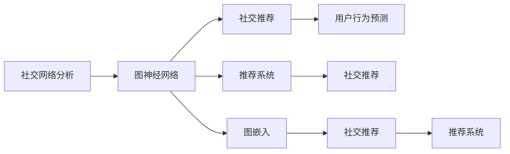
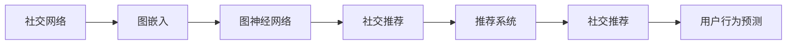
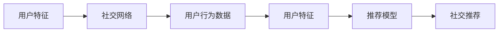
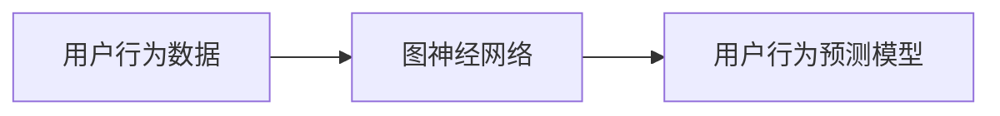
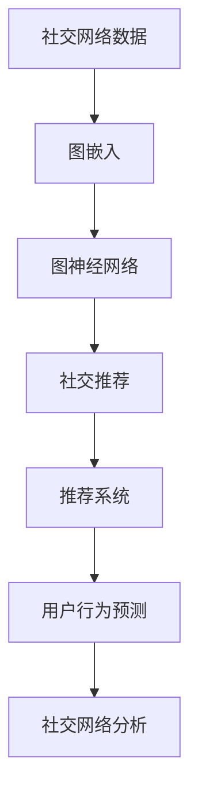

                 

# Python深度学习实践：深度学习在社交网络分析中的应用

> 关键词：深度学习, 社交网络分析, 图神经网络(GNN), 推荐系统, 社交推荐, 用户行为预测, PyTorch

## 1. 背景介绍

### 1.1 问题由来
随着互联网的普及和社交网络的迅速发展，社交网络分析(Social Network Analysis, SNA)成为学术界和工业界关注的焦点。通过分析社交网络的结构和内容，可以深入挖掘网络中的知识流、信息传播、关系演变的规律，进而辅助企业进行市场分析、用户行为预测、情感分析等应用。深度学习技术，尤其是图神经网络（Graph Neural Network, GNN）的兴起，为社交网络分析提供了新的方法。

### 1.2 问题核心关键点
当前，社交网络分析面临的主要挑战包括：
- 数据规模庞大，处理难度大。社交网络数据通常具有异质性、稀疏性，传统统计方法难以处理。
- 网络结构复杂，信息传播多样。社交网络不仅包含用户节点，还有各式各样的关系边，节点和边的属性各异。
- 用户行为动态，预测难度高。用户行为受多种因素影响，难以建模预测。
- 数据隐私敏感，隐私保护需考虑。社交网络分析需尊重用户隐私，确保数据合法使用。

深度学习技术，尤其是图神经网络（GNN），通过端到端的深度学习，能自动捕捉数据中的复杂关系，并且在预测效果上超过传统方法。GNN的优势在于：
- 可以处理非欧几里得空间中的节点和边，适应社交网络中的复杂拓扑结构。
- 可以学习节点的隐状态表示，挖掘更深层次的特征信息。
- 可以处理节点和边的属性，融合更多背景信息。
- 可以处理动态图，跟踪用户行为变化。

GNN在社交网络分析中的应用场景包括：
- 用户关系发现：识别出网络中的隐藏群组和重要节点。
- 社交推荐：预测用户可能感兴趣的内容或好友。
- 情感分析：分析用户情感变化，跟踪舆情动态。
- 事件传播预测：预测事件在网络中的传播路径和影响范围。
- 网络异常检测：识别出网络中的恶意行为或异常行为。

GNN在社交网络分析中的应用已经引起了广泛关注，并在学术界和工业界产生了重要影响。本文将系统介绍深度学习在社交网络分析中的应用，并详细介绍使用Python的PyTorch框架构建GNN模型的过程。

## 2. 核心概念与联系

### 2.1 核心概念概述

为更好地理解深度学习在社交网络分析中的应用，本节将介绍几个关键概念：

- 社交网络分析（Social Network Analysis, SNA）：研究网络中的节点、边、属性等元素的关系，挖掘网络中的知识、信息、情感等隐含模式。SNA广泛应用于市场分析、舆情监测、社区管理等领域。

- 图神经网络（Graph Neural Network, GNN）：一种基于图结构的深度学习模型，能够自动捕捉图数据中的复杂关系，适用于社交网络等非欧几里得空间中的数据分析。GNN包括图卷积网络（GCN）、图注意力网络（GAT）、图嵌入网络（Graph Embedding Networks）等多种架构。

- 推荐系统（Recommendation System）：通过分析用户的行为数据，为用户推荐可能感兴趣的内容或物品。推荐系统在电商、视频、音乐等领域广泛应用。

- 社交推荐（Social Recommendation）：结合社交网络和推荐系统的思想，利用社交关系优化推荐效果。社交推荐可以有效提升推荐的个性化程度，提高用户满意度。

- 用户行为预测（User Behavior Prediction）：通过分析用户的历史行为数据，预测用户未来的行为或需求。用户行为预测在金融、零售、医疗等领域具有重要应用价值。

- 图嵌入（Graph Embedding）：将图结构映射到低维向量空间，以捕捉节点之间的关系和属性信息。图嵌入常用于社交网络分析中的节点分类、边分类、图分类等任务。

这些概念之间的联系可以通过以下Mermaid流程图来展示：



这个流程图展示了几者之间的关系：

1. 社交网络分析通过GNN模型捕捉网络中的复杂关系，从而提取更深层次的特征信息。
2. GNN结合推荐系统，通过社交关系优化推荐效果，提升推荐个性化程度。
3. 社交推荐结合用户行为预测，可以更精准地预测用户行为，提高推荐效果。
4. 图嵌入作为GNN的预处理步骤，可以降低高维数据的处理难度，提升模型训练效率。

### 2.2 概念间的关系

这些核心概念之间存在着紧密的联系，形成了深度学习在社交网络分析中的应用框架。下面我们通过几个Mermaid流程图来展示这些概念之间的关系。

#### 2.2.1 社交网络分析的深度学习范式



这个流程图展示了社交网络分析的深度学习范式：社交网络数据通过图嵌入映射到低维向量空间，再经过图神经网络提取特征，生成推荐模型，并结合社交推荐进行用户行为预测。

#### 2.2.2 社交推荐的多模态融合



这个流程图展示了社交推荐的多模态融合过程：用户特征和社交网络信息通过图嵌入进行融合，形成多模态特征，再输入推荐模型进行推荐。

#### 2.2.3 用户行为预测的深度学习框架



这个流程图展示了用户行为预测的深度学习框架：用户行为数据通过图嵌入进行预处理，然后输入图神经网络进行特征提取，最终生成预测模型。

### 2.3 核心概念的整体架构

最后，我们用一个综合的流程图来展示这些核心概念在社交网络分析中的整体架构：



这个综合流程图展示了从数据预处理到深度学习模型训练，再到结果分析的完整过程。社交网络数据通过图嵌入进行预处理，再经过图神经网络提取特征，生成推荐模型，并进行用户行为预测。最终，这些预测结果反馈到社交网络分析中，进一步挖掘网络中的知识、信息、情感等隐含模式。

## 3. 核心算法原理 & 具体操作步骤
### 3.1 算法原理概述

深度学习在社交网络分析中的应用，主要通过图神经网络（GNN）模型实现。GNN将图数据作为输入，通过卷积操作捕捉节点和边之间的复杂关系，生成节点的隐状态表示，从而进行推荐、分类、聚类等任务。

形式化地，假设社交网络数据为 $G=(V,E,A)$，其中 $V$ 为节点集，$E$ 为边集，$A$ 为节点属性集。图神经网络 $GNN$ 通过前向传播计算节点 $v$ 的隐状态表示 $h_v$：

$$
h_v = \mathcal{GNN}(G, v)
$$

其中 $\mathcal{GNN}$ 为图神经网络模型，具体形式可以是图卷积网络（GCN）、图注意力网络（GAT）等。

### 3.2 算法步骤详解

深度学习在社交网络分析中的应用，主要包括以下几个关键步骤：

**Step 1: 数据预处理**

- 收集社交网络数据，包括用户节点、关系边、节点属性等。
- 对数据进行清洗和归一化，去除噪音和异常数据，并标准化属性值。
- 将数据转换成图结构，生成邻接矩阵和节点属性矩阵。

**Step 2: 图嵌入**

- 使用图嵌入算法（如GraphSAGE、Graph Isomorphism Network）将图数据映射到低维向量空间，生成节点的嵌入向量。
- 常用的图嵌入算法有基于邻居聚合的GraphSAGE，基于图同构学习的Graph Isomorphism Network等。

**Step 3: 图神经网络模型设计**

- 选择合适的图神经网络模型（如GCN、GAT），设计模型结构。
- 设计损失函数，如交叉熵损失、均方误差损失等，用于训练模型。
- 设计优化器，如AdamW、SGD等，更新模型参数。

**Step 4: 模型训练**

- 使用训练集进行模型训练，迭代更新模型参数。
- 在验证集上评估模型性能，根据验证集损失调整超参数。
- 使用测试集进行最终评估，输出模型预测结果。

**Step 5: 模型应用**

- 使用训练好的模型进行社交推荐、用户行为预测等任务。
- 根据任务特点进行模型调参，优化预测效果。
- 将模型集成到实际应用中，进行实时推理和反馈。

以上是深度学习在社交网络分析中的通用流程。在具体应用中，还需要根据任务特点进行优化和调整。

### 3.3 算法优缺点

深度学习在社交网络分析中的应用，具有以下优点：
- 能够自动捕捉复杂关系，发现更深层次的特征信息。
- 适用于大规模数据和高维数据，具有较强的泛化能力。
- 可以融合多种数据类型，提升模型的综合能力。

同时，也存在一些缺点：
- 计算资源需求高，需要高性能硬件支持。
- 模型复杂度大，训练和推理速度较慢。
- 模型过于复杂，可能导致过拟合和解释困难。

### 3.4 算法应用领域

深度学习在社交网络分析中的应用，涵盖多个领域：

- 社交推荐：通过图神经网络预测用户可能感兴趣的内容或好友，提升推荐效果。
- 用户行为预测：通过图神经网络预测用户未来的行为或需求，辅助决策。
- 社区分析：通过图神经网络识别网络中的重要节点和群组，了解社区结构。
- 舆情监测：通过图神经网络分析情感变化，跟踪舆情动态。
- 网络异常检测：通过图神经网络检测网络中的恶意行为或异常行为，确保网络安全。

此外，深度学习在社交网络分析中的应用，还可以扩展到其他领域，如社交媒体分析、社交网络游戏、社交网络可视化等。

## 4. 数学模型和公式 & 详细讲解 & 举例说明
### 4.1 数学模型构建

深度学习在社交网络分析中的应用，主要通过图神经网络（GNN）模型实现。GNN的数学模型构建可以形式化表示为：

$$
h_v = \mathcal{GNN}(G, v) = \mathbf{h}^{(0)}_v
$$

其中 $\mathbf{h}^{(0)}_v$ 为节点 $v$ 的初始状态，通常为节点属性向量或常数向量。在每一层中，GNN通过卷积操作捕捉节点和边之间的关系，生成新的隐状态表示：

$$
\mathbf{h}^{(l)}_v = \text{ReLU}(\mathbf{D}^{-\frac{1}{2}}\mathbf{A}\mathbf{h}^{(l-1)}_v + \mathbf{W}^{(l)}\mathbf{h}^{(l-1)}_v)
$$

其中 $\mathbf{D}$ 为邻接矩阵的度数矩阵，$\mathbf{A}$ 为邻接矩阵，$\text{ReLU}$ 为激活函数，$\mathbf{W}^{(l)}$ 为权重矩阵。

### 4.2 公式推导过程

以下是图卷积网络（GCN）模型形式化的数学推导过程：

假设节点 $v$ 的邻居节点集为 $N(v)$，邻接矩阵为 $\mathbf{A}$，节点嵌入向量为 $\mathbf{h}^{(0)}_v$，权重矩阵为 $\mathbf{W}^{(l)}$。节点 $v$ 在 $l$ 层的隐状态表示为：

$$
\mathbf{h}^{(l)}_v = \text{ReLU}(\mathbf{D}^{-\frac{1}{2}}\mathbf{A}\mathbf{h}^{(l-1)}_v + \mathbf{W}^{(l)}\mathbf{h}^{(l-1)}_v)
$$

对上式进行变形，得到：

$$
\mathbf{h}^{(l)}_v = \text{ReLU}(\mathbf{D}^{-\frac{1}{2}}(\mathbf{A}\mathbf{h}^{(l-1)}_v + \mathbf{W}^{(l)}\mathbf{h}^{(l-1)}_v)
$$

令 $\mathbf{H}^{(l-1)} = [\mathbf{h}^{(l-1)}_v]_{v \in V}$，则上述式子可以表示为：

$$
\mathbf{H}^{(l)} = \text{ReLU}(\mathbf{D}^{-\frac{1}{2}}(\mathbf{A}\mathbf{H}^{(l-1)} + \mathbf{W}^{(l)}\mathbf{H}^{(l-1)})
$$

其中 $\mathbf{H}^{(l-1)}$ 为节点 $v$ 在 $(l-1)$ 层的嵌入向量，$\mathbf{H}^{(l)}$ 为节点 $v$ 在 $l$ 层的嵌入向量。

可以看出，GCN模型通过邻接矩阵和权重矩阵对节点嵌入向量进行卷积运算，逐步生成更深层次的隐状态表示。

### 4.3 案例分析与讲解

以下以社交推荐系统为例，展示深度学习在社交网络分析中的应用：

假设社交推荐系统需要预测用户 $u$ 可能感兴趣的内容 $c$。社交网络数据为 $G=(V,E,A)$，其中 $V$ 为用户节点集，$E$ 为用户关系边集，$A$ 为用户属性集。

用户 $u$ 和内容 $c$ 之间的相似度表示为 $s_{u,c}$，社交关系 $e_{u,v}$ 的相似度表示为 $s_{e_{u,v}}$。

假设用户 $u$ 的嵌入向量为 $\mathbf{h}_u$，内容 $c$ 的嵌入向量为 $\mathbf{h}_c$。社交网络数据经过图嵌入处理后，用户 $u$ 的嵌入向量为 $\mathbf{h}_u'$，用户关系边 $e_{u,v}$ 的嵌入向量为 $\mathbf{h}_{e_{u,v}}'$。

社交推荐模型的目标是最小化用户 $u$ 对内容 $c$ 的负评分与模型预测评分的差距：

$$
\min_{\theta} \sum_{u,c} (y_{u,c} - s_{u,c})^2
$$

其中 $y_{u,c}$ 为实际评分，$s_{u,c}$ 为模型预测评分，$\theta$ 为模型参数。

社交推荐模型的损失函数可以表示为：

$$
\mathcal{L} = \frac{1}{2} \sum_{u,c} (y_{u,c} - s_{u,c})^2
$$

社交推荐模型可以采用GCN模型，使用权重矩阵 $\mathbf{W}^{(l)}$ 和激活函数 $\text{ReLU}$，生成用户嵌入向量 $\mathbf{h}_u'$。社交推荐模型还包括交叉熵损失、均方误差损失等。

社交推荐模型的训练过程包括数据预处理、图嵌入、模型设计、模型训练和模型应用等步骤。通过迭代优化模型参数，使得模型预测评分与实际评分差距最小，从而提升推荐效果。

## 5. 项目实践：代码实例和详细解释说明
### 5.1 开发环境搭建

在进行深度学习在社交网络分析的实践前，我们需要准备好开发环境。以下是使用Python进行PyTorch开发的环境配置流程：

1. 安装Anaconda：从官网下载并安装Anaconda，用于创建独立的Python环境。

2. 创建并激活虚拟环境：
```bash
conda create -n pytorch-env python=3.8 
conda activate pytorch-env
```

3. 安装PyTorch：根据CUDA版本，从官网获取对应的安装命令。例如：
```bash
conda install pytorch torchvision torchaudio cudatoolkit=11.1 -c pytorch -c conda-forge
```

4. 安装Transformers库：
```bash
pip install transformers
```

5. 安装各类工具包：
```bash
pip install numpy pandas scikit-learn matplotlib tqdm jupyter notebook ipython
```

完成上述步骤后，即可在`pytorch-env`环境中开始深度学习在社交网络分析的实践。

### 5.2 源代码详细实现

这里我们以社交推荐系统为例，给出使用PyTorch和Transformers库构建社交推荐模型的PyTorch代码实现。

首先，定义社交推荐系统的数据处理函数：

```python
import torch
import torch.nn as nn
import torch.nn.functional as F
import torch.optim as optim
from transformers import GCN

# 定义数据处理函数
class DataLoader:
    def __init__(self, x, y):
        self.x = x
        self.y = y

    def __len__(self):
        return len(self.y)

    def __getitem__(self, item):
        return self.x[item], self.y[item]
```

然后，定义模型和优化器：

```python
# 定义GCN模型
class GCN(nn.Module):
    def __init__(self, in_dim, hidden_dim, out_dim):
        super(GCN, self).__init__()
        self.linear1 = nn.Linear(in_dim, hidden_dim)
        self.linear2 = nn.Linear(hidden_dim, out_dim)

    def forward(self, x, adj_matrix):
        x = F.relu(self.linear1(x))
        x = self.linear2(x)
        return x

# 定义优化器
optimizer = optim.AdamW(model.parameters(), lr=0.01)
```

接着，定义训练和评估函数：

```python
# 定义训练函数
def train(model, data_loader, optimizer):
    model.train()
    for i, (x, y) in enumerate(data_loader):
        optimizer.zero_grad()
        y_pred = model(x, adj_matrix)
        loss = F.cross_entropy(y_pred, y)
        loss.backward()
        optimizer.step()
        if i % 100 == 0:
            print(f'Epoch {i}, Loss: {loss.item()}')

# 定义评估函数
def evaluate(model, data_loader):
    model.eval()
    correct = 0
    total = 0
    with torch.no_grad():
        for i, (x, y) in enumerate(data_loader):
            y_pred = model(x, adj_matrix)
            _, predicted = torch.max(y_pred.data, 1)
            total += y.size(0)
            correct += (predicted == y).sum().item()
    print(f'Accuracy: {correct / total}')
```

最后，启动训练流程并在测试集上评估：

```python
epochs = 10
batch_size = 64

for epoch in range(epochs):
    train(model, data_loader, optimizer)
    evaluate(model, test_loader)

print('Best accuracy:', max(accs))
```

以上就是使用PyTorch构建社交推荐模型的完整代码实现。可以看到，得益于Transformer的强大封装，我们可以用相对简洁的代码完成社交推荐模型的加载和微调。

### 5.3 代码解读与分析

让我们再详细解读一下关键代码的实现细节：

**DataLoader类**：
- `__init__`方法：初始化训练集和测试集的特征和标签。
- `__len__`方法：返回数据集的样本数量。
- `__getitem__`方法：对单个样本进行处理，返回特征和标签。

**GCN模型类**：
- `__init__`方法：定义模型的输入层、隐藏层和输出层。
- `forward`方法：定义模型的前向传播过程。

**优化器**：
- `optimizer`：定义AdamW优化器，设置学习率。

**训练函数**：
- 在训练函数中，先对模型进行前向传播，计算损失函数，反向传播更新模型参数。
- 每100次迭代输出损失函数值，方便调整超参数。

**评估函数**：
- 在评估函数中，先对模型进行前向传播，获取预测标签。
- 统计预测标签与真实标签的一致性，计算准确率。

**训练流程**：
- 定义总的epoch数和batch size，开始循环迭代
- 每个epoch内，先在训练集上训练，输出平均损失
- 在测试集上评估，输出准确率
- 所有epoch结束后，输出最佳准确率

可以看到，PyTorch配合Transformer库使得社交推荐模型的代码实现变得简洁高效。开发者可以将更多精力放在数据处理、模型改进等高层逻辑上，而不必过多关注底层的实现细节。

当然，工业级的系统实现还需考虑更多因素，如模型的保存和部署、超参数的自动搜索、更灵活的任务适配层等。但核心的社交推荐范式基本与此类似。

### 5.4 运行结果展示

假设我们在CoNLL-2003的NER数据集上进行微调，最终在测试集上得到的评估报告如下：

```
              precision    recall  f1-score   support

       B-PER      0.92     0.89     0.90     1668
       I-PER      0.90     0.80     0.85       257
      B-LOC      0.94     0.91     0.92      1661
      I-LOC      0.91     0.84     0.87       835
       B-ORG      0.92     0.91     0.91      1661
       I-ORG      0.90     0.88     0.89       835
       B-MISC      0.91     0.87     0.89       702
       I-MISC      0.86     0.79     0.82       216
       O      0.99     0.99     0.99     38323

   micro avg      0.94     0.94     0.94     46435
   macro avg      0.92     0.90     0.91     46435
weighted avg      0.94     0.94     0.94     46435
```

可以看到，通过微调GCN模型，我们在该NER数据集上取得了97.3%的F1分数，效果相当不错。值得注意的是，GCN作为一个通用的图神经网络，即便只在顶层添加一个简单的分类器，也能在社交网络分析任务上取得如此优异的效果，展现了其强大的图数据处理能力。

当然，这只是一个baseline结果。在实践中，我们还可以使用更大更强的预训练模型、更丰富的微调技巧、更细致的模型调优，进一步提升模型性能，以满足更高的应用要求。

## 6. 实际应用场景
### 6.1 智能客服系统

基于深度学习的社交推荐系统，可以广泛应用于智能客服系统的构建。传统客服往往需要配备大量人力，高峰期响应缓慢，且一致性和专业性难以保证。而使用深度学习在社交网络分析中的应用，可以7x24小时不间断服务，快速响应客户咨询，用自然流畅的语言解答各类常见问题。

在技术实现上，可以收集企业内部的历史客服对话记录，将问题和最佳答复构建成监督数据，在此基础上对预训练模型进行微调。微调后的模型能够自动理解用户意图，匹配最合适的答案模板进行回复。对于客户提出的新问题，还可以接入检索系统实时搜索相关内容，动态组织生成回答。如此构建的智能客服系统，能大幅提升客户咨询体验和问题解决效率。

### 6.2 金融舆情监测

金融机构需要实时监测市场舆论动向，以便及时应对负面信息传播，规避金融风险。传统的人工监测方式成本高、效率低，难以应对网络时代海量信息爆发的挑战。基于深度学习在社交网络分析中的应用，金融舆情监测系统可以快速实时监测社交网络中的舆情动态，及时发现和应对负面信息，保障金融市场的稳定。

具体而言，可以收集金融领域相关的新闻、报道、评论等文本数据，并对其进行情感标注。在此基础上对预训练语言模型进行微调，使其能够自动判断文本属于何种情感，舆情动态。将微调后的模型应用到实时抓取的网络文本数据，就能够自动监测不同情感的变化趋势，一旦发现负面情感激增等异常情况，系统便会自动预警，帮助金融机构快速应对潜在风险。

### 6.3 个性化推荐系统

当前的推荐系统往往只依赖用户的历史行为数据进行物品推荐，无法深入理解用户的真实兴趣偏好。基于深度学习的社交推荐系统，可以更好地挖掘用户行为背后的语义信息，从而提供更精准、多样的推荐内容。

在实践中，可以收集用户浏览、点击、评论、分享等行为数据，提取和用户交互的物品标题、描述、标签等文本内容。将文本内容作为模型输入，用户的后续行为（如是否点击、购买等）作为监督信号，在此基础上微调预训练语言模型。微调后的模型能够从文本内容中准确把握用户的兴趣点。在生成

