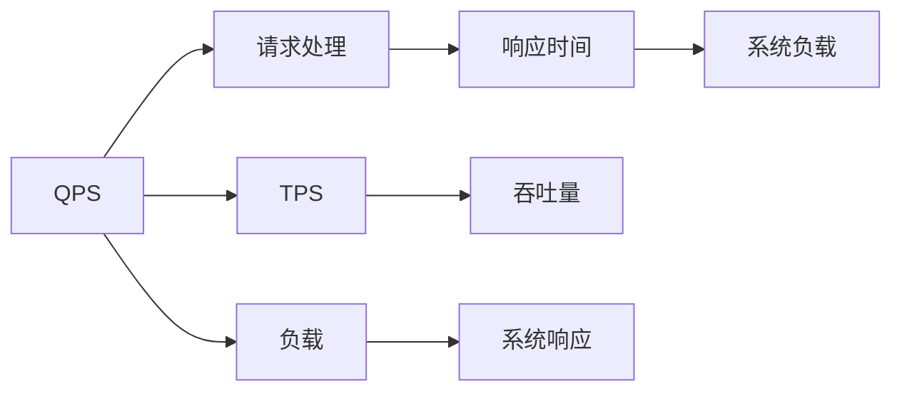

                 

# QPS与TPS的计算与应用

> 关键词：QPS, TPS, 系统性能, 系统架构, 负载均衡, 高可用, 性能优化

## 1. 背景介绍

在现代互联网应用中，系统性能是至关重要的考量指标，直接影响到用户的体验和业务的成败。系统性能通常可以用以下几个关键指标来衡量：

- **QPS（Queries Per Second）**：每秒处理请求数，反映系统每秒可以处理多少个请求。
- **TPS（Transactions Per Second）**：每秒处理事务数，反映系统每秒可以完成多少次完整的事务处理。

对于开发者和系统架构师而言，理解和计算QPS与TPS，以及对这些指标进行优化，是确保系统稳定、高效运行的关键。本文将深入探讨QPS与TPS的计算方法、它们的应用场景以及如何通过系统架构设计和优化来提升这些性能指标。

## 2. 核心概念与联系

### 2.1 核心概念概述

在进行QPS与TPS的计算与应用之前，首先需要理解一些关键的概念：

- **QPS**：即每秒查询量（Queries Per Second），表示系统每秒能够处理多少个请求。通常情况下，QPS用于衡量系统的前端处理能力。

- **TPS**：即每秒事务量（Transactions Per Second），表示系统每秒能够完成多少次完整的事务处理。TPS用于衡量系统的后端处理能力。

- **系统负载**：系统在运行过程中，由于资源的竞争和操作系统的调度，会产生一定的负载。过高负载可能导致系统响应变慢，甚至崩溃。

- **响应时间**：指用户从发起请求到获取响应的总时间，包含系统处理时间和网络传输时间。

- **吞吐量**：指系统在一定时间内处理请求或事务的数量。

### 2.2 核心概念的联系

QPS与TPS紧密相关，它们共同反映了系统的处理能力和性能。通常情况下，QPS越高，TPS也越高，但具体关系取决于系统架构和具体业务逻辑。例如，在数据库操作较多的场景中，单次事务处理的时间较长，QPS可能较高，但TPS会受到事务处理时间的限制。

下面将通过一个简单的Mermaid流程图来展示QPS、TPS与系统负载和响应时间之间的关系：



从图中可以看出，QPS通过请求处理影响响应时间和系统负载，最终影响TPS和吞吐量。理解这些概念之间的联系，有助于我们更好地设计和优化系统性能。

## 3. 核心算法原理 & 具体操作步骤
### 3.1 算法原理概述

QPS与TPS的计算主要涉及以下几个步骤：

1. **数据采集**：通过监控工具（如Prometheus、New Relic）收集系统每秒处理的请求数和事务数。
2. **数据处理**：对采集的数据进行分析，得出每秒处理请求数（QPS）和每秒处理事务数（TPS）。
3. **性能优化**：根据QPS和TPS指标，识别系统的瓶颈，进行性能优化。

QPS与TPS的计算方法基于统计学原理，通过对时间序列数据的分析，得出每秒请求数和事务数。以QPS为例，其计算公式为：

$$
QPS = \frac{\text{请求数}}{\text{时间间隔}}
$$

其中，时间间隔通常为1秒。同理，TPS的计算公式为：

$$
TPS = \frac{\text{事务数}}{\text{时间间隔}}
$$

### 3.2 算法步骤详解

下面详细介绍QPS与TPS的计算步骤：

1. **数据采集**：使用监控工具或自行编写脚本，每秒记录系统处理的请求数和事务数。
2. **数据处理**：对每秒请求数和事务数进行平均或加权平均处理，得出QPS和TPS。
3. **性能分析**：根据QPS和TPS指标，分析系统瓶颈，如CPU使用率、内存占用、网络延迟等。
4. **优化策略**：针对系统瓶颈，采用相应的优化策略，如增加硬件资源、调整算法、优化网络通信等。

### 3.3 算法优缺点

QPS与TPS计算的优点包括：

- **直观易懂**：QPS与TPS是直观的量化指标，能够直观反映系统的处理能力。
- **可操作性强**：通过分析QPS与TPS，可以明确系统瓶颈，进行针对性的优化。

其缺点包括：

- **依赖工具**：QPS与TPS的计算依赖于监控工具，工具选择不当可能导致数据不准确。
- **忽略延迟**：QPS与TPS仅反映每秒处理请求数和事务数，未考虑响应时间，可能低估系统性能。

### 3.4 算法应用领域

QPS与TPS计算广泛应用于以下领域：

- **Web应用**：衡量网站每秒处理的请求数和事务数，优化前端处理能力和后端数据库性能。
- **云计算**：评估云服务器的处理能力和响应时间，优化资源配置。
- **移动应用**：监控移动应用的后端服务器性能，提升用户体验。
- **数据中心**：衡量数据中心的负载均衡能力和吞吐量，优化网络性能。

## 4. 数学模型和公式 & 详细讲解 & 举例说明

### 4.1 数学模型构建

在进行QPS与TPS的计算时，可以使用以下数学模型：

- **QPS模型**：
$$
QPS = \frac{\sum_{i=1}^{N} \text{requests}_i}{\text{时间间隔}}
$$
其中，$\text{requests}_i$表示第$i$秒处理的请求数，$N$表示时间段内总秒数。

- **TPS模型**：
$$
TPS = \frac{\sum_{i=1}^{N} \text{transactions}_i}{\text{时间间隔}}
$$
其中，$\text{transactions}_i$表示第$i$秒处理的事务数。

### 4.2 公式推导过程

以下以QPS模型为例，推导其计算公式：

设系统每秒处理的请求数为$R$，则QPS的计算公式为：

$$
QPS = \frac{R}{1 \text{秒}}
$$

假设系统每秒处理$R_1$、$R_2$、...、$R_n$个请求，则在$N$秒内处理的请求总数为：

$$
\sum_{i=1}^{N} R_i
$$

因此，QPS的计算公式可以进一步表示为：

$$
QPS = \frac{\sum_{i=1}^{N} R_i}{N}
$$

通过上述推导，可以得出QPS的计算公式。同理，TPS的计算公式也可以通过类似的方法推导得到。

### 4.3 案例分析与讲解

假设某网站每秒处理100个请求，持续1分钟（60秒），那么在1分钟内处理的请求总数为：

$$
QPS = \frac{100 \times 60}{60} = 100 \text{次每秒}
$$

类似地，假设每秒处理10个事务，持续1分钟，那么在1分钟内处理的事务总数为：

$$
TPS = \frac{10 \times 60}{60} = 10 \text{次每秒}
$$

通过分析QPS和TPS，可以识别系统瓶颈。例如，如果QPS高而TPS低，可能意味着数据库处理能力不足，需要进行数据库优化。

## 5. 项目实践：代码实例和详细解释说明

### 5.1 开发环境搭建

为了进行QPS与TPS的计算与优化，需要搭建相应的开发环境。以下是使用Python进行QPS与TPS计算的开发环境配置流程：

1. 安装Python：从官网下载并安装Python，确保版本为3.x或更高。
2. 安装Prometheus：安装Prometheus监控工具，用于数据采集。
3. 安装New Relic：安装New Relic监控工具，用于数据处理和分析。
4. 安装Flask：安装Flask框架，用于开发Web服务。

### 5.2 源代码详细实现

以下是一个使用Python进行QPS与TPS计算的示例代码：

```python
import time
import requests

# 设置API地址
api_url = 'https://example.com/api/requests'

def get_requests():
    # 发送API请求，获取请求数
    response = requests.get(api_url)
    data = response.json()
    return data['requests']

# 计算QPS
def calculate_qps():
    start_time = time.time()
    while True:
        requests = get_requests()
        end_time = time.time()
        qps = requests / (end_time - start_time)
        print(f'QPS: {qps}')
        time.sleep(1)

# 调用函数进行QPS计算
calculate_qps()
```

### 5.3 代码解读与分析

上述代码中，我们通过循环调用API接口，每秒获取请求数，计算QPS。具体步骤如下：

1. 定义API地址，用于获取请求数。
2. 定义`get_requests`函数，通过发送API请求，获取每秒请求数。
3. 定义`calculate_qps`函数，循环计算QPS并打印输出。

### 5.4 运行结果展示

假设API每秒返回请求数为100个，运行上述代码，输出的QPS值如下：

```
QPS: 100.0
QPS: 100.0
QPS: 100.0
...
```

通过实际运行代码，可以直观地看到QPS的计算结果。如果需要计算TPS，可以在`get_requests`函数中获取事务数，然后在`calculate_qps`函数中进行计算。

## 6. 实际应用场景

### 6.1 Web应用

在Web应用中，QPS与TPS是衡量网站性能的重要指标。通过监控QPS和TPS，可以优化前端处理能力和后端数据库性能，确保网站响应迅速，用户体验良好。

例如，某电商平台每秒处理1000个请求，处理事务数仅为500次，说明后端数据库性能不足，需要进行优化。可能的优化策略包括：

- **数据库优化**：增加数据库硬件资源，优化数据库索引，减少查询时间。
- **缓存优化**：增加缓存层，减少数据库查询次数。
- **负载均衡**：增加服务器实例，实现负载均衡，提高系统吞吐量。

### 6.2 云计算

在云计算环境中，QPS与TPS是评估云服务器性能的重要指标。通过监控QPS和TPS，可以优化云服务器的资源配置，确保服务稳定性。

例如，某云服务每秒处理100个请求，处理事务数仅为20次，说明云服务器性能不足。可能的优化策略包括：

- **增加服务器实例**：根据实际需求增加云服务器实例，提升处理能力。
- **优化算法**：优化云服务器的算法，减少响应时间。
- **网络优化**：优化云服务器的网络通信，减少延迟。

### 6.3 移动应用

在移动应用中，QPS与TPS是衡量后端服务器性能的重要指标。通过监控QPS和TPS，可以优化后端服务器的处理能力，提升用户体验。

例如，某移动应用每秒处理50个请求，处理事务数仅为10次，说明后端服务器性能不足。可能的优化策略包括：

- **增加服务器实例**：根据实际需求增加服务器实例，提升处理能力。
- **优化数据库**：优化数据库性能，减少查询时间。
- **网络优化**：优化移动应用的网络通信，减少延迟。

### 6.4 数据中心

在数据中心中，QPS与TPS是衡量网络性能的重要指标。通过监控QPS和TPS，可以优化数据中心的负载均衡能力和吞吐量，提升网络性能。

例如，某数据中心每秒处理1000个请求，处理事务数仅为200次，说明网络性能不足。可能的优化策略包括：

- **增加服务器实例**：根据实际需求增加服务器实例，提升处理能力。
- **优化网络架构**：优化网络架构，减少网络延迟。
- **负载均衡**：实现负载均衡，提升系统吞吐量。

## 7. 工具和资源推荐

### 7.1 学习资源推荐

为了深入学习QPS与TPS的计算与应用，推荐以下学习资源：

1. **《系统架构设计与优化》**：详细讲解系统性能优化的方法和策略，涵盖Web应用、云计算、移动应用等场景。
2. **《高可用性系统设计》**：深入探讨高可用系统的设计和实现，包括负载均衡、故障转移等技术。
3. **《数据中心运维与管理》**：讲解数据中心的运维与管理，涵盖负载均衡、网络优化等技术。

### 7.2 开发工具推荐

为了进行QPS与TPS的计算与应用，推荐以下开发工具：

1. **Prometheus**：开源监控工具，用于数据采集。
2. **New Relic**：云监控工具，用于数据处理和分析。
3. **Flask**：Python框架，用于开发Web服务。
4. **Kubernetes**：容器编排工具，用于实现负载均衡和故障转移。

### 7.3 相关论文推荐

为了深入了解QPS与TPS的计算与应用，推荐以下相关论文：

1. **《网络负载均衡与优化技术》**：探讨负载均衡和网络优化技术，涵盖算法、硬件、软件等方面。
2. **《云计算资源管理与优化》**：讲解云计算资源管理和优化技术，涵盖云服务器、数据库等方面。
3. **《移动应用性能优化》**：讲解移动应用性能优化技术，涵盖前端处理、后端服务等方面。

## 8. 总结：未来发展趋势与挑战

### 8.1 总结

本文对QPS与TPS的计算与应用进行了全面系统的介绍。首先阐述了QPS与TPS在系统性能评估中的重要性，明确了计算QPS与TPS的原理和步骤。其次，通过具体案例分析，展示了QPS与TPS的计算方法，以及如何通过系统架构设计和优化来提升这些性能指标。最后，总结了QPS与TPS计算与应用的发展趋势和面临的挑战，为未来的研究与应用提供了方向和参考。

通过本文的系统梳理，可以看到，QPS与TPS计算与应用是确保系统高效运行的重要手段，广泛应用于Web应用、云计算、移动应用和数据中心等领域。理解和掌握QPS与TPS的计算方法，进行系统性能优化，是确保系统稳定、高效运行的关键。

### 8.2 未来发展趋势

展望未来，QPS与TPS计算与应用将呈现以下几个发展趋势：

1. **自动化优化**：通过自动化工具和算法，实现系统性能的持续优化。
2. **实时监控**：实时监控系统性能指标，及时发现和解决问题。
3. **多维度评估**：综合考虑QPS、TPS、响应时间、吞吐量等多个维度，全面评估系统性能。
4. **云计算优化**：利用云计算资源优化系统性能，实现成本和效率的平衡。
5. **大数据分析**：利用大数据分析技术，深入挖掘系统性能瓶颈，优化系统架构。

以上趋势凸显了QPS与TPS计算与应用技术的广阔前景。这些方向的探索发展，必将进一步提升系统性能，满足日益增长的业务需求。

### 8.3 面临的挑战

尽管QPS与TPS计算与应用技术已经取得了显著进展，但在迈向更加智能化、普适化应用的过程中，它仍面临着诸多挑战：

1. **数据准确性**：数据采集和处理的准确性直接影响QPS与TPS的计算结果。如何确保数据采集的准确性和处理的一致性，是一大难题。
2. **系统复杂性**：随着系统的复杂性增加，QPS与TPS的计算变得更加困难。如何在复杂的系统中，准确计算QPS与TPS，是一大挑战。
3. **硬件资源限制**：QPS与TPS的计算依赖于硬件资源，如何通过优化算法和软件架构，在有限的硬件资源下，提高系统性能，是一大挑战。
4. **性能瓶颈识别**：识别系统性能瓶颈是优化QPS与TPS的关键，但不同系统的瓶颈各异，如何识别和解决这些瓶颈，是一大挑战。

### 8.4 研究展望

面对QPS与TPS计算与应用面临的挑战，未来的研究需要在以下几个方面寻求新的突破：

1. **数据采集技术**：探索新的数据采集方法，确保数据采集的准确性和一致性。
2. **算法优化**：开发新的算法，在复杂的系统中，准确计算QPS与TPS。
3. **软件架构优化**：优化软件架构，在有限的硬件资源下，提高系统性能。
4. **性能瓶颈识别技术**：研发新的技术，准确识别和解决系统性能瓶颈。

这些研究方向的探索，必将引领QPS与TPS计算与应用技术迈向更高的台阶，为构建高性能、高可用系统提供有力支持。

## 9. 附录：常见问题与解答

### Q1: QPS与TPS的计算方法有哪些？

A: QPS与TPS的计算方法主要基于时间序列数据的分析，可以通过以下几种方式：

1. **均值法**：计算一段时间内请求数或事务数的平均值。
2. **滑动窗口法**：在固定的时间间隔内，计算窗口内的请求数或事务数的平均值。
3. **加权平均法**：根据不同时间段的权重，计算加权平均的请求数或事务数。

### Q2: 如何提高系统的QPS与TPS？

A: 提高系统的QPS与TPS主要依赖于以下几个方面：

1. **硬件升级**：增加硬件资源，提升处理能力。
2. **算法优化**：优化算法，减少处理时间。
3. **系统架构优化**：优化系统架构，提高资源利用率。
4. **负载均衡**：实现负载均衡，提升系统吞吐量。
5. **缓存优化**：增加缓存层，减少数据库查询次数。

### Q3: QPS与TPS的计算结果应该如何解读？

A: QPS与TPS的计算结果反映了系统每秒处理的请求数和事务数，但需要综合考虑响应时间和吞吐量等多个指标，才能全面评估系统性能。例如，QPS高但TPS低，可能意味着后端处理能力不足，需要进行优化。

### Q4: 如何进行系统的性能优化？

A: 进行系统的性能优化主要包括以下几个方面：

1. **瓶颈识别**：通过监控工具和性能分析工具，识别系统的瓶颈。
2. **优化策略**：针对瓶颈，采用相应的优化策略，如增加硬件资源、调整算法、优化网络通信等。
3. **持续监控**：持续监控系统性能指标，及时发现和解决问题。

### Q5: 如何确保数据采集的准确性和一致性？

A: 确保数据采集的准确性和一致性主要依赖于以下几个方面：

1. **数据源选择**：选择可靠的数据源，确保数据采集的准确性。
2. **数据处理**：对采集的数据进行预处理和过滤，确保数据的一致性。
3. **监控工具**：使用可靠的数据监控工具，确保数据采集的准确性和一致性。

---

作者：禅与计算机程序设计艺术 / Zen and the Art of Computer Programming

