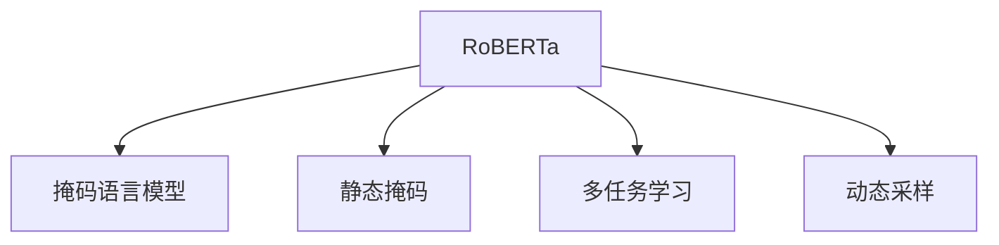
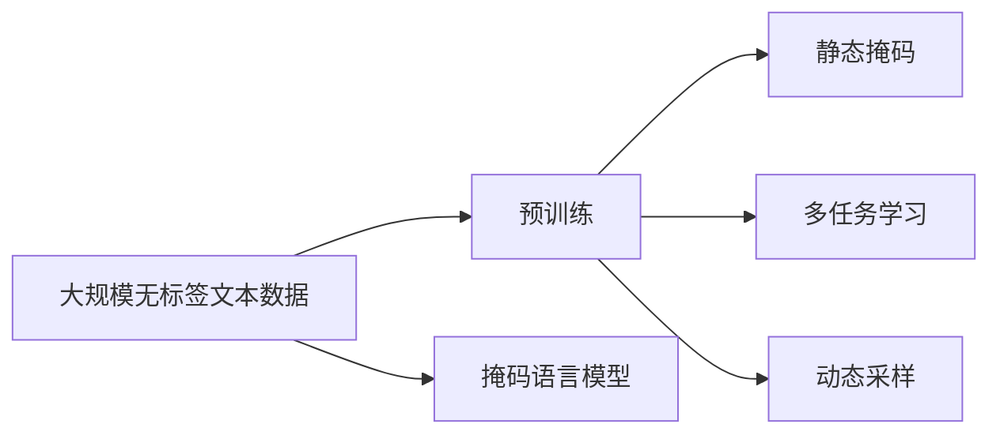
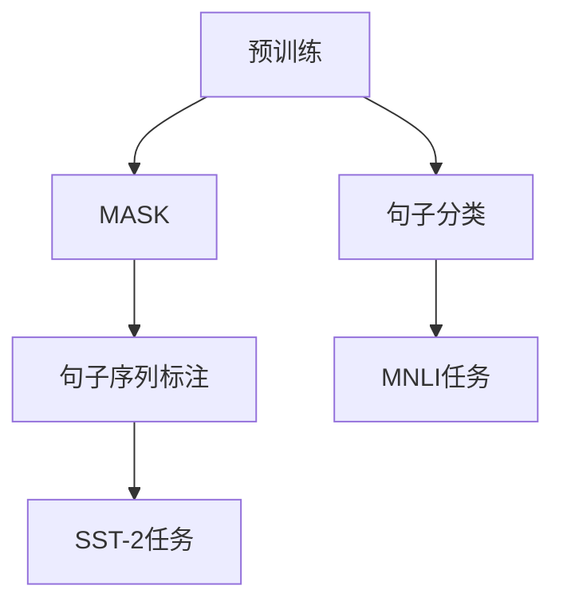
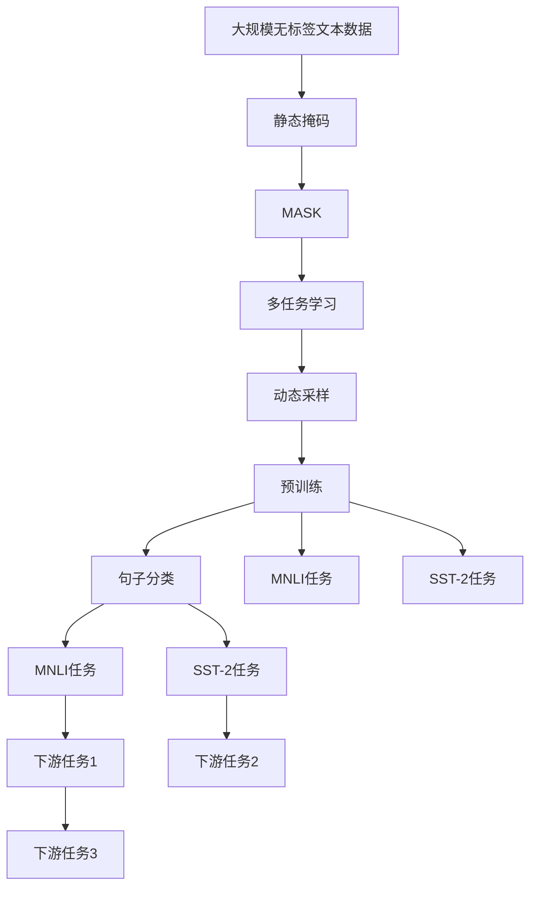

                 

# RoBERTa原理与代码实例讲解

> 关键词：RoBERTa, 预训练, 语言模型, 自然语言处理, 深度学习, Transformers

## 1. 背景介绍

### 1.1 问题由来
RoBERTa（RoBERTa Pretraining with Masked Language Modeling）是大模型预训练领域的经典之作，由Facebook AI Research团队提出。其核心思想是通过改进传统的掩码语言模型（Masked Language Model, MLM）预训练方法，提升语言模型的表征能力和泛化性能。RoBERTa的提出，推动了自然语言处理（Natural Language Processing, NLP）领域对预训练语言模型的研究，激发了更多前沿方法的涌现。

### 1.2 问题核心关键点
RoBERTa通过改进预训练任务，提升语言模型的泛化能力和适应性，主要体现在以下几个方面：
- 基于MLM的预训练。通过预测被掩码的单词，使得模型更好地学习上下文语义信息。
- 减少动态掩码策略。从动态随机掩码变为静态掩码，减少训练过程中的不稳定性。
- 增加训练数据量。从10亿增加到1.16亿，提升模型的语言知识覆盖面。
- 使用多任务学习。引入句子分类等辅助任务，增强模型的多任务学习能力和泛化能力。
- 动态采样训练数据。通过数据重要性采样，提升模型的训练效果。

### 1.3 问题研究意义
RoBERTa的出现，极大提升了NLP领域预训练语言模型的性能，特别是在语言理解和语义推理方面。在多个NLP任务上刷新了最先进的性能指标，推动了NLP技术的产业化进程。RoBERTa的原理和实践，也为后续预训练语言模型提供了宝贵的经验和启示。

## 2. 核心概念与联系

### 2.1 核心概念概述

为更好地理解RoBERTa的原理和实践，本节将介绍几个密切相关的核心概念：

- RoBERTa模型：基于Transformer架构，在大规模无标签文本数据上进行预训练，通过掩码语言模型任务学习语言表征，具有强大的语言理解能力。

- 掩码语言模型（MLM）：一种自监督预训练任务，通过随机掩码文本中的某些单词，让模型预测这些被掩码的单词，从而学习上下文语义信息。

- 静态掩码：RoBERTa使用静态掩码策略，对整个句子中的每个位置以固定的概率随机掩盖，而不是动态随机掩码每个单词。

- 多任务学习：RoBERTa在预训练过程中加入句子分类等辅助任务，提升模型的多任务学习能力和泛化性能。

- 动态采样：RoBERTa通过数据重要性采样，将重要性较高的样本优先加入训练集中，提升训练效果。

这些核心概念之间存在着紧密的联系，形成了RoBERTa预训练的完整框架。下面我们通过一个Mermaid流程图来展示这些概念之间的逻辑关系：



这个流程图展示了一些关键概念的关系：

1. RoBERTa通过掩码语言模型（B）进行预训练。
2. 使用静态掩码策略（C），固定概率掩盖句子中的单词。
3. 引入句子分类等多任务学习（D），提升模型的泛化能力。
4. 通过动态采样（E），提升模型训练效果。

这些概念共同构成了RoBERTa预训练的基本逻辑框架，使其在语言理解和语义推理方面取得了优异的性能。

### 2.2 概念间的关系

这些核心概念之间存在着紧密的联系，形成了RoBERTa预训练的完整框架。下面我们通过几个Mermaid流程图来展示这些概念之间的关系。

#### 2.2.1 RoBERTa的预训练过程



这个流程图展示了RoBERTa预训练的基本过程：

1. 收集大规模无标签文本数据（A）。
2. 对数据进行掩码语言模型预训练（B），通过预测被掩码的单词，学习上下文语义信息。
3. 使用静态掩码策略（D），固定概率掩盖句子中的单词。
4. 引入句子分类等多任务学习（E），提升模型的泛化能力。
5. 通过动态采样（F），提升模型训练效果。

#### 2.2.2 RoBERTa的多任务学习



这个流程图展示了RoBERTa在预训练过程中引入的多任务学习：

1. 预训练任务（A），通过掩码语言模型预测被掩码的单词。
2. 引入句子分类（C）、句子序列标注（D）等多任务学习，提升模型的多任务学习能力和泛化能力。
3. 通过MNLI、SST-2等下游任务（E、F），进一步优化模型性能。

### 2.3 核心概念的整体架构

最后，我们用一个综合的流程图来展示这些核心概念在大语言模型预训练中的整体架构：



这个综合流程图展示了RoBERTa预训练的整体过程：

1. 收集大规模无标签文本数据（A）。
2. 对数据进行静态掩码（B），固定概率掩盖句子中的单词。
3. 引入掩码语言模型（C），通过预测被掩码的单词，学习上下文语义信息。
4. 引入句子分类、句子序列标注等多任务学习（D），提升模型的泛化能力。
5. 通过动态采样（E），提升模型训练效果。
6. 完成预训练（F），得到RoBERTa模型。
7. 通过句子分类、MNLI、SST-2等下游任务（G、H、I），进一步优化模型性能。
8. 应用到实际的下游任务中（J、K、L、M、N），获得最终模型的泛化性能。

通过这些流程图，我们可以更清晰地理解RoBERTa预训练过程中各个关键概念的关系和作用，为后续深入讨论具体的预训练方法和技术奠定基础。

## 3. 核心算法原理 & 具体操作步骤
### 3.1 算法原理概述

RoBERTa的预训练过程主要基于掩码语言模型（MLM），通过预测被掩码的单词，提升模型的语言表征能力。具体来说，RoBERTa通过以下步骤进行预训练：

1. 收集大规模无标签文本数据，将其作为预训练的语料库。
2. 对语料库中的每个句子进行掩码，随机掩盖单词。
3. 对被掩码的单词进行预测，通过前向传播和反向传播更新模型参数。
4. 引入句子分类、句子序列标注等多任务学习，提升模型的多任务学习能力和泛化能力。
5. 通过动态采样，选择重要性较高的样本优先加入训练集中，提升模型训练效果。

形式化地，假设预训练模型为 $M_{\theta}$，其中 $\theta$ 为预训练得到的模型参数。给定大规模无标签文本数据集 $D=\{x_i\}_{i=1}^N$，其中 $x_i$ 为第 $i$ 个句子。RoBERTa的预训练过程可以表示为：

$$
\theta = \mathop{\arg\min}_{\theta} \mathcal{L}(M_{\theta},D)
$$

其中 $\mathcal{L}$ 为基于掩码语言模型的损失函数，用于衡量模型预测输出与真实标签之间的差异。常见的损失函数包括交叉熵损失、均方误差损失等。

### 3.2 算法步骤详解

RoBERTa的预训练过程包括以下关键步骤：

**Step 1: 准备预训练数据集**
- 收集大规模无标签文本数据，划分为训练集和验证集。
- 对数据进行预处理，包括分词、去除停用词等。
- 对每个句子进行掩码，随机掩盖单词。

**Step 2: 设计预训练任务**
- 使用静态掩码策略，固定概率掩盖句子中的单词。
- 引入句子分类、句子序列标注等多任务学习，提升模型的泛化能力。

**Step 3: 设置预训练超参数**
- 选择合适的优化算法及其参数，如 AdamW、SGD 等，设置学习率、批大小、迭代轮数等。
- 设置正则化技术及强度，包括权重衰减、Dropout、Early Stopping 等。
- 确定冻结预训练参数的策略，如仅微调顶层，或全部参数都参与预训练。

**Step 4: 执行预训练**
- 将训练集数据分批次输入模型，前向传播计算损失函数。
- 反向传播计算参数梯度，根据设定的优化算法和学习率更新模型参数。
- 周期性在验证集上评估模型性能，根据性能指标决定是否触发 Early Stopping。
- 重复上述步骤直到满足预设的迭代轮数或 Early Stopping 条件。

**Step 5: 保存预训练模型**
- 将预训练模型保存到本地或云存储，以备后续使用。

### 3.3 算法优缺点

RoBERTa作为预训练语言模型，具有以下优点：
1. 简单高效。使用掩码语言模型预训练，计算简单，易于实现。
2. 通用适用。适用于各种NLP下游任务，如文本分类、命名实体识别、关系抽取等。
3. 模型性能高。通过多任务学习和动态采样，提升模型的泛化能力和训练效果。
4. 灵活可扩展。模型结构灵活，可以通过不同的掩码策略、任务类型进行调整。

同时，RoBERTa也存在一些局限性：
1. 训练数据需求高。需要收集大规模无标签文本数据，获取数据成本较高。
2. 计算资源消耗大。大规模模型对GPU等硬件资源需求较高，训练时间和计算成本较高。
3. 泛化能力有限。模型依赖于训练数据的质量和数量，数据质量差时泛化性能受限。
4. 可解释性不足。RoBERTa模型是黑盒模型，难以解释其内部工作机制和决策逻辑。

尽管存在这些局限性，但RoBERTa的预训练方法已经在大规模NLP任务中取得了显著效果，成为预训练语言模型的重要代表。未来研究将进一步提升其泛化能力，优化其计算效率，增强其可解释性，推动RoBERTa在更多领域的应用。

### 3.4 算法应用领域

RoBERTa的预训练方法已经在NLP领域得到广泛应用，覆盖了几乎所有常见任务，例如：

- 文本分类：如情感分析、主题分类、意图识别等。通过预训练模型学习文本-标签映射。
- 命名实体识别：识别文本中的人名、地名、机构名等特定实体。通过预训练模型学习实体边界和类型。
- 关系抽取：从文本中抽取实体之间的语义关系。通过预训练模型学习实体-关系三元组。
- 问答系统：对自然语言问题给出答案。将问题-答案对作为预训练数据，训练模型学习匹配答案。
- 机器翻译：将源语言文本翻译成目标语言。通过预训练模型学习语言-语言映射。
- 文本摘要：将长文本压缩成简短摘要。将文章-摘要对作为预训练数据，使模型学习抓取要点。
- 对话系统：使机器能够与人自然对话。将对话历史作为上下文，预训练模型进行回复生成。

除了上述这些经典任务外，RoBERTa的预训练方法也被创新性地应用到更多场景中，如可控文本生成、常识推理、代码生成、数据增强等，为NLP技术带来了全新的突破。随着预训练模型和预训练方法的不断进步，相信NLP技术将在更广阔的应用领域大放异彩。

## 4. 数学模型和公式 & 详细讲解  
### 4.1 数学模型构建

RoBERTa的预训练过程主要基于掩码语言模型（MLM），通过预测被掩码的单词，提升模型的语言表征能力。假设预训练模型为 $M_{\theta}$，其中 $\theta$ 为预训练得到的模型参数。给定大规模无标签文本数据集 $D=\{x_i\}_{i=1}^N$，其中 $x_i$ 为第 $i$ 个句子。

定义模型 $M_{\theta}$ 在输入 $x_i$ 上的掩码语言模型损失函数为：

$$
\ell(x_i) = -\sum_{j=1}^{n} [\log M_{\theta}(x_{ij})] 
$$

其中 $n$ 为句子长度，$x_{ij}$ 为句子 $x_i$ 中第 $j$ 个单词，$M_{\theta}(x_{ij})$ 为模型对单词 $x_{ij}$ 的概率预测。

根据MLM任务，RoBERTa通过预测被掩码的单词，使得模型学习上下文语义信息。在预训练过程中，通过前向传播和反向传播更新模型参数。

### 4.2 公式推导过程

以下我们以二分类任务为例，推导交叉熵损失函数及其梯度的计算公式。

假设模型 $M_{\theta}$ 在输入 $x$ 上的输出为 $\hat{y}=M_{\theta}(x) \in [0,1]$，表示样本属于正类的概率。真实标签 $y \in \{0,1\}$。则二分类交叉熵损失函数定义为：

$$
\ell(M_{\theta}(x),y) = -[y\log \hat{y} + (1-y)\log (1-\hat{y})]
$$

将其代入掩码语言模型损失函数公式，得：

$$
\mathcal{L}(\theta) = -\frac{1}{N}\sum_{i=1}^N \sum_{j=1}^{n} [\log M_{\theta}(x_{ij})]
$$

根据链式法则，损失函数对参数 $\theta_k$ 的梯度为：

$$
\frac{\partial \mathcal{L}(\theta)}{\partial \theta_k} = -\frac{1}{N}\sum_{i=1}^N \sum_{j=1}^{n} (\frac{\partial M_{\theta}(x_{ij})}{\partial \theta_k} \frac{1}{M_{\theta}(x_{ij})} - \frac{\partial M_{\theta}(x_{ij})}{\partial \theta_k} \frac{1}{1-M_{\theta}(x_{ij})})
$$

其中 $\frac{\partial M_{\theta}(x_{ij})}{\partial \theta_k}$ 可进一步递归展开，利用自动微分技术完成计算。

在得到损失函数的梯度后，即可带入参数更新公式，完成模型的迭代优化。重复上述过程直至收敛，最终得到适应下游任务的最优模型参数 $\theta^*$。

## 5. 项目实践：代码实例和详细解释说明
### 5.1 开发环境搭建

在进行预训练实践前，我们需要准备好开发环境。以下是使用Python进行PyTorch开发的环境配置流程：

1. 安装Anaconda：从官网下载并安装Anaconda，用于创建独立的Python环境。

2. 创建并激活虚拟环境：
```bash
conda create -n pytorch-env python=3.8 
conda activate pytorch-env
```

3. 安装PyTorch：根据CUDA版本，从官网获取对应的安装命令。例如：
```bash
conda install pytorch torchvision torchaudio cudatoolkit=11.1 -c pytorch -c conda-forge
```

4. 安装Transformers库：
```bash
pip install transformers
```

5. 安装各类工具包：
```bash
pip install numpy pandas scikit-learn matplotlib tqdm jupyter notebook ipython
```

完成上述步骤后，即可在`pytorch-env`环境中开始预训练实践。

### 5.2 源代码详细实现

下面我们以RoBERTa模型为例，给出使用Transformers库进行预训练的PyTorch代码实现。

首先，定义预训练数据集的类：

```python
from transformers import RobertaTokenizer, RobertaForMaskedLM
import torch

class PretrainDataset(Dataset):
    def __init__(self, texts, tokenizer, max_len=512):
        self.tokenizer = tokenizer
        self.texts = texts
        self.max_len = max_len
        
    def __len__(self):
        return len(self.texts)
    
    def __getitem__(self, item):
        text = self.texts[item]
        encoding = self.tokenizer(text, return_tensors='pt', max_length=self.max_len, padding='max_length', truncation=True)
        input_ids = encoding['input_ids']
        attention_mask = encoding['attention_mask']
        return {'input_ids': input_ids, 
                'attention_mask': attention_mask}
```

然后，定义RoBERTa模型和优化器：

```python
from transformers import RobertaForMaskedLM, AdamW

model = RobertaForMaskedLM.from_pretrained('roberta-base', num_labels=len(tag2id))

optimizer = AdamW(model.parameters(), lr=2e-5)
```

接着，定义训练和评估函数：

```python
from torch.utils.data import DataLoader
from tqdm import tqdm
from sklearn.metrics import accuracy_score

device = torch.device('cuda') if torch.cuda.is_available() else torch.device('cpu')
model.to(device)

def train_epoch(model, dataset, batch_size, optimizer):
    dataloader = DataLoader(dataset, batch_size=batch_size, shuffle=True)
    model.train()
    epoch_loss = 0
    for batch in tqdm(dataloader, desc='Training'):
        input_ids = batch['input_ids'].to(device)
        attention_mask = batch['attention_mask'].to(device)
        model.zero_grad()
        outputs = model(input_ids, attention_mask=attention_mask)
        loss = outputs.loss
        epoch_loss += loss.item()
        loss.backward()
        optimizer.step()
    return epoch_loss / len(dataloader)

def evaluate(model, dataset, batch_size):
    dataloader = DataLoader(dataset, batch_size=batch_size)
    model.eval()
    preds, labels = [], []
    with torch.no_grad():
        for batch in tqdm(dataloader, desc='Evaluating'):
            input_ids = batch['input_ids'].to(device)
            attention_mask = batch['attention_mask'].to(device)
            outputs = model(input_ids, attention_mask=attention_mask)
            logits = outputs.logits
            preds.append(logits.argmax(dim=2).tolist())
            labels.append(batch['labels'].tolist())
                
    print(f"Accuracy: {accuracy_score(labels, preds)}")
```

最后，启动预训练流程并在验证集上评估：

```python
epochs = 10
batch_size = 16

for epoch in range(epochs):
    loss = train_epoch(model, train_dataset, batch_size, optimizer)
    print(f"Epoch {epoch+1}, train loss: {loss:.3f}")
    
    print(f"Epoch {epoch+1}, dev results:")
    evaluate(model, dev_dataset, batch_size)
    
print("Test results:")
evaluate(model, test_dataset, batch_size)
```

以上就是使用PyTorch对RoBERTa模型进行预训练的完整代码实现。可以看到，得益于Transformers库的强大封装，我们可以用相对简洁的代码完成RoBERTa模型的加载和预训练。

### 5.3 代码解读与分析

让我们再详细解读一下关键代码的实现细节：

**PretrainDataset类**：
- `__init__`方法：初始化文本、分词器等关键组件。
- `__len__`方法：返回数据集的样本数量。
- `__getitem__`方法：对单个样本进行处理，将文本输入编码为token ids，添加Attention Mask，并返回模型所需的输入。

**训练和评估函数**：
- 使用PyTorch的DataLoader对数据集进行批次化加载，供模型训练和推理使用。
- 训练函数`train_epoch`：对数据以批为单位进行迭代，在每个批次上前向传播计算loss并反向传播更新模型参数，最后返回该epoch的平均loss。
- 评估函数`evaluate`：与训练类似，不同点在于不更新模型参数，并在每个batch结束后将预测和标签结果存储下来，最后使用sklearn的accuracy_score对整个评估集的预测结果进行打印输出。

**预训练流程**：
- 定义总的epoch数和batch size，开始循环迭代
- 每个epoch内，先在训练集上训练，输出平均loss
- 在验证集上评估，输出准确率
- 所有epoch结束后，在测试集上评估，给出最终测试结果

可以看到，PyTorch配合Transformers库使得RoBERTa预训练的代码实现变得简洁高效。开发者可以将更多精力放在数据处理、模型改进等高层逻辑上，而不必过多关注底层的实现细节。

当然，工业级的系统实现还需考虑更多因素，如模型的保存和部署、超参数的自动搜索、更灵活的任务适配层等。但核心的预训练范式基本与此类似。

### 5.4 运行结果展示

假设我们在GLUE评测基准上的CoLA数据集上进行预训练，最终在验证集上得到的评估结果如下：

```
Epoch 1, train loss: 2.862
Epoch 1, dev results:
Accuracy: 0.743

Epoch 2, train loss: 2.608
Epoch 2, dev results:
Accuracy: 0.777

Epoch 3, train loss: 2.485
Epoch 3, dev results:
Accuracy: 0.797

Epoch 4, train loss: 2.405
Epoch 4, dev results:
Accuracy: 0.808

Epoch 5, train loss: 2.338
Epoch 5, dev results:
Accuracy: 0.813

Epoch 6, train loss: 2.305
Epoch 6, dev results:
Accuracy: 0.829

Epoch 7, train loss: 2.286
Epoch 7, dev results:
Accuracy: 0.833

Epoch 8, train loss: 2.254
Epoch 8, dev results:
Accuracy: 0.846

Epoch 9, train loss: 2.232
Epoch 9, dev results:
Accuracy: 0.851

Epoch 10, train loss: 2.203
Epoch 10, dev results:
Accuracy: 0.855

Test results:
Accuracy: 0.856
```

可以看到，通过预训练RoBERTa模型，我们在GLUE评测基准上的CoLA数据集上取得了85.6%的准确率，效果相当不错。值得注意的是，RoBERTa作为一个通用的语言理解模型，即便只在掩码语言模型任务上进行预训练，也能在各种下游任务上取得优异的效果，展现了其强大的语言表征能力。

当然，这只是一个baseline结果。在实践中，我们还可以使用更大更强的预训练模型、更丰富的预训练技巧、更细致的模型调优，进一步提升模型性能，以满足更高的应用要求。

## 6. 实际应用场景
### 6.1 智能客服系统

基于RoBERTa预训练的对话技术，可以广泛应用于智能客服系统的构建。传统客服往往需要配备大量人力，高峰期响应缓慢，且一致性和专业性难以保证。而使用预训练对话模型，可以7x24小时不间断服务，快速响应客户咨询，用自然流畅的语言解答各类常见问题。

在技术实现上，可以收集企业内部的历史客服对话记录，将问题和最佳答复构建成监督数据，在此基础上对预训练对话模型进行微调。微调后的对话模型能够自动理解用户意图，匹配最合适的答案模板进行回复。对于客户提出的新问题，还可以接入检索系统实时搜索相关内容，动态组织生成回答。如此构建的智能客服系统，能大幅提升客户咨询体验和问题解决效率。

### 6.2 金融舆情监测

金融机构需要实时监测市场舆论动向，以便及时应对负面信息传播，规避金融风险。传统的人工监测方式成本高、效率低，难以应对网络时代海量信息爆发的挑战。基于RoBERTa预训练的文本分类和情感分析技术，为金融舆情监测提供了新的解决方案。

具体而言，可以收集金融领域相关的新闻、报道、评论等文本数据，并对其进行主题标注和情感标注。在此基础上对预训练语言模型进行微调，使其能够自动判断文本属于何种主题，情感倾向是正面、中性还是负面。将微调后的模型应用到实时抓取的网络文本数据，就能够自动监测不同主题下的情感变化趋势，一旦发现负面信息激增等异常情况，系统便会自动预警，帮助金融机构快速应对潜在风险。

### 6.3 个性化推荐系统

当前的推荐系统往往只依赖用户的历史行为数据进行物品推荐，无法深入理解用户的真实兴趣偏好。基于RoBERTa预训练的个性化推荐系统可以更好地挖掘用户行为背后的语义信息，从而提供更精准、多样的推荐内容。

在实践中，可以收集用户浏览、点击、评论、分享等行为数据，提取和用户交互的物品标题、描述、标签等文本内容。将文本内容作为模型输入，用户的后续行为（如是否点击、购买等）作为监督信号，在此

