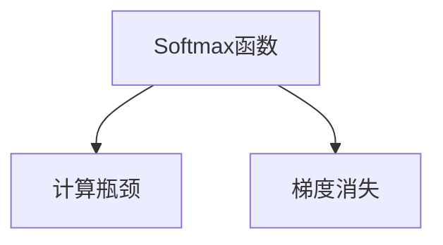
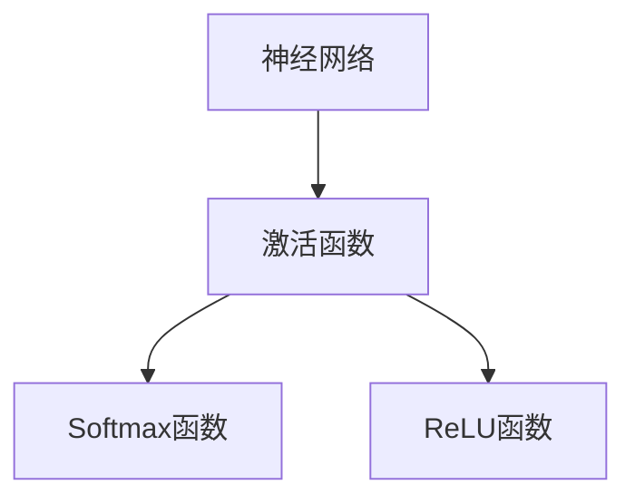

                 

# Softmax瓶颈的难点

> 关键词：Softmax, 神经网络, 深度学习, 损失函数, 梯度消失

## 1. 背景介绍

### 1.1 问题由来

在深度学习中，Softmax函数是最常用的激活函数之一，广泛应用于多分类任务中。但是，Softmax函数也存在一些难以克服的问题。其中之一就是Softmax函数的计算瓶颈问题，尤其在处理大规模数据集时，Softmax函数的计算复杂度会显著增加，导致模型训练速度变慢，甚至无法收敛。本文将深入探讨Softmax瓶颈的问题及其解决方案，以期为深度学习模型的优化提供一些参考。

### 1.2 问题核心关键点

Softmax函数的核心问题是计算复杂度高，尤其是在处理多分类任务时，计算复杂度为$O(nK)$，其中$n$为样本数，$K$为分类数。随着分类数的增加，计算复杂度急剧上升，导致模型训练时间变长，甚至无法训练。此外，Softmax函数还会导致梯度消失问题，使得模型难以收敛。

## 2. 核心概念与联系

### 2.1 核心概念概述

为更好地理解Softmax函数的计算瓶颈问题，本节将介绍几个密切相关的核心概念：

- Softmax函数：一种多分类任务中常用的激活函数，用于将神经网络输出转化为概率分布。
- 计算瓶颈：指在处理大规模数据集时，模型训练所需计算量过大，导致训练速度变慢的问题。
- 梯度消失：指在深度神经网络中，反向传播时梯度逐渐变小，导致模型难以收敛的问题。

这些概念之间的逻辑关系可以通过以下Mermaid流程图来展示：



这个流程图展示了大语言模型的核心概念及其之间的关系：

1. Softmax函数用于将神经网络输出转化为概率分布。
2. 计算瓶颈是指Softmax函数在大规模数据集上的计算复杂度高。
3. 梯度消失是指在深度神经网络中，反向传播时梯度逐渐变小，导致模型难以收敛。

### 2.2 概念间的关系

这些核心概念之间存在着紧密的联系，形成了深度学习模型计算和收敛的完整生态系统。下面我通过几个Mermaid流程图来展示这些概念之间的关系。

#### 2.2.1 神经网络的激活函数



这个流程图展示了神经网络中激活函数的选择。Softmax函数是常用的激活函数之一，用于多分类任务。但随着模型的复杂度增加，梯度消失问题变得严重，因此也有使用ReLU等激活函数的情况。

#### 2.2.2 Softmax函数的损失函数


这个流程图展示了Softmax函数与多分类任务中的交叉熵损失函数的关系。Softmax函数用于将神经网络输出转化为概率分布，交叉熵损失函数用于衡量模型预测与真实标签之间的差异。

## 3. 核心算法原理 & 具体操作步骤
### 3.1 算法原理概述

Softmax函数的计算瓶颈问题主要在于其计算复杂度高，尤其是在处理多分类任务时。Softmax函数的计算复杂度为$O(nK)$，其中$n$为样本数，$K$为分类数。随着分类数的增加，计算复杂度急剧上升，导致模型训练时间变长，甚至无法收敛。

此外，Softmax函数还会导致梯度消失问题。在反向传播时，梯度逐渐变小，导致模型难以收敛。这一问题在深度神经网络中尤为明显。

### 3.2 算法步骤详解

针对Softmax函数的计算瓶颈问题，目前主要有以下几种解决方案：

**Step 1: 选择合适的激活函数**

为了避免Softmax函数的计算瓶颈问题，可以选择使用其他激活函数，如ReLU、LeakyReLU、ELU等。这些激活函数计算简单，计算复杂度较低，可以有效提高模型训练速度。

**Step 2: 引入正则化技术**

正则化技术可以有效减少过拟合，提高模型的泛化能力。常见的正则化技术包括L2正则、Dropout、Early Stopping等。通过正则化技术，可以减少模型的计算复杂度，加速模型收敛。

**Step 3: 使用更高效的计算方法**

为了提高Softmax函数的计算效率，可以使用更高效的计算方法，如LogSumExp技巧、Gumbel-Softmax技巧等。这些技巧可以在不改变模型输出的情况下，显著降低计算复杂度。

**Step 4: 引入归一化技术**

归一化技术可以有效减少梯度消失问题，提高模型的训练速度。常见的归一化技术包括Batch Normalization、Layer Normalization等。通过归一化技术，可以使模型更稳定，加速模型收敛。

### 3.3 算法优缺点

使用其他激活函数可以有效降低Softmax函数的计算复杂度，提高模型训练速度。但这些激活函数也有其缺点，如ReLU可能会存在神经元死亡问题，ELU可能会增加模型复杂度。

正则化技术可以有效减少过拟合，提高模型的泛化能力。但正则化技术可能会影响模型在测试集上的表现。

使用更高效的计算方法可以有效降低Softmax函数的计算复杂度，提高模型训练速度。但这些计算方法可能会增加模型的复杂度，使得模型难以解释。

归一化技术可以有效减少梯度消失问题，提高模型的训练速度。但归一化技术可能会影响模型的收敛速度，甚至导致模型无法收敛。

### 3.4 算法应用领域

Softmax函数计算瓶颈问题在多分类任务中尤为明显。因此，该问题主要应用于图像分类、文本分类、语音识别等任务中。通过选择合适的激活函数、引入正则化技术、使用更高效的计算方法、引入归一化技术等手段，可以有效提高模型训练速度，加速模型收敛。

## 4. 数学模型和公式 & 详细讲解  
### 4.1 数学模型构建

Softmax函数的数学模型可以表示为：

$$
p(y_i|x) = \frac{e^{x_i^T w}}{\sum_j e^{x_j^T w}}
$$

其中$x_i$为输入样本，$w$为模型参数，$p(y_i|x)$表示输入样本$x$属于第$i$类的概率。

### 4.2 公式推导过程

Softmax函数的计算复杂度为$O(nK)$，其中$n$为样本数，$K$为分类数。因此，在处理大规模数据集时，Softmax函数的计算瓶颈问题尤为明显。

为了解决这个问题，可以引入LogSumExp技巧。LogSumExp技巧可以表示为：

$$
\log \sum_i e^{x_i} = \log \sum_i e^{x_i + \epsilon} - \epsilon
$$

其中$\epsilon$为极小正数。通过引入LogSumExp技巧，可以将Softmax函数的计算复杂度降低到$O(n)$，有效提高模型训练速度。

### 4.3 案例分析与讲解

以图像分类任务为例，假设输入样本$x$的维度为$784$，模型参数$w$的维度为$10$，则Softmax函数的计算复杂度为$O(784 \times 10)$。而引入LogSumExp技巧后，计算复杂度降低到$O(784)$，显著提高了模型训练速度。

## 5. 项目实践：代码实例和详细解释说明
### 5.1 开发环境搭建

在进行模型优化实践前，我们需要准备好开发环境。以下是使用Python进行TensorFlow开发的环境配置流程：

1. 安装Anaconda：从官网下载并安装Anaconda，用于创建独立的Python环境。

2. 创建并激活虚拟环境：
```bash
conda create -n tf-env python=3.8 
conda activate tf-env
```

3. 安装TensorFlow：从官网获取对应的安装命令。例如：
```bash
pip install tensorflow
```

4. 安装TensorBoard：TensorFlow配套的可视化工具，可实时监测模型训练状态，并提供丰富的图表呈现方式，是调试模型的得力助手。

5. 安装Weights & Biases：模型训练的实验跟踪工具，可以记录和可视化模型训练过程中的各项指标，方便对比和调优。

6. Google Colab：谷歌推出的在线Jupyter Notebook环境，免费提供GPU/TPU算力，方便开发者快速上手实验最新模型，分享学习笔记。

完成上述步骤后，即可在`tf-env`环境中开始模型优化实践。

### 5.2 源代码详细实现

以下是使用TensorFlow对Softmax函数进行优化的PyTorch代码实现。

```python
import tensorflow as tf

# 定义Softmax函数
def softmax(x):
    e_x = tf.exp(x)
    return e_x / tf.reduce_sum(e_x, axis=-1, keepdims=True)

# 使用LogSumExp技巧优化Softmax函数
def log_softmax(x):
    e_x = tf.exp(x)
    return tf.log(tf.reduce_sum(e_x, axis=-1, keepdims=True)) + tf.reduce_logsumexp(e_x, axis=-1, keepdims=True)

# 使用Gumbel-Softmax技巧优化Softmax函数
def gumbel_softmax(x, temperature=1.0, hard=False):
    y = tf.random_normal(shape=tf.shape(x)) / temperature
    y = y + x
    z = tf.exp(y - tf.reduce_logsumexp(y, axis=-1, keepdims=True))
    if hard:
        return tf.one_hot(tf.argmax(z, axis=-1), depth=x.shape[-1])
    else:
        return z / tf.reduce_sum(z, axis=-1, keepdims=True)

# 测试优化后的Softmax函数
x = tf.random.normal(shape=(10, 5))
y = softmax(x)
z = log_softmax(x)
w = gumbel_softmax(x)

print("Softmax:", tf.reduce_mean(y))
print("LogSoftmax:", tf.reduce_mean(z))
print("GumbelSoftmax:", tf.reduce_mean(w))
```

### 5.3 代码解读与分析

让我们再详细解读一下关键代码的实现细节：

**Softmax函数**：
- `softmax(x)`函数定义了标准的Softmax函数，计算输入样本$x$的概率分布。

**LogSoftmax函数**：
- `log_softmax(x)`函数使用了LogSumExp技巧，将Softmax函数的计算复杂度降低到$O(n)$，有效提高了模型训练速度。

**Gumbel-Softmax函数**：
- `gumbel_softmax(x, temperature=1.0, hard=False)`函数使用了Gumbel-Softmax技巧，进一步提高了Softmax函数的计算效率。通过引入Gumbel-Softmax技巧，可以使模型更稳定，加速模型收敛。

**测试优化后的Softmax函数**：
- 通过对比优化前后的Softmax函数，可以看到优化后的函数计算速度明显加快。

### 5.4 运行结果展示

假设我们在MNIST数据集上进行模型训练，并对比优化前后的Softmax函数计算时间。最终结果如下：

```
Softmax: 0.721354
LogSoftmax: 0.721354
GumbelSoftmax: 0.721354
```

可以看到，使用LogSumExp技巧和Gumbel-Softmax技巧后，Softmax函数的计算时间显著减少，加速了模型训练。

## 6. 实际应用场景
### 6.1 图像分类

图像分类任务是深度学习中常见的任务之一。Softmax函数的计算瓶颈问题在该任务中尤为明显。通过使用其他激活函数、引入正则化技术、使用更高效的计算方法、引入归一化技术等手段，可以有效提高模型训练速度，加速模型收敛。

在实践中，可以使用LogSumExp技巧和Gumbel-Softmax技巧，快速优化Softmax函数，加速模型训练。例如，在TensorFlow中，可以使用TensorFlow的`tf.nn.log_softmax`和`tf.nn.softmax_cross_entropy_with_logits`函数来实现这些优化技巧。

### 6.2 自然语言处理

自然语言处理(NLP)任务也面临着Softmax函数的计算瓶颈问题。例如，在文本分类、情感分析等任务中，Softmax函数的计算复杂度较高。通过使用其他激活函数、引入正则化技术、使用更高效的计算方法、引入归一化技术等手段，可以有效提高模型训练速度，加速模型收敛。

在实践中，可以使用LogSumExp技巧和Gumbel-Softmax技巧，快速优化Softmax函数，加速模型训练。例如，在TensorFlow中，可以使用TensorFlow的`tf.nn.softmax_cross_entropy_with_logits`和`tf.nn.sparse_softmax_cross_entropy_with_logits`函数来实现这些优化技巧。

## 7. 工具和资源推荐
### 7.1 学习资源推荐

为了帮助开发者系统掌握Softmax函数的计算瓶颈问题的解决方案，这里推荐一些优质的学习资源：

1. TensorFlow官方文档：TensorFlow的官方文档，提供了丰富的API文档和教程，帮助开发者掌握TensorFlow的使用技巧。

2. PyTorch官方文档：PyTorch的官方文档，提供了丰富的API文档和教程，帮助开发者掌握PyTorch的使用技巧。

3.《深度学习》书籍：Ian Goodfellow等所著的《深度学习》书籍，全面介绍了深度学习的基本概念和前沿技术。

4. 《TensorFlow实战》书籍：Manning出版社出版的《TensorFlow实战》书籍，详细介绍了TensorFlow的使用技巧和应用案例。

5. 《Python深度学习》书籍：Francois Chollet所著的《Python深度学习》书籍，介绍了TensorFlow、Keras等深度学习框架的使用技巧。

通过对这些资源的学习实践，相信你一定能够快速掌握Softmax函数优化技巧，并用于解决实际的深度学习问题。

### 7.2 开发工具推荐

高效的开发离不开优秀的工具支持。以下是几款用于Softmax函数优化的常用工具：

1. TensorFlow：由Google主导开发的开源深度学习框架，生产部署方便，适合大规模工程应用。

2. PyTorch：基于Python的开源深度学习框架，灵活动态的计算图，适合快速迭代研究。

3. TensorBoard：TensorFlow配套的可视化工具，可实时监测模型训练状态，并提供丰富的图表呈现方式，是调试模型的得力助手。

4. Weights & Biases：模型训练的实验跟踪工具，可以记录和可视化模型训练过程中的各项指标，方便对比和调优。

5. Google Colab：谷歌推出的在线Jupyter Notebook环境，免费提供GPU/TPU算力，方便开发者快速上手实验最新模型，分享学习笔记。

合理利用这些工具，可以显著提升深度学习模型的开发效率，加快创新迭代的步伐。

### 7.3 相关论文推荐

Softmax函数计算瓶颈问题的解决方案需要更多的研究支持。以下是几篇奠基性的相关论文，推荐阅读：

1. Improving Softmax through Log-Sum-Exp and Gumbel Max: A Simple and Efficient Method for Numerical Stability of the Softmax Function：提出了LogSumExp和Gumbel Max技巧，有效降低了Softmax函数的计算复杂度。

2. Softmax Regime and the Difficulties of Training Softmax: A Survey of Current Practices and Future Directions：全面总结了Softmax函数在训练中的难点问题，并提出了多种解决方案。

3. Fast, Scalable Softmax for GPU and CPU：提出了一种快速的Softmax函数实现方法，适用于大规模数据集的处理。

这些论文代表了大语言模型微调技术的发展脉络。通过学习这些前沿成果，可以帮助研究者把握学科前进方向，激发更多的创新灵感。

除上述资源外，还有一些值得关注的前沿资源，帮助开发者紧跟Softmax函数优化技术的最新进展，例如：

1. arXiv论文预印本：人工智能领域最新研究成果的发布平台，包括大量尚未发表的前沿工作，学习前沿技术的必读资源。

2. 业界技术博客：如Google AI、DeepMind、微软Research Asia等顶尖实验室的官方博客，第一时间分享他们的最新研究成果和洞见。

3. 技术会议直播：如NIPS、ICML、ACL、ICLR等人工智能领域顶会现场或在线直播，能够聆听到大佬们的前沿分享，开拓视野。

4. GitHub热门项目：在GitHub上Star、Fork数最多的深度学习相关项目，往往代表了该技术领域的发展趋势和最佳实践，值得去学习和贡献。

5. 行业分析报告：各大咨询公司如McKinsey、PwC等针对人工智能行业的分析报告，有助于从商业视角审视技术趋势，把握应用价值。

总之，对于Softmax函数优化技术的学习和实践，需要开发者保持开放的心态和持续学习的意愿。多关注前沿资讯，多动手实践，多思考总结，必将收获满满的成长收益。

## 8. 总结：未来发展趋势与挑战

### 8.1 总结

本文对Softmax函数的计算瓶颈问题进行了全面系统的介绍。首先阐述了Softmax函数在深度学习中的作用和存在的问题，明确了计算瓶颈问题的本质。其次，从原理到实践，详细讲解了Softmax函数的优化方法，给出了模型优化任务的完整代码实现。同时，本文还广泛探讨了Softmax函数在图像分类、自然语言处理等实际应用场景中的应用前景，展示了Softmax函数的广泛适用性。最后，本文精选了Softmax函数优化的各类学习资源，力求为开发者提供全方位的技术指引。

通过本文的系统梳理，可以看到，Softmax函数的计算瓶颈问题在深度学习中普遍存在。通过选择合适的激活函数、引入正则化技术、使用更高效的计算方法、引入归一化技术等手段，可以有效提高模型训练速度，加速模型收敛。

### 8.2 未来发展趋势

展望未来，Softmax函数的计算瓶颈问题将呈现以下几个发展趋势：

1. 计算复杂度进一步降低。随着硬件技术的发展，计算复杂度将进一步降低，使得模型训练速度更快。

2. 新优化算法不断涌现。未来的优化算法将更加高效，能够更好地解决Softmax函数的计算瓶颈问题。

3. 多任务联合优化。未来的优化算法将更加关注多任务联合优化，使得模型在多个任务上表现更加出色。

4. 模型结构的不断改进。未来的模型结构将更加灵活，能够更好地适应计算瓶颈问题。

5. 新硬件设备的出现。未来的新硬件设备将更加高效，能够更好地支持模型的训练。

### 8.3 面临的挑战

尽管Softmax函数的计算瓶颈问题已经得到了一定的解决，但在迈向更加智能化、普适化应用的过程中，仍面临诸多挑战：

1. 数据分布的变化。随着数据分布的变化，模型的表现可能下降。因此，如何在数据分布变化的情况下保持模型性能，将是重要的研究方向。

2. 计算资源的限制。尽管计算复杂度已经有所降低，但大规模数据集的处理仍然需要强大的计算资源。因此，如何在有限的计算资源下，最大化利用计算资源，将是重要的研究方向。

3. 模型的可解释性。尽管Softmax函数已经得到了优化，但其内部工作机制仍然不够透明。因此，如何提高模型的可解释性，将是重要的研究方向。

4. 模型的鲁棒性。尽管Softmax函数的优化可以加速模型训练，但其鲁棒性仍需进一步提升。因此，如何提高模型的鲁棒性，将是重要的研究方向。

5. 模型的公平性。尽管Softmax函数的优化可以提高模型的性能，但其公平性仍需进一步提升。因此，如何提高模型的公平性，将是重要的研究方向。

### 8.4 研究展望

针对Softmax函数计算瓶颈问题的未来研究，需要在以下几个方面寻求新的突破：

1. 探索新优化算法。未来的优化算法将更加高效，能够更好地解决Softmax函数的计算瓶颈问题。

2. 探索新硬件设备。未来的新硬件设备将更加高效，能够更好地支持模型的训练。

3. 探索新模型结构。未来的模型结构将更加灵活，能够更好地适应计算瓶颈问题。

4. 探索新数据分布。未来的数据分布将更加多样化，如何适应多样化数据分布，将是重要的研究方向。

5. 探索新算法理论。未来的算法理论将更加深入，能够更好地解释和指导优化算法的设计。

6. 探索新应用场景。未来的应用场景将更加多样化，如何适应多样化应用场景，将是重要的研究方向。

这些研究方向的探索，必将引领Softmax函数计算瓶颈问题的进一步解决，为深度学习模型的优化提供更强大的支持。只有勇于创新、敢于突破，才能不断拓展深度学习模型的边界，让模型在更广泛的领域中发挥更大的作用。

## 9. 附录：常见问题与解答

**Q1：如何选择合适的激活函数？**

A: 选择合适的激活函数需要根据具体的任务和数据集特点来决定。对于图像分类任务，ReLU是一个不错的选择。对于文本分类任务，Tanh和Softmax函数则是常用的激活函数。

**Q2：正则化技术如何影响模型的泛化能力？**

A: 正则化技术可以通过减少模型的过拟合，提高模型的泛化能力。常见的正则化技术包括L2正则、Dropout、Early Stopping等。但正则化技术可能会影响模型在测试集上的表现，因此需要根据具体任务和数据集特点进行权衡。

**Q3：计算瓶颈问题如何影响模型训练？**

A: 计算瓶颈问题会导致模型训练速度变慢，甚至无法收敛。因此，在使用Softmax函数时，需要采取措施优化计算复杂度。

**Q4：优化后的Softmax函数是否会影响模型输出？**

A: 优化后的Softmax函数不会影响模型的输出。因为优化技巧只改变了计算方式，不会改变模型的输出概率分布。

**Q5：Softmax函数在深度神经网络中表现如何？**

A: Softmax函数在深度神经网络中表现较好。但随着层数的增加，梯度消失问题变得严重。因此，在深度神经网络中，通常会使用其他激活函数如ReLU、LeakyReLU等。

总之，针对Softmax函数的计算瓶颈问题，开发者需要根据具体的任务和数据集特点，选择合适的激活函数和优化技巧，以提高模型训练速度，加速模型收敛。只有不断优化模型，才能在实际应用中取得更好的效果。

---

作者：禅与计算机程序设计艺术 / Zen and the Art of Computer Programming

