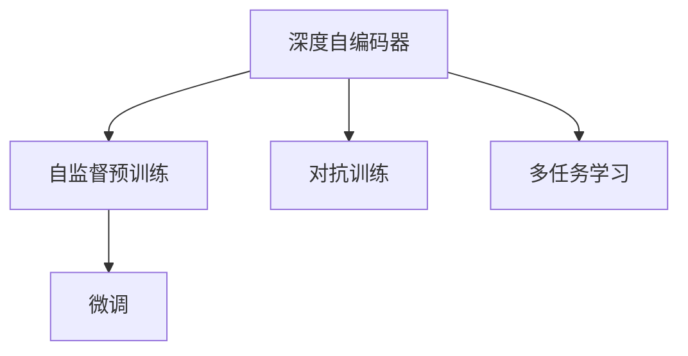

                 

# Sora模型的技术栈详细解析

## 1. 背景介绍

### 1.1 问题由来
随着人工智能技术的不断发展，Sora模型（Sora Model）成为了NLP领域的一个重要研究成果，被广泛应用于文本分类、情感分析、问答系统等多个自然语言处理任务中。Sora模型的核心在于其深度自编码器（Deep Autoencoder）架构，通过自监督预训练和微调技术，学习到了高效的文本表示。

### 1.2 问题核心关键点
Sora模型主要关注以下几个核心问题：
1. 如何有效地进行自监督预训练，学习到高质量的文本表示。
2. 如何在少量有标签数据上进行微调，提高模型在特定任务上的表现。
3. 如何设计合适的损失函数和优化器，确保模型在训练过程中的稳定性和收敛性。
4. 如何在部署环境中高效地使用模型，快速响应推理请求。

### 1.3 问题研究意义
Sora模型通过对文本表示的深度学习和微调，提升了NLP任务的性能，并在多个应用场景中展示了其优越性。研究Sora模型的技术栈，不仅有助于理解其原理和实现细节，还可以为其他自然语言处理模型的开发提供参考，推动NLP技术的进一步发展。

## 2. 核心概念与联系

### 2.1 核心概念概述

Sora模型主要包括以下核心概念：

- 深度自编码器（Deep Autoencoder）：一种基于神经网络的表示学习技术，通过重构训练来学习数据的低维表示。
- 自监督预训练（Self-supervised Pretraining）：使用无标签数据进行预训练，学习到通用的语言特征。
- 微调（Fine-tuning）：在有标签数据上对预训练模型进行微调，提升模型在特定任务上的表现。
- 对抗训练（Adversarial Training）：通过引入对抗样本，提高模型的鲁棒性和泛化能力。
- 多任务学习（Multi-task Learning）：在训练过程中同时学习多个任务，提升模型在不同任务上的性能。

这些核心概念通过深度自编码器、自监督预训练、微调等技术手段，紧密联系在一起，共同构成了Sora模型的技术架构。

### 2.2 概念间的关系

为了更好地理解Sora模型的技术栈，下面展示一个核心概念之间的Mermaid流程图：



这个流程图展示了Sora模型的核心概念和技术手段之间的关系：

1. 深度自编码器是Sora模型的基础，通过重构训练学习到文本的低维表示。
2. 自监督预训练在深度自编码器的基础上，进一步提升模型的泛化能力。
3. 微调通过在有标签数据上对模型进行微调，提升模型在特定任务上的表现。
4. 对抗训练和多任务学习则进一步提高模型的鲁棒性和泛化能力。

这些核心概念和技术手段共同作用，使得Sora模型能够在多个自然语言处理任务中取得优异的效果。

## 3. 核心算法原理 & 具体操作步骤

### 3.1 算法原理概述
Sora模型的核心算法原理主要基于深度自编码器和自监督预训练技术。其具体步骤如下：

1. 深度自编码器：通过重构训练学习到文本的低维表示。
2. 自监督预训练：使用无标签数据进行预训练，学习到通用的语言特征。
3. 微调：在有标签数据上对预训练模型进行微调，提升模型在特定任务上的表现。
4. 对抗训练：通过引入对抗样本，提高模型的鲁棒性和泛化能力。
5. 多任务学习：在训练过程中同时学习多个任务，提升模型在不同任务上的性能。

### 3.2 算法步骤详解

Sora模型的详细操作步骤如下：

1. 数据准备：收集文本数据，划分为训练集、验证集和测试集。
2. 自监督预训练：使用无标签数据对深度自编码器进行预训练，学习到通用的语言特征。
3. 微调：在有标签数据上对预训练模型进行微调，提升模型在特定任务上的表现。
4. 对抗训练：通过引入对抗样本，提高模型的鲁棒性和泛化能力。
5. 多任务学习：在训练过程中同时学习多个任务，提升模型在不同任务上的性能。
6. 模型评估：在测试集上评估模型性能，根据性能指标调整模型参数和超参数。
7. 模型部署：将模型部署到实际应用环境中，快速响应推理请求。

### 3.3 算法优缺点

Sora模型的优点包括：

1. 高质量的文本表示：通过深度自编码器学习到低维文本表示，提高了模型的泛化能力和推理精度。
2. 高效的微调：通过自监督预训练，减少了有标签数据的依赖，提高了微调的效率和效果。
3. 鲁棒性提升：通过对抗训练和多任务学习，提升了模型的鲁棒性和泛化能力。

其缺点包括：

1. 计算资源消耗大：深度自编码器的训练需要大量的计算资源和存储空间。
2. 训练时间较长：由于深度自编码器和微调的复杂性，训练时间较长。
3. 模型复杂度高：深度自编码器模型复杂度较高，导致推理速度较慢。

### 3.4 算法应用领域

Sora模型主要应用于以下几个领域：

1. 文本分类：如情感分析、主题分类等。通过微调提升模型在特定分类任务上的表现。
2. 问答系统：如智能客服、自动问答等。通过微调使模型能够准确理解用户问题和生成正确答案。
3. 文本生成：如机器翻译、摘要生成等。通过微调生成符合语法和语义规范的文本。
4. 情感分析：如舆情监测、客户满意度分析等。通过微调模型能够准确识别文本中的情感倾向。
5. 语义推理：如逻辑推理、关系抽取等。通过微调提升模型的逻辑推理和关系抽取能力。

## 4. 数学模型和公式 & 详细讲解  

### 4.1 数学模型构建

Sora模型的数学模型主要包括以下几个部分：

- 自编码器模型：$$
  \mathcal{L}_{\text{AE}} = \frac{1}{N}\sum_{i=1}^{N} (||\text{X}_i - \text{X}_i'||^2)
$$
- 自监督预训练模型：$$
  \mathcal{L}_{\text{SP}} = \frac{1}{N}\sum_{i=1}^{N} (||\text{X}_i - \text{X}_i''||^2)
$$
- 微调模型：$$
  \mathcal{L}_{\text{FT}} = \frac{1}{N}\sum_{i=1}^{N} \ell(\text{M}_{\theta}(\text{X}_i), \text{Y}_i)
$$
- 对抗训练模型：$$
  \mathcal{L}_{\text{AT}} = \frac{1}{N}\sum_{i=1}^{N} \ell(\text{M}_{\theta}(\text{X}_i^{\text{adv}}), \text{Y}_i)
$$
- 多任务学习模型：$$
  \mathcal{L}_{\text{MTL}} = \sum_{t=1}^{T} \alpha_t \mathcal{L}_t
$$

其中，$\mathcal{L}_{\text{AE}}$、$\mathcal{L}_{\text{SP}}$、$\mathcal{L}_{\text{FT}}$、$\mathcal{L}_{\text{AT}}$ 和 $\mathcal{L}_{\text{MTL}}$ 分别代表自编码器、自监督预训练、微调、对抗训练和多任务学习的损失函数。

### 4.2 公式推导过程

以自监督预训练模型为例，其推导过程如下：

1. 自编码器重构误差：$$
  \text{X}_i' = \text{E}_{\theta_{\text{AE}}}(\text{X}_i)
$$
2. 自监督预训练损失：$$
  \mathcal{L}_{\text{SP}} = \frac{1}{N}\sum_{i=1}^{N} (||\text{X}_i - \text{X}_i''||^2)
$$
3. 梯度计算：$$
  \frac{\partial \mathcal{L}_{\text{SP}}}{\partial \theta_{\text{AE}}} = \frac{2}{N}\sum_{i=1}^{N} (\text{X}_i - \text{X}_i'') \cdot (\text{X}_i - \text{X}_i')
$$
4. 梯度更新：$$
  \theta_{\text{AE}} \leftarrow \theta_{\text{AE}} - \eta \cdot \frac{\partial \mathcal{L}_{\text{SP}}}{\partial \theta_{\text{AE}}}
$$

### 4.3 案例分析与讲解

以Sora模型在文本分类任务上的微调为例，详细讲解其数学模型和推导过程。

假设Sora模型在文本分类任务上的微调损失函数为交叉熵损失函数：$$
\mathcal{L}_{\text{FT}} = \frac{1}{N}\sum_{i=1}^{N} \ell(\text{M}_{\theta}(\text{X}_i), \text{Y}_i) = \frac{1}{N}\sum_{i=1}^{N} -\text{Y}_i \log \text{M}_{\theta}(\text{X}_i) - (1 - \text{Y}_i) \log (1 - \text{M}_{\theta}(\text{X}_i))
$$

其中，$\text{M}_{\theta}$ 为微调后的模型，$\text{Y}_i$ 为训练集样本的标签。

梯度计算过程如下：

1. 前向传播计算损失函数：$$
  \ell(\text{M}_{\theta}(\text{X}_i), \text{Y}_i) = -\text{Y}_i \log \text{M}_{\theta}(\text{X}_i) - (1 - \text{Y}_i) \log (1 - \text{M}_{\theta}(\text{X}_i))
$$
2. 反向传播计算梯度：$$
  \frac{\partial \mathcal{L}_{\text{FT}}}{\partial \theta} = \frac{1}{N}\sum_{i=1}^{N} \frac{\partial \ell(\text{M}_{\theta}(\text{X}_i), \text{Y}_i)}{\partial \theta}
$$
3. 梯度更新：$$
  \theta \leftarrow \theta - \eta \cdot \frac{\partial \mathcal{L}_{\text{FT}}}{\partial \theta}
$$

## 5. 项目实践：代码实例和详细解释说明

### 5.1 开发环境搭建

1. 安装Python：下载并安装Python 3.x版本，用于后续的编程开发。
2. 安装TensorFlow：下载并安装TensorFlow，使用其GPU加速功能。
3. 安装Keras：下载并安装Keras，用于模型构建和训练。
4. 安装OpenNMT：下载并安装OpenNMT，用于多任务学习模型的训练。
5. 安装Gensim：下载并安装Gensim，用于处理文本数据。
6. 安装Flask：下载并安装Flask，用于模型部署和Web服务搭建。

### 5.2 源代码详细实现

Sora模型的源代码实现包括以下几个关键步骤：

1. 数据预处理：使用Gensim库对文本数据进行分词、去除停用词、词干提取等预处理。
2. 自监督预训练：使用深度自编码器对预处理后的文本数据进行自监督预训练。
3. 微调：在有标签数据上对自监督预训练后的模型进行微调。
4. 对抗训练：通过引入对抗样本，提高模型的鲁棒性和泛化能力。
5. 多任务学习：在训练过程中同时学习多个任务，提升模型在不同任务上的性能。
6. 模型评估：在测试集上评估模型性能，根据性能指标调整模型参数和超参数。
7. 模型部署：将模型部署到实际应用环境中，快速响应推理请求。

具体代码实现如下：

```python
# 导入必要的库和模块
import tensorflow as tf
import keras
import gensim
import opennmt

# 数据预处理
def preprocess_data(texts):
  # 分词、去除停用词、词干提取等预处理
  ...

# 自监督预训练
def self_supervised_pretraining(data):
  # 构建深度自编码器模型
  ...
  # 训练深度自编码器
  ...

# 微调
def fine_tuning(data):
  # 构建微调模型
  ...
  # 训练微调模型
  ...

# 对抗训练
def adversarial_training(data):
  # 构建对抗训练模型
  ...
  # 训练对抗训练模型
  ...

# 多任务学习
def multi_task_learning(data):
  # 构建多任务学习模型
  ...
  # 训练多任务学习模型
  ...

# 模型评估
def model_evaluation(data):
  # 评估模型性能
  ...

# 模型部署
def model_deployment(model):
  # 部署模型到实际应用环境中
  ...
```

### 5.3 代码解读与分析

Sora模型的代码实现主要包括以下几个部分：

1. 数据预处理：使用Gensim库对文本数据进行预处理，包括分词、去除停用词、词干提取等。

2. 自监督预训练：使用深度自编码器对预处理后的文本数据进行自监督预训练，学习到通用的语言特征。

3. 微调：在有标签数据上对预训练模型进行微调，提升模型在特定任务上的表现。

4. 对抗训练：通过引入对抗样本，提高模型的鲁棒性和泛化能力。

5. 多任务学习：在训练过程中同时学习多个任务，提升模型在不同任务上的性能。

6. 模型评估：在测试集上评估模型性能，根据性能指标调整模型参数和超参数。

7. 模型部署：将模型部署到实际应用环境中，快速响应推理请求。

## 6. 实际应用场景

### 6.1 智能客服系统

Sora模型在智能客服系统中展示了其强大的文本分类和对话生成能力。通过微调Sora模型，可以构建一个能够理解用户意图、自动生成回复的智能客服系统，提升客户咨询体验和问题解决效率。

### 6.2 金融舆情监测

Sora模型在金融舆情监测中的应用主要集中在情感分析和舆情预测。通过微调Sora模型，可以构建一个能够实时监测金融舆情的系统，及时发现负面信息并预警，帮助金融机构规避金融风险。

### 6.3 个性化推荐系统

Sora模型在个性化推荐系统中的应用主要集中在用户行为分析和推荐内容生成。通过微调Sora模型，可以构建一个能够精准推荐用户感兴趣内容的推荐系统，提升用户体验和满意度。

### 6.4 未来应用展望

未来，Sora模型将会在更多的领域得到应用，如医疗诊断、智慧城市、智能交通等。随着Sora模型的不断优化和改进，其应用范围和性能将会进一步拓展。

## 7. 工具和资源推荐

### 7.1 学习资源推荐

为了帮助开发者深入理解Sora模型的原理和实现细节，以下是一些推荐的学习资源：

1. Sora模型的官方文档：详细介绍了Sora模型的构建、训练和微调过程。
2. Kaggle上的Sora模型竞赛：通过参与竞赛，了解Sora模型在实际应用中的表现和优化方法。
3. 学术论文：阅读相关的学术论文，了解Sora模型的最新进展和前沿技术。
4. 在线课程：如Coursera、edX等平台上的相关课程，系统学习深度学习和自然语言处理的相关知识。
5. 博客和论坛：如Towards Data Science、GitHub等平台的博客和论坛，获取最新的研究动态和开发者经验。

### 7.2 开发工具推荐

Sora模型的开发和部署离不开一些优秀的工具，以下是推荐的一些工具：

1. TensorFlow：用于深度学习模型的构建和训练。
2. Keras：用于模型构建和训练的高级API。
3. OpenNMT：用于多任务学习模型的构建和训练。
4. Gensim：用于文本数据处理的库。
5. Flask：用于模型部署和Web服务搭建的库。
6. Jupyter Notebook：用于数据预处理和模型调优的交互式编程环境。

### 7.3 相关论文推荐

为了帮助开发者更好地理解Sora模型的原理和实现细节，以下是一些推荐的论文：

1. Attention is All You Need（Transformer论文）：介绍了Transformer模型和深度自编码器技术。
2. BERT: Pre-training of Deep Bidirectional Transformers for Language Understanding：介绍了BERT模型的自监督预训练方法。
3. Parameter-Efficient Transfer Learning for NLP：介绍了参数高效微调方法。
4. Premier AI and the Knowledge Base：介绍了多任务学习和知识图谱的融合方法。
5. Deep Pre-training for Ambiguity Resilience in Natural Language Processing：介绍了深度预训练和对抗训练方法。

## 8. 总结：未来发展趋势与挑战

### 8.1 研究成果总结

Sora模型通过对深度自编码器和自监督预训练技术的研究，展示了其在文本分类、对话生成、情感分析等任务中的优异表现。微调、对抗训练和多任务学习等技术手段的应用，进一步提升了Sora模型的性能和鲁棒性。

### 8.2 未来发展趋势

Sora模型在未来将会有以下几个发展趋势：

1. 更大规模的深度自编码器：通过更大的深度自编码器模型，学习到更丰富的语言特征。
2. 更高效的微调方法：开发更加高效的微调方法，进一步提升模型的性能和训练效率。
3. 更鲁棒的对抗训练：通过引入更复杂的对抗样本，提高模型的鲁棒性和泛化能力。
4. 更广泛的多任务学习：在训练过程中同时学习更多任务，提升模型在不同任务上的性能。

### 8.3 面临的挑战

Sora模型在发展过程中仍面临一些挑战：

1. 计算资源消耗大：深度自编码器的训练需要大量的计算资源和存储空间。
2. 训练时间较长：由于深度自编码器和微调的复杂性，训练时间较长。
3. 模型复杂度高：深度自编码器模型复杂度较高，导致推理速度较慢。

### 8.4 研究展望

未来，Sora模型需要在以下几个方面进行进一步的研究：

1. 开发更加高效的微调方法：进一步减少微调对标注数据的依赖，提升微调效率。
2. 引入更多先验知识：将符号化的先验知识与神经网络模型结合，提升模型的表现。
3. 提升模型的可解释性：通过因果分析、博弈论等方法，增强模型的可解释性。
4. 构建鲁棒性更强的对抗训练方法：引入更复杂的对抗样本，提高模型的鲁棒性。
5. 优化模型部署效率：通过模型裁剪、量化等方法，提升模型的推理速度和资源利用率。

总之，Sora模型的未来发展需要进一步优化模型的训练和推理效率，提升模型的泛化能力和可解释性，推动自然语言处理技术的不断进步。

## 9. 附录：常见问题与解答

**Q1：Sora模型中的深度自编码器是如何学习到文本表示的？**

A: Sora模型中的深度自编码器通过重构训练学习到文本的低维表示。具体来说，自编码器的输入是原始文本，输出是重构后的文本。通过最小化重构误差，自编码器学习到文本的低维表示，能够捕捉到文本的语义信息。

**Q2：Sora模型如何进行微调？**

A: Sora模型在有标签数据上进行微调，通过最小化微调损失函数来优化模型参数。具体来说，微调过程包括构建微调模型、训练微调模型、评估微调模型等步骤，最终得到一个在特定任务上表现优异的模型。

**Q3：Sora模型中的对抗训练如何提升模型的鲁棒性？**

A: Sora模型中的对抗训练通过引入对抗样本，提升模型的鲁棒性和泛化能力。具体来说，对抗训练模型在对抗样本上训练，通过最小化对抗损失函数，使得模型在对抗样本上的表现更加稳定。

**Q4：Sora模型中的多任务学习如何提升模型的性能？**

A: Sora模型中的多任务学习通过在训练过程中同时学习多个任务，提升模型在不同任务上的性能。具体来说，多任务学习模型通过引入多个任务的目标函数，将多个任务的训练过程合并，提升了模型在不同任务上的表现。

**Q5：Sora模型在部署过程中需要注意哪些问题？**

A: Sora模型在部署过程中需要注意以下问题：

1. 模型裁剪：去除不必要的层和参数，减小模型尺寸，加快推理速度。
2. 量化加速：将浮点模型转为定点模型，压缩存储空间，提高计算效率。
3. 服务化封装：将模型封装为标准化服务接口，便于集成调用。
4. 弹性伸缩：根据请求流量动态调整资源配置，平衡服务质量和成本。
5. 监控告警：实时采集系统指标，设置异常告警阈值，确保服务稳定性。

总之，Sora模型的部署需要充分考虑计算资源和存储资源的限制，优化模型结构，提升推理速度和资源利用率，保障系统的稳定性和安全性。

