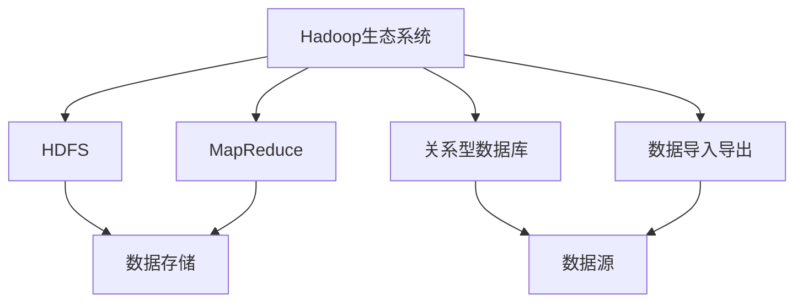

                 

# Sqoop原理与代码实例讲解

## 1. 背景介绍

### 1.1 问题由来

随着大数据技术的发展，企业在处理海量数据时，往往需要从多个异构数据源中提取数据，进行数据整合。传统的ETL（Extract, Transform, Load）流程复杂、易出错，且难以管理大规模数据迁移。Sqoop作为一种开源工具，可以简化数据迁移的过程，满足企业数据整合的需求。

### 1.2 问题核心关键点

Sqoop通过将Hadoop生态系统与关系型数据库（如MySQL、PostgreSQL等）之间进行数据交换，解决了ETL过程中数据源异构、数据格式多样、数据量大等挑战。其核心关键点包括：

- 数据导入导出：Sqoop支持将关系型数据库中的数据导入到Hadoop中，或者将Hadoop中的数据导出到关系型数据库中。
- 数据格式转换：Sqoop可以处理多种数据格式，支持文本、JSON、XML等数据格式的转换。
- 大规模数据处理：Sqoop支持大规模数据迁移，能够处理TB级数据量。
- 数据源多样化：Sqoop支持多种数据源，包括关系型数据库、NoSQL数据库、Hive等。

### 1.3 问题研究意义

掌握Sqoop技术，对于企业数据整合、大数据分析、数据存储等方面具有重要意义：

1. **提升数据处理效率**：Sqoop简化了数据迁移过程，提高了数据处理的效率和准确性。
2. **支持多种数据源**：Sqoop支持多种数据源，满足企业多源数据整合的需求。
3. **大数据与关系型数据库的桥梁**：Sqoop充当了大数据与关系型数据库之间的桥梁，促进了数据的互通互用。
4. **降低开发和运维成本**：使用Sqoop进行数据迁移，可以减少开发和运维成本，提高数据处理的自动化水平。
5. **提升数据安全性和可靠性**：Sqoop支持数据加密和数据一致性校验，提高了数据的安全性和可靠性。

## 2. 核心概念与联系

### 2.1 核心概念概述

Sqoop作为一种数据迁移工具，涉及多个核心概念，包括：

- **Hadoop生态系统**：Hadoop包括HDFS、MapReduce等组件，用于分布式存储和处理大数据。
- **关系型数据库**：如MySQL、PostgreSQL等，用于存储结构化数据。
- **数据格式转换**：包括文本、JSON、XML等多种数据格式。
- **数据导入导出**：将数据从关系型数据库导入Hadoop，或将Hadoop中的数据导出到关系型数据库。

### 2.2 概念间的关系

这些核心概念之间存在着紧密的联系，形成了Sqoop的完整数据迁移生态系统。以下是通过Mermaid流程图展示的概念关系：



## 3. 核心算法原理 & 具体操作步骤

### 3.1 算法原理概述

Sqoop的核心算法原理可以概括为：

1. **数据格式解析**：将数据源中的数据解析为Sqoop支持的数据格式。
2. **数据格式转换**：将数据转换为Hadoop支持的格式。
3. **数据导入导出**：将数据从数据源导入Hadoop，或将Hadoop中的数据导出到数据源。

### 3.2 算法步骤详解

Sqoop数据迁移主要包括以下几个关键步骤：

1. **配置环境**：安装Sqoop，并配置好Hadoop和关系型数据库环境。
2. **定义数据源和目标**：指定数据源和目标，包括关系型数据库表、Hadoop目录等。
3. **设置导入导出参数**：设置导入或导出参数，如字段映射、文件格式、数据压缩等。
4. **执行数据迁移**：执行数据迁移操作，包括数据导入和数据导出。
5. **监控和处理异常**：监控数据迁移过程，处理可能出现的异常。

### 3.3 算法优缺点

Sqoop的优点包括：

- **简化数据迁移过程**：Sqoop提供了可视化的界面和命令行工具，简化了数据迁移操作。
- **支持多种数据源**：Sqoop支持多种数据源，包括关系型数据库、NoSQL数据库、Hive等。
- **数据格式灵活**：Sqoop支持多种数据格式，包括文本、JSON、XML等。
- **分布式处理**：Sqoop可以利用Hadoop的分布式处理能力，处理大规模数据。

Sqoop的缺点包括：

- **性能瓶颈**：Sqoop在处理大规模数据时，性能可能存在瓶颈，需要进行优化。
- **不支持实时数据处理**：Sqoop主要适用于批量数据迁移，不适用于实时数据处理。
- **依赖性较强**：Sqoop依赖于Hadoop生态系统，部署和运维复杂。

### 3.4 算法应用领域

Sqoop广泛应用于大数据领域，包括数据整合、大数据分析、数据存储等多个方面。具体应用领域包括：

- **数据仓库**：将关系型数据库中的数据导入Hadoop进行数据分析。
- **数据备份和恢复**：将数据从关系型数据库备份到Hadoop，或从Hadoop恢复数据到关系型数据库。
- **日志数据处理**：将日志数据从应用程序导出到Hadoop进行分析和存储。
- **ETL流程**：将数据从关系型数据库导入Hadoop，进行ETL流程处理。
- **数据集成**：将数据从不同数据源集成到Hadoop中，进行统一处理和分析。

## 4. 数学模型和公式 & 详细讲解 & 举例说明

### 4.1 数学模型构建

Sqoop的数据迁移过程涉及多个数学模型，包括数据格式解析、数据格式转换、数据导入导出等。

假设关系型数据库中的数据格式为：

$$
\begin{align*}
\text{Name} &: \text{String} \\
\text{Age} &: \text{Integer} \\
\text{Email} &: \text{String} \\
\text{Address} &: \text{String}
\end{align*}
$$

Hadoop中的数据格式为：

$$
\begin{align*}
\text{Name} &: \text{String} \\
\text{Age} &: \text{Int} \\
\text{Email} &: \text{String} \\
\text{Address} &: \text{String}
\end{align*}
$$

### 4.2 公式推导过程

数据导入Hadoop的公式推导如下：

1. **解析数据**：将关系型数据库中的数据解析为Sqoop支持的数据格式。
2. **数据格式转换**：将数据转换为Hadoop支持的格式。
3. **数据导入**：将数据导入Hadoop。

数据导出的公式推导如下：

1. **解析数据**：将Hadoop中的数据解析为Sqoop支持的数据格式。
2. **数据格式转换**：将数据转换为关系型数据库支持的格式。
3. **数据导出**：将数据导出到关系型数据库。

### 4.3 案例分析与讲解

假设有一个公司数据仓库，需要将MySQL中的销售数据导入Hadoop中进行数据分析。具体步骤如下：

1. **配置环境**：在Hadoop集群上安装Sqoop，并配置好MySQL环境。
2. **定义数据源和目标**：指定MySQL表和Hadoop目录。
3. **设置导入参数**：设置字段映射、文件格式、数据压缩等参数。
4. **执行数据导入**：执行数据导入操作，将MySQL数据导入Hadoop。
5. **监控和处理异常**：监控数据导入过程，处理可能出现的异常。

## 5. 项目实践：代码实例和详细解释说明

### 5.1 开发环境搭建

在开始Sqoop项目实践之前，需要搭建好开发环境。以下是Python环境的搭建流程：

1. 安装Anaconda：从官网下载并安装Anaconda，用于创建独立的Python环境。
2. 创建并激活虚拟环境：
```bash
conda create -n sqoop-env python=3.8 
conda activate sqoop-env
```

3. 安装依赖包：
```bash
pip install apache-sqoop
```

### 5.2 源代码详细实现

以下是使用Python实现Sqoop数据导入的示例代码：

```python
from apache.sqoop import Sqoop

# 创建Sqoop对象
sqoop = Sqoop()

# 定义数据源和目标
sqoop.connect(table='mytable', db='mydb', host='myhost', port='3306', user='myuser', password='mypassword')
sqoop.target(dir='mydir', format='text')

# 设置导入参数
sqoop.import_data()

# 执行数据导入
sqoop.import_data()
```

### 5.3 代码解读与分析

让我们再详细解读一下关键代码的实现细节：

**Sqoop对象创建**：
- 使用`apache.sqoop.Sqoop()`创建Sqoop对象。

**数据源和目标定义**：
- 使用`connect()`方法定义数据源和目标，包括MySQL表、数据库、主机、端口、用户名、密码等。
- 使用`target()`方法设置目标路径和格式，包括Hadoop目录和数据格式。

**导入参数设置**：
- 设置字段映射、数据格式、压缩方式等导入参数，确保数据格式正确。

**执行数据导入**：
- 使用`import_data()`方法执行数据导入操作。

### 5.4 运行结果展示

假设在Hadoop上成功导入了MySQL数据，可以通过以下命令查看导入结果：

```bash
hdfs dfs -ls /mydir
```

## 6. 实际应用场景

### 6.1 大数据仓库

Sqoop在大数据仓库的应用中发挥了重要作用。大数据仓库通常需要从关系型数据库中导入数据，进行分析和存储。使用Sqoop可以快速地将数据从MySQL、PostgreSQL等关系型数据库导入Hadoop，满足大数据分析的需求。

### 6.2 数据备份和恢复

在数据备份和恢复过程中，Sqoop可以将数据从关系型数据库备份到Hadoop，或从Hadoop恢复数据到关系型数据库。这种数据备份和恢复操作，可以保障数据的安全性和可靠性，防止数据丢失。

### 6.3 日志数据处理

Sqoop可以将日志数据从应用程序导出到Hadoop进行分析和存储。日志数据是大数据分析的重要数据源之一，使用Sqoop可以方便地将日志数据集成到Hadoop中，进行统一处理和分析。

### 6.4 数据集成

Sqoop可以将数据从不同数据源集成到Hadoop中，进行统一处理和分析。数据集成是数据整合的关键步骤，Sqoop支持多种数据源，可以方便地进行数据集成操作。

## 7. 工具和资源推荐

### 7.1 学习资源推荐

为了帮助开发者系统掌握Sqoop技术，这里推荐一些优质的学习资源：

1. Apache Sqoop官方文档：Apache Sqoop的官方文档，提供了完整的API文档和开发指南，是学习Sqoop的必备资源。
2. Hadoop大数据教程：Hadoop官方提供的教程，介绍了Hadoop的基础知识和开发实践，是学习大数据技术的必备资源。
3. Sqoop实战案例：根据实际案例学习Sqoop的使用方法和最佳实践，提升实战能力。
4. 《Sqoop实战：从数据导入到数据导出》书籍：详细讲解了Sqoop的使用方法、最佳实践和案例分析，是学习Sqoop的权威参考书籍。

通过对这些资源的学习实践，相信你一定能够快速掌握Sqoop技术，并用于解决实际的数据迁移问题。

### 7.2 开发工具推荐

Sqoop作为一款数据迁移工具，适用于多种开发环境。以下是几款常用的开发工具：

1. Apache Hadoop：Sqoop的底层生态系统，用于分布式存储和处理大数据。
2. MySQL/PostgreSQL：常见的关系型数据库，用于存储结构化数据。
3. PySpark：Python语言的Spark API，用于大数据分析和处理。
4. Hive：基于Hadoop的数据仓库，用于数据存储和查询。
5. Jupyter Notebook：交互式开发环境，支持Python、Java等多种语言。

合理利用这些工具，可以显著提升Sqoop数据迁移的开发效率，加快创新迭代的步伐。

### 7.3 相关论文推荐

Sqoop技术的发展源于学界的持续研究。以下是几篇奠基性的相关论文，推荐阅读：

1. "Sqoop: A tool for SQL developers to use Hadoop"（Sqoop: A tool for SQL developers to use Hadoop）：Sqoop的创始人介绍了Sqoop的基本概念和使用方法。
2. "Performance Tuning of Sqoop Data Import and Export Process"（Sqoop数据导入和导出的性能调优）：详细讨论了Sqoop的性能调优方法，包括数据格式、压缩方式、并发控制等。
3. "Data Migration with Sqoop in Hadoop"（基于Hadoop的Sqoop数据迁移）：介绍了在Hadoop环境中使用Sqoop进行数据迁移的实现方法和最佳实践。

这些论文代表了大数据技术的发展脉络。通过学习这些前沿成果，可以帮助研究者把握学科前进方向，激发更多的创新灵感。

## 8. 总结：未来发展趋势与挑战

### 8.1 总结

本文对Sqoop技术进行了全面系统的介绍。首先阐述了Sqoop的数据迁移原理和应用背景，明确了数据迁移在大数据分析和数据存储中的重要作用。其次，从原理到实践，详细讲解了Sqoop的数学模型和具体操作步骤，给出了Sqoop数据迁移的完整代码实例。同时，本文还广泛探讨了Sqoop技术在实际应用中的多种场景，展示了Sqoop技术的广阔应用前景。

通过本文的系统梳理，可以看到，Sqoop作为数据迁移工具，极大地简化了大数据迁移过程，降低了数据处理的成本和复杂度。未来，伴随大数据技术的持续演进，Sqoop必将在更多领域得到广泛应用，为数据的整合、分析和存储提供强有力的支持。

### 8.2 未来发展趋势

展望未来，Sqoop技术将呈现以下几个发展趋势：

1. **支持更多数据源**：Sqoop将支持更多的数据源，包括NoSQL数据库、流数据等，满足不同类型数据的迁移需求。
2. **提高性能和效率**：Sqoop将通过优化算法和工具，提高数据迁移的性能和效率，支持大规模数据的迁移。
3. **引入更多功能**：Sqoop将引入更多功能，如数据清洗、数据转换、数据治理等，满足企业数据整合的需求。
4. **支持多云环境**：Sqoop将支持多云环境，支持在不同云平台之间的数据迁移，提高数据迁移的灵活性。
5. **与大数据生态系统深度集成**：Sqoop将与Hadoop、Spark等大数据生态系统深度集成，提供更完整的数据迁移解决方案。

以上趋势凸显了Sqoop技术的广阔前景。这些方向的探索发展，必将进一步提升Sqoop数据迁移的性能和应用范围，为数据整合提供更全面的支持。

### 8.3 面临的挑战

尽管Sqoop技术已经取得了显著成就，但在迈向更加智能化、普适化应用的过程中，仍面临诸多挑战：

1. **数据格式多样性**：Sqoop需要支持多种数据格式，如文本、JSON、XML等，不同格式的数据需要解析和转换，增加了复杂性。
2. **性能瓶颈**：Sqoop在处理大规模数据时，性能可能存在瓶颈，需要进行优化。
3. **依赖性较强**：Sqoop依赖于Hadoop生态系统，部署和运维复杂。
4. **实时数据处理**：Sqoop主要适用于批量数据迁移，不适用于实时数据处理。
5. **安全性**：Sqoop需要保证数据传输和存储的安全性，防止数据泄露和篡改。

### 8.4 研究展望

面对Sqoop技术面临的挑战，未来的研究需要在以下几个方面寻求新的突破：

1. **优化数据格式解析和转换**：引入更多数据格式解析和转换算法，提高解析和转换的效率和准确性。
2. **提高数据迁移性能**：优化数据迁移算法和工具，支持大规模数据的迁移，提高迁移效率和性能。
3. **引入更多功能**：引入更多数据迁移功能，如数据清洗、数据转换、数据治理等，提升数据迁移的完整性和可靠性。
4. **支持多云环境**：支持在不同云平台之间的数据迁移，提高数据迁移的灵活性和可靠性。
5. **与大数据生态系统深度集成**：与Hadoop、Spark等大数据生态系统深度集成，提供更完整的数据迁移解决方案。
6. **引入安全性保障**：引入数据加密和访问控制等安全性保障措施，防止数据泄露和篡改。

这些研究方向的探索，必将引领Sqoop技术迈向更高的台阶，为数据迁移提供更全面、高效、安全的解决方案。总之，Sqoop需要从多个方面进行优化和扩展，方能满足企业数据迁移的复杂需求，推动大数据技术的持续演进。

## 9. 附录：常见问题与解答

**Q1：Sqoop支持哪些数据源？**

A: Sqoop支持多种数据源，包括MySQL、PostgreSQL、Hive、HBase、Cassandra等。

**Q2：Sqoop的数据格式有哪些？**

A: Sqoop支持多种数据格式，包括文本、JSON、XML等。

**Q3：Sqoop的性能瓶颈有哪些？**

A: Sqoop在处理大规模数据时，性能可能存在瓶颈，需要进行优化。优化方法包括数据格式转换、数据压缩、并发控制等。

**Q4：Sqoop是否支持实时数据处理？**

A: Sqoop主要适用于批量数据迁移，不适用于实时数据处理。

**Q5：Sqoop与Hadoop生态系统的关系是什么？**

A: Sqoop与Hadoop生态系统深度集成，支持HDFS和MapReduce等组件，提供分布式数据迁移的解决方案。

总之，Sqoop作为一款强大的数据迁移工具，具有广泛的应用前景。通过深入理解其原理和实现，能够更好地解决数据迁移中的各种问题，推动大数据技术的发展和应用。

---

作者：禅与计算机程序设计艺术 / Zen and the Art of Computer Programming

